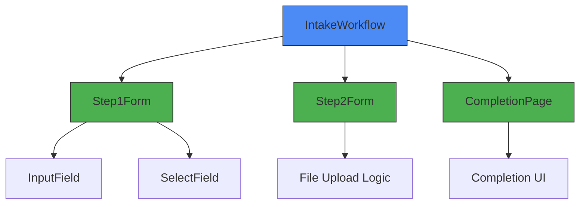
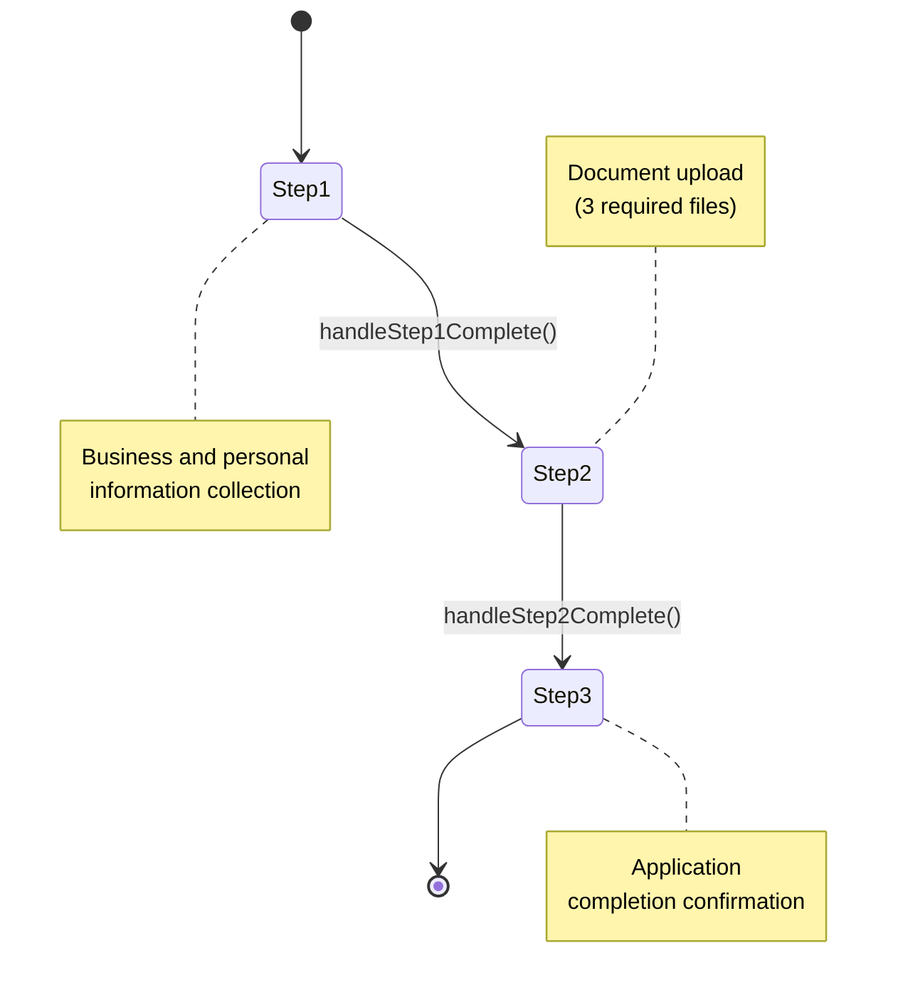
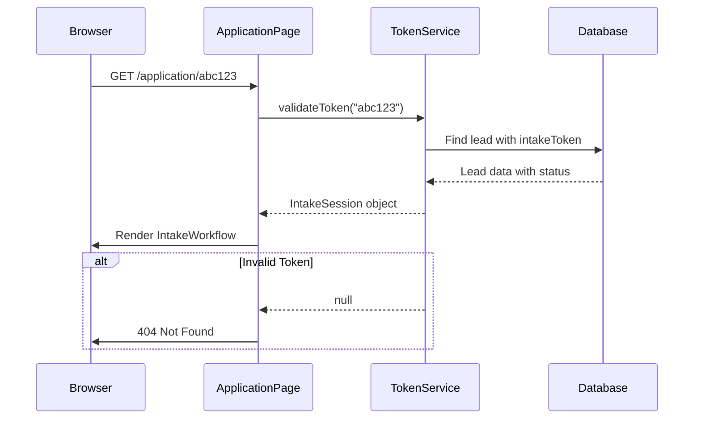
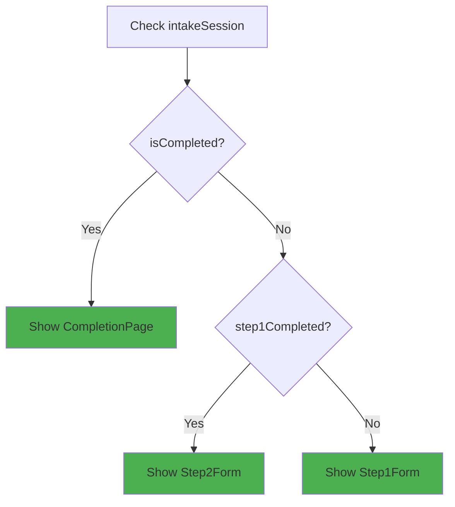
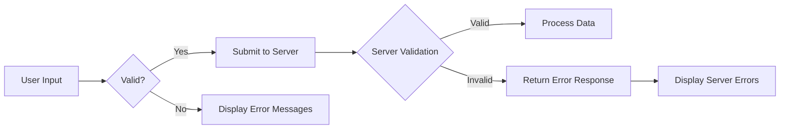
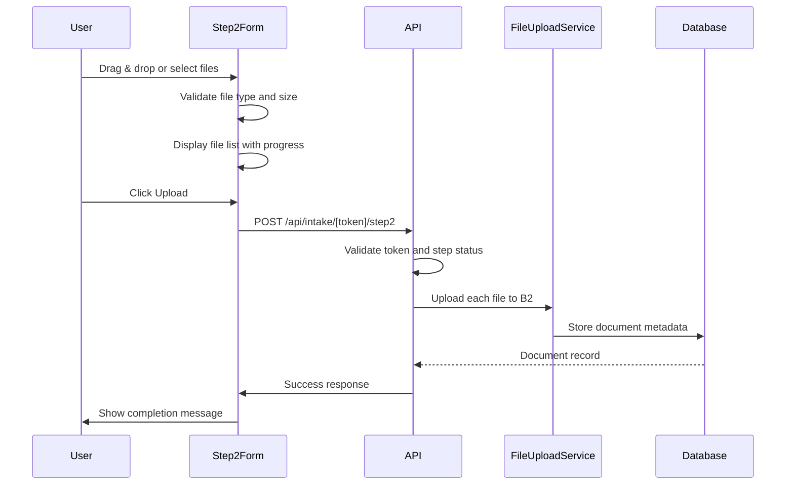

# Intake User Interface Workflow

<cite>
**Referenced Files in This Document**   
- [IntakeWorkflow.tsx](file://src/components/intake/IntakeWorkflow.tsx)
- [Step1Form.tsx](file://src/components/intake/Step1Form.tsx)
- [Step2Form.tsx](file://src/components/intake/Step2Form.tsx)
- [CompletionPage.tsx](file://src/components/intake/CompletionPage.tsx)
- [page.tsx](file://src/app/application/[token]/page.tsx)
- [TokenService.ts](file://src/services/TokenService.ts)
- [step1/route.ts](file://src/app/api/intake/[token]/step1/route.ts)
- [step2/route.ts](file://src/app/api/intake/[token]/step2/route.ts)
</cite>

## Table of Contents
1. [Intake User Interface Workflow](#intake-user-interface-workflow)
2. [IntakeWorkflow Component Architecture](#intakeworkflow-component-architecture)
3. [Step Navigation and State Management](#step-navigation-and-state-management)
4. [Progress Indicator Implementation](#progress-indicator-implementation)
5. [Routing and Token-Based Access Control](#routing-and-token-based-access-control)
6. [Conditional Rendering Logic](#conditional-rendering-logic)
7. [Form Validation and Error Handling](#form-validation-and-error-handling)
8. [Document Upload Process](#document-upload-process)
9. [Responsive Design and Mobile Usability](#responsive-design-and-mobile-usability)
10. [Session Management and Timeout Handling](#session-management-and-timeout-handling)

## IntakeWorkflow Component Architecture

The IntakeWorkflow component serves as the central orchestrator for the multi-step intake form experience, managing navigation between steps, preserving form state, and displaying progress indicators to users. This component is implemented as a client-side React component that receives an intake session object containing the user's current state in the intake process.

The architecture follows a state-driven approach where the current step is determined by the intake session's completion status. The component renders different form steps conditionally based on this state, providing a seamless user experience throughout the application process.



**Diagram sources**
- [IntakeWorkflow.tsx](file://src/components/intake/IntakeWorkflow.tsx#L1-L95)

**Section sources**
- [IntakeWorkflow.tsx](file://src/components/intake/IntakeWorkflow.tsx#L1-L95)

## Step Navigation and State Management

The IntakeWorkflow component manages navigation between steps through React's useState hook, initializing the current step based on the intake session's completion status. The component determines the starting step by evaluating the intake session properties:

- If intakeSession.isCompleted is true, the workflow starts at step 3 (completion)
- If intakeSession.step1Completed is true, the workflow starts at step 2 
- Otherwise, the workflow starts at step 1



Navigation between steps is handled through callback functions passed to each step component. When Step1Form completes validation, it calls the handleStep1Complete function, which updates the state to display Step2Form. Similarly, when Step2Form completes document upload, it calls handleStep2Complete to advance to the completion page.

The state management approach ensures that users can refresh the page without losing their place in the workflow, as the initial step is determined by the server-side intake session state rather than client-side storage.

**Section sources**
- [IntakeWorkflow.tsx](file://src/components/intake/IntakeWorkflow.tsx#L10-L33)

## Progress Indicator Implementation

The progress indicator provides visual feedback to users about their current position in the intake process. It displays two steps: "Personal Information" and "Document Upload," with visual indicators showing whether each step is upcoming, current, or completed.

The indicator uses a helper function getStepStatus(step: number) that returns the status of each step based on the current step:
- 'completed' for steps that have been finished
- 'current' for the active step
- 'upcoming' for steps yet to be reached

Visual elements include:
- Numbered circles that display checkmarks when completed
- Color coding: gray for upcoming, blue for current, green for completed
- Connecting lines that fill with green as steps are completed

The implementation uses conditional CSS classes to dynamically style the progress elements based on their status, providing clear visual feedback about the user's progress through the application process.

```mermaid
flowchart LR
A[Step 1 Circle] --> B[Connection Line] --> C[Step 2 Circle]
subgraph "Step 1: Personal Information"
A
style A fill:#4CAF50,stroke:#333,color:white
end
subgraph "Connection"
B
style B fill:#4CAF50,stroke:#333
end
subgraph "Step 2: Document Upload"
C
style C fill:#2196F3,stroke:#333,color:white
end
note over A: Completed Step
note over C: Current Step
```

**Section sources**
- [IntakeWorkflow.tsx](file://src/components/intake/IntakeWorkflow.tsx#L34-L73)

## Routing and Token-Based Access Control

The intake workflow is integrated with the application's routing system through a token-based access control mechanism. The application page at `/application/[token]` serves as the entry point, where the token parameter in the URL is used to authenticate and authorize access to the intake process.



The TokenService.validateToken method queries the database to verify the token's validity and retrieve the associated lead's information and completion status. If the token is invalid or expired, the page returns a 404 error using Next.js's notFound() function, preventing unauthorized access.

This routing approach enables deep linking to specific steps in the workflow while maintaining security through token validation. Users can bookmark their progress or return to the application later using the same URL, as the token preserves their state across sessions.

The API routes at `/api/intake/[token]/step1` and `/api/intake/[token]/step2` follow the same pattern, using the token to authenticate requests and ensure that only authorized users can submit data for a specific intake session.

**Section sources**
- [page.tsx](file://src/app/application/[token]/page.tsx#L1-L222)
- [TokenService.ts](file://src/services/TokenService.ts#L6-L54)

## Conditional Rendering Logic

The intake workflow implements conditional rendering based on the lead's status and intake completion state. The IntakeWorkflow component uses the intakeSession object to determine which step to display:



The conditional logic ensures that users cannot skip steps in the process. For example, if a user attempts to access the document upload step without completing the first step, the workflow will redirect them to the appropriate step based on their completion status.

Additional conditional rendering occurs within individual steps:
- Step1Form pre-fills form fields with existing data from the intake session, allowing users to resume incomplete applications
- Step2Form displays different UI states based on the number of uploaded files (0-2 files vs. 3 files)
- The completion page is only rendered when both steps are completed

The application page also conditionally renders content based on completion status, showing the disclaimer text only when the intake process is not yet completed.

**Section sources**
- [IntakeWorkflow.tsx](file://src/components/intake/IntakeWorkflow.tsx#L10-L33)
- [page.tsx](file://src/app/application/[token]/page.tsx#L190-L199)

## Form Validation and Error Handling

The intake workflow implements comprehensive validation and error handling to ensure data quality and provide clear feedback to users. Validation occurs at multiple levels: client-side form validation and server-side data validation.

In Step1Form, client-side validation includes:
- Required field checking for all fields marked with asterisks
- Email format validation using regex patterns
- Phone number format validation
- Dropdown selection validation



The server-side validation in the step1 API route performs additional checks:
- Verification of required fields
- Email format validation
- Phone number format validation
- Data sanitization (trimming whitespace)

When validation fails, the API returns specific error messages that are displayed to users. For example, missing required fields trigger a "Missing required fields" error with a list of the missing fields, while invalid email formats trigger "Invalid email format" errors.

Error states are communicated through:
- Inline error messages below form fields
- Summary error messages at the top of relevant sections
- Visual indicators (red borders on invalid fields)
- Preventing navigation to the next step until validation passes

The error handling approach provides users with clear guidance on how to correct issues, improving the overall user experience and reducing submission errors.

**Section sources**
- [step1/route.ts](file://src/app/api/intake/[token]/step1/route.ts#L1-L304)
- [Step1Form.tsx](file://src/components/intake/Step1Form.tsx#L1-L199)

## Document Upload Process

The document upload process in Step2Form implements a robust file handling system with validation, progress tracking, and error recovery. Users are required to upload exactly three documents, which must meet specific criteria:

- File types: PDF, JPG, PNG, or DOCX
- Maximum file size: 10MB per file
- Minimum file size: Not empty (0 bytes)



The upload interface supports both drag-and-drop functionality and traditional file selection. Visual feedback includes:
- File icons based on MIME type (PDF, image, document)
- Progress indicators during upload
- Error messages for invalid files
- Ability to remove individual files

Client-side validation prevents submission of invalid files, while server-side validation ensures data integrity. The API route validates that exactly three documents are received and processes each file sequentially, storing them in Backblaze B2 storage and recording metadata in the database.

Upon successful upload, the system marks step 2 as completed and advances the user to the completion page, providing a seamless transition from document submission to application completion.

**Section sources**
- [Step2Form.tsx](file://src/components/intake/Step2Form.tsx#L1-L199)
- [step2/route.ts](file://src/app/api/intake/[token]/step2/route.ts#L1-L152)

## Responsive Design and Mobile Usability

The intake workflow implements responsive design principles to ensure optimal usability across devices, with specific enhancements for mobile users. The layout adapts to different screen sizes using CSS classes and responsive design techniques.

Key mobile usability features include:
- Touch-friendly form controls with adequate tap targets
- Optimized form layout for smaller screens
- Mobile-optimized input types (e.g., numeric keyboards for phone fields)
- Streamlined navigation between steps
- Visual progress indicators that remain clear on small screens

The progress indicator is designed to collapse gracefully on mobile devices, maintaining readability while conserving screen space. Form fields are stacked vertically with appropriate spacing to prevent input errors on touch devices.

Media queries and responsive utility classes ensure that the interface remains functional and aesthetically pleasing across various device sizes, from smartphones to desktop computers. The design prioritizes content readability and interaction ease, particularly for the form-heavy nature of the intake process.

**Section sources**
- [IntakeWorkflow.tsx](file://src/components/intake/IntakeWorkflow.tsx#L1-L95)
- [Step1Form.tsx](file://src/components/intake/Step1Form.tsx#L1-L199)
- [Step2Form.tsx](file://src/components/intake/Step2Form.tsx#L1-L199)

## Session Management and Timeout Handling

The intake workflow handles session management and timeouts through a combination of token-based authentication and server-side state tracking. The system does not rely on traditional session cookies but instead uses persistent tokens that remain valid for the duration of the intake process.

When a user's token expires or becomes invalid:
- The TokenService.validateToken method returns null
- The application page displays a 404 error, effectively logging the user out
- Users must obtain a new token to restart the process

The system handles expired sessions gracefully by:
- Preventing access to completed intake processes with expired tokens
- Requiring re-authentication through a valid token
- Preserving data that was already submitted to the database

For long-running processes, the system allows users to resume their application by returning to the same URL with their token. Since form data is saved to the database upon step completion, users do not lose progress when returning after a timeout.

The workflow also implements client-side error handling for network issues or API failures, allowing users to retry submissions without losing their form data, as the state is maintained in the React component until successfully saved to the server.

**Section sources**
- [TokenService.ts](file://src/services/TokenService.ts#L6-L54)
- [page.tsx](file://src/app/application/[token]/page.tsx#L1-L222)
- [step1/route.ts](file://src/app/api/intake/[token]/step1/route.ts#L1-L304)