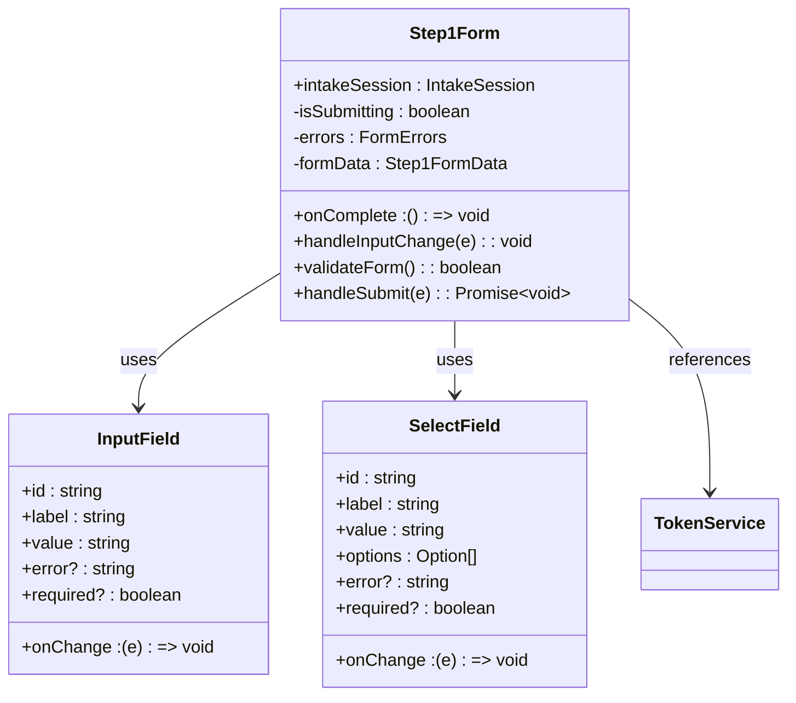
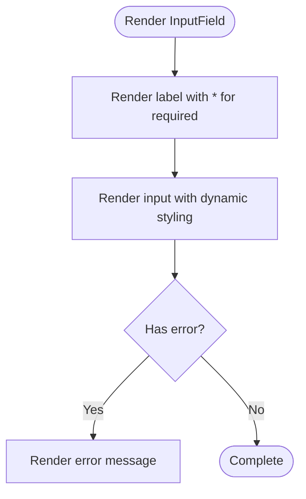
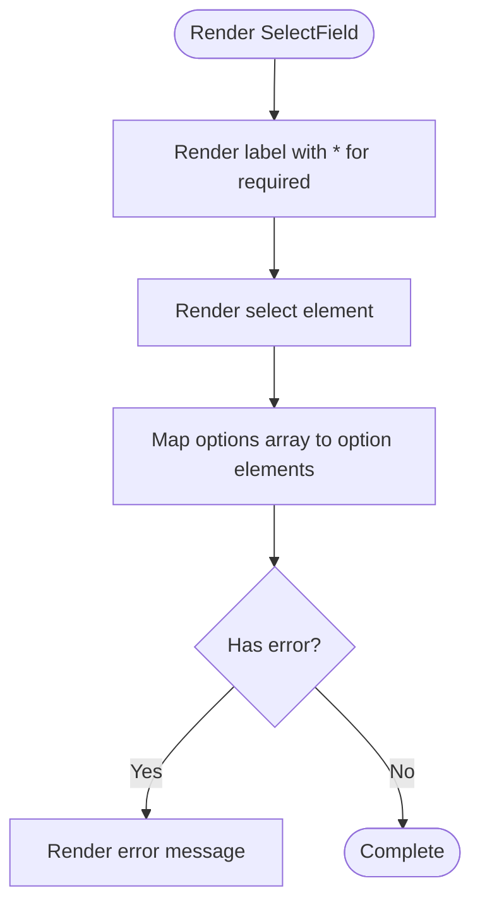
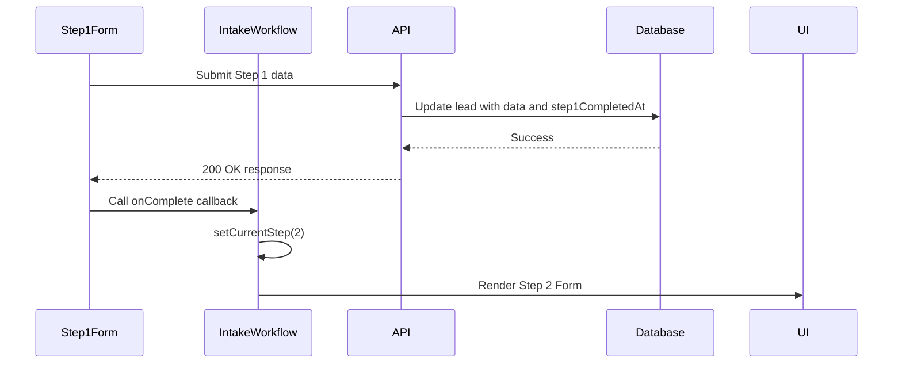
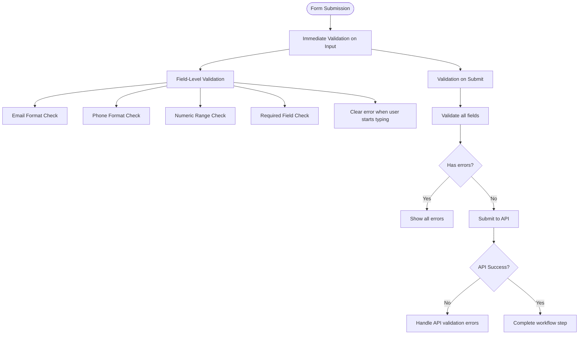

# Step 1: Business and Personal Information

<cite>
**Referenced Files in This Document**   
- [Step1Form.tsx](file://src/components/intake/Step1Form.tsx)
- [step1/route.ts](file://src/app/api/intake/[token]/step1/route.ts)
- [schema.prisma](file://prisma/schema.prisma)
- [TokenService.ts](file://src/services/TokenService.ts)
- [IntakeWorkflow.tsx](file://src/components/intake/IntakeWorkflow.tsx)
- [InputField.tsx](file://src/components/intake/InputField.tsx)
- [SelectField.tsx](file://src/components/intake/SelectField.tsx)
</cite>

## Table of Contents
1. [API Endpoint Structure and Validation](#api-endpoint-structure-and-validation)
2. [Frontend Form Implementation](#frontend-form-implementation)
3. [Data Persistence and Workflow Progression](#data-persistence-and-workflow-progression)
4. [Validation Examples](#validation-examples)
5. [Accessibility and Client-Side Validation](#accessibility-and-client-side-validation)

## API Endpoint Structure and Validation

The Step 1 intake API endpoint processes business and personal information submissions via a POST request to `/api/intake/[token]/step1`. The endpoint validates the intake token, checks completion status, and enforces comprehensive validation rules before persisting data.

```mermaid
sequenceDiagram
participant Frontend
participant API as "API Endpoint"
participant TokenService
participant Database as "Prisma DB"
Frontend->>API : POST /api/intake/{token}/step1
API->>TokenService : validateToken(token)
TokenService-->>API : IntakeSession or null
alt Invalid Token
API-->>Frontend : 404 Not Found
return
end
alt Already Completed
API-->>Frontend : 400 Bad Request
return
end
API->>API : Parse and trim request body
API->>API : Validate required fields
alt Missing Required Fields
API-->>Frontend : 400 Bad Request with missingFields
return
end
API->>API : Validate email formats
alt Invalid Email Format
API-->>Frontend : 400 Bad Request
return
end
API->>API : Validate phone formats
alt Invalid Phone Format
API-->>Frontend : 400 Bad Request
return
end
API->>API : Validate numeric ranges
alt Invalid Numeric Values
API-->>Frontend : 400 Bad Request
return
end
API->>Database : Update lead with step 1 data
Database-->>API : Success
API-->>Frontend : 200 OK with success message
```

**Diagram sources**
- [step1/route.ts](file://src/app/api/intake/[token]/step1/route.ts#L0-L304)
- [TokenService.ts](file://src/services/TokenService.ts#L56-L85)

**Section sources**
- [step1/route.ts](file://src/app/api/intake/[token]/step1/route.ts#L0-L304)

The request body must conform to the `Step1Data` interface, which includes three main sections:

**Business Details Section**
- :businessName: Legal Business Name (required)
- :dba: DBA - optional
- :businessAddress: Business Address (required)
- :businessPhone: Business Phone (required)
- :businessEmail: Company Email (required)
- :mobile: Mobile (required)
- :businessCity: City (required)
- :businessState: State (required)
- :businessZip: Zip (required)
- :ownershipPercentage: Percentage of Ownership (required)
- :taxId: Tax ID (required)
- :stateOfInc: State of Incorporation (required)
- :dateBusinessStarted: Date Business Started (required)
- :legalEntity: Legal Entity (required)
- :natureOfBusiness: Nature of Business (required)
- :hasExistingLoans: Do You Have Any Loans Now (required)
- :industry: Industry or Product Type (required)
- :yearsInBusiness: Years in Business (required)
- :monthlyRevenue: Monthly Gross Revenue (required)
- :amountNeeded: Amount Requested (required)

**Personal Details Section**
- :firstName: First Name (required)
- :lastName: Last Name (required)
- :dateOfBirth: Date of Birth (required)
- :socialSecurity: Social Security Number (required)
- :personalAddress: Personal Address (required)
- :personalCity: Personal City (required)
- :personalState: State (required)
- :personalZip: Zip Code (required)

**Legal Information Section**
- :legalName: Your Legal Name (required)
- :email: Email Address (required)

The endpoint performs the following validation checks:
1. Token validation using TokenService
2. Completion status check (rejects submissions for completed intakes)
3. Required field validation for all fields marked as required
4. Email format validation using regex pattern `/^[^'''\s@]+@[^'''\s@]+\.[^'''\s@]+$/`
5. Phone format validation using regex pattern `/^[\d\s\-\(\)\+\.]{10,}$/`
6. Numeric range validation for ownership percentage (0-100) and years in business (0-100)

Error responses include specific error messages and status codes:
- **400 Bad Request**: Missing token, invalid token, already completed, missing required fields, invalid email/phone formats, or invalid numeric values
- **404 Not Found**: Invalid or expired token
- **500 Internal Server Error**: Server-side processing errors

## Frontend Form Implementation

The Step1Form component renders a comprehensive form for collecting business and personal information, organized into three distinct sections with appropriate input types and validation.



**Diagram sources**
- [Step1Form.tsx](file://src/components/intake/Step1Form.tsx#L0-L399)
- [InputField.tsx](file://src/components/intake/InputField.tsx#L0-L54)
- [SelectField.tsx](file://src/components/intake/SelectField.tsx#L0-L55)

**Section sources**
- [Step1Form.tsx](file://src/components/intake/Step1Form.tsx#L0-L399)

The form is implemented as a React component with the following key features:

**State Management**
- :formData: Tracks all form field values using useState
- :errors: Stores validation error messages for each field
- :isSubmitting: Controls submission state to prevent duplicate submissions

**Field Components**
The form utilizes two custom components for consistent styling and behavior:

**InputField Component**


**Section sources**
- [InputField.tsx](file://src/components/intake/InputField.tsx#L0-L54)

The InputField component provides:
- Accessible labeling with htmlFor/id linkage
- Visual indication of required fields with red asterisk
- Dynamic border styling (red for errors, blue for focus)
- Error message display below the input
- Responsive design with Tailwind CSS

**SelectField Component**


**Section sources**
- [SelectField.tsx](file://src/components/intake/SelectField.tsx#L0-L55)

The SelectField component provides:
- Dropdown selection with predefined options
- Consistent styling with InputField
- Error state visualization
- Accessibility features

**Form Sections**
The form is organized into three main sections:

**Business Details Section**
Contains 19 fields including business name, address, contact information, financial details, and business characteristics. Uses a two-column grid layout for optimal space utilization.

**Personal Details Section**
Contains 8 fields for personal identification and contact information. Also uses a two-column grid layout.

**Legal Information Section**
Contains 2 fields for legal name and email address.

The form includes client-side validation that runs before submission, providing immediate feedback to users. The handleSubmit function prevents the default form submission, validates the form, and makes an API call to submit the data.

## Data Persistence and Workflow Progression

The system uses Prisma ORM to persist intake data in a PostgreSQL database, with a well-defined data model and workflow orchestration.

```mermaid
erDiagram
LEAD ||--o{ INTAKE_SESSION : has
LEAD ||--o{ STEP1_DATA : contains
INTAKE_SESSION }|--|| TOKEN_SERVICE : validated_by
LEAD {
Int id PK
BigInt legacyLeadId UK
Int campaignId
String? email
String? phone
String? firstName
String? lastName
String? businessName
String? dba
String? businessAddress
String? businessPhone
String? businessEmail
String? mobile
String? businessCity
String? businessState
String? businessZip
String? industry
Int? yearsInBusiness
String? amountNeeded
String? monthlyRevenue
String? ownershipPercentage
String? taxId
String? stateOfInc
String? dateBusinessStarted
String? legalEntity
String? natureOfBusiness
String? hasExistingLoans
String? dateOfBirth
String? socialSecurity
String? personalAddress
String? personalCity
String? personalState
String? personalZip
String? legalName
LeadStatus status
String? intakeToken UK
DateTime? intakeCompletedAt
DateTime? step1CompletedAt
DateTime? step2CompletedAt
DateTime createdAt
DateTime updatedAt
DateTime importedAt
}
```

**Diagram sources**
- [schema.prisma](file://prisma/schema.prisma#L0-L257)

**Section sources**
- [schema.prisma](file://prisma/schema.prisma#L0-L257)

The Lead model in the Prisma schema defines the data structure for storing intake information. Key fields relevant to Step 1 include:

**Business Information Fields**
- :businessName: Stores the legal business name
- :dba: Stores the DBA (Doing Business As) name
- :businessAddress, :businessCity, :businessState, :businessZip: Store business location
- :businessPhone, :businessEmail, :mobile: Store business contact information
- :ownershipPercentage: Stores ownership percentage as string
- :taxId: Stores Tax ID/EIN
- :stateOfInc: Stores state of incorporation
- :dateBusinessStarted: Stores business start date
- :legalEntity: Stores legal entity type (LLC, Corporation, etc.)
- :natureOfBusiness: Stores nature of business category
- :hasExistingLoans: Stores whether the business has existing loans
- :industry: Stores industry or product type
- :yearsInBusiness: Stores years in business as integer
- :amountNeeded: Stores requested amount as string (range)
- :monthlyRevenue: Stores monthly revenue as string (range)

**Personal Information Fields**
- :firstName, :lastName: Store owner's first and last name
- :dateOfBirth: Stores date of birth
- :socialSecurity: Stores Social Security Number
- :personalAddress, :personalCity, :personalState, :personalZip: Store personal address
- :legalName: Stores legal name
- :email: Stores email address

**System Fields**
- :intakeToken: Unique token for intake session
- :step1CompletedAt: Timestamp when Step 1 is completed
- :status: Lead status (NEW, PENDING, IN_PROGRESS, COMPLETED, REJECTED)

When Step 1 is successfully submitted, the workflow progresses as follows:



**Section sources**
- [Step1Form.tsx](file://src/components/intake/Step1Form.tsx#L350-L370)
- [IntakeWorkflow.tsx](file://src/components/intake/IntakeWorkflow.tsx#L12-L22)

The IntakeWorkflow component orchestrates the multi-step process by:
1. Initializing the current step based on intakeSession state
2. Providing callback functions to handle step completion
3. Rendering the appropriate component based on the current step
4. Updating the UI when steps are completed

When Step 1 is completed, the handleStep1Complete function is called, which updates the currentStep state to 2, causing the Step2Form component to be rendered.

## Validation Examples

### Valid Payload Example
```json
{
  "businessName": "ABC Corporation",
  "dba": "ABC Tech",
  "businessAddress": "123 Main St",
  "businessPhone": "(555) 123-4567",
  "businessEmail": "info@abccorp.com",
  "mobile": "555-987-6543",
  "businessCity": "New York",
  "businessState": "NY",
  "businessZip": "10001",
  "ownershipPercentage": "100",
  "taxId": "12-3456789",
  "stateOfInc": "DE",
  "dateBusinessStarted": "2020-01-15",
  "legalEntity": "Corporation",
  "natureOfBusiness": "Technology",
  "hasExistingLoans": "No",
  "industry": "Software Development",
  "yearsInBusiness": "4",
  "monthlyRevenue": "50000-100000",
  "amountNeeded": "100000-250000",
  "firstName": "John",
  "lastName": "Doe",
  "dateOfBirth": "1980-05-15",
  "socialSecurity": "123-45-6789",
  "personalAddress": "456 Oak Ave",
  "personalCity": "Brooklyn",
  "personalState": "NY",
  "personalZip": "11201",
  "legalName": "John Doe",
  "email": "john.doe@email.com"
}
```

### Common Validation Failures

**Missing Required Fields**
```json
{
  "error": "Missing required fields",
  "missingFields": ["businessName", "businessAddress", "firstName", "lastName"]
}
```

**Invalid Email Format**
```json
{
  "error": "Invalid email format"
}
```

**Invalid Phone Number**
```json
{
  "error": "Invalid mobile number format"
}
```

**Invalid Ownership Percentage**
```json
{
  "error": "Invalid ownership percentage (must be between 0-100)"
}
```

**Invalid Years in Business**
```json
{
  "error": "Invalid years in business (must be between 0-100)"
}
```

**Server Error**
```json
{
  "error": "Internal server error",
  "details": "Database connection failed"
}
```

## Accessibility and Client-Side Validation

The Step1Form implementation prioritizes accessibility and provides robust client-side validation to enhance user experience.

**Accessibility Features**
- All form fields have associated labels with htmlFor/id attributes
- Required fields are marked with a red asterisk (*) and the word "required" in the label
- Form controls have appropriate input types (email, tel, date) for better mobile experience
- Error messages are displayed immediately below the relevant field
- Focus states are enhanced with blue ring for better visibility
- Semantic HTML structure with proper heading hierarchy
- ARIA attributes are implicitly supported through standard HTML

**Client-Side Validation Strategy**
The form implements a multi-layered validation approach:



**Section sources**
- [Step1Form.tsx](file://src/components/intake/Step1Form.tsx#L200-L340)

Key aspects of the client-side validation:

**Immediate Feedback**
- Errors are cleared when the user starts typing in a field
- Real-time validation occurs as users interact with the form
- Visual cues (red borders) immediately indicate problematic fields

**Comprehensive Validation Rules**
- Required fields are checked for non-empty values
- Email fields are validated against a regex pattern
- Phone fields are validated for minimum length and allowed characters
- Numeric fields (ownership percentage, years in business) are checked for valid ranges
- All validation occurs both on individual field changes and on form submission

**Error Handling**
- Field-specific error messages are displayed below each input
- The validateForm function returns a boolean indicating overall validity
- API-level validation errors are handled with user-friendly alerts
- Network errors are caught and displayed appropriately

**User Experience Considerations**
- Submit button is disabled during submission to prevent duplicate submissions
- Loading state is indicated with "Saving..." text
- Success progression is seamless, automatically moving to the next step
- Error messages are specific and actionable
- Form preserves user input during validation failures

The combination of client-side validation and server-side validation creates a robust system that ensures data quality while providing an excellent user experience.