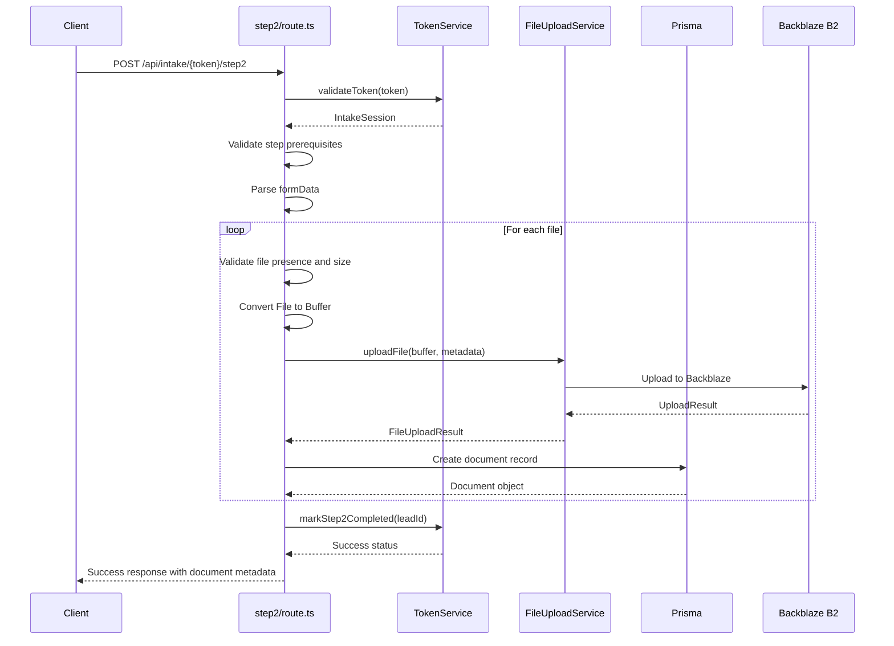
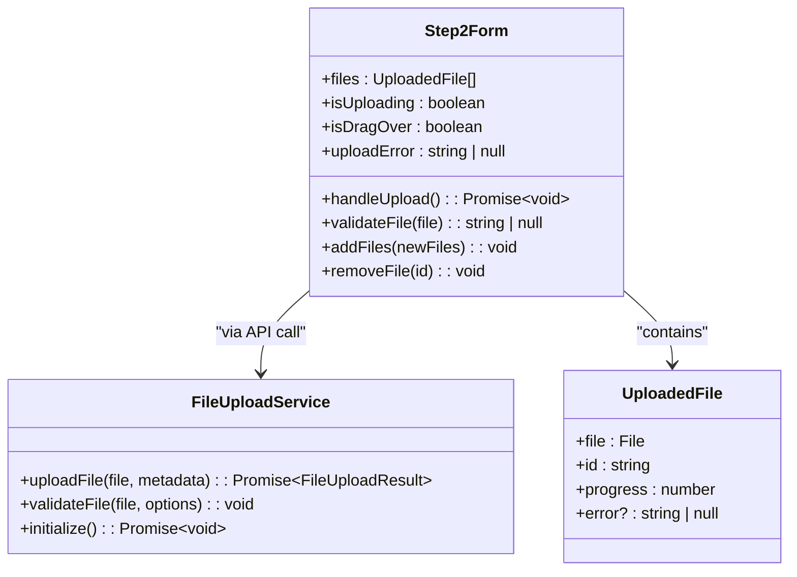
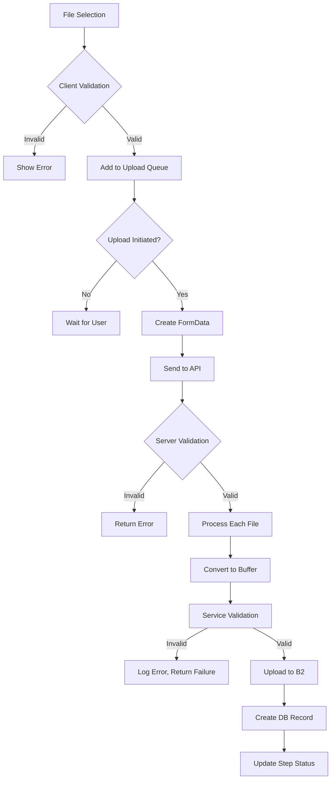
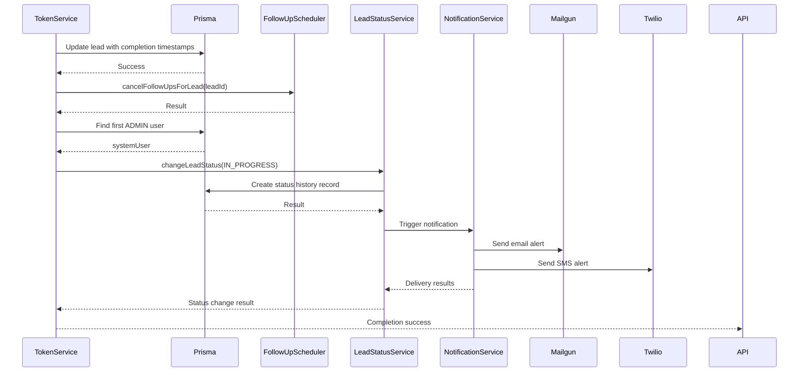
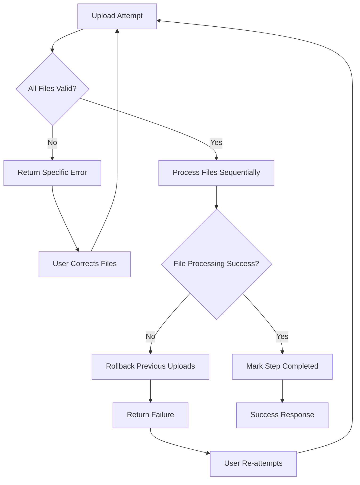

# Step 2: Additional Information and Document Upload

<cite>
**Referenced Files in This Document**   
- [src/app/api/intake/[token]/step2/route.ts](file://src/app/api/intake/[token]/step2/route.ts)
- [src/app/api/intake/[token]/save/route.ts](file://src/app/api/intake/[token]/save/route.ts)
- [src/components/intake/Step2Form.tsx](file://src/components/intake/Step2Form.tsx)
- [src/services/FileUploadService.ts](file://src/services/FileUploadService.ts)
- [src/services/NotificationService.ts](file://src/services/NotificationService.ts)
- [src/services/TokenService.ts](file://src/services/TokenService.ts)
- [prisma/migrations/20250826121117_add_comprehensive_lead_fields/migration.sql](file://prisma/migrations/20250826121117_add_comprehensive_lead_fields/migration.sql)
- [prisma/migrations/20250826203101_change_amount_and_revenue_to_string/migration.sql](file://prisma/migrations/20250826203101_change_amount_and_revenue_to_string/migration.sql)
</cite>

## Table of Contents
1. [Step 2 API Endpoint](#step-2-api-endpoint)
2. [Save Endpoint and Intake Finalization](#save-endpoint-and-intake-finalization)
3. [Frontend Integration with FileUploadService](#frontend-integration-with-fileuploadservice)
4. [Data Validation and File Restrictions](#data-validation-and-file-restrictions)
5. [Data Persistence and Notification Triggering](#data-persistence-and-notification-triggering)
6. [Error Handling and Recovery Scenarios](#error-handling-and-recovery-scenarios)
7. [Data Consistency and Rollback Procedures](#data-consistency-and-rollback-procedures)

## Step 2 API Endpoint

The Step 2 API endpoint handles the upload of financial documents and captures additional application details during the intake process. It validates token authenticity, ensures prerequisite steps are completed, and processes multipart form data containing file uploads.

The endpoint enforces strict validation rules for document uploads, requiring exactly three files that meet specific criteria. Each file is converted to a buffer and processed through the FileUploadService before being recorded in the database with metadata including original filename, size, MIME type, and storage identifiers.



**Diagram sources**
- [src/app/api/intake/[token]/step2/route.ts](file://src/app/api/intake/[token]/step2/route.ts#L1-L152)

**Section sources**
- [src/app/api/intake/[token]/step2/route.ts](file://src/app/api/intake/[token]/step2/route.ts#L1-L152)

## Save Endpoint and Intake Finalization

The save endpoint serves as the final step in the intake process, persisting all collected data to the lead record and triggering system notifications. While the current implementation focuses on step 1 data persistence, it establishes the pattern for finalizing the entire intake workflow.

When intake completion is confirmed, the endpoint updates the lead record with the intakeCompletedAt timestamp, effectively finalizing the process. This triggers downstream processes through the TokenService, which coordinates status changes and notification workflows.

```mermaid
flowchart TD
A[POST /api/intake/{token}/save] --> B{Validate Token}
B --> |Invalid| C[Return 404]
B --> |Valid| D{Intake Already Completed?}
D --> |Yes| E[Return 400]
D --> |No| F{Step Validation}
F --> |Step 1| G[Validate Required Fields]
G --> H[Update Lead Record]
H --> I[Return Success]
F --> |Other Steps| J[Return 400]
```

**Diagram sources**
- [src/app/api/intake/[token]/save/route.ts](file://src/app/api/intake/[token]/save/route.ts#L1-L130)

**Section sources**
- [src/app/api/intake/[token]/save/route.ts](file://src/app/api/intake/[token]/save/route.ts#L1-L130)

## Frontend Integration with FileUploadService

The Step2Form component provides a user-friendly interface for document uploads, integrating directly with the FileUploadService through the API endpoint. The frontend implements client-side validation that mirrors server requirements, providing immediate feedback to users.

The integration follows a progressive enhancement pattern: files are validated locally for type and size before being packaged into a FormData object and submitted to the API endpoint. The component maintains upload state, including progress indicators and error handling, creating a responsive user experience.



**Diagram sources**
- [src/components/intake/Step2Form.tsx](file://src/components/intake/Step2Form.tsx#L1-L312)
- [src/services/FileUploadService.ts](file://src/services/FileUploadService.ts#L1-L307)

**Section sources**
- [src/components/intake/Step2Form.tsx](file://src/components/intake/Step2Form.tsx#L1-L312)

## Data Validation and File Restrictions

The system implements comprehensive validation at both client and server levels to ensure data quality and system security. File uploads are subject to multiple constraints that are validated in a layered approach.

Client-side validation in Step2Form enforces:
- **File type restrictions**: Only PDF, JPG, PNG, and DOCX formats are accepted
- **Size limitations**: Maximum 10MB per file
- **Quantity requirement**: Exactly three documents must be uploaded

Server-side validation in the step2 API endpoint reinforces these rules and adds additional checks:
- **Empty file detection**: Rejects files with zero size
- **Token validation**: Ensures the session is valid and step 1 is completed
- **Step completion checks**: Prevents re-submission of completed steps

The FileUploadService provides an additional validation layer with configurable options for maximum size, allowed MIME types, and file extensions, ensuring consistency across the application.



**Section sources**
- [src/components/intake/Step2Form.tsx](file://src/components/intake/Step2Form.tsx#L1-L312)
- [src/app/api/intake/[token]/step2/route.ts](file://src/app/api/intake/[token]/step2/route.ts#L1-L152)
- [src/services/FileUploadService.ts](file://src/services/FileUploadService.ts#L1-L307)

## Data Persistence and Notification Triggering

Upon successful completion of Step 2, the system persists all collected data and triggers the initial notification workflow. The data persistence mechanism ensures atomic updates to the lead record, while the notification system follows a reliable delivery pattern with retry capabilities.

The TokenService's markStep2Completed method orchestrates the finalization process:
1. Updates the lead record with step2CompletedAt and intakeCompletedAt timestamps
2. Cancels any pending follow-ups for the lead
3. Changes the lead status to IN_PROGRESS via LeadStatusService
4. Uses the first available admin user as the system actor for status changes

The NotificationService is implicitly triggered through status change events, sending alerts to the operations team that a new application is ready for review. The service implements exponential backoff retry logic with configurable parameters stored in system settings.



**Diagram sources**
- [src/services/TokenService.ts](file://src/services/TokenService.ts#L1-L313)
- [src/services/NotificationService.ts](file://src/services/NotificationService.ts#L1-L472)

**Section sources**
- [src/services/TokenService.ts](file://src/services/TokenService.ts#L1-L313)
- [src/services/NotificationService.ts](file://src/services/NotificationService.ts#L1-L472)

## Error Handling and Recovery Scenarios

The system implements comprehensive error handling at multiple levels to ensure reliability and data integrity. Each component follows a consistent pattern of validation, execution, and error recovery.

Key error scenarios and handling mechanisms:

**Document Upload Failures**
- **Client-side**: Immediate feedback for invalid file types, sizes, or empty files
- **Server-side**: Transactional processing where failure of any file upload aborts the entire operation
- **Service-level**: Detailed logging of upload failures with original filename and error message

**Network Interruptions**
- Frontend shows upload progress and allows retry
- API endpoint is idempotent - can be safely retried if step is not marked as completed
- FileUploadService handles B2 connection failures with initialization retries

**Validation Errors**
- Step progression validation prevents out-of-order completion
- Token validation ensures session authenticity
- Field validation in save endpoint checks for required data

**Recovery Workflows**
- Users can re-attempt document uploads if the step was not marked as completed
- System logs all errors for administrative review
- Database transactions ensure data consistency



**Section sources**
- [src/app/api/intake/[token]/step2/route.ts](file://src/app/api/intake/[token]/step2/route.ts#L1-L152)
- [src/components/intake/Step2Form.tsx](file://src/components/intake/Step2Form.tsx#L1-L312)
- [src/services/FileUploadService.ts](file://src/services/FileUploadService.ts#L1-L307)

## Data Consistency and Rollback Procedures

The system ensures data consistency through atomic operations and careful state management. While the current implementation doesn't use database transactions for multi-file uploads, it maintains consistency through validation and state checks.

**Consistency Guarantees**
- **Token-based state management**: The intake session token ensures only authorized users can modify lead data
- **Step progression enforcement**: The system prevents skipping steps or re-completing completed steps
- **Atomic step completion**: The markStep2Completed method updates both step2CompletedAt and intakeCompletedAt in a single database operation

**Rollback Considerations**
- **Partial file uploads**: If one file fails during processing, the API returns an error without marking the step as completed, allowing the user to retry
- **Status change failures**: If the lead status update fails after document upload, the system continues to function as the critical completion state is already persisted
- **Follow-up cancellation**: Failure to cancel follow-ups does not affect the primary completion workflow

**Data Structure**
The lead record contains comprehensive business information fields added through database migrations:

```sql
-- Business Information Fields
business_name TEXT,
business_address TEXT,
business_city TEXT,
business_state TEXT,
business_zip TEXT,
business_phone TEXT,
business_email TEXT,
dba TEXT,
industry TEXT,
years_in_business INTEGER,
amount_needed TEXT,
monthly_revenue TEXT,
ownership_percentage TEXT,
tax_id TEXT,
state_of_inc TEXT,
date_business_started TEXT,
legal_entity TEXT,
nature_of_business TEXT,
has_existing_loans TEXT
```

**Section sources**
- [src/app/api/intake/[token]/step2/route.ts](file://src/app/api/intake/[token]/step2/route.ts#L1-L152)
- [src/services/TokenService.ts](file://src/services/TokenService.ts#L1-L313)
- [prisma/migrations/20250826121117_add_comprehensive_lead_fields/migration.sql](file://prisma/migrations/20250826121117_add_comprehensive_lead_fields/migration.sql#L1-L23)
- [prisma/migrations/20250826203101_change_amount_and_revenue_to_string/migration.sql](file://prisma/migrations/20250826203101_change_amount_and_revenue_to_string/migration.sql)