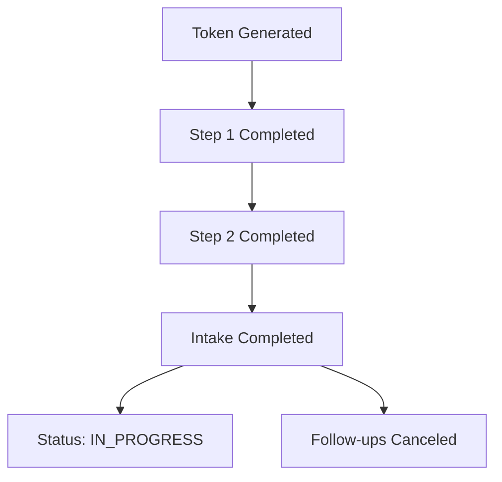
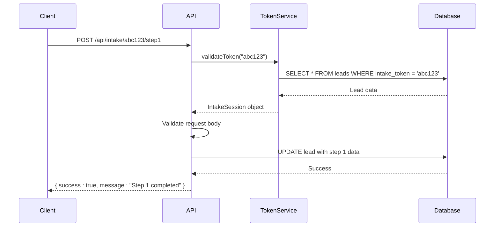
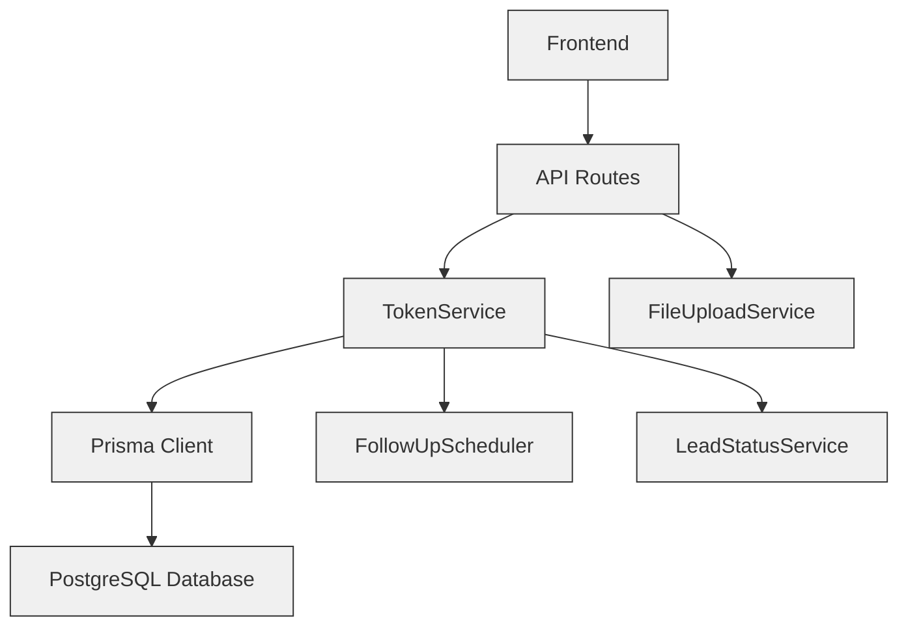

# Token Management System

<cite>
**Referenced Files in This Document**   
- [TokenService.ts](file://src/services/TokenService.ts)
- [route.ts](file://src/app/api/intake/[token]/route.ts)
- [step1/route.ts](file://src/app/api/intake/[token]/step1/route.ts)
- [step2/route.ts](file://src/app/api/intake/[token]/step2/route.ts)
- [save/route.ts](file://src/app/api/intake/[token]/save/route.ts)
- [schema.prisma](file://prisma/schema.prisma)
</cite>

## Table of Contents
1. [Introduction](#introduction)
2. [Token Generation](#token-generation)
3. [Token Validation](#token-validation)
4. [Token Expiration and State Management](#token-expiration-and-state-management)
5. [API Integration and Request Flow](#api-integration-and-request-flow)
6. [Security Best Practices](#security-best-practices)
7. [Error Handling](#error-handling)
8. [Code Examples](#code-examples)
9. [Architecture Overview](#architecture-overview)

## Introduction
The Token Management System is responsible for securely managing the intake workflow for leads in the fund-tracking application. It uses cryptographically secure tokens to authenticate and authorize access to a multi-step intake process. These tokens are generated, validated, and tracked throughout the lifecycle of a lead's application. The system ensures that only authorized users can access and complete the intake process while maintaining state across multiple steps.

**Section sources**
- [TokenService.ts](file://src/services/TokenService.ts#L1-L312)

## Token Generation
The TokenService generates cryptographically secure tokens using Node.js's `crypto` module. Each token is a 32-byte random value converted to a hexadecimal string, providing 256 bits of entropy, which makes it infeasible to guess or brute-force.

Tokens are generated when a new lead is created and assigned to the intake workflow. The `generateTokenForLead` method creates a token and stores it in the database, associating it with a specific lead. Upon token generation, the lead's status is updated to "PENDING" to indicate that the intake process has been initiated.

```typescript
static generateToken(): string {
  return crypto.randomBytes(32).toString('hex');
}
```

The token is stored in the `intakeToken` field of the `Lead` model in the database. This field is marked as unique to prevent duplication and ensure each token is used for exactly one lead.

**Section sources**
- [TokenService.ts](file://src/services/TokenService.ts#L56-L202)
- [schema.prisma](file://prisma/schema.prisma#L50-L52)

## Token Validation
Token validation is performed on every request that requires access to the intake workflow. The `validateToken` method queries the database to find a lead with a matching `intakeToken`. If a match is found, the method returns an `IntakeSession` object containing the lead's data and the current state of the intake process.

The validation process includes checking whether the intake has been completed, and whether each step (step1 and step2) has been completed. This allows the system to enforce workflow progression and prevent users from skipping steps.

```typescript
static async validateToken(token: string): Promise<IntakeSession | null> {
  const lead = await prisma.lead.findUnique({
    where: { intakeToken: token },
    select: { /* fields */ }
  });
  // ...
}
```

If the token is invalid or has expired (i.e., no lead is found), the method returns `null`, and the API responds with a 404 error.

**Section sources**
- [TokenService.ts](file://src/services/TokenService.ts#L67-L180)
- [route.ts](file://src/app/api/intake/[token]/route.ts#L15-L25)

## Token Expiration and State Management
Tokens do not have a time-based expiration but are instead invalidated when the intake process is completed. The system tracks the state of the intake process using timestamp fields in the database: `step1CompletedAt`, `step2CompletedAt`, and `intakeCompletedAt`. When any of these fields are set, the corresponding step is considered complete.

The `markStep2Completed` method is called when the final step of the intake process is completed. This method sets the `intakeCompletedAt` timestamp, effectively "expiring" the token by marking the intake as complete. Once completed, the token can no longer be used to submit new data.

Additionally, the system updates the lead's status to "IN_PROGRESS" to notify staff that the application is ready for review. Any pending follow-up tasks are canceled to prevent unnecessary notifications.



**Diagram sources**
- [TokenService.ts](file://src/services/TokenService.ts#L223-L278)

**Section sources**
- [TokenService.ts](file://src/services/TokenService.ts#L223-L311)

## API Integration and Request Flow
The TokenService is integrated into multiple API routes that handle different stages of the intake process. Each route extracts the token from the URL parameter and validates it before processing the request.

### Main Intake Route
The main intake route (`/api/intake/[token]`) uses the `validateToken` method to retrieve the current intake session data. This allows the frontend to restore the user's progress.

### Step 1 Route
The `/api/intake/[token]/step1` route validates the token and processes the first set of form data. It performs extensive validation on required fields, email formats, phone numbers, and numeric ranges before saving the data.

### Step 2 Route
The `/api/intake/[token]/step2` route handles document uploads. It validates that exactly three documents are uploaded and processes each file by uploading it to Backblaze B2 and storing metadata in the database.

### Save Route
The `/api/intake/[token]/save` route allows users to save partial progress. It validates basic contact information and saves it without marking the step as completed.



**Diagram sources**
- [step1/route.ts](file://src/app/api/intake/[token]/step1/route.ts#L54-L290)
- [step2/route.ts](file://src/app/api/intake/[token]/step2/route.ts#L14-L140)
- [save/route.ts](file://src/app/api/intake/[token]/save/route.ts#L27-L110)

**Section sources**
- [route.ts](file://src/app/api/intake/[token]/route.ts#L1-L37)
- [step1/route.ts](file://src/app/api/intake/[token]/step1/route.ts#L1-L303)
- [step2/route.ts](file://src/app/api/intake/[token]/step2/route.ts#L1-L151)
- [save/route.ts](file://src/app/api/intake/[token]/save/route.ts#L1-L129)

## Security Best Practices
The Token Management System follows several security best practices:

- **Cryptographic Security**: Tokens are generated using `crypto.randomBytes`, which provides cryptographically secure randomness.
- **HTTPS Transmission**: Tokens are transmitted over HTTPS to prevent interception.
- **No Sensitive Data in Tokens**: The token itself contains no data; it is merely a reference to a database record.
- **Unique Tokens**: The `intakeToken` field is unique in the database, preventing token reuse.
- **Input Validation**: All incoming data is validated for format, type, and range.
- **Rate Limiting**: Although not shown in the code, API routes should be protected with rate limiting to prevent abuse.
- **Error Handling**: Errors are logged internally but only generic messages are returned to clients to avoid information leakage.

Tokens are stored in the database and never exposed in client-side storage beyond what is necessary for the current session.

**Section sources**
- [TokenService.ts](file://src/services/TokenService.ts#L56-L312)
- [step1/route.ts](file://src/app/api/intake/[token]/step1/route.ts#L100-L150)

## Error Handling
The system implements comprehensive error handling at both the service and API levels. All database operations are wrapped in try-catch blocks, and errors are logged using the application's logger.

When an error occurs, the API returns appropriate HTTP status codes:
- 400 Bad Request: Invalid input or missing fields
- 404 Not Found: Invalid or expired token
- 500 Internal Server Error: Unexpected server error

The system is designed to fail gracefully. For example, if canceling follow-ups or updating the lead status fails after intake completion, the step completion is still recorded successfully.

```typescript
try {
  await prisma.lead.update({ /* ... */ });
} catch (error) {
  console.error('Error marking step 1 completed:', error);
  return false;
}
```

**Section sources**
- [TokenService.ts](file://src/services/TokenService.ts#L100-L110)
- [step1/route.ts](file://src/app/api/intake/[token]/step1/route.ts#L280-L300)

## Code Examples
### Token Creation
```typescript
const token = await TokenService.generateTokenForLead(leadId);
if (token) {
  console.log(`Token generated: ${token}`);
}
```

### Token Verification
```typescript
const intakeSession = await TokenService.validateToken(token);
if (intakeSession) {
  console.log(`Lead ID: ${intakeSession.leadId}`);
  console.log(`Step 1 Completed: ${intakeSession.step1Completed}`);
}
```

### Marking Step Completion
```typescript
const success = await TokenService.markStep1Completed(leadId);
if (success) {
  console.log("Step 1 marked as completed");
}
```

**Section sources**
- [TokenService.ts](file://src/services/TokenService.ts#L56-L312)

## Architecture Overview
The Token Management System is a service-layer component that interacts with the database and is consumed by API routes. It maintains state for the intake workflow and ensures data integrity throughout the process.



**Diagram sources**
- [TokenService.ts](file://src/services/TokenService.ts#L1-L312)
- [prisma/schema.prisma](file://prisma/schema.prisma#L1-L257)