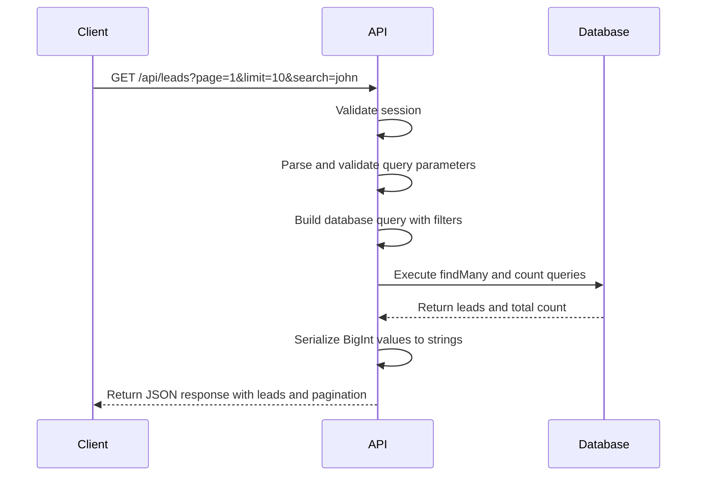
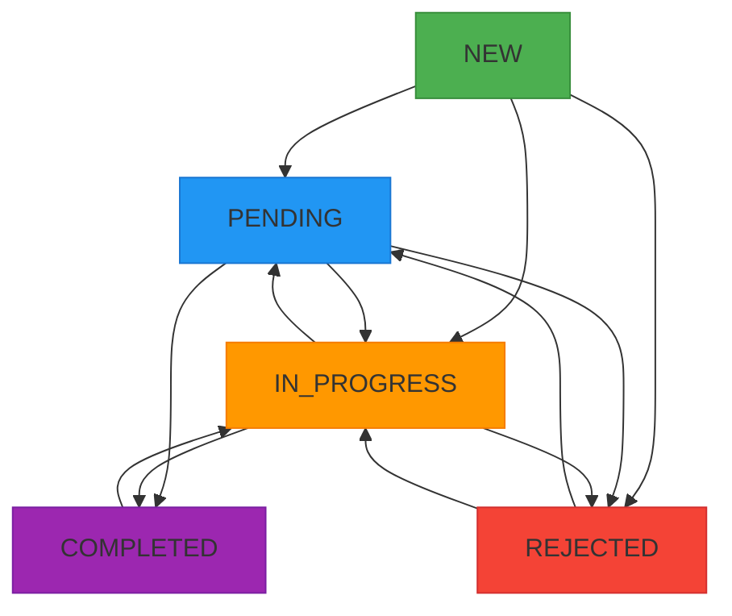
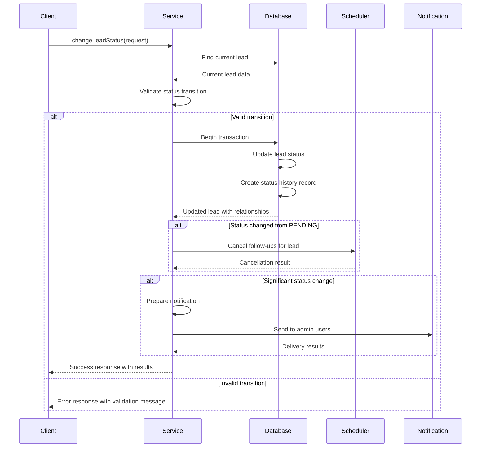
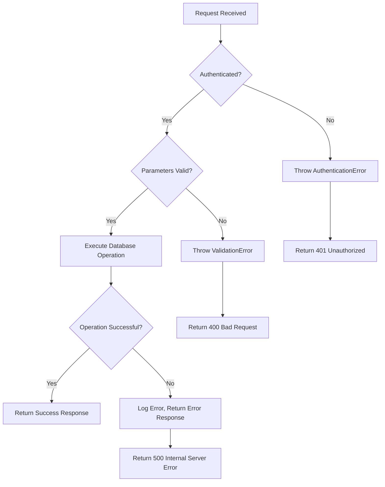

# Lead API Reference

<cite>
**Referenced Files in This Document**   
- [route.ts](file://src/app/api/leads/route.ts#L0-L166)
- [LeadStatusService.ts](file://src/services/LeadStatusService.ts#L0-L455)
- [prisma.ts](file://src/lib/prisma.ts#L0-L60)
</cite>

## Table of Contents
1. [Introduction](#introduction)
2. [Authentication and Authorization](#authentication-and-authorization)
3. [Lead Retrieval](#lead-retrieval)
4. [Lead Status Management](#lead-status-management)
5. [Error Handling](#error-handling)
6. [Rate Limiting and Performance](#rate-limiting-and-performance)
7. [Data Structures](#data-structures)
8. [Sample Requests](#sample-requests)

## Introduction
This document provides comprehensive documentation for the Lead API endpoints in the Fund-Track application. The API enables management of leads through retrieval, filtering, pagination, and status updates. The system implements role-based access control using NextAuth.js and follows RESTful principles for all operations.

The lead management system supports comprehensive filtering, sorting, and pagination for lead retrieval, along with a robust status transition system that enforces business rules and maintains audit history. All operations are logged and include appropriate error handling.

**Section sources**
- [route.ts](file://src/app/api/leads/route.ts#L0-L166)
- [LeadStatusService.ts](file://src/services/LeadStatusService.ts#L0-L455)

## Authentication and Authorization
All lead-related endpoints require authentication via NextAuth.js. The system uses session-based authentication where the server validates the user's session before processing any requests.

```typescript
const session = await getServerSession(authOptions);
if (!session) {
  throw new AuthenticationError();
}
```

Authorization is role-based, with access determined by the authenticated user's role. While specific role checks are not visible in the provided code, the system passes the user ID (`changedBy`) when updating lead status, enabling role-based access control at the service level.

The authentication system integrates with the application's session management and user database via Prisma ORM, ensuring secure access to lead data.

**Section sources**
- [route.ts](file://src/app/api/leads/route.ts#L15-L20)
- [LeadStatusService.ts](file://src/services/LeadStatusService.ts#L15-L20)

## Lead Retrieval
The GET `/api/leads` endpoint retrieves a paginated list of leads with comprehensive filtering and sorting capabilities.

### Endpoint Details
- **HTTP Method**: GET
- **URL Pattern**: `/api/leads`
- **Authentication**: Required (NextAuth.js session)

### Query Parameters
:page: - Page number (default: 1, minimum: 1)
:limit: - Number of leads per page (default: 10, maximum: 100)
:search: - Text search across multiple lead fields
:status: - Filter by lead status (new, pending, in_progress, completed, rejected)
:dateFrom: - Filter leads created on or after this date (ISO format)
:dateTo: - Filter leads created on or before this date (ISO format)
:sortBy: - Field to sort by (default: createdAt)
:sortOrder: - Sort order (asc or desc, default: desc)

### Response Schema
```json
{
  "leads": [
    {
      "id": 1,
      "firstName": "John",
      "lastName": "Doe",
      "email": "john@example.com",
      "status": "NEW",
      "createdAt": "2023-01-01T00:00:00Z",
      "legacyLeadId": "12345",
      "_count": {
        "notes": 2,
        "documents": 3
      }
    }
  ],
  "pagination": {
    "page": 1,
    "limit": 10,
    "totalCount": 25,
    "totalPages": 3,
    "hasNext": true,
    "hasPrev": false
  }
}
```

### Search Functionality
The search parameter performs case-insensitive matching across multiple lead fields:
- Personal information: firstName, lastName, email, phone, mobile
- Business information: businessName, dba, legalName, businessEmail, businessPhone
- Location: businessCity, businessState, personalCity, personalState
- Metadata: industry, intakeToken
- Numeric IDs: id, campaignId, legacyLeadId

### Validation Rules
- Page must be ≥ 1
- Limit must be between 1 and 100
- Invalid parameters return a ValidationError



**Diagram sources**
- [route.ts](file://src/app/api/leads/route.ts#L25-L166)

**Section sources**
- [route.ts](file://src/app/api/leads/route.ts#L25-L166)

## Lead Status Management
The lead status system implements a state machine with defined transition rules, audit logging, and automated workflows.

### Status Transition Rules
The system defines valid transitions between lead statuses:



**Diagram sources**
- [LeadStatusService.ts](file://src/services/LeadStatusService.ts#L25-L75)

### Status Change Process
When a lead's status changes, the system performs the following operations:

1. Validates the transition against business rules
2. Updates the lead status in the database
3. Creates an audit record in the status history
4. Cancels pending follow-ups if appropriate
5. Sends notifications to staff for significant changes

### Status Change Endpoint
While the specific API route is not available, the `LeadStatusService` indicates the existence of a status update endpoint.

#### Request Structure
```json
{
  "leadId": 123,
  "newStatus": "IN_PROGRESS",
  "changedBy": 456,
  "reason": "Required for reopening completed or rejected leads"
}
```

#### Response Schema
```json
{
  "success": true,
  "lead": { /* Full lead object with relationships */ },
  "followUpsCancelled": true,
  "staffNotificationSent": true
}
```

#### Validation Rules
- Transitions from COMPLETED to any status require a reason
- Transitions from REJECTED to any status require a reason
- Invalid transitions return appropriate error messages
- Same-status changes are allowed (no-op)



**Diagram sources**
- [LeadStatusService.ts](file://src/services/LeadStatusService.ts#L100-L300)

**Section sources**
- [LeadStatusService.ts](file://src/services/LeadStatusService.ts#L100-L455)

## Error Handling
The API implements comprehensive error handling with specific error types for different failure scenarios.

### Error Types
:AuthenticationError: - Returned when no valid session is present
:ValidationError: - Returned for invalid request parameters
:DatabaseError: - Returned for database operation failures

### Error Response Schema
```json
{
  "error": "Error message describing the issue",
  "code": "Error code identifier"
}
```

### Error Handling Implementation
The system uses a middleware approach with `withErrorHandler` to wrap API routes and ensure consistent error responses. Database operations are wrapped in `executeDatabaseOperation` which provides additional error context and logging.



**Diagram sources**
- [route.ts](file://src/app/api/leads/route.ts#L15-L20)
- [LeadStatusService.ts](file://src/services/LeadStatusService.ts#L200-L250)

**Section sources**
- [route.ts](file://src/app/api/leads/route.ts#L15-L20)
- [LeadStatusService.ts](file://src/services/LeadStatusService.ts#L200-L250)

## Rate Limiting and Performance
The API includes several performance optimizations and safeguards.

### Caching Behavior
The route configuration includes:
```typescript
export const revalidate = 0; // Disable caching
export const dynamic = 'force-dynamic'; // Ensure dynamic rendering
```

This ensures that all requests retrieve fresh data from the database, preventing stale data issues at the cost of increased database load.

### Database Optimization
The system uses Prisma's built-in connection pooling and implements batch operations for pagination:

```typescript
const [leads, totalCount] = await executeDatabaseOperation(
  () => Promise.all([
    prisma.lead.findMany({ /* pagination options */ }),
    prisma.lead.count({ where })
  ])
);
```

This approach fetches both the paginated results and total count in parallel, minimizing database round trips.

### Performance Monitoring
The API logs performance metrics for each request:
- Request start time
- Processing duration
- User identification
- Result counts

This enables monitoring of API performance and identification of potential bottlenecks.

**Section sources**
- [route.ts](file://src/app/api/leads/route.ts#L10-L15)
- [prisma.ts](file://src/lib/prisma.ts#L30-L40)

## Data Structures
### Lead Object Structure
```json
{
  "id": 1,
  "firstName": "string",
  "lastName": "string",
  "legalName": "string",
  "email": "string",
  "businessEmail": "string",
  "phone": "string",
  "mobile": "string",
  "businessPhone": "string",
  "businessName": "string",
  "dba": "string",
  "industry": "string",
  "yearsInBusiness": "number",
  "amountNeeded": "string",
  "monthlyRevenue": "string",
  "businessAddress": "string",
  "businessCity": "string",
  "businessState": "string",
  "businessZip": "string",
  "personalAddress": "string",
  "personalCity": "string",
  "personalState": "string",
  "personalZip": "string",
  "status": "NEW | PENDING | IN_PROGRESS | COMPLETED | REJECTED",
  "campaignId": "number",
  "intakeToken": "string",
  "legacyLeadId": "string",
  "importedAt": "datetime",
  "intakeCompletedAt": "datetime",
  "step1CompletedAt": "datetime",
  "step2CompletedAt": "datetime",
  "createdAt": "datetime",
  "updatedAt": "datetime",
  "_count": {
    "notes": "number",
    "documents": "number"
  }
}
```

### Status History Object
```json
{
  "id": 1,
  "leadId": 1,
  "previousStatus": "string",
  "newStatus": "string",
  "changedBy": "number",
  "reason": "string",
  "createdAt": "datetime",
  "user": {
    "id": "number",
    "email": "string"
  }
}
```

### Available Status Transitions
The system provides information about valid transitions from the current status:

```json
[
  {
    "status": "PENDING",
    "description": "Awaiting prospect response or action",
    "requiresReason": false
  }
]
```

**Section sources**
- [LeadStatusService.ts](file://src/services/LeadStatusService.ts#L400-L455)
- [route.ts](file://src/app/api/leads/route.ts#L100-L150)

## Sample Requests
### Retrieve Leads with Filtering
```bash
curl -X GET "http://localhost:3000/api/leads?page=1&limit=5&search=john&status=new&sortBy=createdAt&sortOrder=desc" \
  -H "Authorization: Bearer <session_token>"
```

### Retrieve Leads by Date Range
```bash
curl -X GET "http://localhost:3000/api/leads?dateFrom=2023-01-01&dateTo=2023-12-31&status=pending" \
  -H "Authorization: Bearer <session_token>"
```

### Update Lead Status (Conceptual)
```bash
curl -X POST "http://localhost:3000/api/leads/123/status" \
  -H "Content-Type: application/json" \
  -H "Authorization: Bearer <session_token>" \
  -d '{
    "newStatus": "IN_PROGRESS",
    "changedBy": 456,
    "reason": "Prospect responded to initial contact"
  }'
```

### Error Response Example
```json
{
  "error": "Invalid pagination parameters",
  "code": "pagination"
}
```

**Section sources**
- [route.ts](file://src/app/api/leads/route.ts#L50-L80)
- [LeadStatusService.ts](file://src/services/LeadStatusService.ts#L150-L180)