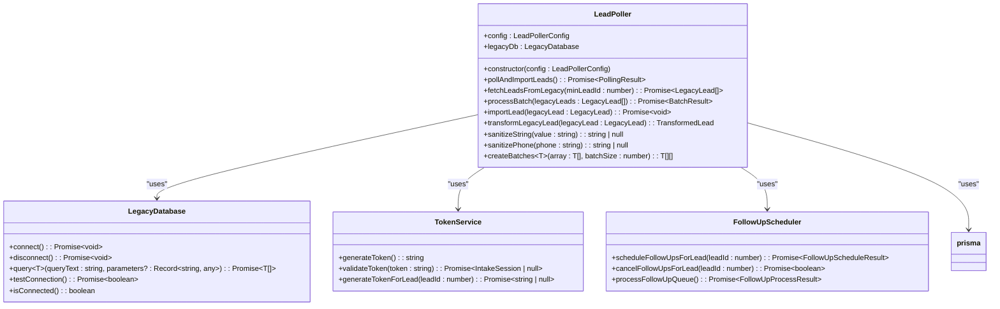
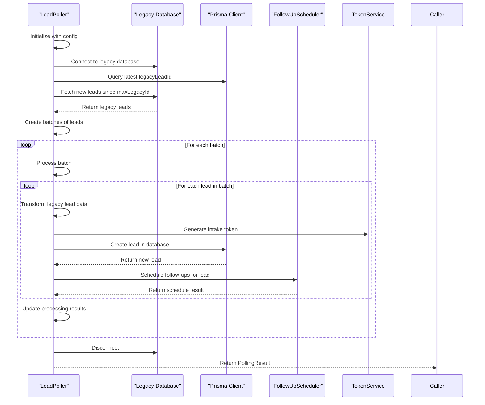
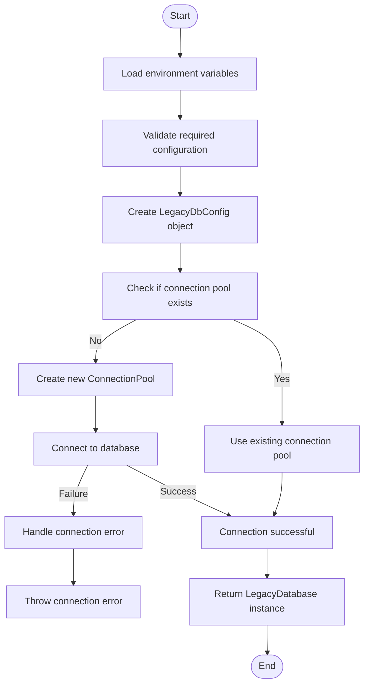
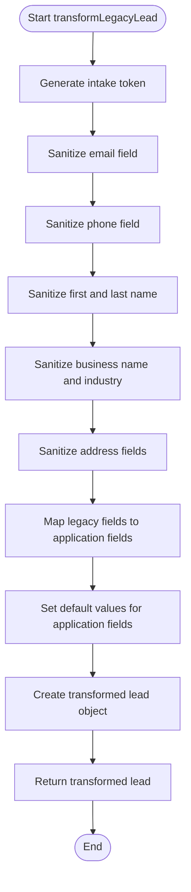
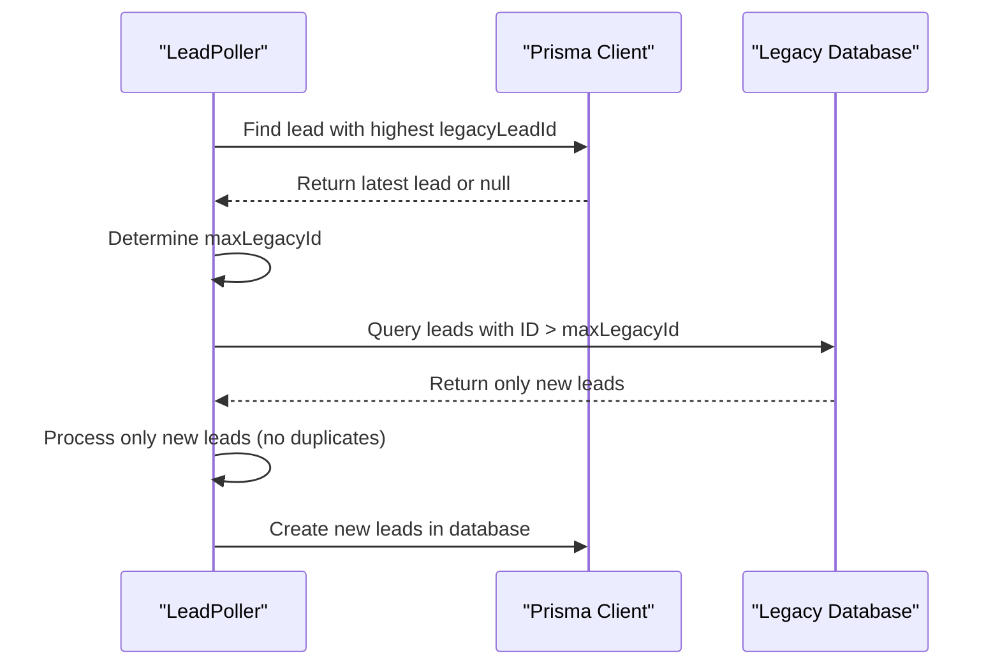
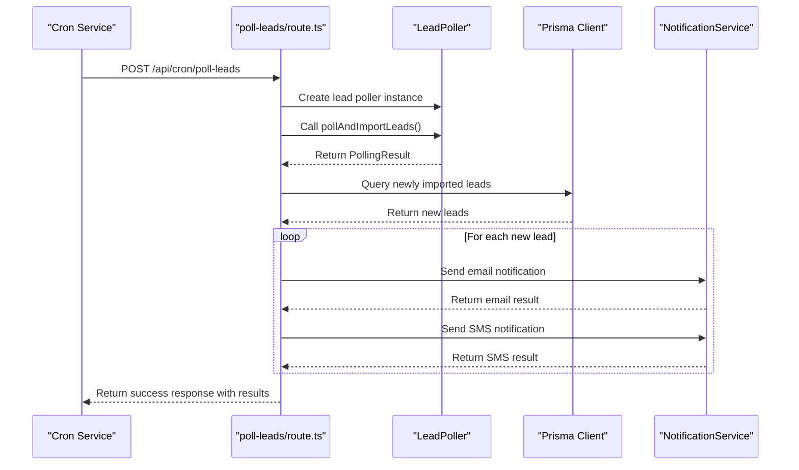
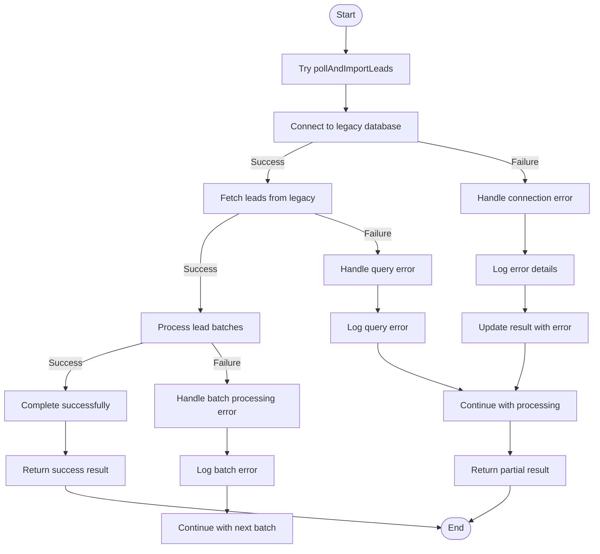
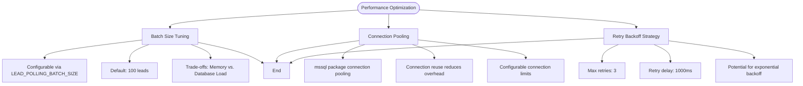
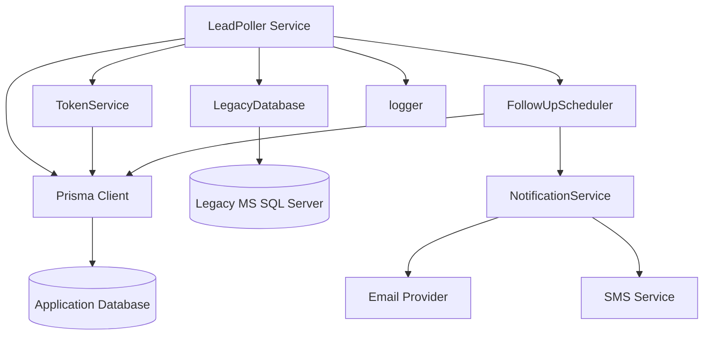

# Lead Import Process

<cite>
**Referenced Files in This Document**   
- [LeadPoller.ts](file://src/services/LeadPoller.ts)
- [legacy-db.ts](file://src/lib/legacy-db.ts)
- [prisma.ts](file://src/lib/prisma.ts)
- [TokenService.ts](file://src/services/TokenService.ts)
- [FollowUpScheduler.ts](file://src/services/FollowUpScheduler.ts)
- [poll-leads/route.ts](file://src/app/api/cron/poll-leads/route.ts)
- [trigger-polling/route.ts](file://src/app/api/admin/background-jobs/trigger-polling/route.ts)
- [prisma/schema.prisma](file://prisma/schema.prisma)
</cite>

## Table of Contents
1. [Lead Import Process Overview](#lead-import-process-overview)
2. [LeadPoller Service Architecture](#leadpoller-service-architecture)
3. [Batch Polling Mechanism](#batch-polling-mechanism)
4. [Connection Configuration](#connection-configuration)
5. [Data Transformation Logic](#data-transformation-logic)
6. [Duplicate Lead Handling](#duplicate-lead-handling)
7. [Cron-Triggered API Endpoint](#cron-triggered-api-endpoint)
8. [Error Handling Strategies](#error-handling-strategies)
9. [Performance Considerations](#performance-considerations)
10. [Integration Points](#integration-points)
11. [Log Output Examples](#log-output-examples)

## Lead Import Process Overview

The Lead Import Process synchronizes leads from a legacy MS SQL Server database to the application's primary database. This process is managed by the LeadPoller service, which implements a batch polling mechanism to efficiently transfer lead data while maintaining data integrity and system performance. The process involves connecting to the legacy database, fetching new leads, transforming the data to match the application's schema, and importing them into the system with appropriate business logic.

The lead import process is designed to be robust and fault-tolerant, with comprehensive error handling for network issues, authentication failures, and data inconsistencies. Each imported lead is assigned a unique intake token that enables the lead to complete their application through a secure workflow. The process also triggers follow-up notifications to encourage leads to complete their applications.

**Section sources**
- [LeadPoller.ts](file://src/services/LeadPoller.ts#L0-L521)

## LeadPoller Service Architecture

The LeadPoller service is the core component responsible for synchronizing leads from the legacy MS SQL Server database to the application database. It is implemented as a TypeScript class that encapsulates the entire lead import workflow, from connection management to data transformation and error handling.



**Diagram sources**
- [LeadPoller.ts](file://src/services/LeadPoller.ts#L0-L521)
- [legacy-db.ts](file://src/lib/legacy-db.ts#L0-L157)
- [TokenService.ts](file://src/services/TokenService.ts#L0-L312)
- [FollowUpScheduler.ts](file://src/services/FollowUpScheduler.ts#L0-L490)

**Section sources**
- [LeadPoller.ts](file://src/services/LeadPoller.ts#L0-L521)

## Batch Polling Mechanism

The LeadPoller service implements a batch polling mechanism to efficiently import leads from the legacy database while minimizing memory usage and database load. The process begins by identifying the latest legacy lead ID that has already been imported, then fetching all new leads with higher IDs from the legacy system.

The polling mechanism processes leads in configurable batches, with a default batch size of 100 leads. This approach allows the system to handle large volumes of leads without overwhelming memory resources or database connections. Each batch is processed sequentially, with error isolation to ensure that failures in one batch do not affect the processing of subsequent batches.



**Diagram sources**
- [LeadPoller.ts](file://src/services/LeadPoller.ts#L84-L117)
- [LeadPoller.ts](file://src/services/LeadPoller.ts#L210-L251)

**Section sources**
- [LeadPoller.ts](file://src/services/LeadPoller.ts#L84-L117)

## Connection Configuration

The LeadPoller service connects to the legacy MS SQL Server database using configuration parameters loaded from environment variables. The connection is managed through the legacy-db utility, which provides a wrapper around the mssql package with connection pooling and error handling.

The connection configuration includes server details, authentication credentials, and various connection options that control encryption, certificate validation, and timeout settings. The legacy-db utility implements a singleton pattern to ensure only one connection pool is created and shared across the application.



**Diagram sources**
- [legacy-db.ts](file://src/lib/legacy-db.ts#L0-L157)

**Section sources**
- [legacy-db.ts](file://src/lib/legacy-db.ts#L0-L157)

## Data Transformation Logic

During the import process, the LeadPoller service transforms legacy lead data to match the application's data model. This transformation includes field mapping, data sanitization, and business logic application. The transformation process ensures that data from the legacy system is properly formatted and validated before being stored in the application database.

The transformation logic includes several key operations:
- Generating a unique intake token for each new lead
- Sanitizing string fields by trimming whitespace and converting empty strings to null
- Formatting phone numbers by removing non-digit characters
- Mapping legacy business fields to the application's schema
- Setting default values for application-specific fields



**Diagram sources**
- [LeadPoller.ts](file://src/services/LeadPoller.ts#L368-L487)

**Section sources**
- [LeadPoller.ts](file://src/services/LeadPoller.ts#L368-L487)

## Duplicate Lead Handling

The Lead Import Process handles duplicate leads through a combination of unique constraints and business logic. The system prevents duplicate imports by tracking the highest legacy lead ID that has been imported and only fetching leads with higher IDs from the legacy database.

This approach ensures that each lead is imported exactly once, eliminating the possibility of duplicates at the import level. The process uses the legacyLeadId field in the application database to store the original lead ID from the legacy system, which serves as the basis for determining which leads are new.



**Diagram sources**
- [LeadPoller.ts](file://src/services/LeadPoller.ts#L120-L135)

**Section sources**
- [LeadPoller.ts](file://src/services/LeadPoller.ts#L120-L135)

## Cron-Triggered API Endpoint

The lead polling process is initiated through a cron-triggered API endpoint that can be called by external scheduling services. The endpoint is located at `/api/cron/poll-leads` and accepts POST requests to trigger the lead import process.

The API endpoint creates a LeadPoller instance using the default configuration and executes the polling process. After importing new leads, the endpoint sends notification emails and SMS messages to the newly imported leads to encourage them to complete their applications.



**Diagram sources**
- [poll-leads/route.ts](file://src/app/api/cron/poll-leads/route.ts#L0-L192)

**Section sources**
- [poll-leads/route.ts](file://src/app/api/cron/poll-leads/route.ts#L0-L192)

## Error Handling Strategies

The Lead Import Process implements comprehensive error handling strategies to manage various failure scenarios, including network timeouts, authentication failures, and schema mismatches. The error handling is implemented at multiple levels, from the database connection to individual lead processing.

For network timeouts and connection issues, the legacy-db utility configures connection and request timeouts, with default values of 15 seconds for connection timeout and 30 seconds for request timeout. Authentication failures are handled during the connection phase, with detailed error messages logged for troubleshooting.



**Diagram sources**
- [LeadPoller.ts](file://src/services/LeadPoller.ts#L52-L192)
- [legacy-db.ts](file://src/lib/legacy-db.ts#L55-L95)

**Section sources**
- [LeadPoller.ts](file://src/services/LeadPoller.ts#L52-L192)

## Performance Considerations

The Lead Import Process incorporates several performance optimizations to ensure efficient operation when handling large volumes of leads. Key performance considerations include batch size tuning, connection pooling, and retry backoff strategies.

The batch size is configurable through the LEAD_POLLING_BATCH_SIZE environment variable, with a default value of 100 leads per batch. This allows administrators to tune the batch size based on system resources and performance requirements. Connection pooling is implemented through the mssql package, which maintains a pool of database connections to reduce the overhead of establishing new connections for each query.



**Diagram sources**
- [LeadPoller.ts](file://src/services/LeadPoller.ts#L0-L52)
- [legacy-db.ts](file://src/lib/legacy-db.ts#L0-L54)

**Section sources**
- [LeadPoller.ts](file://src/services/LeadPoller.ts#L0-L52)

## Integration Points

The Lead Import Process integrates with several key components of the application, including Prisma for database operations, the legacy-db utility for MS SQL Server connectivity, and various services for business logic execution.

The primary integration points are:
- Prisma Client for database operations on the application database
- LegacyDatabase class for connectivity to the MS SQL Server database
- TokenService for generating intake tokens for new leads
- FollowUpScheduler for scheduling follow-up notifications
- NotificationService for sending emails and SMS messages



**Diagram sources**
- [LeadPoller.ts](file://src/services/LeadPoller.ts#L0-L52)
- [prisma.ts](file://src/lib/prisma.ts#L0-L60)
- [legacy-db.ts](file://src/lib/legacy-db.ts#L0-L157)

**Section sources**
- [LeadPoller.ts](file://src/services/LeadPoller.ts#L0-L52)

## Log Output Examples

The Lead Import Process generates detailed log output during both successful and failed imports, providing visibility into the operation's progress and any issues encountered.

### Successful Import Log Output
```
🔄 Starting lead polling process... {
  "campaignIds": [123, 456],
  "batchSize": 100,
  "maxRetries": 3
}
📡 Connecting to legacy database...
✅ Successfully connected to legacy database
📈 Latest legacy lead ID in our database is: 1000. Fetching new leads since then.
🔍 Fetching new leads from legacy database...
📋 Executing legacy database query for campaign 123: { "tableName": "Leads_123", "query": "SELECT l.LeadID as ID, l.CampaignID, ..." }
⚡ Query for Leads_123 executed successfully in 150ms, returned 50 leads
📋 Executing legacy database query for campaign 456: { "tableName": "Leads_456", "query": "SELECT l.LeadID as ID, l.CampaignID, ..." }
⚡ Query for Leads_456 executed successfully in 200ms, returned 75 leads
📊 Total leads fetched from all campaigns: 125
📦 Processing 2 batches of up to 100 leads each
🔄 Processing batch 1/2 (100 leads)...
📝 Processing lead 1/100: ID 1001 (Campaign: 123)
🆕 Importing new lead 1001...
🔄 Transformed lead data: { "legacyLeadId": "1001", "campaignId": 123, "email": "***@***.***", ... }
💾 Lead created in database in 45ms with ID: 5001
📅 Scheduling follow-ups for lead 5001...
✅ Successfully scheduled follow-ups for lead 5001
🎉 Successfully imported lead 1001 with new ID 5001
...
✅ Batch 1 completed: { "newLeads": 100, "duplicatesSkipped": 0, "errors": 0 }
🔄 Processing batch 2/2 (25 leads)...
...
✅ Batch 2 completed: { "newLeads": 25, "duplicatesSkipped": 0, "errors": 0 }
🎉 Lead polling completed successfully: { "totalProcessed": 125, "newLeads": 125, "duplicatesSkipped": 0, "errors": 0, "processingTime": "3200ms", "averageTimePerLead": "25ms" }
🔌 Disconnecting from legacy database...
✅ Legacy database connection closed
```

### Failed Import Log Output
```
🔄 Starting lead polling process... {
  "campaignIds": [123],
  "batchSize": 100,
  "maxRetries": 3
}
📡 Connecting to legacy database...
❌ Failed to connect to legacy database: ConnectionError: Failed to connect to 172.16.0.70:1433 - connect ECONNREFUSED 172.16.0.70:1433
💥 Lead polling failed: Legacy database connection failed: ConnectionError: Failed to connect to 172.16.0.70:1433 - connect ECONNREFUSED 172.16.0.70:1433
```

**Section sources**
- [LeadPoller.ts](file://src/services/LeadPoller.ts#L52-L192)