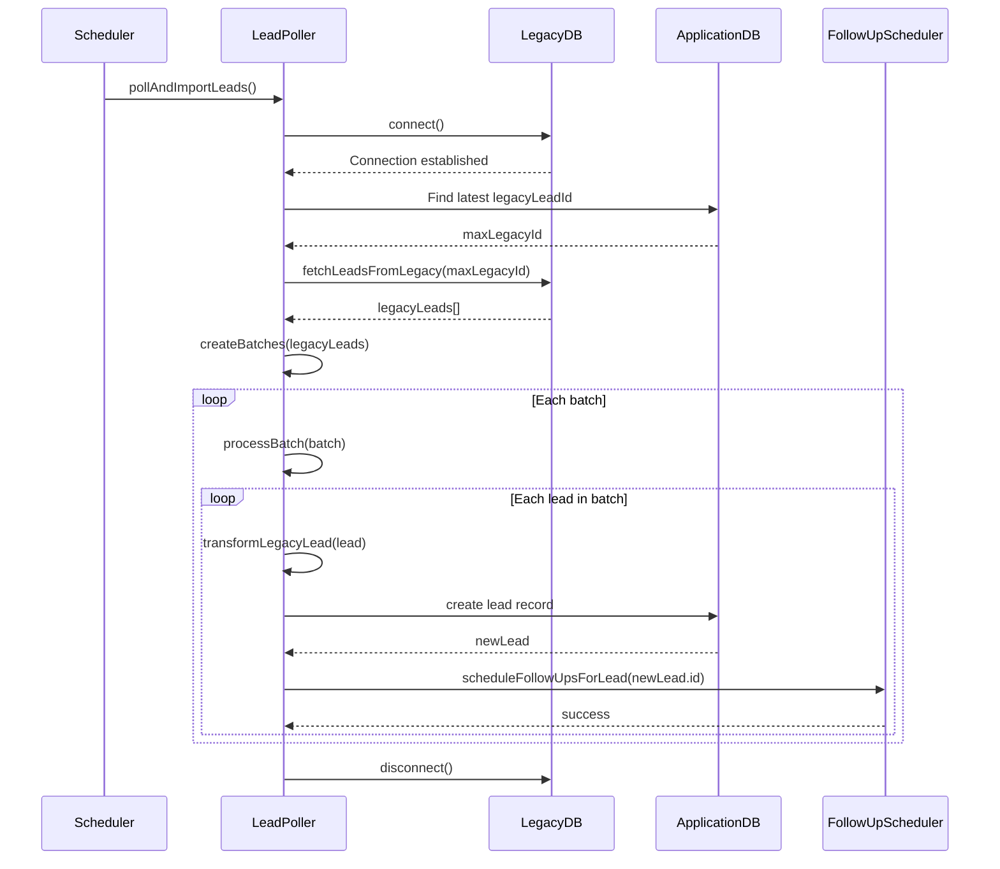
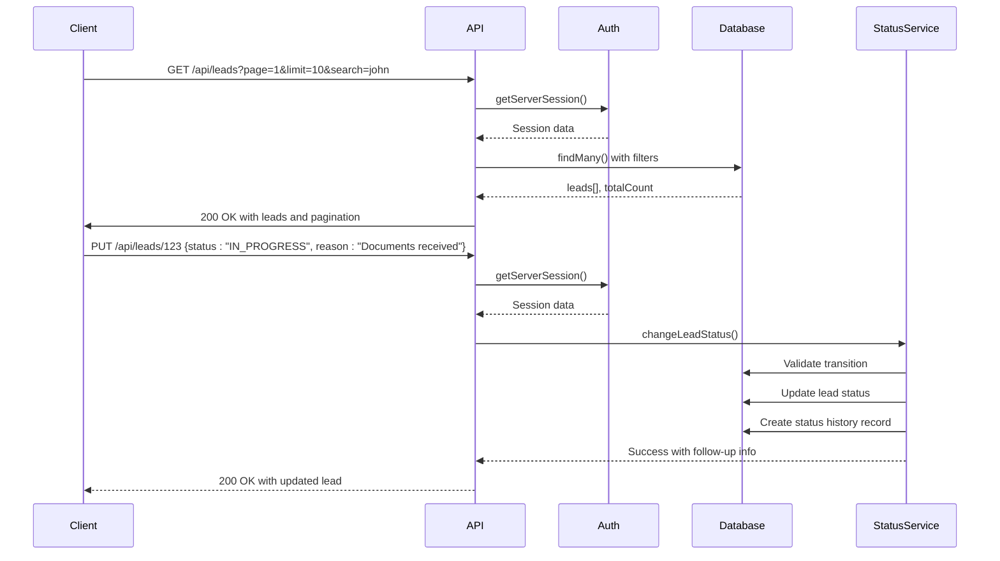
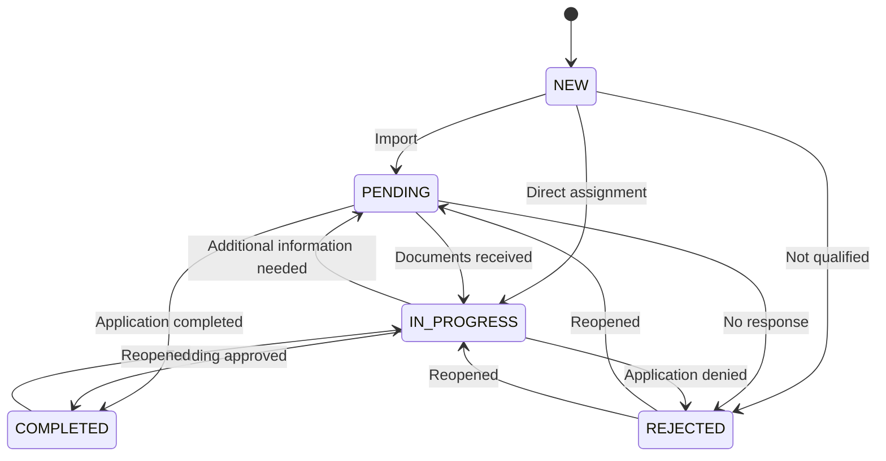
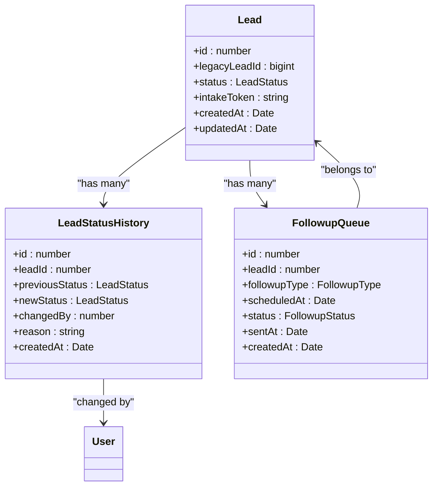
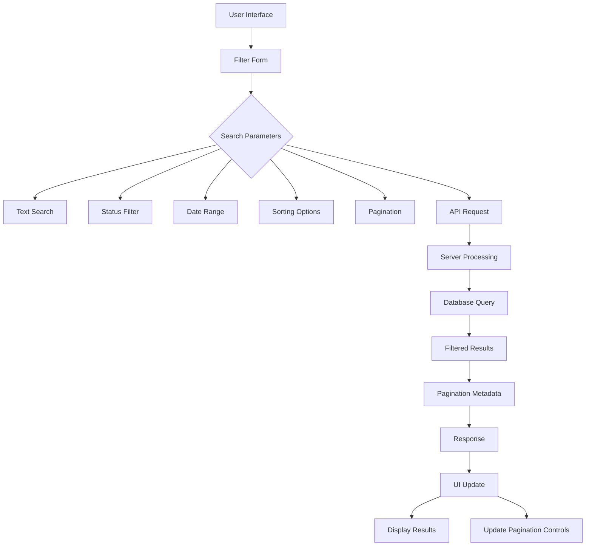
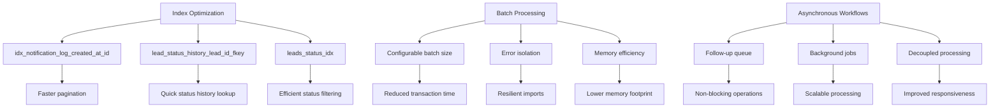

# Lead Management System

<cite>
**Referenced Files in This Document**   
- [LeadPoller.ts](file://src/services/LeadPoller.ts)
- [legacy-db.ts](file://src/lib/legacy-db.ts)
- [FollowUpScheduler.ts](file://src/services/FollowUpScheduler.ts)
- [route.ts](file://src/app/api/leads/route.ts)
- [route.ts](file://src/app/api/leads/[id]/route.ts)
- [LeadStatusService.ts](file://src/services/LeadStatusService.ts)
- [add_lead_status_history/migration.sql](file://prisma/migrations/20250730060039_add_lead_status_history/migration.sql)
- [add_notification_log_indexes/migration.sql](file://prisma/migrations/20250812120000_add_notification_log_indexes/migration.sql)
- [LeadSearchFilters.tsx](file://src/components/dashboard/LeadSearchFilters.tsx)
</cite>

## Table of Contents
1. [Introduction](#introduction)
2. [Data Synchronization and Lead Import](#data-synchronization-and-lead-import)
3. [API Endpoints for Lead Management](#api-endpoints-for-lead-management)
4. [Lead Status and Follow-Up Scheduling](#lead-status-and-follow-up-scheduling)
5. [Dashboard Filtering and Pagination](#dashboard-filtering-and-pagination)
6. [Common Issues and Error Handling](#common-issues-and-error-handling)
7. [Performance Considerations](#performance-considerations)

## Introduction
The Lead Management System is responsible for importing leads from a legacy MS SQL Server database, managing their lifecycle through various statuses, and automating follow-up communications. This document details the architecture and functionality of the system, focusing on the data synchronization process, API endpoints, status management, and performance optimizations.

## Data Synchronization and Lead Import

The lead import process is managed by the `LeadPoller` service, which synchronizes leads from a legacy MS SQL Server database into the application's primary database. The process uses a batch polling mechanism to efficiently handle large volumes of data while minimizing system load.

The `LeadPoller` connects to the legacy database using configuration parameters from environment variables, including server, database, user, password, and connection options. It queries specific campaign tables (e.g., `Leads_11302`) by joining the main `Leads` table with campaign-specific tables to retrieve both contact and business information.

The synchronization process follows these steps:
1. Connect to the legacy database
2. Determine the latest imported lead ID to fetch only new records
3. Query leads from multiple campaign tables
4. Process leads in configurable batches
5. Transform and import each lead into the application database
6. Schedule follow-up communications for new leads
7. Disconnect from the legacy database

During import, the system handles data type conversions, particularly for financial fields like `amountNeeded` and `monthlyRevenue`, which are stored as strings in the application database despite being numeric in the legacy system. This conversion was implemented in the `20250826203101_change_amount_and_revenue_to_string` migration to accommodate various formatting requirements.



**Diagram sources**
- [LeadPoller.ts](file://src/services/LeadPoller.ts#L50-L250)
- [legacy-db.ts](file://src/lib/legacy-db.ts#L40-L80)

**Section sources**
- [LeadPoller.ts](file://src/services/LeadPoller.ts#L1-L522)
- [legacy-db.ts](file://src/lib/legacy-db.ts#L1-L158)

## API Endpoints for Lead Management

The system provides RESTful API endpoints for retrieving, updating, and searching leads. All endpoints require authentication via NextAuth, with access controlled based on user roles.

### GET /api/leads - Retrieve Leads with Filtering and Pagination

This endpoint retrieves leads with comprehensive filtering, sorting, and pagination capabilities. The response includes metadata about the result set and supports cursor-based pagination.

**Request Parameters:**
- `page`: Page number (default: 1)
- `limit`: Results per page (default: 10, max: 100)
- `search`: Text search across multiple fields
- `status`: Filter by lead status (new, pending, in_progress, completed, rejected)
- `dateFrom`/`dateTo`: Date range filter for creation date
- `sortBy`: Field to sort by
- `sortOrder`: Sort order (asc/desc)

**Response Format:**
```json
{
  "leads": [
    {
      "id": 123,
      "legacyLeadId": "456",
      "firstName": "John",
      "lastName": "Doe",
      "email": "john@example.com",
      "status": "PENDING",
      "createdAt": "2025-08-26T10:00:00Z",
      "_count": {
        "notes": 2,
        "documents": 1
      }
    }
  ],
  "pagination": {
    "page": 1,
    "limit": 10,
    "totalCount": 150,
    "totalPages": 15,
    "hasNext": true,
    "hasPrev": false
  }
}
```

### GET /api/leads/[id] - Retrieve Individual Lead

Retrieves detailed information about a specific lead, including related notes, documents, and status history.

### PUT /api/leads/[id] - Update Lead

Updates lead information with special handling for status changes. When updating status, the request must include a reason for certain transitions (e.g., reopening a completed or rejected lead).

**Status Change Rules:**
- NEW → PENDING, IN_PROGRESS, REJECTED
- PENDING → IN_PROGRESS, COMPLETED, REJECTED
- IN_PROGRESS → COMPLETED, REJECTED, PENDING
- COMPLETED → IN_PROGRESS (requires reason)
- REJECTED → PENDING, IN_PROGRESS (requires reason)

The endpoint integrates with the `LeadStatusService` to validate transitions and create audit records in the `lead_status_history` table.

### DELETE /api/leads/[id] - Delete Lead

Removes a lead from the system. This operation cascades to related records based on foreign key constraints.



**Diagram sources**
- [route.ts](file://src/app/api/leads/route.ts#L30-L160)
- [route.ts](file://src/app/api/leads/[id]/route.ts#L44-L300)

**Section sources**
- [route.ts](file://src/app/api/leads/route.ts#L1-L167)
- [route.ts](file://src/app/api/leads/[id]/route.ts#L1-L304)

## Lead Status and Follow-Up Scheduling

The system implements a state machine for lead status management, with defined transitions between states. The `LeadStatusService` enforces business rules for status changes and triggers automated workflows.

When a lead is imported, it is assigned the `PENDING` status, which triggers the scheduling of follow-up communications at specific intervals: 3 hours, 9 hours, 24 hours, and 72 hours after import. These follow-ups are managed by the `FollowUpScheduler`, which maintains a queue of pending notifications.

When a lead's status changes from `PENDING` to any other status, all pending follow-ups are automatically cancelled to prevent unnecessary communications. Significant status changes (e.g., moving to COMPLETED or reopening a REJECTED lead) trigger notifications to administrative staff.

The status history is tracked in the `lead_status_history` table, which records every status change with details about the previous status, new status, user who made the change, and optional reason.





**Diagram sources**
- [LeadStatusService.ts](file://src/services/LeadStatusService.ts#L30-L100)
- [FollowUpScheduler.ts](file://src/services/FollowUpScheduler.ts#L10-L50)
- [add_lead_status_history/migration.sql](file://prisma/migrations/20250730060039_add_lead_status_history/migration.sql#L1-L19)

**Section sources**
- [LeadStatusService.ts](file://src/services/LeadStatusService.ts#L1-L456)
- [FollowUpScheduler.ts](file://src/services/FollowUpScheduler.ts#L1-L491)

## Dashboard Filtering and Pagination

The dashboard UI implements a comprehensive filtering system that allows users to search and filter leads across multiple dimensions. The `LeadSearchFilters` component provides an interface for specifying search criteria, which are then passed to the API endpoints.

The filtering system supports:
- Text search across 18 fields including names, emails, phone numbers, business information, and addresses
- Status filtering with a dropdown selector
- Date range filtering for lead creation
- Sorting by various fields in ascending or descending order
- Pagination with page navigation controls

The UI uses client-side state management to maintain filter parameters and provides visual feedback during loading states. Results are displayed with summary counts and navigation controls that indicate the current page, total pages, and availability of previous/next pages.



**Diagram sources**
- [LeadSearchFilters.tsx](file://src/components/dashboard/LeadSearchFilters.tsx#L1-L200)

**Section sources**
- [LeadSearchFilters.tsx](file://src/components/dashboard/LeadSearchFilters.tsx#L1-L200)

## Common Issues and Error Handling

The system implements robust error handling for common issues that may occur during operation:

**Duplicate Leads:** The import process prevents duplicates by tracking the highest legacy lead ID already imported. Only leads with higher IDs are fetched from the legacy system.

**Connection Timeouts:** The legacy database connection includes configurable timeouts (default 15 seconds for connection, 30 seconds for requests). The system implements retry logic with exponential backoff for transient failures.

**Data Type Mismatches:** The transformation process handles potential data type issues by sanitizing strings, formatting phone numbers, and converting numeric values to strings for financial fields.

**Error Recovery:** The batch processing mechanism isolates failures to individual leads or batches, allowing the overall import process to continue even when some records fail. Errors are logged with detailed context for troubleshooting.

**Authentication Failures:** API endpoints validate authentication before processing requests, returning appropriate HTTP status codes (401 for unauthorized, 403 for forbidden).

## Performance Considerations

The system includes several performance optimizations to handle large datasets efficiently:

**Database Indexing:** Critical tables are indexed to support fast queries. The `notification_log` table has a composite index on `(created_at DESC, id DESC)` to optimize cursor-based pagination. The `lead_status_history` table is indexed on `lead_id` to quickly retrieve status changes for a specific lead.

**Batch Processing:** The lead import process uses configurable batch sizes (default 100) to balance memory usage and database transaction overhead.

**Caching:** While not explicitly implemented in the provided code, the architecture supports caching at multiple levels, including database query results and API responses.

**Connection Pooling:** The legacy database integration uses connection pooling to minimize connection overhead during batch operations.

**Asynchronous Processing:** Follow-up scheduling is decoupled from lead import, allowing the import process to complete quickly while follow-ups are processed asynchronously.



**Diagram sources**
- [add_notification_log_indexes/migration.sql](file://prisma/migrations/20250812120000_add_notification_log_indexes/migration.sql#L1-L12)
- [add_lead_status_history/migration.sql](file://prisma/migrations/20250730060039_add_lead_status_history/migration.sql#L1-L19)

**Section sources**
- [add_notification_log_indexes/migration.sql](file://prisma/migrations/20250812120000_add_notification_log_indexes/migration.sql#L1-L12)
- [add_lead_status_history/migration.sql](file://prisma/migrations/20250730060039_add_lead_status_history/migration.sql#L1-L19)