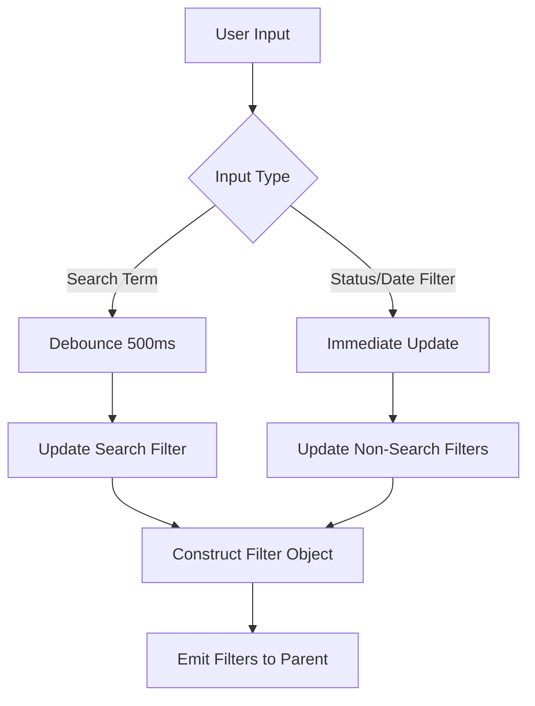
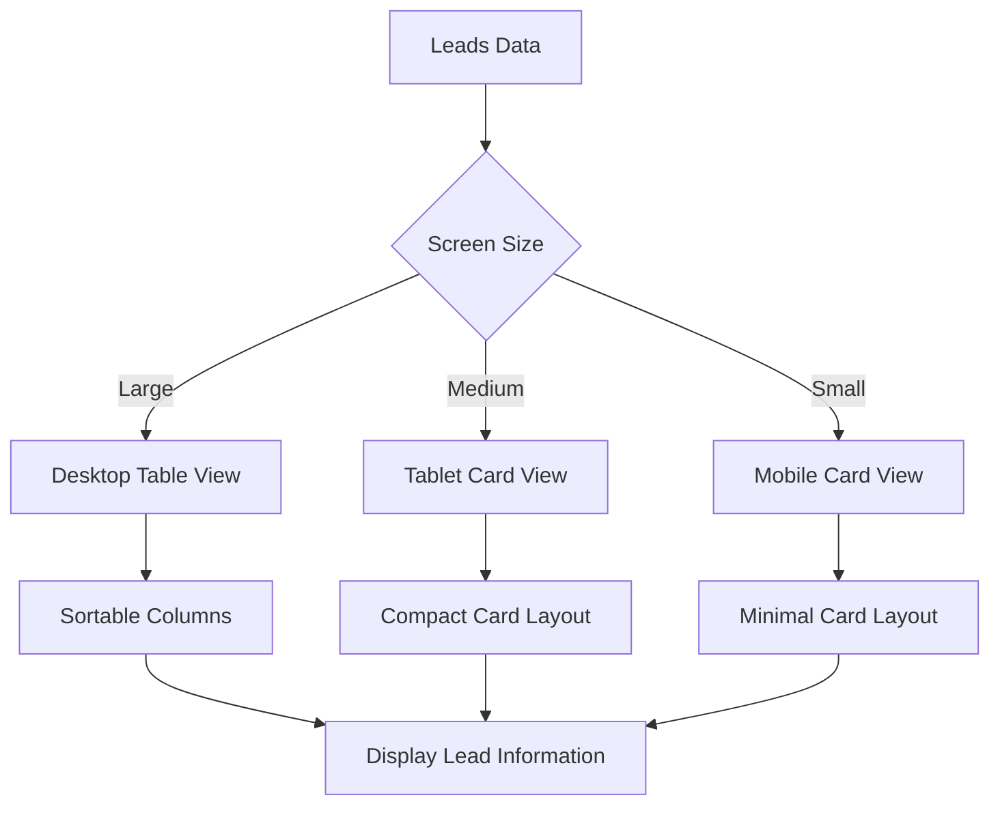
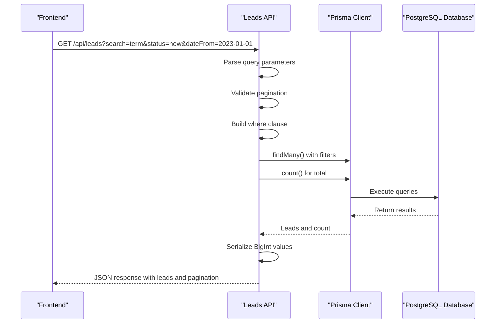
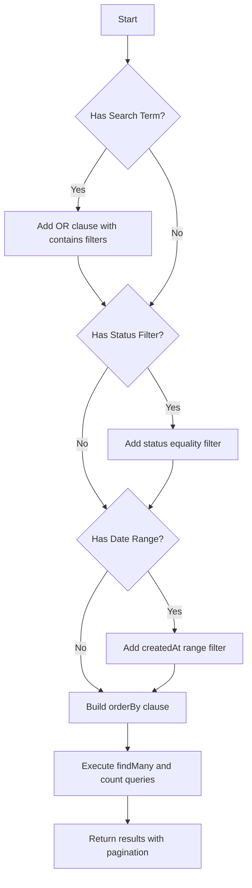
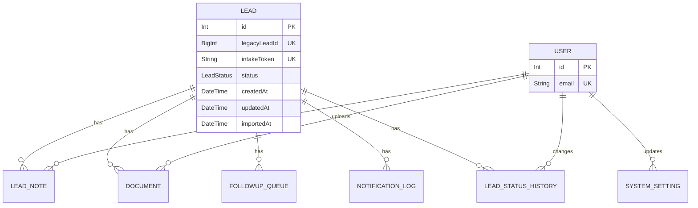
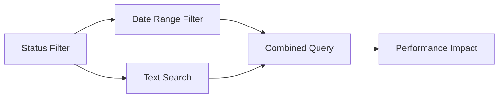
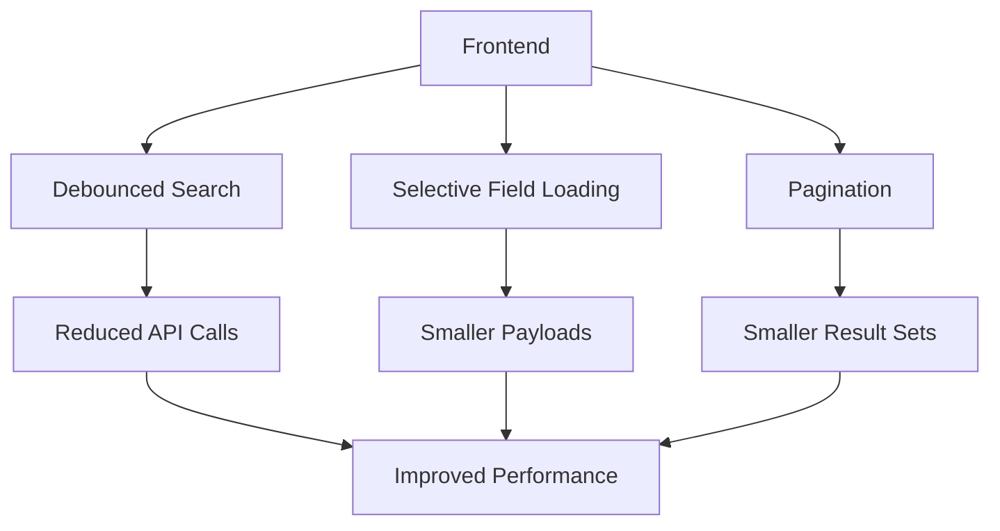

# Lead Search and Filtering

<cite>
**Referenced Files in This Document**   
- [LeadSearchFilters.tsx](file://src/components/dashboard/LeadSearchFilters.tsx)
- [LeadList.tsx](file://src/components/dashboard/LeadList.tsx)
- [route.ts](file://src/app/api/leads/route.ts)
- [schema.prisma](file://prisma/schema.prisma)
- [types.ts](file://src/components/dashboard/types.ts)
- [Pagination.tsx](file://src/components/dashboard/Pagination.tsx)
- [migration.sql](file://prisma/migrations/20250812120000_add_notification_log_indexes/migration.sql)
</cite>

## Table of Contents
1. [Introduction](#introduction)
2. [Frontend Components](#frontend-components)
3. [Backend Filtering Logic](#backend-filtering-logic)
4. [Database Indexing Strategy](#database-indexing-strategy)
5. [Complex Filter Combinations](#complex-filter-combinations)
6. [Performance Analysis and Optimization](#performance-analysis-and-optimization)
7. [Troubleshooting Common Issues](#troubleshooting-common-issues)

## Introduction
The Lead Search and Filtering functionality provides a comprehensive interface for users to locate and manage leads within the dashboard. This system combines frontend filtering components with a robust backend API that leverages Prisma ORM to construct efficient database queries. The implementation supports multiple filtering criteria including status, date ranges, and text-based search across numerous lead fields. This document details the complete flow from user interaction to database query execution, highlighting the architecture, implementation details, and optimization strategies that ensure responsive performance even with large datasets.

## Frontend Components

The frontend filtering system consists of two primary components: `LeadSearchFilters` and `LeadList`, which work together to collect user input and display filtered results.

### LeadSearchFilters Component
The `LeadSearchFilters` component provides a user interface for specifying search criteria and filter parameters. It manages state for various filter types and implements debouncing for search input to optimize API usage.



**Diagram sources**
- [LeadSearchFilters.tsx](file://src/components/dashboard/LeadSearchFilters.tsx#L1-L325)

**Section sources**
- [LeadSearchFilters.tsx](file://src/components/dashboard/LeadSearchFilters.tsx#L1-L325)
- [types.ts](file://src/components/dashboard/types.ts#L1-L65)

The component implements several key features:
- **Debounced search**: Search input is debounced with a 500ms delay to prevent excessive API calls during typing
- **Immediate filtering**: Status and date filters are applied immediately without delay
- **Active filters display**: Visual indicators show currently active filters with options to remove them individually
- **Loading states**: Visual feedback during search operations, including a spinner in the search input

The component accepts the following props:
- `filters`: Current filter state from parent component
- `onFiltersChange`: Callback for filter updates
- `onClearFilters`: Callback to clear all filters
- `loading`: Boolean indicating loading state

### LeadList Component
The `LeadList` component renders the filtered leads in a responsive table layout that adapts to different screen sizes.



**Diagram sources**
- [LeadList.tsx](file://src/components/dashboard/LeadList.tsx#L1-L462)

**Section sources**
- [LeadList.tsx](file://src/components/dashboard/LeadList.tsx#L1-L462)
- [types.ts](file://src/components/dashboard/types.ts#L1-L65)

The component provides:
- **Responsive design**: Three different layouts for desktop, tablet, and mobile views
- **Sortable columns**: Clickable headers for sorting by name, business, status, and creation date
- **Activity indicators**: Display counts for notes and documents associated with each lead
- **Loading skeleton**: Placeholder UI during data loading
- **Status badges**: Color-coded indicators for lead status (New, Pending, In Progress, Completed, Rejected)

## Backend Filtering Logic

The backend filtering logic is implemented in the leads API route, which processes filter parameters and constructs Prisma queries to retrieve matching leads.

### API Request Flow
The filtering process begins with a GET request to the `/api/leads` endpoint, which includes query parameters for all filter criteria.



**Diagram sources**
- [route.ts](file://src/app/api/leads/route.ts#L1-L167)

**Section sources**
- [route.ts](file://src/app/api/leads/route.ts#L1-L167)

### Query Parameter Processing
The API extracts and processes the following query parameters:
- `page`: Current page number (default: 1)
- `limit`: Number of results per page (default: 10, max: 100)
- `search`: Text search term
- `status`: Lead status filter
- `dateFrom`: Start date for creation date filter
- `dateTo`: End date for creation date filter
- `sortBy`: Field to sort by (default: createdAt)
- `sortOrder`: Sort direction (asc or desc, default: desc)

### Prisma Query Construction
The API constructs a dynamic Prisma query based on the provided filters:



**Section sources**
- [route.ts](file://src/app/api/leads/route.ts#L1-L167)

The filtering logic includes:
- **Text search**: Searches across 18 different fields including name, email, phone, business name, industry, location, and ID fields
- **Status filtering**: Maps URL parameter to LeadStatus enum values
- **Date range filtering**: Supports filtering by creation date with optional start and end dates
- **Sorting**: Supports sorting by 30+ fields with client-specified direction
- **Pagination**: Implements offset-based pagination with page and limit parameters

The search functionality handles special cases:
- **ID-based search**: Converts numeric search terms to match against legacyLeadId, id, and campaignId fields
- **Case-insensitive matching**: Uses Prisma's `mode: 'insensitive'` option for text searches
- **BigInt serialization**: Converts BigInt values to strings for JSON serialization

## Database Indexing Strategy

The system employs strategic database indexing to optimize query performance for frequently accessed fields.

### Schema-Based Indexes
The Prisma schema defines unique constraints and indexes on key fields:



**Diagram sources**
- [schema.prisma](file://prisma/schema.prisma#L1-L258)

**Section sources**
- [schema.prisma](file://prisma/schema.prisma#L1-L258)

Key indexed fields in the Lead model:
- `id`: Primary key index
- `legacyLeadId`: Unique index
- `intakeToken`: Unique index
- `status`: Index for filtering
- `createdAt`: Index for date-based queries
- `campaignId`: Index for campaign-based filtering

### Migration-Based Indexes
Additional indexes were added through database migrations to optimize specific query patterns:

```sql
-- Add index to speed ORDER BY created_at DESC, id DESC for cursor pagination
CREATE INDEX idx_notification_log_created_at_id ON notification_log(created_at DESC, id DESC);
```

**Section sources**
- [migration.sql](file://prisma/migrations/20250812120000_add_notification_log_indexes/migration.sql#L1-L12)

While the current implementation shows an index on the notification_log table, similar composite indexes could be beneficial for the leads table, particularly for common query patterns like:
- `(status, createdAt)` for filtering by status and date
- `(businessName, status)` for business name searches within specific statuses
- `(createdAt, status)` for chronological filtering by status

## Complex Filter Combinations

The system supports complex filter combinations that can impact query performance. Understanding these patterns helps optimize both frontend and backend implementations.

### Common Filter Combinations
Users frequently combine multiple filters to narrow down results:



**Section sources**
- [route.ts](file://src/app/api/leads/route.ts#L1-L167)
- [LeadSearchFilters.tsx](file://src/components/dashboard/LeadSearchFilters.tsx#L1-L325)

Typical complex filter scenarios:
1. **Status + Date Range**: "Show all 'In Progress' leads created in the last 30 days"
2. **Text Search + Status**: "Find leads with 'restaurant' in business name that are 'Pending'"
3. **Date Range + Multiple Text Fields**: "Find leads created in January with specific email domain"
4. **Status + Date Range + Text Search**: "Show 'New' leads from last week containing 'tech' in business name"

### Query Performance Implications
Complex filter combinations can lead to performance challenges:

- **OR clauses in text search**: The search functionality uses an OR clause across 18 fields, which can be expensive without proper indexing
- **Multiple filter conditions**: Combining status, date, and text filters creates complex WHERE clauses that may not efficiently use indexes
- **Lack of composite indexes**: Without composite indexes on frequently combined fields, the database may perform sequential scans

The current implementation mitigates some performance issues through:
- **Debounced search**: Reduces the frequency of expensive text search queries
- **Pagination**: Limits result set size to prevent overwhelming the database
- **Field selection**: Only selects necessary fields, including count of related records

## Performance Analysis and Optimization

The system includes several performance optimizations and monitoring capabilities to ensure responsive operation.

### Current Performance Optimizations
The implementation includes multiple strategies to optimize performance:



**Section sources**
- [LeadSearchFilters.tsx](file://src/components/dashboard/LeadSearchFilters.tsx#L1-L325)
- [route.ts](file://src/app/api/leads/route.ts#L1-L167)
- [Pagination.tsx](file://src/components/dashboard/Pagination.tsx#L1-L134)

Key optimization strategies:
- **Debouncing**: 500ms debounce on search input prevents excessive API calls during typing
- **Pagination**: Default limit of 10 results with configurable page size (10, 25, 50, 100)
- **Selective field loading**: The API only requests specific fields needed for display, including counts of related records
- **Error handling**: Robust error handling with specific validation for pagination parameters
- **Logging**: Comprehensive API request logging for monitoring and debugging

### Recommended Optimizations
To further improve performance, especially with large datasets, consider the following optimizations:

1. **Implement composite indexes**:
   ```sql
   CREATE INDEX idx_lead_status_created_at ON leads(status, created_at DESC);
   CREATE INDEX idx_lead_business_name_status ON leads(business_name, status);
   CREATE INDEX idx_lead_created_at_status ON leads(created_at DESC, status);
   ```

2. **Add full-text search index**:
   ```sql
   CREATE INDEX idx_lead_fulltext ON leads USING GIN (
     to_tsvector('english', 
       coalesce(first_name,'') || ' ' || 
       coalesce(last_name,'') || ' ' || 
       coalesce(business_name,'') || ' ' || 
       coalesce(email,'') || ' ' || 
       coalesce(phone,'')
     )
   );
   ```
   This would allow replacing the multiple `contains` conditions with a single full-text search.

3. **Implement cursor-based pagination** for better performance with large datasets:
   - Replace offset-based pagination with cursor-based approach
   - Use composite index on (createdAt, id) for efficient navigation
   - Eliminate performance degradation on later pages

4. **Optimize field selection**:
   - Consider implementing field selection parameters to allow clients to request only needed fields
   - For list views, potentially exclude rarely used fields like detailed business information

5. **Caching strategy**:
   - Implement Redis or similar cache for frequent filter combinations
   - Cache results for common status/date range combinations
   - Use cache headers to enable browser caching where appropriate

6. **Query optimization**:
   - Analyze query execution plans for slow queries
   - Consider breaking complex queries into simpler ones when appropriate
   - Implement query timeouts to prevent long-running operations

## Troubleshooting Common Issues

This section addresses common issues related to lead search and filtering functionality.

### Slow Response Times
**Symptoms**: Delayed response when applying filters, especially with text search or complex combinations.

**Potential Causes**:
- Large dataset without adequate indexing
- Complex OR clauses in text search
- Missing composite indexes on frequently filtered fields
- High database load

**Solutions**:
1. Verify indexes exist on filtered fields (status, createdAt, businessName)
2. Check database query performance using EXPLAIN ANALYZE
3. Implement composite indexes for common filter combinations
4. Consider full-text search implementation for text queries
5. Monitor database resource usage

### Inaccurate Search Results
**Symptoms**: Search not returning expected leads or returning irrelevant results.

**Potential Causes**:
- Case sensitivity issues
- Partial matching behavior
- Special character handling
- Numeric vs. text field matching

**Solutions**:
1. Verify case-insensitive matching is working (mode: 'insensitive')
2. Test search with various input patterns
3. Check handling of numeric searches (ID fields)
4. Consider implementing more sophisticated text search algorithms

### Pagination Issues
**Symptoms**: Incorrect page counts, missing records, or inconsistent results across pages.

**Potential Causes**:
- Data changes between page requests
- Sorting inconsistencies
- Incorrect count calculations

**Solutions**:
1. Ensure consistent sorting across requests
2. Verify count query uses same filters as data query
3. Consider implementing cursor-based pagination for large datasets
4. Check for race conditions in data modification

### Filter State Management
**Symptoms**: Filters not persisting, incorrect active filter display, or unexpected filter clearing.

**Potential Causes**:
- State synchronization issues between components
- Debounce timing conflicts
- Incorrect filter clearing logic

**Solutions**:
1. Verify filter state is properly passed between LeadSearchFilters and parent components
2. Check debounce implementation doesn't interfere with other filters
3. Test filter clearing functionality thoroughly
4. Ensure active filter display accurately reflects current state