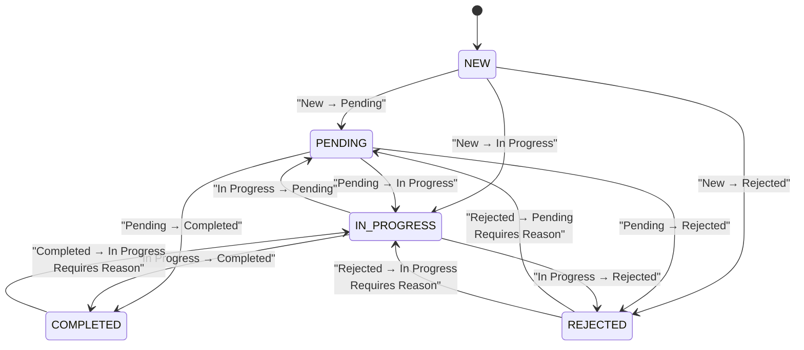
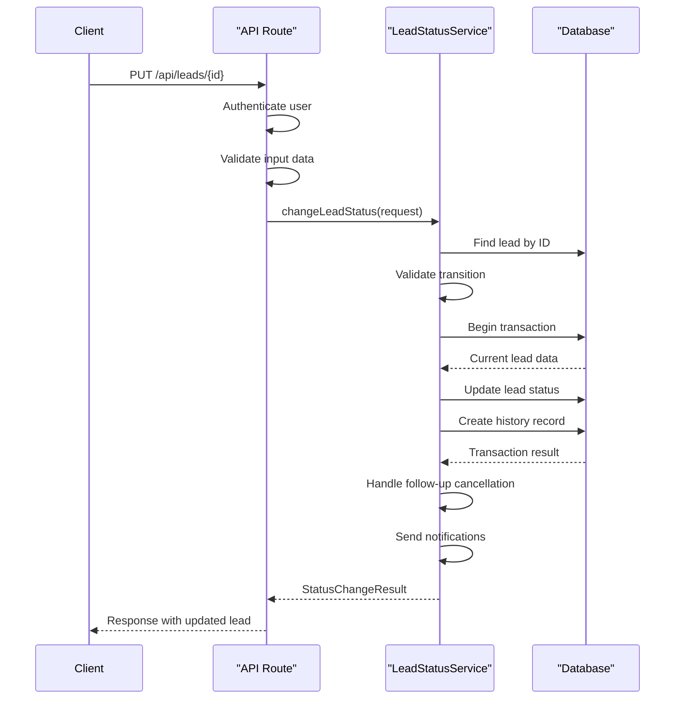
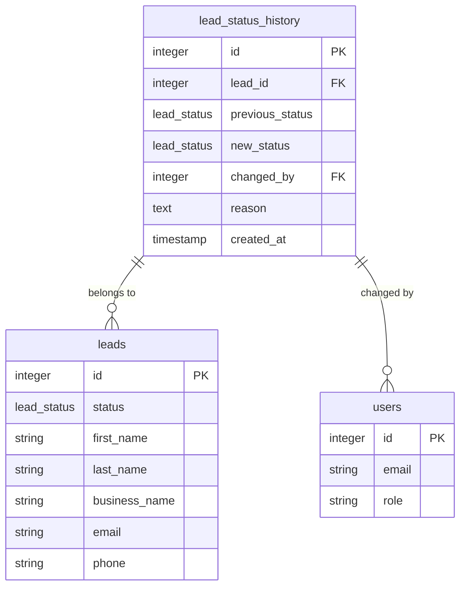
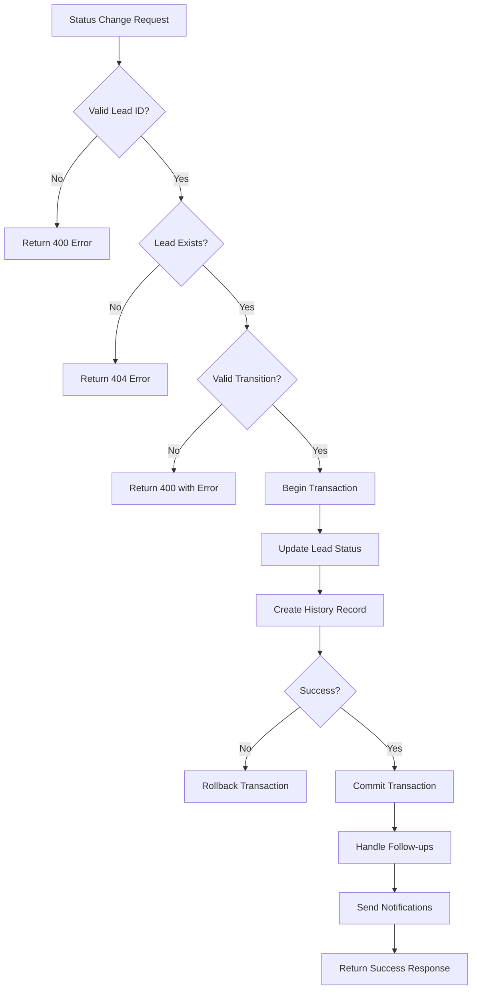
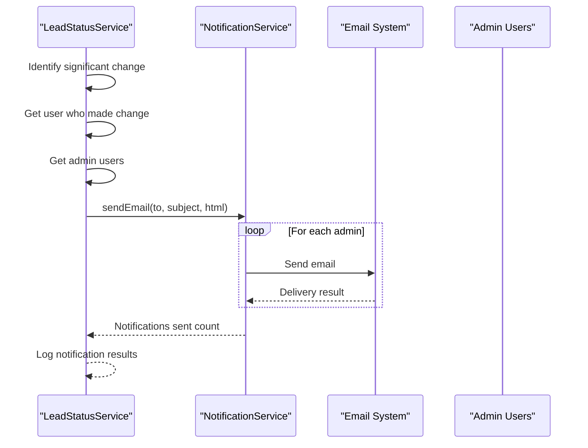

# Lead Status Workflow

<cite>
**Referenced Files in This Document**   
- [LeadStatusService.ts](file://src/services/LeadStatusService.ts)
- [status/route.ts](file://src/app/api/leads/[id]/status/route.ts)
- [route.ts](file://src/app/api/leads/[id]/route.ts)
- [StatusHistorySection.tsx](file://src/components/dashboard/StatusHistorySection.tsx)
- [LeadDetailView.tsx](file://src/components/dashboard/LeadDetailView.tsx)
- [migration.sql](file://prisma/migrations/20250730060039_add_lead_status_history/migration.sql)
</cite>

## Table of Contents
1. [Introduction](#introduction)
2. [State Transition Logic](#state-transition-logic)
3. [API Endpoint for Status Updates](#api-endpoint-for-status-updates)
4. [Database Schema for Status Tracking](#database-schema-for-status-tracking)
5. [UI Implementation and Status Visualization](#ui-implementation-and-status-visualization)
6. [Common Issues and Error Handling](#common-issues-and-error-handling)
7. [Integration with Notification Systems](#integration-with-notification-systems)
8. [Conclusion](#conclusion)

## Introduction
The Lead Status Workflow system manages the lifecycle of leads through various stages from initial contact to closure. This document details the implementation of status management, including state transitions, API interfaces, database schema, and user interface components. The system ensures proper audit trails, enforces business rules, and provides visibility into lead progression.

## State Transition Logic
The core state transition logic is implemented in the `LeadStatusService` class, which defines valid status changes and enforces business rules.



**Diagram sources**
- [LeadStatusService.ts](file://src/services/LeadStatusService.ts#L21-L58)

**Section sources**
- [LeadStatusService.ts](file://src/services/LeadStatusService.ts#L21-L58)

The system implements the following status values:
- **NEW**: New lead, not yet contacted
- **PENDING**: Awaiting prospect response or action
- **IN_PROGRESS**: Actively working with prospect
- **COMPLETED**: Successfully closed/funded
- **REJECTED**: Lead declined or not qualified

The `validateStatusTransition` method checks if a requested status change is allowed based on predefined rules. Certain transitions require a reason to be provided:
- Reopening a **COMPLETED** lead to **IN_PROGRESS**
- Reopening a **REJECTED** lead to **PENDING** or **IN_PROGRESS**

The validation process ensures data integrity by preventing invalid state transitions and requiring justification for significant status changes.

## API Endpoint for Status Updates
Lead status updates are handled through the PUT method on the `/api/leads/[id]` endpoint, which delegates status changes to the `LeadStatusService`.



**Diagram sources**
- [route.ts](file://src/app/api/leads/[id]/route.ts#L170-L214)
- [LeadStatusService.ts](file://src/services/LeadStatusService.ts#L110-L125)

**Section sources**
- [route.ts](file://src/app/api/leads/[id]/route.ts#L170-L214)
- [LeadStatusService.ts](file://src/services/LeadStatusService.ts#L110-L125)

The API endpoint performs several validation steps:
1. Authentication check using NextAuth session
2. Input validation for status value and email format
3. Verification that the lead exists
4. Delegation to `LeadStatusService` for business logic validation

When a status change occurs, the API returns additional metadata about the operation:
- `followUpsCancelled`: Indicates if follow-up tasks were cancelled
- `staffNotificationSent`: Indicates if notifications were sent to staff

## Database Schema for Status Tracking
The system maintains a complete audit trail of all status changes through the `lead_status_history` table.



**Diagram sources**
- [migration.sql](file://prisma/migrations/20250730060039_add_lead_status_history/migration.sql#L0-L17)

**Section sources**
- [migration.sql](file://prisma/migrations/20250730060039_add_lead_status_history/migration.sql#L0-L17)

The `lead_status_history` table captures:
- **lead_id**: Foreign key to the lead record
- **previous_status**: The status before the change
- **new_status**: The status after the change
- **changed_by**: Foreign key to the user who made the change
- **reason**: Optional reason for the status change
- **created_at**: Timestamp of when the change occurred

All status changes are performed within a database transaction to ensure atomicity. The foreign key constraint with `ON DELETE CASCADE` ensures that when a lead is deleted, its history is also removed.

## UI Implementation and Status Visualization
The user interface displays status history and enables status changes through the `StatusHistorySection` component.

```mermaid
flowchart TD
A[StatusHistorySection] --> B[Fetch Status Info]
B --> C{GET /api/leads/{id}/status}
C --> D[Display Current Status]
D --> E[Show Status History Timeline]
E --> F[Display Available Transitions]
F --> G[Show Change Status Button]
G --> H[Status Change Form]
H --> I[Validate Reason if Required]
I --> J[PUT /api/leads/{id}]
J --> K[Refresh Status Info]
K --> L[Update UI]
```

**Diagram sources**
- [StatusHistorySection.tsx](file://src/components/dashboard/StatusHistorySection.tsx#L0-L374)
- [LeadDetailView.tsx](file://src/components/dashboard/LeadDetailView.tsx#L0-L199)

**Section sources**
- [StatusHistorySection.tsx](file://src/components/dashboard/StatusHistorySection.tsx#L0-L374)
- [LeadDetailView.tsx](file://src/components/dashboard/LeadDetailView.tsx#L0-L199)

The UI implementation includes:
- **Status Timeline**: A vertical timeline showing all status changes with timestamps, users, and reasons
- **Status Badges**: Color-coded badges indicating current status (blue for NEW, yellow for PENDING, etc.)
- **Status Change Form**: A modal form that only shows valid transitions based on current status
- **Reason Validation**: Required reason fields for reopening completed or rejected leads

The `LeadDetailView` component integrates the `StatusHistorySection` and handles status change events by refreshing the lead data after successful updates.

## Common Issues and Error Handling
The system addresses several common issues related to lead status management:

### Invalid State Transitions
The `validateStatusTransition` method prevents invalid transitions by checking against the predefined rules. Attempts to make invalid changes return a 400 error with a descriptive message explaining the allowed transitions.

### Concurrent Updates
The system uses database transactions to ensure atomic updates. However, there is a potential race condition when multiple users attempt to update the same lead simultaneously. The current implementation does not include optimistic locking, which could lead to lost updates.

### Audit Trail Completeness
The audit trail is maintained through the `lead_status_history` table, which is updated within the same transaction as the lead update. This ensures that every status change is recorded, even if subsequent operations (like notification sending) fail.

### Error Handling
The system implements comprehensive error handling:
- Database errors are caught and logged
- Notification failures do not prevent status changes
- Validation errors provide clear feedback to users
- All errors are logged with relevant context



**Diagram sources**
- [LeadStatusService.ts](file://src/services/LeadStatusService.ts#L110-L178)
- [route.ts](file://src/app/api/leads/[id]/route.ts#L170-L214)

**Section sources**
- [LeadStatusService.ts](file://src/services/LeadStatusService.ts#L110-L178)
- [route.ts](file://src/app/api/leads/[id]/route.ts#L170-L214)

## Integration with Notification Systems
The system integrates with notification services to alert staff about significant status changes.



**Diagram sources**
- [LeadStatusService.ts](file://src/services/LeadStatusService.ts#L245-L393)

**Section sources**
- [LeadStatusService.ts](file://src/services/LeadStatusService.ts#L245-L393)

Notifications are sent for significant status changes, including:
- New leads moved to IN_PROGRESS
- Pending leads moved to IN_PROGRESS or COMPLETED
- In progress leads completed
- Completed or rejected leads reopened

The notification system is designed to be resilient:
- Notification failures do not roll back status changes
- Each admin user is notified individually
- Failed notifications are logged for troubleshooting
- The system verifies that admin users exist before sending

## Conclusion
The Lead Status Workflow provides a robust system for managing lead lifecycles with proper validation, audit trails, and user feedback. The implementation separates concerns effectively between the service layer, API endpoints, and UI components. Key strengths include comprehensive validation rules, complete audit logging, and integration with notification systems. Areas for potential improvement include adding optimistic locking for concurrent updates and enhancing the notification system with retry mechanisms.