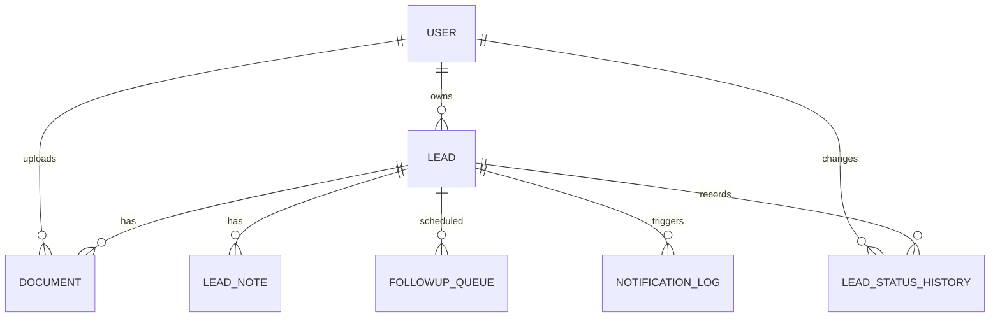
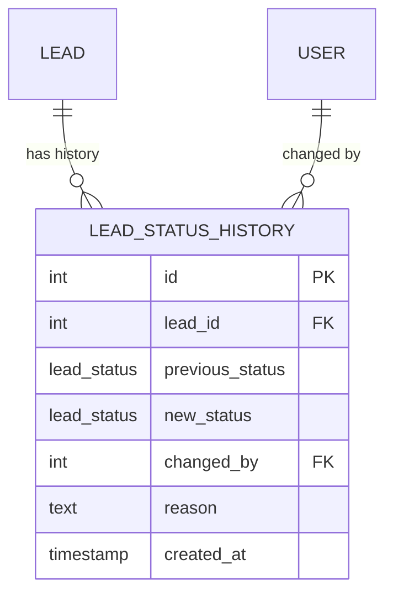
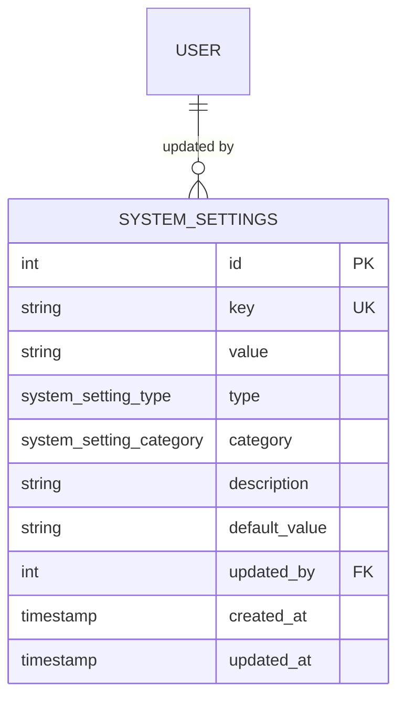
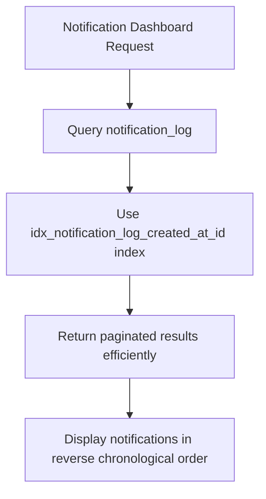
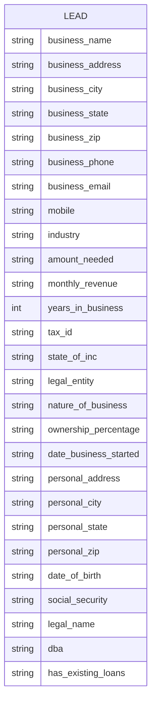
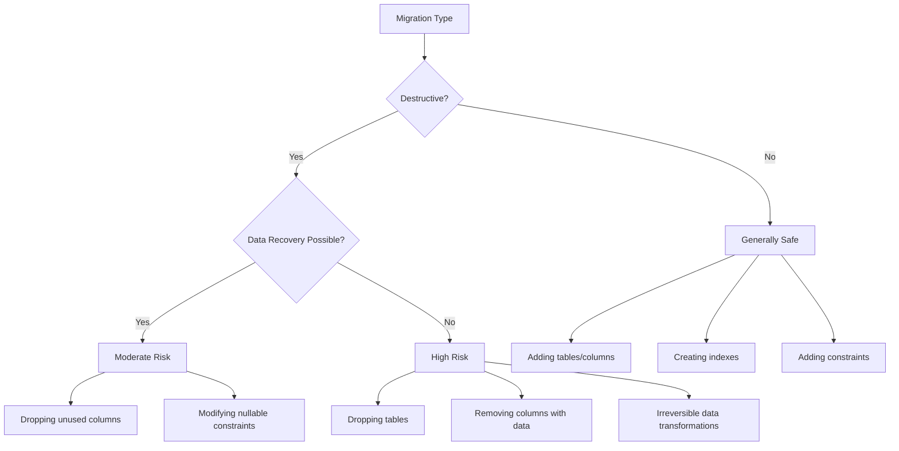
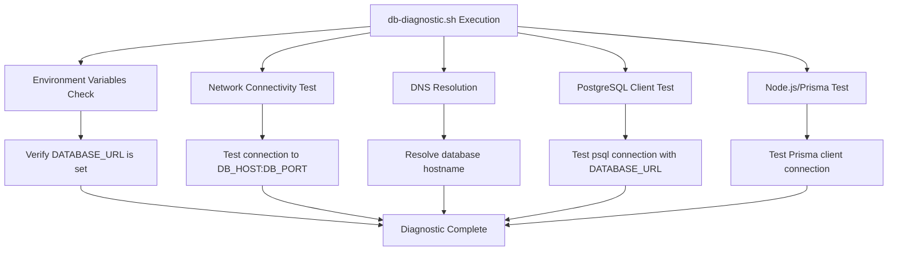

# Database Migration Strategy

<cite>
**Referenced Files in This Document**   
- [schema.prisma](file://prisma/schema.prisma)
- [20240101000000_init/migration.sql](file://prisma/migrations/20240101000000_init/migration.sql)
- [20250728210021_initial_migration/migration.sql](file://prisma/migrations/20250728210021_initial_migration/migration.sql)
- [20250730060039_add_lead_status_history/migration.sql](file://prisma/migrations/20250730060039_add_lead_status_history/migration.sql)
- [20250811125856_add_system_settings/migration.sql](file://prisma/migrations/20250811125856_add_system_settings/migration.sql)
- [20250811140542_remove_security_settings/migration.sql](file://prisma/migrations/20250811140542_remove_security_settings/migration.sql)
- [20250811142825_remove_extra_categories/migration.sql](file://prisma/migrations/20250811142825_remove_extra_categories/migration.sql)
- [20250811152328_cleanup_unused_settings/migration.sql](file://prisma/migrations/20250811152328_cleanup_unused_settings/migration.sql)
- [20250812120000_add_notification_log_indexes/migration.sql](file://prisma/migrations/20250812120000_add_notification_log_indexes/migration.sql)
- [20250826082902_add_lead_business_fields/migration.sql](file://prisma/migrations/20250826082902_add_lead_business_fields/migration.sql)
- [20250826121117_add_comprehensive_lead_fields/migration.sql](file://prisma/migrations/20250826121117_add_comprehensive_lead_fields/migration.sql)
- [20250826125518_add_mobile_field/migration.sql](file://prisma/migrations/20250826125518_add_mobile_field/migration.sql)
- [20250826203101_change_amount_and_revenue_to_string/migration.sql](file://prisma/migrations/20250826203101_change_amount_and_revenue_to_string/migration.sql)
- [migration_lock.toml](file://prisma/migrations/migration_lock.toml)
- [db-diagnostic.sh](file://scripts/db-diagnostic.sh)
- [prisma-migrate-and-start.mjs](file://scripts/prisma-migrate-and-start.mjs)
- [debug-migrations.sh](file://scripts/debug-migrations.sh)
- [SystemSettingsService.ts](file://src/services/SystemSettingsService.ts)
- [LeadStatusService.ts](file://src/services/LeadStatusService.ts)
- [system-settings.ts](file://prisma/seeds/system-settings.ts)
</cite>

## Table of Contents
1. [Introduction](#introduction)
2. [Migration Evolution and Key Changes](#migration-evolution-and-key-changes)
3. [Branching and Collaboration Workflow](#branching-and-collaboration-workflow)
4. [Best Practices for Migration Development](#best-practices-for-migration-development)
5. [Migration Validation and Rollback Procedures](#migration-validation-and-rollback-procedures)
6. [Safe vs. Unsafe Migration Patterns](#safe-vs-unsafe-migration-patterns)
7. [Migration Health Checks with db-diagnostic.sh](#migration-health-checks-with-db-diagnosticsh)
8. [Conclusion](#conclusion)

## Introduction
This document outlines the database migration strategy for the Fund Track application using Prisma Migrate. The strategy encompasses the evolution of the database schema through structured migrations, team collaboration practices, and operational procedures for safe deployment. The system uses Prisma to manage schema changes across development, staging, and production environments, ensuring data integrity and backward compatibility.

The migration process is designed to be both developer-friendly and production-safe, incorporating validation, rollback capabilities, and health checks. This documentation details the key migrations that have shaped the current database structure, explains the collaboration workflow using migration_lock.toml, and provides best practices for creating and managing migrations.

**Section sources**
- [schema.prisma](file://prisma/schema.prisma)
- [migration_lock.toml](file://prisma/migrations/migration_lock.toml)

## Migration Evolution and Key Changes

### Initial Setup
The database migration history begins with two foundational migrations: `20240101000000_init` and `20250728210021_initial_migration`. These migrations establish the core schema structure including essential models such as User, Lead, Document, and NotificationLog. The initial setup creates all base tables with appropriate primary keys, foreign key constraints, and essential indexes to support application functionality from day one.



**Diagram sources**
- [schema.prisma](file://prisma/schema.prisma#L30-L257)
- [20240101000000_init/migration.sql](file://prisma/migrations/20240101000000_init/migration.sql)

### Lead Status History Addition
The `20250730060039_add_lead_status_history` migration introduced audit tracking for lead status changes by creating the `lead_status_history` table. This enhancement enables full audit capability for lead lifecycle management, capturing who changed a lead's status, when it was changed, and why.

The migration creates a new table with foreign key relationships to both the leads and users tables, ensuring referential integrity. The `ON DELETE CASCADE` constraint on the lead_id ensures that status history is automatically removed if a lead is deleted, while `ON DELETE RESTRICT` on changed_by prevents deletion of users who have recorded status changes.



**Diagram sources**
- [20250730060039_add_lead_status_history/migration.sql](file://prisma/migrations/20250730060039_add_lead_status_history/migration.sql)
- [schema.prisma](file://prisma/schema.prisma#L185-L200)

**Section sources**
- [20250730060039_add_lead_status_history/migration.sql](file://prisma/migrations/20250730060039_add_lead_status_history/migration.sql)
- [LeadStatusService.ts](file://src/services/LeadStatusService.ts)

### System Settings Implementation
The `20250811125856_add_system_settings` migration introduced a flexible configuration system by adding the `system_settings` table and associated enums. This change enables runtime configuration of application behavior without requiring code deployments.

The migration creates a key-value store for system settings with type safety through the `system_setting_type` enum (boolean, string, number, json) and organizational categorization via the `system_setting_category` enum. The implementation includes a unique index on the key column to prevent duplicates and a foreign key relationship to the users table to track who last updated each setting.



**Diagram sources**
- [20250811125856_add_system_settings/migration.sql](file://prisma/migrations/20250811125856_add_system_settings/migration.sql)
- [schema.prisma](file://prisma/schema.prisma#L202-L221)

**Section sources**
- [20250811125856_add_system_settings/migration.sql](file://prisma/migrations/20250811125856_add_system_settings/migration.sql)
- [SystemSettingsService.ts](file://src/services/SystemSettingsService.ts)
- [system-settings.ts](file://prisma/seeds/system-settings.ts)

### Notification Log Indexing
The `20250812120000_add_notification_log_indexes` migration optimized query performance for the notification system by adding a composite index on the notification_log table. The index on `(created_at DESC, id DESC)` supports efficient cursor-based pagination, which is critical for the admin notification dashboard that displays recent notifications.

The migration also includes a commented-out GIN full-text index suggestion for advanced search capabilities across multiple text columns (recipient, subject, content, etc.), indicating forward-thinking design for future search functionality.



**Diagram sources**
- [20250812120000_add_notification_log_indexes/migration.sql](file://prisma/migrations/20250812120000_add_notification_log_indexes/migration.sql)

**Section sources**
- [20250812120000_add_notification_log_indexes/migration.sql](file://prisma/migrations/20250812120000_add_notification_log_indexes/migration.sql)

### Lead Field Enhancements
A series of migrations between August 26, 2025, significantly enhanced the lead data model to capture comprehensive business and personal information:

- `20250826082902_add_lead_business_fields`: Added core business metrics (amount_needed, industry, monthly_revenue, years_in_business)
- `20250826121117_add_comprehensive_lead_fields`: Added extensive business and personal details including addresses, legal information, and financial identifiers
- `20250826125518_add_mobile_field`: Added a dedicated mobile contact field
- `20250826203101_change_amount_and_revenue_to_string`: Changed amount_needed and monthly_revenue from INTEGER to TEXT to accommodate formatted currency values and special cases

The final migration converting financial fields to strings suggests a shift in data handling strategy, likely to support currency formatting, commas in large numbers, or non-numeric values like "negotiable" or "TBD".



**Diagram sources**
- [schema.prisma](file://prisma/schema.prisma#L68-L118)
- [20250826082902_add_lead_business_fields/migration.sql](file://prisma/migrations/20250826082902_add_lead_business_fields/migration.sql)
- [20250826121117_add_comprehensive_lead_fields/migration.sql](file://prisma/migrations/20250826121117_add_comprehensive_lead_fields/migration.sql)
- [20250826203101_change_amount_and_revenue_to_string/migration.sql](file://prisma/migrations/20250826203101_change_amount_and_revenue_to_string/migration.sql)

**Section sources**
- [20250826082902_add_lead_business_fields/migration.sql](file://prisma/migrations/20250826082902_add_lead_business_fields/migration.sql)
- [20250826121117_add_comprehensive_lead_fields/migration.sql](file://prisma/migrations/20250826121117_add_comprehensive_lead_fields/migration.sql)
- [20250826125518_add_mobile_field/migration.sql](file://prisma/migrations/20250826125518_add_mobile_field/migration.sql)
- [20250826203101_change_amount_and_revenue_to_string/migration.sql](file://prisma/migrations/20250826203101_change_amount_and_revenue_to_string/migration.sql)

## Branching and Collaboration Workflow

### migration_lock.toml Configuration
The repository includes a `migration_lock.toml` file in the migrations directory, which is essential for coordinating database schema changes across multiple developers and branches. The file contains:

```
# Please do not edit this file manually
# It should be added in your version-control system (i.e. Git)
provider = "postgresql"
```

This configuration specifies the database provider (PostgreSQL) and serves as a coordination mechanism to prevent migration conflicts. When developers work on separate branches that both require schema changes, Prisma uses this file to detect potential conflicts during the merge process.

The workflow typically involves:
1. Developer A creates a feature branch and generates a migration using `prisma migrate dev`
2. Developer B creates a different feature branch and generates another migration
3. When merging to main, if both migrations were created after the same baseline, a conflict is detected
4. The team must decide on the correct migration order and potentially combine or rebase migrations

This approach ensures that migration history remains linear and can be reliably applied in production, preventing out-of-order execution that could break the database schema.

**Section sources**
- [migration_lock.toml](file://prisma/migrations/migration_lock.toml)

## Best Practices for Migration Development

### Creating New Migrations
When creating new migrations, follow these best practices:

1. **Use descriptive names**: Migration names should clearly describe the change (e.g., `add_lead_status_history` rather than `add_table_1`)
2. **Single responsibility**: Each migration should address one logical change to avoid complex rollbacks
3. **Test thoroughly**: Always test migrations against a copy of production data when possible
4. **Consider data volume**: For large tables, consider the performance impact of schema changes
5. **Document intent**: Use SQL comments to explain the purpose of complex migrations

The development workflow typically involves:
```bash
# 1. Make changes to schema.prisma
# 2. Generate migration
npx prisma migrate dev --name add_your_feature

# 3. Review generated SQL
# 4. Test migration locally
# 5. Commit migration files
```

### Handling Destructive Changes
Destructive changes (dropping columns, tables, or constraints) require special consideration:

1. **Assess impact**: Determine if the change affects data that is still needed
2. **Plan migration strategy**: For column removal, consider a multi-phase approach:
   - Phase 1: Add new column, update application to write to both
   - Phase 2: Backfill data, update application to read from new column
   - Phase 3: Remove old column
3. **Backup first**: Always ensure backups are current before applying destructive migrations
4. **Use transactions**: Wrap destructive operations in transactions when possible

The migration `20250811140542_remove_security_settings` demonstrates a safe approach to enum value removal by creating a new enum type, altering the column to use the new type, and then dropping the old type—all within a transaction block.

### Maintaining Backward Compatibility
To maintain backward compatibility during migrations:

1. **Avoid breaking API contracts**: Ensure that application code can handle both old and new schema versions during deployment
2. **Use nullable fields initially**: When adding required fields, start with nullable and populate data before making them required
3. **Support dual writing**: During transitions, write to both old and new structures
4. **Version database interactions**: Consider versioning critical data structures

The evolution of the lead fields shows this principle in action—the application gradually added new fields rather than overhauling the entire lead structure at once, allowing for incremental adoption.

**Section sources**
- [20250811140542_remove_security_settings/migration.sql](file://prisma/migrations/20250811140542_remove_security_settings/migration.sql)
- [20250826203101_change_amount_and_revenue_to_string/migration.sql](file://prisma/migrations/20250826203101_change_amount_and_revenue_to_string/migration.sql)

## Migration Validation and Rollback Procedures

### Validation Process
Before applying migrations to production, validate them through:

1. **Local testing**: Apply migrations to a local database with realistic data
2. **Staging deployment**: Test migrations in a staging environment that mirrors production
3. **Schema verification**: Use `prisma db pull` to verify the resulting schema matches expectations
4. **Application testing**: Ensure all application features continue to work

The `debug-migrations.sh` script provides diagnostic capabilities to verify migration files are present and correctly structured in deployment environments.

### Rollback Strategies
Rollback procedures depend on the migration type:

**For non-destructive migrations** (adding columns, indexes, tables):
- Reverse the operation (drop column, index, or table)
- Use the corresponding `prisma migrate resolve` command

**For destructive migrations**:
- Restore from backup if data was lost
- Reapply the removed structure and reimport data if available

**For data type changes** (like `change_amount_and_revenue_to_string`):
- Consider data compatibility—converting string to integer may fail if strings contain non-numeric characters
- Implement data cleansing during rollback

Prisma Migrate does not automatically generate rollback scripts, so teams must plan reversibility carefully. The recommended approach is to treat migrations as largely irreversible and rely on backups for disaster recovery.

### Conflict Resolution
When migration conflicts occur (multiple branches with independent migrations):

1. **Identify the conflict**: Use `prisma migrate status` to see pending migrations
2. **Determine correct order**: Evaluate dependencies between migrations
3. **Rebase or merge**: Either rebase one branch onto the other or create a new migration that combines the changes
4. **Test thoroughly**: Validate the combined migration sequence

The presence of `migration_lock.toml` helps detect these conflicts early in the development process.

**Section sources**
- [debug-migrations.sh](file://scripts/debug-migrations.sh)
- [prisma-migrate-and-start.mjs](file://scripts/prisma-migrate-and-start.mjs)

## Safe vs. Unsafe Migration Patterns

### Safe Migration Patterns
**Adding non-nullable columns with defaults:**
```sql
-- Safe: Adding a column with a default value
ALTER TABLE "leads" ADD COLUMN "status" TEXT NOT NULL DEFAULT 'NEW';
```

**Creating indexes:**
```sql
-- Safe: Index creation doesn't modify data
CREATE INDEX idx_notification_log_created_at_id ON notification_log(created_at DESC, id DESC);
```

**Adding tables:**
```sql
-- Safe: New table doesn't affect existing data
CREATE TABLE "lead_status_history" (
    "id" SERIAL NOT NULL,
    "lead_id" INTEGER NOT NULL,
    "previous_status" "lead_status",
    "new_status" "lead_status" NOT NULL,
    "changed_by" INTEGER NOT NULL,
    "reason" TEXT,
    "created_at" TIMESTAMP(3) NOT NULL DEFAULT CURRENT_TIMESTAMP,
    CONSTRAINT "lead_status_history_pkey" PRIMARY KEY ("id")
);
```

### Unsafe Migration Patterns
**Removing columns with data:**
```sql
-- Unsafe: Data loss occurs immediately
ALTER TABLE "leads" DROP COLUMN "old_field";
```

**Changing data types without validation:**
```sql
-- Potentially unsafe: May fail if data doesn't conform
ALTER TABLE "leads" ALTER COLUMN "amount_needed" SET DATA TYPE INTEGER;
```

**Large-scale data modifications:**
```sql
-- Risky: Performance impact on large tables
UPDATE "leads" SET "status" = 'NEW' WHERE "status" IS NULL;
```

The migration `20250826203101_change_amount_and_revenue_to_string` represents a safer approach to data type changes by going from integer to string, which is generally non-destructive, rather than the reverse which could fail on non-numeric strings.



**Diagram sources**
- [20250826203101_change_amount_and_revenue_to_string/migration.sql](file://prisma/migrations/20250826203101_change_amount_and_revenue_to_string/migration.sql)
- [20250811140542_remove_security_settings/migration.sql](file://prisma/migrations/20250811140542_remove_security_settings/migration.sql)

**Section sources**
- [20250826203101_change_amount_and_revenue_to_string/migration.sql](file://prisma/migrations/20250826203101_change_amount_and_revenue_to_string/migration.sql)
- [20250811140542_remove_security_settings/migration.sql](file://prisma/migrations/20250811140542_remove_security_settings/migration.sql)

## Migration Health Checks with db-diagnostic.sh

### Diagnostic Script Overview
The `db-diagnostic.sh` script provides comprehensive database connectivity and health checks essential for validating migration environments. The script performs multiple verification steps:



**Diagram sources**
- [db-diagnostic.sh](file://scripts/db-diagnostic.sh)

### Integration with Migration Workflow
The diagnostic script should be used at multiple points in the migration lifecycle:

1. **Pre-migration validation**: Run before applying migrations to ensure database connectivity
2. **Post-migration verification**: Confirm database is accessible after schema changes
3. **Deployment troubleshooting**: Diagnose issues when migrations fail in production
4. **Scheduled monitoring**: Run periodically to detect connectivity issues

The script's layered approach—testing from network connectivity up to application-level database access—provides a comprehensive health assessment. It checks:
- Environment configuration (DATABASE_URL)
- Network reachability (using nc or telnet)
- DNS resolution of the database host
- Direct PostgreSQL connectivity (using psql)
- Application-level connectivity (using Prisma client)

This multi-layered verification ensures that migration failures are caught early and can be diagnosed effectively.

### Production Deployment Integration
The `prisma-migrate-and-start.mjs` script demonstrates production-ready migration practices with built-in resilience:

```javascript
// Retry mechanism for migration deployment
for (let attempt = 1; attempt <= maxAttempts; attempt += 1) {
  try {
    await run("prisma", ["migrate", "deploy"]);
    break; // Success - exit loop
  } catch (error) {
    if (attempt >= maxAttempts) {
      process.exit(1); // Fail after maximum attempts
    }
    await new Promise((r) => setTimeout(r, backoffMs)); // Exponential backoff
  }
}
```

This implementation includes:
- Configurable retry attempts (default: 30)
- Configurable backoff delay (default: 2000ms)
- Graceful failure with appropriate exit codes
- Logging for monitoring and debugging

The retry mechanism is crucial for cloud deployments where database availability might be temporarily delayed during infrastructure provisioning.

**Section sources**
- [db-diagnostic.sh](file://scripts/db-diagnostic.sh)
- [prisma-migrate-and-start.mjs](file://scripts/prisma-migrate-and-start.mjs)

## Conclusion
The database migration strategy for the Fund Track application demonstrates a mature, production-ready approach to schema evolution using Prisma Migrate. The strategy balances developer productivity with operational safety through well-structured migrations, comprehensive testing, and resilient deployment procedures.

Key strengths of the current approach include:
- Clear migration naming and organization
- Incremental schema evolution that maintains backward compatibility
- Comprehensive health checks and diagnostic tools
- Resilient deployment workflows with retry mechanisms
- Thoughtful consideration of data integrity and audit requirements

To further strengthen the migration strategy, consider:
1. Implementing automated migration testing in CI/CD pipelines
2. Adding migration documentation templates
3. Establishing a migration review process for production changes
4. Enhancing monitoring for migration success/failure rates
5. Developing a formal rollback playbook for critical migrations

The existing foundation provides a solid basis for reliable database schema management as the application continues to evolve.