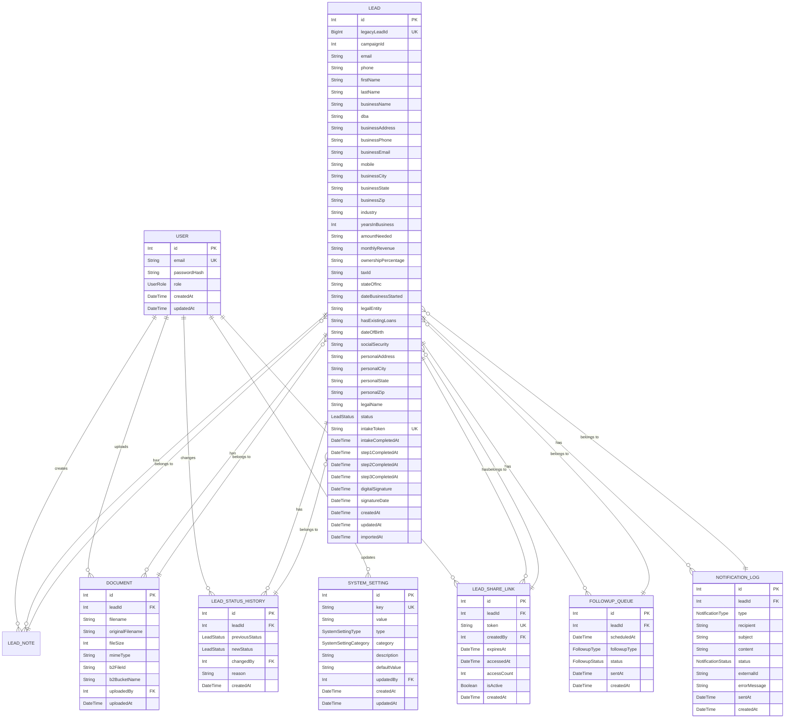

# Database Schema Design

<cite>
**Referenced Files in This Document**   
- [prisma/schema.prisma](file://prisma/schema.prisma) - *Updated with digital signature, industry, lead share links and system admin role*
- [prisma/migrations/20250829134057_add_digital_signature/migration.sql](file://prisma/migrations/20250829134057_add_digital_signature/migration.sql) - *Added digital signature fields*
- [prisma/migrations/20250829131033_replace_nature_of_business_with_industry/migration.sql](file://prisma/migrations/20250829131033_replace_nature_of_business_with_industry/migration.sql) - *Replaced natureOfBusiness with industry*
- [prisma/migrations/20250826125518_add_mobile_field/migration.sql](file://prisma/migrations/20250826125518_add_mobile_field/migration.sql) - *Added mobile field*
- [prisma/migrations/20250917154515_add_lead_share_links/migration.sql](file://prisma/migrations/20250917154515_add_lead_share_links/migration.sql) - *Added lead share links functionality*
- [prisma/migrations/20250906054914_add_system_admin_role/migration.sql](file://prisma/migrations/20250906054914_add_system_admin_role/migration.sql) - *Added system admin role*
- [src/components/intake/Step3Form.tsx](file://src/components/intake/Step3Form.tsx) - *Digital signature implementation*
- [src/components/dashboard/LeadDetailView.tsx](file://src/components/dashboard/LeadDetailView.tsx) - *Industry and digital signature display*
- [src/app/api/intake/[token]/step1/route.ts](file://src/app/api/intake/[token]/step1/route.ts) - *Industry field validation*
- [src/app/api/intake/[token]/step3/route.ts](file://src/app/api/intake/[token]/step3/route.ts) - *Digital signature API endpoint*
</cite>

## Table of Contents
1. [Core Data Models](#core-data-models)
2. [Entity Relationships](#entity-relationships)
3. [Database Schema Diagram](#database-schema-diagram)
4. [Migration Strategy](#migration-strategy)
5. [Seed Data Setup](#seed-data-setup)
6. [Data Validation and Business Constraints](#data-validation-and-business-constraints)
7. [Performance Considerations](#performance-considerations)

## Core Data Models

This section details the core entities in the fund-track application's Prisma schema, including field definitions, data types, primary/foreign keys, indexes, and constraints.

### Lead Entity

The Lead entity represents a potential customer in the funding process.

**Field Definitions:**
- `id`: Int, @id @default(autoincrement()) - Primary key
- `legacyLeadId`: BigInt, @unique - Unique identifier from legacy system
- `campaignId`: Int - Marketing campaign identifier
- `email`: String? - Prospect's email address
- `phone`: String? - Prospect's phone number
- `firstName`: String? - Prospect's first name
- `lastName`: String? - Prospect's last name
- `businessName`: String? - Business name
- `dba`: String? - "Doing Business As" name
- `businessAddress`: String? - Business physical address
- `businessPhone`: String? - Business phone number
- `businessEmail`: String? - Business email address
- `mobile`: String? - Mobile phone number
- `businessCity`: String? - Business city
- `businessState`: String? - Business state
- `businessZip`: String? - Business ZIP code
- `industry`: String? - Industry classification
- `yearsInBusiness`: Int? - Years the business has been operating
- `amountNeeded`: String? - Funding amount requested
- `monthlyRevenue`: String? - Monthly gross revenue
- `ownershipPercentage`: String? - Owner's equity percentage
- `taxId`: String? - Tax identification number
- `stateOfInc`: String? - State of incorporation
- `dateBusinessStarted`: String? - Business start date
- `legalEntity`: String? - Legal business structure
- `hasExistingLoans`: String? - Existing loan status
- `dateOfBirth`: String? - Prospect's date of birth
- `socialSecurity`: String? - Social security number
- `personalAddress`: String? - Personal address
- `personalCity`: String? - Personal city
- `personalState`: String? - Personal state
- `personalZip`: String? - Personal ZIP code
- `legalName`: String? - Legal name
- `status`: LeadStatus @default(NEW) - Current status of the lead
- `intakeToken`: String? @unique - Token for intake process
- `intakeCompletedAt`: DateTime? - Timestamp when intake was completed
- `step1CompletedAt`: DateTime? - Timestamp when step 1 was completed
- `step2CompletedAt`: DateTime? - Timestamp when step 2 was completed
- `step3CompletedAt`: DateTime? - Timestamp when step 3 was completed
- `digitalSignature`: String? - Base64 encoded digital signature image
- `signatureDate`: DateTime? - Timestamp when digital signature was captured
- `createdAt`: DateTime @default(now()) - Creation timestamp
- `updatedAt`: DateTime @updatedAt - Last update timestamp
- `importedAt`: DateTime @default(now()) - Import timestamp

**Indexes:**
- Primary key on `id`
- Unique constraint on `legacyLeadId`

**Constraints:**
- `status` defaults to NEW
- `createdAt` defaults to current timestamp
- `updatedAt` automatically updates on record modification
- `importedAt` defaults to current timestamp
- `digitalSignature` stores base64-encoded PNG image data
- `signatureDate` is set when digital signature is captured

**Section sources**
- [prisma/schema.prisma](file://prisma/schema.prisma#L45-L120)
- [prisma/migrations/20250829134057_add_digital_signature/migration.sql](file://prisma/migrations/20250829134057_add_digital_signature/migration.sql#L1-L4) - *Added digital signature fields*
- [prisma/migrations/20250826125518_add_mobile_field/migration.sql](file://prisma/migrations/20250826125518_add_mobile_field/migration.sql#L1-L2) - *Added mobile field*

### User Entity

The User entity represents application users with different roles.

**Field Definitions:**
- `id`: Int, @id @default(autoincrement()) - Primary key
- `email`: String, @unique - User's email address
- `passwordHash`: String, @map("password_hash") - Hashed password
- `role`: UserRole @default(USER) - User role (ADMIN, USER, or SYSTEM_ADMIN)
- `createdAt`: DateTime @default(now()) @map("created_at") - Creation timestamp
- `updatedAt`: DateTime @updatedAt @map("updated_at") - Last update timestamp

**Indexes:**
- Primary key on `id`
- Unique constraint on `email`

**Constraints:**
- `role` defaults to USER
- `createdAt` defaults to current timestamp
- `updatedAt` automatically updates on record modification

**Section sources**
- [prisma/schema.prisma](file://prisma/schema.prisma#L15-L25)

### NotificationLog Entity

The NotificationLog entity tracks all notifications sent to leads.

**Field Definitions:**
- `id`: Int, @id @default(autoincrement()) - Primary key
- `leadId`: Int? - Foreign key to Lead
- `type`: NotificationType - Notification type (EMAIL or SMS)
- `recipient`: String - Recipient's email or phone number
- `subject`: String? - Email subject line
- `content`: String? - Notification content
- `status`: NotificationStatus @default(PENDING) - Delivery status
- `externalId`: String? - External service identifier
- `errorMessage`: String? - Error message if delivery failed
- `sentAt`: DateTime? - Timestamp when notification was sent
- `createdAt`: DateTime @default(now()) @map("created_at") - Creation timestamp

**Indexes:**
- Primary key on `id`
- Index on `created_at DESC, id DESC` for efficient pagination
- Foreign key index on `leadId`

**Constraints:**
- `status` defaults to PENDING
- `createdAt` defaults to current timestamp

**Section sources**
- [prisma/schema.prisma](file://prisma/schema.prisma#L175-L195)
- [prisma/migrations/20250812120000_add_notification_log_indexes/migration.sql](file://prisma/migrations/20250812120000_add_notification_log_indexes/migration.sql#L1-L3)

### FollowupQueue Entity

The FollowupQueue entity manages automated follow-up tasks for leads.

**Field Definitions:**
- `id`: Int, @id @default(autoincrement()) - Primary key
- `leadId`: Int - Foreign key to Lead
- `scheduledAt`: DateTime - Scheduled execution time
- `followupType`: FollowupType - Type of follow-up (3h, 9h, 24h, 72h)
- `status`: FollowupStatus @default(PENDING) - Current status
- `sentAt`: DateTime? - Timestamp when follow-up was sent
- `createdAt`: DateTime @default(now()) @map("created_at") - Creation timestamp

**Indexes:**
- Primary key on `id`
- Foreign key index on `leadId`
- Index on `scheduledAt` for efficient querying of due follow-ups

**Constraints:**
- `status` defaults to PENDING
- `createdAt` defaults to current timestamp

**Section sources**
- [prisma/schema.prisma](file://prisma/schema.prisma#L155-L173)

### SystemSetting Entity

The SystemSetting entity stores configurable application settings.

**Field Definitions:**
- `id`: Int, @id @default(autoincrement()) - Primary key
- `key`: String, @unique - Setting identifier
- `value`: String - Setting value
- `type`: SystemSettingType - Data type (BOOLEAN, STRING, NUMBER, JSON)
- `category`: SystemSettingCategory - Setting category
- `description`: String - Human-readable description
- `defaultValue`: String - Default value
- `updatedBy`: Int? - Foreign key to User who last updated
- `createdAt`: DateTime @default(now()) @map("created_at") - Creation timestamp
- `updatedAt`: DateTime @updatedAt @map("updated_at") - Last update timestamp

**Indexes:**
- Primary key on `id`
- Unique constraint on `key`
- Foreign key index on `updatedBy`

**Constraints:**
- `createdAt` defaults to current timestamp
- `updatedAt` automatically updates on record modification

**Section sources**
- [prisma/schema.prisma](file://prisma/schema.prisma#L235-L257)
- [prisma/migrations/20250811125856_add_system_settings/migration.sql](file://prisma/migrations/20250811125856_add_system_settings/migration.sql#L1-L27)

### Document Entity

The Document entity tracks files uploaded for leads.

**Field Definitions:**
- `id`: Int, @id @default(autoincrement()) - Primary key
- `leadId`: Int - Foreign key to Lead
- `filename`: String - Internal filename
- `originalFilename`: String - Original filename from upload
- `fileSize`: Int - File size in bytes
- `mimeType`: String - MIME type
- `b2FileId`: String - Backblaze B2 file identifier
- `b2BucketName`: String - Backblaze B2 bucket name
- `uploadedBy`: Int? - Foreign key to User who uploaded
- `uploadedAt`: DateTime @default(now()) @map("uploaded_at") - Upload timestamp

**Indexes:**
- Primary key on `id`
- Foreign key index on `leadId`
- Foreign key index on `uploadedBy`

**Constraints:**
- `uploadedAt` defaults to current timestamp

**Section sources**
- [prisma/schema.prisma](file://prisma/schema.prisma#L135-L153)

### LeadShareLink Entity

The LeadShareLink entity enables secure sharing of lead information through time-limited tokens.

**Field Definitions:**
- `id`: Int, @id @default(autoincrement()) - Primary key
- `leadId`: Int - Foreign key to Lead
- `token`: String, @unique - Secure token for accessing shared lead
- `createdBy`: Int - Foreign key to User who created the share link
- `expiresAt`: DateTime - Expiration timestamp for the share link
- `accessedAt`: DateTime? - Timestamp when the link was first accessed
- `accessCount`: Int @default(0) - Number of times the link has been accessed
- `isActive`: Boolean @default(true) - Whether the link is still active
- `createdAt`: DateTime @default(now()) @map("created_at") - Creation timestamp

**Indexes:**
- Primary key on `id`
- Unique constraint on `token`
- Foreign key index on `leadId`
- Foreign key index on `createdBy`

**Constraints:**
- `createdAt` defaults to current timestamp
- `isActive` defaults to true
- `accessCount` defaults to 0
- The share link is automatically deactivated when `expiresAt` is reached

**Section sources**
- [prisma/schema.prisma](file://prisma/schema.prisma#L259-L275)
- [prisma/migrations/20250917154515_add_lead_share_links/migration.sql](file://prisma/migrations/20250917154515_add_lead_share_links/migration.sql#L1-L23)

## Entity Relationships

This section documents the relationships between entities and their cardinality.

### Lead Relationships

The Lead entity has multiple relationships with other entities:

- **One-to-Many with LeadNote**: A lead can have multiple notes, but each note belongs to one lead.
- **One-to-Many with Document**: A lead can have multiple documents, but each document belongs to one lead.
- **One-to-Many with FollowupQueue**: A lead can have multiple follow-up tasks, but each follow-up belongs to one lead.
- **One-to-Many with NotificationLog**: A lead can have multiple notification logs, but each log belongs to one lead.
- **One-to-Many with LeadStatusHistory**: A lead can have multiple status changes recorded, but each status change belongs to one lead.
- **One-to-One with DigitalSignature**: A lead can have one digital signature, captured during the intake process.
- **One-to-Many with LeadShareLink**: A lead can have multiple share links, but each share link belongs to one lead.

### User Relationships

The User entity has relationships with multiple entities:

- **One-to-Many with LeadNote**: A user can create multiple notes, but each note is created by one user.
- **One-to-Many with Document**: A user can upload multiple documents, but each document is uploaded by one user.
- **One-to-Many with LeadStatusHistory**: A user can change the status of multiple leads, but each status change is made by one user.
- **One-to-Many with SystemSetting**: A user can update multiple system settings, but each setting update is made by one user.
- **One-to-Many with LeadShareLink**: A user can create multiple share links, but each share link is created by one user.

### NotificationLog Relationships

The NotificationLog entity has a relationship with the Lead entity:

- **Many-to-One with Lead**: Multiple notification logs can be associated with one lead, but each log belongs to zero or one lead (optional relationship).

### FollowupQueue Relationships

The FollowupQueue entity has a relationship with the Lead entity:

- **Many-to-One with Lead**: Multiple follow-up tasks can be associated with one lead, but each follow-up belongs to one lead.

### SystemSetting Relationships

The SystemSetting entity has a relationship with the User entity:

- **Many-to-One with User**: Multiple system settings can be updated by one user, but each setting update is made by zero or one user (optional relationship).

### LeadShareLink Relationships

The LeadShareLink entity has relationships with both Lead and User entities:

- **Many-to-One with Lead**: Multiple share links can be associated with one lead, but each share link belongs to one lead.
- **Many-to-One with User**: Multiple share links can be created by one user, but each share link is created by one user.

**Section sources**
- [prisma/schema.prisma](file://prisma/schema.prisma#L45-L275)

## Database Schema Diagram



**Diagram sources**
- [prisma/schema.prisma](file://prisma/schema.prisma#L15-L275)

## Migration Strategy

The migration strategy for the fund-track application uses Prisma Migrate to manage database schema evolution. The migrations are applied in chronological order based on timestamped directory names.

### Initial Migration
The initial migration (`20240101000000_init`) established the basic database structure with core tables for users, leads, and related entities.

### Key Migration Milestones

#### Add Lead Status History (2025-07-30)
This migration added the `lead_status_history` table to track all status changes for leads, enabling audit capabilities and historical analysis.

```sql
-- CreateTable
CREATE TABLE "lead_status_history" (
    "id" SERIAL NOT NULL,
    "lead_id" INTEGER NOT NULL,
    "previous_status" "lead_status",
    "new_status" "lead_status" NOT NULL,
    "changed_by" INTEGER NOT NULL,
    "reason" TEXT,
    "created_at" TIMESTAMP(3) NOT NULL DEFAULT CURRENT_TIMESTAMP,

    CONSTRAINT "lead_status_history_pkey" PRIMARY KEY ("id")
);
```

This migration supports business requirements for tracking lead progression through the funding pipeline and provides accountability for status changes.

**Section sources**
- [prisma/migrations/20250730060039_add_lead_status_history/migration.sql](file://prisma/migrations/20250730060039_add_lead_status_history/migration.sql#L1-L18)

#### Add System Settings (2025-08-11)
This migration introduced the `system_settings` table, allowing runtime configuration of application behavior without code changes.

```sql
-- CreateEnum
CREATE TYPE "public"."system_setting_type" AS ENUM ('boolean', 'string', 'number', 'json');

-- CreateEnum
CREATE TYPE "public"."system_setting_category" AS ENUM ('notifications', 'lead_management', 'security', 'file_uploads', 'performance', 'integrations');

-- CreateTable
CREATE TABLE "public"."system_settings" (
    "id" SERIAL NOT NULL,
    "key" TEXT NOT NULL,
    "value" TEXT NOT NULL,
    "type" "public"."system_setting_type" NOT NULL,
    "category" "public"."system_setting_category" NOT NULL,
    "description" TEXT NOT NULL,
    "default_value" TEXT NOT NULL,
    "updated_by" INTEGER,
    "created_at" TIMESTAMP(3) NOT NULL DEFAULT CURRENT_TIMESTAMP,
    "updated_at" TIMESTAMP(3) NOT NULL,

    CONSTRAINT "system_settings_pkey" PRIMARY KEY ("id")
);
```

This migration enabled dynamic configuration of features like notifications, connectivity, and performance settings.

**Section sources**
- [prisma/migrations/20250811125856_add_system_settings/migration.sql](file://prisma/migrations/20250811125856_add_system_settings/migration.sql#L1-L27)

#### Add Notification Log Indexes (2025-08-12)
This migration optimized query performance for the notification log by adding indexes to support common access patterns.

```sql
-- Add index to speed ORDER BY created_at DESC, id DESC for cursor pagination
CREATE INDEX idx_notification_log_created_at_id ON notification_log(created_at DESC, id DESC);
```

This performance optimization enables efficient pagination through notification logs, which is critical for the admin interface that displays recent notifications.

**Section sources**
- [prisma/migrations/20250812120000_add_notification_log_indexes/migration.sql](file://prisma/migrations/20250812120000_add_notification_log_indexes/migration.sql#L1-L3)

#### Add Lead Business Fields (2025-08-26)
This migration series expanded the lead entity with comprehensive business and financial information fields to support the funding evaluation process.

```sql
-- Add business information fields
ALTER TABLE "leads" ADD COLUMN "business_address" TEXT,
ADD COLUMN "business_city" TEXT,
ADD COLUMN "business_email" TEXT,
ADD COLUMN "business_phone" TEXT,
ADD COLUMN "business_state" TEXT,
ADD COLUMN "business_zip" TEXT;

-- Add financial information fields
ALTER TABLE "leads" ADD COLUMN "amount_needed" INTEGER,
ADD COLUMN "industry" TEXT,
ADD COLUMN "monthly_revenue" INTEGER,
ADD COLUMN "years_in_business" INTEGER;
```

These migrations progressively enhanced the lead data model to capture all necessary information for funding decisions.

**Section sources**
- [prisma/migrations/20250826082902_add_lead_business_fields/migration.sql](file://prisma/migrations/20250826082902_add_lead_business_fields/migration.sql#L1-L4)
- [prisma/migrations/20250826121117_add_comprehensive_lead_fields/migration.sql](file://prisma/migrations/20250826121117_add_comprehensive_lead_fields/migration.sql#L1-L21)

#### Change Amount and Revenue to String (2025-08-26)
This migration changed the data type of financial fields from integer to text to accommodate more flexible formatting and validation.

```sql
-- AlterTable
ALTER TABLE "leads" ALTER COLUMN "amount_needed" SET DATA TYPE TEXT,
ALTER COLUMN "monthly_revenue" SET DATA TYPE TEXT;
```

This change allows for currency symbols, commas, and other formatting in financial inputs while moving validation to the application layer.

**Section sources**
- [prisma/migrations/20250826203101_change_amount_and_revenue_to_string/migration.sql](file://prisma/migrations/20250826203101_change_amount_and_revenue_to_string/migration.sql#L1-L4)

#### Replace Nature of Business with Industry (2025-08-29)
This migration replaced the `natureOfBusiness` field with a more standardized `industry` field and removed other unused intake fields.

```sql
-- Remove unused fields
ALTER TABLE "leads" DROP COLUMN "nature_of_business";

-- Add industry field if not already present
ALTER TABLE "leads" ADD COLUMN "industry" TEXT;
```

This change simplified the data model and aligned with the application's business terminology, using "industry" instead of "nature of business" for better clarity.

**Section sources**
- [prisma/migrations/20250829121918_remove_unused_intake_fields/migration.sql](file://prisma/migrations/20250829121918_remove_unused_intake_fields/migration.sql#L1-L3)
- [prisma/migrations/20250829131033_replace_nature_of_business_with_industry/migration.sql](file://prisma/migrations/20250829131033_replace_nature_of_business_with_industry/migration.sql#L1-L5)

#### Add Digital Signature Fields (2025-08-29)
This migration added fields to support the digital signature functionality in the intake workflow.

```sql
-- Add digital signature fields
ALTER TABLE "leads" ADD COLUMN "digital_signature" TEXT,
ADD COLUMN "signature_date" TIMESTAMP(3);
```

These fields store the base64-encoded digital signature image and the timestamp when the signature was captured, enabling legal validation of applications.

**Section sources**
- [prisma/migrations/20250829134057_add_digital_signature/migration.sql](file://prisma/migrations/20250829134057_add_digital_signature/migration.sql#L1-L4)

#### Add System Admin Role (2025-09-06)
This migration extended the UserRole enum to include a SYSTEM_ADMIN role with elevated privileges.

```sql
-- AlterEnum
ALTER TYPE "user_role" ADD VALUE 'system_admin';
```

The SYSTEM_ADMIN role provides additional capabilities beyond the standard ADMIN role, including access to system-level settings and user management tools. This role is intended for technical administrators who need full system access for maintenance and configuration.

**Section sources**
- [prisma/migrations/20250906054914_add_system_admin_role/migration.sql](file://prisma/migrations/20250906054914_add_system_admin_role/migration.sql#L1-L2)

#### Add Lead Share Links (2025-09-17)
This migration introduced the `lead_share_links` table to enable secure sharing of lead information.

```sql
-- CreateTable
CREATE TABLE "lead_share_links" (
    "id" SERIAL NOT NULL,
    "lead_id" INTEGER NOT NULL,
    "token" TEXT NOT NULL,
    "created_by" INTEGER NOT NULL,
    "expires_at" TIMESTAMP(3) NOT NULL,
    "accessed_at" TIMESTAMP(3),
    "access_count" INTEGER NOT NULL DEFAULT 0,
    "is_active" BOOLEAN NOT NULL DEFAULT true,
    "created_at" TIMESTAMP(3) NOT NULL DEFAULT CURRENT_TIMESTAMP,

    CONSTRAINT "lead_share_links_pkey" PRIMARY KEY ("id")
);

-- CreateIndex
CREATE UNIQUE INDEX "lead_share_links_token_key" ON "lead_share_links"("token");

-- AddForeignKey
ALTER TABLE "lead_share_links" ADD CONSTRAINT "lead_share_links_lead_id_fkey" FOREIGN KEY ("lead_id") REFERENCES "leads"("id") ON DELETE CASCADE ON UPDATE CASCADE;

-- AddForeignKey
ALTER TABLE "lead_share_links" ADD CONSTRAINT "lead_share_links_created_by_fkey" FOREIGN KEY ("created_by") REFERENCES "users"("id") ON DELETE RESTRICT ON UPDATE CASCADE;
```

This migration enables secure, time-limited sharing of lead information with external parties without requiring authentication. Share links include expiration dates, access tracking, and can be deactivated when no longer needed.

**Section sources**
- [prisma/migrations/20250917154515_add_lead_share_links/migration.sql](file://prisma/migrations/20250917154515_add_lead_share_links/migration.sql#L1-L23)

## Seed Data Setup

The application includes comprehensive seed data setup for both development and production environments.

### Development Seed Data

The development seed script (`prisma/seed.ts`) creates sample data for testing and demonstration purposes. It includes:

- **Users**: Admin, regular user, and sales user accounts
- **Leads**: Sample leads in various statuses (NEW, PENDING, IN_PROGRESS, COMPLETED, REJECTED)
- **Documents**: Sample document uploads for leads
- **Follow-up Queue**: Scheduled follow-up tasks
- **Notification Logs**: Sample notification records
- **System Settings**: Configuration values

The seed script includes safety checks to prevent accidental data deletion in production and provides test credentials for development.

```typescript
// Create sample users
const adminUser = await prisma.user.create({
  data: {
    email: "ardabasoglu@gmail.com",
    passwordHash: adminPassword,
    role: UserRole.ADMIN,
  },
});

// Create sample leads with various statuses
const leads = await Promise.all([
  // New lead - just imported
  prisma.lead.create({
    data: {
      legacyLeadId: 1001,
      campaignId: 123,
      email: "john.doe@example.com",
      phone: "1234567890",
      firstName: "John",
      lastName: "Doe",
      businessName: "Doe Enterprises LLC",
      status: LeadStatus.COMPLETED,
      intakeToken: "token_new_lead_001",
      importedAt: new Date(),
    },
  }),
  // Additional lead examples...
]);
```

**Section sources**
- [prisma/seed.ts](file://prisma/seed.ts#L1-L510)

### Production Seed Data

The production seed script (`prisma/seed-production.ts`) creates only essential data for a new production environment:

- **Admin User**: Creates an initial admin user with credentials from environment variables
- **Safety Checks**: Verifies environment is production and requires explicit confirmation
- **Idempotent**: Checks if admin user already exists before creating

```typescript
// Create only essential admin user
const adminPassword = process.env.ADMIN_PASSWORD || 'ChangeMe123!'
const adminEmail = process.env.ADMIN_EMAIL || 'ardabasoglu@gmail.com'

const hashedPassword = await bcrypt.hash(admin