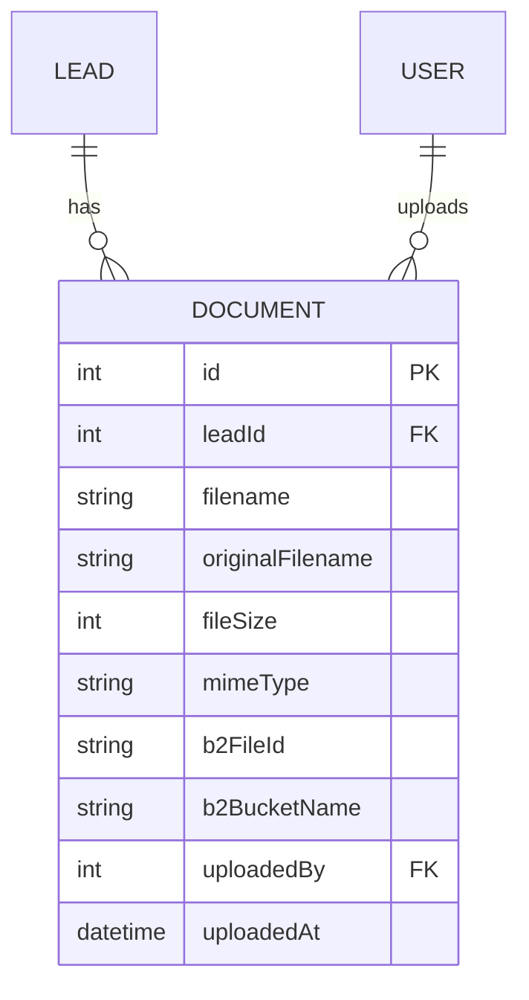
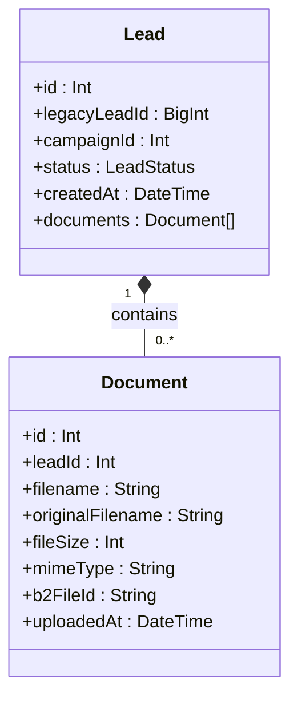
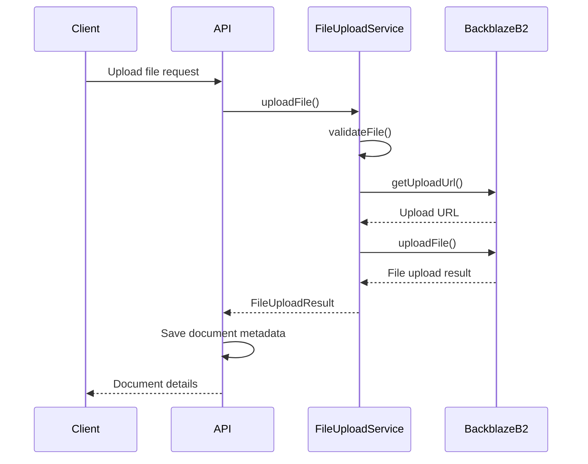

# Document Entity Model

<cite>
**Referenced Files in This Document**   
- [schema.prisma](file://prisma/schema.prisma)
- [FileUploadService.ts](file://src/services/FileUploadService.ts)
- [route.ts](file://src/app/api/leads/[id]/files/route.ts)
- [route.ts](file://src/app/api/leads/[id]/documents/[documentId]/download/route.ts)
- [LeadDetailView.tsx](file://src/components/dashboard/LeadDetailView.tsx)
- [seed.ts](file://prisma/seed.ts)
</cite>

## Table of Contents
1. [Introduction](#introduction)
2. [Document Entity Structure](#document-entity-structure)
3. [Relationship with Leads](#relationship-with-leads)
4. [File Validation and Business Rules](#file-validation-and-business-rules)
5. [Storage Lifecycle and Access Control](#storage-lifecycle-and-access-control)
6. [Integration with FileUploadService and Backblaze B2](#integration-with-fileuploadservice-and-backblaze-b2)
7. [Performance Considerations](#performance-considerations)
8. [Example Document Records](#example-document-records)

## Introduction
This document provides a comprehensive overview of the Document entity within the fund-track application, which manages file uploads associated with leads. The Document entity serves as a critical component for storing metadata about uploaded files while leveraging Backblaze B2 for actual file storage. This documentation details the entity's structure, relationships, business rules, integration points, and performance characteristics to provide a complete understanding of its functionality and implementation.

## Document Entity Structure

The Document entity is defined in the Prisma schema and contains essential fields for tracking file metadata and storage information. The structure ensures comprehensive tracking of document properties while maintaining referential integrity with related entities.



**Diagram sources**
- [schema.prisma](file://prisma/schema.prisma#L148-L170)

**Section sources**
- [schema.prisma](file://prisma/schema.prisma#L148-L170)

### Field Definitions
The Document entity contains the following fields:

- **id**: Primary key, auto-incrementing integer that uniquely identifies each document record
- **leadId**: Foreign key referencing the Lead entity, establishing the relationship between documents and leads
- **filename**: System-generated unique filename used for storage in Backblaze B2
- **originalFilename**: Original filename provided by the user during upload
- **fileSize**: Size of the file in bytes, stored as an integer
- **mimeType**: MIME type of the file (e.g., "application/pdf", "image/jpeg")
- **b2FileId**: File identifier assigned by Backblaze B2 upon upload
- **b2BucketName**: Name of the Backblaze B2 bucket where the file is stored
- **uploadedBy**: Optional foreign key referencing the User who uploaded the file (null for prospect uploads)
- **uploadedAt**: Timestamp of when the file was uploaded, defaults to current time

The entity uses PostgreSQL as the underlying database with appropriate constraints and mappings to ensure data integrity and consistency.

## Relationship with Leads

The Document entity maintains a one-to-many relationship with the Lead entity, where each lead can have multiple associated documents. This relationship is enforced through foreign key constraints and cascading deletes to maintain referential integrity.



**Diagram sources**
- [schema.prisma](file://prisma/schema.prisma#L148-L170)
- [schema.prisma](file://prisma/schema.prisma#L52-L107)

**Section sources**
- [schema.prisma](file://prisma/schema.prisma#L148-L170)

### Foreign Key Constraints
The relationship between Document and Lead is enforced through the following foreign key constraint:

```prisma
model Document {
  // ... other fields
  leadId Int @map("lead_id")
  lead Lead @relation(fields: [leadId], references: [id], onDelete: Cascade)
}
```

This configuration ensures that:
- Every document must be associated with a valid lead
- When a lead is deleted, all associated documents are automatically deleted (CASCADE deletion)
- Database-level referential integrity is maintained
- Attempts to create documents with non-existent lead IDs will fail

The relationship is also reflected in the Lead model, which includes a documents field to enable reverse lookups:

```prisma
model Lead {
  // ... other fields
  documents Document[]
}
```

This bidirectional relationship allows efficient querying in both directions - retrieving all documents for a specific lead and identifying the lead associated with a specific document.

## File Validation and Business Rules

The system implements comprehensive file validation rules to ensure data quality, security, and consistency. These rules are enforced at multiple levels, including the service layer and API endpoints.

### Validation Rules
The following business rules govern file uploads:

- **File Size Limit**: Maximum file size of 10MB (10,485,760 bytes)
- **Allowed MIME Types**: 
  - application/pdf
  - image/jpeg
  - image/png
  - application/vnd.openxmlformats-officedocument.wordprocessingml.document
- **Allowed Extensions**: .pdf, .jpg, .jpeg, .png, .docx
- **Required Documents**: Exactly 3 documents required for prospect intake
- **Empty Files**: Empty files (0 bytes) are rejected
- **File Count**: Prospects must upload exactly 3 documents during intake

### Validation Implementation
Validation is implemented in the FileUploadService with configurable options:

```typescript
private readonly DEFAULT_VALIDATION: FileValidationOptions = {
  maxSizeBytes: 10 * 1024 * 1024, // 10MB
  allowedMimeTypes: [
    "application/pdf",
    "image/jpeg",
    "image/png",
    "application/vnd.openxmlformats-officedocument.wordprocessingml.document",
  ],
  allowedExtensions: [".pdf", ".jpg", ".jpeg", ".png", ".docx"],
};
```

The validation process checks:
1. File size against the maximum limit
2. MIME type against the allowed list
3. File extension against the allowed list
4. File content (rejects empty files)

**Section sources**
- [FileUploadService.ts](file://src/services/FileUploadService.ts#L44-L65)
- [route.ts](file://src/app/api/leads/[id]/files/route.ts#L48-L71)

## Storage Lifecycle and Access Control

The document storage lifecycle is carefully managed from upload to deletion, with appropriate access controls at each stage.

### Upload Process
The document upload process follows these steps:
1. Client submits file via API endpoint
2. Server validates authentication and permissions
3. File validation is performed (size, type, extension)
4. File is uploaded to Backblaze B2
5. Document metadata is saved to the database
6. Audit log entry is created

### Access Control
Access to documents is controlled through the following mechanisms:

- **Authentication**: All document operations require valid user authentication via NextAuth
- **Authorization**: Users must have appropriate roles (ADMIN or USER) to upload or delete documents
- **Ownership**: Users can only access documents associated with leads they have permission to view
- **Prospect Access**: Prospects can upload documents during intake using time-limited tokens

### Deletion Process
Document deletion follows a two-step process:
1. File is deleted from Backblaze B2 storage
2. Document metadata is removed from the database
3. Audit log entry is created

The system implements graceful error handling during deletion - if the B2 file deletion fails, the database record is still removed to maintain consistency.

**Section sources**
- [route.ts](file://src/app/api/leads/[id]/files/route.ts)
- [route.ts](file://src/app/api/leads/[id]/documents/[documentId]/download/route.ts)
- [FileUploadService.ts](file://src/services/FileUploadService.ts)

## Integration with FileUploadService and Backblaze B2

The Document entity integrates with the FileUploadService to manage file storage operations with Backblaze B2, providing a seamless interface between the application and cloud storage.

### FileUploadService Architecture
The FileUploadService acts as an adapter between the application and Backblaze B2 API, handling all storage operations:



**Diagram sources**
- [FileUploadService.ts](file://src/services/FileUploadService.ts#L90-L158)
- [route.ts](file://src/app/api/leads/[id]/files/route.ts#L85-L125)

### Key Integration Points
The integration includes the following key components:

- **Initialization**: The service initializes the Backblaze B2 connection using environment variables
- **Upload**: Files are uploaded with metadata including lead ID and original filename
- **Download**: Secure download URLs are generated with time-limited authorization
- **Deletion**: Files are removed from B2 storage when documents are deleted
- **Error Handling**: Comprehensive logging and error handling for all operations

### Configuration
The service uses environment variables for configuration:
- B2_APPLICATION_KEY_ID: Backblaze application key ID
- B2_APPLICATION_KEY: Backblaze application key
- B2_BUCKET_NAME: Name of the storage bucket
- B2_BUCKET_ID: ID of the storage bucket

**Section sources**
- [FileUploadService.ts](file://src/services/FileUploadService.ts)
- [route.ts](file://src/app/api/leads/[id]/files/route.ts)

## Performance Considerations

The Document entity implementation includes several performance optimizations to handle file operations efficiently, particularly for large files and high-volume scenarios.

### Indexing Strategy
The database schema includes appropriate indexing to optimize query performance:

- **leadId Index**: Ensures fast retrieval of all documents for a specific lead
- **uploadDate Index**: Facilitates chronological sorting and date-based queries
- **Composite Index**: Potential for composite indexes on (leadId, uploadedAt) for common query patterns

While explicit index declarations are not visible in the Prisma schema, the foreign key relationship on leadId implicitly creates an index for efficient lookups.

### Large File Handling
The system handles large files through the following mechanisms:

- **Streaming**: Files are processed as streams rather than loading entire files into memory
- **Chunked Uploads**: Backblaze B2 supports large file uploads through chunked transfers
- **Memory Efficiency**: The service processes files in chunks to minimize memory usage
- **Timeout Management**: Appropriate timeouts are configured for upload and download operations

### API Performance
The API endpoints are optimized for performance:

- **Efficient Queries**: Database queries include only necessary fields
- **Connection Pooling**: Prisma client uses connection pooling for database operations
- **Caching**: Potential for caching frequently accessed document metadata
- **Asynchronous Operations**: File uploads and downloads are handled asynchronously

**Section sources**
- [schema.prisma](file://prisma/schema.prisma#L148-L170)
- [FileUploadService.ts](file://src/services/FileUploadService.ts)
- [route.ts](file://src/app/api/leads/[id]/files/route.ts)

## Example Document Records

The following examples illustrate typical document records as they appear in the system, based on seed data and real-world usage patterns.

### Sample Document Records
```json
[
  {
    "id": 1,
    "leadId": 2,
    "filename": "leads/2/1719456789-ab12c3-de45f6-January_2024_Bank_Statement.pdf",
    "originalFilename": "January 2024 Bank Statement.pdf",
    "fileSize": 1024000,
    "mimeType": "application/pdf",
    "b2FileId": "mock_b2_file_id_001",
    "b2BucketName": "merchant-funding-documents",
    "uploadedBy": null,
    "uploadedAt": "2025-06-27T10:30:00.000Z"
  },
  {
    "id": 2,
    "leadId": 2,
    "filename": "leads/2/1719456795-xy78z9-ab12c3-February_2024_Bank_Statement.pdf",
    "originalFilename": "February 2024 Bank Statement.pdf",
    "fileSize": 1100000,
    "mimeType": "application/pdf",
    "b2FileId": "mock_b2_file_id_002",
    "b2BucketName": "merchant-funding-documents",
    "uploadedBy": null,
    "uploadedAt": "2025-06-27T10:31:00.000Z"
  },
  {
    "id": 3,
    "leadId": 3,
    "filename": "leads/3/1719456801-de45f6-xy78z9-Additional_Documentation.pdf",
    "originalFilename": "Additional Documentation.pdf",
    "fileSize": 512000,
    "mimeType": "application/pdf",
    "b2FileId": "mock_b2_file_id_004",
    "b2BucketName": "merchant-funding-documents",
    "uploadedBy": 1,
    "uploadedAt": "2025-06-27T10:32:00.000Z"
  }
]
```

### Metadata Analysis
Key observations from the example records:

- **Filename Structure**: System-generated filenames follow the pattern `leads/{leadId}/{timestamp}-{hash}-{originalName}` to ensure uniqueness
- **Prospect vs Staff Uploads**: Prospect uploads have null uploadedBy values, while staff uploads reference the user ID
- **File Size Range**: Document sizes range from 512KB to 2MB, well within the 10MB limit
- **File Type Diversity**: The system handles various document types including PDFs and images
- **Chronological Order**: Documents are ordered by upload date, with newer documents appearing first

These examples demonstrate the practical implementation of the Document entity in real-world scenarios, showing how the system handles different upload sources, file types, and metadata tracking.

**Section sources**
- [seed.ts](file://prisma/seed.ts#L300-L350)
- [schema.prisma](file://prisma/schema.prisma#L148-L170)