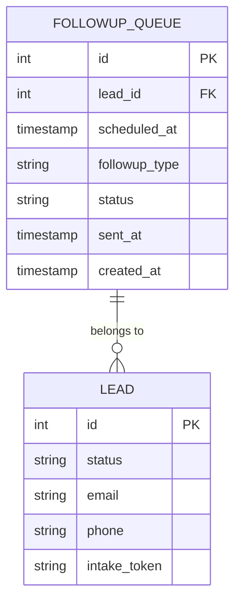
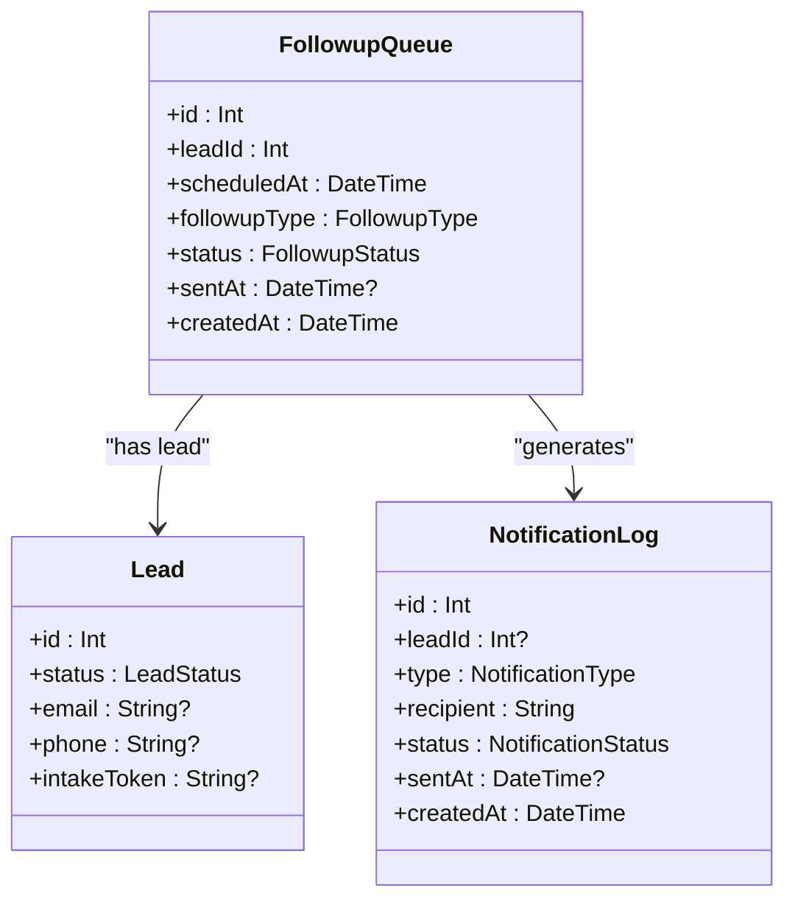
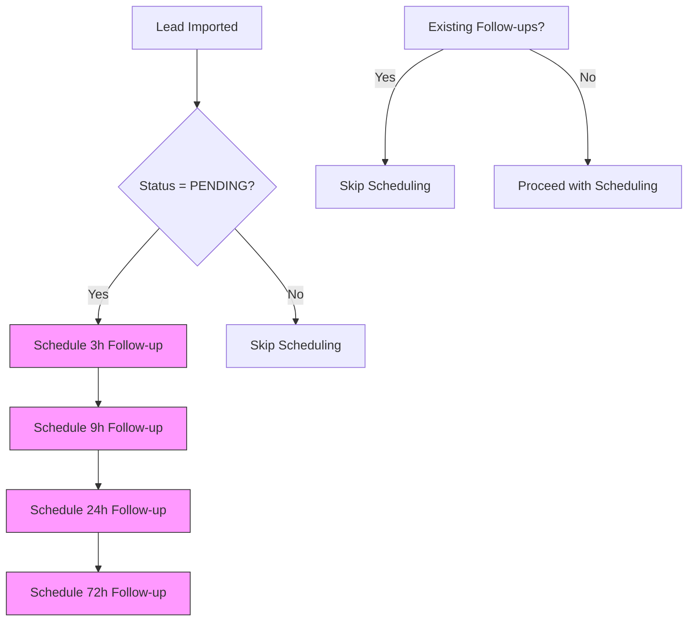
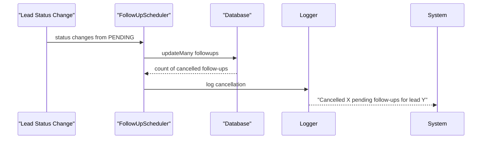
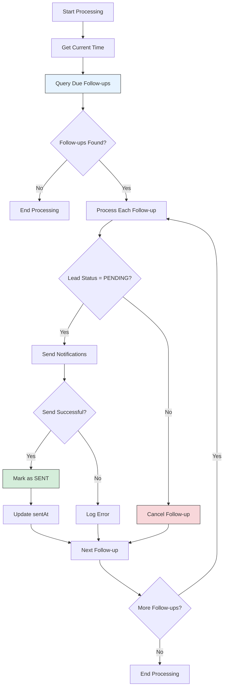

# FollowupQueue Entity Model

<cite>
**Referenced Files in This Document**   
- [schema.prisma](file://prisma/schema.prisma)
- [FollowUpScheduler.ts](file://src/services/FollowUpScheduler.ts)
- [NotificationService.ts](file://src/services/NotificationService.ts)
- [send-followups/route.ts](file://src/app/api/cron/send-followups/route.ts)
- [SystemSettingsService.ts](file://src/services/SystemSettingsService.ts)
- [add_notification_log_indexes/migration.sql](file://prisma/migrations/20250812120000_add_notification_log_indexes/migration.sql)
</cite>

## Table of Contents
1. [Introduction](#introduction)
2. [FollowupQueue Data Model](#followupqueue-data-model)
3. [Core Fields and Relationships](#core-fields-and-relationships)
4. [Business Logic and Scheduling](#business-logic-and-scheduling)
5. [Cron Job Processing](#cron-job-processing)
6. [Performance Considerations](#performance-considerations)
7. [Example Queue Entries](#example-queue-entries)
8. [Conclusion](#conclusion)

## Introduction
The FollowupQueue entity is a critical component of the merchant funding application system, responsible for managing scheduled follow-up communications with leads. This document provides a comprehensive analysis of the FollowupQueue model, its relationships, business logic, and processing mechanisms. The system implements a time-based follow-up strategy to increase application completion rates through automated reminders sent via email and SMS.

**Section sources**
- [schema.prisma](file://prisma/schema.prisma)

## FollowupQueue Data Model
The FollowupQueue entity is defined in the Prisma schema with specific fields that track scheduled follow-up communications. The model is designed to support a multi-tiered follow-up strategy with different time intervals.



**Diagram sources**
- [schema.prisma](file://prisma/schema.prisma#L130-L140)

**Section sources**
- [schema.prisma](file://prisma/schema.prisma#L130-L140)

## Core Fields and Relationships
The FollowupQueue entity contains several key fields that define its behavior and state:

**Field Definitions:**
- **id**: Primary key identifier for the follow-up record
- **leadId**: Foreign key reference to the Lead entity, establishing the relationship between follow-ups and leads
- **scheduledAt**: Timestamp indicating when the follow-up should be processed and sent
- **followupType**: Enum value specifying the follow-up interval (3h, 9h, 24h, 72h)
- **status**: Current state of the follow-up (PENDING, SENT, CANCELLED)
- **sentAt**: Timestamp when the follow-up was successfully sent (nullable)
- **createdAt**: Timestamp when the follow-up record was created

**Relationships:**
- **One-to-Many with Lead**: Each lead can have multiple follow-ups in the queue
- **Cascade Deletion**: When a lead is deleted, all associated follow-ups are automatically removed

The FollowupQueue is directly related to the Leads entity through the leadId field, enabling the system to associate follow-up communications with specific leads. It also interacts with the NotificationLog entity indirectly through the notification service, as successful follow-ups generate notification log entries.



**Diagram sources**
- [schema.prisma](file://prisma/schema.prisma#L130-L140)
- [schema.prisma](file://prisma/schema.prisma#L90-L110)
- [schema.prisma](file://prisma/schema.prisma#L142-L155)

**Section sources**
- [schema.prisma](file://prisma/schema.prisma#L130-L140)

## Business Logic and Scheduling
The follow-up scheduling system implements a strategic communication approach with four distinct time intervals designed to maximize application completion rates.

### Scheduling Intervals
The system uses the following follow-up intervals:
- **THREE_HOUR**: 3 hours after lead import
- **NINE_HOUR**: 9 hours after lead import
- **TWENTY_FOUR_H**: 24 hours after lead import
- **SEVENTY_TWO_H**: 72 hours after lead import

These intervals are defined in the FollowUpScheduler service with corresponding millisecond values for precise timing.



**Diagram sources**
- [FollowUpScheduler.ts](file://src/services/FollowUpScheduler.ts#L15-L22)

**Section sources**
- [FollowUpScheduler.ts](file://src/services/FollowUpScheduler.ts#L15-L22)

### Scheduling Process
When a lead is imported into the system, the `scheduleFollowUpsForLead` method is called to create follow-up entries in the queue. The process includes several validation steps:

1. Verify the lead exists and is in PENDING status
2. Check if follow-ups are already scheduled for this lead
3. Create four follow-up records with appropriate scheduled times
4. Log the scheduling activity

The scheduling logic prevents duplicate follow-ups by checking for existing PENDING entries before creating new ones.

### Cancellation Policy
When a lead's status changes from PENDING to another status (e.g., COMPLETED, REJECTED), all pending follow-ups for that lead are automatically cancelled. This prevents unnecessary communications to leads who have already completed their applications or been disqualified.



**Diagram sources**
- [FollowUpScheduler.ts](file://src/services/FollowUpScheduler.ts#L142-L163)

**Section sources**
- [FollowUpScheduler.ts](file://src/services/FollowUpScheduler.ts#L142-L163)

## Cron Job Processing
The follow-up queue is processed by a cron job that runs at regular intervals to send due notifications.

### Processing Workflow
The `send-followups` cron job follows this processing workflow:



**Diagram sources**
- [send-followups/route.ts](file://src/app/api/cron/send-followups/route.ts#L15-L70)
- [FollowUpScheduler.ts](file://src/services/FollowUpScheduler.ts#L165-L240)

**Section sources**
- [send-followups/route.ts](file://src/app/api/cron/send-followups/route.ts#L15-L70)
- [FollowUpScheduler.ts](file://src/services/FollowUpScheduler.ts#L165-L240)

### Notification Service Integration
When processing a follow-up, the system integrates with the NotificationService to send communications via email and SMS. The service implements retry logic with exponential backoff to handle temporary delivery failures.

The notification content is customized based on the follow-up type, with different messaging strategies for each interval:
- **3h**: Quick reminder with urgency
- **9h**: Mid-interval follow-up
- **24h**: Final reminder
- **72h**: Last chance notification

### Retry Policies
The NotificationService implements a configurable retry policy:
- Maximum of 3 retry attempts by default
- Exponential backoff with base delay of 1 second
- Maximum delay of 30 seconds between retries

These settings can be adjusted through system settings, allowing administrators to fine-tune the retry behavior based on delivery requirements and service limitations.

**Section sources**
- [NotificationService.ts](file://src/services/NotificationService.ts#L150-L180)
- [SystemSettingsService.ts](file://src/services/SystemSettingsService.ts#L320-L350)

## Performance Considerations
The FollowupQueue implementation includes several performance optimizations to ensure efficient processing of large volumes of follow-up communications.

### Indexing Strategy
Although no explicit index creation for FollowupQueue fields was found in the migration files, best practices suggest that indexes on the following fields would significantly improve query performance:

- **scheduledAt**: Critical for efficiently finding due follow-ups
- **status**: Essential for filtering PENDING follow-ups
- **Composite index on (status, scheduledAt)**: Optimal for the primary query pattern used in queue processing

The system's notification log includes a similar indexing pattern, as evidenced by the migration that created an index on notification_log(created_at DESC, id DESC) for efficient pagination.

```sql
-- Recommended index for FollowupQueue performance
CREATE INDEX idx_followup_queue_status_scheduled ON followup_queue(status, scheduled_at);
```

**Diagram sources**
- [add_notification_log_indexes/migration.sql](file://prisma/migrations/20250812120000_add_notification_log_indexes/migration.sql#L2-L3)

**Section sources**
- [add_notification_log_indexes/migration.sql](file://prisma/migrations/20250812120000_add_notification_log_indexes/migration.sql#L2-L3)

### Query Optimization
The primary query for processing follow-ups is optimized with:
- Filtering by status (PENDING) to exclude completed/cancelled follow-ups
- Time-based filtering (scheduledAt ≤ now) to find due follow-ups
- Ordering by scheduledAt (ascending) to process oldest follow-ups first
- Including related lead data in a single query to avoid N+1 problems

### Maintenance Operations
The FollowUpScheduler includes a cleanup method to remove old completed and cancelled follow-up records, preventing unbounded growth of the followup_queue table. By default, records older than 30 days are removed, which helps maintain database performance and manage storage costs.

**Section sources**
- [FollowUpScheduler.ts](file://src/services/FollowUpScheduler.ts#L380-L395)

## Example Queue Entries
The following examples illustrate typical FollowupQueue entries at different stages of processing:

### Scheduled Follow-up (PENDING)
```json
{
  "id": 1001,
  "leadId": 5001,
  "scheduledAt": "2025-08-26T15:30:00.000Z",
  "followupType": "3h",
  "status": "PENDING",
  "createdAt": "2025-08-26T12:30:00.000Z"
}
```

### Processed Follow-up (SENT)
```json
{
  "id": 1001,
  "leadId": 5001,
  "scheduledAt": "2025-08-26T15:30:00.000Z",
  "followupType": "3h",
  "status": "SENT",
  "sentAt": "2025-08-26T15:30:05.234Z",
  "createdAt": "2025-08-26T12:30:00.000Z"
}
```

### Cancelled Follow-up
```json
{
  "id": 1002,
  "leadId": 5001,
  "scheduledAt": "2025-08-26T21:30:00.000Z",
  "followupType": "9h",
  "status": "CANCELLED",
  "createdAt": "2025-08-26T12:30:00.000Z"
}
```

### Multiple Follow-ups for Single Lead
```json
[
  {
    "id": 1001,
    "leadId": 5001,
    "followupType": "3h",
    "status": "SENT",
    "scheduledAt": "2025-08-26T15:30:00.000Z"
  },
  {
    "id": 1002,
    "leadId": 5001,
    "followupType": "9h",
    "status": "PENDING",
    "scheduledAt": "2025-08-26T21:30:00.000Z"
  },
  {
    "id": 1003,
    "leadId": 5001,
    "followupType": "24h",
    "status": "PENDING",
    "scheduledAt": "2025-08-27T12:30:00.000Z"
  },
  {
    "id": 1004,
    "leadId": 5001,
    "followupType": "72h",
    "status": "PENDING",
    "scheduledAt": "2025-08-29T12:30:00.000Z"
  }
]
```

**Section sources**
- [FollowUpScheduler.ts](file://src/services/FollowUpScheduler.ts#L50-L70)
- [schema.prisma](file://prisma/schema.prisma#L130-L140)

## Conclusion
The FollowupQueue entity is a well-designed component that effectively manages scheduled communications with leads in the merchant funding application system. Its implementation demonstrates several best practices in software design, including clear separation of concerns, robust error handling, and performance-conscious architecture.

Key strengths of the implementation include:
- Strategic follow-up timing with escalating urgency
- Automatic cancellation when lead status changes
- Comprehensive logging and monitoring
- Configurable retry policies
- Efficient processing through batch operations

For optimal performance, implementing database indexes on the scheduledAt and status fields is strongly recommended. Additionally, the existing cleanup mechanism helps maintain system performance by removing historical data that is no longer needed for operational purposes.

The integration between the FollowupQueue, NotificationService, and cron job processing creates a reliable automated communication system that enhances user engagement and increases application completion rates.

**Section sources**
- [schema.prisma](file://prisma/schema.prisma)
- [FollowUpScheduler.ts](file://src/services/FollowUpScheduler.ts)
- [NotificationService.ts](file://src/services/NotificationService.ts)
- [send-followups/route.ts](file://src/app/api/cron/send-followups/route.ts)