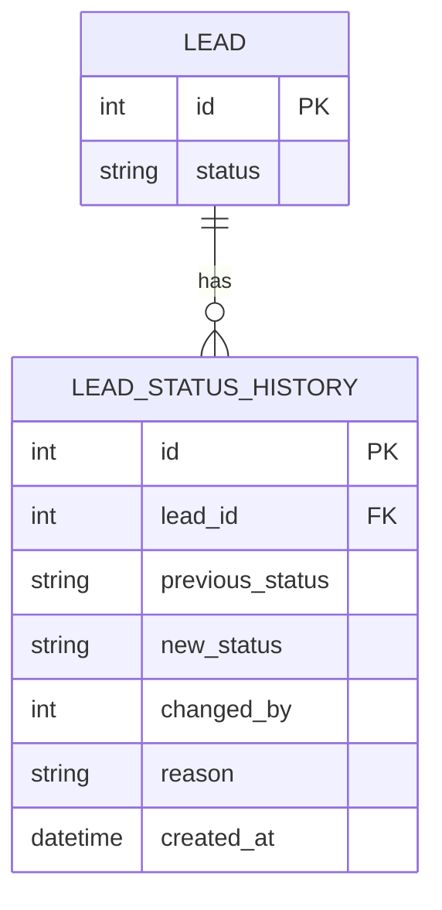
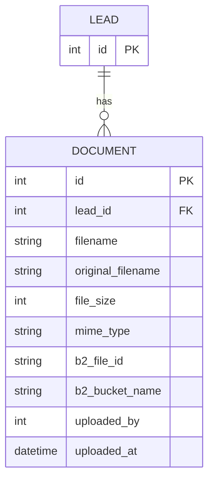
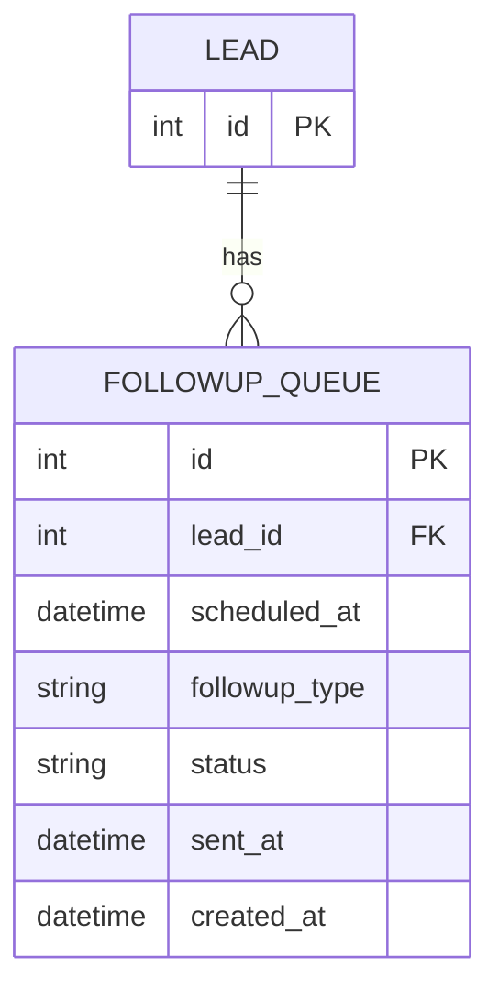
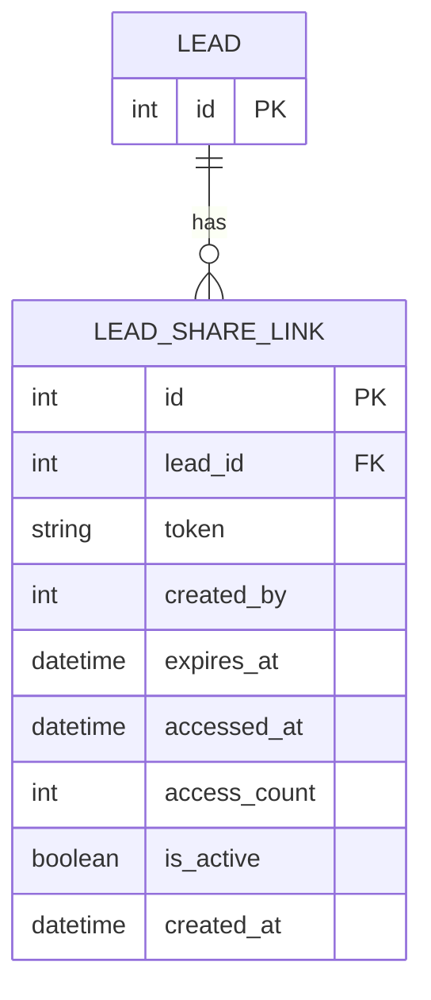
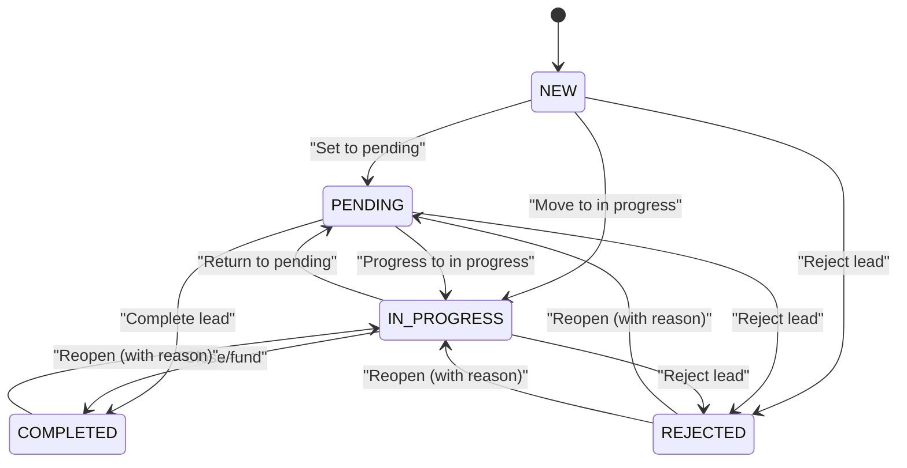
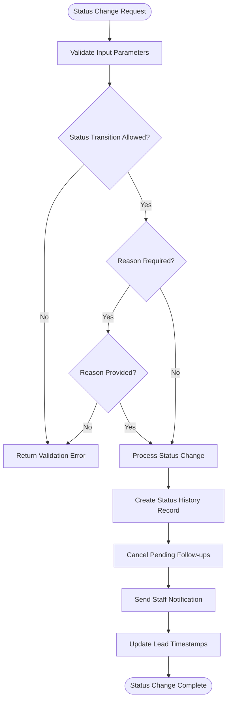
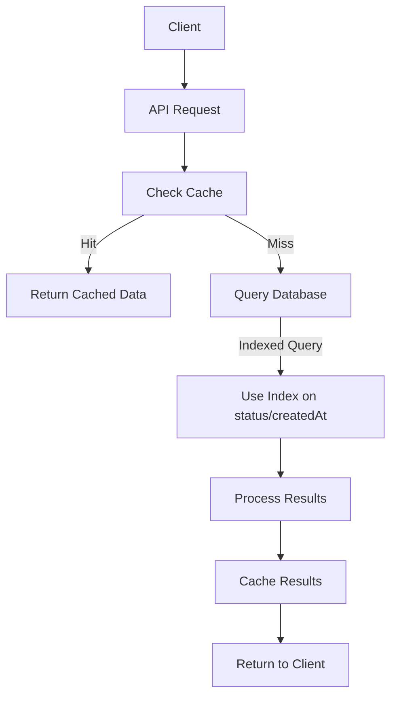

# Lead Entity Model

<cite>
**Referenced Files in This Document**   
- [schema.prisma](file://prisma/schema.prisma) - *Updated with LeadShareLink relationship and step3CompletedAt field*
- [LeadStatusService.ts](file://src/services/LeadStatusService.ts)
- [migration.sql](file://prisma/migrations/20250812120000_add_notification_log_indexes/migration.sql)
- [reset-intake/route.ts](file://src/app/api/dev/reset-intake/route.ts) - *Added step3CompletedAt tracking*
- [add_lead_share_links/migration.sql](file://prisma/migrations/20250917154515_add_lead_share_links/migration.sql) - *New migration for share links*
</cite>

## Update Summary
**Changes Made**   
- Added documentation for the new `step3CompletedAt` field in the Lead entity
- Added comprehensive documentation for the new `LeadShareLink` relationship
- Updated field definitions to include the new step3CompletedAt timestamp
- Updated system fields section to reflect the new intake step tracking
- Updated example lead records to show step3CompletedAt values
- Updated schema and workflow support section to include three-step intake process
- Added new diagram for LeadShareLink relationship
- Updated section sources to include new files and modifications

## Table of Contents
1. [Lead Entity Overview](#lead-entity-overview)
2. [Field Definitions](#field-definitions)
3. [Relationships](#relationships)
4. [Status Transition Logic](#status-transition-logic)
5. [Data Validation and Business Rules](#data-validation-and-business-rules)
6. [Performance Considerations](#performance-considerations)
7. [Example Lead Records](#example-lead-records)
8. [Schema and Workflow Support](#schema-and-workflow-support)

## Lead Entity Overview

The Lead entity serves as the central data model in the fund-track application, capturing comprehensive information about potential customers throughout their lifecycle. The model is designed to support the complete lead management workflow from initial intake through qualification, processing, and final disposition. The schema is implemented using Prisma ORM with a PostgreSQL backend, following a well-structured approach that separates personal information, business details, financial data, and system metadata.

The Lead entity has evolved through multiple migrations to accommodate changing business requirements, with recent additions including comprehensive business fields, mobile contact information, status tracking capabilities, and enhanced intake workflow support. The model is optimized for the intake workflow, allowing for progressive data collection while maintaining data integrity through appropriate constraints and default values.

**Section sources**
- [schema.prisma](file://prisma/schema.prisma#L30-L157)

## Field Definitions

### Personal Information Fields
The Lead entity captures essential personal information for individual applicants:

- **firstName**: String? @map("first_name") - First name of the lead
- **lastName**: String? @map("last_name") - Last name of the lead
- **email**: String? - Primary email address for communication
- **phone**: String? - Primary phone number for contact
- **dateOfBirth**: String? @map("date_of_birth") - Date of birth in string format
- **socialSecurity**: String? @map("social_security") - Social security number (stored securely)
- **legalName**: String? @map("legal_name") - Full legal name of the applicant
- **personalAddress**: String? @map("personal_address") - Residential street address
- **personalCity**: String? @map("personal_city") - City of residence
- **personalState**: String? @map("personal_state") - State of residence
- **personalZip**: String? @map("personal_zip") - ZIP code of residence

### Business Information Fields
For business applicants, the model captures detailed organizational information:

- **businessName**: String? @map("business_name") - Official business name
- **dba**: String? - "Doing Business As" name (if different from legal name)
- **businessAddress**: String? @map("business_address") - Business street address
- **businessPhone**: String? @map("business_phone") - Business phone number
- **businessEmail**: String? @map("business_email") - Business email address
- **mobile**: String? @map("mobile") - Mobile phone number for the business owner
- **businessCity**: String? @map("business_city") - City where business operates
- **businessState**: String? @map("business_state") - State where business operates
- **businessZip**: String? @map("business_zip") - ZIP code of business location
- **industry**: String? - Industry classification of the business
- **yearsInBusiness**: Int? @map("years_in_business") - Number of years in operation
- **ownershipPercentage**: String? @map("ownership_percentage") - Owner's equity percentage
- **taxId**: String? @map("tax_id") - Employer Identification Number (EIN)
- **stateOfInc**: String? @map("state_of_inc") - State of incorporation
- **dateBusinessStarted**: String? @map("date_business_started") - Business start date
- **legalEntity**: String? @map("legal_entity") - Legal structure (LLC, Corp, etc.)
- **natureOfBusiness**: String? @map("nature_of_business") - Description of business activities
- **hasExistingLoans**: String? @map("has_existing_loans") - Indicator of existing debt

### Financial Data Fields
Financial information is stored as strings to provide flexibility in data entry and formatting:

- **amountNeeded**: String? @map("amount_needed") - Funding amount requested
- **monthlyRevenue**: String? @map("monthly_revenue") - Monthly business revenue

Storing financial data as strings (rather than numeric types) allows for various formatting options (e.g., "$50,000", "50000.00") and accommodates special cases like ranges or estimates. This flexibility supports the intake workflow where applicants may provide approximate or formatted values.

### System Fields
Metadata fields that track the lead's lifecycle and system interactions:

- **id**: Int @id @default(autoincrement()) - Primary key identifier
- **legacyLeadId**: BigInt @unique @map("legacy_lead_id") - Reference to legacy system ID
- **campaignId**: Int @map("campaign_id") - Marketing campaign identifier
- **status**: LeadStatus @default(NEW) - Current status in the lead lifecycle
- **intakeToken**: String? @unique @map("intake_token") - Secure token for intake process
- **intakeCompletedAt**: DateTime? @map("intake_completed_at") - Timestamp when intake was completed
- **step1CompletedAt**: DateTime? @map("step1_completed_at") - Timestamp for first intake step completion
- **step2CompletedAt**: DateTime? @map("step2_completed_at") - Timestamp for second intake step completion
- **step3CompletedAt**: DateTime? @map("step3_completed_at") - Timestamp for third intake step completion
- **createdAt**: DateTime @default(now()) @map("created_at") - Record creation timestamp
- **updatedAt**: DateTime @updatedAt @map("updated_at") - Last modification timestamp
- **importedAt**: DateTime @default(now()) @map("imported_at") - Timestamp when lead was imported

Default values are applied to ensure data consistency: status defaults to NEW, and timestamps are automatically populated.

**Section sources**
- [schema.prisma](file://prisma/schema.prisma#L30-L157)
- [reset-intake/route.ts](file://src/app/api/dev/reset-intake/route.ts#L64-L115)

## Relationships

The Lead entity maintains several important relationships that extend its functionality and support the application's business logic:

### StatusHistory Relationship


**Diagram sources**
- [schema.prisma](file://prisma/schema.prisma#L159-L179)

The StatusHistory relationship (LeadStatusHistory model) provides a complete audit trail of all status changes for a lead. Each time a lead's status is updated, a new record is created in the status history table, capturing:
- The previous status
- The new status
- The user who made the change (changedBy)
- An optional reason for the change
- The timestamp of the change

This relationship enables full traceability of the lead's journey through the system and supports compliance requirements by maintaining a complete change history.

### Documents Relationship


**Diagram sources**
- [schema.prisma](file://prisma/schema.prisma#L100-L118)

The Documents relationship allows multiple documents to be associated with a single lead. Each document record includes metadata such as:
- Original filename and system filename
- File size and MIME type
- Backblaze B2 storage identifiers (file ID and bucket name)
- User who uploaded the document
- Upload timestamp

This relationship supports the document collection process during lead qualification and enables document management throughout the lead lifecycle.

### FollowupQueue Relationship


**Diagram sources**
- [schema.prisma](file://prisma/schema.prisma#L120-L134)

The FollowupQueue relationship manages automated follow-up communications for leads. Follow-up items are created based on the lead's status and progress, with different follow-up types (3h, 9h, 24h, 72h) representing different time intervals after specific events. The follow-up system ensures timely engagement with leads while allowing for cancellation when leads progress to subsequent stages.

### LeadShareLink Relationship


**Diagram sources**
- [add_lead_share_links/migration.sql](file://prisma/migrations/20250917154515_add_lead_share_links/migration.sql#L1-L23)
- [schema.prisma](file://prisma/schema.prisma#L200-L215)

The LeadShareLink relationship enables secure sharing of lead information with external parties. Each share link record includes:
- Unique token for secure access
- Expiration timestamp to limit access duration
- Access tracking (count and timestamp of last access)
- Active status flag to enable/disable the link
- Reference to the creating user
- Creation timestamp

This relationship supports the secure sharing workflow, allowing leads to be shared with partners, clients, or other stakeholders while maintaining control over access duration and usage.

**Section sources**
- [schema.prisma](file://prisma/schema.prisma#L30-L179)
- [add_lead_share_links/migration.sql](file://prisma/migrations/20250917154515_add_lead_share_links/migration.sql#L1-L23)

## Status Transition Logic

The Lead entity implements a robust state machine pattern through the LeadStatusService, which enforces business rules for status transitions. The valid status values are defined in the LeadStatus enum:

- NEW: New lead, not yet contacted
- PENDING: Awaiting prospect response or action
- IN_PROGRESS: Actively working with prospect
- COMPLETED: Successfully closed/funded
- REJECTED: Lead declined or not qualified



**Diagram sources**
- [LeadStatusService.ts](file://src/services/LeadStatusService.ts#L28-L58)

The status transition rules are strictly enforced by the LeadStatusService, which validates all status changes before they are applied. The service implements the following business rules:

1. **NEW leads** can transition to PENDING, IN_PROGRESS, or REJECTED
2. **PENDING leads** can move to IN_PROGRESS, COMPLETED, or REJECTED
3. **IN_PROGRESS leads** can be COMPLETED, REJECTED, or returned to PENDING
4. **COMPLETED leads** can only be reopened to IN_PROGRESS, and a reason is required
5. **REJECTED leads** can be reopened to PENDING or IN_PROGRESS, and a reason is required

When a status change occurs, the system automatically:
- Creates a status history record
- Cancels any pending follow-ups if the lead is no longer in PENDING status
- Sends staff notifications for significant status changes
- Updates the lead's timestamps accordingly

The status change process is implemented as a database transaction to ensure data consistency, with appropriate error handling and logging.

**Section sources**
- [LeadStatusService.ts](file://src/services/LeadStatusService.ts#L28-L178)

## Data Validation and Business Rules

The Lead entity and associated services enforce several important business rules and validation requirements:

### Status Transition Validation
The LeadStatusService.validateStatusTransition method ensures that all status changes comply with the defined business rules. The validation process checks:
- Whether the transition is allowed based on the current and new status
- Whether a reason is required for the transition (required when reopening COMPLETED or REJECTED leads)
- That a reason is provided when required



**Diagram sources**
- [LeadStatusService.ts](file://src/services/LeadStatusService.ts#L60-L110)

### Data Integrity Rules
The schema enforces data integrity through several mechanisms:
- Unique constraints on legacyLeadId and intakeToken
- Required fields for critical identifiers (id, campaignId)
- Automatic timestamp management (createdAt, updatedAt)
- Foreign key relationships with cascade delete for related records

### Business Workflow Rules
The system implements business rules that affect lead processing:
- When intake is completed (all steps finished), the lead status automatically advances
- Follow-up communications are automatically canceled when a lead progresses beyond the PENDING status
- Significant status changes trigger staff notifications to ensure proper follow-up
- The system prevents invalid state transitions that would violate business processes

**Section sources**
- [LeadStatusService.ts](file://src/services/LeadStatusService.ts#L60-L178)

## Performance Considerations

The Lead entity design incorporates several performance optimizations to ensure efficient operation at scale:

### Indexing Strategy
While the Prisma schema does not explicitly define indexes, the application's migration history reveals important indexing patterns. The migration file `20250812120000_add_notification_log_indexes/migration.sql` demonstrates the indexing approach used in the application:

```sql
-- Add index to speed ORDER BY created_at DESC, id DESC for cursor pagination
CREATE INDEX idx_notification_log_created_at_id ON notification_log(created_at DESC, id DESC);
```

Based on this pattern and the application's access patterns, the following indexes are recommended:

- **Status Index**: An index on the status field to optimize queries that filter leads by status (e.g., "show all PENDING leads")
- **External ID Index**: An index on the externalId field in the notification_log table to enable efficient lookups of notifications by external identifiers from third-party services
- **Composite Index**: A composite index on (status, createdAt) to optimize queries that retrieve leads by status and creation date

### Query Optimization
The LeadStatusService implements several performance optimizations:
- Status history queries are limited to the most recent 10 records by default
- The service uses Prisma's include feature to fetch related data in a single query, reducing database round trips
- The getAvailableTransitions method caches transition rules in memory for fast access

### Data Retrieval Patterns
The application uses efficient data retrieval patterns:
- The dashboard components fetch only the fields needed for display
- Pagination is implemented to limit result sets
- Search functionality uses case-insensitive contains queries with appropriate filtering



**Diagram sources**
- [migration.sql](file://prisma/migrations/20250812120000_add_notification_log_indexes/migration.sql#L1-L3)

**Section sources**
- [migration.sql](file://prisma/migrations/20250812120000_add_notification_log_indexes/migration.sql#L1-L3)
- [LeadStatusService.ts](file://src/services/LeadStatusService.ts#L345-L393)

## Example Lead Records

### New Lead (Initial Intake)
```json
{
  "id": 1001,
  "legacyLeadId": "123456789",
  "campaignId": 11302,
  "firstName": "John",
  "lastName": "Doe",
  "email": "john.doe@example.com",
  "phone": "+15551234567",
  "businessName": "Doe Enterprises",
  "industry": "Retail",
  "amountNeeded": "$50,000",
  "monthlyRevenue": "$20,000",
  "status": "NEW",
  "intakeToken": "abc123xyz",
  "createdAt": "2025-08-26T10:30:00Z",
  "updatedAt": "2025-08-26T10:30:00Z",
  "importedAt": "2025-08-26T10:30:00Z"
}
```

### In-Progress Lead (Three-Step Intake Completed)
```json
{
  "id": 1002,
  "legacyLeadId": "987654321",
  "campaignId": 11302,
  "firstName": "Jane",
  "lastName": "Smith",
  "email": "jane.smith@acme.com",
  "phone": "+15559876543",
  "businessName": "Acme Corp",
  "dba": "Acme Solutions",
  "businessAddress": "123 Main St",
  "businessCity": "New York",
  "businessState": "NY",
  "businessZip": "10001",
  "industry": "Technology",
  "yearsInBusiness": 5,
  "amountNeeded": "75000",
  "monthlyRevenue": "45000",
  "status": "IN_PROGRESS",
  "intakeCompletedAt": "2025-08-25T14:20:00Z",
  "step1CompletedAt": "2025-08-25T12:15:00Z",
  "step2CompletedAt": "2025-08-25T13:30:00Z",
  "step3CompletedAt": "2025-08-25T14:20:00Z",
  "createdAt": "2025-08-25T11:30:00Z",
  "updatedAt": "2025-08-26T09:15:00Z",
  "importedAt": "2025-08-25T11:30:00Z"
}
```

### Completed Lead (Funded)
```json
{
  "id": 1003,
  "legacyLeadId": "456789123",
  "campaignId": 11302,
  "firstName": "Robert",
  "lastName": "Johnson",
  "email": "robert.johnson@builders.com",
  "phone": "+15554567890",
  "businessName": "Johnson Construction",
  "industry": "Construction",
  "amountNeeded": "150000",
  "monthlyRevenue": "80000",
  "status": "COMPLETED",
  "intakeCompletedAt": "2025-08-20T16:45:00Z",
  "step1CompletedAt": "2025-08-20T13:20:00Z",
  "step2CompletedAt": "2025-08-20T15:10:00Z",
  "step3CompletedAt": "2025-08-20T16:45:00Z",
  "createdAt": "2025-08-20T12:10:00Z",
  "updatedAt": "2025-08-24T11:30:00Z",
  "importedAt": "2025-08-20T12:10:00Z"
}
```

These examples illustrate the progression of a lead through the system, showing how data is populated at different stages of the workflow.

**Section sources**
- [schema.prisma](file://prisma/schema.prisma#L30-L157)

## Schema and Workflow Support

The Lead entity schema is specifically designed to support the application's intake workflow and lead management lifecycle. The model accommodates both automated data ingestion from external sources and manual data entry through the intake process.

### Intake Workflow Support
The schema supports a multi-step intake process through the following fields:
- **intakeToken**: A unique token that authenticates the intake session
- **step1CompletedAt**, **step2CompletedAt**, and **step3CompletedAt**: Timestamps that track progress through the three intake steps
- **intakeCompletedAt**: A timestamp that marks when the complete intake process was finished

These fields enable the system to resume incomplete intake sessions and track the time taken to complete each step, providing valuable metrics for process optimization. The addition of the step3CompletedAt field extends the original two-step process to a three-step workflow, allowing for more granular tracking of intake progress.

**Section sources**
- [schema.prisma](file://prisma/schema.prisma#L30-L157)
- [reset-intake/route.ts](file://src/app/api/dev/reset-intake/route.ts#L64-L115)

### Lead Management Lifecycle
The schema supports the complete lead management lifecycle through:
- **Status field**: Tracks the current stage of the lead (NEW, PENDING, IN_PROGRESS, COMPLETED, REJECTED)
- **StatusHistory relationship**: Maintains a complete audit trail of all status changes
- **Documents relationship**: Supports document collection and verification
- **FollowupQueue relationship**: Enables automated follow-up communications
- **LeadShareLink relationship**: Supports secure sharing of lead information with external parties

The lifecycle is further enhanced by business rules that ensure proper progression through the stages, with appropriate validation and automation at each transition point.

### Data Flexibility
The decision to store financial data (amountNeeded and monthlyRevenue) as strings rather than numeric types provides important flexibility:
- Accommodates various formatting preferences ($50,000 vs 50000)
- Allows for ranges or estimates ("50k-75k")
- Supports international formatting (commas as decimal separators)
- Reduces data entry errors by accepting natural language input

This flexibility is particularly valuable in the intake workflow, where applicants may provide information in various formats.

The Lead entity model represents a comprehensive solution for managing leads throughout their lifecycle, balancing data integrity requirements with the flexibility needed for real-world business processes.

**Section sources**
- [schema.prisma](file://prisma/schema.prisma#L30-L157)
- [LeadStatusService.ts](file://src/services/LeadStatusService.ts#L28-L58)