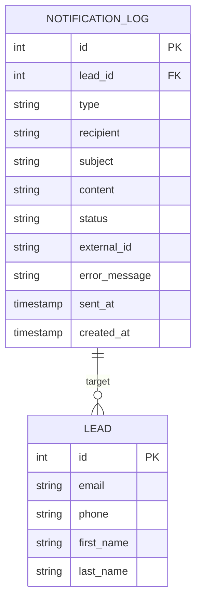
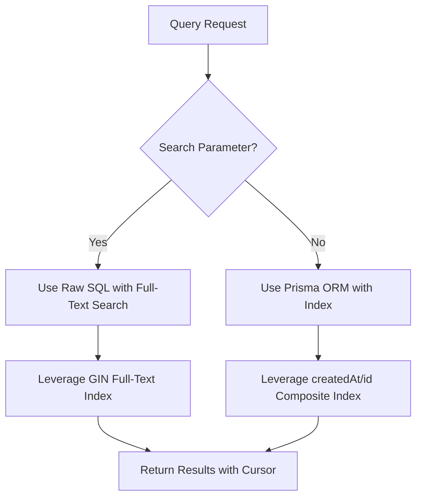
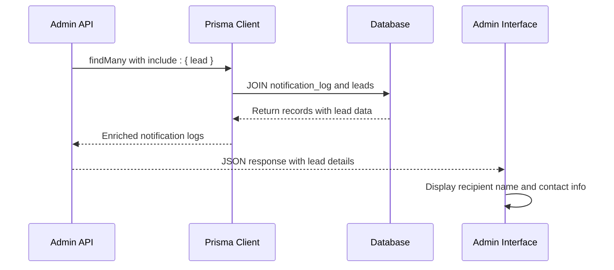
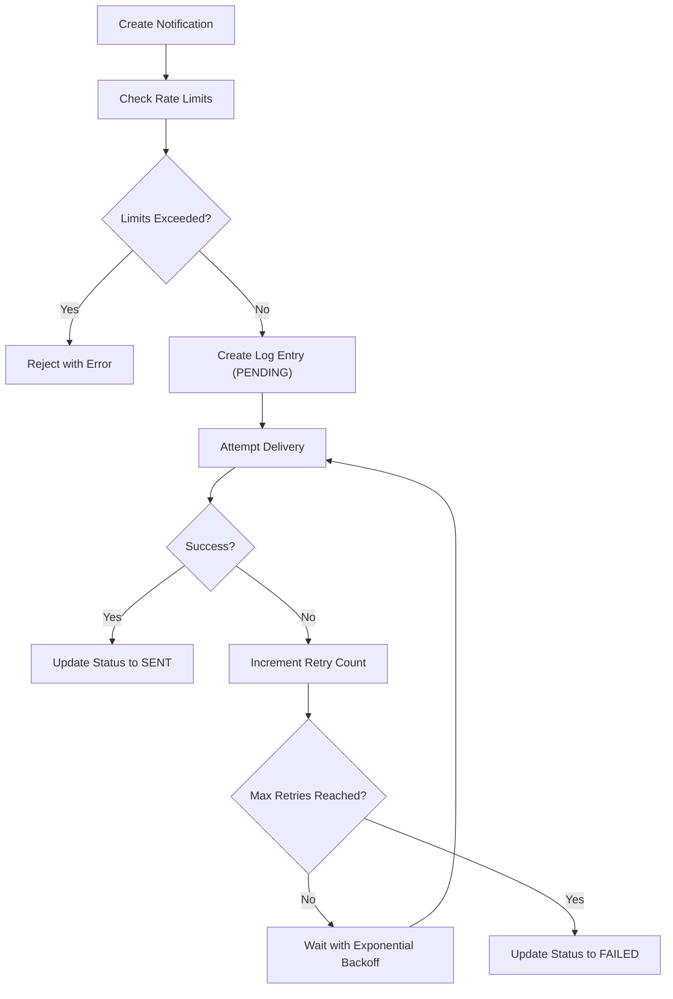
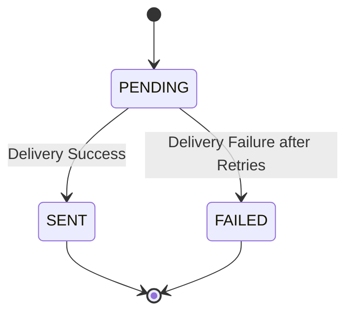
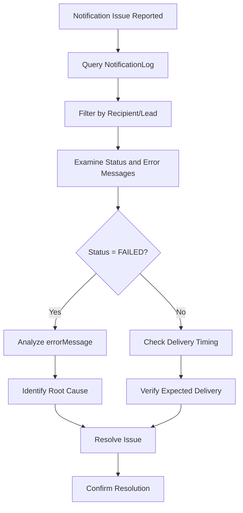
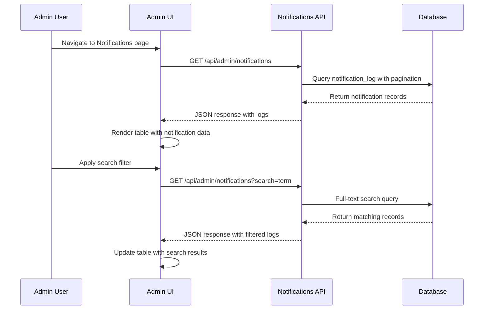

# NotificationLog Entity Model

<cite>
**Referenced Files in This Document**   
- [schema.prisma](file://prisma/schema.prisma#L150-L170)
- [NotificationService.ts](file://src/services/NotificationService.ts#L1-L472)
- [NotificationCleanupService.ts](file://src/services/NotificationCleanupService.ts#L1-L231)
- [notifications.ts](file://src/lib/notifications.ts#L1-L222)
- [route.ts](file://src/app/api/admin/notifications/route.ts#L1-L122)
- [page.tsx](file://src/app/admin/notifications/page.tsx#L1-L298)
- [migration.sql](file://prisma/migrations/20250812120000_add_notification_log_indexes/migration.sql#L1-L10)
</cite>

## Table of Contents
1. [Introduction](#introduction)
2. [Entity Fields and Data Structure](#entity-fields-and-data-structure)
3. [Indexing Strategy and Performance Optimization](#indexing-strategy-and-performance-optimization)
4. [Relationships with Other Entities](#relationships-with-other-entities)
5. [Business Rules and Processing Logic](#business-rules-and-processing-logic)
6. [Notification Lifecycle and Status Flow](#notification-lifecycle-and-status-flow)
7. [Examples of Notification Records](#examples-of-notification-records)
8. [Monitoring, Troubleshooting, and Analytics](#monitoring-troubleshooting-and-analytics)
9. [API and UI Integration](#api-and-ui-integration)

## Introduction
The NotificationLog entity is a critical component of the communication infrastructure, responsible for tracking all notification attempts across multiple channels. This comprehensive logging system enables detailed monitoring, auditing, and troubleshooting of all outbound communications within the application. The entity captures essential metadata about each notification, including delivery status, error information, and timestamps, providing a complete audit trail for all communication activities. This documentation details the structure, functionality, and operational characteristics of the NotificationLog entity, explaining how it supports reliable communication delivery and system observability.

## Entity Fields and Data Structure
The NotificationLog entity captures comprehensive information about each communication attempt, with fields designed to support tracking, debugging, and analytics.

**Field Definitions:**
- **id**: Unique identifier for the notification log entry (auto-incrementing integer)
- **leadId**: Foreign key reference to the Lead entity, identifying the target recipient lead
- **type**: Notification channel type (email or SMS), defined by NotificationType enum
- **recipient**: Destination address (email address or phone number)
- **subject**: Message subject line (primarily for email notifications)
- **content**: Message body content for both email and SMS
- **status**: Current delivery status (pending, sent, or failed), defined by NotificationStatus enum
- **externalId**: Identifier from the external service (Mailgun message ID or Twilio SID)
- **errorMessage**: Detailed error description when delivery fails
- **sentAt**: Timestamp when the notification was successfully delivered
- **createdAt**: Timestamp when the notification record was created

**Data Model Diagram:**


**Section sources**
- [schema.prisma](file://prisma/schema.prisma#L150-L170)

## Indexing Strategy and Performance Optimization
The NotificationLog entity employs a strategic indexing approach to ensure optimal query performance, particularly for common access patterns and large datasets.

**Primary Index:**
- **idx_notification_log_created_at_id**: Composite index on (created_at DESC, id DESC) to optimize cursor-based pagination for recent notifications
- This index supports efficient retrieval of the most recent records, which is the primary access pattern for monitoring and administration interfaces

**Optional Full-Text Index:**
- **idx_notification_log_fulltext**: GIN index using to_tsvector for full-text search across multiple text fields
- Covers recipient, subject, content, external_id, and error_message fields
- Currently commented out in migration, can be enabled when full-text search functionality is required

**Query Optimization:**
- The API implements dual query strategies based on search parameters:
  - For simple filtering: Uses Prisma ORM with the composite index for optimal performance
  - For full-text search: Uses raw SQL with Postgres full-text search capabilities to leverage the GIN index
- Cursor-based pagination prevents offset-based performance degradation with large datasets



**Section sources**
- [migration.sql](file://prisma/migrations/20250812120000_add_notification_log_indexes/migration.sql#L1-L10)
- [route.ts](file://src/app/api/admin/notifications/route.ts#L38-L87)

## Relationships with Other Entities
The NotificationLog entity maintains important relationships with other core entities in the system, enabling contextual analysis and data enrichment.

**Lead Relationship:**
- One-to-many relationship with the Lead entity (one lead can have multiple notification logs)
- The leadId field serves as a foreign key, establishing the connection to the target lead
- When retrieving notification logs, the system can include lead details such as name, email, and phone for context
- This relationship enables lead-specific analytics, such as tracking communication history for individual prospects

**Sender Context:**
- While not directly linked to a User entity in the schema, notification context is captured through:
  - System settings that track configuration changes
  - Application-level context that identifies the initiating process or user
  - The notification service captures operational context for auditing purposes

**Data Enrichment Flow:**


**Section sources**
- [schema.prisma](file://prisma/schema.prisma#L150-L170)
- [route.ts](file://src/app/api/admin/notifications/route.ts#L100-L105)

## Business Rules and Processing Logic
The NotificationLog entity is integrated with comprehensive business rules that govern retry logic, rate limiting, and delivery confirmation.

**Retry Logic:**
- Automatic retry mechanism with exponential backoff for failed deliveries
- Configurable retry parameters:
  - Maximum retry attempts (default: 3)
  - Base delay between retries (default: 1 second)
  - Maximum delay (default: 30 seconds)
- Retry count and delay can be configured via system settings
- Each retry attempt is not logged separately; the same log record is updated

**Rate Limiting Enforcement:**
- Two-tier rate limiting to prevent notification spam:
  - Per-recipient limit: Maximum of 2 notifications per hour to the same recipient
  - Per-lead limit: Maximum of 10 notifications per day to the same lead
- Rate limiting checks occur before notification creation
- Violations result in immediate rejection with descriptive error messages
- Rate limit state is checked against the notification_log table

**Delivery Confirmation:**
- Status transitions reflect the delivery lifecycle:
  - PENDING: Notification created, awaiting processing
  - SENT: Successfully delivered, externalId recorded
  - FAILED: Delivery attempt failed, errorMessage recorded
- sentAt timestamp is only set on successful delivery
- externalId captures the service-specific identifier for delivery tracking



**Section sources**
- [NotificationService.ts](file://src/services/NotificationService.ts#L200-L399)

## Notification Lifecycle and Status Flow
The NotificationLog entity follows a well-defined lifecycle that tracks each notification from creation through delivery or failure.

**Status Transitions:**
- **PENDING**: Initial state when a notification is queued for delivery
- **SENT**: Final state for successfully delivered notifications
- **FAILED**: Final state for notifications that could not be delivered after all retry attempts

**State Transition Diagram:**


**Lifecycle Events:**
1. **Creation**: Log entry created with PENDING status when notification is initiated
2. **Processing**: Delivery attempt made through appropriate channel (email/SMS)
3. **Success**: On successful delivery, status updated to SENT, sentAt timestamp set, and externalId recorded
4. **Failure**: On delivery failure, retry logic engaged; if all retries fail, status updated to FAILED with error message
5. **Retention**: Log retained according to data retention policies

**Data Retention Policy:**
- SENT notifications: Retained for 30 days
- FAILED notifications: Retained for 7 days (shorter period for debugging)
- Emergency cleanup available for excessive records
- Automated cleanup service runs periodically to manage database size

**Section sources**
- [NotificationService.ts](file://src/services/NotificationService.ts#L100-L199)
- [NotificationCleanupService.ts](file://src/services/NotificationCleanupService.ts#L1-L50)

## Examples of Notification Records
The following examples illustrate typical notification log entries for both successful and failed delivery attempts.

**Successful Email Notification:**
```json
{
  "id": 1001,
  "leadId": 501,
  "type": "EMAIL",
  "recipient": "john.doe@example.com",
  "subject": "Complete Your Merchant Funding Application",
  "content": "Hi John, Thank you for your interest...",
  "status": "SENT",
  "externalId": "<20250826123456.1234567890@mg.example.com>",
  "errorMessage": null,
  "sentAt": "2025-08-26T12:35:00Z",
  "createdAt": "2025-08-26T12:34:55Z"
}
```

**Failed SMS Notification:**
```json
{
  "id": 1002,
  "leadId": 502,
  "type": "SMS",
  "recipient": "+1555010234",
  "subject": null,
  "content": "Complete your application: https://example.com/token123",
  "status": "FAILED",
  "externalId": null,
  "errorMessage": "Message delivery failed: invalid phone number",
  "sentAt": null,
  "createdAt": "2025-08-26T13:20:15Z"
}
```

**Pending Notification (Initial State):**
```json
{
  "id": 1003,
  "leadId": 503,
  "type": "EMAIL",
  "recipient": "jane.smith@example.org",
  "subject": "Follow-up: Your Application Status",
  "content": "Hi Jane, We noticed you started your application...",
  "status": "PENDING",
  "externalId": null,
  "errorMessage": null,
  "sentAt": null,
  "createdAt": "2025-08-26T14:10:30Z"
}
```

**Section sources**
- [NotificationService.ts](file://src/services/NotificationService.ts#L100-L199)

## Monitoring, Troubleshooting, and Analytics
The NotificationLog entity serves as a foundation for system monitoring, troubleshooting, and communication analytics.

**Monitoring Capabilities:**
- Real-time visibility into notification delivery status
- Detection of delivery failures and patterns
- Tracking of notification volume and throughput
- Identification of rate limiting issues

**Troubleshooting Workflow:**


**Analytics and Reporting:**
- Delivery success rate calculation
- Channel performance comparison (email vs. SMS)
- Peak notification times and volume patterns
- Lead engagement metrics based on communication history
- Rate limiting impact analysis

**Diagnostic Queries:**
- Status distribution: `SELECT status, count(*) FROM notification_log GROUP BY status`
- Delivery volume by day: `SELECT date(created_at), count(*) FROM notification_log GROUP BY date(created_at)`
- Top recipients: `SELECT recipient, count(*) FROM notification_log GROUP BY recipient ORDER BY count DESC LIMIT 50`
- Error pattern analysis: `SELECT error_message, count(*) FROM notification_log WHERE status = 'FAILED' GROUP BY error_message`

**Section sources**
- [NotificationCleanupService.ts](file://src/services/NotificationCleanupService.ts#L100-L199)
- [route.ts](file://src/app/api/admin/notifications/route.ts#L1-L122)

## API and UI Integration
The NotificationLog entity is accessible through a dedicated API endpoint and administrative user interface, enabling monitoring and analysis.

**API Endpoint:**
- **GET /api/admin/notifications**: Retrieves notification logs with filtering and pagination
- Supports query parameters:
  - limit: Number of records to return (1-100)
  - cursor: For cursor-based pagination
  - type: Filter by notification type (EMAIL/SMS)
  - status: Filter by delivery status
  - recipient: Filter by recipient address
  - search: Full-text search across multiple fields
- Returns enriched data with lead information when available

**Admin Interface Features:**
- Tabular display of notification logs with key information
- Search functionality across recipient, subject, content, and error messages
- Filtering capabilities for type and status
- Pagination with previous/next navigation
- Visual status indicators (color-coded badges)
- Responsive design for different screen sizes

**Integration Flow:**


**Section sources**
- [page.tsx](file://src/app/admin/notifications/page.tsx#L1-L298)
- [route.ts](file://src/app/api/admin/notifications/route.ts#L1-L122)