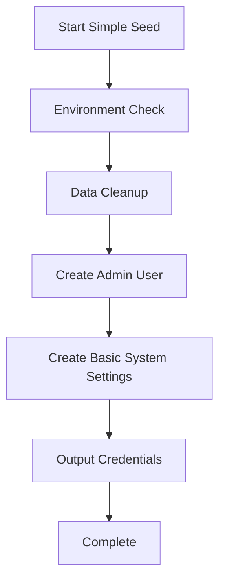
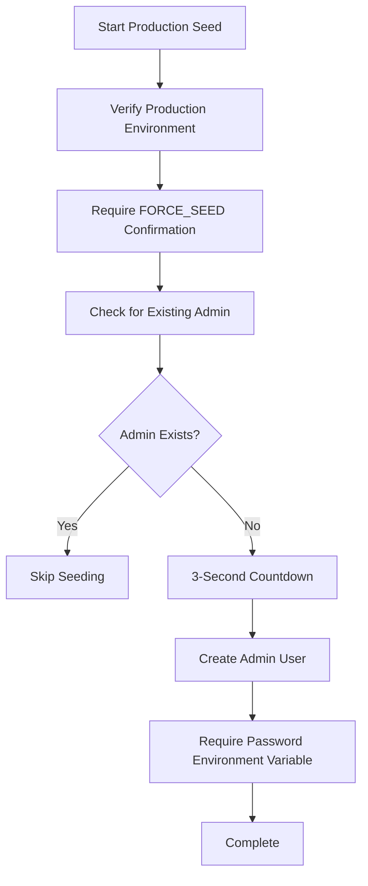
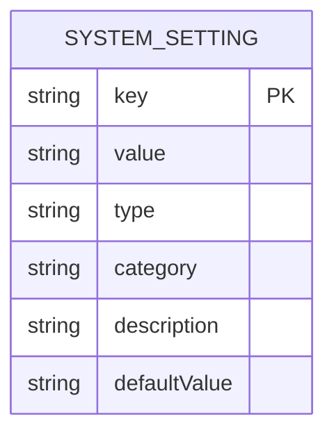
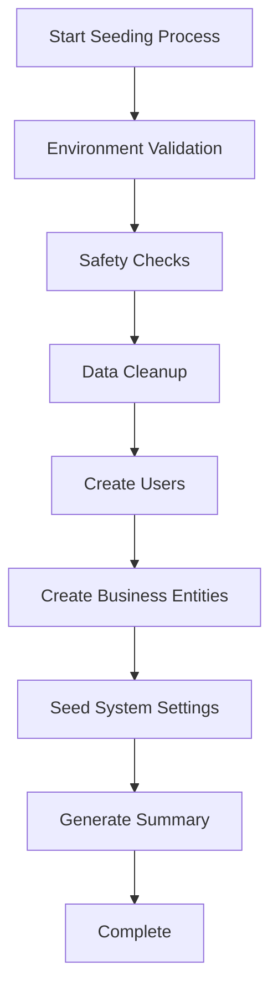
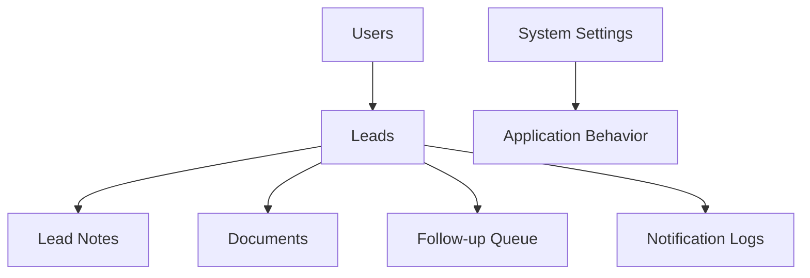
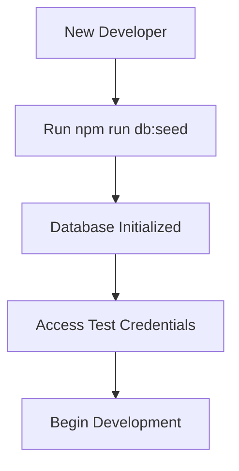

# Seed Data Management

<cite>
**Referenced Files in This Document**   
- [prisma/seed.ts](file://prisma/seed.ts)
- [prisma/seed-simple.ts](file://prisma/seed-simple.ts)
- [prisma/seed-production.ts](file://prisma/seed-production.ts)
- [prisma/seeds/system-settings.ts](file://prisma/seeds/system-settings.ts)
</cite>

## Table of Contents
1. [Introduction](#introduction)
2. [Seed File Overview](#seed-file-overview)
3. [System Settings Seeding](#system-settings-seeding)
4. [Seeding Workflow and Environment Variations](#seeding-workflow-and-environment-variations)
5. [Adding New Seed Data](#adding-new-seed-data)
6. [Data Consistency and Dependencies](#data-consistency-and-dependencies)
7. [Typical Seeded Records](#typical-seeded-records)
8. [Testing and Onboarding Support](#testing-and-onboarding-support)

## Introduction
The seed data management system provides a robust framework for initializing the database with consistent, environment-appropriate data. This documentation details the purpose, structure, and usage of the seed files, explaining how they support development, testing, and production deployment. The system ensures that all environments start with predictable data states while maintaining appropriate safety measures, particularly in production.

## Seed File Overview

The repository contains three primary seed files that serve different purposes across environments:

- **seed.ts**: Default development seed with comprehensive sample data
- **seed-simple.ts**: Minimal setup with essential data for quick initialization
- **seed-production.ts**: Production-ready configuration with strict safety checks

Each file follows a consistent pattern of data cleanup, entity creation, and validation, but with varying levels of complexity and safety measures appropriate to their target environment.

### Default Development Seed (seed.ts)

The main seed file (`seed.ts`) provides a rich dataset for development and testing purposes. It creates a comprehensive set of sample records that represent various business scenarios and edge cases.

**Section sources**
- [prisma/seed.ts](file://prisma/seed.ts#L0-L510)

### Minimal Setup Seed (seed-simple.ts)

The simple seed file (`seed-simple.ts`) provides a minimal dataset for quick environment setup. It focuses on creating only essential entities needed to run the application.



**Diagram sources**
- [prisma/seed-simple.ts](file://prisma/seed-simple.ts#L0-L100)

**Section sources**
- [prisma/seed-simple.ts](file://prisma/seed-simple.ts#L0-L100)

### Production-Ready Seed (seed-production.ts)

The production seed file (`seed-production.ts`) implements strict safety protocols for production environments. It only creates essential administrative users and includes multiple confirmation steps.



**Diagram sources**
- [prisma/seed-production.ts](file://prisma/seed-production.ts#L0-L72)

**Section sources**
- [prisma/seed-production.ts](file://prisma/seed-production.ts#L0-L72)

## System Settings Seeding

System settings are managed through a dedicated module in `seeds/system-settings.ts` that provides type-safe defaults for application configuration.

### Type-Safe Configuration Structure

The system settings data structure includes type safety through Prisma enums and comprehensive metadata:

- **key**: Unique identifier for the setting
- **value**: Current value (string representation)
- **type**: Data type (BOOLEAN, NUMBER, STRING)
- **category**: Organizational grouping
- **description**: Purpose and usage explanation
- **defaultValue**: Default value if not set



**Diagram sources**
- [prisma/seeds/system-settings.ts](file://prisma/seeds/system-settings.ts#L0-L73)

### Current System Settings

The following system settings are seeded with type-safe defaults:

**Notification Settings**
- **sms_notifications_enabled**: 
  - *Type*: BOOLEAN
  - *Default*: 'true'
  - *Description*: Enable or disable SMS notifications globally
- **email_notifications_enabled**: 
  - *Type*: BOOLEAN
  - *Default*: 'true'
  - *Description*: Enable or disable email notifications globally
- **notification_retry_attempts**: 
  - *Type*: NUMBER
  - *Default*: '3'
  - *Description*: Maximum number of retry attempts for failed notifications
- **notification_retry_delay**: 
  - *Type*: NUMBER
  - *Default*: '1000'
  - *Description*: Base delay in milliseconds between notification retries

**Section sources**
- [prisma/seeds/system-settings.ts](file://prisma/seeds/system-settings.ts#L0-L73)

## Seeding Workflow and Environment Variations

The seeding process follows a consistent workflow across all environments, with variations based on the execution context.

### Standard Seeding Workflow



**Diagram sources**
- [prisma/seed.ts](file://prisma/seed.ts#L0-L510)

### Environment-Specific Variations

Each environment has specific behaviors and safety measures:

**Development Environment**
- Automatic execution without confirmation
- Comprehensive sample data
- Predefined test credentials
- No data preservation checks

**Production Environment**
- Requires `FORCE_SEED=true` flag
- 3-5 second countdown with cancellation option
- Environment variable validation
- Skips seeding if admin user exists
- Minimal data creation

**Section sources**
- [prisma/seed.ts](file://prisma/seed.ts#L18-L76)
- [prisma/seed-production.ts](file://prisma/seed-production.ts#L9-L37)

## Adding New Seed Data

To add new seed data to the system, follow these guidelines:

### For Development Environment (seed.ts)

1. Import necessary Prisma types at the top of the file
2. Add data creation logic in the appropriate section
3. Maintain dependency order (users → leads → related entities)
4. Include realistic sample values
5. Add console logging for the operation

```typescript
// Example: Adding a new user role
const partnerUser = await prisma.user.create({
  data: {
    email: "partner@merchantfunding.com",
    passwordHash: userPassword,
    role: UserRole.PARTNER,
  },
});
```

### For System Settings

1. Add the new setting to `system-settings.ts`
2. Include appropriate type, category, and default value
3. Provide a clear description
4. Test the setting in the application

```typescript
{
  key: 'max_document_size_mb',
  value: '10',
  type: SystemSettingType.NUMBER,
  category: SystemSettingCategory.DOCUMENTS,
  description: 'Maximum allowed document size in megabytes',
  defaultValue: '10',
}
```

**Section sources**
- [prisma/seed.ts](file://prisma/seed.ts#L78-L122)
- [prisma/seeds/system-settings.ts](file://prisma/seeds/system-settings.ts#L43-L73)

## Data Consistency and Dependencies

Maintaining data consistency across environments requires careful attention to dependency management and seeding order.

### Dependency Chain

Entities must be created in the correct order to respect foreign key constraints:



**Diagram sources**
- [prisma/seed.ts](file://prisma/seed.ts#L78-L122)

### Data Cleanup Order

When clearing existing data, entities are deleted in reverse dependency order:

1. NotificationLog
2. FollowupQueue
3. Document
4. LeadNote
5. LeadStatusHistory
6. Lead
7. SystemSetting
8. User

This order prevents foreign key constraint violations during cleanup operations.

**Section sources**
- [prisma/seed.ts](file://prisma/seed.ts#L78-L122)

## Typical Seeded Records

The seed files create realistic sample data that represents various business scenarios.

### Sample Users

- **Admin User**: ardabasoglu@gmail.com with ADMIN role
- **Regular User**: user-001@merchantfunding.com with USER role
- **Sales User**: user-002@merchantfunding.com with USER role

### Sample Leads

The system seeds leads with various statuses and characteristics:

**Lead Status Variations**
- **New**: Recently imported, intake not started
- **Pending**: Intake started but not completed
- **In Progress**: Being reviewed by staff
- **Completed**: Application approved
- **Rejected**: Application denied

**Business Model Variations**
- Business with full information
- Individual applicant (no business name)
- High-value funding request
- International contact

### Related Entities

Each lead is accompanied by appropriate related data:

- **Notes**: Staff comments and verification details
- **Documents**: Bank statements, business licenses
- **Follow-ups**: Scheduled communication tasks
- **Notifications**: Email and SMS messages

**Section sources**
- [prisma/seed.ts](file://prisma/seed.ts#L200-L399)

## Testing and Onboarding Support

The seed data system plays a crucial role in both testing and team onboarding processes.

### Testing Support

The comprehensive seed data enables thorough testing of application features:

- **Edge Cases**: Missing business names, international formats
- **Workflow Testing**: Complete application lifecycle
- **Permission Testing**: Different user roles and access levels
- **Integration Testing**: Notification systems, document handling

The predefined test credentials allow developers to quickly access different user perspectives without manual account creation.

### Onboarding Support

For new team members, the seed system provides:

- **Immediate Working Environment**: Fully functional system after seeding
- **Realistic Data**: Sample records that reflect actual business scenarios
- **Consistent State**: All developers work with identical data
- **Quick Start**: Minimal setup required to begin development

The `seed-simple.ts` file is particularly valuable for onboarding, as it provides a minimal but functional dataset that allows new developers to get started quickly without the complexity of the full development seed.



**Diagram sources**
- [prisma/seed.ts](file://prisma/seed.ts#L453-L487)

**Section sources**
- [prisma/seed.ts](file://prisma/seed.ts#L453-L487)