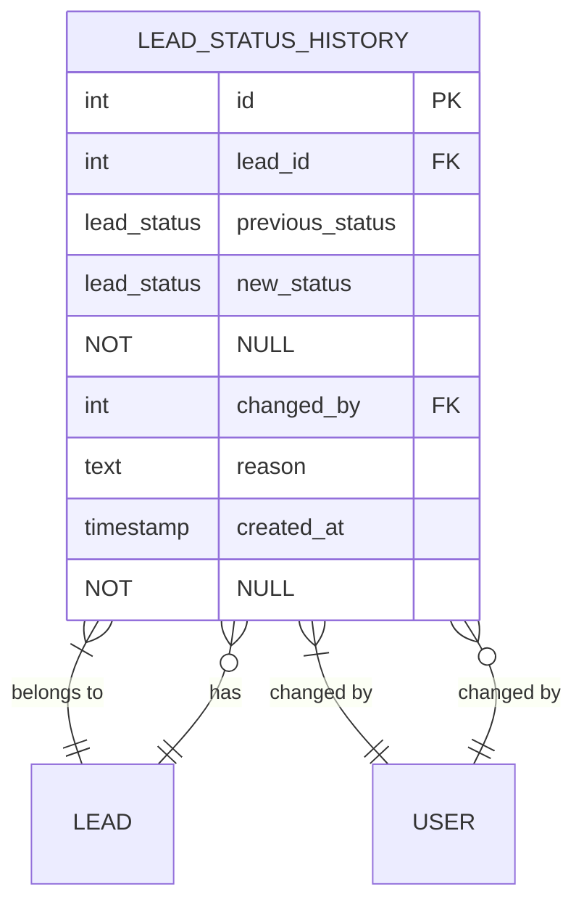
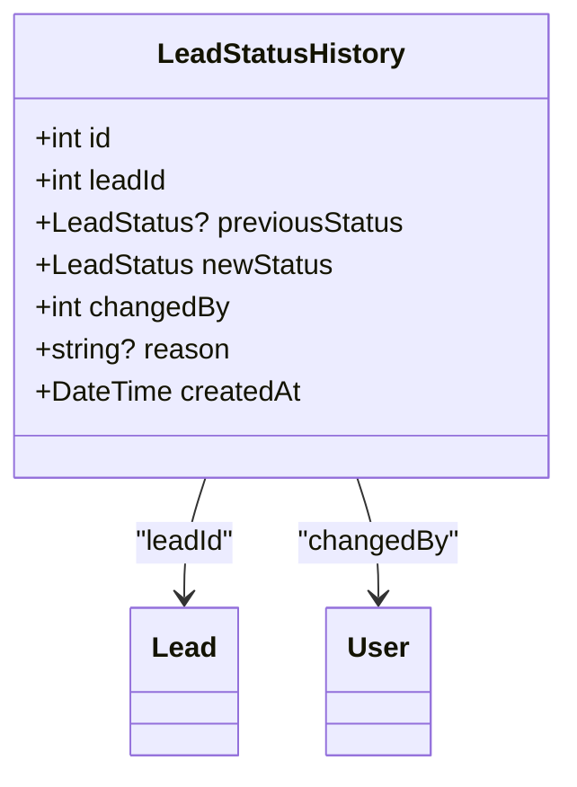
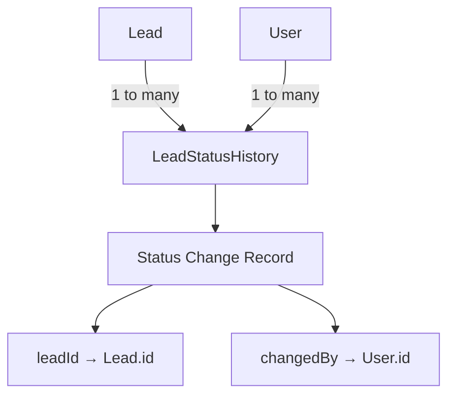
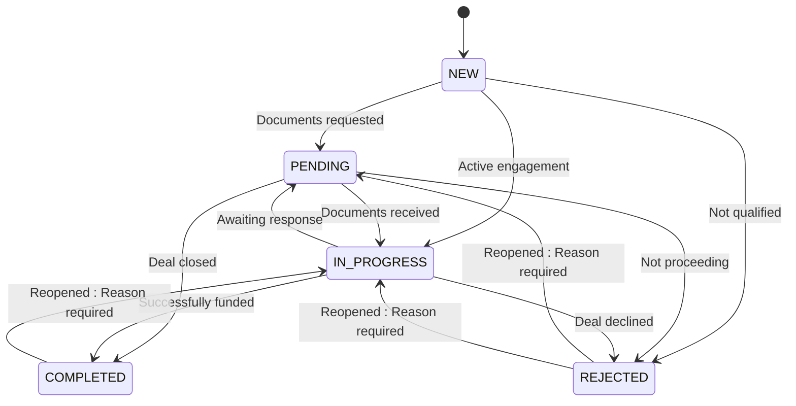
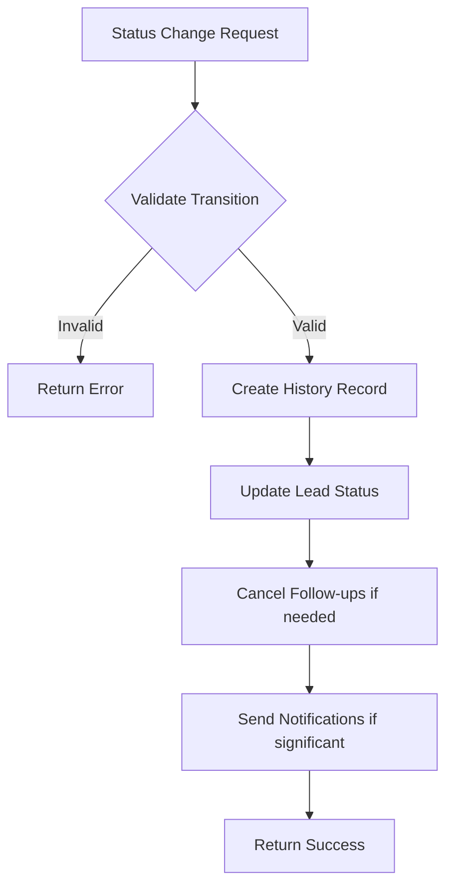
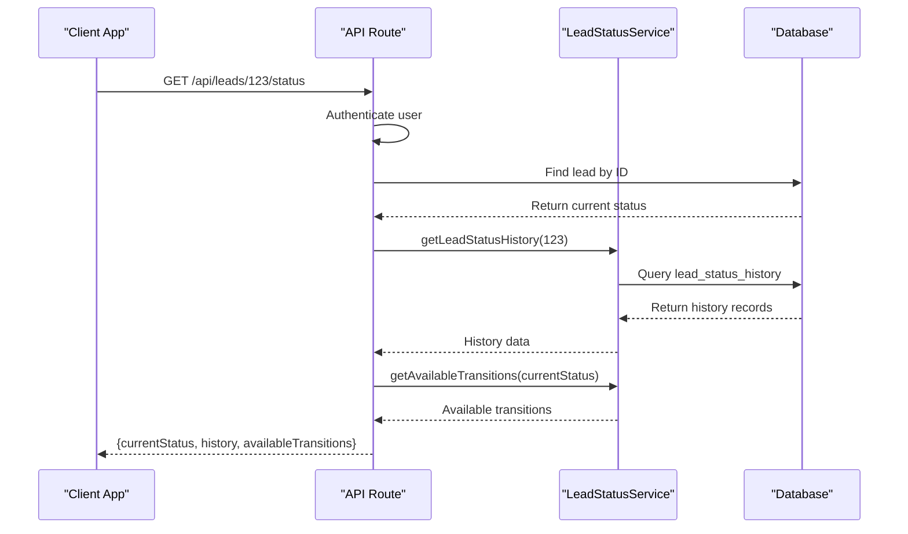
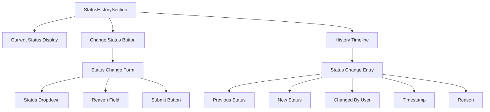
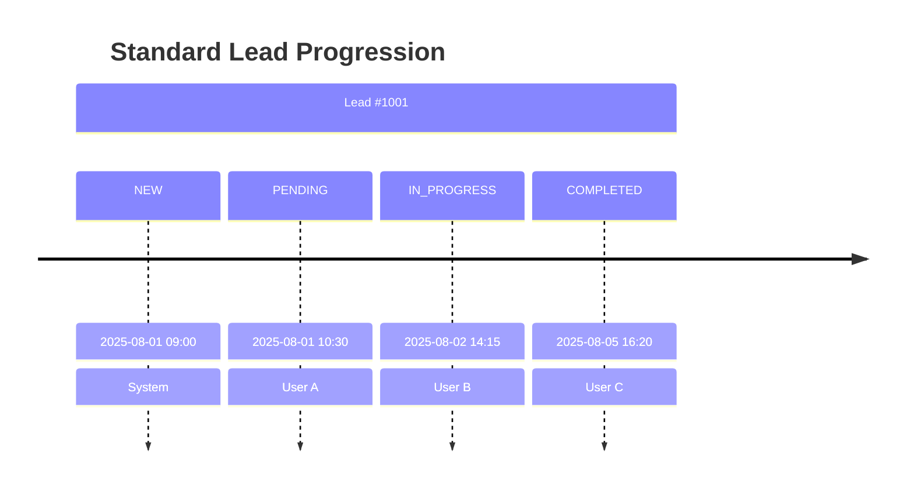
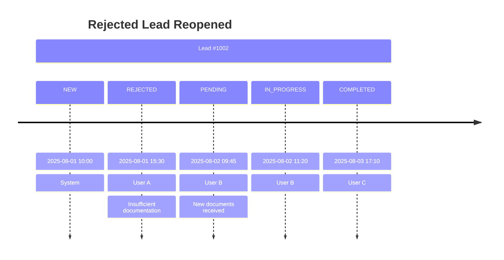
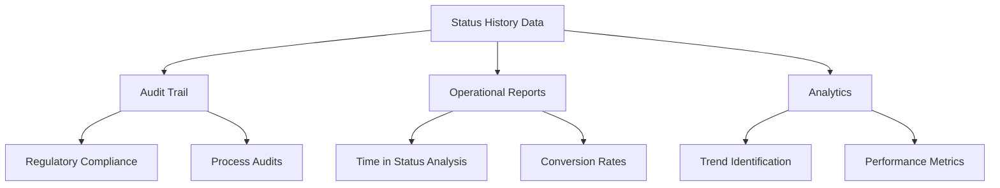

# StatusHistory Entity Model

<cite>
**Referenced Files in This Document**   
- [schema.prisma](file://prisma/schema.prisma#L150-L170)
- [LeadStatusService.ts](file://src/services/LeadStatusService.ts#L0-L456)
- [route.ts](file://src/app/api/leads/[id]/status/route.ts#L0-L64)
- [StatusHistorySection.tsx](file://src/components/dashboard/StatusHistorySection.tsx#L0-L375)
- [migration.sql](file://prisma/migrations/20250730060039_add_lead_status_history/migration.sql#L0-L19)
</cite>

## Table of Contents
1. [Introduction](#introduction)
2. [Entity Overview](#entity-overview)
3. [Field Definitions](#field-definitions)
4. [Relationships](#relationships)
5. [Business Rules and Status Transitions](#business-rules-and-status-transitions)
6. [Data Flow and Usage](#data-flow-and-usage)
7. [Performance Considerations](#performance-considerations)
8. [User Interface Representation](#user-interface-representation)
9. [Example Status Change Sequences](#example-status-change-sequences)
10. [Reporting and Compliance](#reporting-and-compliance)

## Introduction
The StatusHistory entity (implemented as LeadStatusHistory in the codebase) maintains a complete audit trail of all status changes for leads in the system. This document provides a comprehensive analysis of the entity's structure, relationships, business rules, and usage patterns. The audit trail enables full traceability of lead lifecycle progression, supports compliance requirements, and facilitates operational reporting.

## Entity Overview
The LeadStatusHistory entity captures every status transition for leads, creating an immutable record of changes over time. This audit trail is critical for understanding lead progression, identifying process bottlenecks, and ensuring accountability in the lead management workflow.



**Diagram sources**
- [schema.prisma](file://prisma/schema.prisma#L150-L170)
- [migration.sql](file://prisma/migrations/20250730060039_add_lead_status_history/migration.sql#L0-L19)

**Section sources**
- [schema.prisma](file://prisma/schema.prisma#L150-L170)

## Field Definitions
The LeadStatusHistory entity contains the following fields that capture essential information about each status change:

- **id**: Unique identifier for the status history record
- **leadId**: Foreign key referencing the lead that changed status
- **previousStatus**: The status value before the change (nullable for initial status)
- **newStatus**: The status value after the change (required)
- **changedBy**: Foreign key referencing the user or system that initiated the change
- **reason**: Optional explanation for the status change
- **createdAt**: Timestamp when the status change was recorded (automatically set)



**Diagram sources**
- [schema.prisma](file://prisma/schema.prisma#L150-L170)

**Section sources**
- [schema.prisma](file://prisma/schema.prisma#L150-L170)

## Relationships
The LeadStatusHistory entity maintains relationships with two core entities in the system: Leads and Users.

### Lead Relationship
Each status history record is associated with exactly one lead through the leadId foreign key. This relationship enables retrieval of all status changes for a specific lead, providing a complete chronological history of its lifecycle.

### User Relationship
Each status change is attributed to a specific user through the changedBy foreign key. This establishes accountability and enables auditing of user actions within the system.



**Diagram sources**
- [schema.prisma](file://prisma/schema.prisma#L150-L170)
- [LeadStatusService.ts](file://src/services/LeadStatusService.ts#L0-L456)

**Section sources**
- [schema.prisma](file://prisma/schema.prisma#L150-L170)

## Business Rules and Status Transitions
The system enforces specific business rules for status transitions through the LeadStatusService. These rules ensure data integrity and guide users through the proper lead management workflow.

### Valid Status Transitions
The following status transitions are permitted in the system:



**Diagram sources**
- [LeadStatusService.ts](file://src/services/LeadStatusService.ts#L15-L60)

**Section sources**
- [LeadStatusService.ts](file://src/services/LeadStatusService.ts#L15-L60)

### Transition Rules
- **Same status**: No change is allowed (no history record created)
- **COMPLETED to IN_PROGRESS**: Requires a reason (e.g., deal reopened)
- **REJECTED to PENDING/IN_PROGRESS**: Requires a reason (e.g., new information received)
- All other transitions follow the defined workflow paths

### Validation Process
When a status change is requested, the system performs the following validation:



**Diagram sources**
- [LeadStatusService.ts](file://src/services/LeadStatusService.ts#L100-L200)

**Section sources**
- [LeadStatusService.ts](file://src/services/LeadStatusService.ts#L100-L200)

## Data Flow and Usage
The StatusHistory data flows through multiple layers of the application, from database storage to API endpoints and user interface components.

### API Endpoint
The `/api/leads/[id]/status` endpoint provides access to status history and available transitions:



**Diagram sources**
- [route.ts](file://src/app/api/leads/[id]/status/route.ts#L0-L64)
- [LeadStatusService.ts](file://src/services/LeadStatusService.ts#L350-L370)

**Section sources**
- [route.ts](file://src/app/api/leads/[id]/status/route.ts#L0-L64)

## Performance Considerations
While the current implementation provides comprehensive audit tracking, there are important performance considerations for querying and displaying status history data.

### Current Indexing
The database schema currently lacks dedicated indexes on the lead_status_history table. The only constraint is the primary key index on the id column.

### Recommended Indexes
For optimal performance, especially with large datasets, the following indexes should be considered:

- **Composite index on (leadId, createdAt)**: Enables efficient chronological queries for a specific lead's history
- **Index on createdAt**: Facilitates time-based queries for reporting and analytics
- **Index on newStatus**: Supports status-based filtering and reporting

```sql
-- Recommended indexes
CREATE INDEX idx_lead_status_history_lead_created ON lead_status_history(lead_id, created_at DESC);
CREATE INDEX idx_lead_status_history_created ON lead_status_history(created_at DESC);
CREATE INDEX idx_lead_status_history_new_status ON lead_status_history(new_status);
```

**Section sources**
- [schema.prisma](file://prisma/schema.prisma#L150-L170)
- [migration.sql](file://prisma/migrations/20250730060039_add_lead_status_history/migration.sql#L0-L19)

## User Interface Representation
The status history is presented to users through the StatusHistorySection component, which provides both historical context and status change functionality.

### Component Structure
The UI component displays:
- Current status with visual indicator
- Form to change status (when transitions are available)
- Chronological history of all status changes
- User who made each change and timestamp
- Reason for changes when provided



**Diagram sources**
- [StatusHistorySection.tsx](file://src/components/dashboard/StatusHistorySection.tsx#L0-L375)

**Section sources**
- [StatusHistorySection.tsx](file://src/components/dashboard/StatusHistorySection.tsx#L0-L375)

## Example Status Change Sequences
The following examples illustrate common status change sequences in the lead lifecycle:

### Standard Progression


### Rejected and Reopened


**Section sources**
- [LeadStatusService.ts](file://src/services/LeadStatusService.ts#L15-L60)

## Reporting and Compliance
The StatusHistory data supports several critical reporting and compliance requirements:

### Audit Trail
The complete history of status changes provides a verifiable audit trail for:
- Regulatory compliance requirements
- Internal process audits
- Dispute resolution
- Accountability tracking

### Operational Reporting
The data enables generation of reports such as:
- Average time in each status
- Status transition frequencies
- User activity patterns
- Conversion rates between statuses

### Analytics
The system includes built-in analytics through the getStatusChangeStats method, which provides:
- Total status changes within a time period
- Transition frequencies between specific statuses
- Trends in lead progression



**Diagram sources**
- [LeadStatusService.ts](file://src/services/LeadStatusService.ts#L400-L450)

**Section sources**
- [LeadStatusService.ts](file://src/services/LeadStatusService.ts#L400-L450)