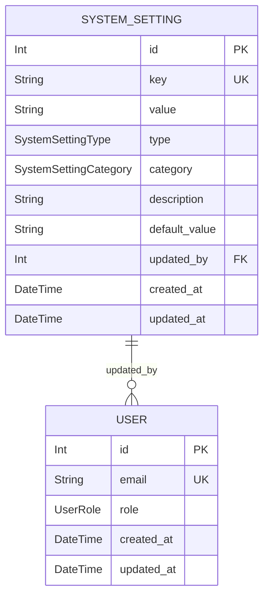
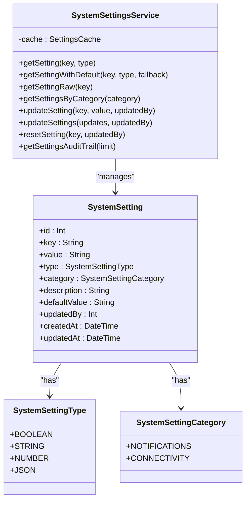
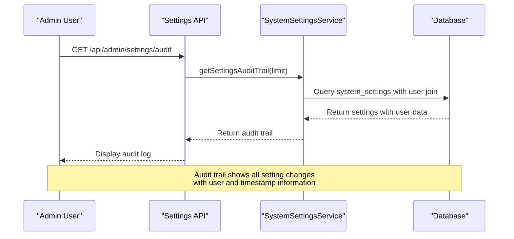
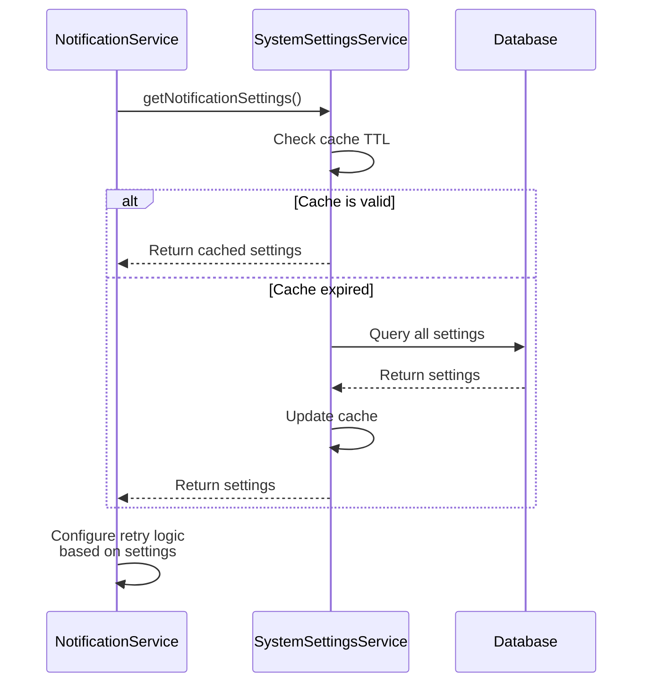
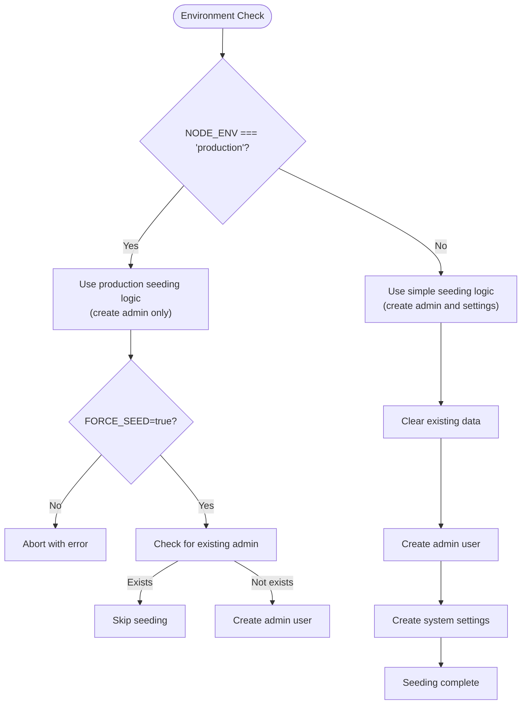
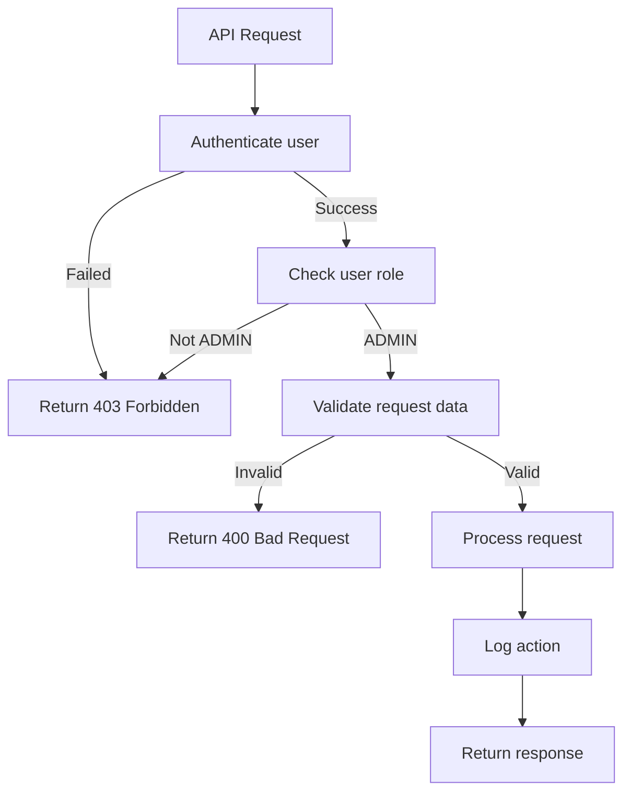
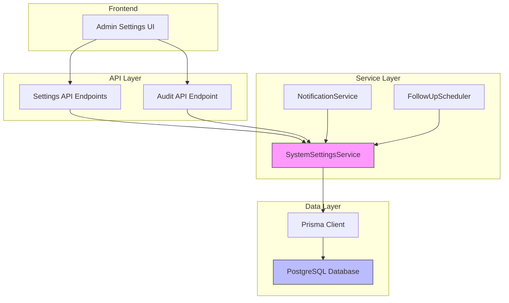

# SystemSetting Entity Model

<cite>
**Referenced Files in This Document**   
- [schema.prisma](file://prisma/schema.prisma)
- [system-settings.ts](file://prisma/seeds/system-settings.ts)
- [seed-simple.ts](file://prisma/seed-simple.ts)
- [seed-production.ts](file://prisma/seed-production.ts)
- [SystemSettingsService.ts](file://src/services/SystemSettingsService.ts)
- [NotificationService.ts](file://src/services/NotificationService.ts)
- [FollowUpScheduler.ts](file://src/services/FollowUpScheduler.ts)
- [route.ts](file://src/app/api/admin/settings/route.ts)
- [route.ts](file://src/app/api/admin/settings/audit/route.ts)
</cite>

## Table of Contents
1. [Introduction](#introduction)
2. [SystemSetting Entity Structure](#systemsetting-entity-structure)
3. [Core Fields and Data Types](#core-fields-and-data-types)
4. [Audit Trail and Change Tracking](#audit-trail-and-change-tracking)
5. [Service Integration and Usage](#service-integration-and-usage)
6. [Configuration Examples](#configuration-examples)
7. [Seeding Process](#seeding-process)
8. [Security and Access Controls](#security-and-access-controls)
9. [API Endpoints](#api-endpoints)
10. [Architecture Diagrams](#architecture-diagrams)

## Introduction
The SystemSetting entity provides a flexible mechanism for runtime configuration of application behavior. This model enables administrators to modify system parameters without requiring code changes or application restarts. The settings system supports various data types and is integrated with multiple services including NotificationService and FollowUpScheduler. The implementation includes comprehensive audit logging, caching for performance, and access controls to ensure secure configuration management.

## SystemSetting Entity Structure
The SystemSetting entity is defined in the Prisma schema and represents a key-value store for application configuration. Each setting has a unique key, value, type, category, description, default value, and audit metadata. The entity is designed to be extensible, allowing new settings to be added as application requirements evolve.



**Diagram sources**
- [schema.prisma](file://prisma/schema.prisma#L200-L220)

**Section sources**
- [schema.prisma](file://prisma/schema.prisma#L200-L220)

## Core Fields and Data Types
The SystemSetting entity contains several important fields that define its behavior and functionality:

- **key**: Unique identifier for the setting (e.g., "notification.retryLimit")
- **value**: Current value of the setting stored as a string
- **type**: Data type of the setting (BOOLEAN, STRING, NUMBER, JSON)
- **category**: Functional grouping of settings (NOTIFICATIONS, CONNECTIVITY)
- **description**: Human-readable explanation of the setting's purpose
- **defaultValue**: Default value used when the setting is reset
- **updatedBy**: Reference to the user who last modified the setting
- **createdAt/updatedAt**: Timestamps for creation and last modification

The type field uses the SystemSettingType enum to ensure type safety when retrieving settings. The SystemSettingsService class provides type-safe methods to retrieve settings with proper type conversion.



**Diagram sources**
- [schema.prisma](file://prisma/schema.prisma#L200-L220)
- [SystemSettingsService.ts](file://src/services/SystemSettingsService.ts#L29-L336)

**Section sources**
- [schema.prisma](file://prisma/schema.prisma#L200-L220)
- [SystemSettingsService.ts](file://src/services/SystemSettingsService.ts#L29-L336)

## Audit Trail and Change Tracking
The SystemSetting entity includes comprehensive audit trail functionality that logs all changes to settings. The audit mechanism captures who made the change, when it was made, and what the previous and current values were. This provides complete traceability for configuration changes and supports compliance requirements.

The SystemSettingsService class provides the getSettingsAuditTrail method that returns settings ordered by update time, including the associated user information. The audit trail is accessible through the admin API endpoint and displayed in the admin interface.



**Diagram sources**
- [SystemSettingsService.ts](file://src/services/SystemSettingsService.ts#L338-L340)
- [route.ts](file://src/app/api/admin/settings/audit/route.ts#L1-L32)

**Section sources**
- [SystemSettingsService.ts](file://src/services/SystemSettingsService.ts#L338-L340)
- [route.ts](file://src/app/api/admin/settings/audit/route.ts#L1-L32)

## Service Integration and Usage
The SystemSetting entity is integrated with multiple services throughout the application. The SystemSettingsService class provides a centralized interface for accessing and modifying settings, with built-in caching for performance optimization.

### NotificationService Integration
The NotificationService uses system settings to control its behavior, including enabling/disabling notification types and configuring retry logic. The getNotificationSettings function retrieves multiple related settings and returns them as a structured object.



**Diagram sources**
- [NotificationService.ts](file://src/services/NotificationService.ts#L47-L468)
- [SystemSettingsService.ts](file://src/services/SystemSettingsService.ts#L29-L336)

**Section sources**
- [NotificationService.ts](file://src/services/NotificationService.ts#L47-L468)
- [SystemSettingsService.ts](file://src/services/SystemSettingsService.ts#L342-L349)

### FollowUpScheduler Integration
While the FollowUpScheduler currently uses hardcoded intervals, the architecture supports configuration via system settings. The followUpIntervals object could be modified to retrieve values from the SystemSetting entity, allowing administrators to adjust follow-up timing without code changes.

## Configuration Examples
The system includes several example configuration keys that demonstrate common use cases:

- **notification.retryLimit**: Maximum number of retry attempts for failed notifications
- **followup.intervals**: Timing configuration for follow-up messages (3h, 9h, 24h, 72h)
- **sms_notifications_enabled**: Boolean flag to enable/disable SMS notifications
- **email_notifications_enabled**: Boolean flag to enable/disable email notifications
- **notification_retry_attempts**: Number of retry attempts for failed notifications
- **notification_retry_delay**: Base delay in milliseconds between retries

These settings are defined in the system-settings.ts seed file and can be modified through the admin interface or API.

**Section sources**
- [system-settings.ts](file://prisma/seeds/system-settings.ts#L1-L73)

## Seeding Process
The system settings are initialized through a seeding process that differs between development and production environments.

### Development Environment (seed-simple.ts)
In development, the seed-simple.ts script creates a minimal set of system settings along with test data. The process clears existing data and creates:
- Admin user with email "ardabasoglu@gmail.com" and password "admin123"
- Basic system settings for notifications
- The seeding process is designed for rapid development and testing

### Production Environment (seed-production.ts)
In production, the seed-production.ts script only creates an admin user and does not modify system settings. This ensures that production configuration is preserved and only essential initialization occurs. The script requires explicit confirmation through the FORCE_SEED environment variable.



**Diagram sources**
- [seed-simple.ts](file://prisma/seed-simple.ts#L1-L99)
- [seed-production.ts](file://prisma/seed-production.ts#L1-L71)

**Section sources**
- [seed-simple.ts](file://prisma/seed-simple.ts#L1-L99)
- [seed-production.ts](file://prisma/seed-production.ts#L1-L71)

## Security and Access Controls
The system implements strict security controls for accessing and modifying system settings:

- **Authentication**: All API endpoints require valid authentication
- **Authorization**: Only users with ADMIN role can access settings endpoints
- **Input Validation**: Settings values are validated against their defined type
- **Audit Logging**: All changes are logged with the modifying user and timestamp

The getServerSession function with authOptions ensures that only authenticated users can access the settings API. The role check prevents non-admin users from viewing or modifying system configuration.



**Diagram sources**
- [route.ts](file://src/app/api/admin/settings/route.ts#L1-L106)
- [route.ts](file://src/app/api/admin/settings/audit/route.ts#L1-L32)

**Section sources**
- [route.ts](file://src/app/api/admin/settings/route.ts#L1-L106)
- [route.ts](file://src/app/api/admin/settings/audit/route.ts#L1-L32)

## API Endpoints
The system provides REST API endpoints for managing system settings:

### GET /api/admin/settings
Retrieves system settings, optionally filtered by category. Requires admin authentication.

**Request Parameters:**
- category (optional): Filter settings by category

**Response:**
```json
{
  "settings": [
    {
      "key": "sms_notifications_enabled",
      "value": "false",
      "type": "BOOLEAN",
      "category": "NOTIFICATIONS",
      "description": "Enable or disable SMS notifications globally",
      "defaultValue": "true",
      "updatedBy": 1,
      "createdAt": "2025-08-11T15:23:28.000Z",
      "updatedAt": "2025-08-11T15:23:28.000Z"
    }
  ]
}
```

### PUT /api/admin/settings
Updates one or more system settings. Requires admin authentication.

**Request Body:**
```json
{
  "updates": [
    {
      "key": "sms_notifications_enabled",
      "value": "true"
    }
  ]
}
```

**Response:**
```json
{
  "message": "Settings updated successfully",
  "settings": [
    {
      "key": "sms_notifications_enabled",
      "value": "true",
      "type": "BOOLEAN",
      "category": "NOTIFICATIONS",
      "description": "Enable or disable SMS notifications globally",
      "defaultValue": "true",
      "updatedBy": 1,
      "createdAt": "2025-08-11T15:23:28.000Z",
      "updatedAt": "2025-08-12T10:30:45.000Z"
    }
  ]
}
```

### GET /api/admin/settings/audit
Retrieves the audit trail of setting changes. Requires admin authentication.

**Request Parameters:**
- limit (optional): Number of records to return (default: 50)

**Response:**
```json
{
  "auditTrail": [
    {
      "key": "sms_notifications_enabled",
      "value": "true",
      "type": "BOOLEAN",
      "category": "NOTIFICATIONS",
      "description": "Enable or disable SMS notifications globally",
      "defaultValue": "true",
      "updatedBy": 1,
      "createdAt": "2025-08-11T15:23:28.000Z",
      "updatedAt": "2025-08-12T10:30:45.000Z",
      "user": {
        "id": 1,
        "email": "ardabasoglu@gmail.com"
      }
    }
  ]
}
```

**Section sources**
- [route.ts](file://src/app/api/admin/settings/route.ts#L1-L106)
- [route.ts](file://src/app/api/admin/settings/audit/route.ts#L1-L32)

## Architecture Diagrams
The following diagram illustrates the complete architecture of the SystemSetting entity and its integration with other components:



**Diagram sources**
- [schema.prisma](file://prisma/schema.prisma#L200-L220)
- [SystemSettingsService.ts](file://src/services/SystemSettingsService.ts#L29-L336)
- [route.ts](file://src/app/api/admin/settings/route.ts#L1-L106)
- [route.ts](file://src/app/api/admin/settings/audit/route.ts#L1-L32)

**Section sources**
- [schema.prisma](file://prisma/schema.prisma#L200-L220)
- [SystemSettingsService.ts](file://src/services/SystemSettingsService.ts#L29-L336)
- [route.ts](file://src/app/api/admin/settings/route.ts#L1-L106)
- [route.ts](file://src/app/api/admin/settings/audit/route.ts#L1-L32)