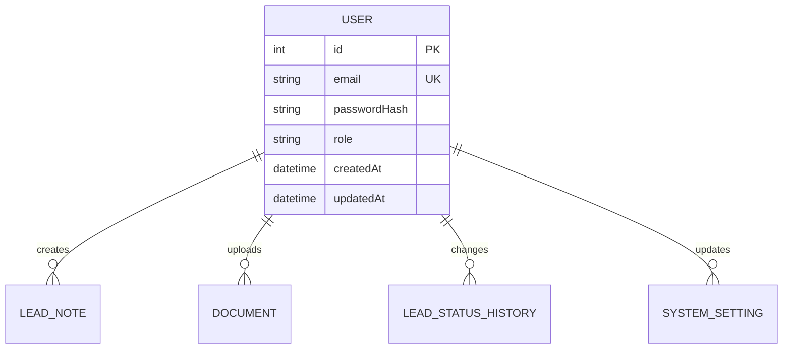
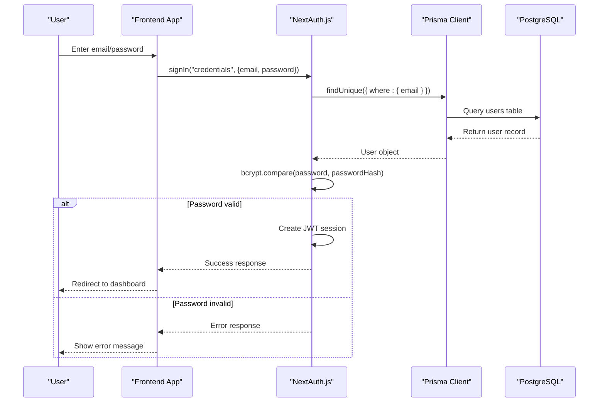
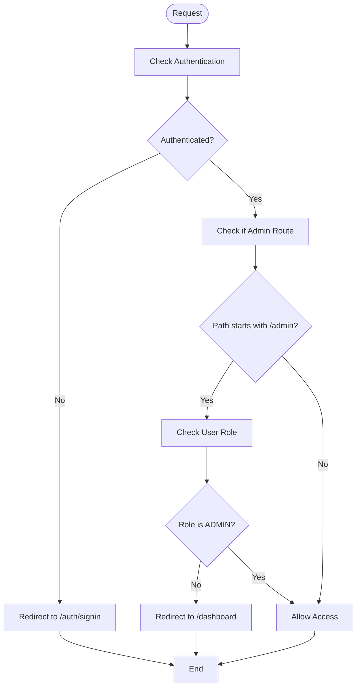
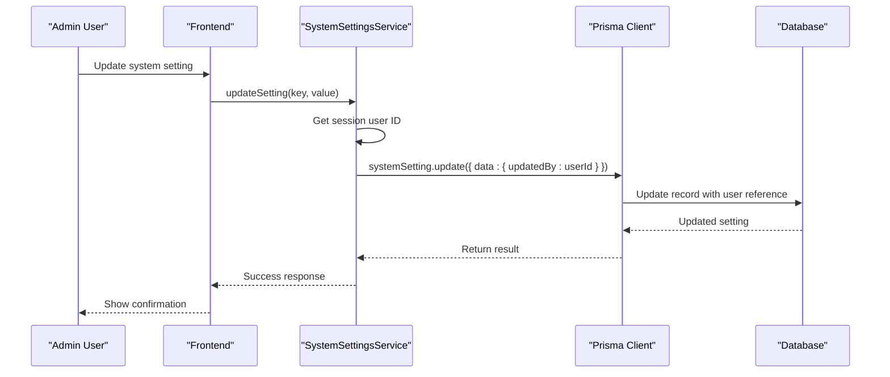
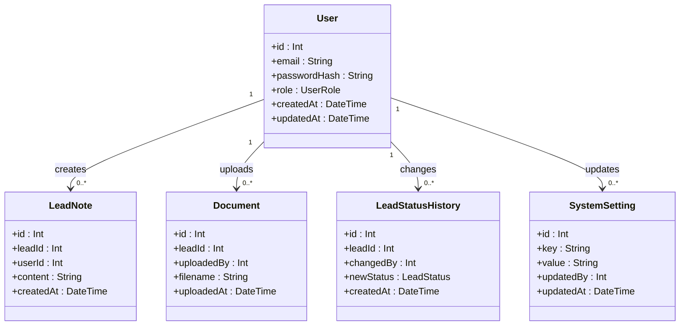

# User Entity Model

<cite>
**Referenced Files in This Document**   
- [schema.prisma](file://prisma/schema.prisma#L25-L44)
- [auth.ts](file://src/lib/auth.ts#L0-L70)
- [password.ts](file://src/lib/password.ts#L0-L10)
- [RoleGuard.tsx](file://src/components/auth/RoleGuard.tsx#L0-L75)
- [SystemSettingsService.ts](file://src/services/SystemSettingsService.ts#L224-L235)
- [prisma.ts](file://src/lib/prisma.ts#L0-L60)
</cite>

## Table of Contents
1. [User Entity Model](#user-entity-model)
2. [Core Fields and Constraints](#core-fields-and-constraints)
3. [Authentication Integration](#authentication-integration)
4. [Security Considerations](#security-considerations)
5. [Role-Based Access Control](#role-based-access-control)
6. [Audit Trails and User Actions](#audit-trails-and-user-actions)
7. [Relationships with Other Models](#relationships-with-other-models)

## Core Fields and Constraints

The User entity is defined in the Prisma schema and represents the core authentication and authorization model for the application. It contains essential fields for user identification, authentication, and role management.

**User Model Fields:**
- **id**: Integer, primary key, auto-incremented
- **email**: String, unique constraint, used for login and identification
- **passwordHash**: String, stores the bcrypt-hashed password
- **role**: UserRole enum, defines user permissions (ADMIN or USER)
- **createdAt**: DateTime, timestamp of record creation
- **updatedAt**: DateTime, automatically updated timestamp on modifications

**Constraints:**
- Unique index on email field ensures no duplicate user accounts
- UserRole enum restricts role values to ADMIN or USER
- passwordHash field is mapped to database column "password_hash" for consistency



**Diagram sources**
- [schema.prisma](file://prisma/schema.prisma#L25-L44)

**Section sources**
- [schema.prisma](file://prisma/schema.prisma#L25-L44)

## Authentication Integration

The User entity integrates with NextAuth.js through a credential-based authentication flow. The system uses Prisma Adapter to connect NextAuth.js with the PostgreSQL database.

**Authentication Flow:**
1. User submits email and password via sign-in form
2. NextAuth.js credentials provider triggers the authorize callback
3. System queries the database for a user with the matching email
4. If found, bcrypt compares the provided password with the stored hash
5. On successful validation, a JWT session is created with user claims



**Diagram sources**
- [auth.ts](file://src/lib/auth.ts#L0-L70)
- [schema.prisma](file://prisma/schema.prisma#L25-L44)

**Section sources**
- [auth.ts](file://src/lib/auth.ts#L0-L70)
- [signin/page.tsx](file://src/app/auth/signin/page.tsx#L0-L49)
- [auth/[...nextauth]/route.ts](file://src/app/api/auth/[...nextauth]/route.ts#L0-L5)

## Security Considerations

The system implements robust security measures for password storage and session management.

**Password Hashing Strategy:**
- Uses bcrypt with 12 salt rounds (SALT_ROUNDS = 12)
- Hashing is performed asynchronously to prevent blocking
- Password verification uses time-constant comparison to prevent timing attacks

**Session Management:**
- JWT-based session strategy with server-side token signing
- Session tokens contain user ID and role claims
- Client-side session state managed through NextAuth SessionProvider
- Middleware enforces authentication for protected routes

```mermaid
classDiagram
class PasswordService {
+SALT_ROUNDS : number
+hashPassword(password : string) : Promise~string~
+verifyPassword(password : string, hashedPassword : string) : Promise~boolean~
}
class AuthOptions {
+adapter : PrismaAdapter
+providers : CredentialsProvider[]
+session : { strategy : "jwt" }
+callbacks : { jwt(), session() }
+pages : { signIn : "/auth/signin" }
}
class SessionProvider {
+children : ReactNode
+render() : JSX.Element
}
PasswordService --> "bcrypt" : uses
AuthOptions --> "PrismaAdapter" : uses
AuthOptions --> "CredentialsProvider" : uses
SessionProvider --> "NextAuthSessionProvider" : wraps
```

**Diagram sources**
- [password.ts](file://src/lib/password.ts#L0-L10)
- [auth.ts](file://src/lib/auth.ts#L0-L70)
- [SessionProvider.tsx](file://src/components/auth/SessionProvider.tsx#L0-L15)

**Section sources**
- [password.ts](file://src/lib/password.ts#L0-L10)
- [auth.ts](file://src/lib/auth.ts#L0-L70)
- [middleware.ts](file://src/middleware.ts#128-L162)

## Role-Based Access Control

The system implements role-based access control with two distinct roles: ADMIN and USER. These roles determine the level of access and permissions within the application.

**User Roles:**
- **ADMIN**: Full access to all features including user management, system settings, and administrative functions
- **USER**: Standard access to core functionality with restricted administrative capabilities

**Permission Examples:**
- Admin users can create, view, and manage all users
- Admin users can modify system settings and view audit logs
- Regular users can only access their own account and core application features
- Route protection is implemented via middleware and RoleGuard components



**Diagram sources**
- [middleware.ts](file://src/middleware.ts#128-L162)
- [RoleGuard.tsx](file://src/components/auth/RoleGuard.tsx#L0-L75)

**Section sources**
- [RoleGuard.tsx](file://src/components/auth/RoleGuard.tsx#L0-L75)
- [users/page.tsx](file://src/app/admin/users/page.tsx#L30-L81)
- [middleware.ts](file://src/middleware.ts#128-L162)

## Audit Trails and User Actions

The system tracks user actions through audit trails, particularly for system settings modifications. While the User entity itself doesn't have a direct audit log, user IDs are recorded when they perform administrative actions.

**Audit Trail Implementation:**
- System settings updates record the user ID of the modifier
- The SystemSettingsService captures updatedBy information
- Settings audit trail includes user email and modification timestamp
- Only admin users can access the settings audit log

**Audit Data Flow:**
1. Admin user modifies a system setting
2. SystemSettingsService receives updatedBy parameter from session
3. Database update includes updatedBy field reference to User
4. Audit trail queries join SystemSetting with User to display changer information



**Diagram sources**
- [SystemSettingsService.ts](file://src/services/SystemSettingsService.ts#L224-L235)
- [schema.prisma](file://prisma/schema.prisma#L189-L199)

**Section sources**
- [SystemSettingsService.ts](file://src/services/SystemSettingsService.ts#L224-L235)
- [settings/audit/route.ts](file://src/app/api/admin/settings/audit/route.ts#L0-L32)
- [SettingsAuditLog.tsx](file://src/components/admin/SettingsAuditLog.tsx#L0-L53)

## Relationships with Other Models

The User entity maintains several relationships with other models in the system, establishing the user as an actor in various business processes.

**Direct Relationships:**
- **LeadNote**: User creates notes on leads (one-to-many)
- **Document**: User uploads documents (one-to-many)
- **LeadStatusHistory**: User changes lead status (one-to-many)
- **SystemSetting**: User updates system settings (one-to-many)

**Indirect Relationships:**
- Through LeadStatusHistory, users are connected to Lead entities
- Through Document, users are associated with file uploads
- Through system settings updates, users are linked to configuration changes

While the NotificationLog model does not directly reference the User entity as a sender, users initiate notification processes through their actions on leads and system settings. The audit trail for system settings provides the clearest example of user action tracking, where the updatedBy field creates a foreign key relationship from SystemSetting to User.



**Diagram sources**
- [schema.prisma](file://prisma/schema.prisma#L25-L44)
- [schema.prisma](file://prisma/schema.prisma#L100-L115)
- [schema.prisma](file://prisma/schema.prisma#L150-L165)
- [schema.prisma](file://prisma/schema.prisma#L189-L199)

**Section sources**
- [schema.prisma](file://prisma/schema.prisma#L25-L44)
- [schema.prisma](file://prisma/schema.prisma#L100-L115)
- [schema.prisma](file://prisma/schema.prisma#L150-L165)
- [schema.prisma](file://prisma/schema.prisma#L189-L199)