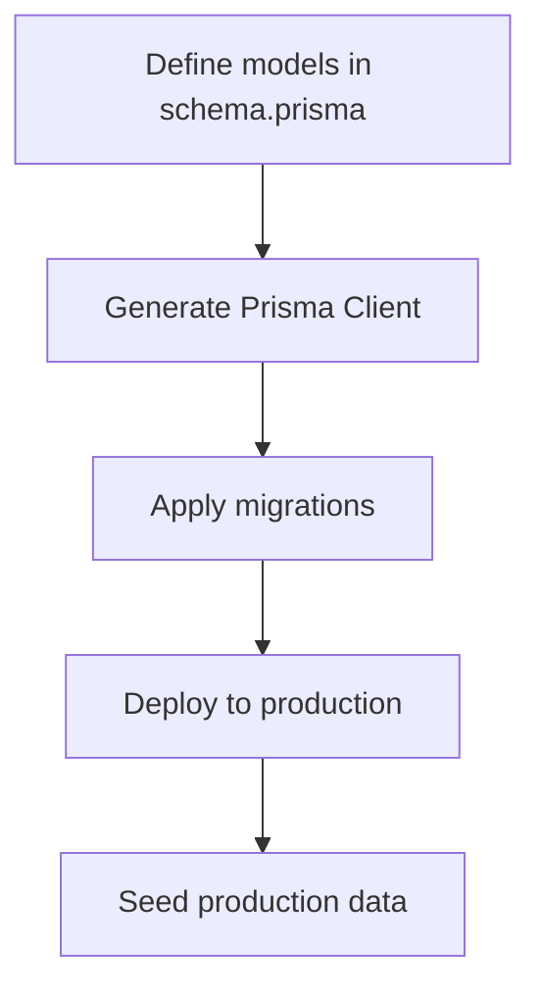
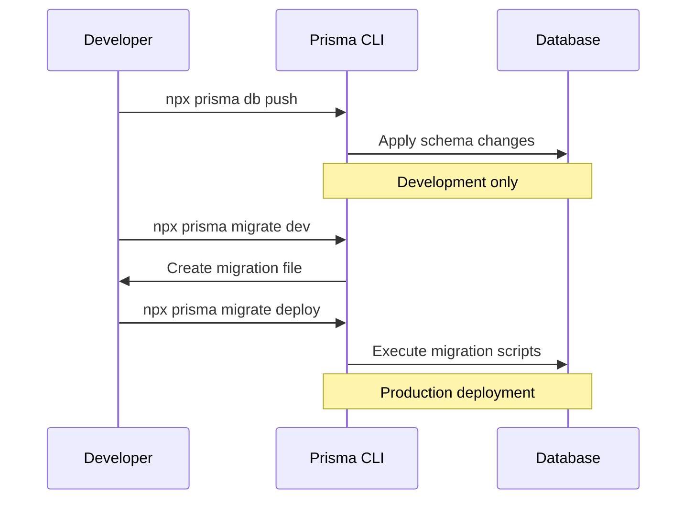
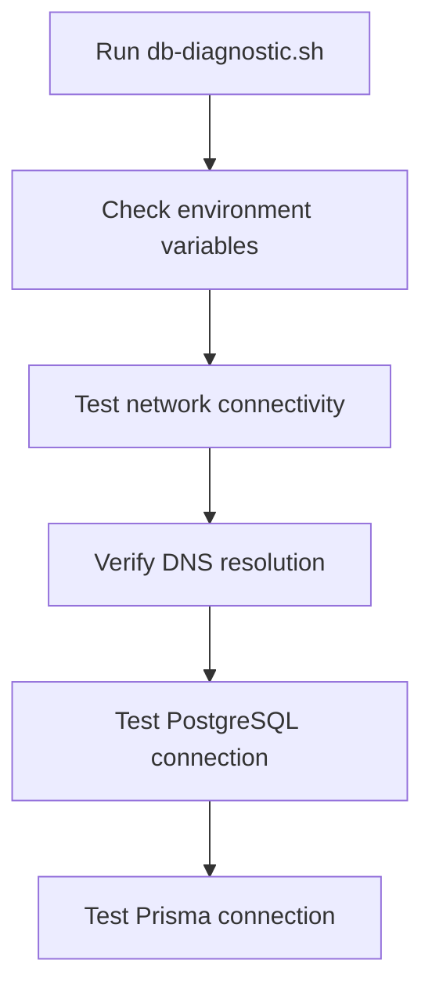
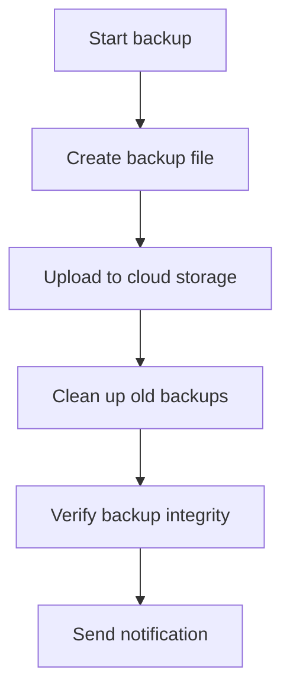

# Database Deployment and Migration

<cite>
**Referenced Files in This Document**   
- [prisma/schema.prisma](file://prisma/schema.prisma)
- [prisma/migrations](file://prisma/migrations)
- [prisma/seed-production.ts](file://prisma/seed-production.ts)
- [prisma/seed.ts](file://prisma/seed.ts)
- [src/lib/prisma.ts](file://src/lib/prisma.ts)
- [scripts/prisma-migrate-and-start.mjs](file://scripts/prisma-migrate-and-start.mjs)
- [scripts/db-diagnostic.sh](file://scripts/db-diagnostic.sh)
- [scripts/debug-migrations.sh](file://scripts/debug-migrations.sh)
- [scripts/backup-database.sh](file://scripts/backup-database.sh)
- [scripts/disaster-recovery.sh](file://scripts/disaster-recovery.sh)
</cite>

## Table of Contents
1. [Introduction](#introduction)
2. [Prisma ORM Workflow](#prisma-orm-workflow)
3. [Migration Strategy](#migration-strategy)
4. [Seeding Process](#seeding-process)
5. [Database Diagnostic and Debugging Scripts](#database-diagnostic-and-debugging-scripts)
6. [Migration Application Procedures](#migration-application-procedures)
7. [Best Practices](#best-practices)

## Introduction
This document provides a comprehensive overview of the database deployment and migration processes in the fund-track application. It details the use of Prisma ORM for schema management, migration generation, and deployment. The document covers both development and production scenarios, including seeding, diagnostics, and rollback procedures. The goal is to ensure data integrity, minimize downtime, and provide a reliable deployment pipeline.

## Prisma ORM Workflow

The fund-track application uses Prisma ORM to manage database schema and migrations. The workflow begins with defining the data models in the `schema.prisma` file, which serves as the single source of truth for the database structure.



**Diagram sources**
- [prisma/schema.prisma](file://prisma/schema.prisma)

**Section sources**
- [prisma/schema.prisma](file://prisma/schema.prisma)
- [src/lib/prisma.ts](file://src/lib/prisma.ts)

### Schema Definition
The `schema.prisma` file defines all data models, relations, and enums. It uses PostgreSQL as the database provider and includes mappings for database columns to ensure compatibility with existing naming conventions.

```prisma
model User {
  id           Int      @id @default(autoincrement())
  email        String   @unique
  passwordHash String   @map("password_hash")
  role         UserRole @default(USER)
  createdAt    DateTime @default(now()) @map("created_at")
  updatedAt    DateTime @updatedAt @map("updated_at")

  @@map("users")
}
```

### Prisma Client Initialization
The Prisma client is initialized in `src/lib/prisma.ts` with logging and error handling. It includes a health check utility to verify database connectivity.

```typescript
export const prisma =
  globalForPrisma.prisma ??
  new PrismaClient({
    log: process.env.NODE_ENV === 'development' ? ['query', 'error', 'warn'] : ['error'],
    errorFormat: 'pretty',
    datasources: isBuildTime ? undefined : {
      db: {
        url: process.env.DATABASE_URL
      }
    }
  });
```

## Migration Strategy

The migration strategy uses the `prisma/migrations` folder to store timestamped migration files. Each migration is a SQL script that modifies the database schema.

### Migration Folder Structure
The migrations folder contains subdirectories named with timestamps, each containing a `migration.sql` file.

```
prisma/migrations/
├── 20240101000000_init/
│   └── migration.sql
├── 20250728210021_initial_migration/
│   └── migration.sql
├── 20250730060039_add_lead_status_history/
│   └── migration.sql
└── migration_lock.toml
```

### Development Workflow
In development, developers use `prisma db push` to apply schema changes directly to the database without creating migration files.

```bash
npx prisma db push --accept-data-loss --skip-generate
```

### Production Workflow
In production, migrations are applied using `prisma migrate deploy`, which executes the migration scripts in order.

```bash
npx prisma migrate deploy
```



**Diagram sources**
- [prisma/schema.prisma](file://prisma/schema.prisma)
- [scripts/prisma-migrate-and-start.mjs](file://scripts/prisma-migrate-and-start.mjs)

**Section sources**
- [prisma/migrations](file://prisma/migrations)
- [scripts/prisma-migrate-and-start.mjs](file://scripts/prisma-migrate-and-start.mjs)

## Seeding Process

The seeding process populates the database with initial data. There are separate scripts for development and production environments.

### Development Seeding
The `prisma/seed.ts` script is used for development seeding. It creates sample users, leads, and related data.

```bash
npm run db:seed
```

The script includes safety checks to prevent accidental data deletion in production.

### Production Seeding
The `prisma/seed-production.ts` script creates an initial admin user in production. It requires explicit confirmation via environment variables.

```bash
FORCE_SEED=true npm run db:seed:prod
```

```typescript
if (!isProduction) {
  console.error('❌ This script is only for production environments.')
  process.exit(1)
}

if (!forceSeeding) {
  console.error('❌ Production seeding requires explicit confirmation.')
  process.exit(1)
}
```

**Section sources**
- [prisma/seed.ts](file://prisma/seed.ts)
- [prisma/seed-production.ts](file://prisma/seed-production.ts)

## Database Diagnostic and Debugging Scripts

The application includes several scripts for diagnosing and debugging database issues.

### Database Diagnostic Script
The `scripts/db-diagnostic.sh` script performs connectivity tests and verifies database access.

```bash
./scripts/db-diagnostic.sh
```

It checks:
- Environment variables
- Network connectivity
- DNS resolution
- PostgreSQL client connection
- Node.js/Prisma connection

### Migration Debugging Script
The `scripts/debug-migrations.sh` script provides detailed information about migration files and the Prisma setup.

```bash
./scripts/debug-migrations.sh
```

It displays:
- Directory structure
- Migration file details
- Prisma client generation status
- Database connection test



**Diagram sources**
- [scripts/db-diagnostic.sh](file://scripts/db-diagnostic.sh)
- [scripts/debug-migrations.sh](file://scripts/debug-migrations.sh)

**Section sources**
- [scripts/db-diagnostic.sh](file://scripts/db-diagnostic.sh)
- [scripts/debug-migrations.sh](file://scripts/debug-migrations.sh)

## Migration Application Procedures

### Applying Migrations in Different Environments
#### Development
```bash
npx prisma migrate dev --name <migration-name>
```

#### Production
```bash
npx prisma migrate deploy
```

### Handling Migration Failures
If a migration fails, the application logs the error and exits. The `prisma-migrate-and-start.mjs` script retries the migration with exponential backoff.

```javascript
for (let attempt = 1; attempt <= maxAttempts; attempt += 1) {
  try {
    await run("prisma", ["migrate", "deploy"]);
    break;
  } catch (error) {
    if (attempt >= maxAttempts) {
      process.exit(1);
    }
    await new Promise((r) => setTimeout(r, backoffMs));
  }
}
```

### Rollback Procedures
Prisma does not support automatic rollback. To rollback a migration:
1. Create a new migration that reverses the changes
2. Apply the rollback migration

```bash
npx prisma migrate dev --name rollback_<original-migration>
```

**Section sources**
- [scripts/prisma-migrate-and-start.mjs](file://scripts/prisma-migrate-and-start.mjs)

## Best Practices

### Zero-Downtime Deployments
- Use backward-compatible schema changes
- Deploy migrations before deploying application code
- Test migrations in a staging environment

### Data Integrity Checks
- Always backup the database before applying migrations
- Verify data integrity after migrations
- Use transactions for critical operations

### Backup Procedures
The `scripts/backup-database.sh` script creates automated backups of the PostgreSQL database.

```bash
./scripts/backup-database.sh
```

It includes:
- Backup file creation
- Cloud storage upload (optional)
- Old backup cleanup
- Backup integrity verification



**Diagram sources**
- [scripts/backup-database.sh](file://scripts/backup-database.sh)

**Section sources**
- [scripts/backup-database.sh](file://scripts/backup-database.sh)