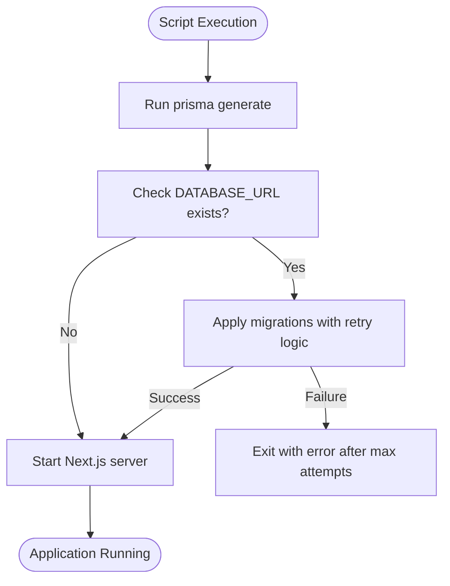
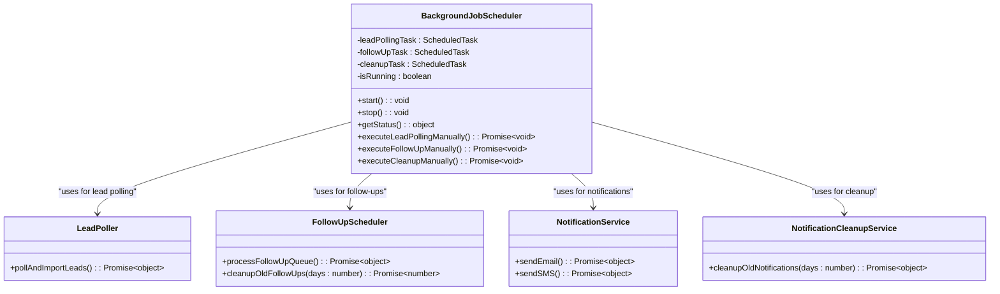
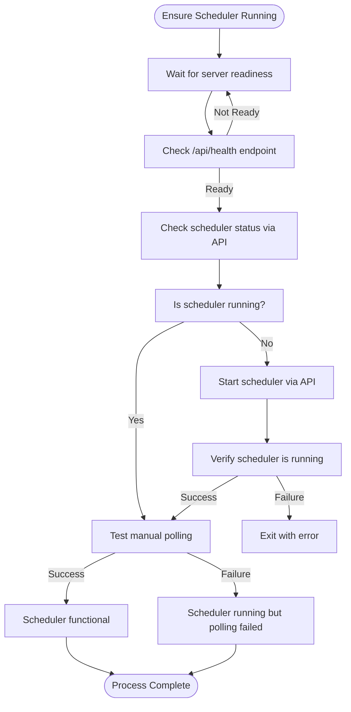
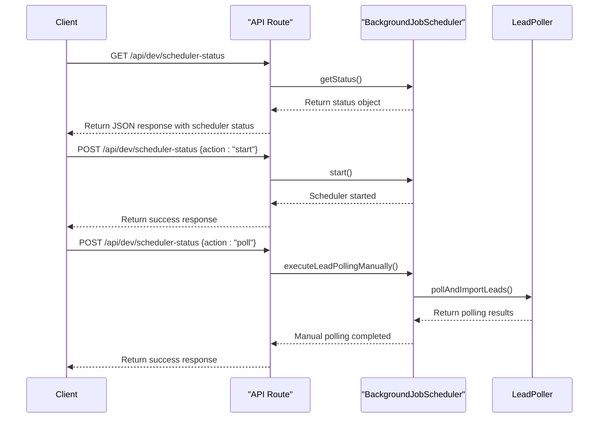
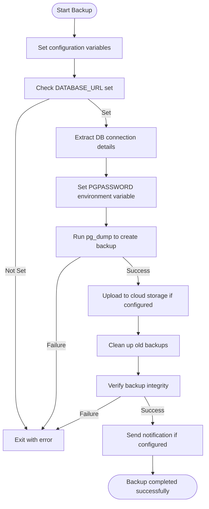
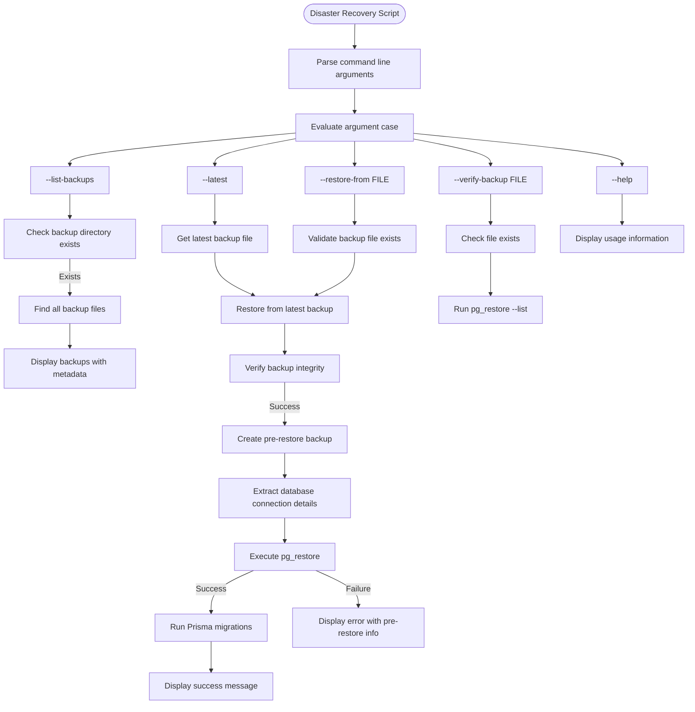

# Deployment Scripts and Automation

<cite>
**Referenced Files in This Document**   
- [prisma-migrate-and-start.mjs](file://scripts/prisma-migrate-and-start.mjs)
- [start-scheduler.mjs](file://scripts/start-scheduler.mjs)
- [check-scheduler.mjs](file://scripts/check-scheduler.mjs)
- [ensure-scheduler-running.sh](file://scripts/ensure-scheduler-running.sh)
- [force-start-scheduler.mjs](file://scripts/force-start-scheduler.mjs)
- [backup-database.sh](file://scripts/backup-database.sh)
- [disaster-recovery.sh](file://scripts/disaster-recovery.sh)
- [BackgroundJobScheduler.ts](file://src/services/BackgroundJobScheduler.ts)
- [scheduler-status/route.ts](file://src/app/api/dev/scheduler-status/route.ts)
</cite>

## Table of Contents
1. [Introduction](#introduction)
2. [Database Migration and Application Startup](#database-migration-and-application-startup)
3. [Scheduler Management and Monitoring](#scheduler-management-and-monitoring)
4. [Backup and Disaster Recovery](#backup-and-disaster-recovery)
5. [Usage Examples and Error Handling](#usage-examples-and-error-handling)
6. [Customization for Different Environments](#customization-for-different-environments)

## Introduction
This document provides comprehensive documentation for the deployment scripts and automation tools used in the fund-track application. It covers the orchestration of database synchronization with application startup, background job processing continuity, backup and disaster recovery procedures, and provides guidance on usage, error handling, and customization for different deployment environments.

## Database Migration and Application Startup

The `prisma-migrate-and-start.mjs` script orchestrates the database migration and application startup process. It ensures that the database schema is up-to-date before starting the Next.js application.

The script follows a three-step process:
1. Runs `prisma generate` to ensure the Prisma client is up-to-date
2. Applies database migrations using `prisma migrate deploy` with retry logic
3. Starts the Next.js application on the specified port

The migration process includes robust error handling and retry mechanisms. If the DATABASE_URL environment variable is not set, the script skips migrations and starts the server directly. When a database URL is provided, the script attempts to apply migrations with configurable maximum attempts and backoff intervals.



**Diagram sources**
- [prisma-migrate-and-start.mjs](file://scripts/prisma-migrate-and-start.mjs#L0-L89)

**Section sources**
- [prisma-migrate-and-start.mjs](file://scripts/prisma-migrate-and-start.mjs#L0-L89)

## Scheduler Management and Monitoring

### Background Job Scheduler Architecture
The background job processing system is managed by the `BackgroundJobScheduler` class, which coordinates three main tasks: lead polling, follow-up processing, and notification cleanup. The scheduler uses cron expressions to determine when each task should execute.



**Diagram sources**
- [BackgroundJobScheduler.ts](file://src/services/BackgroundJobScheduler.ts#L8-L458)

### Scheduler Control Scripts
The system provides multiple scripts for managing the background job scheduler:

- `start-scheduler.mjs`: Directly starts the scheduler by importing the BackgroundJobScheduler module
- `check-scheduler.mjs`: Checks the current status of the scheduler by making an API call
- `ensure-scheduler-running.sh`: Shell script that ensures the scheduler is running, with automatic startup if needed
- `force-start-scheduler.mjs`: Bypasses the web API to directly start the scheduler

The `ensure-scheduler-running.sh` script follows a comprehensive process to ensure scheduler continuity:



**Diagram sources**
- [ensure-scheduler-running.sh](file://scripts/ensure-scheduler-running.sh#L0-L92)
- [check-scheduler.mjs](file://scripts/check-scheduler.mjs#L0-L71)

### Scheduler Status API
The scheduler can be controlled and monitored through the `/api/dev/scheduler-status` endpoint, which supports both GET and POST requests:



**Diagram sources**
- [scheduler-status/route.ts](file://src/app/api/dev/scheduler-status/route.ts#L0-L82)

**Section sources**
- [start-scheduler.mjs](file://scripts/start-scheduler.mjs#L0-L57)
- [check-scheduler.mjs](file://scripts/check-scheduler.mjs#L0-L71)
- [ensure-scheduler-running.sh](file://scripts/ensure-scheduler-running.sh#L0-L92)
- [force-start-scheduler.mjs](file://scripts/force-start-scheduler.mjs#L0-L81)
- [BackgroundJobScheduler.ts](file://src/services/BackgroundJobScheduler.ts#L8-L458)
- [scheduler-status/route.ts](file://src/app/api/dev/scheduler-status/route.ts#L0-L82)

## Backup and Disaster Recovery

### Database Backup Process
The `backup-database.sh` script creates automated backups of the PostgreSQL database with comprehensive error handling and verification.



The backup process includes several key features:
- Automatic creation of backup directory if it doesn't exist
- Extraction of database connection details from DATABASE_URL
- Configurable retention policy (default: 30 days)
- Integrity verification using pg_restore
- Optional cloud storage upload (AWS S3 example provided)
- Email notifications for successful backups

**Section sources**
- [backup-database.sh](file://scripts/backup-database.sh#L0-L119)

### Disaster Recovery Process
The `disaster-recovery.sh` script provides comprehensive disaster recovery capabilities with multiple operational modes:



The disaster recovery process follows these key principles:
- Safety first: Creates a pre-restore backup before any restoration
- Verification: Validates backup integrity before restoration
- Comprehensive logging: All operations are logged to a recovery log file
- Post-restoration: Runs Prisma migrations to ensure schema is up-to-date
- Multiple operational modes: List, restore, verify, and help

**Section sources**
- [disaster-recovery.sh](file://scripts/disaster-recovery.sh#L0-L199)

## Usage Examples and Error Handling

### Script Usage Examples
**Database Migration and Startup:**
```bash
# Run with default settings
node scripts/prisma-migrate-and-start.mjs

# Override retry parameters
PRISMA_MIGRATE_MAX_ATTEMPTS=50 PRISMA_MIGRATE_BACKOFF_MS=1000 node scripts/prisma-migrate-and-start.mjs
```

**Scheduler Management:**
```bash
# Check scheduler status
node scripts/check-scheduler.mjs

# Start scheduler directly
node scripts/start-scheduler.mjs

# Ensure scheduler is running (for cron jobs)
bash scripts/ensure-scheduler-running.sh
```

**Backup and Recovery:**
```bash
# Create database backup
bash scripts/backup-database.sh

# List available backups
bash scripts/disaster-recovery.sh --list-backups

# Restore from latest backup
bash scripts/disaster-recovery.sh --latest

# Restore from specific backup
bash scripts/disaster-recovery.sh --restore-from ./backups/merchant_funding_backup_20240131_120000.sql

# Verify backup integrity
bash scripts/disaster-recovery.sh --verify-backup ./backups/merchant_funding_backup_20240131_120000.sql
```

### Error Handling Mechanisms
Each script implements comprehensive error handling:

**prisma-migrate-and-start.mjs:**
- Retry mechanism for database migrations with exponential backoff
- Graceful handling of missing DATABASE_URL
- Proper exit codes for different error conditions
- Detailed logging of all operations

**Scheduler scripts:**
- API error handling with appropriate HTTP status codes
- Network error handling for API calls
- Graceful shutdown on SIGINT and SIGTERM signals
- Comprehensive status reporting

**Backup and recovery scripts:**
- Early validation of required environment variables
- Step-by-step verification of each operation
- Creation of pre-restore backups for safety
- Integrity verification of both backups and restorations

### Logging Practices
All scripts implement consistent logging practices:
- Timestamped log entries
- Emoji indicators for different log levels (🚀, ✅, ❌, ⚠️, 🔍)
- Structured output for machine readability
- Comprehensive operational logging
- Error details with stack traces when appropriate

## Customization for Different Environments

### Environment Variables
The scripts can be customized through environment variables:

**Database Migration:**
- `PRISMA_MIGRATE_MAX_ATTEMPTS`: Maximum number of migration attempts (default: 30)
- `PRISMA_MIGRATE_BACKOFF_MS`: Milliseconds between migration attempts (default: 2000)
- `PORT`: Port for the Next.js application (default: 3000)

**Scheduler Configuration:**
- `ENABLE_BACKGROUND_JOBS`: Enable or disable background jobs (default: true)
- `LEAD_POLLING_CRON_PATTERN`: Cron pattern for lead polling (default: */15 * * * *)
- `FOLLOWUP_CRON_PATTERN`: Cron pattern for follow-up processing (default: */5 * * * *)
- `CLEANUP_CRON_PATTERN`: Cron pattern for cleanup jobs (default: 0 2 * * *)

**Backup and Recovery:**
- `BACKUP_DIR`: Directory for backup files (default: ./backups)
- `BACKUP_RETENTION_DAYS`: Number of days to retain backups (default: 30)
- `ENABLE_CLOUD_BACKUP`: Enable cloud backup upload (default: false)
- `BACKUP_STORAGE_BUCKET`: Cloud storage bucket name
- `ENABLE_BACKUP_NOTIFICATIONS`: Enable backup completion notifications
- `ADMIN_EMAIL`: Email address for notifications

### Infrastructure Configuration
The scripts can be adapted for different infrastructure configurations:

**Containerized Deployments:**
- Adjust localhost references to container service names
- Ensure proper network connectivity between containers
- Mount backup directories as persistent volumes
- Configure health checks appropriately

**Cloud Deployments:**
- Use cloud-specific backup storage (S3, GCS, etc.)
- Implement cloud-specific notification mechanisms
- Configure appropriate IAM roles and permissions
- Adjust timeout values for network operations

**On-Premise Deployments:**
- Configure local backup storage paths
- Implement local notification mechanisms
- Adjust resource limits based on available hardware
- Configure firewall rules for inter-service communication

The scripts are designed to be flexible and adaptable to various deployment scenarios while maintaining consistent behavior and reliability.