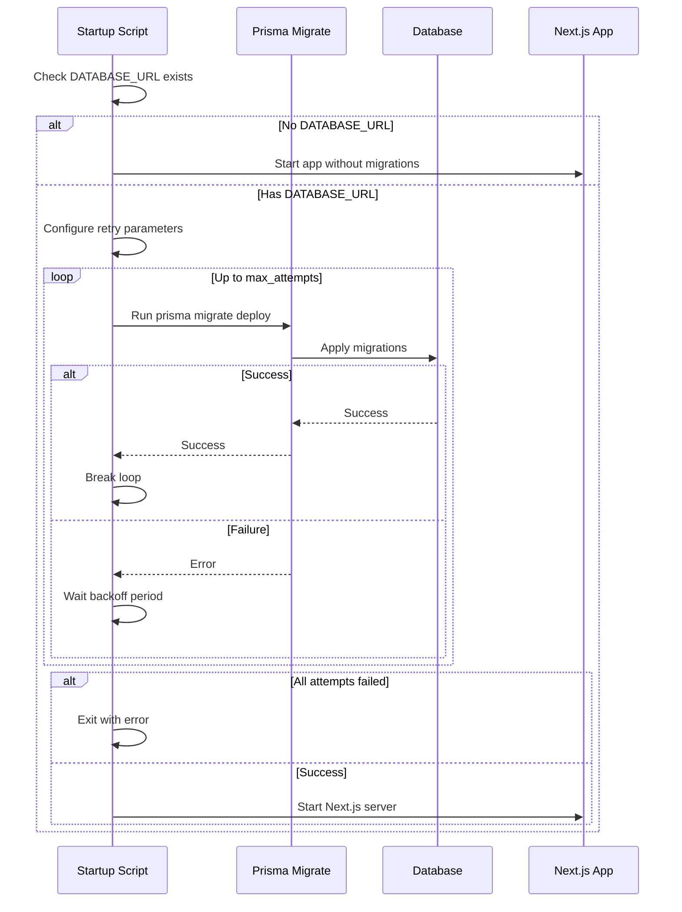
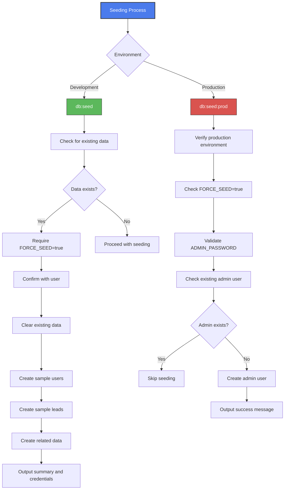
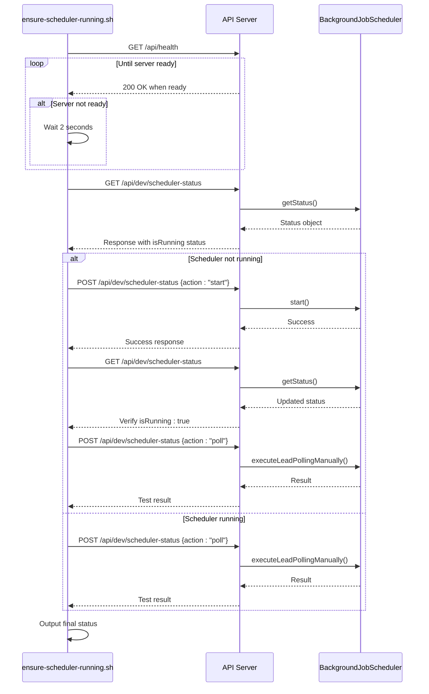
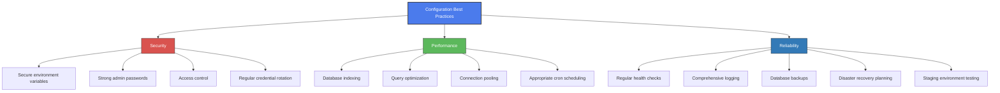

# Deployment and Configuration

<cite>
**Referenced Files in This Document**   
- [package.json](file://package.json)
- [prisma-migrate-and-start.mjs](file://scripts/prisma-migrate-and-start.mjs)
- [start-scheduler.mjs](file://scripts/start-scheduler.mjs)
- [ensure-scheduler-running.sh](file://scripts/ensure-scheduler-running.sh)
- [seed.ts](file://prisma/seed.ts)
- [seed-production.ts](file://prisma/seed-production.ts)
- [prisma.ts](file://src/lib/prisma.ts)
- [BackgroundJobScheduler.ts](file://src/services/BackgroundJobScheduler.ts)
- [logger.ts](file://src/lib/logger.ts)
- [auth.ts](file://src/lib/auth.ts)
</cite>

## Table of Contents
1. [Environment Variables and Configuration](#environment-variables-and-configuration)
2. [Configuration Across Environments](#configuration-across-environments)
3. [Database Migration Strategy](#database-migration-strategy)
4. [Data Seeding Procedures](#data-seeding-procedures)
5. [Service Initialization and Scheduler Management](#service-initialization-and-scheduler-management)
6. [Deployment Process and Scripts](#deployment-process-and-scripts)
7. [Configuration Best Practices](#configuration-best-practices)
8. [Scaling and Infrastructure Requirements](#scaling-and-infrastructure-requirements)

## Environment Variables and Configuration

The fund-track application relies on environment variables for configuration across different deployment environments. These variables control database connections, external service integrations, application behavior, and security settings.

### Core Environment Variables

**Application Settings**
- `NODE_ENV`: Specifies the environment (development, production, test)
- `PORT`: Server port (default: 3000)
- `NEXT_PUBLIC_BASE_URL`: Base URL for frontend links and notifications
- `SKIP_ENV_VALIDATION`: Skips environment validation during build (used in CI/CD)

**Database Configuration**
- `DATABASE_URL`: Connection string for PostgreSQL database
- `PRISMA_MIGRATE_MAX_ATTEMPTS`: Maximum attempts for database migration (default: 30)
- `PRISMA_MIGRATE_BACKOFF_MS`: Delay between migration attempts in milliseconds (default: 2000)

**Scheduler Configuration**
- `ENABLE_BACKGROUND_JOBS`: Enables background job scheduler when set to "true"
- `LEAD_POLLING_CRON_PATTERN`: Cron pattern for lead polling (default: "*/15 * * * *")
- `FOLLOWUP_CRON_PATTERN`: Cron pattern for follow-up processing (default: "*/5 * * * *")
- `CLEANUP_CRON_PATTERN`: Cron pattern for cleanup jobs (default: "0 2 * * *")
- `TZ`: Timezone for cron jobs (default: "America/New_York")

**External Service Integrations**
- `MAILGUN_API_KEY`: API key for Mailgun email service
- `MAILGUN_DOMAIN`: Domain configured in Mailgun
- `MAILGUN_FROM_EMAIL`: Default sender email address
- `TWILIO_ACCOUNT_SID`: Account SID for Twilio SMS service
- `TWILIO_AUTH_TOKEN`: Authentication token for Twilio
- `TWILIO_PHONE_NUMBER`: Sender phone number for SMS
- `B2_APPLICATION_KEY_ID`: Backblaze B2 storage application key ID
- `B2_APPLICATION_KEY`: Backblaze B2 storage application key

**Security and Authentication**
- `NEXTAUTH_SECRET`: Secret key for NextAuth.js session encryption
- `ADMIN_EMAIL`: Email for admin user in production seeding
- `ADMIN_PASSWORD`: Password for admin user in production seeding

**Logging Configuration**
- `LOG_LEVEL`: Minimum log level (error, warn, info, http, debug)

**Section sources**
- [prisma-migrate-and-start.mjs](file://scripts/prisma-migrate-and-start.mjs#L15-L30)
- [BackgroundJobScheduler.ts](file://src/services/BackgroundJobScheduler.ts#L25-L40)
- [logger.ts](file://src/lib/logger.ts#L25-L40)
- [auth.ts](file://src/lib/auth.ts#L10-L15)

## Configuration Across Environments

The application implements different configuration strategies for development, testing, and production environments to balance convenience, safety, and security.

### Development Environment

In development (`NODE_ENV=development`), the application prioritizes developer convenience and debugging capabilities:

- **Database**: Migrations are applied using `prisma migrate dev`, which can modify the database schema and reset data
- **Logging**: Full query logging is enabled for debugging database operations
- **Scheduler**: Background jobs can be enabled with `ENABLE_BACKGROUND_JOBS=true`, but are disabled by default
- **Authentication**: Uses development credentials with known passwords
- **Seeding**: Full database seeding with sample data using `npm run db:seed`

The development environment allows for rapid iteration and schema changes, with Prisma's dev migration workflow that can roll back and modify migrations during development.

### Testing Environment

The testing environment shares similarities with development but includes additional validation:

- **Database**: Uses the same migration approach as development
- **Environment Validation**: The `test-mailgun.ts` script validates required environment variables before running tests
- **Isolation**: Tests should use isolated database instances to prevent interference with development data

### Production Environment

Production configuration prioritizes stability, security, and data integrity:

- **Database**: Migrations are applied with `prisma migrate deploy`, which only applies already-committed migration files
- **Safety Checks**: Seeding scripts include production safety checks that require explicit confirmation
- **Credentials**: Admin credentials must be provided via environment variables, not hardcoded
- **Logging**: Only error-level logs are recorded by default to minimize log volume
- **Scheduler**: Background jobs are automatically started in production environments

The production environment prevents accidental data loss by requiring explicit confirmation for destructive operations like database seeding.

```mermaid
flowchart TD
A["Environment Configuration"] --> B["Development"]
A --> C["Testing"]
A --> D["Production"]
B --> B1["NODE_ENV=development"]
B --> B2["Full query logging"]
B --> B3["Flexible migrations"]
B --> B4["Sample data seeding"]
B --> B5["DISABLED background jobs by default"]
C --> C1["NODE_ENV=test"]
C --> C2["Environment validation"]
C --> C3["Isolated database"]
C --> C4["Test-specific configurations"]
D --> D1["NODE_ENV=production"]
D --> D2["Error-only logging"]
D --> D3["Immutable migrations"]
D --> D4["Protected seeding"]
D --> D5["ENABLED background jobs"]
D --> D6["External credential management"]
style A fill:#4B7BEC,stroke:#333,stroke-width:2px,color:white
style B fill:#5CB85C,stroke:#333,stroke-width:1px,color:white
style C fill:#F0AD4E,stroke:#333,stroke-width:1px,color:white
style D fill:#D9534F,stroke:#333,stroke-width:1px,color:white
```



**Diagram sources**
- [prisma-migrate-and-start.mjs](file://scripts/prisma-migrate-and-start.mjs#L15-L89)
- [seed.ts](file://prisma/seed.ts#L10-L50)
- [seed-production.ts](file://prisma/seed-production.ts#L10-L50)

**Section sources**
- [package.json](file://package.json#L10-L20)
- [prisma-migrate-and-start.mjs](file://scripts/prisma-migrate-and-start.mjs#L15-L89)
- [seed.ts](file://prisma/seed.ts#L10-L50)
- [seed-production.ts](file://prisma/seed-production.ts#L10-L50)

## Database Migration Strategy

The application implements a robust database migration strategy using Prisma Migrate, with different approaches for development and production environments.

### Development Migration Process

During development, the team uses Prisma's dev migration workflow:

```bash
npm run db:migrate
```

This command executes `prisma migrate dev`, which:
- Creates a new migration file if the Prisma schema has changed
- Applies pending migrations to the database
- Can reset the database if there are conflicts
- Generates the Prisma Client with updated types

Developers can create migrations with descriptive names and include SQL files that define the exact database changes.

### Production Migration Process

For production deployments, the application uses a safer migration approach:

```bash
npm run db:migrate:prod
```

This command executes `prisma migrate deploy`, which:
- Only applies already-committed migration files
- Does not create new migrations or modify existing ones
- Ensures that all migrations have been tested in staging environments
- Provides a predictable and auditable migration process

### Migration Execution in Deployment

The primary deployment script `prisma-migrate-and-start.mjs` implements a resilient migration strategy:



**Diagram sources**
- [prisma-migrate-and-start.mjs](file://scripts/prisma-migrate-and-start.mjs#L15-L89)

**Section sources**
- [package.json](file://package.json#L15-L20)
- [prisma-migrate-and-start.mjs](file://scripts/prisma-migrate-and-start.mjs#L15-L89)

## Data Seeding Procedures

The application provides multiple seeding scripts for different deployment scenarios, each with appropriate safety checks.

### Development Seeding

The primary seeding script `prisma/seed.ts` populates the database with comprehensive sample data for development:

```bash
npm run db:seed
```

This script creates:
- Sample users (admin, regular user, sales user)
- Sample leads in various statuses (new, pending, in progress, completed, rejected)
- Lead notes, documents, follow-up queue entries, and notification logs
- System settings with default values

The script includes safety checks to prevent accidental data loss:
- Prevents seeding in production without explicit confirmation
- Prevents seeding if data already exists without force flag
- Requires `FORCE_SEED=true` to overwrite existing data

When forced, the script clears existing data in the correct order to respect foreign key constraints before creating new data.

### Production Seeding

The production seeding script `prisma/seed-production.ts` follows the principle of least privilege:

```bash
FORCE_SEED=true npm run db:seed:prod
```

This script only creates an essential admin user, with the following safeguards:
- Only runs in production environment
- Requires explicit `FORCE_SEED=true` flag
- Requires `ADMIN_PASSWORD` environment variable (prevents default passwords)
- Checks if admin user already exists and skips if present

This minimal approach ensures that production databases have a way to create an initial admin user while minimizing the risk of accidental data manipulation.

### Simple Seeding

The application also includes a simple seeding script `prisma/seed-simple.ts` for specific testing scenarios that require minimal data.



**Diagram sources**
- [seed.ts](file://prisma/seed.ts#L10-L510)
- [seed-production.ts](file://prisma/seed-production.ts#L10-L71)

**Section sources**
- [seed.ts](file://prisma/seed.ts#L10-L510)
- [seed-production.ts](file://prisma/seed-production.ts#L10-L71)
- [package.json](file://package.json#L20-L30)

## Service Initialization and Scheduler Management

The application implements a comprehensive service initialization process with special attention to the background job scheduler, which handles critical automated tasks.

### Application Initialization

The server initialization process begins with the `prisma-migrate-and-start.mjs` script, which:
1. Generates the Prisma Client (idempotent operation)
2. Applies database migrations with retry logic
3. Starts the Next.js server on the specified port

During application startup, the `initializeServer()` function in `server-init.ts` configures essential services:
- Validates notification service configuration
- Starts the background job scheduler based on environment conditions
- Sets up logging with appropriate levels

### Background Job Scheduler

The `BackgroundJobScheduler` class manages three primary cron jobs:

1. **Lead Polling**: Runs every 15 minutes (configurable) to import new leads from external sources
2. **Follow-up Processing**: Runs every 5 minutes (configurable) to send automated follow-up communications
3. **Cleanup Operations**: Runs daily at 2 AM to remove old notification logs and follow-up records

The scheduler is designed with resilience in mind:
- Each job wraps its execution in try-catch blocks to prevent crashes
- Failed jobs are logged to both console and database for monitoring
- The scheduler can be manually started, stopped, or queried for status

### Scheduler Startup and Monitoring

The application provides multiple mechanisms to ensure the scheduler is running:

**Manual Startup**
```bash
node scripts/start-scheduler.mjs
```

This script starts the scheduler and outputs its status, including the next scheduled execution times for each job.

**Automated Monitoring**
```bash
scripts/ensure-scheduler-running.sh
```

This shell script:
1. Waits for the main application server to become ready
2. Checks the scheduler status via API endpoint
3. Starts the scheduler if it's not running
4. Tests manual polling to verify functionality

The script is designed to be run as a cron job or startup script in production environments to ensure scheduler reliability.



**Diagram sources**
- [ensure-scheduler-running.sh](file://scripts/ensure-scheduler-running.sh#L1-L92)
- [start-scheduler.mjs](file://scripts/start-scheduler.mjs#L1-L57)
- [BackgroundJobScheduler.ts](file://src/services/BackgroundJobScheduler.ts#L1-L462)

**Section sources**
- [ensure-scheduler-running.sh](file://scripts/ensure-scheduler-running.sh#L1-L92)
- [start-scheduler.mjs](file://scripts/start-scheduler.mjs#L1-L57)
- [BackgroundJobScheduler.ts](file://src/services/BackgroundJobScheduler.ts#L1-L462)

## Deployment Process and Scripts

The deployment process for the fund-track application is designed for reliability and ease of use in containerized environments like Coolify.

### Primary Deployment Script

The main deployment script `prisma-migrate-and-start.mjs` serves as the entry point for production deployments:

```javascript
// Waits for database to be reachable by retrying migrations
for (let attempt = 1; attempt <= maxAttempts; attempt += 1) {
  try {
    await run("prisma", ["migrate", "deploy"]);
    break;
  } catch (error) {
    if (attempt >= maxAttempts) {
      process.exit(1);
    }
    await new Promise((r) => setTimeout(r, backoffMs));
  }
}
```

This script implements a robust pattern for cloud deployments where the database might not be immediately available when the application container starts.

### Supporting Scripts

The application includes several specialized scripts for different deployment scenarios:

**Database Operations**
- `backup-database.sh`: Placeholder script (backups handled by Coolify)
- `db-diagnostic.sh`: Database connectivity and health diagnostics
- `debug-migrations.sh`: Tools for troubleshooting migration issues
- `disaster-recovery.sh`: Procedures for recovering from database failures

**Testing and Validation**
- `test-intake-completion.mjs`: Tests the intake completion workflow
- `test-lead-polling.mjs`: Tests the lead polling functionality
- `test-legacy-db.mjs`: Tests connectivity to the legacy database
- `test-notifications.mjs`: Tests email and SMS notification delivery

**Health Monitoring**
- `health-check.sh`: Simple health check that verifies the API endpoint
- `check-scheduler.mjs`: Checks the status of the background job scheduler
- `emergency-cleanup.mjs`: Emergency cleanup procedures

### Deployment Workflow

The complete deployment workflow involves the following steps:

1. **Build Phase**: Next.js application is built with `npm run build`
2. **Migration Phase**: Database migrations are applied with retry logic
3. **Startup Phase**: Next.js server starts on the specified port
4. **Scheduler Initialization**: Background job scheduler starts automatically in production
5. **Health Monitoring**: Health checks verify application and scheduler status

The process is designed to be idempotent and resilient to temporary failures, particularly in the migration phase where database connectivity might be delayed.

**Section sources**
- [prisma-migrate-and-start.mjs](file://scripts/prisma-migrate-and-start.mjs#L1-L89)
- [package.json](file://package.json#L10-L30)
- [scripts/*.sh](file://scripts/)
- [scripts/*.mjs](file://scripts/)

## Configuration Best Practices

To ensure security, performance, and reliability in production deployments, follow these configuration best practices.

### Security Best Practices

**Environment Variables Management**
- Never commit `.env` files to version control
- Use environment-specific variable management in deployment platforms
- Rotate credentials regularly, especially for external services
- Use strong, randomly generated values for `NEXTAUTH_SECRET`

**Production Seeding**
- Always set `ADMIN_PASSWORD` to a strong, unique value
- Change the admin password after the initial login
- Do not use the development seeding script in production

**Access Control**
- Restrict access to admin endpoints to authorized personnel only
- Monitor authentication logs for suspicious activity
- Implement multi-factor authentication for admin accounts when possible

### Performance Best Practices

**Database Optimization**
- Ensure proper indexing on frequently queried fields
- Monitor query performance and optimize slow queries
- Use connection pooling for database connections
- Schedule heavy operations during off-peak hours

**Scheduler Configuration**
- Adjust cron patterns based on actual workload requirements
- Monitor job execution times and adjust frequency accordingly
- Consider staggering job schedules to avoid resource contention

**Caching Strategy**
- Implement caching for frequently accessed but infrequently changing data
- Use appropriate cache expiration times
- Monitor cache hit rates and adjust strategy as needed

### Reliability Best Practices

**Health Monitoring**
- Implement regular health checks for both application and scheduler
- Set up alerts for failed health checks
- Monitor error logs for recurring issues

**Backup and Recovery**
- Ensure regular database backups are performed
- Test backup restoration procedures periodically
- Document disaster recovery procedures

**Deployment Safety**
- Always test migrations on a staging environment before production
- Use immutable infrastructure patterns when possible
- Implement blue-green or canary deployments for zero-downtime updates



**Diagram sources**
- [prisma.ts](file://src/lib/prisma.ts#L1-L60)
- [logger.ts](file://src/lib/logger.ts#L1-L350)
- [BackgroundJobScheduler.ts](file://src/services/BackgroundJobScheduler.ts#L1-L462)

**Section sources**
- [prisma.ts](file://src/lib/prisma.ts#L1-L60)
- [logger.ts](file://src/lib/logger.ts#L1-L350)
- [BackgroundJobScheduler.ts](file://src/services/BackgroundJobScheduler.ts#L1-L462)
- [auth.ts](file://src/lib/auth.ts#L1-L70)

## Scaling and Infrastructure Requirements

To ensure optimal performance and reliability in production, consider the following scaling and infrastructure requirements.

### Infrastructure Requirements

**Minimum Requirements**
- **Node.js**: Version 22.x (as specified in package.json engines)
- **Database**: PostgreSQL 12+ with sufficient storage for application data
- **Memory**: At least 1GB RAM for the application container
- **Storage**: Adequate disk space for logs and temporary files

**Recommended Production Configuration**
- **Compute**: 2+ CPU cores for handling concurrent requests and background jobs
- **Memory**: 2GB+ RAM to accommodate Node.js heap and caching
- **Database**: Dedicated instance with regular backups and monitoring
- **Network**: Stable connectivity to external services (Mailgun, Twilio, Backblaze B2)

### Scaling Considerations

**Vertical Scaling**
- Increase CPU and memory resources as user load grows
- Monitor application performance and scale before reaching capacity limits
- Consider the memory requirements of Node.js applications, which can grow with heap size

**Horizontal Scaling**
- The application can be deployed across multiple instances behind a load balancer
- Ensure session affinity or shared session storage when using multiple instances
- Coordinate background job execution to avoid duplicate processing

**Database Scaling**
- Monitor database performance and scale accordingly
- Consider read replicas for reporting and analytics queries
- Implement connection pooling to manage database connections efficiently

### External Service Dependencies

The application depends on several external services that should be considered in the infrastructure planning:

**Email Service (Mailgun)**
- Ensure sufficient sending limits for expected email volume
- Configure proper DNS records for domain verification
- Monitor delivery rates and spam complaints

**SMS Service (Twilio)**
- Verify phone numbers and configure messaging service
- Monitor message delivery and costs
- Implement rate limiting to prevent abuse

**File Storage (Backblaze B2)**
- Configure appropriate bucket permissions
- Monitor storage usage and costs
- Implement lifecycle rules for automatic cleanup of temporary files

**Monitoring and Alerting**
- Implement comprehensive monitoring for application health
- Set up alerts for critical failures (database connectivity, scheduler downtime)
- Monitor resource utilization (CPU, memory, disk, network)

The application is designed to run in containerized environments like Coolify, which handle many infrastructure concerns such as backups, scaling, and high availability.

**Section sources**
- [package.json](file://package.json#L60-L70)
- [prisma-migrate-and-start.mjs](file://scripts/prisma-migrate-and-start.mjs#L1-L89)
- [BackgroundJobScheduler.ts](file://src/services/BackgroundJobScheduler.ts#L1-L462)
- [logger.ts](file://src/lib/logger.ts#L1-L350)