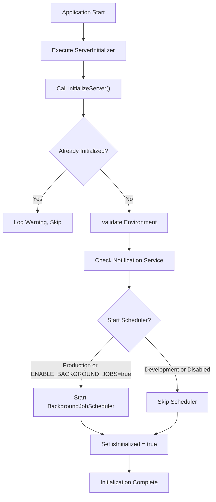
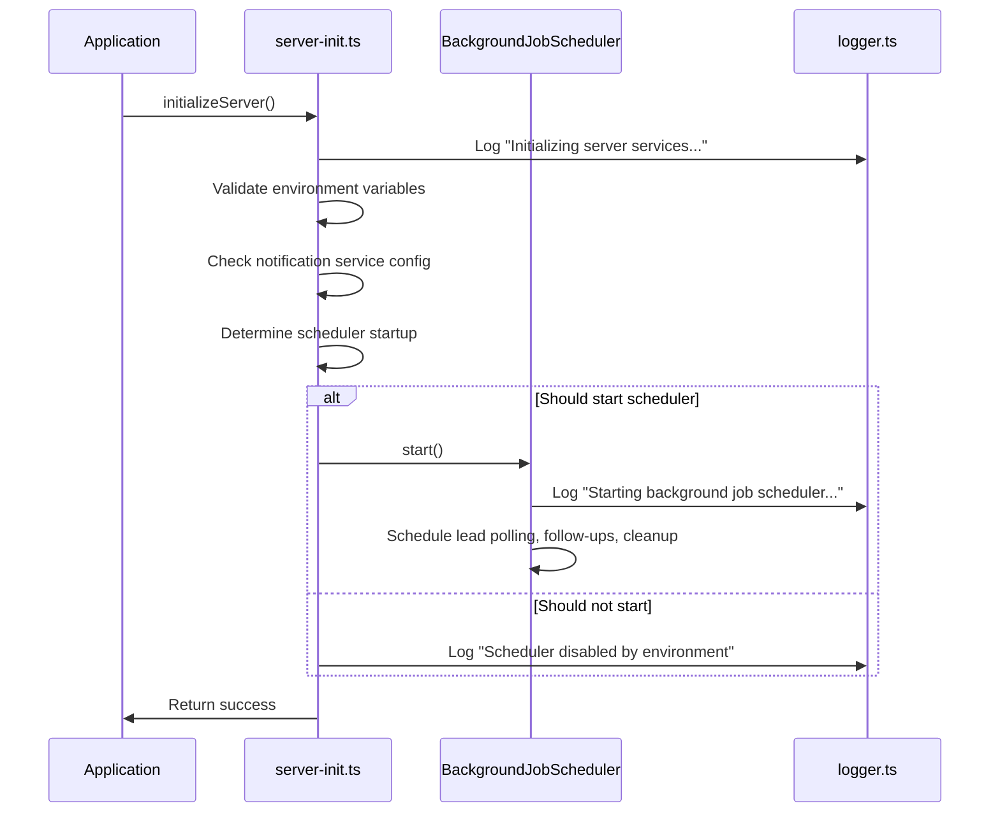
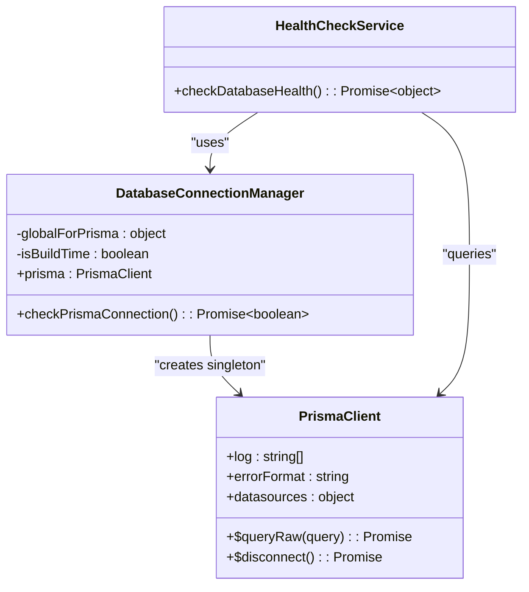
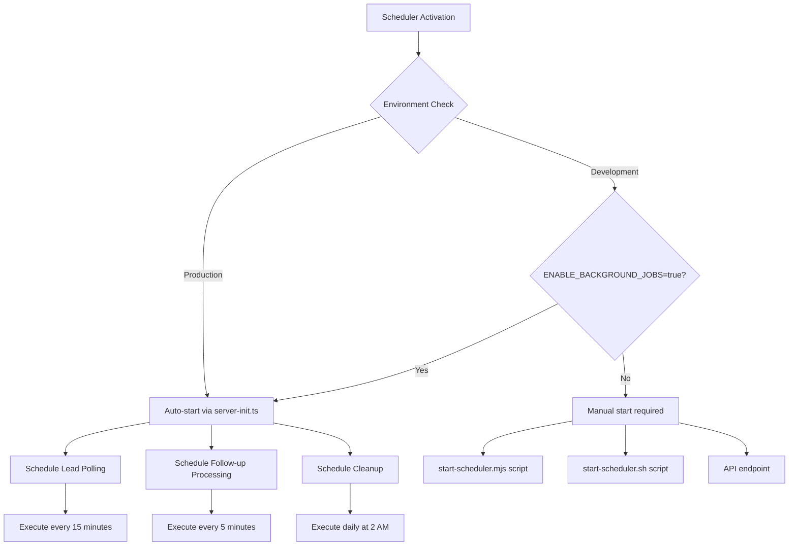
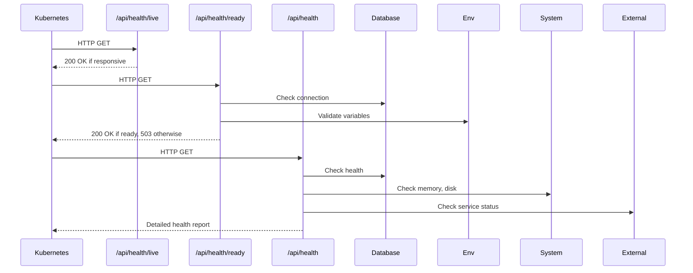

# Production Initialization and Service Startup

<cite>
**Referenced Files in This Document**   
- [server-init.ts](file://src/lib/server-init.ts)
- [BackgroundJobScheduler.ts](file://src/services/BackgroundJobScheduler.ts)
- [start-scheduler.mjs](file://scripts/start-scheduler.mjs)
- [start-scheduler.sh](file://scripts/start-scheduler.sh)
- [live/route.ts](file://src/app/api/health/live/route.ts)
- [ready/route.ts](file://src/app/api/health/ready/route.ts)
- [route.ts](file://src/app/api/health/route.ts)
- [prisma.ts](file://src/lib/prisma.ts)
- [logger.ts](file://src/lib/logger.ts)
- [legacy-db.ts](file://src/lib/legacy-db.ts)
</cite>

## Table of Contents
1. [Application Startup Sequence](#application-startup-sequence)
2. [Middleware and Service Initialization](#middleware-and-service-initialization)
3. [Database Connection Pooling](#database-connection-pooling)
4. [Background Service Activation](#background-service-activation)
5. [Health Check Endpoints](#health-check-endpoints)
6. [Configuration Settings for Production](#configuration-settings-for-production)
7. [Troubleshooting Common Startup Issues](#troubleshooting-common-startup-issues)

## Application Startup Sequence

The fund-track application follows a structured startup sequence that ensures all critical services are properly initialized before the application becomes available. The process begins with the execution of the `ServerInitializer` component, which triggers the `initializeServer()` function from the `server-init.ts` module. This function serves as the central orchestrator for the application's initialization process.

The startup sequence follows these key steps:
1. Environment validation and logging setup
2. Notification service configuration validation
3. Background job scheduler initialization decision
4. Scheduler startup based on environment conditions
5. Graceful error handling to prevent server crashes

The initialization process is designed to be idempotent, meaning it can be safely called multiple times without causing unintended side effects. This is achieved through the `isInitialized` flag that prevents duplicate initialization.



**Diagram sources**
- [server-init.ts](file://src/lib/server-init.ts#L15-L178)

**Section sources**
- [server-init.ts](file://src/lib/server-init.ts#L15-L178)
- [ServerInitializer.tsx](file://src/components/ServerInitializer.tsx#L0-L18)

## Middleware and Service Initialization

The middleware and service initialization process is centered around the `server-init.ts` file, which coordinates the setup of various application services. The initialization process includes several key components:

### Notification Service Validation
The system validates the notification service configuration during startup to ensure that email and SMS services can function properly. If the configuration is invalid, the system logs a warning but continues operation, allowing the application to run with limited functionality.

### Background Job Scheduler
The background job scheduler is conditionally started based on the environment configuration. The decision logic uses two factors:
- `NODE_ENV` value (starts automatically in production)
- `ENABLE_BACKGROUND_JOBS` flag (allows manual enablement in development)

The initialization process includes comprehensive logging to provide visibility into the startup decisions and their rationale.

### Signal Handling
The system implements proper signal handling for graceful shutdowns. It listens for `SIGTERM` and `SIGINT` signals, which trigger the `cleanupServer()` function to properly stop the background job scheduler and release resources before the process exits.



**Diagram sources**
- [server-init.ts](file://src/lib/server-init.ts#L15-L178)
- [BackgroundJobScheduler.ts](file://src/services/BackgroundJobScheduler.ts#L0-L463)

**Section sources**
- [server-init.ts](file://src/lib/server-init.ts#L15-L178)

## Database Connection Pooling

The application uses Prisma as its database client, with connection pooling configured through the PrismaClient instance. The database connection strategy is designed to handle different environments appropriately:

### Connection Management
The `prisma.ts` file implements a global singleton pattern to prevent multiple instances of PrismaClient in development environments, which could lead to memory leaks. The connection logic includes:

- **Build-time detection**: The system checks for build environment indicators and skips database connection during builds
- **Global instance**: Uses a global variable to store the PrismaClient instance, preventing multiple instances in development
- **Environment-aware configuration**: Adjusts logging levels based on NODE_ENV

### Connection Configuration
The database connection is configured with the following parameters:
- **Logging**: Query, error, and warning logs in development; only error logs in production
- **Error format**: Pretty formatting for easier debugging
- **Datasource**: Configured only when not in build time or browser environment

### Health Monitoring
The system includes a `checkPrismaConnection()` function that performs a simple query (`SELECT 1`) to verify database connectivity. This function is used by health check endpoints to determine database availability.



**Diagram sources**
- [prisma.ts](file://src/lib/prisma.ts#L0-L61)

**Section sources**
- [prisma.ts](file://src/lib/prisma.ts#L0-L61)
- [database-error-handler.ts](file://src/lib/database-error-handler.ts)

## Background Service Activation

The background service activation process is managed by the `BackgroundJobScheduler` class, which orchestrates three primary background tasks: lead polling, follow-up notifications, and periodic cleanup.

### Scheduler Architecture
The `BackgroundJobScheduler` class uses the `node-cron` library to schedule recurring tasks with the following configuration:

| Job Type | Cron Pattern | Default Schedule | Purpose |
|---------|------------|----------------|--------|
| Lead Polling | `*/15 * * * *` | Every 15 minutes | Import new leads from external sources |
| Follow-up Processing | `*/5 * * * *` | Every 5 minutes | Send follow-up notifications to applicants |
| Notification Cleanup | `0 2 * * *` | Daily at 2:00 AM | Remove old notification records |

### Startup Scripts
The system provides multiple ways to start and monitor the background scheduler:

1. **Node.js script** (`start-scheduler.mjs`): Directly imports and starts the scheduler instance
2. **Shell script** (`start-scheduler.sh`): Uses API endpoints to start the scheduler, allowing control without direct module access

The shell script version includes additional functionality:
- Server availability check before attempting to start
- Current status verification before taking action
- Post-start verification and testing

### Manual Control
The system supports manual intervention through API endpoints and direct function calls, enabling operators to:
- Start/stop the scheduler
- Trigger lead polling manually
- Process follow-ups on demand
- Execute cleanup jobs



**Diagram sources**
- [BackgroundJobScheduler.ts](file://src/services/BackgroundJobScheduler.ts#L0-L463)
- [start-scheduler.mjs](file://scripts/start-scheduler.mjs#L0-L58)
- [start-scheduler.sh](file://scripts/start-scheduler.sh#L0-L56)

**Section sources**
- [BackgroundJobScheduler.ts](file://src/services/BackgroundJobScheduler.ts#L0-L463)
- [start-scheduler.mjs](file://scripts/start-scheduler.mjs#L0-L58)
- [start-scheduler.sh](file://scripts/start-scheduler.sh#L0-L56)

## Health Check Endpoints

The application implements three health check endpoints that serve different purposes in container orchestration and monitoring:

### Liveness Probe
The liveness endpoint (`/api/health/live`) determines whether the application is running and should be restarted if failing. It performs the most basic check - if the application can respond to an HTTP request, it is considered alive.

**Endpoint**: `GET /api/health/live`
```json
{
  "status": "alive",
  "timestamp": "2025-08-26T10:30:00.000Z",
  "uptime": 3600,
  "pid": 12345
}
```

### Readiness Probe
The readiness endpoint (`/api/health/ready`) determines whether the application is ready to receive traffic. It performs more comprehensive checks:

1. Database connectivity verification
2. Required environment variables validation
3. Essential service availability

**Endpoint**: `GET /api/health/ready`
```json
{
  "status": "ready",
  "timestamp": "2025-08-26T10:30:00.000Z"
}
```

### Comprehensive Health Check
The main health endpoint (`/api/health`) provides detailed system status information for monitoring and diagnostics, including:

- Database health and latency
- Memory usage statistics
- Disk space utilization
- External service status (Twilio, Mailgun, Backblaze)
- System environment information

This endpoint returns a detailed JSON response with status codes that reflect the overall system health.



**Diagram sources**
- [live/route.ts](file://src/app/api/health/live/route.ts#L0-L28)
- [ready/route.ts](file://src/app/api/health/ready/route.ts#L0-L58)
- [route.ts](file://src/app/api/health/route.ts#L0-L294)

**Section sources**
- [live/route.ts](file://src/app/api/health/live/route.ts#L0-L28)
- [ready/route.ts](file://src/app/api/health/ready/route.ts#L0-L58)
- [route.ts](file://src/app/api/health/route.ts#L0-L294)

## Configuration Settings for Production

The application relies on several environment variables and configuration settings for optimal production performance and reliability:

### Essential Environment Variables
| Variable | Required | Production Value | Purpose |
|--------|--------|----------------|--------|
| `NODE_ENV` | Yes | `production` | Determines application behavior and logging |
| `DATABASE_URL` | Yes | Production database URL | Database connection string |
| `NEXTAUTH_SECRET` | Yes | Secure random string | Authentication token signing |
| `ENABLE_BACKGROUND_JOBS` | No | `true` | Controls background scheduler startup |
| `TZ` | Recommended | `America/New_York` | Timezone for cron jobs and timestamps |

### Background Job Configuration
The system allows customization of background job schedules through environment variables:

- `LEAD_POLLING_CRON_PATTERN`: Custom cron pattern for lead polling (default: `*/15 * * * *`)
- `FOLLOWUP_CRON_PATTERN`: Custom cron pattern for follow-up processing (default: `*/5 * * * *`)
- `CLEANUP_CRON_PATTERN`: Custom cron pattern for cleanup jobs (default: `0 2 * * *`)

### Performance and Reliability Settings
| Setting | Recommended Value | Purpose |
|-------|-----------------|--------|
| `LOG_LEVEL` | `info` | Controls verbosity of application logs |
| `ENABLE_DETAILED_HEALTH_CHECKS` | `true` | Enables external service health checks |
| `LEGACY_DB_CONNECTION_TIMEOUT` | `15000` | Connection timeout in milliseconds |
| `LEGACY_DB_REQUEST_TIMEOUT` | `30000` | Query timeout in milliseconds |

### External Service Configuration
For notification services to function properly, the following environment variables must be set:

**Email (Mailgun):**
- `MAILGUN_API_KEY`
- `MAILGUN_DOMAIN`
- `MAILGUN_FROM_EMAIL`

**SMS (Twilio):**
- `TWILIO_ACCOUNT_SID`
- `TWILIO_AUTH_TOKEN`
- `TWILIO_PHONE_NUMBER`

**File Storage (Backblaze):**
- `B2_APPLICATION_KEY_ID`
- `B2_APPLICATION_KEY`

**Section sources**
- [server-init.ts](file://src/lib/server-init.ts#L15-L178)
- [BackgroundJobScheduler.ts](file://src/services/BackgroundJobScheduler.ts#L0-L463)
- [prisma.ts](file://src/lib/prisma.ts#L0-L61)
- [logger.ts](file://src/lib/logger.ts#L0-L351)

## Troubleshooting Common Startup Issues

This section provides guidance for diagnosing and resolving common startup issues in the fund-track application.

### Scheduler Not Starting
**Symptoms**: Background jobs are not executing, lead polling not occurring.

**Diagnosis**:
1. Check application logs for scheduler initialization messages
2. Verify `NODE_ENV` and `ENABLE_BACKGROUND_JOBS` values
3. Use the `check-scheduler.mjs` script to verify status

**Solutions**:
- Set `ENABLE_BACKGROUND_JOBS=true` in development
- Use `start-scheduler.mjs` to manually start the scheduler
- Verify that `server-init.ts` is being called during startup

### Database Connection Issues
**Symptoms**: Application fails to start, readiness probe returns 503.

**Diagnosis**:
1. Check `DATABASE_URL` environment variable
2. Verify database server accessibility
3. Review Prisma connection logs

**Solutions**:
- Validate database credentials and connection string
- Ensure database server is running and accessible
- Check network connectivity and firewall rules

### Health Check Failures
**Symptoms**: Container restarts, application marked as unhealthy.

**Diagnosis**:
1. Test `/api/health/ready` endpoint directly
2. Check for missing required environment variables
3. Verify database connectivity

**Solutions**:
- Ensure all required environment variables are set
- Confirm database is accessible from application container
- Check disk space and memory usage

### Notification Service Configuration
**Symptoms**: Notifications not being sent, errors in notification logs.

**Diagnosis**:
1. Check notification service validation logs
2. Verify external service API keys and credentials
3. Test notification functionality with `test-notifications.mjs`

**Solutions**:
- Validate all notification-related environment variables
- Test external service connectivity
- Check service rate limits and quotas

### Memory and Performance Issues
**Symptoms**: High memory usage, slow response times, application crashes.

**Diagnosis**:
1. Monitor memory usage through health endpoint
2. Check for memory leaks in long-running processes
3. Review database query performance

**Solutions**:
- Optimize database queries and add appropriate indexes
- Implement proper connection cleanup
- Monitor and optimize background job performance

**Section sources**
- [server-init.ts](file://src/lib/server-init.ts#L15-L178)
- [BackgroundJobScheduler.ts](file://src/services/BackgroundJobScheduler.ts#L0-L463)
- [prisma.ts](file://src/lib/prisma.ts#L0-L61)
- [logger.ts](file://src/lib/logger.ts#L0-L351)
- [health endpoints](file://src/app/api/health/)