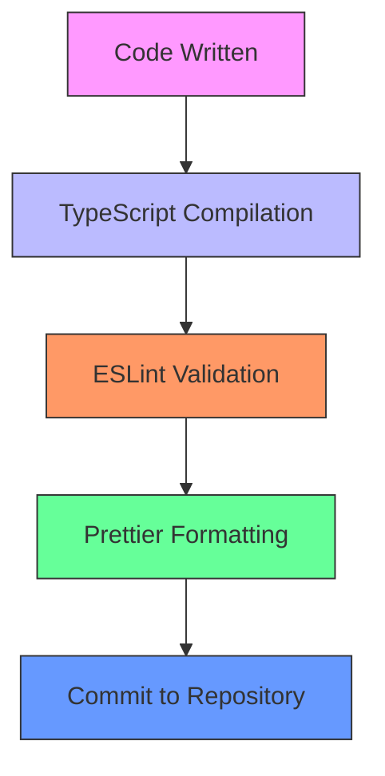
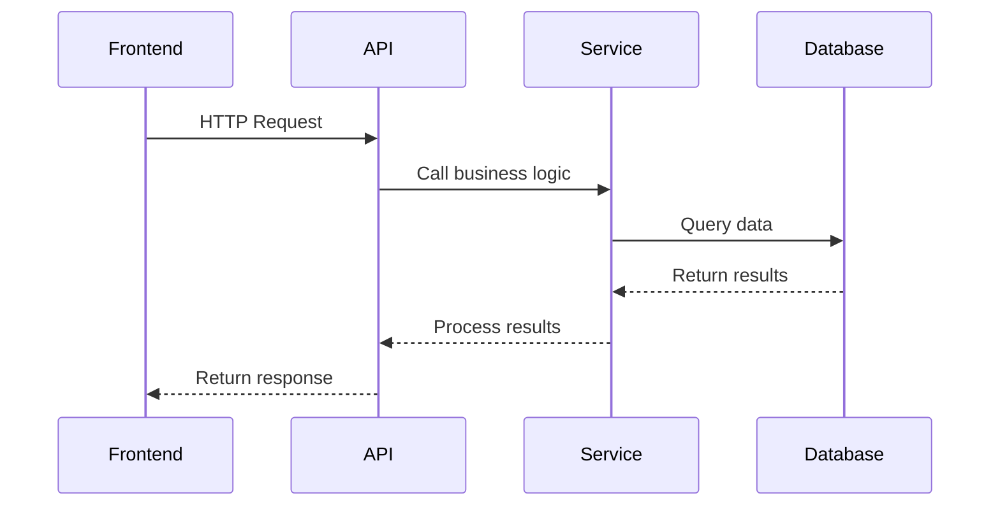
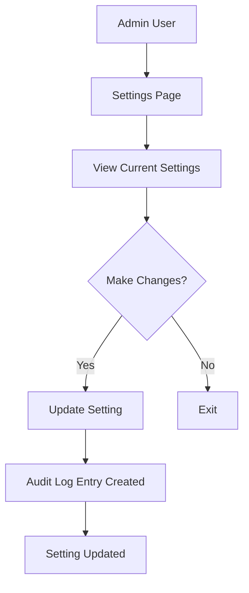

# Contribution Guidelines

<cite>
**Referenced Files in This Document**   
- [package.json](file://package.json)
- [tsconfig.json](file://tsconfig.json)
- [prisma/seed.ts](file://prisma/seed.ts)
- [src/lib/legacy-db.ts](file://src/lib/legacy-db.ts)
- [src/services/LeadPoller.ts](file://src/services/LeadPoller.ts)
- [src/services/LeadStatusService.ts](file://src/services/LeadStatusService.ts)
- [src/app/api/dev/test-legacy-db/route.ts](file://src/app/api/dev/test-legacy-db/route.ts)
- [src/app/admin/settings/page.tsx](file://src/app/admin/settings/page.tsx)
- [src/services/SystemSettingsService.ts](file://src/services/SystemSettingsService.ts)
- [src/app/api/admin/cleanup/route.ts](file://src/app/api/admin/cleanup/route.ts)
</cite>

## Table of Contents
1. [Code Style and Linting Conventions](#code-style-and-linting-conventions)
2. [Branching Strategy and Pull Request Workflow](#branching-strategy-and-pull-request-workflow)
3. [Commit Message Guidelines](#commit-message-guidelines)
4. [Documentation Updates](#documentation-updates)
5. [Implementing New Features](#implementing-new-features)
6. [Bug Fixing Best Practices](#bug-fixing-best-practices)
7. [Refactoring Existing Code](#refactoring-existing-code)
8. [Dependency Management](#dependency-management)
9. [Configuration Management](#configuration-management)
10. [Backward Compatibility Requirements](#backward-compatibility-requirements)
11. [Performance Optimization](#performance-optimization)
12. [Security Considerations](#security-considerations)

## Code Style and Linting Conventions

The fund-track codebase enforces consistent code style through TypeScript, ESLint, and Prettier configurations. While explicit ESLint and Prettier configuration files are not present in the repository root, the project dependencies indicate that these tools are used for code quality enforcement.

TypeScript configuration is defined in `tsconfig.json`, which enables strict type checking and modern JavaScript features. The configuration includes:
- Strict type checking (`"strict": true`)
- ES2017 target for compatibility
- Module resolution set to "bundler"
- Base URL configured for absolute imports using `@/*` aliases
- Support for JSX preservation

The project uses `eslint-config-next` as a dev dependency, which provides the official ESLint configuration for Next.js applications. This configuration enforces code quality rules specific to React and Next.js development patterns. The presence of `@typescript-eslint/eslint-plugin` and `@typescript-eslint/parser` indicates that TypeScript-specific linting rules are applied.

For code formatting, the project likely inherits Prettier rules through the Next.js configuration. Developers should ensure consistent formatting by using standard Prettier defaults when writing code.



**Diagram sources**
- [tsconfig.json](file://tsconfig.json)
- [package.json](file://package.json)

**Section sources**
- [tsconfig.json](file://tsconfig.json#L1-L45)
- [package.json](file://package.json#L1-L70)

## Branching Strategy and Pull Request Workflow

The repository does not contain explicit documentation of branching strategy or pull request workflow in the analyzed files. However, standard Git practices should be followed when contributing to the project.

Developers should create feature branches from the main branch for new work. Branch names should be descriptive and follow a consistent naming convention such as `feature/descriptive-name` or `bugfix/descriptive-name`. When the work is complete, a pull request should be created to merge the feature branch into the main branch.

Pull requests should include a clear description of the changes, the problem being solved, and any relevant context. Code reviews are an essential part of the process, ensuring code quality and knowledge sharing among team members. Reviewers should check for adherence to coding standards, proper testing, and overall design consistency.

Before merging, pull requests must pass all automated tests and meet the project's quality standards. The use of GitHub Actions or similar CI/CD tools is recommended to automate testing and deployment processes, though specific configuration files were not found in the repository.

**Section sources**
- [package.json](file://package.json#L1-L70)

## Commit Message Guidelines

While no explicit commit message guidelines were found in the repository, conventional commit message practices are recommended for consistency and clarity. Commit messages should be clear, concise, and descriptive of the changes made.

The recommended format follows conventional commits:
- Use imperative mood ("fix" not "fixed" or "fixes")
- Limit the subject line to 72 characters
- Include a body for complex changes explaining what and why
- Use type prefixes when appropriate (feat, fix, docs, style, refactor, test, chore)

Examples of well-structured commit messages:
- `fix: prevent race condition in lead status update`
- `feat: add mobile field to lead intake form`
- `refactor: extract notification service logic into separate class`
- `docs: update API documentation for lead status endpoints`

The commit history should tell a coherent story of the project's evolution, making it easier to understand changes and troubleshoot issues.

**Section sources**
- [package.json](file://package.json#L1-L70)

## Documentation Updates

Documentation should be updated alongside code changes to ensure it remains accurate and useful. When implementing new features or modifying existing functionality, update relevant documentation to reflect the changes.

The project includes various scripts and components that serve as documentation:
- API routes in `src/app/api` provide examples of endpoint implementations
- Test scripts in `scripts/` and `test/` directories demonstrate usage patterns
- Component files in `src/components` include React components with props and usage examples

When adding new features, create corresponding documentation in the form of:
- JSDoc comments for functions and classes
- Inline comments for complex logic
- README updates for significant changes
- Example implementations in test or dev directories

The presence of dev tools like `test-legacy-db.mjs` and `test-intake-completion.mjs` suggests that practical examples are valued for understanding system behavior.

**Section sources**
- [scripts/test-intake-completion.mjs](file://scripts/test-intake-completion.mjs#L1-L33)
- [test/test-mailgun.ts](file://test/test-mailgun.ts#L283-L320)

## Implementing New Features

When implementing new features, follow the project's architectural patterns and coding conventions. The fund-track application follows a service-oriented architecture with clear separation of concerns.

Key components and patterns to follow:
- Use service classes in `src/services` for business logic
- Leverage Prisma for database operations
- Follow the existing API route structure in `src/app/api`
- Use environment variables for configuration
- Implement proper error handling and logging

For example, when adding a new feature related to lead management, create a service class that encapsulates the business logic, define API routes to expose the functionality, and update the database schema using Prisma migrations.

The LeadPoller service demonstrates how to implement background processing:
```typescript
class LeadPoller {
  private async pollLegacyDatabase(): Promise<LegacyLead[]> {
    // Implementation details
  }
  
  private transformLegacyLead(legacyLead: LegacyLead): Omit<Lead, 'id' | 'createdAt' | 'updatedAt'> {
    // Transform data from legacy format to application format
  }
}
```

New features should include appropriate testing, either through unit tests or integration tests, to ensure reliability and prevent regressions.



**Diagram sources**
- [src/services/LeadPoller.ts](file://src/services/LeadPoller.ts#L1-L500)
- [src/app/api/leads/route.ts](file://src/app/api/leads/route.ts)

**Section sources**
- [src/services/LeadPoller.ts](file://src/services/LeadPoller.ts#L1-L500)
- [src/lib/legacy-db.ts](file://src/lib/legacy-db.ts#L1-L157)

## Bug Fixing Best Practices

When fixing bugs, follow a systematic approach to identify, resolve, and verify the issue. The project includes several diagnostic and testing tools that can help with bug investigation.

Key practices for effective bug fixing:
- Reproduce the issue consistently
- Write a test that fails with the current behavior
- Implement the fix
- Verify the test passes
- Check for related edge cases
- Document the issue and solution

The project includes several diagnostic scripts that can be used for troubleshooting:
- `scripts/db-diagnostic.sh` - Database diagnostic tools
- `scripts/test-legacy-db.mjs` - Legacy database integration testing
- `scripts/test-intake-completion.mjs` - Intake workflow testing
- `scripts/test-notifications.mjs` - Notification system testing

Error handling is implemented throughout the codebase using try-catch blocks and proper error propagation. When fixing bugs, ensure that error messages are clear and provide enough context for debugging.

The ErrorBoundary component demonstrates proper error handling in React:
```typescript
class ErrorBoundary extends Component<Props, State> {
  componentDidCatch(error: Error, errorInfo: ErrorInfo) {
    clientLogger.error('Error Boundary caught an error', error, {
      errorId: this.state.errorId,
      componentStack: errorInfo.componentStack,
    });
  }
}
```

**Section sources**
- [src/components/ErrorBoundary.tsx](file://src/components/ErrorBoundary.tsx#L154-L211)
- [src/app/api/dev/test-legacy-db/route.ts](file://src/app/api/dev/test-legacy-db/route.ts#L0-L58)

## Refactoring Existing Code

Refactoring should improve code quality without changing functionality. When refactoring, follow these guidelines:
- Ensure comprehensive test coverage before refactoring
- Make small, incremental changes
- Verify that behavior remains unchanged
- Update documentation as needed
- Follow existing code style conventions

The project demonstrates several refactoring patterns:
- Extracting reusable functions and components
- Improving type safety with TypeScript
- Simplifying complex logic
- Improving error handling
- Enhancing performance

For example, the LeadStatusService class includes methods that validate status transitions and handle audit logging:
```typescript
validateStatusTransition(currentStatus: LeadStatus, newStatus: LeadStatus, reason?: string): { valid: boolean; error?: string } {
  // Validation logic
}

async changeLeadStatus(request: StatusChangeRequest): Promise<StatusChangeResult> {
  // Status change implementation with audit logging
}
```

When refactoring database-related code, use Prisma migrations to manage schema changes. The migration history in `prisma/migrations` shows a pattern of incremental schema changes with descriptive names.

**Section sources**
- [src/services/LeadStatusService.ts](file://src/services/LeadStatusService.ts#L60-L110)
- [prisma/migrations/20250811140542_remove_security_settings/migration.sql](file://prisma/migrations/20250811140542_remove_security_settings/migration.sql)

## Dependency Management

Dependencies are managed through npm as indicated by the package.json file. The project specifies exact versions for dependencies to ensure consistency across environments.

Key dependencies include:
- Next.js for the React framework
- Prisma for database access
- TypeScript for type safety
- Various utility libraries for specific functionality

When updating dependencies:
- Check for breaking changes in the changelog
- Update one dependency at a time when possible
- Run all tests after updating
- Verify deployment works correctly
- Document significant changes

The package.json includes scripts for common operations:
- `db:generate` - Generate Prisma client
- `db:migrate` - Run database migrations
- `db:seed` - Seed the database with initial data
- `lint` - Run code linting

These scripts should be used consistently to ensure proper environment setup and maintenance.

**Section sources**
- [package.json](file://package.json#L1-L70)

## Configuration Management

Configuration is managed through environment variables and database-stored system settings. This dual approach allows for both deployment-level configuration and runtime configuration changes.

Environment variables are used for:
- Database connection strings
- API keys and secrets
- Service endpoints
- Feature flags
- Logging configuration

System settings stored in the database provide runtime configurability for:
- Notification settings
- Lead management rules
- Integration parameters
- Performance tuning

The SystemSettingsService class manages database-stored settings:
```typescript
class SystemSettingsService {
  async getSetting(key: string): Promise<SystemSetting | null> {
    // Retrieve setting from database
  }
  
  async updateSetting(key: string, value: string, updatedBy?: number): Promise<SystemSetting> {
    // Update setting with audit logging
  }
}
```

The admin settings page allows authorized users to view and modify system settings:


**Diagram sources**
- [src/services/SystemSettingsService.ts](file://src/services/SystemSettingsService.ts#L204-L239)
- [src/app/admin/settings/page.tsx](file://src/app/admin/settings/page.tsx#L215-L263)

**Section sources**
- [src/services/SystemSettingsService.ts](file://src/services/SystemSettingsService.ts#L1-L300)
- [src/app/admin/settings/page.tsx](file://src/app/admin/settings/page.tsx#L1-L300)

## Backward Compatibility Requirements

The project maintains backward compatibility through careful database migration practices and versioning strategies. Prisma migrations in the `prisma/migrations` directory show a history of incremental schema changes.

Key practices for maintaining backward compatibility:
- Use additive changes when possible (add columns, not remove)
- Provide default values for new fields
- Maintain API endpoint compatibility
- Use versioned APIs for breaking changes
- Deprecate features gradually

Database migrations follow a pattern of:
- Adding new fields with default values
- Migrating data when necessary
- Removing deprecated fields only after ensuring compatibility
- Using enums with care to avoid breaking existing data

The migration to change amount and revenue fields to string format demonstrates careful consideration:
```
20250826203101_change_amount_and_revenue_to_string
```

When making changes that could affect compatibility, thorough testing is essential. The project includes test scripts that verify critical workflows like intake completion and legacy database integration.

**Section sources**
- [prisma/migrations/20250826203101_change_amount_and_revenue_to_string/migration.sql](file://prisma/migrations/20250826203101_change_amount_and_revenue_to_string/migration.sql)
- [scripts/test-intake-completion.mjs](file://scripts/test-intake-completion.mjs#L145-L170)

## Performance Optimization

Performance optimization focuses on database efficiency, caching strategies, and resource management. The project includes several mechanisms for maintaining performance at scale.

Key performance considerations:
- Database indexing for frequently queried fields
- Efficient data fetching and pagination
- Background job processing for intensive tasks
- Connection pooling for database and external services
- Caching of frequently accessed data

The BackgroundJobScheduler service manages periodic tasks:
```typescript
class BackgroundJobScheduler {
  private async executeCleanupJob(): Promise<void> {
    // Clean up old notifications and follow-ups
  }
}
```

Database performance is enhanced through:
- Prisma query optimization
- Index creation on notification logs
- Regular cleanup of old records
- Batch processing of records

The system includes monitoring endpoints to check health and readiness:
- `/api/health/live` - Liveness probe
- `/api/health/ready` - Readiness probe

These endpoints allow infrastructure to monitor application health and respond to performance issues.

**Section sources**
- [src/services/BackgroundJobScheduler.ts](file://src/services/BackgroundJobScheduler.ts#L423-L461)
- [src/app/api/health/route.ts](file://src/app/api/health/route.ts)

## Security Considerations

Security is addressed through multiple layers including authentication, authorization, input validation, and secure configuration.

Key security practices in the project:
- Use of NextAuth for authentication
- Role-based access control
- Input validation and sanitization
- Secure database queries
- Environment variable protection
- Audit logging for sensitive operations

The LeadPoller service includes data sanitization:
```typescript
private sanitizeString(value: string | null | undefined): string | null {
  if (!value || typeof value !== 'string') {
    return null;
  }
  const trimmed = value.trim();
  return trimmed.length > 0 ? trimmed : null;
}
```

Security-related scripts include:
- `security:audit` - Run npm audit to check for vulnerabilities
- `security:fix` - Automatically fix moderate security issues

The system settings include categories for security configuration, and the codebase avoids storing sensitive information in version control by using environment variables.

Regular security audits and dependency updates are essential to maintain a secure application.

**Section sources**
- [src/services/LeadPoller.ts](file://src/services/LeadPoller.ts#L409-L449)
- [package.json](file://package.json#L1-L70)