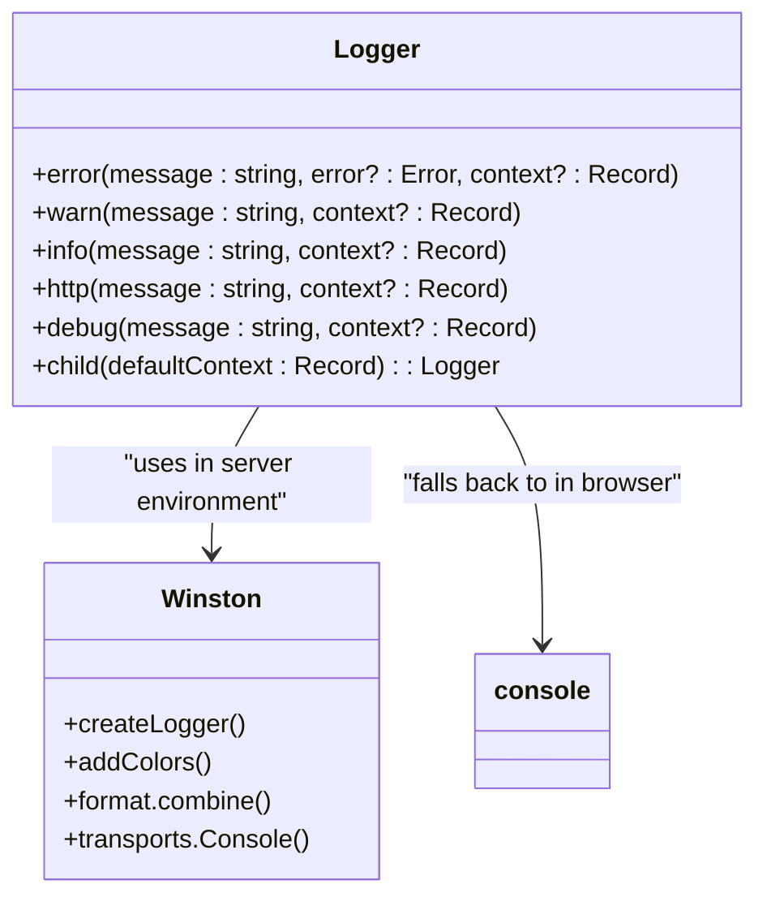
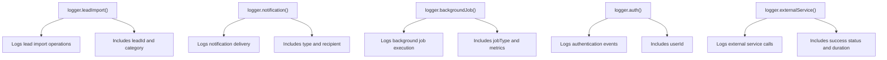
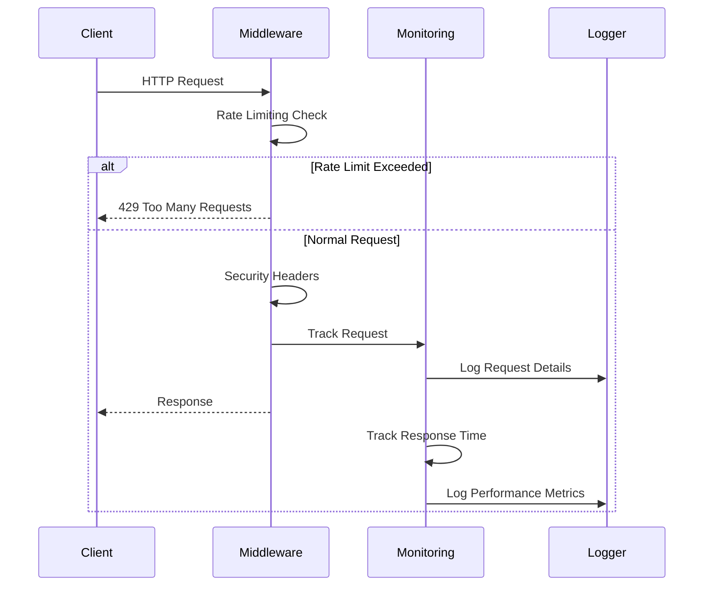
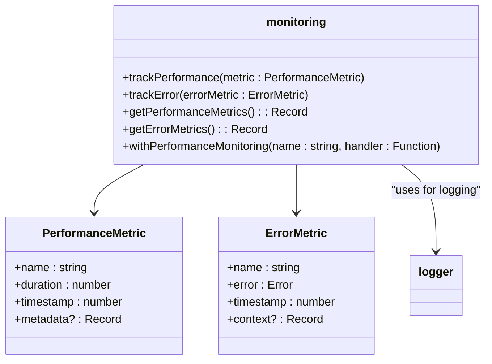
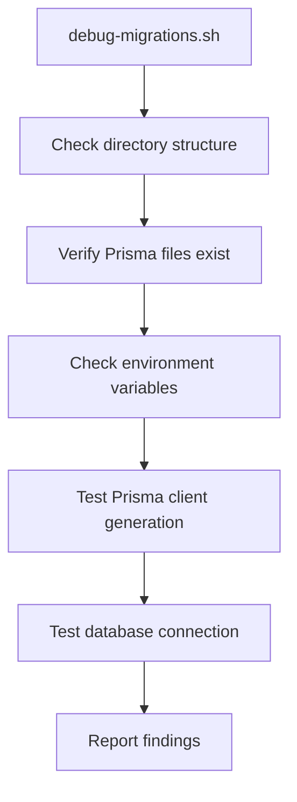
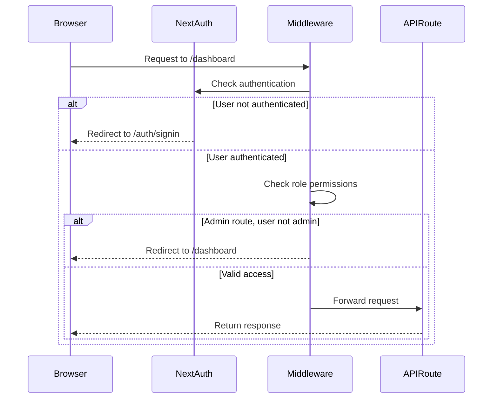
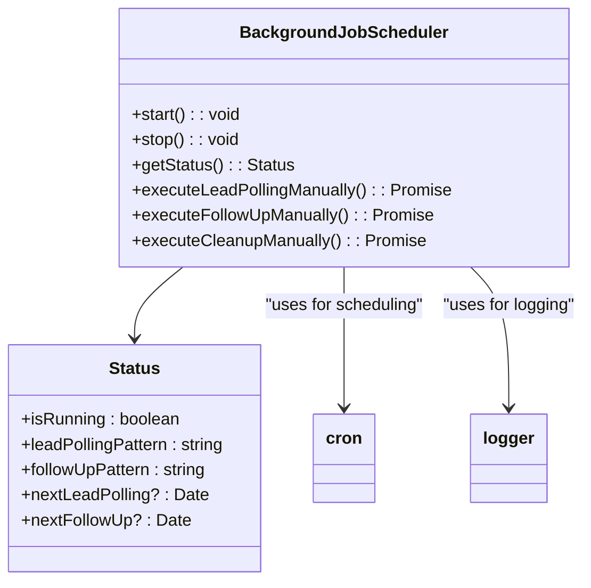
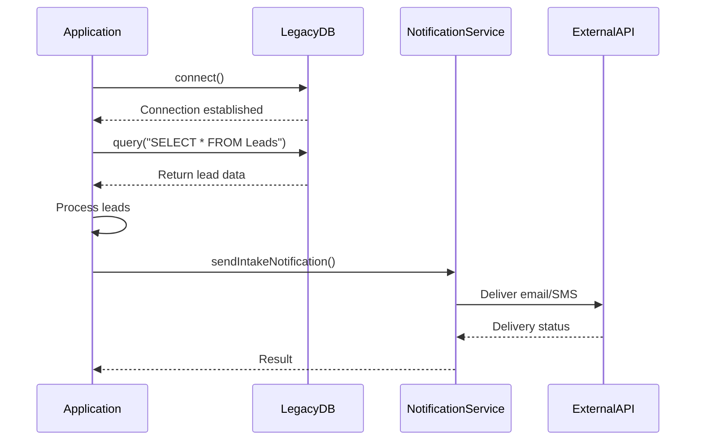
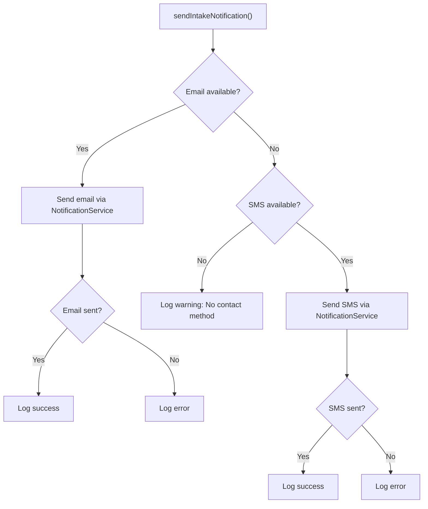

# Debugging Tips

<cite>
**Referenced Files in This Document**   
- [logger.ts](file://src/lib/logger.ts#L1-L351)
- [middleware.ts](file://src/middleware.ts#L1-L190)
- [monitoring.ts](file://src/lib/monitoring.ts#L1-L277)
- [debug-migrations.sh](file://scripts/debug-migrations.sh#L1-L96)
- [legacy-db.ts](file://src/lib/legacy-db.ts#L1-L158)
- [notifications.ts](file://src/lib/notifications.ts#L1-L222)
- [BackgroundJobScheduler.ts](file://src/services/BackgroundJobScheduler.ts#L1-L458)
</cite>

## Table of Contents
1. [Logging Strategy](#logging-strategy)
2. [Monitoring and Error Handling](#monitoring-and-error-handling)
3. [Database Migration Debugging](#database-migration-debugging)
4. [API and Authentication Debugging](#api-and-authentication-debugging)
5. [Background Job Debugging](#background-job-debugging)
6. [External Integration Debugging](#external-integration-debugging)
7. [Common Error Patterns](#common-error-patterns)
8. [Debugging Tools Guide](#debugging-tools-guide)

## Logging Strategy

The application uses a structured logging system implemented in `logger.ts` that works in both browser and server environments. The logger provides different log levels and structured context for effective troubleshooting.



**Diagram sources**
- [logger.ts](file://src/lib/logger.ts#L1-L351)

### Log Levels and Usage

The logger implements custom log levels with appropriate colors for different environments:

- **error**: Red, for critical failures
- **warn**: Yellow, for potential issues
- **info**: Green, for general application events
- **http**: Magenta, for API request/response tracking
- **debug**: White, for detailed debugging information

### Specialized Logging Methods

The logger provides specialized methods for different application components:



**Diagram sources**
- [logger.ts](file://src/lib/logger.ts#L200-L300)

### Interpreting Log Output

Log output includes structured data that helps with troubleshooting:

- **Timestamp**: ISO format timestamp for event ordering
- **Level**: Log severity level
- **Message**: Human-readable description
- **Context**: Structured data object with relevant information
- **Stack trace**: Included for error logs

For example, a database operation log might look like:
```
[2025-08-26 12:00:00:123] DEBUG: Database operation: create
{"operation":"create","table":"Lead","duration":45,"query":"INSERT INTO Lead..."}
```

**Section sources**
- [logger.ts](file://src/lib/logger.ts#L1-L351)

## Monitoring and Error Handling

The application implements monitoring and error handling through middleware and dedicated monitoring utilities.



**Diagram sources**
- [middleware.ts](file://src/middleware.ts#L1-L190)
- [monitoring.ts](file://src/lib/monitoring.ts#L1-L277)

### Middleware Error Handling

The middleware implements several security and monitoring features:

- **Rate Limiting**: Prevents abuse with configurable limits
- **Security Headers**: Adds X-Robots-Tag and HSTS headers
- **HTTPS Enforcement**: Redirects HTTP to HTTPS in production
- **Bot Detection**: Blocks suspicious user agents on sensitive routes

Configuration is controlled by environment variables:
- `ENABLE_RATE_LIMITING`: Enables/disables rate limiting
- `RATE_LIMIT_WINDOW_MS`: Time window for rate limiting
- `RATE_LIMIT_MAX_REQUESTS`: Maximum requests per window
- `FORCE_HTTPS`: Enables HTTPS redirection

**Section sources**
- [middleware.ts](file://src/middleware.ts#L1-L190)

### Performance Monitoring

The monitoring system tracks performance metrics and errors:



**Diagram sources**
- [monitoring.ts](file://src/lib/monitoring.ts#L1-L277)

The `withPerformanceMonitoring` higher-order function wraps API routes to automatically track performance and errors:

```typescript
export function withPerformanceMonitoring<T extends any[], R>(
  name: string,
  handler: (...args: T) => Promise<R>
) {
  return async (...args: T): Promise<R> => {
    const startTime = Date.now();
    
    try {
      const result = await handler(...args);
      trackPerformance({
        name,
        duration: Date.now() - startTime,
        timestamp: Date.now(),
        metadata: { success: true },
      });
      return result;
    } catch (error) {
      trackPerformance({
        name,
        duration: Date.now() - startTime,
        timestamp: Date.now(),
        metadata: { success: false },
      });
      trackError({
        name: `${name}_error`,
        error: error instanceof Error ? error : new Error(String(error)),
        timestamp: Date.now(),
        context: { operationName: name },
      });
      throw error;
    }
  };
}
```

**Section sources**
- [monitoring.ts](file://src/lib/monitoring.ts#L150-L200)

## Database Migration Debugging

The application uses Prisma for database migrations, with a dedicated debug script to diagnose migration issues.



**Diagram sources**
- [debug-migrations.sh](file://scripts/debug-migrations.sh#L1-L96)

### Using debug-migrations.sh

The debug script provides comprehensive information about the migration environment:

1. **Directory Structure**: Verifies the presence of Prisma directories
2. **Migration Files**: Lists all migration files and shows their contents
3. **Environment Variables**: Displays key database configuration
4. **Schema Validation**: Checks for the existence of schema.prisma
5. **Client Generation**: Attempts to generate the Prisma client
6. **Database Connection**: Tests connectivity to the database

To use the script:
```bash
# Run in development
./scripts/debug-migrations.sh

# Run in containerized environment
docker exec <container-name> /bin/sh -c "./scripts/debug-migrations.sh"
```

### Prisma Studio for Migration Debugging

Prisma Studio can be used to inspect the database state:

```bash
npx prisma studio
```

This opens a GUI to:
- View current data in all tables
- Verify migration effects on data
- Check relationships between tables
- Inspect field values and types

### Common Migration Issues and Solutions

**Issue**: Migration files not found in container
**Root Cause**: Build process not copying migration files
**Solution**: Ensure Dockerfile copies the prisma directory

**Issue**: Database connection failed
**Root Cause**: Incorrect DATABASE_URL or network issues
**Solution**: Verify connection string and network connectivity

**Issue**: Prisma client generation failed
**Root Cause**: Schema.prisma syntax errors
**Solution**: Validate schema syntax and model definitions

**Section sources**
- [debug-migrations.sh](file://scripts/debug-migrations.sh#L1-L96)

## API and Authentication Debugging

The application implements API routes and authentication flows that can be debugged using specific techniques.



**Diagram sources**
- [middleware.ts](file://src/middleware.ts#L128-L189)

### Authentication Flow

The authentication system uses NextAuth with the following flow:

1. Unauthenticated users are redirected to `/auth/signin`
2. After successful authentication, users are redirected back to their original destination
3. Admin routes require ADMIN role
4. Certain routes are publicly accessible (intake pages, health checks)

### API Route Debugging

API routes can be debugged by:

- Checking the middleware configuration in `middleware.ts`
- Verifying route handlers in `src/app/api/`
- Using the logger to trace request flow
- Checking environment variable requirements

For example, the signin API route:
```typescript
export async function POST(request: NextRequest) {
  try {
    const { email, password } = await request.json()
    
    if (!email || !password) {
      return NextResponse.json(
        { error: "Email and password are required" },
        { status: 400 }
      )
    }
    
    // The actual authentication is handled by NextAuth.js
    return NextResponse.json(
      { message: "Use NextAuth signin endpoint" },
      { status: 200 }
    )
  } catch (error) {
    return NextResponse.json(
      { error: "Internal server error" },
      { status: 500 }
    )
  }
}
```

**Section sources**
- [middleware.ts](file://src/middleware.ts#L1-L190)
- [src/app/api/auth/signin/route.ts](file://src/app/api/auth/signin/route.ts#L1-L26)

## Background Job Debugging

The application uses a background job scheduler to handle periodic tasks like lead polling and follow-up processing.



**Diagram sources**
- [BackgroundJobScheduler.ts](file://src/services/BackgroundJobScheduler.ts#L1-L458)

### Job Scheduler Architecture

The scheduler manages three main jobs:

1. **Lead Polling**: Runs every 15 minutes by default
2. **Follow-up Processing**: Runs every 5 minutes by default
3. **Cleanup**: Runs daily at 2 AM

Configuration is controlled by environment variables:
- `LEAD_POLLING_CRON_PATTERN`: Cron pattern for lead polling
- `FOLLOWUP_CRON_PATTERN`: Cron pattern for follow-up processing
- `CLEANUP_CRON_PATTERN`: Cron pattern for cleanup tasks
- `TZ`: Timezone for cron scheduling

### Debugging Background Jobs

Several tools are available for debugging background jobs:

**Development Endpoint**: `/api/dev/scheduler-status`
- GET: View current scheduler status
- POST with action=start: Start the scheduler
- POST with action=stop: Stop the scheduler  
- POST with action=poll: Manually trigger lead polling

**Command Line Scripts**:
- `force-start-scheduler.mjs`: Force start the scheduler
- `check-scheduler.mjs`: Check scheduler status via API
- `start-scheduler.sh`: Start scheduler using API

### Manual Job Execution

Jobs can be executed manually for testing:

```javascript
// Import the singleton instance
import { backgroundJobScheduler } from '@/services/BackgroundJobScheduler';

// Execute jobs manually
await backgroundJobScheduler.executeLeadPollingManually();
await backgroundJobScheduler.executeFollowUpManually();
await backgroundJobScheduler.executeCleanupManually();
```

This is useful for:
- Testing new lead import logic
- Verifying notification delivery
- Debugging follow-up scheduling
- Testing cleanup functionality

**Section sources**
- [BackgroundJobScheduler.ts](file://src/services/BackgroundJobScheduler.ts#L1-L458)
- [force-start-scheduler.mjs](file://scripts/force-start-scheduler.mjs#L1-L48)
- [check-scheduler.mjs](file://scripts/check-scheduler.mjs#L1-L21)

## External Integration Debugging

The application integrates with external systems like legacy databases and notification services.



**Diagram sources**
- [legacy-db.ts](file://src/lib/legacy-db.ts#L1-L158)
- [notifications.ts](file://src/lib/notifications.ts#L1-L222)

### Legacy Database Connectivity

The legacy database integration uses MSSQL with configurable parameters:

```typescript
export interface LegacyDbConfig {
  server: string;
  database: string;
  user: string;
  password: string;
  port?: number;
  options?: {
    encrypt?: boolean;
    trustServerCertificate?: boolean;
    requestTimeout?: number;
    connectionTimeout?: number;
  };
}
```

Environment variables control the connection:
- `LEGACY_DB_SERVER`: Database server address
- `LEGACY_DB_DATABASE`: Database name
- `LEGACY_DB_USER`: Username
- `LEGACY_DB_PASSWORD`: Password
- `LEGACY_DB_PORT`: Port number
- `LEGACY_DB_ENCRYPT`: Enable/disable encryption

### Debugging Legacy DB Issues

Common issues and solutions:

**Issue**: Connection timeout
**Root Cause**: Network issues or incorrect server address
**Solution**: Verify server accessibility and firewall rules

**Issue**: Authentication failed
**Root Cause**: Incorrect credentials
**Solution**: Verify username and password

**Issue**: Query timeout
**Root Cause**: Large result sets or slow queries
**Solution**: Increase requestTimeout or optimize queries

### Notification Delivery Debugging

The notification system sends emails and SMS messages:



**Diagram sources**
- [notifications.ts](file://src/lib/notifications.ts#L1-L222)

Common notification issues:

**Issue**: Emails not delivered
**Root Cause**: Invalid email service configuration
**Solution**: Verify Mailgun/SMTP settings

**Issue**: SMS not delivered
**Root Cause**: Invalid phone number format
**Solution**: Validate phone numbers before sending

**Issue**: Mixed success/failure
**Root Cause**: Rate limiting or temporary service issues
**Solution**: Implement retry logic and monitor error patterns

**Section sources**
- [legacy-db.ts](file://src/lib/legacy-db.ts#L1-L158)
- [notifications.ts](file://src/lib/notifications.ts#L1-L222)

## Common Error Patterns

This section documents common error patterns, their root causes, and resolution procedures.

### Database Connection Errors

**Error Pattern**: "Failed to connect to legacy database"
**Root Cause**: Incorrect connection parameters or network issues
**Resolution**:
1. Verify environment variables are set correctly
2. Test connectivity to the database server
3. Check firewall rules and network configuration
4. Validate credentials

### Migration Issues

**Error Pattern**: "Migration directory not found"
**Root Cause**: Build process not copying migration files
**Resolution**:
1. Check Dockerfile or build script
2. Ensure prisma/migrations directory is included
3. Verify file permissions
4. Run debug-migrations.sh to diagnose

### Authentication Failures

**Error Pattern**: Redirect loop on protected routes
**Root Cause**: Authentication token not being set correctly
**Resolution**:
1. Check NextAuth configuration
2. Verify cookie settings in production
3. Ensure secure cookies are configured properly
4. Check browser storage permissions

### Background Job Failures

**Error Pattern**: Scheduler not starting in production
**Root Cause**: ENABLE_BACKGROUND_JOBS not set to true
**Resolution**:
1. Set ENABLE_BACKGROUND_JOBS=true in production
2. Verify NODE_ENV=production
3. Check server logs for initialization errors
4. Use force-start-scheduler.mjs to diagnose

### Notification Delivery Issues

**Error Pattern**: Notifications failing with timeout
**Root Cause**: External service rate limiting or downtime
**Resolution**:
1. Check external service status
2. Implement retry logic with exponential backoff
3. Monitor rate limits
4. Set up fallback notification methods

**Section sources**
- [logger.ts](file://src/lib/logger.ts#L1-L351)
- [middleware.ts](file://src/middleware.ts#L1-L190)
- [monitoring.ts](file://src/lib/monitoring.ts#L1-L277)
- [debug-migrations.sh](file://scripts/debug-migrations.sh#L1-L96)
- [legacy-db.ts](file://src/lib/legacy-db.ts#L1-L158)

## Debugging Tools Guide

This section provides tips for using debugging tools effectively.

### Browser Developer Tools

**Network Tab**:
- Monitor API requests and responses
- Check status codes and response times
- Inspect request headers and payloads
- Identify failed requests

**Console Tab**:
- View client-side logs
- Check for JavaScript errors
- Monitor console messages from logger.ts

**Application Tab**:
- Inspect cookies and localStorage
- Check service worker status
- View cached resources

### Server-Side Debugging

**Log Analysis**:
- Use grep to filter logs by level: `grep "ERROR" logs.txt`
- Search for specific components: `grep "BACKGROUND_JOB" logs.txt`
- Monitor error frequency over time

**Environment Variables**:
- Verify all required variables are set
- Check for typos in variable names
- Ensure sensitive variables are not exposed

### Script-Based Debugging

The application provides several debugging scripts:

```bash
# Check scheduler status
./scripts/check-scheduler.mjs

# Force start scheduler
node ./scripts/force-start-scheduler.mjs

# Debug migrations
./scripts/debug-migrations.sh

# Test legacy database connection
node ./scripts/test-legacy-db.mjs

# Test notifications
node ./scripts/test-notifications.mjs
```

### Development Endpoints

Several API endpoints aid debugging:

- `/api/dev/scheduler-status`: Control and monitor background jobs
- `/api/dev/test-legacy-db`: Test legacy database connectivity
- `/api/dev/test-notifications`: Test notification delivery
- `/api/health/live`: Check if server is running
- `/api/health/ready`: Check if server is ready to handle requests

**Section sources**
- [debug-migrations.sh](file://scripts/debug-migrations.sh#L1-L96)
- [check-scheduler.mjs](file://scripts/check-scheduler.mjs#L1-L21)
- [force-start-scheduler.mjs](file://scripts/force-start-scheduler.mjs#L1-L48)
- [test-legacy-db.mjs](file://scripts/test-legacy-db.mjs#L1-L10)
- [test-notifications.mjs](file://scripts/test-notifications.mjs#L1-L10)