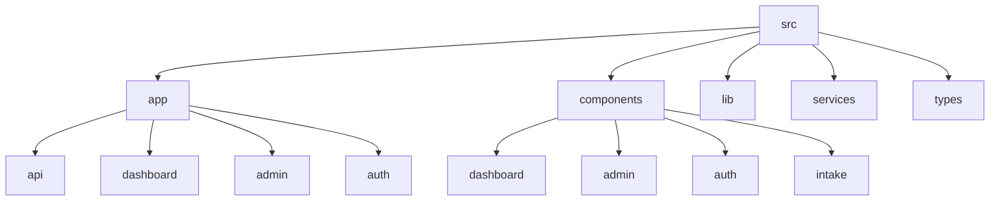
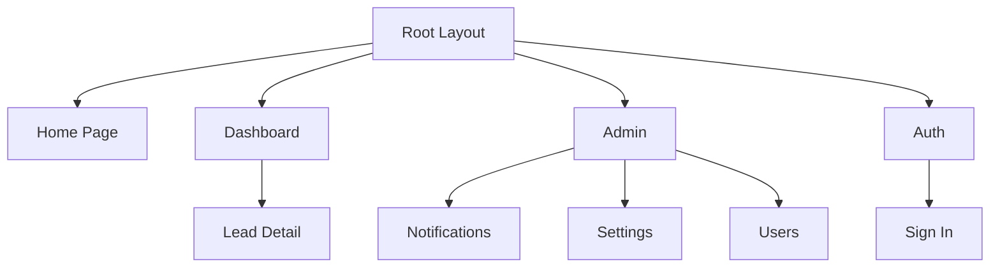
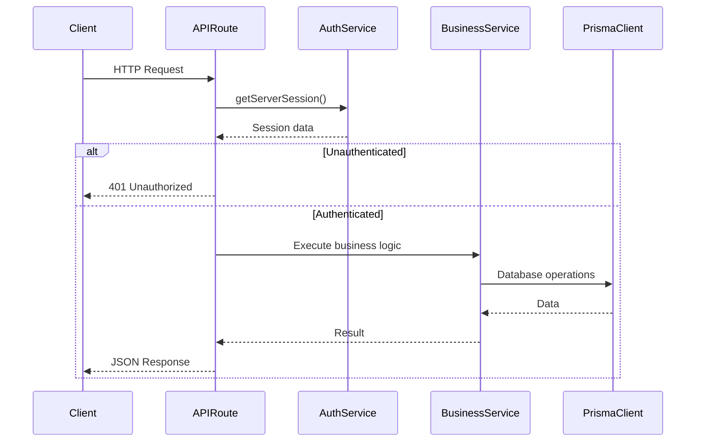
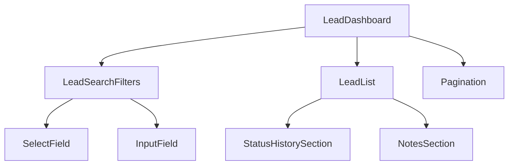
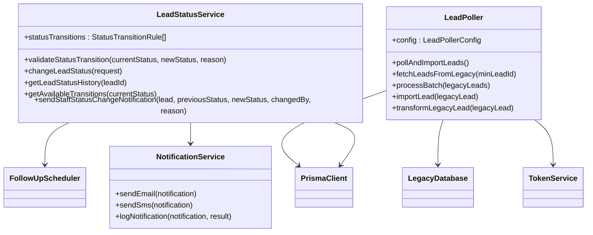
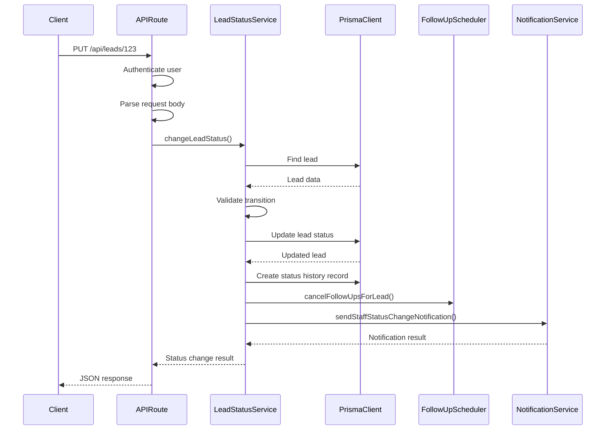
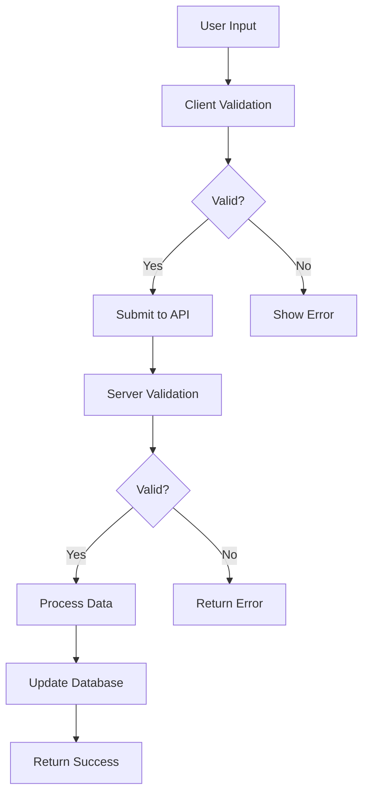

# Development Workflow

<cite>
**Referenced Files in This Document**   
- [page.tsx](file://src/app/page.tsx)
- [layout.tsx](file://src/app/layout.tsx)
- [route.ts](file://src/app/api/leads/route.ts)
- [LeadList.tsx](file://src/components/dashboard/LeadList.tsx)
- [LeadDashboard.tsx](file://src/components/dashboard/LeadDashboard.tsx)
- [types.ts](file://src/components/dashboard/types.ts)
- [LeadPoller.ts](file://src/services/LeadPoller.ts)
- [prisma.ts](file://src/lib/prisma.ts)
- [auth.ts](file://src/lib/auth.ts)
- [LeadStatusService.ts](file://src/services/LeadStatusService.ts)
- [step1/route.ts](file://src/app/api/intake/[token]/step1/route.ts)
- [dashboard/page.tsx](file://src/app/dashboard/page.tsx)
- [RoleGuard.tsx](file://src/components/auth/RoleGuard.tsx)
</cite>

## Table of Contents
1. [Introduction](#introduction)
2. [Project Structure](#project-structure)
3. [Next.js App Router and Page Creation](#nextjs-app-router-and-page-creation)
4. [API Routes and Data Flow](#api-routes-and-data-flow)
5. [Component Hierarchy and Best Practices](#component-hierarchy-and-best-practices)
6. [Service Layer Architecture](#service-layer-architecture)
7. [Data Flow from API to Services to Prisma](#data-flow-from-api-to-services-to-prisma)
8. [Development Tools and Debugging](#development-tools-and-debugging)
9. [Common Development Patterns](#common-development-patterns)
10. [Type Safety in TypeScript](#type-safety-in-typescript)

## Introduction
This document provides a comprehensive guide to the development workflow in the fund-track codebase. It covers the Next.js App Router structure, component hierarchy, service layer architecture, and data flow patterns. The goal is to enable developers to effectively create new pages, API routes, components, and services while maintaining type safety and following established patterns. The system is built with Next.js, TypeScript, Prisma, and follows a layered architecture with clear separation of concerns between presentation, business logic, and data access layers.

## Project Structure
The fund-track application follows a standard Next.js project structure with additional organization for services, components, and libraries. The `src` directory contains the main application code, organized into `app`, `components`, `lib`, `services`, and `types` directories. The `app` directory uses the Next.js App Router for both pages and API routes. The `components` directory is organized by feature area (admin, auth, dashboard, intake), promoting reusability and separation of concerns. The `services` directory contains business logic classes that encapsulate complex operations, while the `lib` directory contains utility functions and shared logic.



**Diagram sources**
- [src/app/page.tsx](file://src/app/page.tsx)
- [src/components/dashboard/LeadList.tsx](file://src/components/dashboard/LeadList.tsx)
- [src/services/LeadPoller.ts](file://src/services/LeadPoller.ts)

## Next.js App Router and Page Creation
The application uses the Next.js App Router for both page rendering and API routes. Pages are created by adding React components with the `.tsx` extension to the `src/app` directory, following the file-based routing convention. Dynamic routes are created using square brackets to denote route parameters. The root layout is defined in `layout.tsx`, which wraps all pages with shared UI elements and providers.



**Diagram sources**
- [layout.tsx](file://src/app/layout.tsx)
- [page.tsx](file://src/app/page.tsx)
- [dashboard/page.tsx](file://src/app/dashboard/page.tsx)

**Section sources**
- [layout.tsx](file://src/app/layout.tsx#L1-L35)
- [page.tsx](file://src/app/page.tsx#L1-L53)

### Creating New Pages
To create a new page, add a `page.tsx` file to the desired route directory within `src/app`. The component should be a default export and can use React Server Components or client components as needed. For client-side interactivity, use the `"use client"` directive at the top of the file. The page component will automatically be rendered at the corresponding route based on its file path.

For example, to create a new settings page in the admin section, create the file `src/app/admin/settings/page.tsx` with the following structure:
```tsx
"use client";

import { AdminOnly } from "@/components/auth/RoleGuard";

export default function SettingsPage() {
  return (
    <AdminOnly>
      <div className="p-6">
        <h1 className="text-2xl font-bold">Settings</h1>
        {/* Settings content */}
      </div>
    </AdminOnly>
  );
}
```

### Dynamic Pages
Dynamic pages are created using route parameters in square brackets. For example, the lead detail page at `/dashboard/leads/[id]` is created with the file `src/app/dashboard/leads/[id]/page.tsx`. The route parameter can be accessed through the `params` prop passed to the page component.

## API Routes and Data Flow
API routes are defined in the `src/app/api` directory using the App Router convention. Each route file exports HTTP method handlers (GET, POST, PUT, DELETE) that process requests and return responses. API routes can be static or dynamic, with dynamic routes using the same square bracket syntax as pages.

### Creating New API Routes
To create a new API route, add a `route.ts` file to the desired path within `src/app/api`. The file should export one or more HTTP method handlers. For example, to create a new route for exporting lead data, create `src/app/api/leads/export/route.ts`:

```ts
import { NextRequest, NextResponse } from 'next/server';
import { getServerSession } from 'next-auth';
import { authOptions } from '@/lib/auth';
import { prisma } from '@/lib/prisma';

export const dynamic = 'force-dynamic';

export async function GET(request: NextRequest) {
  const session = await getServerSession(authOptions);
  if (!session) {
    return NextResponse.json({ error: "Unauthorized" }, { status: 401 });
  }

  const leads = await prisma.lead.findMany({
    // Export logic
  });

  // Return CSV or other format
  return NextResponse.json(leads);
}
```

### API Route Structure
API routes follow a consistent pattern with authentication checking, input validation, business logic execution, and error handling. The `withErrorHandler` utility is used to wrap route handlers and provide consistent error responses. Route parameters are accessed through the `params` object, which must be awaited when using the App Router.



**Diagram sources**
- [route.ts](file://src/app/api/leads/route.ts#L1-L167)
- [auth.ts](file://src/lib/auth.ts#L1-L71)
- [prisma.ts](file://src/lib/prisma.ts#L1-L61)

**Section sources**
- [route.ts](file://src/app/api/leads/route.ts#L1-L167)
- [step1/route.ts](file://src/app/api/intake/[token]/step1/route.ts#L1-L304)

## Component Hierarchy and Best Practices
The component directory is organized by feature area, with shared components at the top level. Components follow React best practices with proper TypeScript typing, accessibility considerations, and separation of concerns. The dashboard components demonstrate a clear hierarchy with container components managing state and presentational components handling rendering.

### Component Structure
Components are organized in a hierarchical structure with container components managing data and state, and presentational components handling UI rendering. The `LeadDashboard` component serves as a container that fetches data and passes it to presentational components like `LeadList`, `LeadSearchFilters`, and `Pagination`.



**Diagram sources**
- [LeadDashboard.tsx](file://src/components/dashboard/LeadDashboard.tsx#L1-L216)
- [LeadList.tsx](file://src/components/dashboard/LeadList.tsx#L1-L462)
- [LeadSearchFilters.tsx](file://src/components/dashboard/LeadSearchFilters.tsx)

**Section sources**
- [LeadDashboard.tsx](file://src/components/dashboard/LeadDashboard.tsx#L1-L216)
- [LeadList.tsx](file://src/components/dashboard/LeadList.tsx#L1-L462)
- [types.ts](file://src/components/dashboard/types.ts#L1-L66)

### Creating New Components
When creating new components, follow these best practices:
1. Use TypeScript interfaces to define props
2. Keep components focused on a single responsibility
3. Use client components only when necessary (use server components by default)
4. Include proper accessibility attributes
5. Use Tailwind CSS for styling
6. Add JSDoc comments for public components and functions

For example, a new component for displaying lead documents:
```tsx
"use client";

import { Document } from "@prisma/client";

interface LeadDocumentsProps {
  documents: Document[];
  onDownload: (documentId: number) => void;
}

export function LeadDocuments({ documents, onDownload }: LeadDocumentsProps) {
  if (documents.length === 0) {
    return <p className="text-gray-500">No documents uploaded</p>;
  }

  return (
    <ul className="space-y-2">
      {documents.map((doc) => (
        <li key={doc.id} className="flex items-center justify-between p-2 bg-gray-50 rounded">
          <span>{doc.fileName}</span>
          <button 
            onClick={() => onDownload(doc.id)}
            className="text-indigo-600 hover:text-indigo-900"
          >
            Download
          </button>
        </li>
      ))}
    </ul>
  );
}
```

## Service Layer Architecture
The service layer contains business logic that is too complex for API routes or components. Services are implemented as classes that encapsulate related functionality and can be imported and used across the application. The services directory contains classes like `LeadPoller`, `LeadStatusService`, and `NotificationService` that handle specific business domains.

### Service Implementation
Services follow a consistent pattern with clear method responsibilities and proper error handling. They import dependencies like Prisma client and other services as needed. The `LeadStatusService` demonstrates this pattern with methods for changing lead status, getting status history, and sending notifications.



**Diagram sources**
- [LeadStatusService.ts](file://src/services/LeadStatusService.ts#L1-L456)
- [LeadPoller.ts](file://src/services/LeadPoller.ts#L1-L522)
- [NotificationService.ts](file://src/services/NotificationService.ts)

**Section sources**
- [LeadStatusService.ts](file://src/services/LeadStatusService.ts#L1-L456)
- [LeadPoller.ts](file://src/services/LeadPoller.ts#L1-L522)

### Creating New Services
To create a new service, add a TypeScript file to the `src/services` directory. The service should be implemented as a class with a clear responsibility. Export a singleton instance for easy import and use throughout the application.

Example of creating a new service for handling document uploads:
```ts
import { prisma } from '@/lib/prisma';
import { FileUploadService } from './FileUploadService';

export interface DocumentServiceConfig {
  maxFileSize: number;
  allowedTypes: string[];
}

export class DocumentService {
  private config: DocumentServiceConfig;
  private fileUploadService: FileUploadService;

  constructor(config: DocumentServiceConfig, fileUploadService: FileUploadService) {
    this.config = {
      maxFileSize: 10 * 1024 * 1024, // 10MB default
      allowedTypes: ['application/pdf', 'image/jpeg', 'image/png'],
      ...config
    };
    this.fileUploadService = fileUploadService;
  }

  async uploadDocument(leadId: number, file: File, userId: number) {
    // Validate file
    if (file.size > this.config.maxFileSize) {
      throw new Error('File size exceeds limit');
    }

    if (!this.config.allowedTypes.includes(file.type)) {
      throw new Error('File type not allowed');
    }

    // Upload to storage
    const uploadResult = await this.fileUploadService.upload(file, `leads/${leadId}/documents`);

    // Save to database
    return await prisma.document.create({
      data: {
        leadId,
        userId,
        fileName: file.name,
        fileSize: file.size,
        fileType: file.type,
        storagePath: uploadResult.path,
        url: uploadResult.url
      }
    });
  }
}

// Export singleton instance
export const documentService = new DocumentService({}, new FileUploadService());
```

## Data Flow from API to Services to Prisma
The application follows a clear data flow pattern from API routes through services to the Prisma client. API routes handle HTTP concerns like authentication and request parsing, services handle business logic and validation, and Prisma handles database operations. This separation of concerns makes the code more maintainable and testable.

### Data Flow Example
The process of changing a lead's status demonstrates the complete data flow:



**Diagram sources**
- [route.ts](file://src/app/api/leads/[id]/route.ts#L1-L304)
- [LeadStatusService.ts](file://src/services/LeadStatusService.ts#L1-L456)
- [prisma.ts](file://src/lib/prisma.ts#L1-L61)

**Section sources**
- [route.ts](file://src/app/api/leads/[id]/route.ts#L1-L304)
- [LeadStatusService.ts](file://src/services/LeadStatusService.ts#L1-L456)

### Error Handling
Error handling is consistent across the application with specific error types for different scenarios. The `lib/errors.ts` file defines custom error classes like `AuthenticationError` and `ValidationError` that are used throughout the application. API routes use the `withErrorHandler` wrapper to ensure consistent error responses.

## Development Tools and Debugging
The development environment includes several tools for debugging and monitoring application behavior. Console logs are used extensively in services for tracking execution flow. The application also includes health check endpoints and monitoring utilities.

### Hot-Reloading
Next.js provides hot module replacement (HMR) that automatically reloads the browser when code changes are detected. This works for both client and server components, though server component changes may require a full page refresh.

### Debugging with Console Logs
Services use console.log statements to track execution flow and debug issues. For example, the `LeadPoller` service logs detailed information about each step of the polling process:

```ts
console.log('🔄 Starting lead polling process...', {
  campaignIds: this.config.campaignIds,
  batchSize: this.config.batchSize,
  maxRetries: this.config.maxRetries
});
```

### Debugging with Breakpoints
Developers can use debugger statements or IDE breakpoints to pause execution and inspect variables. In API routes and server components, breakpoints can be set in route handlers and service methods.

### Development Scripts
The `scripts` directory contains various utility scripts for development tasks:
- `db-diagnostic.sh` - Database diagnostic tools
- `debug-migrations.sh` - Prisma migration debugging
- `health-check.sh` - Application health checking
- `test-lead-polling.mjs` - Test lead polling functionality

## Common Development Patterns
The application implements several common patterns for form handling, state management, and API integration.

### Form Handling
Form handling follows a pattern of client-side validation with server-side validation as a backup. The intake forms demonstrate this pattern with comprehensive validation in the API routes. Client components handle user input and display validation errors, while API routes perform thorough validation and sanitization.



**Diagram sources**
- [step1/route.ts](file://src/app/api/intake/[token]/step1/route.ts#L1-L304)
- [Step1Form.tsx](file://src/components/intake/Step1Form.tsx)

**Section sources**
- [step1/route.ts](file://src/app/api/intake/[token]/step1/route.ts#L1-L304)

### State Management
The application uses React state for client-side state management, with Next.js App Router for URL state. The `LeadDashboard` component demonstrates state management with filters, pagination, and sorting state.

```ts
const [filters, setFilters] = useState<LeadFilters>({
  search: "",
  status: "",
  dateFrom: "",
  dateTo: ""
});
```

For global state like authentication, the application uses Next-Auth with React context through the `SessionProvider` component.

### API Integration
API integration follows a consistent pattern of using fetch with proper error handling. The `LeadDashboard` component demonstrates this pattern:

```ts
const fetchLeads = useCallback(async () => {
  setLoading(true);
  setError(null);

  try {
    const params = new URLSearchParams({
      page: pagination.page.toString(),
      limit: pagination.limit.toString(),
      ...(filters.search && { search: filters.search }),
      // ... other params
    });

    const response = await fetch(`/api/leads?${params}`);

    if (!response.ok) {
      throw new Error(`Failed to fetch leads: ${response.statusText}`);
    }

    const data = await response.json();
    // Process data
  } catch (err) {
    setError(err instanceof Error ? err.message : "An error occurred");
  } finally {
    setLoading(false);
  }
}, [filters, pagination.page, pagination.limit, sortBy, sortOrder]);
```

## Type Safety in TypeScript
The application maintains type safety throughout with comprehensive TypeScript typing. Interfaces define data structures, and types are used consistently across components, services, and API routes.

### Type Definitions
The `types.ts` file in the dashboard components directory defines interfaces for leads, filters, and pagination:

```ts
export interface Lead {
  id: number;
  legacyLeadId: string | null;
  campaignId: number;
  email: string | null;
  // ... other fields
  status: LeadStatus;
  createdAt: Date;
  updatedAt: Date;
  _count: {
    notes: number;
    documents: number;
  };
}

export interface LeadFilters {
  search: string;
  status: string;
  dateFrom: string;
  dateTo: string;
}

export interface PaginationInfo {
  page: number;
  limit: number;
  totalCount: number;
  totalPages: number;
  hasNext: boolean;
  hasPrev: boolean;
}
```

### Type Safety Best Practices
1. Use specific types rather than `any`
2. Define interfaces for complex objects
3. Use enums for fixed sets of values
4. Leverage Prisma-generated types
5. Use utility types like `Partial`, `Pick`, and `Omit` when appropriate
6. Type route parameters and request bodies
7. Use generics for reusable components and functions

The application imports types from Prisma (`@prisma/client`) to ensure consistency between the database schema and TypeScript types. This prevents type mismatches and provides autocomplete and type checking throughout the codebase.