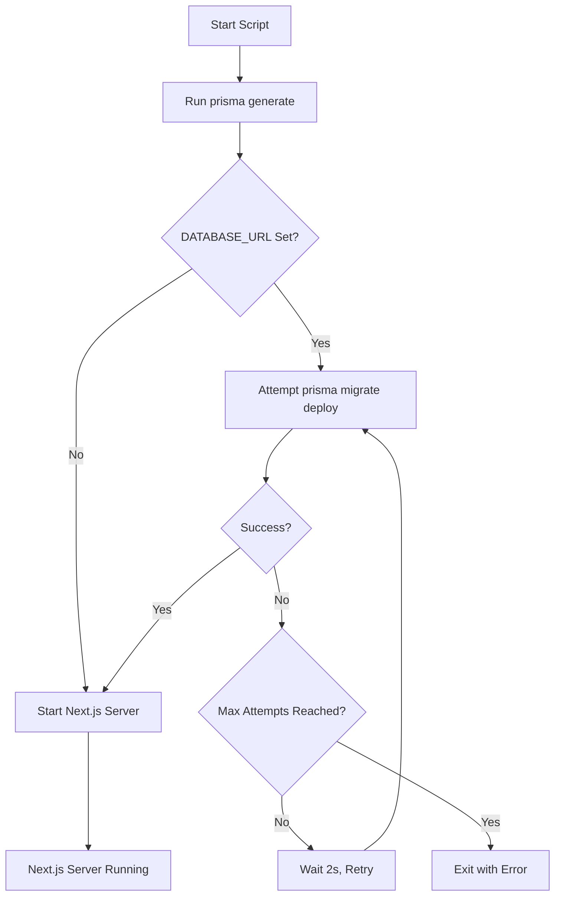
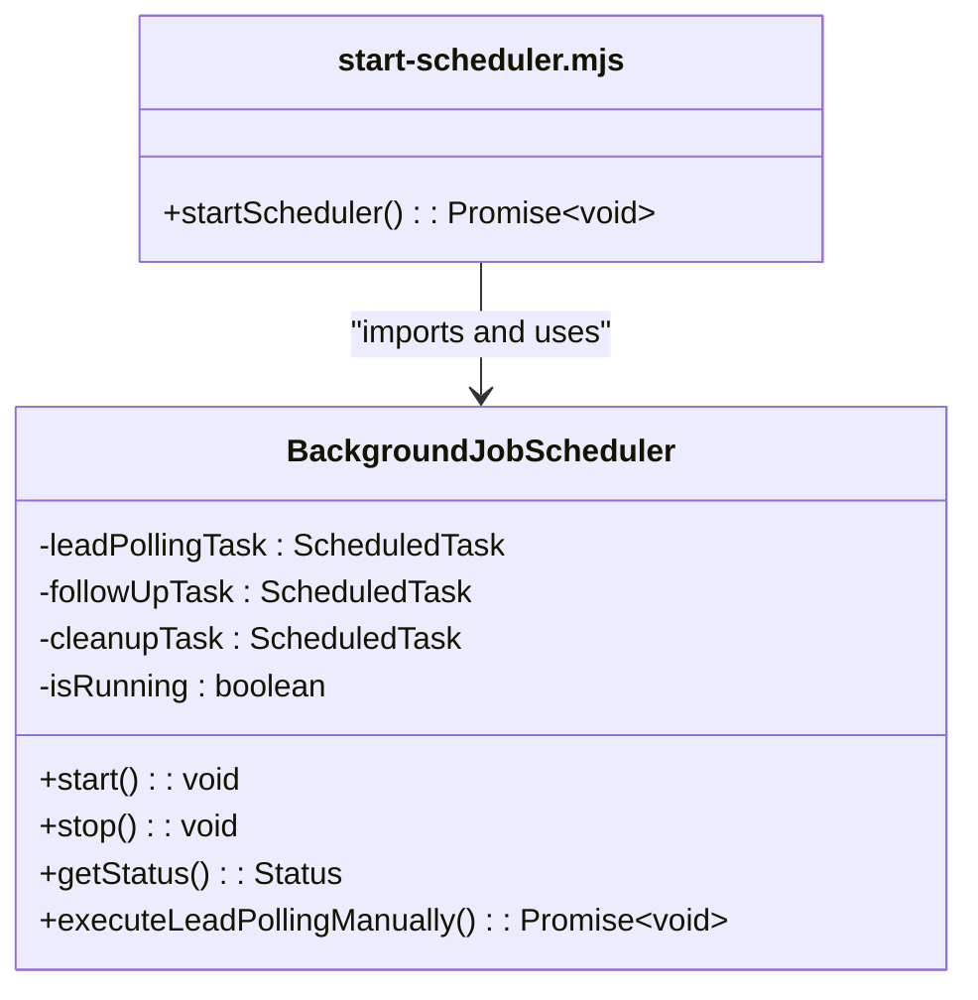

# Script Operations

<cite>
**Referenced Files in This Document**   
- [prisma-migrate-and-start.mjs](file://scripts/prisma-migrate-and-start.mjs)
- [start-scheduler.mjs](file://scripts/start-scheduler.mjs)
- [force-start-scheduler.mjs](file://scripts/force-start-scheduler.mjs)
- [check-scheduler.mjs](file://scripts/check-scheduler.mjs)
- [backup-database.sh](file://scripts/backup-database.sh)
- [disaster-recovery.sh](file://scripts/disaster-recovery.sh)
- [db-diagnostic.sh](file://scripts/db-diagnostic.sh)
- [debug-migrations.sh](file://scripts/debug-migrations.sh)
- [health-check.sh](file://scripts/health-check.sh)
- [ensure-scheduler-running.sh](file://scripts/ensure-scheduler-running.sh)
- [start-scheduler.sh](file://scripts/start-scheduler.sh)
- [emergency-cleanup.mjs](file://scripts/emergency-cleanup.mjs)
- [run_notification_log_analysis.sh](file://scripts/analysis/run_notification_log_analysis.sh)
- [BackgroundJobScheduler.ts](file://src/services/BackgroundJobScheduler.ts)
- [prisma.ts](file://src/lib/prisma.ts)
- [LeadPoller.ts](file://src/services/LeadPoller.ts)
</cite>

## Table of Contents
1. [Introduction](#introduction)
2. [Script Categories and Overview](#script-categories-and-overview)
3. [Database Management Scripts](#database-management-scripts)
   - [prisma-migrate-and-start.mjs](#prisma-migrate-and-startmjs)
   - [backup-database.sh](#backup-databasesh)
   - [disaster-recovery.sh](#disaster-recoverysh)
   - [db-diagnostic.sh](#db-diagnosticsh)
   - [debug-migrations.sh](#debug-migrationssh)
4. [Scheduler Management Scripts](#scheduler-management-scripts)
   - [start-scheduler.mjs](#start-schedulermjs)
   - [force-start-scheduler.mjs](#force-start-schedulermjs)
   - [check-scheduler.mjs](#check-schedulermjs)
   - [ensure-scheduler-running.sh](#ensure-scheduler-runningsh)
   - [start-scheduler.sh](#start-schedulersh)
5. [Health and Diagnostic Scripts](#health-and-diagnostic-scripts)
   - [health-check.sh](#health-checksh)
6. [Emergency and Cleanup Scripts](#emergency-and-cleanup-scripts)
   - [emergency-cleanup.mjs](#emergency-cleanupmjs)
   - [run_notification_log_analysis.sh](#run_notification_log_analysissh)
7. [Troubleshooting Common Issues](#troubleshooting-common-issues)
8. [Best Practices for Script Usage](#best-practices-for-script-usage)
9. [Creating Custom Scripts](#creating-custom-scripts)

## Introduction
This document provides comprehensive guidance on the operational scripts within the fund-track repository. These scripts are essential for database management, system diagnostics, scheduler operations, and emergency recovery. The scripts are organized in the `scripts/` directory and are designed to support development, staging, and production environments. This documentation explains the purpose, usage, internal logic, and execution examples for each script, along with troubleshooting guidance for common issues.

## Script Categories and Overview
The operational scripts in the fund-track repository are categorized by their primary function:

- **Database Management**: Handle database migrations, backups, and recovery
- **Scheduler Management**: Control the background job scheduler for lead polling and follow-ups
- **Health and Diagnostics**: Verify system health and diagnose connectivity issues
- **Emergency Operations**: Perform cleanup and recovery during critical situations

These scripts are implemented in both JavaScript/TypeScript (.mjs) and Bash (.sh) formats, allowing flexibility for different execution contexts and environments.

## Database Management Scripts

### prisma-migrate-and-start.mjs
The `prisma-migrate-and-start.mjs` script is the primary startup script used in production environments (e.g., Coolify/Nixpacks). It orchestrates the application startup process by handling Prisma migrations and starting the Next.js server.

**Purpose**: To ensure database schema consistency before starting the application server.

**Internal Logic**:
1. Runs `prisma generate` to ensure the Prisma client is up-to-date
2. Checks for the presence of `DATABASE_URL` environment variable
3. If `DATABASE_URL` is set, attempts `prisma migrate deploy` with retry logic
4. Starts the Next.js server on the specified port

The script implements robust error handling and retry mechanisms, attempting migrations up to 30 times with a 2-second backoff between attempts. This prevents startup failures due to temporary database connectivity issues.



**Diagram sources**
- [prisma-migrate-and-start.mjs](file://scripts/prisma-migrate-and-start.mjs#L0-L89)

**Section sources**
- [prisma-migrate-and-start.mjs](file://scripts/prisma-migrate-and-start.mjs#L0-L89)
- [prisma.ts](file://src/lib/prisma.ts#L0-L60)

### backup-database.sh
The `backup-database.sh` script creates automated backups of the PostgreSQL database and manages backup retention.

**Purpose**: To create reliable database backups with cloud storage integration and retention policies.

**Key Features**:
- Creates compressed, custom-format PostgreSQL dumps
- Supports cloud backup to AWS S3
- Implements retention policy (default: 30 days)
- Verifies backup integrity
- Sends email notifications on success

**Environment Variables**:
- `BACKUP_DIR`: Directory for local backups (default: ./backups)
- `BACKUP_RETENTION_DAYS`: Number of days to retain backups (default: 30)
- `ENABLE_CLOUD_BACKUP`: Enable S3 upload (true/false)
- `BACKUP_STORAGE_BUCKET`: S3 bucket name
- `ENABLE_BACKUP_NOTIFICATIONS`: Send email notifications (true/false)
- `ADMIN_EMAIL`: Recipient for backup notifications

**Usage Examples**:
```bash
# Run with default settings
./scripts/backup-database.sh

# Custom backup directory and retention
BACKUP_DIR=/mnt/backups BACKUP_RETENTION_DAYS=7 ./scripts/backup-database.sh

# With cloud backup enabled
ENABLE_CLOUD_BACKUP=true BACKUP_STORAGE_BUCKET=my-backup-bucket ./scripts/backup-database.sh
```

**Section sources**
- [backup-database.sh](file://scripts/backup-database.sh#L0-L119)

### disaster-recovery.sh
The `disaster-recovery.sh` script handles database restoration and system recovery operations.

**Purpose**: To restore the database from backups during disaster scenarios.

**Key Features**:
- Lists available backup files
- Restores from specific or latest backup
- Verifies backup integrity before restoration
- Creates pre-restore safety backup
- Runs post-restore migrations

**Usage Options**:
```bash
# List available backups
./scripts/disaster-recovery.sh --list-backups

# Restore from latest backup
./scripts/disaster-recovery.sh --latest

# Restore from specific backup
./scripts/disaster-recovery.sh --restore-from ./backups/backup_20240131.sql

# Verify backup integrity
./scripts/disaster-recovery.sh --verify-backup ./backups/backup_20240131.sql
```

The script implements safety measures including pre-restore backups and integrity verification to prevent data loss during recovery operations.

**Section sources**
- [disaster-recovery.sh](file://scripts/disaster-recovery.sh#L0-L258)

### db-diagnostic.sh
The `db-diagnostic.sh` script performs comprehensive database connectivity diagnostics.

**Purpose**: To diagnose database connectivity issues in various environments.

**Diagnostic Checks**:
1. Environment variables (DATABASE_URL)
2. Network connectivity (using nc or telnet)
3. DNS resolution
4. PostgreSQL client connection (psql)
5. Node.js/Prisma connection

**Usage**:
```bash
# Run diagnostics
./scripts/db-diagnostic.sh

# Include in deployment troubleshooting
# Helps identify issues with database connectivity, network configuration, or environment setup
```

This script is particularly useful for troubleshooting deployment issues where the application cannot connect to the database.

**Section sources**
- [db-diagnostic.sh](file://scripts/db-diagnostic.sh#L0-L78)

### debug-migrations.sh
The `debug-migrations.sh` script provides detailed information about Prisma migration files and environment configuration.

**Purpose**: To debug migration-related issues during deployment.

**Diagnostic Information**:
- Directory structure (prisma/, node_modules/)
- Migration files and their contents
- Prisma client generation status
- Environment variables
- Schema file verification
- Database connection test

**Usage**:
```bash
# Run migration diagnostics
./scripts/debug-migrations.sh
```

This script is invaluable for identifying issues related to migration file deployment, Prisma client generation, or environment configuration in containerized environments.

**Section sources**
- [debug-migrations.sh](file://scripts/debug-migrations.sh#L0-L95)

## Scheduler Management Scripts

### start-scheduler.mjs
The `start-scheduler.mjs` script manually starts the background job scheduler.

**Purpose**: To start the background job scheduler for debugging or manual operation.

**Internal Logic**:
1. Imports the `backgroundJobScheduler` singleton from `BackgroundJobScheduler.ts`
2. Checks current scheduler status
3. Starts the scheduler if not already running
4. Handles graceful shutdown on SIGINT/SIGTERM



**Diagram sources**
- [start-scheduler.mjs](file://scripts/start-scheduler.mjs#L0-L57)
- [BackgroundJobScheduler.ts](file://src/services/BackgroundJobScheduler.ts#L0-L462)

**Section sources**
- [start-scheduler.mjs](file://scripts/start-scheduler.mjs#L0-L57)
- [BackgroundJobScheduler.ts](file://src/services/BackgroundJobScheduler.ts#L0-L462)

### force-start-scheduler.mjs
The `force-start-scheduler.mjs` script directly starts the background job scheduler, bypassing API endpoints.

**Purpose**: To force-start the scheduler when API-based methods fail.

**Key Differences from start-scheduler.mjs**:
- Directly imports and uses the `backgroundJobScheduler` instance
- Sets environment to production by default
- Includes manual execution of lead polling for verification
- More detailed logging of scheduler status

**Usage**:
```bash
# Force start scheduler
node scripts/force-start-scheduler.mjs

# In production environment
NODE_ENV=production node scripts/force-start-scheduler.mjs
```

This script is useful when the API endpoints are not accessible or when direct process control is needed.

**Section sources**
- [force-start-scheduler.mjs](file://scripts/force-start-scheduler.mjs#L0-L81)

### check-scheduler.mjs
The `check-scheduler.mjs` script checks the status of the background job scheduler.

**Purpose**: To monitor scheduler status and provide diagnostic information.

**Output Includes**:
- Scheduler running status
- Next execution times for lead polling and follow-ups
- Environment configuration
- Troubleshooting tips based on current status

**Usage**:
```bash
# Check scheduler status
node scripts/check-scheduler.mjs

# With custom base URL
NEXTAUTH_URL=https://myapp.com node scripts/check-scheduler.mjs
```

This script is useful for monitoring and troubleshooting scheduler issues in both development and production environments.

**Section sources**
- [check-scheduler.mjs](file://scripts/check-scheduler.mjs#L0-L71)

### ensure-scheduler-running.sh
The `ensure-scheduler-running.sh` script verifies and starts the scheduler via API calls.

**Purpose**: To ensure the scheduler is running, typically used as a cron job.

**Workflow**:
1. Waits for server to be ready (up to 30 attempts)
2. Checks scheduler status via API
3. Starts scheduler if not running
4. Tests manual polling to verify functionality

**Usage**:
```bash
# Add to crontab to run every 5 minutes
*/5 * * * * /path/to/fund-track/scripts/ensure-scheduler-running.sh
```

This script is ideal for production environments where the scheduler should always be running.

**Section sources**
- [ensure-scheduler-running.sh](file://scripts/ensure-scheduler-running.sh#L0-L92)

### start-scheduler.sh
The `start-scheduler.sh` script starts the scheduler using API endpoints.

**Purpose**: To start the scheduler via HTTP requests, useful in development.

**Requirements**:
- Server running on localhost:3000
- `ENABLE_DEV_ENDPOINTS=true` in environment

**Usage**:
```bash
# Start scheduler
./scripts/start-scheduler.sh

# After starting development server
npm run dev
./scripts/start-scheduler.sh
```

This script provides a simple way to start the scheduler in development environments.

**Section sources**
- [start-scheduler.sh](file://scripts/start-scheduler.sh#L0-L55)

## Health and Diagnostic Scripts

### health-check.sh
The `health-check.sh` script performs health checks for monitoring systems.

**Purpose**: To provide a reliable health check endpoint for monitoring tools.

**Features**:
- Configurable health check URL and timeout
- Retry mechanism with configurable attempts and delay
- Color-coded output for different health states
- JSON response parsing
- Verbose mode for debugging

**Exit Codes**:
- 0: Healthy
- 1: Degraded
- 2: Unhealthy
- 3: Unknown status
- 4: Connection failed

**Usage**:
```bash
# Basic health check
./scripts/health-check.sh

# With custom URL
HEALTH_URL=https://myapp.com/api/health ./scripts/health-check.sh

# Verbose output
./scripts/health-check.sh --verbose

# In monitoring systems
# Returns appropriate exit code for alerting
```

This script is suitable for integration with monitoring systems like Prometheus, Nagios, or cloud health checks.

**Section sources**
- [health-check.sh](file://scripts/health-check.sh#L0-L117)

## Emergency and Cleanup Scripts

### emergency-cleanup.mjs
The `emergency-cleanup.mjs` script performs emergency cleanup of notification logs.

**Purpose**: To reduce database size by cleaning up excessive notification records.

**Cleanup Strategies**:
1. Keep only the most recent 5 notifications per lead
2. Delete all notifications older than 7 days

**Safety Features**:
- Requires `EMERGENCY_CLEANUP=true` environment variable
- Provides detailed statistics before and after cleanup
- Skips execution if no notifications exist

**Usage**:
```bash
# Dry run (won't execute)
node scripts/emergency-cleanup.mjs

# Execute cleanup
EMERGENCY_CLEANUP=true node scripts/emergency-cleanup.mjs
```

This script is designed for emergency situations where the notification_log table has grown excessively large.

**Section sources**
- [emergency-cleanup.mjs](file://scripts/emergency-cleanup.mjs#L0-L135)

### run_notification_log_analysis.sh
The `run_notification_log_analysis.sh` script analyzes notification log data.

**Purpose**: To generate diagnostic reports on notification log data.

**Analysis Includes**:
- Status distribution
- Daily volume (30-day)
- Top recipients and lead IDs
- Duplicate external IDs
- Table and index sizes
- Recent sample rows

**Usage**:
```bash
# Basic analysis
DATABASE_URL="postgres://..." ./scripts/analysis/run_notification_log_analysis.sh

# Include heavy queries (COUNT)
DATABASE_URL="postgres://..." ./scripts/analysis/run_notification_log_analysis.sh --include-heavy
```

The script generates a timestamped report file with comprehensive analysis of the notification log table.

**Section sources**
- [run_notification_log_analysis.sh](file://scripts/analysis/run_notification_log_analysis.sh#L0-L65)

## Troubleshooting Common Issues

### Permission Errors
**Issue**: Scripts fail with permission denied errors.
**Solution**: Make scripts executable:
```bash
chmod +x scripts/*.sh
chmod +x scripts/*.mjs
```

### Path Resolution Problems
**Issue**: Scripts cannot find dependencies or modules.
**Solution**:
- Run scripts from repository root
- Ensure node_modules are installed (`npm install`)
- Use absolute paths when necessary

### Environment Variable Dependencies
**Common Issues and Solutions**:
- **DATABASE_URL not set**: Ensure environment variables are loaded
- **Missing AWS credentials**: Configure AWS CLI for S3 backups
- **Port conflicts**: Check if port 3000 is available

### Migration Issues
**Troubleshooting Steps**:
1. Run `./scripts/debug-migrations.sh` to diagnose
2. Verify migration files are deployed
3. Check DATABASE_URL format and accessibility
4. Test database connection with `./scripts/db-diagnostic.sh`

### Scheduler Issues
**Common Problems**:
- Scheduler not starting: Check `ENABLE_BACKGROUND_JOBS` environment variable
- Lead polling not working: Verify `LEAD_POLLING_CRON_PATTERN`
- Follow-ups not processing: Check `FOLLOWUP_CRON_PATTERN`

Use `node scripts/check-scheduler.mjs` to diagnose scheduler status.

**Section sources**
- [prisma-migrate-and-start.mjs](file://scripts/prisma-migrate-and-start.mjs#L0-L89)
- [start-scheduler.mjs](file://scripts/start-scheduler.mjs#L0-L57)
- [db-diagnostic.sh](file://scripts/db-diagnostic.sh#L0-L78)
- [debug-migrations.sh](file://scripts/debug-migrations.sh#L0-L95)

## Best Practices for Script Usage

### Environment-Specific Usage
**Development**:
- Use `.env.local` for environment variables
- Run `npm run dev` before scheduler scripts
- Use `check-scheduler.mjs` for monitoring

**Staging/Production**:
- Set environment variables in deployment configuration
- Use `prisma-migrate-and-start.mjs` as startup command
- Schedule `ensure-scheduler-running.sh` as cron job
- Regularly run `backup-database.sh`

### Security Considerations
- Never commit sensitive environment variables
- Restrict access to emergency scripts
- Use IAM roles instead of credentials for cloud backups
- Enable `ENABLE_DEV_ENDPOINTS` only in development

### Monitoring and Alerting
- Integrate `health-check.sh` with monitoring systems
- Set up alerts for backup failures
- Monitor scheduler status regularly
- Track database size and growth

## Creating Custom Scripts
To create new operational scripts:

1. **Choose the Right Format**:
   - Use `.mjs` for complex logic requiring Node.js modules
   - Use `.sh` for simple system operations and shell commands

2. **Follow Existing Patterns**:
   - Include error handling and logging
   - Use environment variables for configuration
   - Implement graceful shutdown where appropriate

3. **Example Template (.mjs)**:
```javascript
#!/usr/bin/env node

import { logger } from '../src/lib/logger.js';

async function customOperation() {
  try {
    console.log('🚀 Starting custom operation...');
    // Your logic here
    console.log('✅ Operation completed successfully');
  } catch (error) {
    console.error('❌ Operation failed:', error);
    process.exit(1);
  }
}

// Handle graceful shutdown
process.on('SIGINT', () => {
  console.log('\n🛑 Received SIGINT, exiting...');
  process.exit(0);
});

process.on('SIGTERM', () => {
  console.log('\n🛑 Received SIGTERM, exiting...');
  process.exit(0);
});

customOperation();
```

4. **Testing**:
   - Test in development before production use
   - Verify error handling with failure scenarios
   - Check resource usage and performance