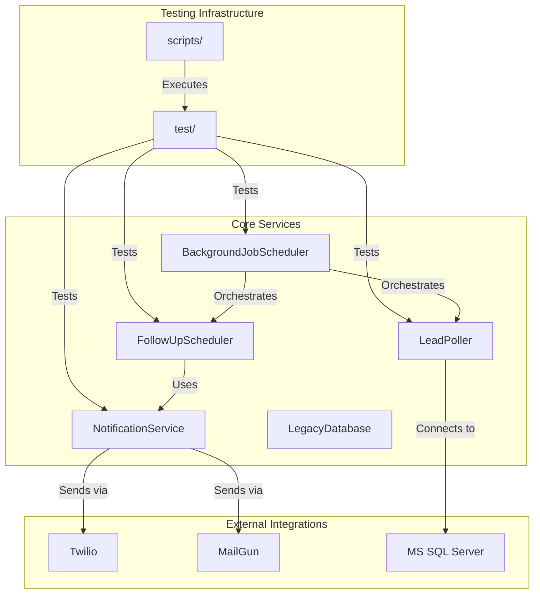
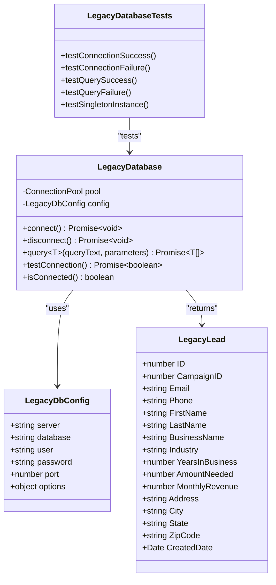
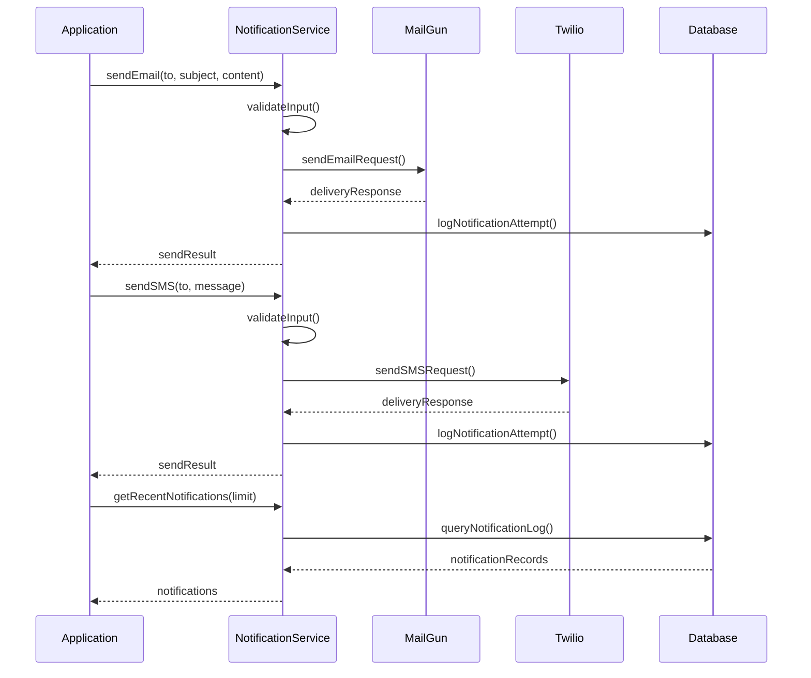
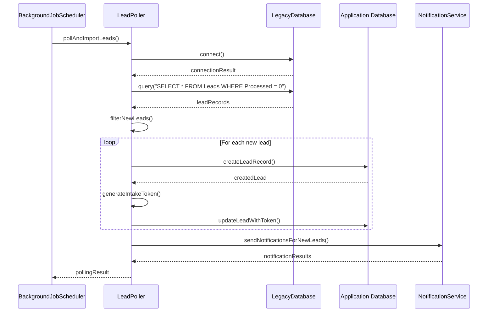

# Testing Strategy

<cite>
**Referenced Files in This Document**   
- [test-legacy-db.js](file://test/test-legacy-db.js)
- [test-mailgun.ts](file://test/test-mailgun.ts)
- [legacy-db.ts](file://src/lib/legacy-db.ts)
- [NotificationService.ts](file://src/services/NotificationService.ts)
- [FollowUpScheduler.ts](file://src/services/FollowUpScheduler.ts)
- [BackgroundJobScheduler.ts](file://src/services/BackgroundJobScheduler.ts)
- [NotificationCleanupService.ts](file://src/services/NotificationCleanupService.ts)
- [SystemSettingsService.ts](file://src/services/SystemSettingsService.ts)
- [TokenService.ts](file://src/services/TokenService.ts)
- [LeadStatusService.ts](file://src/services/LeadStatusService.ts)
- [LeadPoller.ts](file://src/services/LeadPoller.ts)
- [test-legacy-db.mjs](file://scripts/test-legacy-db.mjs)
- [test-notifications.mjs](file://scripts/test-notifications.mjs)
- [test-lead-polling.mjs](file://scripts/test-lead-polling.mjs)
</cite>

## Table of Contents
1. [Introduction](#introduction)
2. [Project Structure and Testing Overview](#project-structure-and-testing-overview)
3. [Running Unit and Integration Tests](#running-unit-and-integration-tests)
4. [Test File Purposes and New Test Creation](#test-file-purposes-and-new-test-creation)
5. [Testing Legacy Database Connectivity](#testing-legacy-database-connectivity)
6. [Testing Notification Delivery](#testing-notification-delivery)
7. [Testing Lead Polling Functionality](#testing-lead-polling-functionality)
8. [Mocking External Services](#mocking-external-services)
9. [Test-Driven Development and Test Coverage](#test-driven-development-and-test-coverage)
10. [Common Testing Challenges and Solutions](#common-testing-challenges-and-solutions)

## Introduction
This document provides a comprehensive testing strategy for the fund-track application. It covers unit and integration testing practices, explains the purpose of existing test files, and provides guidance on writing new tests for API routes, services, and external integrations. The document also addresses specific testing scenarios such as legacy database connectivity, notification delivery, and lead polling functionality, along with practical solutions for common testing challenges.

## Project Structure and Testing Overview
The fund-track application follows a structured architecture with clear separation of concerns. The testing infrastructure is organized with test files in the `test/` directory and test scripts in the `scripts/` directory. The application uses Prisma for database operations, implements various services for business logic, and integrates with external systems like Twilio, MailGun, and MS SQL Server.



**Diagram sources**
- [FollowUpScheduler.ts](file://src/services/FollowUpScheduler.ts)
- [NotificationService.ts](file://src/services/NotificationService.ts)
- [BackgroundJobScheduler.ts](file://src/services/BackgroundJobScheduler.ts)
- [LeadPoller.ts](file://src/services/LeadPoller.ts)
- [legacy-db.ts](file://src/lib/legacy-db.ts)

## Running Unit and Integration Tests
To run unit and integration tests for the fund-track application, use the test files in the `test/` directory and the test scripts in the `scripts/` directory. The test files contain specific test cases for different components, while the scripts provide executable utilities for testing various functionalities.

To run the tests, execute the following commands from the project root:

```bash
# Run legacy database connectivity test
node scripts/test-legacy-db.mjs

# Run notifications test
node scripts/test-notifications.mjs

# Run lead polling test
node scripts/test-lead-polling.mjs

# Run Jest tests (if configured)
npm test
```

The test scripts are designed to be run independently and provide immediate feedback on the functionality being tested. They are particularly useful for integration testing of external services and complex workflows.

**Section sources**
- [test-legacy-db.mjs](file://scripts/test-legacy-db.mjs)
- [test-notifications.mjs](file://scripts/test-notifications.mjs)
- [test-lead-polling.mjs](file://scripts/test-lead-polling.mjs)

## Test File Purposes and New Test Creation
The test files in the `test/` directory serve specific purposes in validating the application's functionality:

- `test-legacy-db.js`: Tests connectivity and query functionality with the legacy MS SQL Server database
- `test-mailgun.ts`: Tests email delivery through the MailGun service

When writing new tests for API routes, services, and external integrations, follow these guidelines:

1. Create test files in the `test/` directory with descriptive names
2. Use appropriate testing frameworks (Jest, Mocha, etc.) based on project standards
3. Structure tests to cover both positive and negative scenarios
4. Include setup and teardown methods to manage test state
5. Use assertions to validate expected outcomes

For API routes, test various HTTP methods, status codes, request validation, and response formats. For services, test business logic, error handling, and integration with other components. For external integrations, focus on connectivity, data transformation, and error recovery.

**Section sources**
- [test-legacy-db.js](file://test/test-legacy-db.js)
- [test-mailgun.ts](file://test/test-mailgun.ts)

## Testing Legacy Database Connectivity
Testing legacy database connectivity is crucial for ensuring the application can successfully interact with the MS SQL Server database. The `legacy-db.ts` file implements the `LegacyDatabase` class that handles database connections and queries.



**Diagram sources**
- [legacy-db.ts](file://src/lib/legacy-db.ts)

The `getLegacyDatabase()` function provides a singleton instance of the `LegacyDatabase` class, ensuring consistent database connections throughout the application. The configuration is loaded from environment variables with sensible defaults.

To test legacy database connectivity, the application provides both a test file (`test/test-legacy-db.js`) and a script (`scripts/test-legacy-db.mjs`). These tests verify that the application can:
- Establish a connection to the legacy database
- Execute queries successfully
- Handle connection failures gracefully
- Properly disconnect from the database

The tests should validate both successful and unsuccessful scenarios, including network failures, authentication errors, and query timeouts.

**Section sources**
- [legacy-db.ts](file://src/lib/legacy-db.ts)
- [test-legacy-db.js](file://test/test-legacy-db.js)
- [test-legacy-db.mjs](file://scripts/test-legacy-db.mjs)

## Testing Notification Delivery
Testing notification delivery ensures that the application can successfully send emails and SMS messages through external services like MailGun and Twilio. The `NotificationService` class handles the sending of notifications and maintains a log of all notification attempts.



**Diagram sources**
- [NotificationService.ts](file://src/services/NotificationService.ts)

The `getRecentNotifications` method in the `NotificationService` class retrieves recent notification logs from the database, which is useful for testing and monitoring notification delivery. This method includes associated lead information to provide context for each notification.

To test notification delivery, the application provides a test script (`scripts/test-notifications.mjs`) that can be used to send test emails and SMS messages. The tests should verify that:
- Notifications are properly formatted
- External service APIs are called with correct parameters
- Success and failure responses are handled appropriately
- Notification attempts are logged in the database
- Rate limiting is respected

The tests should also validate error handling for scenarios such as invalid email addresses, phone number formatting issues, and service unavailability.

**Section sources**
- [NotificationService.ts](file://src/services/NotificationService.ts)
- [test-mailgun.ts](file://test/test-mailgun.ts)
- [test-notifications.mjs](file://scripts/test-notifications.mjs)

## Testing Lead Polling Functionality
Testing lead polling functionality ensures that the application can successfully retrieve leads from the legacy database and process them appropriately. The `LeadPoller` class is responsible for polling the legacy database and importing new leads into the application.



**Diagram sources**
- [LeadPoller.ts](file://src/services/LeadPoller.ts)
- [BackgroundJobScheduler.ts](file://src/services/BackgroundJobScheduler.ts)

The lead polling process involves several steps:
1. Connecting to the legacy database
2. Querying for new leads that haven't been processed
3. Filtering out duplicates based on email or phone number
4. Creating new lead records in the application database
5. Generating intake tokens for new leads
6. Sending notifications to new leads

The application provides a test script (`scripts/test-lead-polling.mjs`) specifically for testing the lead polling functionality. This script allows developers to manually trigger the lead polling process and observe the results without waiting for the scheduled job.

When testing lead polling, verify that:
- The connection to the legacy database is established successfully
- New leads are properly identified and imported
- Duplicate leads are detected and skipped
- Intake tokens are generated and assigned correctly
- Notifications are sent to new leads
- Error handling works for database connectivity issues
- The polling process respects rate limits and timeouts

**Section sources**
- [LeadPoller.ts](file://src/services/LeadPoller.ts)
- [test-lead-polling.mjs](file://scripts/test-lead-polling.mjs)

## Mocking External Services
Mocking external services is essential for reliable and efficient testing, as it allows tests to run without depending on external systems that may be unavailable, slow, or costly to use. The fund-track application integrates with several external services including Twilio (SMS), MailGun (email), and MS SQL Server (legacy database).

To mock these services effectively:

1. **Twilio and MailGun**: Create mock implementations of the notification service methods that simulate successful and failed delivery scenarios without making actual API calls. This allows testing of notification logic without incurring costs or affecting real users.

2. **MS SQL Server**: Use a mock database connection that returns predefined data sets for testing different scenarios. This enables testing of edge cases and error conditions that might be difficult to reproduce with a real database.

3. **Environment Configuration**: Use environment variables to switch between real and mock services. For example:
   - `MOCK_TWILIO=true` to use mock SMS delivery
   - `MOCK_MAILGUN=true` to use mock email delivery
   - `MOCK_LEGACY_DB=true` to use mock legacy database data

4. **Test-Specific Mocks**: Implement different mock behaviors for different test scenarios, such as:
   - Simulating service timeouts
   - Testing error handling with simulated failures
   - Verifying retry logic with intermittent failures
   - Testing rate limit handling

The application should provide configuration options to easily enable or disable mocking for different environments (development, testing, staging, production).

**Section sources**
- [NotificationService.ts](file://src/services/NotificationService.ts)
- [legacy-db.ts](file://src/lib/legacy-db.ts)

## Test-Driven Development and Test Coverage
Implementing test-driven development (TDD) practices and achieving adequate test coverage are essential for maintaining code quality and reliability in the fund-track application.

### Test-Driven Development Practices
1. **Write Tests First**: Before implementing new functionality, write tests that define the expected behavior.
2. **Red-Green-Refactor**: Follow the TDD cycle of writing a failing test (red), implementing code to make it pass (green), and then refactoring for better design.
3. **Small, Focused Tests**: Create tests that verify one specific behavior at a time.
4. **Descriptive Test Names**: Use clear, descriptive names that explain what the test is verifying.
5. **Test Edge Cases**: Include tests for boundary conditions and error scenarios.

### Achieving Adequate Test Coverage
To achieve adequate test coverage, focus on the following areas:

1. **Critical Business Logic**: Ensure high coverage for core functionality like lead status changes, follow-up scheduling, and notification delivery.

2. **Error Handling**: Test both expected and unexpected error conditions to ensure robust error handling.

3. **Integration Points**: Verify that all external service integrations work correctly and handle failures gracefully.

4. **API Routes**: Test all API endpoints for proper request validation, authentication, and response formatting.

5. **Service Methods**: Cover all public methods in service classes with comprehensive tests.

The application should use code coverage tools to measure test coverage and identify areas that need additional tests. Aim for high coverage of critical paths while recognizing that 100% coverage is not always necessary or practical.

**Section sources**
- [FollowUpScheduler.ts](file://src/services/FollowUpScheduler.ts)
- [BackgroundJobScheduler.ts](file://src/services/BackgroundJobScheduler.ts)
- [NotificationCleanupService.ts](file://src/services/NotificationCleanupService.ts)
- [SystemSettingsService.ts](file://src/services/SystemSettingsService.ts)
- [TokenService.ts](file://src/services/TokenService.ts)
- [LeadStatusService.ts](file://src/services/LeadStatusService.ts)

## Common Testing Challenges and Solutions
Testing the fund-track application presents several common challenges that require practical solutions:

### Asynchronous Operations
**Challenge**: Many operations in the application are asynchronous, including database queries, external API calls, and scheduled jobs.

**Solution**: Use appropriate testing patterns for asynchronous code:
- Use async/await syntax in tests
- Return promises from test functions
- Use testing framework utilities for handling asynchronous operations
- Implement proper timeouts to prevent hanging tests

### Database State Management
**Challenge**: Tests that interact with the database can leave behind state that affects subsequent tests.

**Solution**: Implement proper database state management:
- Use transactions that are rolled back after each test
- Implement setup and teardown methods to initialize and clean up test data
- Use a separate test database instance
- Reset the database to a known state before test suites

### Timeout Issues with External Services
**Challenge**: External services like the legacy MS SQL Server database may have connectivity issues or slow response times, causing tests to timeout.

**Solution**: Implement robust timeout handling:
- Set appropriate timeouts for external service calls
- Implement retry logic with exponential backoff
- Use mock services for most tests, reserving integration tests with real services for specific scenarios
- Implement circuit breaker patterns to prevent cascading failures

### Testing Scheduled Jobs
**Challenge**: The application uses scheduled jobs for lead polling and follow-up processing, which are difficult to test due to their timing.

**Solution**: Provide manual execution methods for scheduled jobs:
- Implement methods to manually trigger scheduled jobs
- Use the existing script files (`test-lead-polling.mjs`, `test-notifications.mjs`) for testing
- Expose job execution methods in the `BackgroundJobScheduler` class for testing

### Testing Complex Business Logic
**Challenge**: The application contains complex business logic for lead status transitions, follow-up scheduling, and notification workflows.

**Solution**: Break down complex logic into smaller, testable units:
- Use dependency injection to isolate components
- Implement comprehensive unit tests for individual methods
- Use integration tests to verify the interaction between components
- Create test fixtures for common scenarios

By addressing these challenges with practical solutions, the testing strategy ensures reliable and maintainable tests for the fund-track application.

**Section sources**
- [BackgroundJobScheduler.ts](file://src/services/BackgroundJobScheduler.ts)
- [FollowUpScheduler.ts](file://src/services/FollowUpScheduler.ts)
- [legacy-db.ts](file://src/lib/legacy-db.ts)
- [NotificationService.ts](file://src/services/NotificationService.ts)
- [LeadStatusService.ts](file://src/services/LeadStatusService.ts)