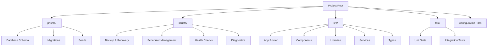
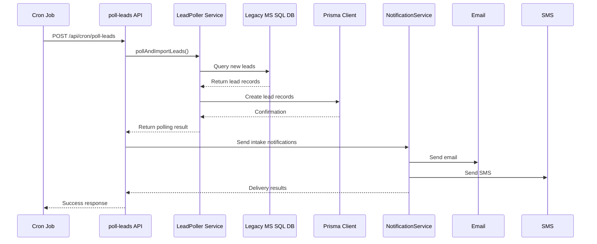
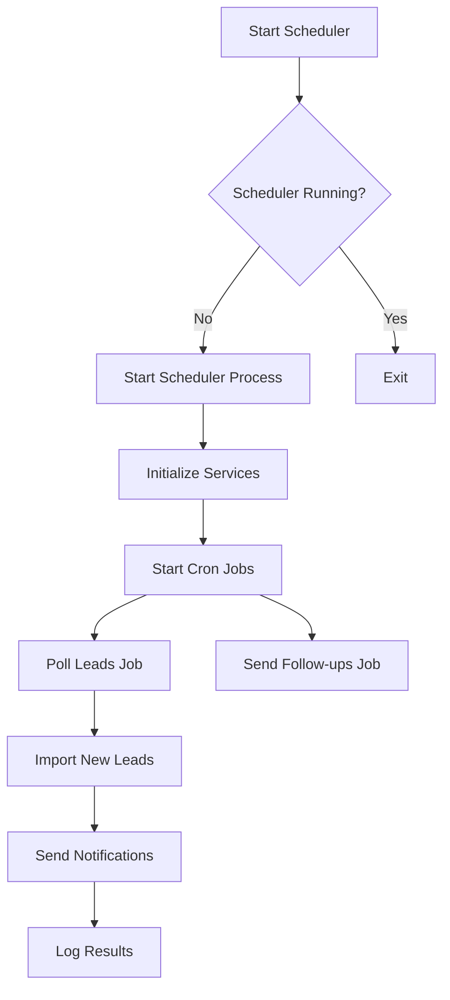

# Directory Structure

<cite>
**Referenced Files in This Document**   
- [README.md](file://README.md)
- [src/app/page.tsx](file://src/app/page.tsx)
- [src/app/dashboard/page.tsx](file://src/app/dashboard/page.tsx)
- [src/app/api/leads/route.ts](file://src/app/api/leads/route.ts)
- [src/app/api/leads/[id]/route.ts](file://src/app/api/leads/[id]/route.ts)
- [src/app/api/leads/[id]/status/route.ts](file://src/app/api/leads/[id]/status/route.ts)
- [src/app/api/cron/poll-leads/route.ts](file://src/app/api/cron/poll-leads/route.ts)
- [src/components/dashboard/LeadDashboard.tsx](file://src/components/dashboard/LeadDashboard.tsx)
- [src/components/dashboard/types.ts](file://src/components/dashboard/types.ts)
- [src/services/LeadPoller.ts](file://src/services/LeadPoller.ts)
- [src/services/LeadStatusService.ts](file://src/services/LeadStatusService.ts)
- [prisma/migrations/20250826125518_add_mobile_field/migration.sql](file://prisma/migrations/20250826125518_add_mobile_field/migration.sql)
- [scripts/start-scheduler.mjs](file://scripts/start-scheduler.mjs)
</cite>

## Table of Contents
1. [Top-Level Directory Overview](#top-level-directory-overview)
2. [Source Code Organization (src/)](#source-code-organization-src)
3. [Database Schema and Migrations (prisma/)](#database-schema-and-migrations-prisma)
4. [Operational Automation (scripts/)](#operational-automation-scripts)
5. [Testing Framework (test/)](#testing-framework-test)
6. [Navigation and Feature Location Guide](#navigation-and-feature-location-guide)
7. [Architectural Rationale](#architectural-rationale)

## Top-Level Directory Overview

The project follows a well-structured, modular architecture that separates concerns across different domains: database management, application logic, automation, and testing. This organization enhances maintainability, scalability, and developer onboarding.



**Diagram sources**
- [README.md](file://README.md)
- [project_structure](file://.)

**Section sources**
- [README.md](file://README.md)

## Source Code Organization (src/)

The `src/` directory contains all application source code, organized by functional responsibility using a combination of feature-based and layer-based patterns.

### App Router (app/)

The `app/` directory implements the Next.js App Router structure, organizing pages and API routes by feature area:

- **app/page.tsx**: Application entry point that redirects authenticated users to the dashboard
- **app/dashboard/page.tsx**: Main staff interface featuring the lead management dashboard
- **app/api/leads/route.ts**: REST API endpoint for retrieving paginated lead lists
- **app/api/leads/[id]/route.ts**: Endpoint for retrieving, updating, or deleting individual leads
- **app/api/leads/[id]/status/route.ts**: Endpoint for managing lead status transitions and history
- **app/api/cron/poll-leads/route.ts**: Cron-triggered endpoint for importing new leads from legacy systems

```mermaid
graph TD
A[app/] --> B[Pages]
A --> C[API Routes]
B --> B1[/]
B --> B2[dashboard/]
B --> B3[admin/]
B --> B4[auth/]
C --> C1[api/leads/]
C --> C2[api/cron/poll-leads/]
C --> C3[api/admin/]
C --> C4[api/auth/]
C1 --> C1a[GET - List Leads]
C1 --> C1b[POST - Create Lead]
C1a --> C1a1[Pagination]
C1a --> C1a2[Filtering]
C1a --> C1a3[Sorting]
C2 --> C2a[POST - Poll Legacy DB]
C2 --> C2b[GET - Health Check]
B2 --> B2a[LeadDashboard Component]
```

**Diagram sources**
- [src/app/page.tsx](file://src/app/page.tsx#L1-L53)
- [src/app/dashboard/page.tsx](file://src/app/dashboard/page.tsx#L1-L152)
- [src/app/api/leads/route.ts](file://src/app/api/leads/route.ts#L1-L167)

**Section sources**
- [src/app/page.tsx](file://src/app/page.tsx#L1-L53)
- [src/app/dashboard/page.tsx](file://src/app/dashboard/page.tsx#L1-L152)

### Components (components/)

The `components/` directory contains reusable UI elements organized by feature domain:

- **dashboard/**: Lead management interface components
  - `LeadDashboard.tsx`: Main dashboard container with filtering and pagination
  - `LeadList.tsx`: Table component for displaying lead records
  - `LeadSearchFilters.tsx`: Filter controls for search, status, and date ranges
  - `Pagination.tsx`: Pagination controls
  - `types.ts`: TypeScript interfaces for lead data structure

- **admin/**: Administrative interface components
- **auth/**: Authentication-related components
- **intake/**: Prospect intake workflow components

```mermaid
classDiagram
class Lead {
+id : number
+legacyLeadId : string | null
+campaignId : number
+email : string | null
+phone : string | null
+firstName : string | null
+lastName : string | null
+businessName : string | null
+mobile : string | null
+status : LeadStatus
+intakeToken : string | null
+createdAt : Date
+_count : { notes : number, documents : number }
}
class LeadFilters {
+search : string
+status : string
+dateFrom : string
+dateTo : string
}
class PaginationInfo {
+page : number
+limit : number
+totalCount : number
+totalPages : number
+hasNext : boolean
+hasPrev : boolean
}
class LeadDashboard {
-leads : Lead[]
-filters : LeadFilters
-pagination : PaginationInfo
-loading : boolean
-error : string | null
+fetchLeads() : Promise~void~
+handleFiltersChange() : void
+handlePageChange() : void
+handleSort() : void
}
LeadDashboard --> Lead : "displays"
LeadDashboard --> LeadFilters : "uses"
LeadDashboard --> PaginationInfo : "manages"
```

**Diagram sources**
- [src/components/dashboard/types.ts](file://src/components/dashboard/types.ts#L1-L65)
- [src/components/dashboard/LeadDashboard.tsx](file://src/components/dashboard/LeadDashboard.tsx#L1-L216)

**Section sources**
- [src/components/dashboard/types.ts](file://src/components/dashboard/types.ts#L1-L65)
- [src/components/dashboard/LeadDashboard.tsx](file://src/components/dashboard/LeadDashboard.tsx#L1-L216)

### Services (services/)

The `services/` directory contains business logic and integration services:

- **LeadPoller.ts**: Service for importing leads from legacy MS SQL Server database
- **LeadStatusService.ts**: Service for managing lead status transitions with validation and audit logging
- **NotificationService.ts**: Service for sending email and SMS notifications
- **FollowUpScheduler.ts**: Service for scheduling follow-up tasks
- **SystemSettingsService.ts**: Service for managing application settings



**Diagram sources**
- [src/app/api/cron/poll-leads/route.ts](file://src/app/api/cron/poll-leads/route.ts#L1-L193)
- [src/services/LeadPoller.ts](file://src/services/LeadPoller.ts#L1-L522)

**Section sources**
- [src/app/api/cron/poll-leads/route.ts](file://src/app/api/cron/poll-leads/route.ts#L1-L193)
- [src/services/LeadPoller.ts](file://src/services/LeadPoller.ts#L1-L522)

### Libraries (lib/)

The `lib/` directory contains utility functions and infrastructure components:

- **prisma.ts**: Prisma client instance
- **auth.ts**: Authentication configuration
- **logger.ts**: Logging utilities
- **errors.ts**: Custom error classes
- **legacy-db.ts**: Legacy database connection utilities
- **monitoring.ts**: Performance monitoring utilities

### Types (types/)

The `types/` directory contains TypeScript definition files for external libraries and global types.

## Database Schema and Migrations (prisma/)

The `prisma/` directory manages the PostgreSQL database schema and migration history.

### Schema Evolution

The migration history shows the incremental evolution of the database schema:

- **20240101000000_init**: Initial schema setup
- **20250728210021_initial_migration**: First major migration
- **20250730060039_add_lead_status_history**: Added status history tracking
- **20250811125856_add_system_settings**: Added system settings functionality
- **20250826082902_add_lead_business_fields**: Added business-related lead fields
- **20250826121117_add_comprehensive_lead_fields**: Added comprehensive lead data fields
- **20250826125518_add_mobile_field**: Added mobile phone field to leads table
- **20250826203101_change_amount_and_revenue_to_string**: Changed financial fields to string type

```sql
-- Example: Adding mobile field to leads table
-- File: prisma/migrations/20250826125518_add_mobile_field/migration.sql
ALTER TABLE "leads" ADD COLUMN "mobile" TEXT;
```

### Data Seeding

The directory includes seed scripts for different environments:
- **seed.ts**: Default seed data
- **seed-simple.ts**: Simplified seed data
- **seed-production.ts**: Production seed data

**Section sources**
- [prisma/migrations/20250826125518_add_mobile_field/migration.sql](file://prisma/migrations/20250826125518_add_mobile_field/migration.sql#L1-L1)
- [prisma/seed.ts](file://prisma/seed.ts)

## Operational Automation (scripts/)

The `scripts/` directory contains automation scripts for operations and maintenance:

### Shell Scripts (sh)
- **backup-database.sh**: Database backup operations
- **db-diagnostic.sh**: Database health diagnostics
- **disaster-recovery.sh**: Disaster recovery procedures
- **health-check.sh**: System health verification
- **start-scheduler.sh**: Scheduler startup script

### JavaScript Modules (mjs)
- **check-scheduler.mjs**: Scheduler status checker
- **emergency-cleanup.mjs**: Emergency data cleanup
- **prisma-migrate-and-start.mjs**: Database migration and application startup
- **start-scheduler.mjs**: Primary scheduler startup module
- **test-legacy-db.mjs**: Legacy database connectivity testing
- **test-notifications.mjs**: Notification system testing



**Diagram sources**
- [scripts/start-scheduler.mjs](file://scripts/start-scheduler.mjs)
- [scripts/start-scheduler.sh](file://scripts/start-scheduler.sh)

**Section sources**
- [scripts/start-scheduler.mjs](file://scripts/start-scheduler.mjs)

## Testing Framework (test/)

The `test/` directory contains test cases for critical integrations:

- **test-legacy-db.js**: Tests for legacy database connectivity and data retrieval
- **test-mailgun.ts**: Tests for MailGun email notification integration

These tests verify external service integrations and can be run manually or as part of CI/CD pipelines.

## Navigation and Feature Location Guide

This section provides guidance for developers to locate key functionality within the codebase.

### Lead Management Features

| Feature | Location |
|--------|----------|
| Lead List View | `src/app/dashboard/page.tsx` |
| Lead Dashboard Component | `src/components/dashboard/LeadDashboard.tsx` |
| Lead Data Model | `src/components/dashboard/types.ts` |
| List API Endpoint | `src/app/api/leads/route.ts` |
| Individual Lead API | `src/app/api/leads/[id]/route.ts` |
| Status Management API | `src/app/api/leads/[id]/status/route.ts` |
| Status Business Logic | `src/services/LeadStatusService.ts` |

### Automated Lead Processing

| Feature | Location |
|--------|----------|
| Lead Polling Cron Job | `src/app/api/cron/poll-leads/route.ts` |
| Lead Import Service | `src/services/LeadPoller.ts` |
| Legacy Database Connection | `src/lib/legacy-db.ts` |
| Notification Service | `src/services/NotificationService.ts` |

### Administrative Features

| Feature | Location |
|--------|----------|
| Admin Dashboard | `src/app/admin/page.tsx` |
| System Settings | `src/app/admin/settings/page.tsx` |
| User Management | `src/app/admin/users/page.tsx` |
| Notification Logs | `src/app/admin/notifications/page.tsx` |

### Development and Testing Tools

| Feature | Location |
|--------|----------|
| Legacy DB Test | `scripts/test-legacy-db.mjs` |
| Notifications Test | `scripts/test-notifications.mjs` |
| Scheduler Diagnostics | `scripts/check-scheduler.mjs` |
| Database Backup | `scripts/backup-database.sh` |

## Architectural Rationale

The directory structure follows established best practices for Next.js applications with a clear separation of concerns:

### Layered Architecture Benefits

The organization into distinct layers (components, services, lib) provides several advantages:

1. **Maintainability**: Changes to business logic are isolated in services, while UI changes are contained in components
2. **Testability**: Services can be tested independently of the UI layer
3. **Reusability**: Components and utilities can be reused across different parts of the application
4. **Scalability**: New features can be added following the established patterns

### Separation of Concerns

Each directory has a well-defined responsibility:
- **prisma/**: Data persistence and schema management
- **scripts/**: Operational automation and deployment tasks
- **src/**: Application logic and user interface
- **test/**: Quality assurance and integration verification

This separation ensures that developers can quickly locate relevant code and understand the boundaries between different system concerns.

### Evolutionary Design

The migration history demonstrates an evolutionary approach to database design, where schema changes are made incrementally based on changing business requirements. This approach reduces risk and allows for careful testing of each change.

The addition of fields like `mobile` and the conversion of financial fields to strings show responsiveness to business needs while maintaining data integrity through proper migration management.

### Automation Philosophy

The comprehensive set of scripts reflects a strong operational philosophy emphasizing:
- **Reliability**: Automated backups and disaster recovery
- **Observability**: Health checks and diagnostics
- **Consistency**: Standardized startup and migration procedures
- **Resilience**: Emergency cleanup and recovery capabilities

This automation infrastructure supports a robust production environment while reducing the operational burden on development teams.