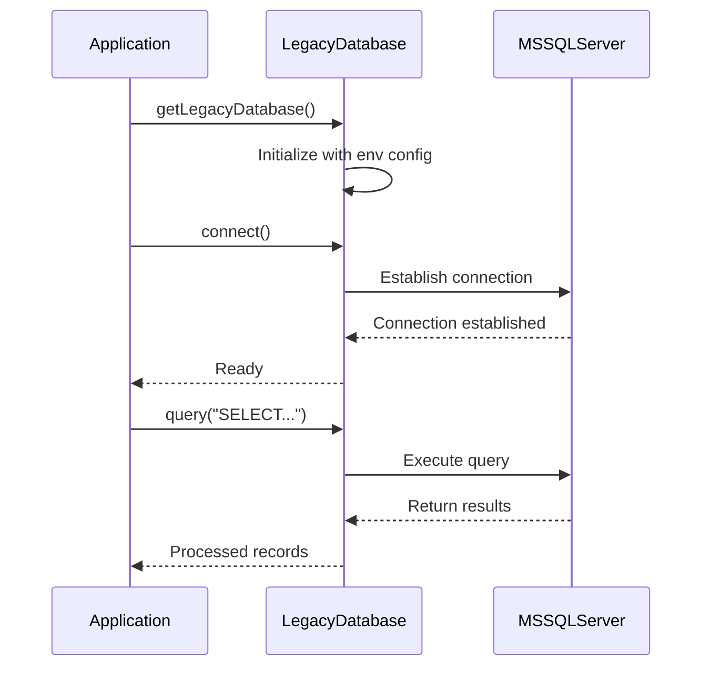
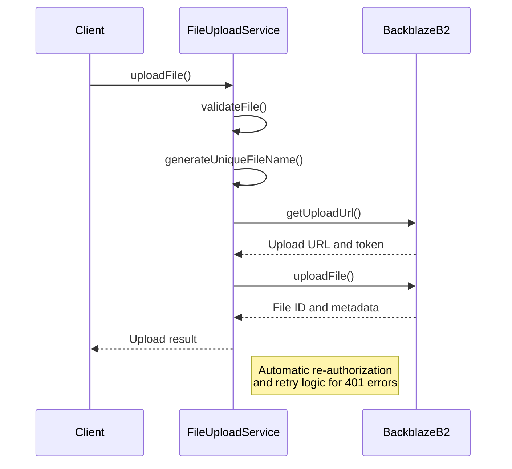
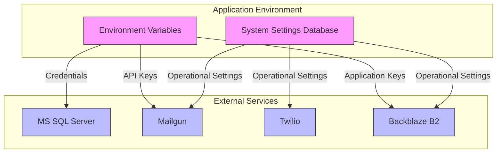
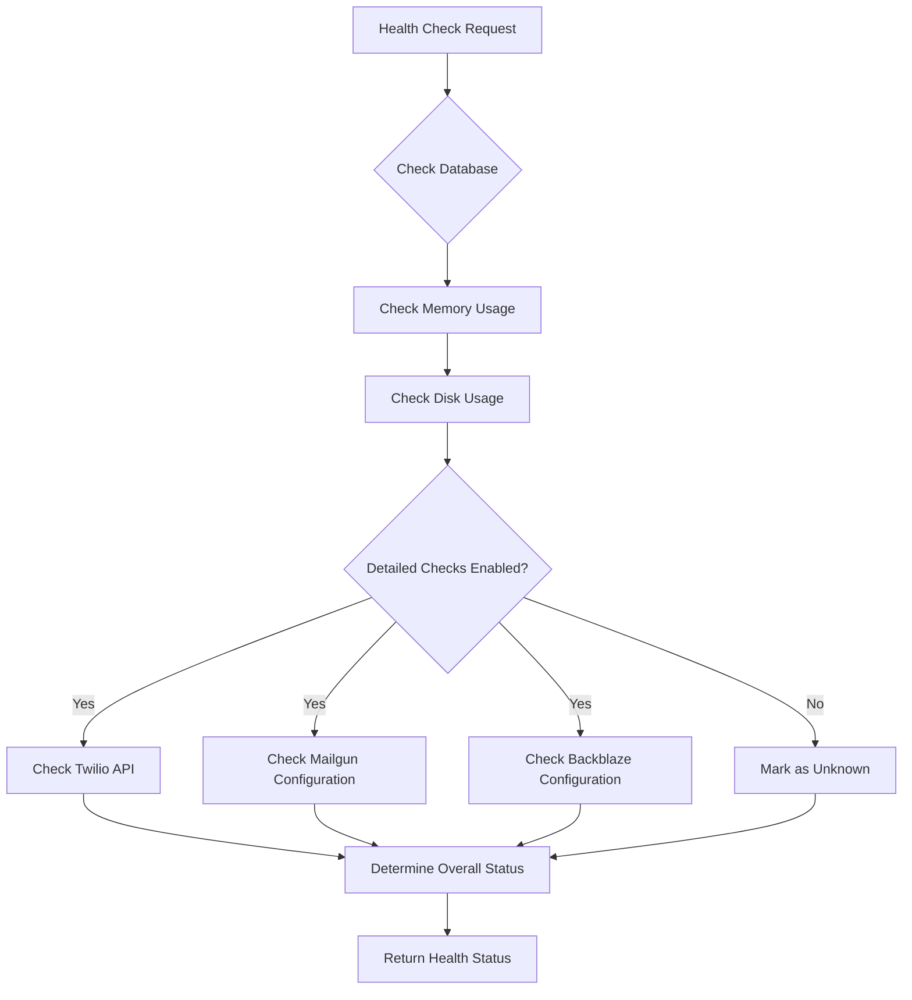

# External Integrations

<cite>
**Referenced Files in This Document**   
- [legacy-db.ts](file://src/lib/legacy-db.ts) - *Updated in recent commits*
- [notifications.ts](file://src/lib/notifications.ts) - *Updated in commit 437b7eba379b931644902e82b2d5b2aedd09c4eb*
- [NotificationService.ts](file://src/services/NotificationService.ts) - *Updated in recent commits*
- [FileUploadService.ts](file://src/services/FileUploadService.ts) - *Updated with automatic re-authorization and retry logic*
- [prisma.ts](file://src/lib/prisma.ts)
- [SystemSettingsService.ts](file://src/services/SystemSettingsService.ts) - *Updated in recent commits*
- [route.ts](file://src/app/api/admin/connectivity/legacy-db/route.ts)
- [route.ts](file://src/app/api/health/route.ts)
- [route.ts](file://src/app/api/cron/poll-leads/route.ts) - *Updated in commit 4ce58871fd242c8e4ae91e9876aaae17a07f6b01*
- [BackgroundJobScheduler.ts](file://src/services/BackgroundJobScheduler.ts) - *Updated in commit a060ead19978411dc6d922216818558859d4a8c0*
- [FollowUpScheduler.ts](file://src/services/FollowUpScheduler.ts) - *Updated in commit 4afe76401bf1776f1ba5a2f388b405595db028fa*
- [test-mailgun.ts](file://test/test-mailgun.ts) - *Updated in commit 4afe76401bf1776f1ba5a2f388b405595db028fa*
</cite>

## Update Summary
**Changes Made**   
- Updated Mailgun Email Integration section with enhanced email content details
- Added information about lead name formatting centralization
- Enhanced details on email personalization and contact information
- Updated implementation examples with current email templates
- Added details about button styling and link text consistency
- Updated Backblaze B2 Document Storage section with new automatic re-authorization and retry logic
- Added details about enhanced logging and error handling for B2 operations
- Updated testing strategies with new B2 test script information

## Table of Contents
1. [External Integrations](#external-integrations)
2. [Legacy MS SQL Server Database Integration](#legacy-ms-sql-server-database-integration)
3. [Mailgun Email Integration](#mailgun-email-integration)
4. [Twilio SMS Integration](#twilio-sms-integration)
5. [Backblaze B2 Document Storage](#backblaze-b2-document-storage)
6. [Configuration and Security](#configuration-and-security)
7. [Testing and Troubleshooting](#testing-and-troubleshooting)

## Legacy MS SQL Server Database Integration

The fund-track application integrates with a legacy MS SQL Server database to retrieve lead data. This integration is implemented through the `LegacyDatabase` class in `src/lib/legacy-db.ts`, which provides a singleton pattern for connection management.

### Connection Management
The integration uses the `mssql` package to establish and maintain connections. The `LegacyDatabase` class manages a connection pool and ensures only one active connection exists at a time. Connection parameters are configured through environment variables:

:LEGACY_DB_SERVER: Hostname or IP address of the MS SQL Server  
:LEGACY_DB_DATABASE: Database name (defaults to "LeadData2")  
:LEGACY_DB_USER: Authentication username  
:LEGACY_DB_PASSWORD: Authentication password  
:LEGACY_DB_PORT: Port number (defaults to 1433)  
:LEGACY_DB_ENCRYPT: Boolean flag for connection encryption  
:LEGACY_DB_TRUST_CERT: Boolean flag to trust server certificate  



**Section sources**
- [legacy-db.ts](file://src/lib/legacy-db.ts#L1-L157)
- [route.ts](file://src/app/api/admin/connectivity/legacy-db/route.ts#L1-L87)

## Mailgun Email Integration

The application uses Mailgun for sending email notifications to leads and staff. The integration is managed by the `NotificationService` class, which provides a unified interface for both email and SMS communications.

### Implementation Approach
Email functionality is implemented in the `NotificationService` class with dedicated methods for sending emails through the Mailgun API. The service uses the `mailgun.js` library with `form-data` for API requests.

Key features include:
- HTML and plain text email support
- Configurable sender address
- Asynchronous delivery
- Delivery status tracking

### Connection Management
The Mailgun client is initialized lazily when the first email is sent, preventing unnecessary connections during application startup. The client is reused for subsequent operations:

```typescript
private initializeClients(): void {
  if (!this.mailgunClient && this.config.mailgun.apiKey) {
    const mailgun = new Mailgun(formData);
    this.mailgunClient = mailgun.client({
      username: 'api',
      key: this.config.mailgun.apiKey,
    });
  }
}
```

### Error Handling and Retry Logic
The integration implements exponential backoff retry logic through the `executeWithRetry` method, which is shared with SMS functionality:

- Maximum retries: Configurable (default: 3)
- Base delay: Configurable (default: 1,000ms)
- Maximum delay: Hardcoded at 30,000ms
- Exponential backoff: delay = baseDelay × 2^attempt

Failed deliveries are logged in the `notificationLog` table with error details for troubleshooting.

### Configuration Requirements
:MAILGUN_API_KEY: API key for authentication  
:MAILGUN_DOMAIN: Sending domain configured in Mailgun  
:MAILGUN_FROM_EMAIL: Default sender email address  

### Enhanced Email Content
Recent updates have significantly enhanced the email content for merchant funding applications. The email templates now include specific instructions and contact details to improve user guidance:

- **Specific Instructions**: Clear guidance on required documents, specifically mentioning the need to submit the last 3 months' business bank statements
- **Contact Information**: Direct contact details including support email (support@merchantfunding.com) and phone number (+1 888-867-3087)
- **Personalization**: Enhanced personalization with proper capitalization of lead names
- **Consistent Link Text**: Standardized button text across all email templates for consistency
- **Improved Button Styling**: Consistent button styling with appropriate colors and formatting

The email content is now more informative and user-friendly, providing leads with all necessary information to complete their applications successfully.

### Implementation Example
```typescript
import { notificationService } from '@/services/NotificationService';

const result = await notificationService.sendEmail({
  to: 'lead@example.com',
  subject: 'Complete Your Merchant Funding Application',
  text: `Hi John,

Thank you for requesting information on merchant funding for your business. My name is Ryan and I'll be assisting you through the process. Please click on the link below to complete your application:

${intakeUrl}

This secure link will allow you to provide the required information and upload necessary documents. Please note that you will be prompted to submit the last 3 months' business bank statements.

Please call or email if you have any questions, otherwise we will be in touch shortly.

Best Regards,

Ryan
Funding Specialist

support@merchantfunding.com

+1 888-867-3087`,
  html: `
    <h2>Complete Your Merchant Funding Application</h2>
    <p>Hi John,</p>
    <p>Thank you for requesting information on merchant funding for your business. My name is Ryan and I'll be assisting you through the process. Please click on the link below to complete your application:</p>
    <p><a href="${intakeUrl}" style="background-color: #28a745; color: white; padding: 10px 20px; text-decoration: none; border-radius: 5px;">Click here to complete your application</a></p>
    <p>This secure link will allow you to provide the required information and upload necessary documents. Please note that you will be prompted to submit the last 3 months' business bank statements.</p>
    <p>Please call or email if you have any questions, otherwise we will be in touch shortly.</p>
    <p>Best Regards,</p>
    <p>Ryan<br>Funding Specialist</p>
    <p><a href="mailto:support@merchantfunding.com">support@merchantfunding.com</a></p>
    <p><a href="tel:+18888673087">+1 888-8673087</a></p>
  `,
  leadId: 123
});
```

**Section sources**   
- [notifications.ts](file://src/lib/notifications.ts#L1-L242) - *Updated with enhanced email templates*
- [route.ts](file://src/app/api/cron/poll-leads/route.ts#L1-L198) - *Updated with enhanced email content*
- [BackgroundJobScheduler.ts](file://src/services/BackgroundJobScheduler.ts#L1-L468) - *Updated with enhanced email content*

## Twilio SMS Integration

SMS notifications are delivered through Twilio, enabling text message communication with leads for application reminders and updates.

### Implementation Approach
The Twilio integration is implemented within the same `NotificationService` class as email functionality, providing a consistent interface for both communication channels. The service uses the official `twilio` Node.js library.

### Connection Management
Similar to Mailgun, the Twilio client is initialized lazily when needed:

```typescript
if (!this.twilioClient && this.config.twilio.accountSid && this.config.twilio.authToken) {
  this.twilioClient = twilio(this.config.twilio.accountSid, this.config.twilio.authToken);
}
```

This approach conserves resources by only establishing connections when required.

### Error Handling and Retry Logic
The integration shares the same retry mechanism as email notifications, using exponential backoff with configurable parameters. Each SMS attempt is logged in the database, and failures are recorded with error messages.

The service also implements rate limiting to prevent spam:
- Maximum of 2 messages per recipient per hour
- Maximum of 10 messages per lead per day

### Configuration Requirements
:TWILIO_ACCOUNT_SID: Twilio account identifier  
:TWILIO_AUTH_TOKEN: Authentication token  
:TWILIO_PHONE_NUMBER: Sending phone number  

### Implementation Example
```typescript
import { notificationService } from '@/services/NotificationService';

const result = await notificationService.sendSMS({
  to: '+1234567890',
  message: 'Complete your funding application: https://example.com/intake/abc123',
  leadId: 123
});
```

**Section sources**
- [NotificationService.ts](file://src/services/NotificationService.ts#L1-L472)

## Backblaze B2 Document Storage

The application uses Backblaze B2 for secure document storage, allowing leads to upload required documents during the application process.

### Implementation Approach
File storage is managed by the `FileUploadService` class, which provides methods for uploading, downloading, and managing files in Backblaze B2 buckets.

### Connection Management
The service establishes a connection to Backblaze B2 using application key credentials and authorizes the session upon first use:

```typescript
async initialize(): Promise<void> {
  try {
    if (this.isInitialized) {
      return;
    }
    await this.b2.authorize();
    this.isInitialized = true;
  } catch (error) {
    throw new Error("File storage service initialization failed");
  }
}
```

### Error Handling and Retry Logic
The integration now implements automatic re-authorization and retry logic for authorization errors (401 Unauthorized). The `executeWithRetry` method automatically handles authorization failures by:

- Detecting 401/Unauthorized errors during B2 operations
- Forcing re-authorization on the next retry attempt
- Implementing up to 2 retry attempts for authorization errors
- Maintaining state with `lastAuthTime` to track authorization freshness

The service automatically re-authorizes when more than 23 hours have passed since the last authorization (B2 tokens expire after 24 hours). This prevents authorization failures due to token expiration.



**Diagram sources**
- [FileUploadService.ts](file://src/services/FileUploadService.ts#L1-L432)

### Configuration Requirements
:B2_APPLICATION_KEY_ID: Backblaze application key identifier  
:B2_APPLICATION_KEY: Secret application key  
:B2_BUCKET_NAME: Target bucket name  
:B2_BUCKET_ID: Target bucket identifier  

### Security Considerations
The service implements several security measures:
- Unique file naming with timestamp and hash to prevent conflicts
- Secure download URLs with configurable expiration (default: 24 hours)
- File validation to prevent malicious uploads
- Server-side authorization for all operations
- Automatic token refresh to prevent authorization failures

### Implementation Example
```typescript
import { fileUploadService } from '@/services/FileUploadService';

const result = await fileUploadService.uploadFile(
  fileBuffer,
  'document.pdf',
  'application/pdf',
  123 // leadId
);

const downloadInfo = await fileUploadService.getDownloadUrl(
  result.fileId,
  result.fileName,
  24 // expiration hours
);
```

**Section sources**
- [FileUploadService.ts](file://src/services/FileUploadService.ts#L1-L432)
- [deploy-b2-fix.sh](file://scripts/deploy-b2-fix.sh#L1-L63)
- [test-b2-connection.mjs](file://scripts/test-b2-connection.mjs#L1-L57)

## Configuration and Security

### Configuration Management
External service configurations are managed through a combination of environment variables and database-stored settings:

**Environment Variables (Secret Configuration)**
- Database credentials
- API keys and authentication tokens
- Sensitive connection parameters

**Database Settings (Operational Configuration)**
- Notification enable/disable flags
- Retry attempt counts
- Retry delay intervals
- Rate limiting parameters

The `SystemSettingsService` provides a caching layer for database settings with a 5-minute TTL to balance performance and freshness.

### Security Considerations
#### Credential Protection
- All API keys and credentials are stored in environment variables, not in code
- Environment variables are loaded at runtime and never exposed in client-side code
- The application follows the principle of least privilege for service accounts

#### Data Security
- Backblaze B2 files are stored with unique, unpredictable names
- Download URLs are time-limited and require authorization tokens
- All external API calls use HTTPS/TLS encryption
- Database connections can be encrypted based on configuration

#### Access Control
- Administrative access required to view connectivity status
- API routes validate authentication before exposing integration details
- Environment configuration is never exposed in client responses



**Diagram sources**
- [SystemSettingsService.ts](file://src/services/SystemSettingsService.ts#L1-L352)
- [NotificationService.ts](file://src/services/NotificationService.ts#L1-L472)
- [FileUploadService.ts](file://src/services/FileUploadService.ts#L1-L432)

**Section sources**
- [SystemSettingsService.ts](file://src/services/SystemSettingsService.ts#L1-L352)
- [NotificationService.ts](file://src/services/NotificationService.ts#L1-L472)
- [FileUploadService.ts](file://src/services/FileUploadService.ts#L1-L432)

## Testing and Troubleshooting

### Testing Strategies
The application provides multiple testing mechanisms for external dependencies:

**Health Check Endpoint**
The `/api/health` route performs comprehensive system checks, including external service connectivity:



**Diagram sources**
- [route.ts](file://src/app/api/health/route.ts#L1-L294)

**Dedicated Test Scripts**
- `scripts/test-notifications.mjs`: CLI tool for testing email and SMS delivery
- `test/test-mailgun.ts`: Comprehensive Mailgun integration tests with multiple test cases
- `scripts/test-b2-connection.mjs`: Tests B2 authorization, file listing, and download URL generation
- Admin interface connectivity tests for legacy database

The `test/test-mailgun.ts` script includes comprehensive test cases for various email scenarios:
- Basic integration test
- Initial intake notification (basic and enhanced versions)
- Follow-up reminders at different intervals (3-hour, 24-hour, 72-hour)
- General follow-up reminders

The `scripts/test-b2-connection.mjs` script verifies the new re-authorization and retry logic by:
- Testing B2 authorization
- Listing files for a specific lead
- Generating download URLs
- Validating the complete B2 operation flow

### Fallback Mechanisms
The application implements several fallback strategies during service outages:

- **Graceful Degradation**: When external services are unavailable, the application continues core operations
- **Status Monitoring**: Health checks detect service degradation
- **Error Logging**: All integration failures are logged for analysis
- **Admin Alerts**: System administrators can monitor integration status
- **Automatic Re-authorization**: B2 service automatically refreshes expired tokens

### Common Issues and Troubleshooting

**Connection Failures**
- Verify environment variables are correctly set
- Check network connectivity to external services
- Validate credentials and API keys
- Review firewall and security group settings

**Authentication Errors**
- Confirm API keys have not expired
- Verify account status with service providers
- Check for IP restrictions on API access
- Validate key permissions and scopes
- For B2 specifically, ensure automatic re-authorization is working (check logs for re-authorization events)

**Performance Issues**
- Monitor rate limits imposed by external services
- Review retry logic configuration
- Check for connection pool exhaustion
- Analyze network latency between application and services

**Data Validation Errors**
- Ensure file types and sizes comply with service requirements
- Validate email addresses and phone numbers
- Check character encoding in message content
- Verify required fields are populated

**Troubleshooting Tools**
- Admin connectivity check interface (`/admin/connectivity/legacy-db`)
- Notification log viewer (`/admin/notifications`)
- System settings audit trail
- Server logs with detailed error information
- Mailgun test script (`test/test-mailgun.ts`) for comprehensive email testing
- B2 connection test script (`scripts/test-b2-connection.mjs`) for verifying B2 authorization and operations
- B2 environment validation script (`scripts/validate-b2-env.mjs`) for checking B2 configuration format

**Section sources**
- [route.ts](file://src/app/api/health/route.ts#L1-L294)
- [route.ts](file://src/app/api/admin/connectivity/legacy-db/route.ts#L1-L87)
- [test-mailgun.ts](file://test/test-mailgun.ts#L1-L401)
- [FollowUpScheduler.ts](file://src/services/FollowUpScheduler.ts#L1-L495)
- [test-b2-connection.mjs](file://scripts/test-b2-connection.mjs#L1-L57)
- [validate-b2-env.mjs](file://scripts/validate-b2-env.mjs#L1-L123)