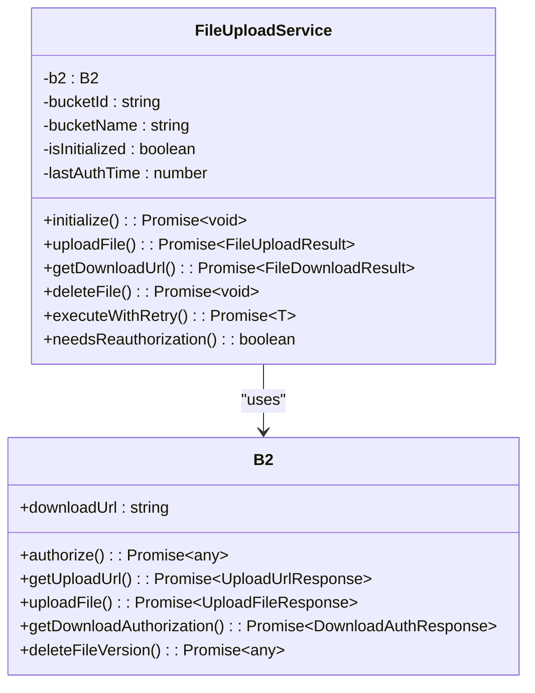
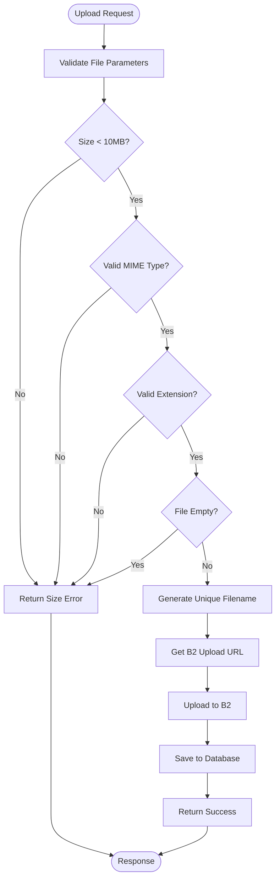
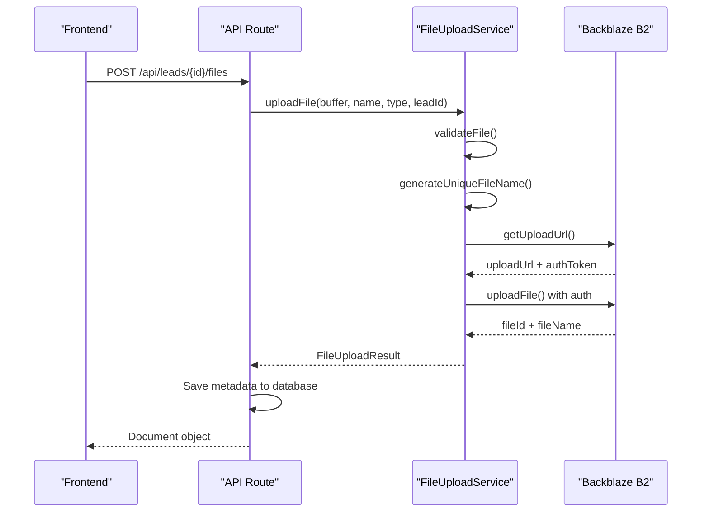
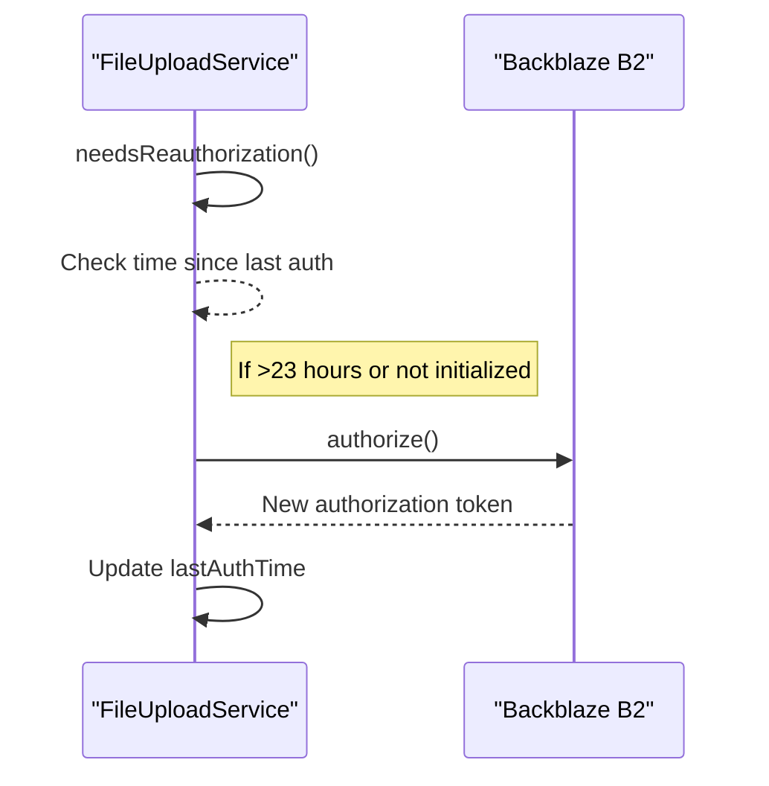
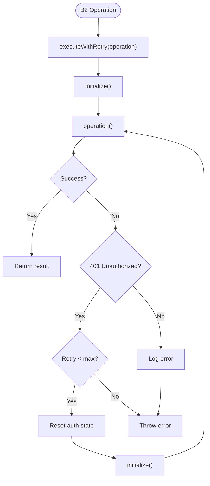
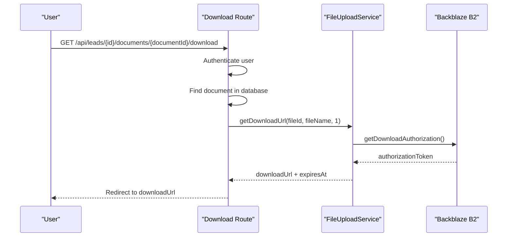

# File Storage Integration

<cite>
**Referenced Files in This Document**   
- [FileUploadService.ts](file://src/services/FileUploadService.ts) - *Updated with automatic re-authorization and retry logic*
- [route.ts](file://src/app/api/leads/[id]/files/route.ts) - *Uses FileUploadService for file operations*
- [route.ts](file://src/app/api/leads/[id]/documents/[documentId]/download/route.ts) - *Uses FileUploadService for download operations*
- [Step2Form.tsx](file://src/components/intake/Step2Form.tsx) - *Frontend component for file uploads*
- [backblaze-b2.d.ts](file://src/types/backblaze-b2.d.ts) - *Type definitions for B2 SDK*
- [migration.sql](file://prisma/migrations/20240101000000_init/migration.sql) - *Database schema for document metadata*
- [deploy-b2-fix.sh](file://scripts/deploy-b2-fix.sh) - *Deployment script for B2 authorization fix*
- [test-b2-connection.mjs](file://scripts/test-b2-connection.mjs) - *Test script for B2 connection*
</cite>

## Update Summary
**Changes Made**   
- Added comprehensive documentation for automatic re-authorization and retry logic in FileUploadService
- Updated B2 Configuration and Authentication section to reflect new authorization flow
- Enhanced FileUploadService Implementation with detailed retry mechanism explanation
- Added new section for Retry and Re-authorization Logic
- Updated Troubleshooting Guide with new solutions for authorization issues
- Added deployment and testing scripts to referenced files

## Table of Contents
1. [Introduction](#introduction)
2. [B2 Configuration and Authentication](#b2-configuration-and-authentication)
3. [FileUploadService Implementation](#fileuploadservice-implementation)
4. [Retry and Re-authorization Logic](#retry-and-re-authorization-logic)
5. [File Upload Process](#file-upload-process)
6. [File Download Process](#file-download-process)
7. [File Deletion Process](#file-deletion-process)
8. [Metadata Handling and Database Integration](#metadata-handling-and-database-integration)
9. [Security Considerations](#security-considerations)
10. [Troubleshooting Guide](#troubleshooting-guide)

## Introduction
This document provides comprehensive documentation for the Backblaze B2 file storage integration within the fund-track application. The system enables secure file uploads, downloads, and management for loan application documents, with integration between the frontend intake forms, backend API routes, and the B2 cloud storage service. The implementation includes robust validation, secure authentication, and proper error handling to ensure reliable file operations.

## B2 Configuration and Authentication
The B2 integration is configured through environment variables and initialized using application keys. The configuration establishes a secure connection to the designated B2 bucket.



**Diagram sources**
- [FileUploadService.ts](file://src/services/FileUploadService.ts#L0-L57)
- [backblaze-b2.d.ts](file://src/types/backblaze-b2.d.ts#L0-L67)

**Section sources**
- [FileUploadService.ts](file://src/services/FileUploadService.ts#L0-L57)

## FileUploadService Implementation
The FileUploadService class provides a comprehensive interface for B2 operations, handling file validation, upload, download, and deletion with proper error handling and logging.

### File Validation
The service implements strict validation to prevent malicious file uploads and ensure data integrity:

- **Size validation**: Files are limited to 10MB by default
- **MIME type validation**: Only specific file types are allowed
- **Extension validation**: File extensions are verified against allowed list
- **Content validation**: Empty files are rejected



**Diagram sources**
- [FileUploadService.ts](file://src/services/FileUploadService.ts#L57-L99)

**Section sources**
- [FileUploadService.ts](file://src/services/FileUploadService.ts#L57-L99)

### Upload Process
The file upload process follows a secure workflow using B2's authorization mechanism:

1. Initialize B2 connection if not already established
2. Validate file against size, type, and content requirements
3. Generate unique filename with lead ID, timestamp, and hash
4. Obtain upload URL and authorization token from B2
5. Upload file with metadata including original filename and lead ID
6. Return upload result with file information



**Diagram sources**
- [FileUploadService.ts](file://src/services/FileUploadService.ts#L147-L195)
- [route.ts](file://src/app/api/leads/[id]/files/route.ts#L46-L87)

**Section sources**
- [FileUploadService.ts](file://src/services/FileUploadService.ts#L147-L195)

## Retry and Re-authorization Logic
The FileUploadService now includes automatic re-authorization and retry logic to handle B2 token expiration and transient errors.

### Automatic Re-authorization
The service automatically detects when B2 authorization tokens need to be refreshed:

- **Token expiry**: B2 tokens expire after 24 hours
- **Re-authentication buffer**: Tokens are refreshed after 23 hours (1 hour before expiry)
- **State tracking**: The service tracks initialization state and last authorization time
- **Conditional authorization**: Authorization only occurs when needed



**Section sources**
- [FileUploadService.ts](file://src/services/FileUploadService.ts#L52-L65)

### Retry Mechanism
The service implements a robust retry mechanism for B2 operations:

- **Retry limit**: Maximum of 2 retries for authorization errors
- **Error detection**: Specifically identifies 401 Unauthorized errors
- **Automatic re-auth**: Forces re-authorization on authorization errors
- **Comprehensive logging**: Logs retry attempts and error details



**Section sources**
- [FileUploadService.ts](file://src/services/FileUploadService.ts#L67-L139)

### Implementation Details
The retry and re-authorization logic is implemented through two key methods:

**needsReauthorization()**: Determines if re-authorization is required based on time elapsed since last authorization.

**executeWithRetry()**: Wraps B2 operations with retry logic, automatically handling authorization errors by forcing re-authorization and retrying the operation.

This implementation ensures reliable file operations even when B2 authorization tokens expire, without requiring application restarts or manual intervention.

**Section sources**
- [FileUploadService.ts](file://src/services/FileUploadService.ts#L52-L139)
- [deploy-b2-fix.sh](file://scripts/deploy-b2-fix.sh)
- [test-b2-connection.mjs](file://scripts/test-b2-connection.mjs)

## File Upload Process
The file upload process integrates frontend components with backend services to provide a seamless user experience for document submission.

### Frontend Implementation
The intake form component (Step2Form) provides a drag-and-drop interface for uploading financial documents:

- Users can upload exactly 3 documents (bank statements or financial records)
- Supported formats: PDF, JPG, PNG, DOCX
- Maximum file size: 10MB per file
- Real-time validation and error feedback
- Progress indicators during upload

**Section sources**
- [Step2Form.tsx](file://src/components/intake/Step2Form.tsx#L40-L93)

### Backend API Route
The API route handles file uploads from both staff and intake forms, performing authentication and validation:

```typescript
export async function POST(request: NextRequest, { params }: RouteParams) {
  // Authentication check
  const session = await getServerSession(authOptions);
  if (!session) return unauthorized();
  
  // Parse form data and validate file
  const formData = await request.formData();
  const file = formData.get("file") as File;
  
  // Validate file type and size
  if (!allowedTypes.includes(file.type)) {
    return errorResponse("Invalid file type");
  }
  
  if (file.size > maxSize) {
    return errorResponse("File size too large");
  }
  
  // Convert to buffer and upload
  const arrayBuffer = await file.arrayBuffer();
  const buffer = Buffer.from(arrayBuffer);
  
  const uploadResult = await fileUploadService.uploadFile(
    buffer,
    file.name,
    file.type,
    leadId
  );
  
  // Save metadata to database
  const document = await prisma.document.create({
    data: {
      leadId,
      filename: uploadResult.fileName,
      originalFilename: file.name,
      fileSize: file.size,
      mimeType: file.type,
      b2FileId: uploadResult.fileId,
      b2BucketName: uploadResult.bucketName,
      uploadedBy: parseInt(session.user.id),
    }
  });
  
  return NextResponse.json({ document });
}
```

**Section sources**
- [route.ts](file://src/app/api/leads/[id]/files/route.ts#L0-L253)

## File Download Process
The file download process generates secure, time-limited URLs to prevent unauthorized access to sensitive documents.

### Secure URL Generation
The download URL generation follows B2's security model:

1. Authenticate with B2 service
2. Request download authorization with filename prefix and expiration
3. Construct download URL with authorization token
4. Set expiration time (default: 1 hour for intake, 24 hours for staff)



**Diagram sources**
- [route.ts](file://src/app/api/leads/[id]/documents/[documentId]/download/route.ts#L0-L80)
- [FileUploadService.ts](file://src/services/FileUploadService.ts#L190-L237)

**Section sources**
- [route.ts](file://src/app/api/leads/[id]/documents/[documentId]/download/route.ts#L0-L80)

## File Deletion Process
The file deletion process ensures that documents are properly removed from both B2 storage and the application database.

### Deletion Workflow
When a document is deleted:

1. Authenticate the requesting user
2. Verify the document belongs to the specified lead
3. Attempt to delete the file from B2 (continue on failure)
4. Remove the document record from the database
5. Log the deletion for audit purposes

The implementation includes fault tolerance by continuing with database deletion even if B2 deletion fails, ensuring data consistency in the application.

**Section sources**
- [route.ts](file://src/app/api/leads/[id]/files/route.ts#L200-L252)

## Metadata Handling and Database Integration
The system maintains file metadata in the PostgreSQL database while storing the actual files in B2, creating a secure and efficient storage architecture.

### Database Schema
The documents table stores metadata about uploaded files:

```sql
CREATE TABLE "documents" (
    "id" SERIAL NOT NULL,
    "lead_id" INTEGER NOT NULL,
    "filename" TEXT NOT NULL,
    "original_filename" TEXT NOT NULL,
    "file_size" INTEGER NOT NULL,
    "mime_type" TEXT NOT NULL,
    "b2_file_id" TEXT NOT NULL,
    "b2_bucket_name" TEXT NOT NULL,
    "uploaded_by" INTEGER,
    "uploaded_at" TIMESTAMP(3) NOT NULL DEFAULT CURRENT_TIMESTAMP,
    CONSTRAINT "documents_pkey" PRIMARY KEY ("id")
);
```

This design separates sensitive file data (stored in B2) from metadata (stored in the application database), enhancing security and enabling efficient querying.

**Diagram sources**
- [migration.sql](file://prisma/migrations/20240101000000_init/migration.sql#L47-L88)

**Section sources**
- [migration.sql](file://prisma/migrations/20240101000000_init/migration.sql#L47-L88)

## Security Considerations
The implementation includes multiple security measures to protect against common threats:

### Authentication and Authorization
- All file operations require authenticated sessions
- Users can only access documents belonging to leads they have permission to view
- Staff members can only delete documents they uploaded (enforced at business logic level)

### Input Validation
- Strict MIME type validation prevents file type spoofing
- File size limits prevent denial-of-service attacks
- Empty file detection prevents storage of invalid content
- Server-side validation complements client-side checks

### Secure File Naming
Files are stored with generated names that include:
- Lead ID for organization
- Timestamp for uniqueness
- MD5 hash for collision prevention
- Original extension preserved

This prevents path traversal attacks and ensures unique filenames.

### Temporary Access
Download URLs are time-limited (1-24 hours) and require B2 authorization tokens, preventing long-term unauthorized access to documents.

## Troubleshooting Guide
This section addresses common issues encountered with the file storage integration.

### Upload Timeouts
**Symptoms**: Upload requests fail with timeout errors, especially for larger files.

**Solutions**:
- Check network connectivity and stability
- Verify B2 service status
- Increase server timeout settings if necessary
- Implement chunked uploads for very large files (currently limited to 10MB)

### Authentication Failures
**Symptoms**: "Unauthorized" errors or B2 authorization failures.

**Solutions**:
- Verify B2 application key ID and key are correctly set in environment variables
- Check that B2 bucket ID and name match the configured values
- Ensure the application key has read/write permissions for the bucket
- Restart the application to reinitialize the B2 connection
- Use the test script to verify connection: `node scripts/test-b2-connection.mjs`
- Deploy with the B2 fix script: `./scripts/deploy-b2-fix.sh`

### Bucket Permission Errors
**Symptoms**: "Insufficient permissions" or "Access denied" errors from B2.

**Solutions**:
- Verify the B2 application key has the required capabilities:
  - readFiles
  - writeFiles
  - deleteFiles
- Check that the key is authorized for the specific bucket
- Regenerate the application key with proper permissions if needed

### File Validation Errors
**Symptoms**: "Invalid file type" or "File size too large" errors.

**Solutions**:
- Ensure files match the allowed MIME types and extensions
- Compress large files before upload
- Verify that file type detection is working correctly (some files may have incorrect extensions)
- Check that server-side validation matches client-side validation rules

### Re-authorization Issues
**Symptoms**: Intermittent authorization failures that resolve after retries.

**Solutions**:
- Monitor the automatic re-authorization logs in the application
- Verify that the `needsReauthorization()` method is functioning correctly
- Check that the `lastAuthTime` is being updated after successful authorization
- Ensure the retry logic is properly handling 401 errors
- Validate the implementation with the test script: `node scripts/test-b2-connection.mjs`

**Section sources**
- [FileUploadService.ts](file://src/services/FileUploadService.ts#L52-L139)
- [FileUploadService.ts](file://src/services/FileUploadService.ts#L57-L99)
- [route.ts](file://src/app/api/leads/[id]/files/route.ts#L46-L87)
- [test-b2-connection.mjs](file://scripts/test-b2-connection.mjs)
- [deploy-b2-fix.sh](file://scripts/deploy-b2-fix.sh)