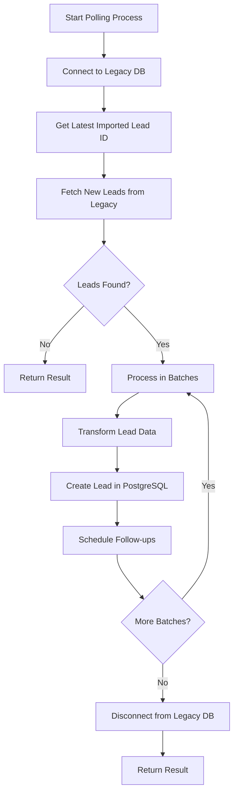
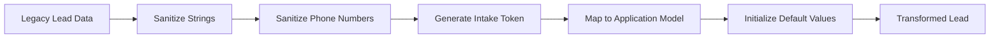

# Legacy Database Integration

<cite>
**Referenced Files in This Document**   
- [legacy-db.ts](file://src/lib/legacy-db.ts)
- [LeadPoller.ts](file://src/services/LeadPoller.ts)
- [prisma.ts](file://src/lib/prisma.ts)
- [test-legacy-db.mjs](file://scripts/test-legacy-db.mjs)
- [route.ts](file://src/app/api/dev/test-legacy-db/route.ts)
- [db-diagnostic.sh](file://scripts/db-diagnostic.sh)
</cite>

## Table of Contents
1. [Introduction](#introduction)
2. [Connection Configuration](#connection-configuration)
3. [Connection Pooling Strategy](#connection-pooling-strategy)
4. [Query Execution Patterns](#query-execution-patterns)
5. [Error Handling and Retry Mechanisms](#error-handling-and-retry-mechanisms)
6. [LeadPoller Service Implementation](#leadpoller-service-implementation)
7. [Data Transformation and Ingestion](#data-transformation-and-ingestion)
8. [Security Practices](#security-practices)
9. [Network Configuration Requirements](#network-configuration-requirements)
10. [Performance Considerations](#performance-considerations)
11. [Troubleshooting Guide](#troubleshooting-guide)

## Introduction
This document provides comprehensive documentation for the legacy MS SQL Server database integration within the fund-track application. The system enables periodic polling of lead data from a legacy database and ingests it into a modern PostgreSQL database via Prisma ORM. The integration handles connection management, query execution, data transformation, error handling, and security considerations. This documentation covers the implementation details of the `legacy-db.ts` module, the `LeadPoller` service, and related components that facilitate this critical data synchronization process.

## Connection Configuration
The legacy database connection is configured using environment variables, following the twelve-factor app methodology for configuration management. The configuration is centralized in the `getLegacyDatabase()` factory function within `legacy-db.ts`.

**Configuration Parameters**
- **LEGACY_DB_SERVER**: Hostname or IP address of the MS SQL Server instance
- **LEGACY_DB_DATABASE**: Database name (defaults to "LeadData2")
- **LEGACY_DB_USER**: Authentication username
- **LEGACY_DB_PASSWORD**: Authentication password
- **LEGACY_DB_PORT**: Port number (defaults to 1433)
- **LEGACY_DB_ENCRYPT**: Boolean flag for connection encryption (defaults to false)
- **LEGACY_DB_TRUST_CERT**: Boolean flag to trust server certificate (defaults to true)
- **LEGACY_DB_REQUEST_TIMEOUT**: Query timeout in milliseconds (defaults to 30,000)
- **LEGACY_DB_CONNECTION_TIMEOUT**: Connection timeout in milliseconds (defaults to 15,000)

The configuration object is defined with sensible defaults while allowing override through environment variables:

```typescript
const config: LegacyDbConfig = {
  server: process.env.LEGACY_DB_SERVER || '',
  database: process.env.LEGACY_DB_DATABASE || 'LeadData2',
  user: process.env.LEGACY_DB_USER || '',
  password: process.env.LEGACY_DB_PASSWORD || '',
  port: process.env.LEGACY_DB_PORT ? parseInt(process.env.LEGACY_DB_PORT) : 1433,
  options: {
    encrypt: process.env.LEGACY_DB_ENCRYPT === 'true',
    trustServerCertificate: process.env.LEGACY_DB_TRUST_CERT === 'true',
    requestTimeout: process.env.LEGACY_DB_REQUEST_TIMEOUT ? parseInt(process.env.LEGACY_DB_REQUEST_TIMEOUT) : 30000,
    connectionTimeout: process.env.LEGACY_DB_CONNECTION_TIMEOUT ? parseInt(process.env.LEGACY_DB_CONNECTION_TIMEOUT) : 15000,
    enableArithAbort: true,
    abortTransactionOnError: true,
  },
};
```

**Section sources**
- [legacy-db.ts](file://src/lib/legacy-db.ts#L130-L157)

## Connection Pooling Strategy
The integration implements a connection pooling strategy using the `mssql` package to efficiently manage database connections. The `LegacyDatabase` class encapsulates the connection pool as a private property, ensuring proper lifecycle management.

### Singleton Pattern Implementation
The connection pool follows a singleton pattern through the `getLegacyDatabase()` function, which ensures only one instance of the `LegacyDatabase` class exists throughout the application lifecycle:

```typescript
let legacyDb: LegacyDatabase | null = null;

export function getLegacyDatabase(): LegacyDatabase {
  if (!legacyDb) {
    // Configuration initialization
    legacyDb = new LegacyDatabase(config);
  }
  return legacyDb;
}
```

This approach prevents multiple connection pools from being created, conserving resources and ensuring consistent connection state across the application.

### Connection Lifecycle Management
The connection pool is created on-demand when the `connect()` method is first called and is maintained until explicitly disconnected:

```typescript
async connect(): Promise<void> {
  try {
    if (this.pool) {
      return; // Already connected
    }
    
    this.pool = new sql.ConnectionPool(this.config);
    await this.pool.connect();
  } catch (error) {
    console.error('❌ Failed to connect to legacy database:', error);
    throw new Error(`Legacy database connection failed: ${error instanceof Error ? error.message : 'Unknown error'}`);
  }
}
```

The `disconnect()` method properly closes the connection pool and resets the internal state:

```typescript
async disconnect(): Promise<void> {
  try {
    if (this.pool) {
      await this.pool.close();
      this.pool = null;
    }
  } catch (error) {
    console.error('Error disconnecting from legacy database:', error);
  }
}
```

The connection is established at the beginning of the polling process and closed in the `finally` block to ensure proper cleanup regardless of success or failure.

**Section sources**
- [legacy-db.ts](file://src/lib/legacy-db.ts#L56-L97)
- [legacy-db.ts](file://src/lib/legacy-db.ts#L130-L157)

## Query Execution Patterns
The integration implements a parameterized query execution pattern to safely interact with the legacy database while preventing SQL injection vulnerabilities.

### Parameterized Query Interface
The `query()` method accepts both the SQL query text and an optional parameters object, which is used to safely bind values to the query:

```typescript
async query<T = any>(queryText: string, parameters?: Record<string, any>): Promise<T[]> {
  if (!this.pool) {
    throw new Error('Database not connected. Call connect() first.');
  }

  try {
    const request = this.pool.request();

    // Add parameters if provided
    if (parameters) {
      Object.entries(parameters).forEach(([key, value]) => {
        request.input(key, value);
      });
    }

    const result = await request.query(queryText);
    return result.recordset as T[];
  } catch (error) {
    console.error('Legacy database query failed:', error);
    throw new Error(`Query execution failed: ${error instanceof Error ? error.message : 'Unknown error'}`);
  }
}
```

### Lead Data Retrieval Query
The `LeadPoller` service constructs complex SQL queries to retrieve lead data by joining the main `Leads` table with campaign-specific tables. The query construction handles multiple campaigns by iterating through the configured campaign IDs:

```typescript
private async fetchLeadsFromLegacy(minLeadId: number = 0): Promise<LegacyLead[]> {
  const allLeads: LegacyLead[] = [];

  // Query each campaign table separately since they have variable names
  for (const campaignId of this.config.campaignIds) {
    const tableName = `Leads_${campaignId}`;
    
    const query = `
      SELECT 
        l.LeadID as ID,
        l.CampaignID,
        l.FirstName,
        l.LastName,
        l.Email,
        l.Phone,
        l.Address,
        l.City,
        l.State,
        l.ZipCode,
        l.PostDT as CreatedDate,
        c.BusinessName,
        c.Industry,
        c.YearsInBusiness,
        c.AmountNeeded,
        c.MonthlyRevenue
      FROM [dbo].[Leads] l
      INNER JOIN [web].[${tableName}] c ON l.LeadID = c.LeadID
      WHERE l.LeadID > ${minLeadId} 
        AND l.CampaignID = ${campaignId}
      ORDER BY l.LeadID ASC
    `;
    
    const leads = await this.legacyDb.query<LegacyLead>(query);
    allLeads.push(...leads);
  }
  
  return allLeads;
}
```

**Section sources**
- [legacy-db.ts](file://src/lib/legacy-db.ts#L96-L97)
- [LeadPoller.ts](file://src/services/LeadPoller.ts#L173-L208)

## Error Handling and Retry Mechanisms
The integration implements comprehensive error handling for transient failures, though explicit retry mechanisms are limited to certain operations.

### Connection and Query Error Handling
The `LegacyDatabase` class includes robust error handling for both connection and query operations:

```typescript
async connect(): Promise<void> {
  try {
    if (this.pool) {
      return;
    }
    
    this.pool = new sql.ConnectionPool(this.config);
    await this.pool.connect();
    console.log('✅ Connected to legacy MS SQL Server database');
  } catch (error) {
    console.error('❌ Failed to connect to legacy database:', error);
    throw new Error(`Legacy database connection failed: ${error instanceof Error ? error.message : 'Unknown error'}`);
  }
}
```

Query operations are similarly protected with try-catch blocks that provide meaningful error messages:

```typescript
async query<T = any>(queryText: string, parameters?: Record<string, any>): Promise<T[]> {
  // ... query execution
  } catch (error) {
    console.error('Legacy database query failed:', error);
    throw new Error(`Query execution failed: ${error instanceof Error ? error.message : 'Unknown error'}`);
  }
}
```

### Transient Failure Handling in LeadPoller
The `LeadPoller` service implements error handling at multiple levels, allowing partial success when some operations fail:

```typescript
for (const campaignId of this.config.campaignIds) {
  try {
    const leads = await this.legacyDb.query<LegacyLead>(query);
    allLeads.push(...leads);
  } catch (error) {
    console.error(`❌ Failed to fetch leads from ${tableName}:`, error);
    // Continue with other campaigns even if one fails
    console.log(`⚠️ Skipping campaign ${campaignId} due to error, continuing with others...`);
  }
}
```

For batch processing, errors are captured and reported without stopping the entire process:

```typescript
for (let i = 0; i < batches.length; i++) {
  try {
    const batchResult = await this.processBatch(batch);
    // ... accumulate results
  } catch (error) {
    const errorMessage = `Batch ${i + 1} processing failed: ${error instanceof Error ? error.message : 'Unknown error'}`;
    console.error(`❌ ${errorMessage}`);
    result.errors.push(errorMessage);
  }
}
```

The service also includes a `testConnection()` method for health checking:

```typescript
async testConnection(): Promise<boolean> {
  try {
    await this.connect();
    await this.query('SELECT 1 as test');
    return true;
  } catch (error) {
    console.error('Legacy database connection test failed:', error);
    return false;
  }
}
```

**Section sources**
- [legacy-db.ts](file://src/lib/legacy-db.ts#L56-L97)
- [LeadPoller.ts](file://src/services/LeadPoller.ts#L173-L208)
- [LeadPoller.ts](file://src/services/LeadPoller.ts#L84-L117)

## LeadPoller Service Implementation
The `LeadPoller` service orchestrates the entire process of retrieving leads from the legacy system and importing them into the application database.

### Architecture Overview


**Diagram sources**
- [LeadPoller.ts](file://src/services/LeadPoller.ts#L117-L171)

### Polling Process Flow
The `pollAndImportLeads()` method follows a structured process:

1. Connect to the legacy database
2. Determine the last imported lead ID to fetch only new records
3. Retrieve leads from the legacy system
4. Process leads in configurable batches
5. Transform and import each lead
6. Clean up connections

```typescript
async pollAndImportLeads(): Promise<PollingResult> {
  const startTime = Date.now();
  const result: PollingResult = {
    totalProcessed: 0,
    newLeads: 0,
    duplicatesSkipped: 0,
    errors: [],
    processingTime: 0,
  };

  try {
    // Connect to legacy database
    await this.legacyDb.connect();

    // Get the latest legacy lead ID we have already imported
    const latestLead = await prisma.lead.findFirst({
      orderBy: { legacyLeadId: 'desc' },
      where: { legacyLeadId: { not: BigInt(0) } },
    });
    const maxLegacyId = latestLead ? Number(latestLead.legacyLeadId) : 0;

    // Get leads from legacy database
    const legacyLeads = await this.fetchLeadsFromLegacy(maxLegacyId);
    result.totalProcessed = legacyLeads.length;

    // Process leads in batches
    const batches = this.createBatches(legacyLeads, this.config.batchSize!);
    
    for (let i = 0; i < batches.length; i++) {
      const batch = batches[i];
      const batchResult = await this.processBatch(batch);
      // ... accumulate results
    }

    result.processingTime = Date.now() - startTime;
    return result;

  } catch (error) {
    // ... error handling
    return result;
  } finally {
    // Ensure connection cleanup
    await this.legacyDb.disconnect();
  }
}
```

**Section sources**
- [LeadPoller.ts](file://src/services/LeadPoller.ts#L117-L171)

## Data Transformation and Ingestion
The integration includes a comprehensive data transformation process that maps legacy lead data to the application's data model.

### Data Transformation Process
The `transformLegacyLead()` method handles the conversion of data from the legacy format to the application's format:



**Diagram sources**
- [LeadPoller.ts](file://src/services/LeadPoller.ts#L322-L521)

### Field Mapping and Transformation
The transformation process includes several key operations:

1. **Data Sanitization**: String fields are trimmed and normalized
2. **Phone Number Formatting**: Phone numbers are stripped of non-digit characters
3. **Data Type Conversion**: Numeric values are converted to strings as required by the schema
4. **Field Mapping**: Legacy fields are mapped to application fields
5. **Default Value Initialization**: New fields are initialized with null values

```typescript
private transformLegacyLead(legacyLead: LegacyLead): Omit<Lead, 'id' | 'createdAt' | 'updatedAt'> {
  // Generate intake token for new leads
  const intakeToken = TokenService.generateToken();
  
  // Sanitize data
  const sanitizedEmail = this.sanitizeString(legacyLead.Email);
  const sanitizedPhone = this.sanitizePhone(legacyLead.Phone);
  // ... other sanitization
  
  return {
    legacyLeadId: BigInt(legacyLead.ID),
    campaignId: legacyLead.CampaignID,
    
    // Contact Information
    email: sanitizedEmail,
    phone: sanitizedPhone,
    mobile: null,
    firstName: sanitizedFirstName,
    lastName: sanitizedLastName,
    
    // Business Information
    businessName: sanitizedBusinessName,
    industry: sanitizedIndustry,
    yearsInBusiness: legacyLead.YearsInBusiness || null,
    amountNeeded: legacyLead.AmountNeeded != null ? String(legacyLead.AmountNeeded) : null,
    monthlyRevenue: legacyLead.MonthlyRevenue != null ? String(legacyLead.MonthlyRevenue) : null,
    
    // Personal Address Information
    personalAddress: sanitizedAddress,
    personalCity: sanitizedCity,
    personalState: sanitizedState,
    personalZip: sanitizedZipCode,
    
    // System fields
    status: LeadStatus.PENDING,
    intakeToken,
    intakeCompletedAt: null,
    step1CompletedAt: null,
    step2CompletedAt: null,
    importedAt: new Date(),
  };
}
```

The transformation also handles the distinction between personal and business addresses, initializing business address fields as null to be filled during the intake process.

**Section sources**
- [LeadPoller.ts](file://src/services/LeadPoller.ts#L322-L521)

## Security Practices
The integration implements several security practices to protect database credentials and ensure secure connectivity.

### Credential Management
Database credentials are managed exclusively through environment variables, preventing hardcoding in source code:

```typescript
const config: LegacyDbConfig = {
  server: process.env.LEGACY_DB_SERVER || '',
  database: process.env.LEGACY_DB_DATABASE || 'LeadData2',
  user: process.env.LEGACY_DB_USER || '',
  password: process.env.LEGACY_DB_PASSWORD || '',
  // ... other config
};
```

This approach ensures credentials are not exposed in version control and can be securely managed through the deployment environment.

### Connection Security
The integration supports encrypted connections through the `encrypt` option in the connection configuration:

```typescript
options: {
  encrypt: process.env.LEGACY_DB_ENCRYPT === 'true',
  trustServerCertificate: process.env.LEGACY_DB_TRUST_CERT === 'true',
  // ... other options
}
```

When `encrypt` is set to true, the connection uses SSL/TLS encryption to protect data in transit.

### API Endpoint Security
The diagnostic API endpoints include authentication checks to prevent unauthorized access:

```typescript
// In connectivity check endpoint
const session = await getServerSession(authOptions);
if (!session?.user || session.user.role !== 'ADMIN') {
  return NextResponse.json(
    { error: 'Unauthorized' },
    { status: 401 }
  );
}
```

This ensures that only authenticated administrators can access connectivity testing functionality.

**Section sources**
- [legacy-db.ts](file://src/lib/legacy-db.ts#L130-L157)
- [route.ts](file://src/app/api/admin/connectivity/legacy-db/route.ts#L0-L26)

## Network Configuration Requirements
The integration requires specific network configuration to establish connectivity between the application and the legacy database.

### Firewall Rules
The application server must have outbound access to the legacy MS SQL Server instance on port 1433 (or the configured port). The following firewall rules are required:

- **Outbound Rule**: Allow traffic from application servers to legacy database server on port 1433
- **Inbound Rule**: Allow traffic from application servers on the legacy database server

### Network Diagnostic Tools
The repository includes diagnostic scripts to troubleshoot network connectivity issues:

```bash
#!/bin/bash
echo "2. Network connectivity test:"
DB_HOST="merchant-funding-fundtrackdb-ghvfoz"
DB_PORT="5432"

if command -v nc >/dev/null 2>&1; then
    echo "Testing connection with netcat..."
    if nc -zv $DB_HOST $DB_PORT 2>&1; then
        echo "✅ Port $DB_PORT is open on $DB_HOST"
    else
        echo "❌ Cannot connect to $DB_HOST:$DB_PORT"
    fi
fi
```

The `db-diagnostic.sh` script provides comprehensive network testing using multiple tools (netcat, telnet, nslookup) to diagnose connectivity issues at different layers.

### DNS Configuration
Proper DNS resolution is required to resolve the legacy database server hostname. The diagnostic script includes DNS testing:

```bash
echo "3. DNS Resolution:"
if command -v nslookup >/dev/null 2>&1; then
    nslookup $DB_HOST || echo "❌ DNS lookup failed"
elif command -v getent >/dev/null 2>&1; then
    getent hosts $DB_HOST || echo "❌ Host lookup failed"
fi
```

**Section sources**
- [db-diagnostic.sh](file://scripts/db-diagnostic.sh#L0-L78)

## Performance Considerations
The integration includes several performance optimizations to handle large result sets efficiently.

### Batch Processing
The `LeadPoller` service processes leads in configurable batches to manage memory usage and improve performance:

```typescript
private createBatches<T>(array: T[], batchSize: number): T[][] {
  const batches: T[][] = [];
  for (let i = 0; i < array.length; i += batchSize) {
    batches.push(array.slice(i, i + batchSize));
  }
  return batches;
}
```

The batch size is configurable via the `LEAD_POLLING_BATCH_SIZE` environment variable (default: 100).

### Connection Reuse
The singleton connection pool pattern ensures that connections are reused across multiple operations, reducing the overhead of establishing new connections for each query.

### Query Optimization
The queries are optimized to retrieve only necessary fields and use appropriate indexing:

```sql
SELECT 
  l.LeadID as ID,
  l.CampaignID,
  l.FirstName,
  l.LastName,
  l.Email,
  -- ... only required fields
FROM [dbo].[Leads] l
INNER JOIN [web].[Leads_11302] c ON l.LeadID = c.LeadID
WHERE l.LeadID > @minLeadId 
  AND l.CampaignID = @campaignId
ORDER BY l.LeadID ASC
```

The use of the `ORDER BY l.LeadID ASC` clause ensures consistent processing order and leverages indexing on the LeadID column.

### Efficient Data Transfer
The integration retrieves all new leads in a single operation per campaign, minimizing round trips to the database:

```typescript
const legacyLeads = await this.fetchLeadsFromLegacy(maxLegacyId);
```

This approach reduces network overhead compared to retrieving leads one by one.

**Section sources**
- [LeadPoller.ts](file://src/services/LeadPoller.ts#L84-L117)
- [LeadPoller.ts](file://src/services/LeadPoller.ts#L173-L208)

## Troubleshooting Guide
This section provides guidance for diagnosing and resolving common connectivity issues.

### Login Failures
**Symptoms**: Authentication errors, "Login failed" messages
**Possible Causes**:
- Incorrect username or password
- Account locked or disabled
- Insufficient database permissions

**Troubleshooting Steps**:
1. Verify credentials in environment variables
2. Test credentials using a database client
3. Check account status and permissions with database administrator

### Network Timeouts
**Symptoms**: Connection timeout errors, "ETIMEDOUT" messages
**Possible Causes**:
- Firewall blocking connection
- Network latency or congestion
- Database server unreachable

**Troubleshooting Steps**:
1. Use the `db-diagnostic.sh` script to test connectivity
2. Verify firewall rules allow traffic on port 1433
3. Test DNS resolution of the database server
4. Check network connectivity using ping and traceroute

### Schema Mismatch Errors
**Symptoms**: Column not found, invalid object name errors
**Possible Causes**:
- Table or column names changed in legacy database
- Campaign ID configuration mismatch
- Schema evolution without code updates

**Troubleshooting Steps**:
1. Verify campaign IDs in `MERCHANT_FUNDING_CAMPAIGN_IDS` environment variable
2. Check that expected tables (e.g., `Leads_11302`) exist in the legacy database
3. Validate column names in the query against the actual schema
4. Use the test-legacy-db tool to inspect actual data structure

### Diagnostic Tools
The repository includes several tools to assist with troubleshooting:

1. **test-legacy-db.mjs**: CLI script for testing legacy database operations
```bash
node scripts/test-legacy-db.mjs status
node scripts/test-legacy-db.mjs insert
```

2. **db-diagnostic.sh**: Comprehensive database connectivity diagnostic
```bash
./scripts/db-diagnostic.sh
```

3. **Connectivity Check UI**: Admin interface for testing database connectivity

4. **API Endpoints**: REST endpoints for testing and monitoring
- `GET /api/admin/connectivity/legacy-db`: Check legacy database connectivity
- `POST /api/dev/test-legacy-db`: Test legacy database operations

**Section sources**
- [db-diagnostic.sh](file://scripts/db-diagnostic.sh#L0-L78)
- [test-legacy-db.mjs](file://scripts/test-legacy-db.mjs#L0-L104)
- [route.ts](file://src/app/api/admin/connectivity/legacy-db/route.ts#L0-L26)