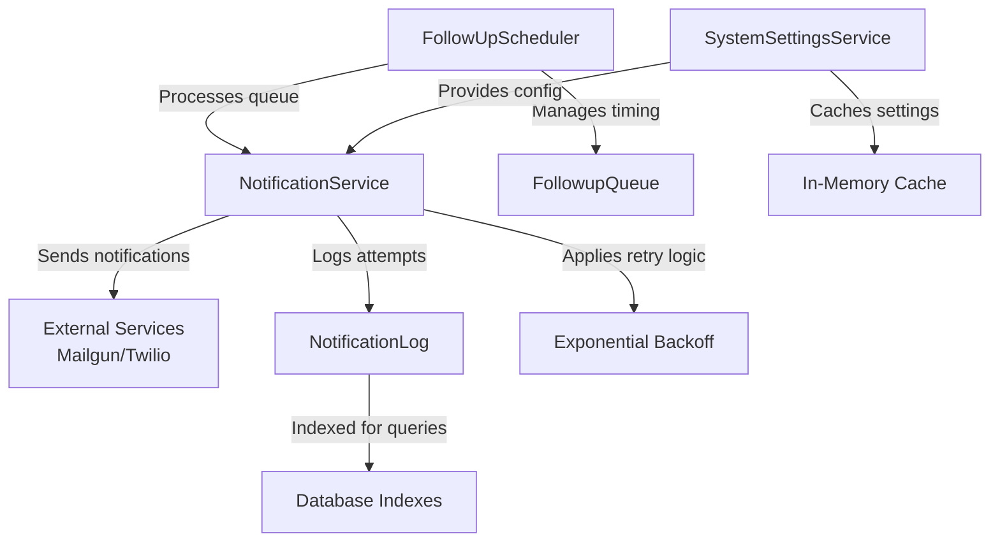
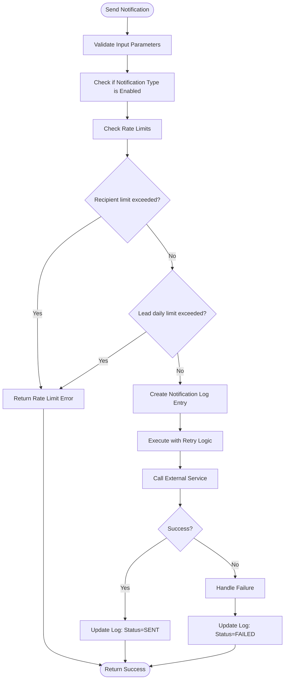
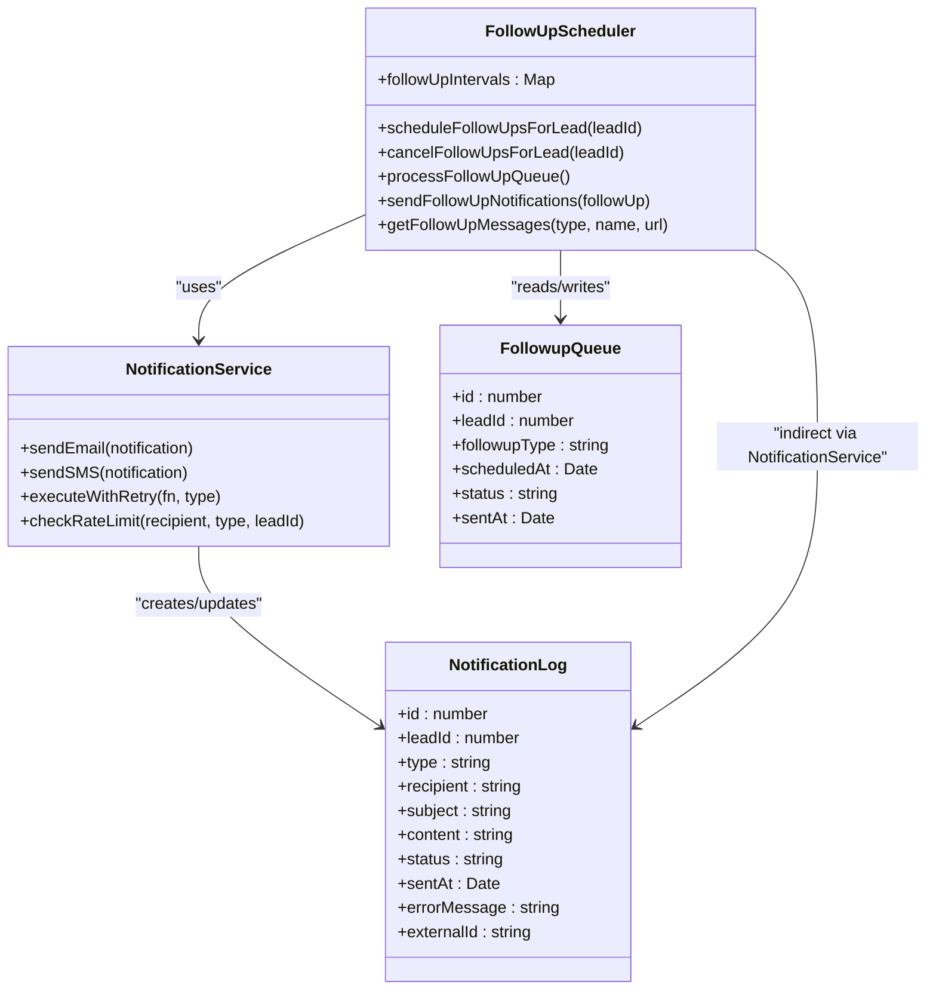
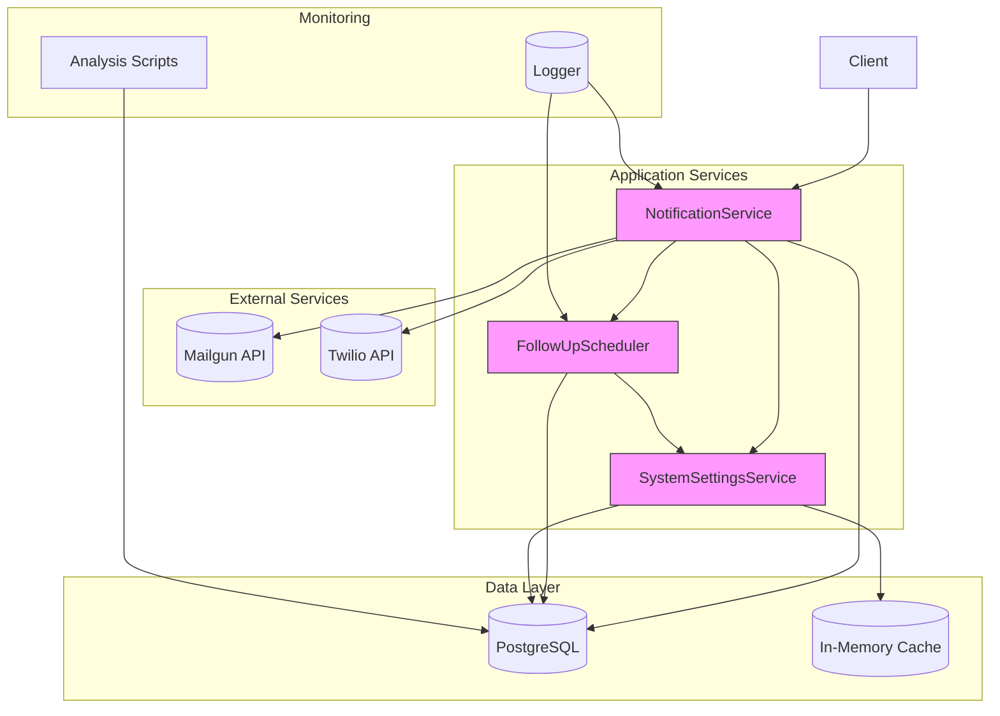

# Delivery Reliability and Retry Mechanisms

<cite>
**Referenced Files in This Document**   
- [NotificationService.ts](file://src/services/NotificationService.ts#L0-L471)
- [FollowUpScheduler.ts](file://src/services/FollowUpScheduler.ts#L0-L490)
- [SystemSettingsService.ts](file://src/services/SystemSettingsService.ts#L0-L351)
- [prisma.ts](file://src/lib/prisma.ts#L0-L60)
- [migration.sql](file://prisma/migrations/20250812120000_add_notification_log_indexes/migration.sql#L0-L10)
</cite>

## Table of Contents
1. [Introduction](#introduction)
2. [Core Components Overview](#core-components-overview)
3. [Notification Delivery and Retry Logic](#notification-delivery-and-retry-logic)
4. [Rate Limiting Implementation](#rate-limiting-implementation)
5. [Follow-Up Scheduling and Retry Queues](#follow-up-scheduling-and-retry-queues)
6. [Notification Logging and Error Tracking](#notification-logging-and-error-tracking)
7. [Configuration and Dynamic Settings](#configuration-and-dynamic-settings)
8. [Monitoring and Troubleshooting](#monitoring-and-troubleshooting)
9. [Architecture Diagram](#architecture-diagram)

## Introduction
This document provides a comprehensive analysis of the delivery reliability mechanisms in the fund-track application, focusing on notification delivery, retry strategies, rate limiting, and error handling. The system ensures reliable communication through email and SMS channels by implementing exponential backoff retries, circuit breaker patterns, and persistent logging of delivery attempts. Notifications are tracked in the NotificationLog, with failed attempts automatically rescheduled based on error types and response codes. The integration between FollowUpScheduler and NotificationService enables systematic follow-up messaging, while dynamic configuration allows runtime adjustment of retry parameters.

## Core Components Overview
The delivery reliability system is built around three core services: NotificationService, FollowUpScheduler, and SystemSettingsService. These components work together to ensure reliable message delivery, manage retry logic, and maintain system stability during transient failures.



**Diagram sources**
- [NotificationService.ts](file://src/services/NotificationService.ts#L0-L471)
- [FollowUpScheduler.ts](file://src/services/FollowUpScheduler.ts#L0-L490)
- [SystemSettingsService.ts](file://src/services/SystemSettingsService.ts#L0-L351)

**Section sources**
- [NotificationService.ts](file://src/services/NotificationService.ts#L0-L471)
- [FollowUpScheduler.ts](file://src/services/FollowUpScheduler.ts#L0-L490)
- [SystemSettingsService.ts](file://src/services/SystemSettingsService.ts#L0-L351)

## Notification Delivery and Retry Logic
The NotificationService implements a robust retry mechanism using exponential backoff to handle transient failures when sending email and SMS notifications. The retry logic is encapsulated in the `executeWithRetry` method, which attempts delivery multiple times with increasing delays between attempts.

```mermaid
sequenceDiagram
participant Client
participant NS as NotificationService
participant DB as Database
participant External as External Service<br/>(Mailgun/Twilio)
Client->>NS : sendEmail() / sendSMS()
NS->>DB : Create PENDING log entry
NS->>NS : executeWithRetry()
loop Retry Attempts
NS->>External : Send notification
alt Success
External-->>NS : Success response
NS->>DB : Update status to SENT
NS-->>Client : Success result
break
else Failure
External-->>NS : Error
NS->>NS : Calculate delay = baseDelay * 2^attempt
NS->>NS : Wait (delay)
end
end
NS->>DB : Update status to FAILED
NS-->>Client : Failure result
```

**Diagram sources**
- [NotificationService.ts](file://src/services/NotificationService.ts#L300-L350)

**Section sources**
- [NotificationService.ts](file://src/services/NotificationService.ts#L300-L350)

The retry configuration is dynamically controlled through system settings, with default values of 3 maximum retries and a base delay of 1,000 milliseconds. The maximum delay is capped at 30,000 milliseconds to prevent excessively long waits. The exponential backoff formula used is: `delay = min(baseDelay * 2^attempt, maxDelay)`.

For example, with the default configuration:
- Attempt 1: 1,000ms delay
- Attempt 2: 2,000ms delay  
- Attempt 3: 4,000ms delay
- Final attempt: no delay (after 3rd failure)

The system distinguishes between transient and permanent errors through exception handling. Transient errors such as network timeouts or rate limiting responses from external services trigger retries, while permanent failures like invalid phone numbers or disabled notification types result in immediate failure without retry attempts.

```typescript
private async executeWithRetry<T>(
  fn: () => Promise<T>,
  operationType: string
): Promise<T> {
  let lastError: Error;

  for (let attempt = 0; attempt <= this.config.retryConfig.maxRetries; attempt++) {
    try {
      return await fn();
    } catch (error) {
      lastError = error instanceof Error ? error : new Error('Unknown error');

      if (attempt === this.config.retryConfig.maxRetries) {
        break;
      }

      const delay = Math.min(
        this.config.retryConfig.baseDelay * Math.pow(2, attempt),
        this.config.retryConfig.maxDelay
      );

      console.warn(`${operationType} notification attempt ${attempt + 1} failed: ${lastError.message}. Retrying in ${delay}ms...`);

      await this.sleep(delay);
    }
  }

  throw lastError!;
}
```

## Rate Limiting Implementation
The system implements rate limiting at the application level to prevent spamming recipients with notifications. Two levels of rate limiting are enforced:

1. **Per-recipient limits**: Maximum of 2 notifications per hour to the same email address or phone number
2. **Per-lead limits**: Maximum of 10 notifications per day for each lead

The rate limiting logic is implemented in the `checkRateLimit` method of NotificationService, which queries the NotificationLog to count recent successful deliveries. This approach ensures that only actually delivered notifications are counted against the limits, not failed attempts.



**Diagram sources**
- [NotificationService.ts](file://src/services/NotificationService.ts#L400-L450)

**Section sources**
- [NotificationService.ts](file://src/services/NotificationService.ts#L400-L450)

The rate limiting check is performed before creating a notification log entry, preventing unnecessary database writes for blocked notifications. If the rate limit check itself fails (e.g., due to database connectivity issues), the system allows the notification to proceed but logs the error, following a fail-open approach to avoid blocking legitimate notifications during infrastructure issues.

## Follow-Up Scheduling and Retry Queues
The FollowUpScheduler service manages a queue of follow-up notifications that are automatically scheduled when a new lead is imported. This service integrates with NotificationService to ensure reliable delivery of time-based follow-up messages.



**Diagram sources**
- [FollowUpScheduler.ts](file://src/services/FollowUpScheduler.ts#L0-L490)
- [NotificationService.ts](file://src/services/NotificationService.ts#L0-L471)

**Section sources**
- [FollowUpScheduler.ts](file://src/services/FollowUpScheduler.ts#L0-L490)

The follow-up scheduling process works as follows:
1. When a new lead is imported, `scheduleFollowUpsForLead` is called to create four follow-up entries in the FollowupQueue table with different time intervals (3, 9, 24, and 72 hours)
2. A cron job periodically calls `processFollowUpQueue` to find due follow-ups
3. For each due follow-up, the system checks if the lead is still in PENDING status
4. If valid, `sendFollowUpNotifications` calls NotificationService to send both email and SMS
5. The follow-up status is updated to SENT or remains PENDING for retry

The FollowUpScheduler implements a circuit breaker pattern by canceling all pending follow-ups when a lead's status changes from PENDING. This prevents unnecessary notifications to leads that have already been processed. The `cancelFollowUpsForLead` method updates all pending follow-ups to CANCELLED status, effectively breaking the circuit for that lead.

## Notification Logging and Error Tracking
All notification attempts are recorded in the NotificationLog table, providing a complete audit trail of delivery attempts. The log captures both successful and failed attempts, enabling detailed analysis of delivery reliability and troubleshooting of issues.

The NotificationLog schema includes the following key fields:
- **id**: Primary key
- **leadId**: Foreign key to the lead record
- **type**: Notification type (EMAIL/SMS)
- **recipient**: Destination address (email or phone)
- **subject**: Email subject line
- **content**: Message content
- **status**: Current status (PENDING, SENT, FAILED)
- **createdAt**: Timestamp of log creation
- **sentAt**: Timestamp of successful delivery
- **errorMessage**: Error details for failed attempts
- **externalId**: Reference ID from external service (Mailgun/Twilio)

```sql
-- Add index to speed ORDER BY created_at DESC, id DESC for cursor pagination
CREATE INDEX idx_notification_log_created_at_id ON notification_log(created_at DESC, id DESC);
```

**Diagram sources**
- [migration.sql](file://prisma/migrations/20250812120000_add_notification_log_indexes/migration.sql#L0-L3)

**Section sources**
- [migration.sql](file://prisma/migrations/20250812120000_add_notification_log_indexes/migration.sql#L0-L3)

The database index on `created_at DESC, id DESC` optimizes queries for retrieving recent logs, which is the most common access pattern for monitoring and troubleshooting. This compound index supports efficient cursor-based pagination in the admin interface.

Failed notification attempts are captured in the NotificationLog with the status set to FAILED and the error message stored in the errorMessage field. The system automatically reschedules failed attempts through the retry logic in NotificationService, with the number of attempts controlled by the retry configuration. After exhausting all retry attempts, the final failure is recorded and no further attempts are made.

## Configuration and Dynamic Settings
The system uses a dynamic configuration model through SystemSettingsService, allowing runtime adjustment of notification parameters without requiring application restarts. Settings are cached in memory with a 5-minute TTL to balance performance and freshness.

```mermaid
graph TB
subgraph "Settings Cache"
Cache[In-Memory Map]
TTL[TTL: 5 minutes]
end
subgraph "Database"
DB[(system_setting table)]
end
subgraph "Application"
NS[NotificationService]
FUS[FollowUpScheduler]
end
NS --> |getSetting()| Cache
FUS --> |getSetting()| Cache
Cache --> |refresh if expired| DB
Admin --> |updateSetting()| DB
DB --> |triggers| Cache
```

**Diagram sources**
- [SystemSettingsService.ts](file://src/services/SystemSettingsService.ts#L0-L351)

**Section sources**
- [SystemSettingsService.ts](file://src/services/SystemSettingsService.ts#L0-L351)

Key configurable parameters for delivery reliability include:
- **notification_retry_attempts**: Maximum number of retry attempts (default: 3)
- **notification_retry_delay**: Base delay in milliseconds for exponential backoff (default: 1000)
- **email_notifications_enabled**: Boolean flag to enable/disable email notifications
- **sms_notifications_enabled**: Boolean flag to enable/disable SMS notifications

The `getNotificationSettings` convenience function retrieves these settings with default fallback values:

```typescript
export const getNotificationSettings = async () => {
  return {
    smsEnabled: await systemSettingsService.getSettingWithDefault('sms_notifications_enabled', 'boolean', true),
    emailEnabled: await systemSettingsService.getSettingWithDefault('email_notifications_enabled', 'boolean', true),
    retryAttempts: await systemSettingsService.getSettingWithDefault('notification_retry_attempts', 'number', 3),
    retryDelay: await systemSettingsService.getSettingWithDefault('notification_retry_delay', 'number', 1000),
  };
};
```

This dynamic configuration allows administrators to adjust retry behavior based on external service performance, network conditions, or business requirements without redeploying the application.

## Monitoring and Troubleshooting
The system provides several mechanisms for monitoring delivery success rates and troubleshooting persistent issues:

1. **Notification statistics**: The `getNotificationStats` method in NotificationService provides counts of notifications by type and status for a specific lead
2. **Recent notifications**: The `getRecentNotifications` method returns the most recent delivery attempts for debugging
3. **Follow-up statistics**: The `getFollowUpStats` method in FollowUpScheduler provides metrics on pending and due follow-ups
4. **Settings audit trail**: The `getSettingsAuditTrail` method tracks configuration changes over time

For diagnosing persistent delivery issues, follow this troubleshooting workflow:

```mermaid
flowchart TD
A[Identify Failed Notifications] --> B{Check error messages}
B --> |Transient errors<br/>(timeouts, network issues)| C[Monitor retry behavior]
B --> |Permanent errors<br/>(invalid addresses)| D[Validate input data]
B --> |Authentication errors| E[Check credentials in environment variables]
C --> F{Retries successful?}
F --> |Yes| G[No action needed]
F --> |No| H[Check rate limits and quotas]
H --> I[Review external service status]
D --> J[Fix data validation]
E --> K[Update credentials]
G --> End
J --> End
K --> End
I --> L[Adjust retry configuration if needed]
L --> End
```

To optimize retry configurations:
1. Monitor the success rate of first attempts vs. subsequent retries
2. If most failures are resolved on the first retry, consider reducing the base delay
3. If many attempts fail after multiple retries, investigate root causes rather than increasing retry counts
4. Adjust retry parameters based on external service SLAs and business requirements
5. Use the system settings interface to update parameters without downtime

The scripts directory contains analysis tools like `run_notification_log_analysis.sh` that provide detailed reports on notification delivery patterns, failure rates, and system performance.

## Architecture Diagram
The complete delivery reliability architecture integrates multiple components to ensure robust notification delivery:



**Diagram sources**
- [NotificationService.ts](file://src/services/NotificationService.ts#L0-L471)
- [FollowUpScheduler.ts](file://src/services/FollowUpScheduler.ts#L0-L490)
- [SystemSettingsService.ts](file://src/services/SystemSettingsService.ts#L0-L351)
- [prisma.ts](file://src/lib/prisma.ts#L0-L60)

**Section sources**
- [NotificationService.ts](file://src/services/NotificationService.ts#L0-L471)
- [FollowUpScheduler.ts](file://src/services/FollowUpScheduler.ts#L0-L490)
- [SystemSettingsService.ts](file://src/services/SystemSettingsService.ts#L0-L351)
- [prisma.ts](file://src/lib/prisma.ts#L0-L60)