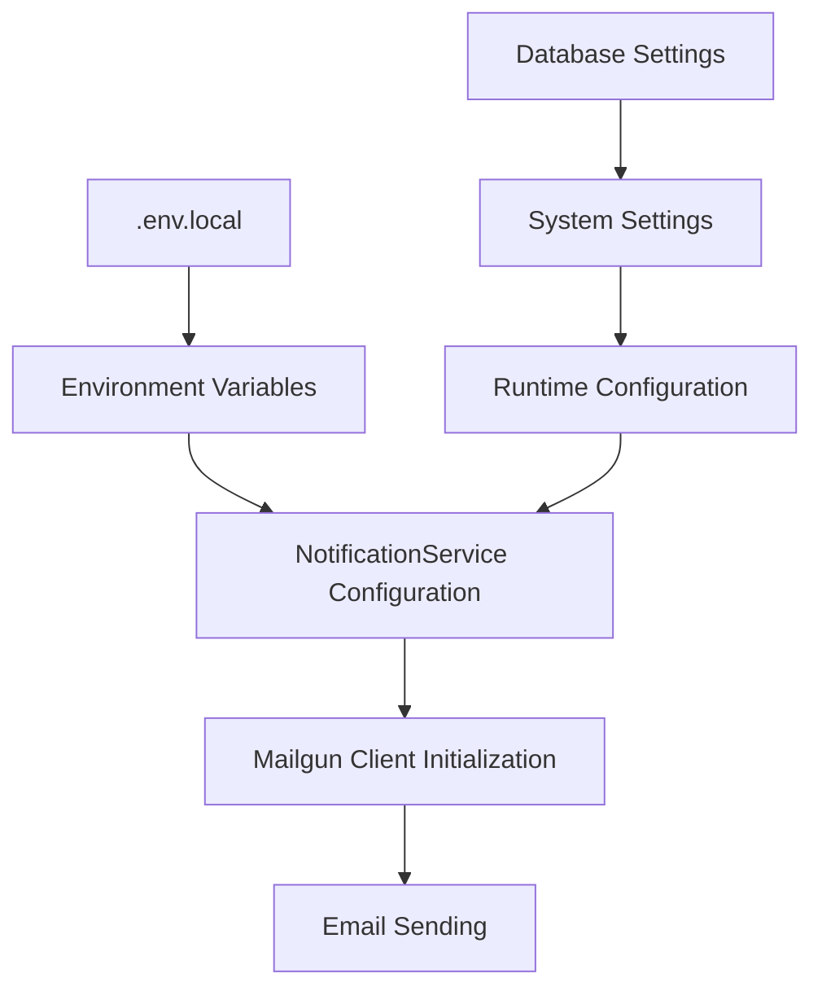
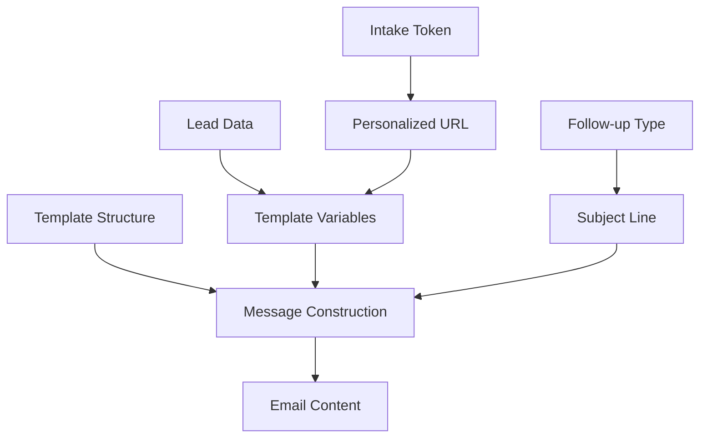
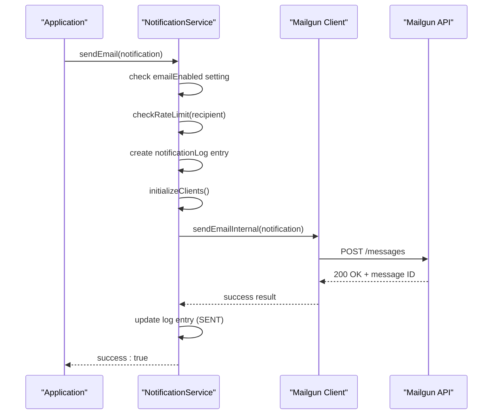
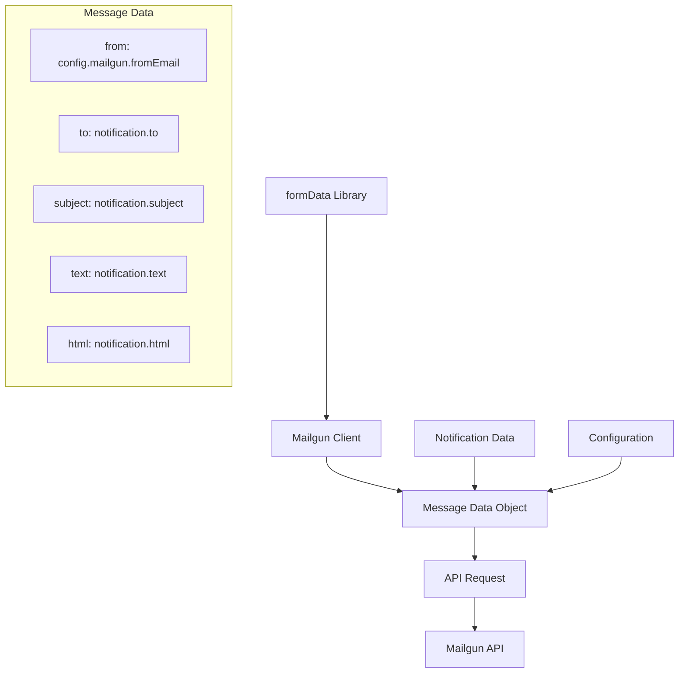
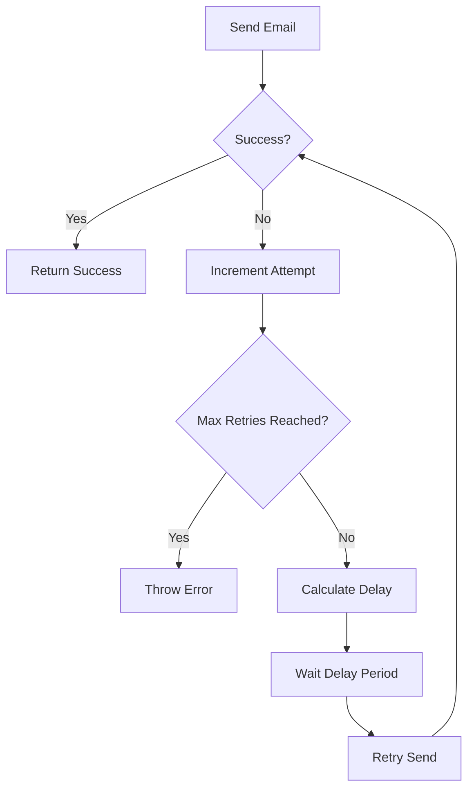
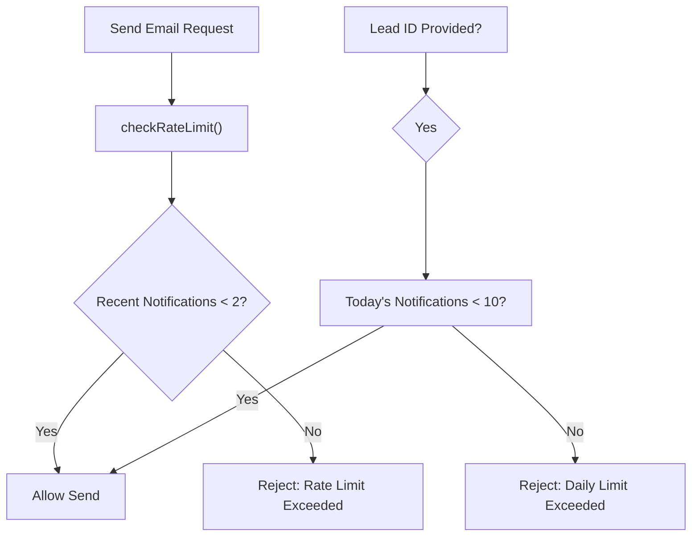

# MailGun Email Integration

<cite>
**Referenced Files in This Document**   
- [NotificationService.ts](file://src/services/NotificationService.ts)
- [SystemSettingsService.ts](file://src/services/SystemSettingsService.ts)
- [FollowUpScheduler.ts](file://src/services/FollowUpScheduler.ts)
- [test-mailgun.ts](file://test/test-mailgun.ts)
</cite>

## Table of Contents
1. [Introduction](#introduction)
2. [Configuration and Setup](#configuration-and-setup)
3. [Email Template Rendering and Dynamic Content](#email-template-rendering-and-dynamic-content)
4. [Transactional Email Workflow](#transactional-email-workflow)
5. [Form-Data Request Construction](#form-data-request-construction)
6. [Response Handling and Retry Logic](#response-handling-and-retry-logic)
7. [Deliverability Best Practices](#deliverability-best-practices)
8. [Troubleshooting Common Issues](#troubleshooting-common-issues)

## Introduction
The MailGun email integration within the NotificationService provides a robust system for sending transactional emails, managing follow-up reminders, and ensuring reliable delivery. This document details the implementation of email functionality, covering configuration, template rendering, dynamic variable substitution, and attachment support. The integration uses the Mailgun.js library with form-data to construct HTTP requests and handles response codes with retry logic. The system includes deliverability best practices such as rate limiting, configuration validation, and logging for monitoring email delivery status.

## Configuration and Setup
The MailGun integration is configured through environment variables and system settings, providing flexibility between deployment environments and runtime configuration. The NotificationService class initializes with configuration values from environment variables, including the MailGun API key, domain, and from email address.



**Diagram sources**
- [NotificationService.ts](file://src/services/NotificationService.ts#L53-L101)
- [SystemSettingsService.ts](file://src/services/SystemSettingsService.ts#L1-L199)

The configuration is structured as follows:

**Configuration Structure**
- mailgun: 
  - apiKey: process.env.MAILGUN_API_KEY
  - domain: process.env.MAILGUN_DOMAIN
  - fromEmail: process.env.MAILGUN_FROM_EMAIL

The system validates configuration on startup through the `validateConfiguration()` method, which checks for required environment variables and attempts to initialize the Mailgun client. This validation ensures that all necessary credentials are present before attempting to send emails.

**Section sources**
- [NotificationService.ts](file://src/services/NotificationService.ts#L53-L101)
- [NotificationService.ts](file://src/services/NotificationService.ts#L399-L446)

## Email Template Rendering and Dynamic Content
The system implements email template rendering through dynamic string construction with variable substitution. Templates are generated programmatically by combining static content with dynamic data from leads, such as names, business information, and personalized URLs.



**Diagram sources**
- [FollowUpScheduler.ts](file://src/services/FollowUpScheduler.ts#L368-L410)
- [FollowUpScheduler.ts](file://src/services/FollowUpScheduler.ts#L412-L450)

The FollowUpScheduler demonstrates template rendering with the `getFollowUpMessages()` method, which constructs email content based on the follow-up type. The method uses template literals to inject dynamic values such as lead names and intake URLs into both text and HTML email formats.

For example, the three-hour follow-up email template includes:
- Dynamic subject line based on urgency
- Personalized greeting with lead name
- Context-specific messaging based on time since application
- Call-to-action button with personalized intake URL
- Consistent branding and formatting

The system supports both text and HTML email formats, with HTML emails using inline CSS for styling to ensure compatibility across email clients.

**Section sources**
- [FollowUpScheduler.ts](file://src/services/FollowUpScheduler.ts#L368-L450)
- [test-mailgun.ts](file://test/test-mailgun.ts#L21-L50)

## Transactional Email Workflow
The transactional email workflow begins with the creation of an EmailNotification object containing recipient information, subject, and content. The NotificationService processes this request through a series of steps that ensure reliable delivery.



**Diagram sources**
- [NotificationService.ts](file://src/services/NotificationService.ts#L103-L198)
- [NotificationService.ts](file://src/services/NotificationService.ts#L243-L295)

The workflow includes:
1. Validation of email notifications enabled status
2. Rate limiting check to prevent spam
3. Creation of a notification log entry in pending status
4. Lazy initialization of the Mailgun client
5. Execution of the email sending with retry logic
6. Update of the log entry upon success or failure

The system handles both initial application confirmation emails and follow-up reminders through this same workflow, with different templates and timing.

**Section sources**
- [NotificationService.ts](file://src/services/NotificationService.ts#L103-L198)
- [FollowUpScheduler.ts](file://src/services/FollowUpScheduler.ts#L300-L350)

## Form-Data Request Construction
The integration uses the form-data library to construct HTTP requests to the Mailgun API. The Mailgun client is initialized with the form-data library, which handles the multipart/form-data encoding required by the Mailgun API.



**Diagram sources**
- [NotificationService.ts](file://src/services/NotificationService.ts#L53-L101)
- [NotificationService.ts](file://src/services/NotificationService.ts#L243-L295)

The request construction process:
1. Imports the Mailgun and formData libraries
2. Creates a Mailgun instance with formData as the transport
3. Creates a client with API credentials
4. Constructs message data object with required fields
5. Sends the message via the messages.create() method

The message data object includes conditional inclusion of the HTML content only when provided, using the spread operator with a conditional:
```typescript
const messageData = {
  from: this.config.mailgun.fromEmail,
  to: notification.to,
  subject: notification.subject,
  text: notification.text,
  ...(notification.html && { html: notification.html }),
};
```

**Section sources**
- [NotificationService.ts](file://src/services/NotificationService.ts#L53-L101)
- [NotificationService.ts](file://src/services/NotificationService.ts#L243-L295)

## Response Handling and Retry Logic
The system implements comprehensive response handling with exponential backoff retry logic to ensure reliable email delivery. The executeWithRetry() method handles transient failures by attempting to resend emails with increasing delays between attempts.



**Diagram sources**
- [NotificationService.ts](file://src/services/NotificationService.ts#L295-L345)
- [NotificationService.ts](file://src/services/NotificationService.ts#L103-L198)

The retry logic configuration:
- maxRetries: 3 (configurable via system settings)
- baseDelay: 1000ms (1 second, configurable)
- maxDelay: 30000ms (30 seconds)

The system logs warning messages for each failed attempt, including the error message and retry timing. Upon successful delivery, the notification log is updated with the external ID from Mailgun and the sent timestamp. For failures, the log is updated with the error message and status set to FAILED.

The retry delay uses exponential backoff: `baseDelay * 2^attempt`, capped at the maxDelay value. This approach prevents overwhelming the Mailgun API during temporary outages while maximizing the chance of successful delivery.

**Section sources**
- [NotificationService.ts](file://src/services/NotificationService.ts#L295-L345)
- [NotificationService.ts](file://src/services/NotificationService.ts#L103-L198)

## Deliverability Best Practices
The system implements several deliverability best practices to ensure high email delivery rates and compliance with email regulations.

### Rate Limiting
The system enforces rate limiting at two levels:
1. Per recipient: maximum of 2 emails per hour
2. Per lead: maximum of 10 notifications per day



**Diagram sources**
- [NotificationService.ts](file://src/services/NotificationService.ts#L347-L398)

### Configuration Validation
The system validates configuration on startup, checking for required environment variables:
- MAILGUN_API_KEY
- MAILGUN_DOMAIN
- MAILGUN_FROM_EMAIL

The validation occurs in the validateConfiguration() method, which also attempts to initialize the clients to verify credentials are valid.

### Spam Score Optimization
While explicit spam score optimization is not implemented, the system follows practices that improve deliverability:
- Using consistent, branded from addresses
- Implementing clear, relevant subject lines
- Including plain text alternatives
- Avoiding spam trigger words
- Maintaining clean HTML with inline CSS

The system does not currently implement unsubscribe links, which is a gap in compliance with email regulations like CAN-SPAM. This should be addressed to improve deliverability and regulatory compliance.

**Section sources**
- [NotificationService.ts](file://src/services/NotificationService.ts#L347-L398)
- [NotificationService.ts](file://src/services/NotificationService.ts#L399-L446)

## Troubleshooting Common Issues
This section addresses common issues encountered with the MailGun email integration and provides guidance for resolution.

### Rejected Emails
When emails are rejected, check:
1. Notification log for error messages
2. Mailgun API response codes
3. Recipient email address validity
4. Content for spam triggers

The system logs detailed error information in the notificationLog table, which can be accessed through the getRecentNotifications() method.

### Invalid Domains
Domain configuration issues typically stem from:
1. Incorrect MAILGUN_DOMAIN environment variable
2. Domain not verified in Mailgun dashboard
3. DNS configuration issues (SPF/DKIM)

Verify the domain configuration in the Mailgun control panel and ensure DNS records are properly set. The system does not currently implement automated SPF/DKIM verification, so this must be checked manually.

### Webhook Signature Verification Failures
The system does not currently implement Mailgun webhook handling, so webhook signature verification is not applicable. If webhook integration is added in the future, ensure:
1. Webhook endpoint is publicly accessible
2. Signature verification using the Mailgun signing key
3. Proper HTTP method handling (POST)
4. Response time under 10 seconds

### Rate Limiting
When encountering rate limiting issues:
1. Check the rate limit configuration in system settings
2. Verify the notificationLog table for recent sends
3. Adjust rate limits based on Mailgun plan limits
4. Implement queuing for high-volume scenarios

The system's rate limiting is conservative (2 per hour per recipient), which should prevent most provider-level rate limiting.

### Configuration Issues
For configuration problems:
1. Verify environment variables in .env.local
2. Check the validateConfiguration() method output
3. Test with the test-mailgun.ts script
4. Ensure credentials have appropriate permissions

Use the test-mailgun.ts script to validate the complete email flow and diagnose configuration issues.

**Section sources**
- [NotificationService.ts](file://src/services/NotificationService.ts#L347-L398)
- [test-mailgun.ts](file://test/test-mailgun.ts#L0-L399)
- [NotificationService.ts](file://src/services/NotificationService.ts#L399-L446)