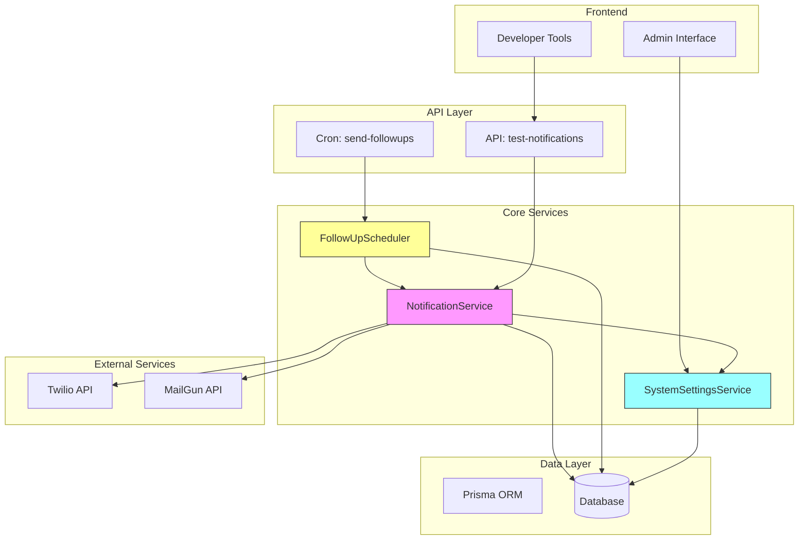
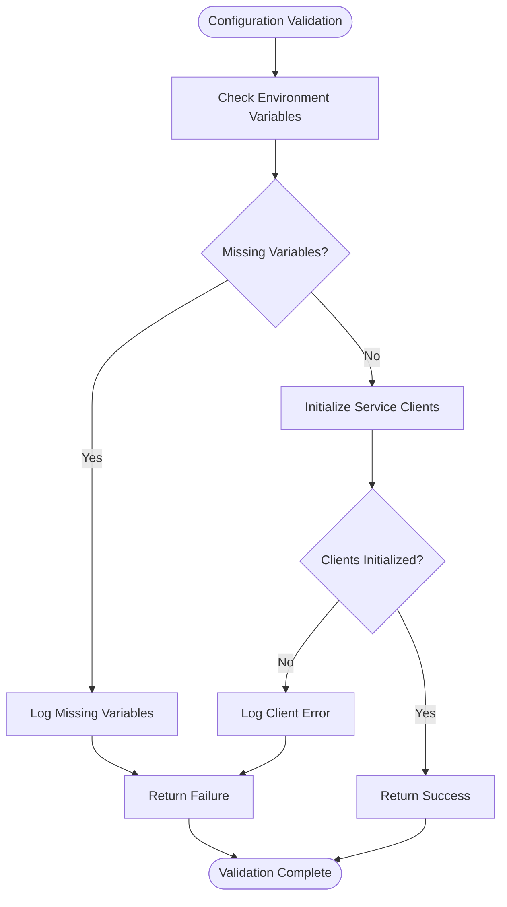
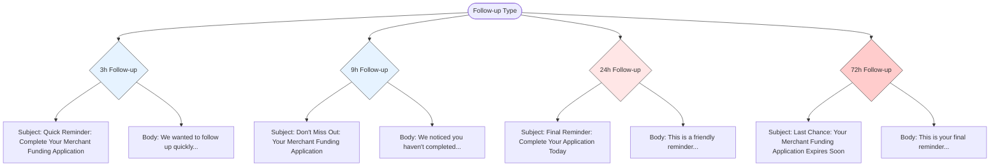
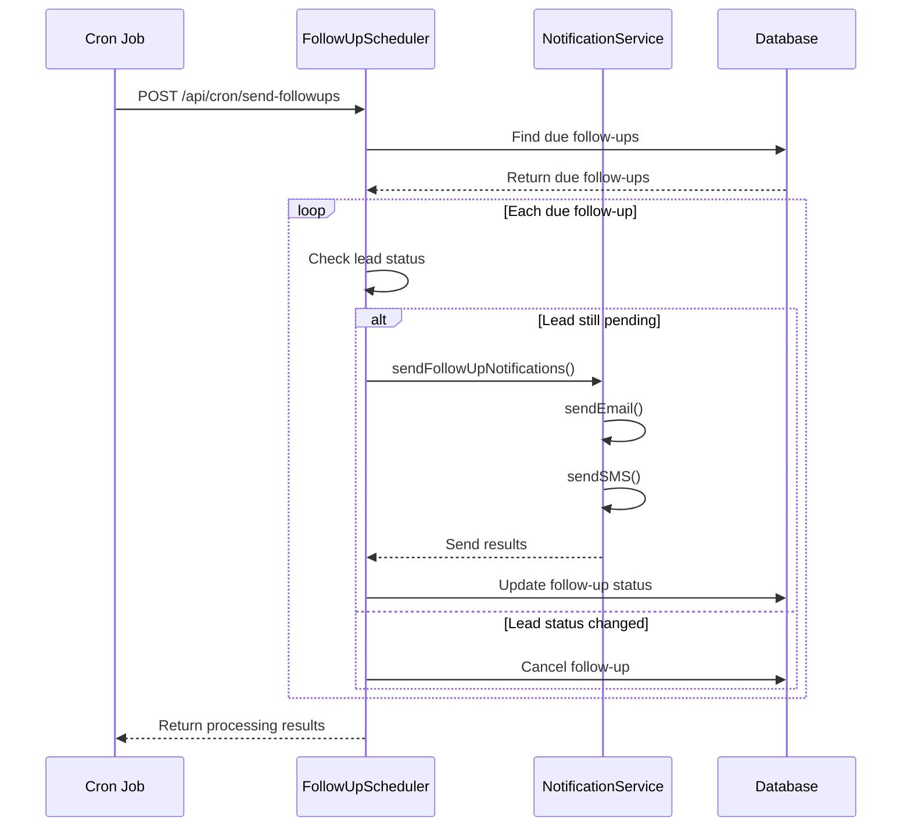

# Notification Integrations

<cite>
**Referenced Files in This Document**   
- [NotificationService.ts](file://src/services/NotificationService.ts)
- [notifications.ts](file://src/lib/notifications.ts)
- [SystemSettingsService.ts](file://src/services/SystemSettingsService.ts)
- [system-settings.ts](file://prisma/seeds/system-settings.ts)
- [send-followups/route.ts](file://src/app/api/cron/send-followups/route.ts)
- [FollowUpScheduler.ts](file://src/services/FollowUpScheduler.ts)
- [test-notifications/route.ts](file://src/app/api/dev/test-notifications/route.ts)
</cite>

## Table of Contents
1. [Introduction](#introduction)
2. [Core Architecture](#core-architecture)
3. [API Configuration and Authentication](#api-configuration-and-authentication)
4. [Notification Service Implementation](#notification-service-implementation)
5. [Message Template Management](#message-template-management)
6. [Transport Separation and Delivery](#transport-separation-and-delivery)
7. [Background Processing and Cron Integration](#background-processing-and-cron-integration)
8. [Deliverability and Spam Prevention](#deliverability-and-spam-prevention)
9. [Delivery Status Tracking](#delivery-status-tracking)
10. [Troubleshooting Guide](#troubleshooting-guide)

## Introduction
This document provides a comprehensive overview of the notification integration system within the fund-track application. The system enables reliable delivery of email and SMS notifications through MailGun and Twilio services respectively. It features robust error handling, rate limiting, retry mechanisms, and comprehensive logging. The architecture follows separation of concerns principles, with distinct components for configuration management, message templating, transport handling, and background processing. This documentation details the implementation, configuration, and operational aspects of the notification system to ensure reliable and maintainable communication workflows.

## Core Architecture
The notification system is built around a modular architecture with clear separation of responsibilities. The core component is the NotificationService class, which abstracts the underlying transport mechanisms (Twilio for SMS, MailGun for email). Configuration is managed through environment variables and database-stored system settings, allowing runtime adjustments without code changes. The system integrates with background job processing through cron-triggered endpoints and maintains comprehensive logging for monitoring and debugging. Message templates are embedded within service functions, enabling dynamic content generation based on recipient data and notification context.



**Diagram sources**
- [NotificationService.ts](file://src/services/NotificationService.ts)
- [FollowUpScheduler.ts](file://src/services/FollowUpScheduler.ts)
- [SystemSettingsService.ts](file://src/services/SystemSettingsService.ts)

## API Configuration and Authentication
The notification system uses API key-based authentication for both Twilio and MailGun services. Configuration is managed through environment variables, with fallback to database-stored settings for runtime configuration. The system validates configuration on startup and provides health check capabilities.

### Environment Variables
```
TWILIO_ACCOUNT_SID=your_account_sid
TWILIO_AUTH_TOKEN=your_auth_token
TWILIO_PHONE_NUMBER=+1234567890
MAILGUN_API_KEY=your_mailgun_api_key
MAILGUN_DOMAIN=your_domain.com
MAILGUN_FROM_EMAIL=notifications@your_domain.com
INTAKE_BASE_URL=https://yourapp.com/application
```

### Configuration Validation
The system performs comprehensive configuration validation through the `validateConfiguration()` method in NotificationService. This method checks for required environment variables and attempts to initialize the service clients to verify credentials.



**Diagram sources**
- [NotificationService.ts](file://src/services/NotificationService.ts#L399-L446)

**Section sources**
- [NotificationService.ts](file://src/services/NotificationService.ts#L399-L446)
- [system-settings.ts](file://prisma/seeds/system-settings.ts)

## Notification Service Implementation
The NotificationService class provides the core functionality for sending notifications with built-in reliability features including retry logic, rate limiting, and comprehensive error handling.

### Class Structure and Dependencies
```mermaid
classDiagram
class NotificationService {
-twilioClient : Twilio | null
-mailgunClient : any | null
-config : NotificationConfig
+sendEmail(notification : EmailNotification) : Promise~NotificationResult~
+sendSMS(notification : SMSNotification) : Promise~NotificationResult~
-sendEmailInternal(notification : EmailNotification) : Promise~NotificationResult~
-sendSMSInternal(notification : SMSNotification) : Promise~NotificationResult~
-executeWithRetry~T~(fn : () => Promise~T~, operationType : string) : Promise~T~
-checkRateLimit(recipient : string, type : 'EMAIL' | 'SMS', leadId? : number) : Promise~{ allowed : boolean; reason? : string }~
-initializeClients() : void
-sleep(ms : number) : Promise~void~
+validateConfiguration() : Promise~boolean~
+getNotificationStats(leadId : number) : Promise~Record~string, number~~
+getRecentNotifications(limit : number = 50) : Promise~NotificationLog[]~
}
class NotificationConfig {
+twilio : TwilioConfig
+mailgun : MailgunConfig
+retryConfig : RetryConfig
}
class TwilioConfig {
+accountSid : string
+authToken : string
+phoneNumber : string
}
class MailgunConfig {
+apiKey : string
+domain : string
+fromEmail : string
}
class RetryConfig {
+maxRetries : number
+baseDelay : number
+maxDelay : number
}
class EmailNotification {
+to : string
+subject : string
+text : string
+html? : string
+leadId? : number
}
class SMSNotification {
+to : string
+message : string
+leadId? : number
}
class NotificationResult {
+success : boolean
+externalId? : string
+error? : string
}
NotificationService --> NotificationConfig
NotificationService --> EmailNotification
NotificationService --> SMSNotification
NotificationService --> NotificationResult
```

**Diagram sources**
- [NotificationService.ts](file://src/services/NotificationService.ts#L0-L472)

### Retry Logic with Exponential Backoff
The system implements exponential backoff retry logic to handle transient failures. The retry configuration is dynamically loaded from system settings, allowing runtime adjustment of retry parameters.

```mermaid
sequenceDiagram
participant Client
participant Service as NotificationService
participant External as External Service
Client->>Service : sendEmail()
Service->>Service : checkRateLimit()
Service->>Service : createLogEntry()
Service->>Service : executeWithRetry()
loop Retry Attempts
Service->>External : sendEmailInternal()
alt Success
External-->>Service : Success Response
Service->>Service : updateLog(SUCCESS)
Service-->>Client : Success Result
break
else Failure
External-->>Service : Error Response
Service->>Service : calculateDelay()
Note over Service : Delay = min(baseDelay * 2^attempt, maxDelay)
Service->>Service : sleep(delay)
end
end
Service->>Service : updateLog(FAILED)
Service-->>Client : Error Result
```

**Diagram sources**
- [NotificationService.ts](file://src/services/NotificationService.ts#L279-L318)

**Section sources**
- [NotificationService.ts](file://src/services/NotificationService.ts#L279-L318)

## Message Template Management
Message templates are managed within service functions, providing dynamic content generation based on recipient data and context. The system includes templates for intake notifications, follow-up reminders, and status change alerts.

### Intake Notification Template
The intake notification is sent when a new lead is created, providing a secure link to complete their application.

```typescript
// Example from sendIntakeNotification function
const emailNotification: EmailNotification = {
  to: email,
  subject: "Complete Your Merchant Funding Application",
  text: `Hi ${fullName},

Thank you for your interest in merchant funding${businessText}. To complete your application, please click the link below:

${intakeUrl}

This secure link will allow you to:
- Review and confirm your information
- Upload required documents
- Complete your application

If you have any questions, please don't hesitate to contact us.

Best regards,
Merchant Funding Team`,
  html: `
    <div style="font-family: Arial, sans-serif; max-width: 600px; margin: 0 auto;">
      <h2 style="color: #333;">Complete Your Merchant Funding Application</h2>
      <p>Hi ${fullName},</p>
      <p>Thank you for your interest in merchant funding${businessText}. To complete your application, please click the button below:</p>
      <div style="text-align: center; margin: 30px 0;">
        <a href="${intakeUrl}" style="background-color: #007bff; color: white; padding: 12px 24px; text-decoration: none; border-radius: 5px; display: inline-block;">Complete Application</a>
      </div>
      <p>This secure link will allow you to:</p>
      <ul>
        <li>Review and confirm your information</li>
        <li>Upload required documents</li>
        <li>Complete your application</li>
      </ul>
      <p>If you have any questions, please don't hesitate to contact us.</p>
      <p>Best regards,<br>Merchant Funding Team</p>
    </div>
  `,
  leadId,
};
```

### Follow-up Notification Templates
Follow-up notifications are sent at increasing intervals (3h, 9h, 24h, 72h) to encourage completion of the application process.



**Diagram sources**
- [FollowUpScheduler.ts](file://src/services/FollowUpScheduler.ts#L400-L470)

**Section sources**
- [FollowUpScheduler.ts](file://src/services/FollowUpScheduler.ts#L400-L470)
- [notifications.ts](file://src/lib/notifications.ts#L17-L170)

## Transport Separation and Delivery
The system maintains clear separation between email and SMS transports, with dedicated methods for each channel. This separation allows independent configuration, rate limiting, and error handling for each notification type.

### Transport Architecture
```mermaid
classDiagram
class NotificationService {
+sendEmail()
+sendSMS()
-sendEmailInternal()
-sendSMSInternal()
-initializeClients()
}
class TwilioTransport {
-client : Twilio
+sendMessage()
+validateConfiguration()
}
class MailgunTransport {
-client : MailgunClient
+sendMessage()
+validateConfiguration()
}
NotificationService --> TwilioTransport : "uses"
NotificationService --> MailgunTransport : "uses"
NotificationService --> "Prisma" : "logs to"
class RateLimiter {
+checkRateLimit()
+getRateLimitConfig()
}
NotificationService --> RateLimiter : "uses"
class RetryManager {
+executeWithRetry()
+calculateBackoffDelay()
}
NotificationService --> RetryManager : "uses"
```

**Diagram sources**
- [NotificationService.ts](file://src/services/NotificationService.ts)

### Rate Limiting Implementation
The system implements rate limiting to prevent spam and ensure deliverability. Two levels of rate limiting are enforced:

1. **Per-recipient hourly limit**: Maximum of 2 notifications per hour per recipient
2. **Per-lead daily limit**: Maximum of 10 notifications per day per lead

```typescript
private async checkRateLimit(
  recipient: string,
  type: 'EMAIL' | 'SMS',
  leadId?: number
): Promise<{ allowed: boolean; reason?: string }> {
  const now = new Date();
  const oneHourAgo = new Date(now.getTime() - 60 * 60 * 1000);
  const oneDayAgo = new Date(now.getTime() - 24 * 60 * 60 * 1000);

  // Check per-recipient hourly limit
  const recentNotifications = await prisma.notificationLog.count({
    where: {
      recipient,
      type: type as any,
      status: 'SENT',
      createdAt: { gte: oneHourAgo },
    },
  });

  if (recentNotifications >= 2) {
    return {
      allowed: false,
      reason: `Rate limit exceeded: ${recentNotifications} notifications sent to ${recipient} in the last hour`,
    };
  }

  // Check per-lead daily limit
  if (leadId) {
    const leadNotificationsToday = await prisma.notificationLog.count({
      where: {
        leadId,
        type: type as any,
        status: 'SENT',
        createdAt: { gte: oneDayAgo },
      },
    });

    if (leadNotificationsToday >= 10) {
      return {
        allowed: false,
        reason: `Daily limit exceeded: ${leadNotificationsToday} notifications sent to lead ${leadId} today`,
      };
    }
  }

  return { allowed: true };
}
```

**Section sources**
- [NotificationService.ts](file://src/services/NotificationService.ts#L320-L388)

## Background Processing and Cron Integration
The notification system integrates with background processing through cron-triggered endpoints that handle follow-up notifications and other scheduled tasks.

### Follow-up Scheduling Workflow


**Diagram sources**
- [send-followups/route.ts](file://src/app/api/cron/send-followups/route.ts)
- [FollowUpScheduler.ts](file://src/services/FollowUpScheduler.ts)

### Cron Job Implementation
The cron job endpoint processes the follow-up queue and sends due notifications:

```typescript
export async function POST(request: NextRequest) {
  const startTime = Date.now();
  
  try {
    logger.backgroundJob('Starting follow-up processing job', 'follow-ups');
    const result = await followUpScheduler.processFollowUpQueue();
    const processingTime = Date.now() - startTime;

    if (result.success) {
      return NextResponse.json({
        success: true,
        message: 'Follow-up processing completed',
        data: {
          processed: result.processed,
          sent: result.sent,
          cancelled: result.cancelled,
          processingTime: `${processingTime}ms`,
          errors: result.errors
        }
      }, { status: 200 });
    } else {
      return NextResponse.json({
        success: false,
        message: 'Follow-up processing completed with errors',
        data: {
          processed: result.processed,
          sent: result.sent,
          cancelled: result.cancelled,
          processingTime: `${processingTime}ms`,
          errors: result.errors
        }
      }, { status: 207 });
    }
  } catch (error) {
    // Error handling
  }
}
```

**Section sources**
- [send-followups/route.ts](file://src/app/api/cron/send-followups/route.ts)

### Manual Testing Endpoint
The system provides a testing endpoint for manual notification triggering:

```typescript
export async function POST(request: NextRequest) {
  try {
    const body = await request.json();
    const { type, recipient, subject, message, leadId } = body;

    // Validation logic
    if (!type || !recipient) {
      return NextResponse.json(
        { error: 'Type and recipient are required' },
        { status: 400 }
      );
    }

    let result;
    if (type === 'email') {
      result = await notificationService.sendEmail({
        to: recipient,
        subject: subject,
        text: message,
        html: `<p>${message.replace(/\n/g, '<br>')}</p>`,
        leadId: leadId ? parseInt(leadId) : undefined,
      });
    } else {
      result = await notificationService.sendSMS({
        to: recipient,
        message: message,
        leadId: leadId ? parseInt(leadId) : undefined,
      });
    }

    return NextResponse.json({
      success: result.success,
      externalId: result.externalId,
      error: result.error,
      timestamp: new Date().toISOString(),
    });
  } catch (error) {
    // Error handling
  }
}
```

**Section sources**
- [test-notifications/route.ts](file://src/app/api/dev/test-notifications/route.ts)

## Deliverability and Spam Prevention
The system implements several best practices to ensure high deliverability and prevent spam classification.

### Configuration Settings
The following system settings control notification behavior and help prevent spam:

- **sms_notifications_enabled**: Global toggle for SMS notifications
- **email_notifications_enabled**: Global toggle for email notifications  
- **notification_retry_attempts**: Maximum retry attempts (default: 3)
- **notification_retry_delay**: Base delay between retries in milliseconds (default: 1000)

These settings are stored in the database and can be modified through the admin interface without requiring code changes or restarts.

### Best Practices Implemented
1. **Rate Limiting**: Prevents excessive messaging to the same recipient
2. **Unsubscribe Management**: Global enable/disable controls prevent unwanted messages
3. **Content Quality**: Templates use professional language and clear value propositions
4. **Sender Reputation**: Uses dedicated sender addresses/numbers
5. **Error Handling**: Failed deliveries are logged and not retried indefinitely
6. **Timing**: Follow-ups are spaced appropriately to avoid overwhelming recipients

**Section sources**
- [system-settings.ts](file://prisma/seeds/system-settings.ts)
- [SystemSettingsService.ts](file://src/services/SystemSettingsService.ts)

## Delivery Status Tracking
The system maintains comprehensive tracking of all notification attempts, including delivery status, timestamps, and error information.

### Notification Logging
All notification attempts are logged in the notification_log table with the following fields:
- **leadId**: Reference to the associated lead
- **type**: Notification type (EMAIL or SMS)
- **recipient**: Destination address/number
- **subject**: Email subject (for emails)
- **content**: Message content
- **status**: Delivery status (PENDING, SENT, FAILED)
- **externalId**: Service-provided message ID (from Twilio/MailGun)
- **errorMessage**: Error details if delivery failed
- **createdAt**: Timestamp of log creation
- **sentAt**: Timestamp of successful delivery

### Status Monitoring
The system provides several methods for monitoring delivery status:

```typescript
// Get recent notifications for debugging
async getRecentNotifications(limit: number = 50) {
  return prisma.notificationLog.findMany({
    take: limit,
    orderBy: { createdAt: 'desc' },
    include: {
      lead: {
        select: {
          id: true,
          firstName: true,
          lastName: true,
          email: true,
          phone: true,
        },
      },
    },
  });
}

// Get notification statistics for a lead
async getNotificationStats(leadId: number) {
  const stats = await prisma.notificationLog.groupBy({
    by: ['type', 'status'],
    where: { leadId },
    _count: true,
  });

  return stats.reduce((acc, stat) => {
    const key = `${stat.type}_${stat.status}`;
    acc[key] = stat._count;
    return acc;
  }, {} as Record<string, number>);
}
```

The admin interface displays these logs in a paginated table with filtering capabilities, allowing staff to monitor delivery success and troubleshoot issues.

**Section sources**
- [NotificationService.ts](file://src/services/NotificationService.ts#L448-L471)
- [admin/notifications/page.tsx](file://src/app/admin/notifications/page.tsx)

## Troubleshooting Guide
This section provides guidance for diagnosing and resolving common issues with the notification system.

### Common Issues and Solutions

**Invalid Credentials**
- **Symptoms**: Authentication errors, "Failed to initialize notification clients" in logs
- **Diagnosis**: Check environment variables TWILIO_ACCOUNT_SID, TWILIO_AUTH_TOKEN, MAILGUN_API_KEY
- **Solution**: Verify credentials in .env file and ensure they match service provider settings

**Blocked IPs**
- **Symptoms**: Connection timeouts, "Network error" messages
- **Diagnosis**: Check if server IP is blocked by Twilio/MailGun
- **Solution**: Contact service provider to whitelist server IP, verify DNS settings

**Template Syntax Errors**
- **Symptoms**: "Invalid template" errors, partial message delivery
- **Diagnosis**: Validate HTML structure, check for unescaped characters
- **Solution**: Use HTML validator, escape special characters, test with simple templates first

**Message Throttling**
- **Symptoms**: "Rate limit exceeded" errors, delayed deliveries
- **Diagnosis**: Check rate limiting logs, verify message volume
- **Solution**: Adjust retry configuration, implement queuing, contact provider for higher limits

**Configuration Issues**
- **Symptoms**: Notifications not sending despite successful API calls
- **Diagnosis**: Check system settings in database
- **Solution**: Verify sms_notifications_enabled and email_notifications_enabled are set to 'true'

### Diagnostic Commands
Several scripts are available for troubleshooting:

```bash
# Test notification configuration
node scripts/test-notifications.mjs

# Check scheduler status
./scripts/check-scheduler.mjs

# Run notification log analysis
./scripts/analysis/run_notification_log_analysis.sh

# Validate database connectivity
./scripts/db-diagnostic.sh
```

**Section sources**
- [NotificationService.ts](file://src/services/NotificationService.ts)
- [test-notifications.mjs](file://scripts/test-notifications.mjs)
- [check-scheduler.mjs](file://scripts/check-scheduler.mjs)