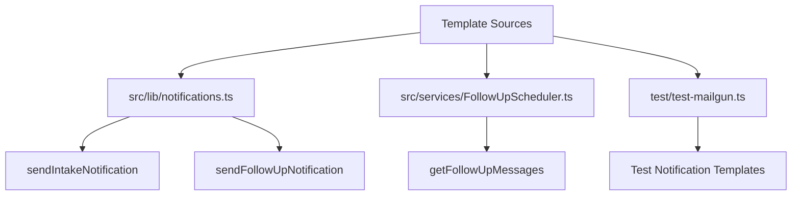
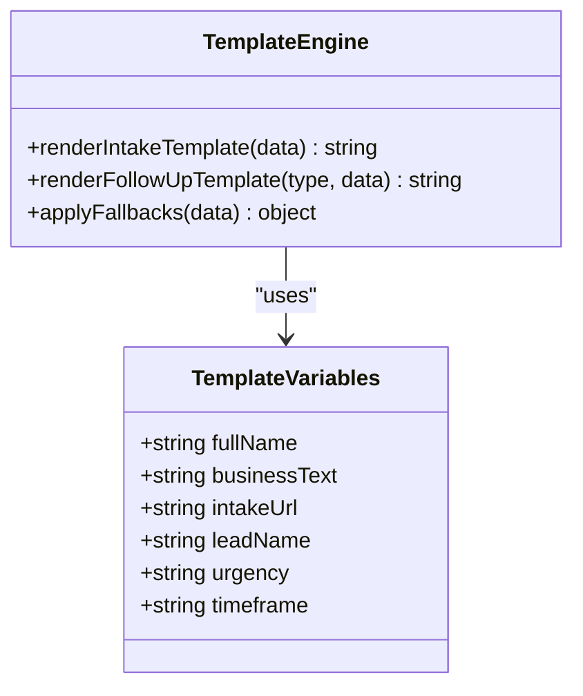
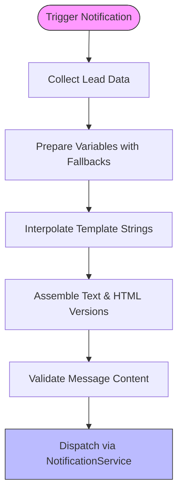
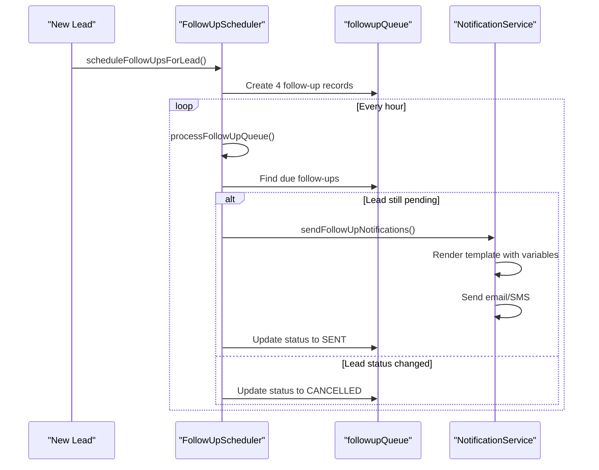
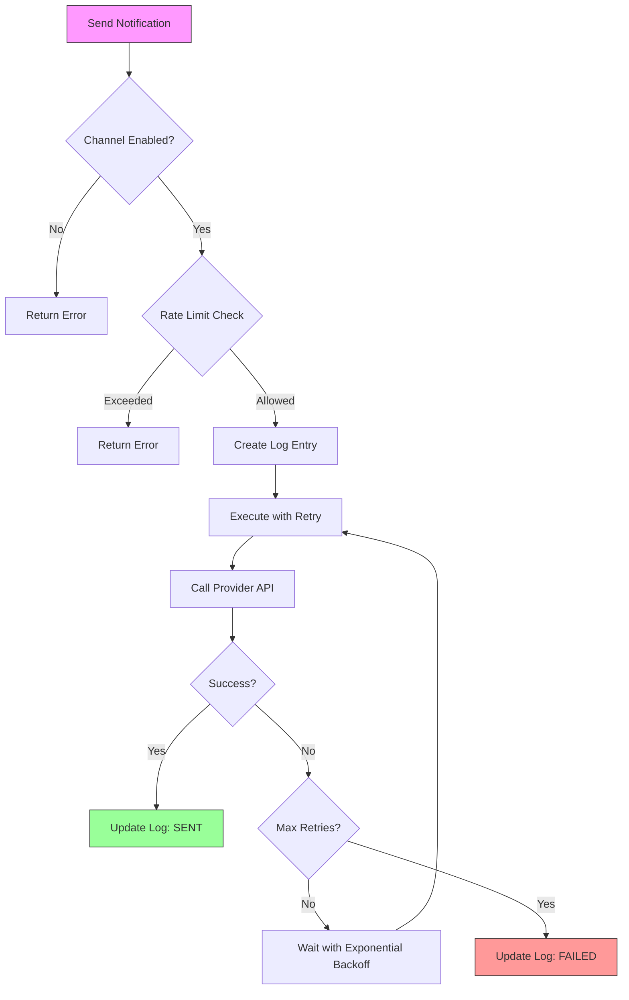
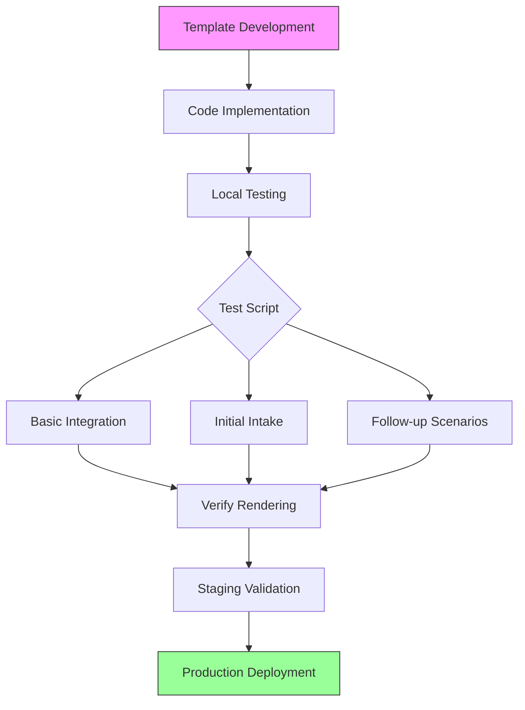
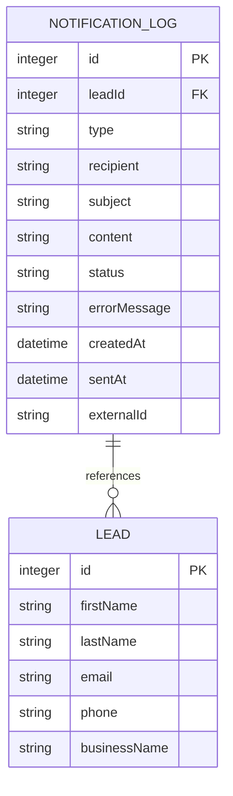

# Notification Templates and Message Management

<cite>
**Referenced Files in This Document**   
- [NotificationService.ts](file://src/services/NotificationService.ts)
- [notifications.ts](file://src/lib/notifications.ts)
- [FollowUpScheduler.ts](file://src/services/FollowUpScheduler.ts)
- [test-mailgun.ts](file://test/test-mailgun.ts)
- [page.tsx](file://src/app/admin/notifications/page.tsx)
</cite>

## Table of Contents
1. [Introduction](#introduction)
2. [Template Structure and Storage](#template-structure-and-storage)
3. [Template Variable System](#template-variable-system)
4. [Template Rendering Process](#template-rendering-process)
5. [Follow-up Notification System](#follow-up-notification-system)
6. [Notification Delivery and Retry Logic](#notification-delivery-and-retry-logic)
7. [Rate Limiting and Spam Prevention](#rate-limiting-and-spam-prevention)
8. [Template Testing and Development Workflow](#template-testing-and-development-workflow)
9. [Notification Logging and Monitoring](#notification-logging-and-monitoring)
10. [Best Practices for Template Management](#best-practices-for-template-management)

## Introduction
The notification system in the Fund Track application manages communication with leads through email and SMS channels. This document details the architecture, implementation, and management of notification templates used throughout the system. The templates are designed to facilitate personalized communication with prospects, incorporating dynamic data such as prospect names, business details, and intake deadlines. The system supports both immediate notifications and scheduled follow-ups, with comprehensive logging, error handling, and monitoring capabilities.

**Section sources**
- [NotificationService.ts](file://src/services/NotificationService.ts)
- [notifications.ts](file://src/lib/notifications.ts)

## Template Structure and Storage

The notification templates are not stored as separate files or in a database but are instead implemented directly within the application code. This approach embeds templates as string literals within TypeScript files, allowing for compile-time validation and direct integration with the application's business logic.

Email templates contain both plain text (`text`) and HTML (`html`) versions, ensuring compatibility across different email clients and user preferences. The HTML templates include inline CSS styling to maintain consistent appearance regardless of the recipient's email client rendering capabilities.

The primary template implementations are found in three key locations:
1. `src/lib/notifications.ts` - Contains helper functions for common notification scenarios
2. `src/services/FollowUpScheduler.ts` - Manages follow-up message templates
3. `test/test-mailgun.ts` - Includes test templates that reflect production templates



**Diagram sources**
- [notifications.ts](file://src/lib/notifications.ts)
- [FollowUpScheduler.ts](file://src/services/FollowUpScheduler.ts)
- [test-mailgun.ts](file://test/test-mailgun.ts)

**Section sources**
- [notifications.ts](file://src/lib/notifications.ts)
- [FollowUpScheduler.ts](file://src/services/FollowUpScheduler.ts)
- [test-mailgun.ts](file://test/test-mailgun.ts)

## Template Variable System

The template system uses JavaScript template literals (template strings) with embedded expressions to enable dynamic content insertion. Variables are interpolated using the `${variable}` syntax within template strings, allowing for personalized messaging with prospect-specific data.

Key template variables include:
- `${fullName}` - Concatenated first and last name of the prospect
- `${businessText}` - Business name with preposition (e.g., "for ABC Business LLC")
- `${intakeUrl}` - Secure application link with unique token
- `${leadName}` - Prospect's name or business name as fallback
- `${message.urgency}` - Contextual urgency text based on follow-up timing
- `${message.timeframe}` - Temporal context for when application was started

The system handles missing data gracefully by providing default values. For example, when a prospect's name is unavailable, the template uses "there" as a fallback:

```typescript
const fullName = [firstName, lastName].filter(Boolean).join(" ") || "there";
const businessText = businessName ? ` for ${businessName}` : "";
```

This approach ensures that notifications are always sent with coherent messaging, even when some prospect data is incomplete.



**Diagram sources**
- [notifications.ts](file://src/lib/notifications.ts)
- [FollowUpScheduler.ts](file://src/services/FollowUpScheduler.ts)

**Section sources**
- [notifications.ts](file://src/lib/notifications.ts)
- [FollowUpScheduler.ts](file://src/services/FollowUpScheduler.ts)

## Template Rendering Process

The template rendering process occurs at runtime when a notification is triggered. The system follows a structured flow to generate personalized messages before dispatch:

1. Data collection from the lead record
2. Variable preparation with fallbacks for missing data
3. Template string interpolation with dynamic values
4. Final message assembly with both text and HTML versions

For intake notifications, the rendering process begins with the `sendIntakeNotification` function in `src/lib/notifications.ts`:

```typescript
export async function sendIntakeNotification(
  leadId: number,
  leadData: LeadNotificationData
) {
  const { firstName, lastName, email, phone, intakeToken, businessName } =
    leadData;
  const fullName = [firstName, lastName].filter(Boolean).join(" ") || "there";
  const businessText = businessName ? ` for ${businessName}` : "";

  const intakeUrl = `${process.env.INTAKE_BASE_URL}/${intakeToken}`;
  // ... template usage follows
}
```

The rendered templates include both plain text and HTML versions, with the HTML version containing responsive design elements and styled call-to-action buttons. The styling uses inline CSS to ensure consistent rendering across different email clients.



**Diagram sources**
- [notifications.ts](file://src/lib/notifications.ts)
- [NotificationService.ts](file://src/services/NotificationService.ts)

**Section sources**
- [notifications.ts](file://src/lib/notifications.ts)

## Follow-up Notification System

The follow-up notification system implements a graduated reminder strategy with four distinct follow-up types, each with its own template and timing:

1. **3-Hour Follow-up**: Quick reminder shortly after application initiation
2. **9-Hour Follow-up**: Mid-day reminder for applications started that morning
3. **24-Hour Follow-up**: Friendly reminder for applications started the previous day
4. **72-Hour Follow-up**: Final reminder indicating application expiration

The `FollowUpScheduler` class in `src/services/FollowUpScheduler.ts` manages the scheduling and message content for these follow-ups. The templates are defined in the `getFollowUpMessages` method, which returns different messaging based on the follow-up type:

```typescript
private getFollowUpMessages(
  followUpType: FollowupType,
  leadName: string,
  intakeUrl: string
) {
  const baseMessages = {
    [FollowupType.THREE_HOUR]: {
      emailSubject: "Quick Reminder: Complete Your Merchant Funding Application",
      urgency: "We wanted to follow up quickly",
      timeframe: "just a few hours ago",
    },
    // ... other follow-up types
  };
  // ... message construction
}
```

The follow-up system automatically cancels pending notifications when a lead's status changes from "PENDING," preventing unnecessary communications to leads who have already completed their applications or been disqualified.



**Diagram sources**
- [FollowUpScheduler.ts](file://src/services/FollowUpScheduler.ts)
- [NotificationService.ts](file://src/services/NotificationService.ts)

**Section sources**
- [FollowUpScheduler.ts](file://src/services/FollowUpScheduler.ts)

## Notification Delivery and Retry Logic

The `NotificationService` class implements a robust delivery system with built-in retry logic and error handling. The service supports both email (via Mailgun) and SMS (via Twilio) delivery channels.

Key features of the delivery system include:

- **Lazy client initialization**: Third-party clients are initialized only when needed
- **Exponential backoff retry strategy**: Failed deliveries are retried with increasing delays
- **External ID tracking**: Each successful notification receives an external identifier from the provider
- **Comprehensive error handling**: Detailed error logging and reporting

The retry mechanism uses exponential backoff with the following parameters:
- Maximum retries: Configurable (default: 3)
- Base delay: Configurable (default: 1 second)
- Maximum delay: 30 seconds

```typescript
private async executeWithRetry<T>(
  fn: () => Promise<T>,
  operationType: string
): Promise<T> {
  let lastError: Error;

  for (let attempt = 0; attempt <= this.config.retryConfig.maxRetries; attempt++) {
    try {
      return await fn();
    } catch (error) {
      lastError = error instanceof Error ? error : new Error('Unknown error');

      if (attempt === this.config.retryConfig.maxRetries) {
        break;
      }

      const delay = Math.min(
        this.config.retryConfig.baseDelay * Math.pow(2, attempt),
        this.config.retryConfig.maxDelay
      );

      await this.sleep(delay);
    }
  }

  throw lastError!;
}
```



**Diagram sources**
- [NotificationService.ts](file://src/services/NotificationService.ts)

**Section sources**
- [NotificationService.ts](file://src/services/NotificationService.ts)

## Rate Limiting and Spam Prevention

The notification system implements multiple layers of rate limiting to prevent spam and ensure compliance with communication regulations:

1. **Per-recipient hourly limit**: Maximum of 2 notifications per hour to the same email or phone number
2. **Per-lead daily limit**: Maximum of 10 notifications per day to the same lead
3. **Configuration-based limits**: Retry attempts and delays are configurable via system settings

The rate limiting is implemented in the `checkRateLimit` method of the `NotificationService` class:

```typescript
private async checkRateLimit(
  recipient: string,
  type: 'EMAIL' | 'SMS',
  leadId?: number
): Promise<{ allowed: boolean; reason?: string }> {
  const now = new Date();
  const oneHourAgo = new Date(now.getTime() - 60 * 60 * 1000);
  const oneDayAgo = new Date(now.getTime() - 24 * 60 * 60 * 1000);

  // Check recipient hourly limit
  const recentNotifications = await prisma.notificationLog.count({
    where: {
      recipient,
      type: type as any,
      status: 'SENT',
      createdAt: { gte: oneHourAgo },
    },
  });

  if (recentNotifications >= 2) {
    return {
      allowed: false,
      reason: `Rate limit exceeded: ${recentNotifications} notifications sent to ${recipient} in the last hour`,
    };
  }

  // Check lead daily limit
  if (leadId) {
    const leadNotificationsToday = await prisma.notificationLog.count({
      where: {
        leadId,
        type: type as any,
        status: 'SENT',
        createdAt: { gte: oneDayAgo },
      },
    });

    if (leadNotificationsToday >= 10) {
      return {
        allowed: false,
        reason: `Daily limit exceeded: ${leadNotificationsToday} notifications sent to lead ${leadId} today`,
      };
    }
  }

  return { allowed: true };
}
```

These limits help maintain the application's sender reputation and ensure that communications remain relevant and welcome to recipients.

**Section sources**
- [NotificationService.ts](file://src/services/NotificationService.ts)

## Template Testing and Development Workflow

The development and testing workflow for notification templates involves several key practices and tools:

1. **Test script**: `test/test-mailgun.ts` provides a comprehensive testing framework for verifying template rendering and delivery
2. **Development environment**: Templates can be tested in development using the `test-notifications` page
3. **Staging validation**: All template changes are validated in staging before production deployment

The test script includes seven test cases that cover various template scenarios:

```typescript
const testNotifications: EmailNotification[] = [
  // 1. Basic Integration Test
  // 2. Initial Intake Notification (Basic)
  // 3. Initial Intake Notification (Enhanced)
  // 4. 3-Hour Follow-up Reminder
  // 5. 24-Hour Follow-up Reminder
  // 6. 72-Hour Final Follow-up
  // 7. General Follow-up Reminder
];
```

Each test case validates different aspects of the template system, from basic integration to specific follow-up messaging. The test script also includes a summary report that shows the success/failure status of each test.

For development, the application provides a test notifications page at `/dev/test-notifications` that allows developers to trigger sample notifications and verify template rendering in real-time.



**Diagram sources**
- [test-mailgun.ts](file://test/test-mailgun.ts)

**Section sources**
- [test-mailgun.ts](file://test/test-mailgun.ts)

## Notification Logging and Monitoring

The system maintains comprehensive logs of all notification attempts in the `notificationLog` database table. Each log entry includes:

- **Lead ID**: Reference to the associated lead
- **Type**: EMAIL or SMS
- **Recipient**: Email address or phone number
- **Subject/Content**: Message content
- **Status**: PENDING, SENT, or FAILED
- **Timestamps**: Creation, sending, and update times
- **Error messages**: Detailed error information for failed attempts

The admin interface at `/admin/notifications` provides a user-friendly view of recent notification history, allowing administrators to monitor delivery success and troubleshoot issues.

The `NotificationService` class includes several methods for retrieving notification statistics:

```typescript
async getNotificationStats(leadId: number) {
  const stats = await prisma.notificationLog.groupBy({
    by: ['type', 'status'],
    where: { leadId },
    _count: true,
  });
  // ... processing
}

async getRecentNotifications(limit: number = 50) {
  return prisma.notificationLog.findMany({
    take: limit,
    orderBy: { createdAt: 'desc' },
    include: {
      lead: {
        select: {
          id: true,
          firstName: true,
          lastName: true,
          email: true,
          phone: true,
        },
      },
    },
  });
}
```

These monitoring capabilities enable proactive identification of delivery issues and provide audit trails for compliance purposes.



**Diagram sources**
- [NotificationService.ts](file://src/services/NotificationService.ts)
- [page.tsx](file://src/app/admin/notifications/page.tsx)

**Section sources**
- [NotificationService.ts](file://src/services/NotificationService.ts)
- [page.tsx](file://src/app/admin/notifications/page.tsx)

## Best Practices for Template Management

Based on the current implementation, the following best practices are recommended for maintaining and evolving the notification template system:

1. **Consistent branding**: All templates should maintain consistent branding elements, including the "Merchant Funding Team" signature and similar formatting patterns.

2. **Regulatory compliance**: Ensure all templates comply with relevant regulations (e.g., CAN-SPAM, TCPA) by including clear identification, contact information, and opt-out mechanisms.

3. **Mobile optimization**: SMS templates should be concise (under 160 characters when possible) and include clear calls to action.

4. **Accessibility**: HTML email templates should maintain good accessibility practices, including proper contrast ratios and semantic HTML structure.

5. **Error resilience**: Templates should gracefully handle missing data through appropriate fallbacks and default values.

6. **Testing coverage**: All template changes should be accompanied by corresponding test cases in the test suite.

7. **Performance monitoring**: Regularly review notification delivery statistics to identify and address any deliverability issues.

8. **Version control**: Since templates are code, all changes are automatically tracked in version control, enabling easy rollback if needed.

The current implementation demonstrates a robust approach to notification management, balancing flexibility with reliability. Future enhancements could include externalizing templates to a database or content management system for easier non-technical editing, while maintaining the current system's strengths in reliability and integration.

**Section sources**
- [NotificationService.ts](file://src/services/NotificationService.ts)
- [notifications.ts](file://src/lib/notifications.ts)
- [FollowUpScheduler.ts](file://src/services/FollowUpScheduler.ts)