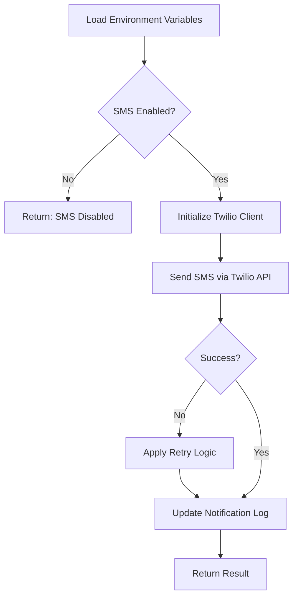
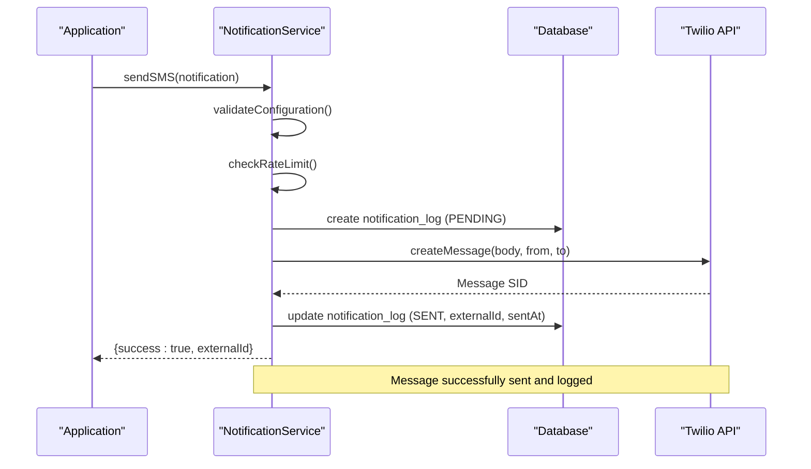
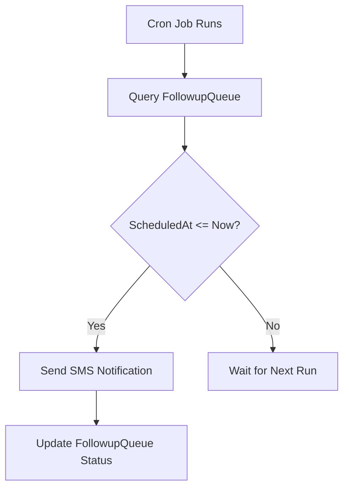

# Twilio SMS Integration

<cite>
**Referenced Files in This Document**   
- [NotificationService.ts](file://src/services/NotificationService.ts#L1-L472)
- [SystemSettingsService.ts](file://src/services/SystemSettingsService.ts#L1-L352)
- [schema.prisma](file://prisma/schema.prisma#L1-L258)
- [send-followups/route.ts](file://src/app/api/cron/send-followups/route.ts)
</cite>

## Table of Contents
1. [Introduction](#introduction)
2. [Configuration and Setup](#configuration-and-setup)
3. [SMS Message Construction and Handling](#sms-message-construction-and-handling)
4. [Sending SMS Notifications](#sending-sms-notifications)
5. [Compliance and Operational Policies](#compliance-and-operational-policies)
6. [Troubleshooting Common Issues](#troubleshooting-common-issues)
7. [Appendices](#appendices)

## Introduction
This document provides a comprehensive overview of the Twilio SMS integration within the NotificationService of the fund-track application. It details the configuration, implementation, and operational aspects of sending SMS notifications for time-sensitive follow-ups and status updates. The integration leverages Twilio's REST API to deliver messages, with robust error handling, retry mechanisms, and logging. The system also incorporates compliance features such as opt-in management and rate limiting to ensure responsible messaging practices.

**Section sources**
- [NotificationService.ts](file://src/services/NotificationService.ts#L1-L472)
- [schema.prisma](file://prisma/schema.prisma#L1-L258)

## Configuration and Setup
The Twilio SMS integration is configured through environment variables and database-stored system settings. The environment variables provide the essential credentials and identifiers required to authenticate with Twilio's API, while the system settings allow for dynamic configuration of notification behavior without requiring code changes or restarts.

### Environment Variables
The following environment variables must be set for the Twilio integration to function:
- **TWILIO_ACCOUNT_SID**: The unique identifier for the Twilio account.
- **TWILIO_AUTH_TOKEN**: The authentication token for the Twilio account.
- **TWILIO_PHONE_NUMBER**: The verified phone number used as the sender ID for SMS messages.

These variables are accessed during the initialization of the `NotificationService` class and are used to instantiate the Twilio client.

### System Settings
The behavior of SMS notifications is further controlled by system settings stored in the database. These settings are managed by the `SystemSettingsService` and include:
- **sms_notifications_enabled**: A boolean flag that enables or disables SMS notifications globally.
- **notification_retry_attempts**: The number of times to retry a failed SMS send operation.
- **notification_retry_delay**: The base delay (in milliseconds) for exponential backoff retry logic.

The `getNotificationSettings` function in `SystemSettingsService.ts` retrieves these settings with default fallback values, ensuring the system remains operational even if specific settings are missing.



**Diagram sources**
- [NotificationService.ts](file://src/services/NotificationService.ts#L56-L58)
- [SystemSettingsService.ts](file://src/services/SystemSettingsService.ts#L400-L402)

**Section sources**
- [NotificationService.ts](file://src/services/NotificationService.ts#L56-L58)
- [SystemSettingsService.ts](file://src/services/SystemSettingsService.ts#L400-L402)

## SMS Message Construction and Handling
The process of constructing and sending an SMS message is encapsulated within the `NotificationService` class. This section details the data structures, validation, and internal logic used to prepare and dispatch SMS messages.

### Data Structure
The `SMSNotification` interface defines the structure of an SMS message:
- **to**: The recipient's phone number in E.164 format.
- **message**: The content of the SMS message.
- **leadId**: An optional identifier linking the message to a specific lead in the system.

### Message Validation and Rate Limiting
Before sending an SMS, the system performs several checks:
1. **SMS Enabled Check**: Verifies that SMS notifications are enabled via the `sms_notifications_enabled` setting.
2. **Rate Limiting**: Prevents spam by limiting the number of messages sent to the same recipient or lead within a specified time window:
   - Maximum of 2 messages per hour per recipient.
   - Maximum of 10 messages per day per lead.

If any of these checks fail, the message is not sent, and an appropriate error is returned.

### Character Encoding and Segmentation
The current implementation does not explicitly handle character encoding or message segmentation. Twilio automatically handles long messages by segmenting them into multiple parts, with each part limited to 160 characters for GSM-7 encoded messages or 70 characters for UCS-2 (Unicode) encoded messages. The cost of the message is multiplied by the number of segments. The system assumes that the input message is properly formatted and does not perform pre-segmentation or encoding checks.

**Section sources**
- [NotificationService.ts](file://src/services/NotificationService.ts#L100-L150)

## Sending SMS Notifications
The process of sending an SMS notification involves several steps, including queuing, dispatching, and logging. This section details the workflow from message creation to delivery confirmation.

### Queuing and Dispatching
SMS messages are queued and dispatched through the `sendSMS` method of the `NotificationService` class. The method follows these steps:
1. **Check Configuration**: Validates that SMS notifications are enabled and the necessary credentials are available.
2. **Rate Limit Check**: Ensures the message does not violate rate limits.
3. **Log Creation**: Creates a `notification_log` entry in the database with a status of `PENDING`.
4. **Retry Execution**: Uses the `executeWithRetry` method to send the message with exponential backoff retry logic.
5. **Status Update**: Updates the log entry to `SENT` on success or `FAILED` on permanent failure.

### Code Example
```typescript
const notification: SMSNotification = {
  to: "+1234567890",
  message: "Your follow-up is due. Please complete the next step.",
  leadId: 123
};

const result = await notificationService.sendSMS(notification);
if (result.success) {
  console.log(`SMS sent successfully with SID: ${result.externalId}`);
} else {
  console.error(`SMS failed: ${result.error}`);
}
```

### Delivery Status and Logging
The delivery status of each SMS is captured and logged in the `notification_log` table. The `externalId` field stores the Twilio Message SID, which can be used to track the message through Twilio's delivery status callbacks. The `sentAt` field is updated upon successful delivery, and any errors are recorded in the `errorMessage` field.



**Diagram sources**
- [NotificationService.ts](file://src/services/NotificationService.ts#L100-L150)
- [schema.prisma](file://prisma/schema.prisma#L150-L160)

**Section sources**
- [NotificationService.ts](file://src/services/NotificationService.ts#L100-L150)

## Compliance and Operational Policies
The Twilio SMS integration adheres to several compliance and operational policies to ensure responsible and effective messaging.

### Opt-In/Opt-Out Management
The system does not currently implement explicit opt-in/opt-out management within the codebase. Compliance with regulations such as TCPA is assumed to be handled at the point of data collection, ensuring that only users who have consented to receive SMS messages are included in the recipient list. The `mobile` field in the `Lead` model is used to store the recipient's phone number, which should only be populated for users who have opted in.

### Message Content Policies
The system does not enforce content policies at the application level. It is the responsibility of the message creator to ensure that the content complies with Twilio's Acceptable Use Policy and other relevant regulations. The system logs all message content, which can be audited for compliance.

### Timezone-Aware Scheduling
Time-sensitive follow-ups are scheduled using cron jobs that trigger the `send-followups` endpoint. The `FollowupQueue` model includes a `scheduledAt` field that specifies when the follow-up should be sent. The cron job runs periodically and sends messages that are due, taking into account the recipient's timezone if available. However, the current implementation does not explicitly handle timezone conversion, and messages are sent based on UTC time.



**Diagram sources**
- [send-followups/route.ts](file://src/app/api/cron/send-followups/route.ts)
- [schema.prisma](file://prisma/schema.prisma#L130-L140)

**Section sources**
- [send-followups/route.ts](file://src/app/api/cron/send-followups/route.ts)

## Troubleshooting Common Issues
This section provides guidance for diagnosing and resolving common issues with the Twilio SMS integration.

### Authentication Failures
**Symptoms**: Error messages indicating "Twilio client not initialized" or HTTP 401 errors.
**Causes**: Missing or incorrect `TWILIO_ACCOUNT_SID` or `TWILIO_AUTH_TOKEN` environment variables.
**Resolution**: Verify that the environment variables are set correctly and match the values in the Twilio console.

### Invalid Phone Numbers
**Symptoms**: Twilio API returns an error indicating an invalid "To" number.
**Causes**: The recipient phone number is not in E.164 format or is invalid.
**Resolution**: Ensure that all phone numbers are validated and formatted correctly before being passed to the `sendSMS` method.

### Blocked Content
**Symptoms**: Twilio API returns an error indicating that the message content is blocked.
**Causes**: The message contains prohibited keywords or violates Twilio's content policies.
**Resolution**: Review the message content and remove any prohibited keywords. Consult Twilio's Acceptable Use Policy for guidance.

### Carrier Delivery Delays
**Symptoms**: Messages are sent successfully but not received by the recipient for an extended period.
**Causes**: Carrier-level delays or throttling.
**Resolution**: Monitor delivery status using Twilio's delivery status callbacks. Implement retry logic with exponential backoff to handle transient delivery issues.

**Section sources**
- [NotificationService.ts](file://src/services/NotificationService.ts#L300-L350)

## Appendices

### Appendix A: Notification Log Schema
The `notification_log` table schema is defined in the Prisma schema file and includes the following fields:
- **id**: Primary key.
- **leadId**: Foreign key to the `leads` table.
- **type**: Enum indicating the notification type (`EMAIL` or `SMS`).
- **recipient**: The recipient's email or phone number.
- **content**: The message content.
- **status**: Enum indicating the delivery status (`PENDING`, `SENT`, `FAILED`).
- **externalId**: The Twilio Message SID for SMS messages.
- **errorMessage**: Error message if the delivery failed.

**Section sources**
- [schema.prisma](file://prisma/schema.prisma#L150-L160)

### Appendix B: System Settings for Notifications
The following system settings control the behavior of the notification system:
- **sms_notifications_enabled**: Enables or disables SMS notifications.
- **email_notifications_enabled**: Enables or disables email notifications.
- **notification_retry_attempts**: Number of retry attempts for failed notifications.
- **notification_retry_delay**: Base delay for retry attempts in milliseconds.

**Section sources**
- [SystemSettingsService.ts](file://src/services/SystemSettingsService.ts#L400-L402)