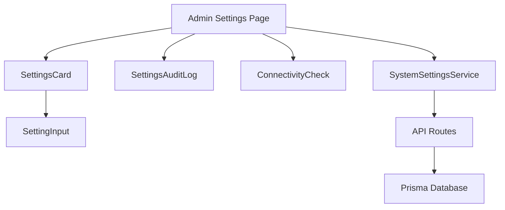
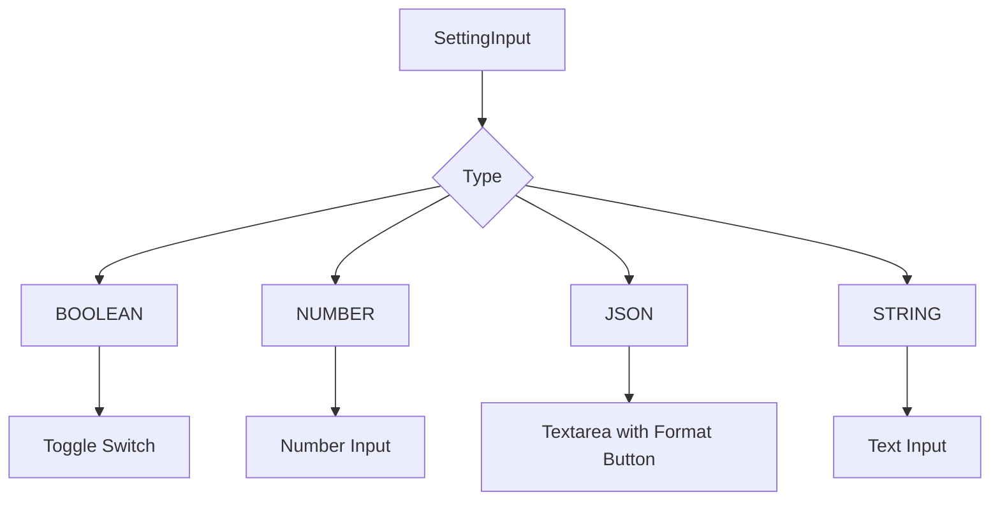
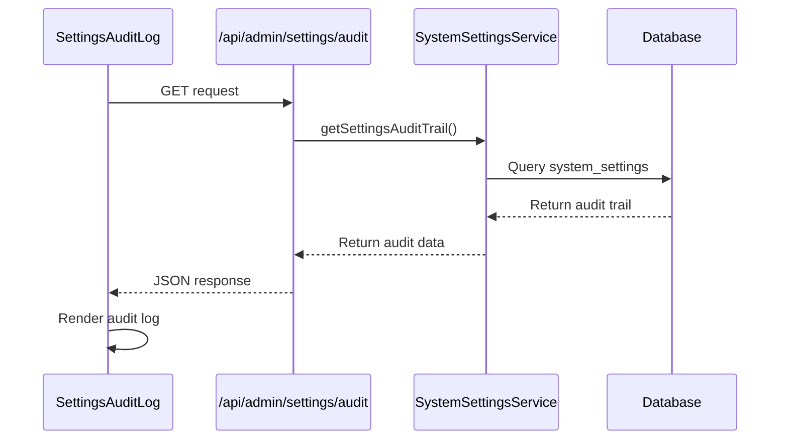
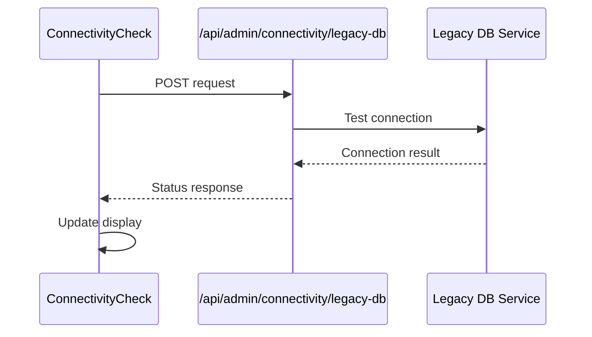
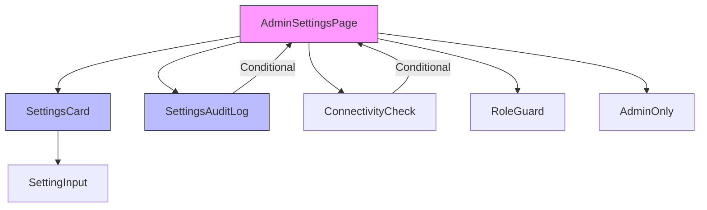
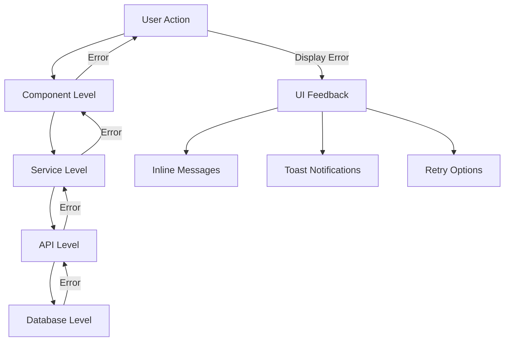

# Admin Components

<cite>
**Referenced Files in This Document**   
- [SettingsCard.tsx](file://src/components/admin/SettingsCard.tsx)
- [SettingInput.tsx](file://src/components/admin/SettingInput.tsx)
- [SettingsAuditLog.tsx](file://src/components/admin/SettingsAuditLog.tsx)
- [ConnectivityCheck.tsx](file://src/components/admin/ConnectivityCheck.tsx)
- [page.tsx](file://src/app/admin/settings/page.tsx)
- [SystemSettingsService.ts](file://src/services/SystemSettingsService.ts)
- [route.ts](file://src/app/api/admin/settings/route.ts)
- [audit/route.ts](file://src/app/api/admin/settings/audit/route.ts)
- [schema.prisma](file://prisma/schema.prisma)
- [system-settings.ts](file://prisma/seeds/system-settings.ts)
</cite>

## Table of Contents
1. [Introduction](#introduction)
2. [Core Components Overview](#core-components-overview)
3. [SettingsCard Component](#settingscard-component)
4. [SettingInput Component](#settinginput-component)
5. [SettingsAuditLog Component](#settingsauditlog-component)
6. [ConnectivityCheck Component](#connectivitycheck-component)
7. [System Settings Service](#system-settings-service)
8. [Data Flow and Integration](#data-flow-and-integration)
9. [Error Handling Strategies](#error-handling-strategies)
10. [Testing Considerations](#testing-considerations)

## Introduction
The admin components in the fund-track application provide a comprehensive interface for system administrators to manage critical system settings, monitor external service connectivity, and audit configuration changes. These components are specifically designed for the `/admin/settings` interface and offer a user-friendly way to configure system-wide parameters that affect application behavior. The components work together to provide a cohesive administrative experience with real-time feedback, validation, and historical tracking of configuration changes.

## Core Components Overview
The admin settings interface is composed of four primary components that work together to provide a complete system configuration experience:

- **SettingsCard**: Container component for organizing settings by category
- **SettingInput**: Controlled input component with type-specific rendering and validation
- **SettingsAuditLog**: Component for displaying historical changes to system settings
- **ConnectivityCheck**: Component for testing and displaying external service health status

These components are orchestrated within the `/admin/settings` page, which serves as the main entry point for system configuration management.



**Diagram sources**
- [page.tsx](file://src/app/admin/settings/page.tsx)
- [SettingsCard.tsx](file://src/components/admin/SettingsCard.tsx)
- [SettingInput.tsx](file://src/components/admin/SettingInput.tsx)
- [SettingsAuditLog.tsx](file://src/components/admin/SettingsAuditLog.tsx)
- [ConnectivityCheck.tsx](file://src/components/admin/ConnectivityCheck.tsx)

## SettingsCard Component

The SettingsCard component serves as a container for organizing and displaying system settings by category. It provides a consistent UI for managing settings with update and reset functionality.

### Purpose and Implementation
The SettingsCard component (file://src/components/admin/SettingsCard.tsx) is designed to:
- Group related settings by category
- Provide individual update and reset actions for each setting
- Display setting metadata (default values, last updated timestamp)
- Handle loading states and error conditions
- Present a clean, organized interface for configuration management

### Props Interface
```typescript
interface SettingsCardProps {
  category: SystemSettingCategory;
  settings: SystemSetting[];
  onUpdate: (key: string, value: string) => Promise<void>;
  onReset: (key: string) => Promise<void>;
}
```

### Key Features
- **Category Organization**: Settings are grouped by their category (e.g., NOTIFICATIONS, CONNECTIVITY)
- **Update Handling**: Each setting has its own update handler that manages loading states and error conditions
- **Reset Functionality**: Individual settings can be reset to their default values
- **Error Management**: Errors are displayed inline with the affected setting
- **Loading States**: Visual feedback during update/reset operations

### Usage Example
```tsx
<SettingsCard
  category={SystemSettingCategory.NOTIFICATIONS}
  settings={notificationSettings}
  onUpdate={handleSettingUpdate}
  onReset={handleSettingReset}
/>
```

**Section sources**
- [SettingsCard.tsx](file://src/components/admin/SettingsCard.tsx#L0-L139)

## SettingInput Component

The SettingInput component provides a type-specific form input for system settings with built-in validation and real-time update handling.

### Purpose and Implementation
The SettingInput component (file://src/components/admin/SettingInput.tsx) is designed to:
- Render appropriate input controls based on setting type
- Provide type-specific validation
- Handle real-time updates with immediate feedback
- Support different input types (BOOLEAN, NUMBER, JSON, STRING)

### Props Interface
```typescript
interface SettingInputProps {
  setting: SystemSetting;
  onUpdate: (value: string) => void;
  isUpdating: boolean;
  error?: string;
}
```

### Type-Specific Rendering
The component renders different input types based on the setting's type field:



**Diagram sources**
- [SettingInput.tsx](file://src/components/admin/SettingInput.tsx#L0-L164)

### Key Features
- **Boolean Settings**: Rendered as toggle switches with immediate saving
- **Number Settings**: Standard number input with save button
- **JSON Settings**: Textarea with JSON formatting capability
- **String Settings**: Standard text input with save button
- **Change Detection**: Tracks unsaved changes and enables save button
- **Keyboard Support**: Enter key saves changes for non-boolean settings

### Validation and Error Handling
The component displays validation errors passed from the parent component and provides visual feedback during update operations.

**Section sources**
- [SettingInput.tsx](file://src/components/admin/SettingInput.tsx#L0-L164)

## SettingsAuditLog Component

The SettingsAuditLog component displays historical changes to system settings with timestamp and user attribution.

### Purpose and Implementation
The SettingsAuditLog component (file://src/components/admin/SettingsAuditLog.tsx) is designed to:
- Display a chronological list of setting changes
- Show who made each change (user email)
- Display when changes were made (timestamp)
- Provide error handling and retry functionality

### Data Structure
```typescript
interface AuditLogEntry {
  id: number;
  key: string;
  value: string;
  updatedAt: string;
  user?: {
    id: number;
    email: string;
  };
}
```

### Key Features
- **Table Display**: Settings are displayed in a responsive table format
- **Truncation**: Long values are truncated with ellipsis for readability
- **Loading States**: Skeleton loading animation during data fetch
- **Error Recovery**: Retry button when fetch fails
- **Timestamp Formatting**: Human-readable date and time display

### API Integration
The component fetches audit data from the `/api/admin/settings/audit` endpoint, which returns the most recent 50 changes by default.



**Diagram sources**
- [SettingsAuditLog.tsx](file://src/components/admin/SettingsAuditLog.tsx#L0-L135)
- [audit/route.ts](file://src/app/api/admin/settings/audit/route.ts#L0-L32)
- [SystemSettingsService.ts](file://src/services/SystemSettingsService.ts#L204-L239)

**Section sources**
- [SettingsAuditLog.tsx](file://src/components/admin/SettingsAuditLog.tsx#L0-L135)

## ConnectivityCheck Component

The ConnectivityCheck component visualizes the health status of external services, specifically the legacy database connection.

### Purpose and Implementation
The ConnectivityCheck component (file://src/components/admin/ConnectivityCheck.tsx) is designed to:
- Test connectivity to external services
- Display connection status with visual indicators
- Show detailed connection information
- Provide configuration details

### Data Structure
```typescript
interface ConnectivityStatus {
  status: 'connected' | 'disconnected' | 'failed' | 'error';
  error?: string;
  details: {
    responseTime?: string;
    serverInfo?: any;
    connectionStatus?: string;
    error?: string;
  };
  timestamp: string;
  config: {
    server: string;
    database: string;
    port: string;
    encrypt: string;
    trustServerCertificate: string;
  };
}
```

### Key Features
- **Status Indicators**: Visual icons and color-coded status text
- **Detailed Information**: Connection details and configuration display
- **Manual Testing**: "Test Connection" button to initiate connectivity check
- **Error Display**: Clear error messages when connection fails
- **Timestamp**: When the last test was performed

### API Integration
The component interacts with the `/api/admin/connectivity/legacy-db` endpoint to test database connectivity.



**Section sources**
- [ConnectivityCheck.tsx](file://src/components/admin/ConnectivityCheck.tsx#L0-L199)

## System Settings Service

The SystemSettingsService provides the backend functionality for managing system settings with caching and type safety.

### Architecture and Implementation
The SystemSettingsService (file://src/services/SystemSettingsService.ts) is implemented as a singleton class with the following key features:

- **Caching**: In-memory cache with 5-minute TTL to reduce database queries
- **Type Safety**: Type guards and parsing for different setting types
- **Validation**: Input validation based on setting type
- **Audit Trail**: Historical tracking of setting changes

### Key Methods
- **getSetting()**: Retrieve a setting with type safety
- **getSettingWithDefault()**: Retrieve a setting with fallback to default
- **updateSetting()**: Update a setting value with validation
- **resetSetting()**: Reset a setting to its default value
- **getSettingsAuditTrail()**: Retrieve historical changes

### Type System
The service implements a type-safe interface for settings:

```typescript
export interface SystemSettingValue {
  boolean: boolean;
  string: string;
  number: number;
  json: any;
}
```

This allows for type-safe retrieval and parsing of setting values.

### Validation Logic
The service validates values based on their type:
- **BOOLEAN**: Must be "true" or "false"
- **NUMBER**: Must be a valid number
- **JSON**: Must be valid JSON
- **STRING**: Always valid

```mermaid
graph TD
A[updateSetting] --> B{Validate Type}
B --> C[BOOLEAN]
B --> D[NUMBER]
B --> E[JSON]
B --> F[STRING]
C --> G[Check "true"/"false"]
D --> H[Check isNaN]
E --> I[Try JSON.parse]
F --> J[Accept any string]
G --> K{Valid?}
H --> K
I --> K
J --> K
K --> |Yes| L[Update Database]
K --> |No| M[Throw Error]
```

**Diagram sources**
- [SystemSettingsService.ts](file://src/services/SystemSettingsService.ts#L241-L289)

**Section sources**
- [SystemSettingsService.ts](file://src/services/SystemSettingsService.ts#L0-L349)

## Data Flow and Integration

### Component Composition
The admin settings page (file://src/app/admin/settings/page.tsx) composes the various components into a cohesive interface:



**Diagram sources**
- [page.tsx](file://src/app/admin/settings/page.tsx#L0-L263)

### Data Flow
The data flow from API to UI follows this pattern:

1. **Initial Load**: Page component fetches all settings via `/api/admin/settings`
2. **Categorization**: Settings are grouped by category for display
3. **Rendering**: SettingsCard renders settings by category
4. **User Interaction**: SettingInput handles user input and validation
5. **Update**: Changes are sent to `/api/admin/settings/[key]`
6. **Refresh**: Settings are re-fetched to update the UI
7. **Audit**: Changes are recorded and available via audit endpoint

### API Endpoints
- **GET /api/admin/settings**: Retrieve all settings
- **PUT /api/admin/settings/[key]**: Update a specific setting
- **POST /api/admin/settings/[key]**: Reset a setting to default
- **GET /api/admin/settings/audit**: Retrieve audit trail
- **GET /api/admin/connectivity/legacy-db**: Test legacy database connection

**Section sources**
- [page.tsx](file://src/app/admin/settings/page.tsx#L0-L263)
- [route.ts](file://src/app/api/admin/settings/route.ts#L0-L105)
- [audit/route.ts](file://src/app/api/admin/settings/audit/route.ts#L0-L32)

## Error Handling Strategies

### Client-Side Error Handling
Each component implements comprehensive error handling:

- **SettingsCard**: Displays inline errors for failed updates/resets
- **SettingInput**: Shows validation errors and update failures
- **SettingsAuditLog**: Provides retry functionality for failed fetches
- **ConnectivityCheck**: Displays detailed error messages for connection failures

### Error Propagation
Errors are handled at multiple levels:



**Diagram sources**
- [SettingsCard.tsx](file://src/components/admin/SettingsCard.tsx#L0-L139)
- [SettingInput.tsx](file://src/components/admin/SettingInput.tsx#L0-L164)
- [SettingsAuditLog.tsx](file://src/components/admin/SettingsAuditLog.tsx#L0-L135)

### Specific Error Cases
- **Unauthorized Access**: Redirect to login or show permission error
- **Network Errors**: Retry mechanisms and offline indicators
- **Validation Errors**: Clear messages about required format
- **Server Errors**: Generic error messages with logging
- **Cache Errors**: Automatic cache refresh and fallback

**Section sources**
- [SettingsCard.tsx](file://src/components/admin/SettingsCard.tsx#L0-L139)
- [SettingInput.tsx](file://src/components/admin/SettingInput.tsx#L0-L164)
- [SettingsAuditLog.tsx](file://src/components/admin/SettingsAuditLog.tsx#L0-L135)
- [ConnectivityCheck.tsx](file://src/components/admin/ConnectivityCheck.tsx#L0-L199)

## Testing Considerations

### Component Testing
Each component should be tested for:
- **Rendering**: Correct display of settings and controls
- **User Interactions**: Click handlers, input changes, keyboard events
- **State Management**: Loading states, error states, success states
- **Props Handling**: Correct behavior with different prop combinations

### Integration Testing
Key integration points to test:
- **SettingsCard with SettingInput**: Proper prop passing and event handling
- **Page with API**: Correct data fetching and error handling
- **Service with Database**: Cache behavior and data persistence

### Service Testing
The SystemSettingsService should be tested for:
- **Caching**: TTL behavior and cache refresh
- **Type Safety**: Correct parsing of different setting types
- **Validation**: Proper rejection of invalid values
- **Error Handling**: Appropriate error messages for different failure modes

### API Testing
API endpoints should be tested for:
- **Authentication**: Proper role-based access control
- **Input Validation**: Rejection of malformed requests
- **Response Formats**: Consistent JSON structure
- **Error Responses**: Appropriate status codes and messages

### Data Model
The SystemSetting model (file://prisma/schema.prisma) defines the database structure:

```prisma
model SystemSetting {
  id           Int                @id @default(autoincrement())
  key          String             @unique
  value        String
  type         SystemSettingType
  category     SystemSettingCategory
  description  String
  defaultValue String             @map("default_value")
  updatedBy    Int?               @map("updated_by")
  createdAt    DateTime           @default(now()) @map("created_at")
  updatedAt    DateTime           @updatedAt @map("updated_at")

  // Relations
  user User? @relation(fields: [updatedBy], references: [id])

  @@map("system_settings")
}

enum SystemSettingType {
  BOOLEAN @map("boolean")
  STRING  @map("string")
  NUMBER  @map("number")
  JSON    @map("json")
}

enum SystemSettingCategory {
  NOTIFICATIONS    @map("notifications")
  CONNECTIVITY     @map("connectivity")
}
```

**Section sources**
- [schema.prisma](file://prisma/schema.prisma#L175-L257)
- [system-settings.ts](file://prisma/seeds/system-settings.ts#L0-L73)