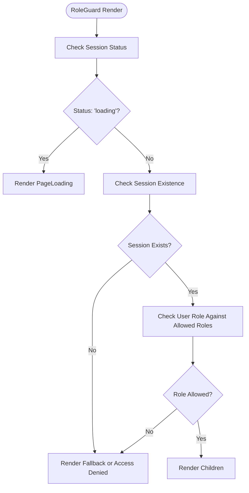
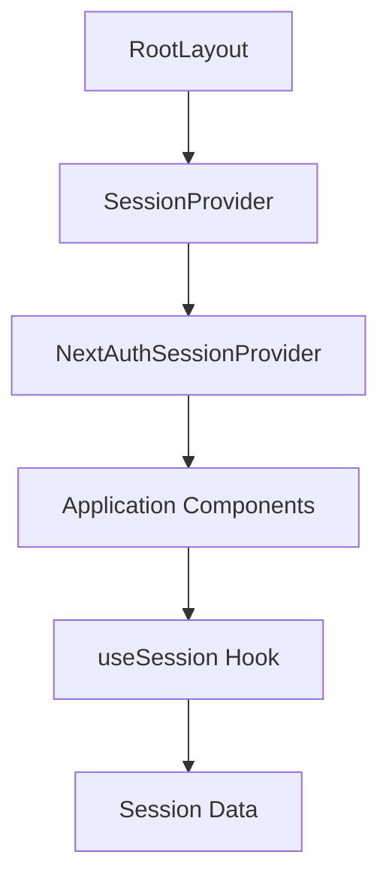
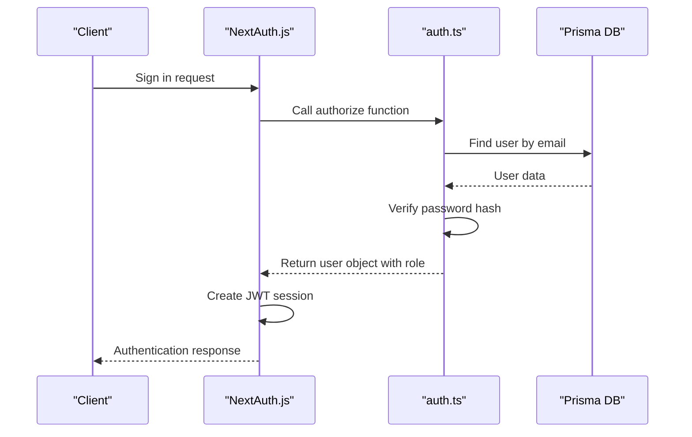

# Authentication Components

<cite>
**Referenced Files in This Document**   
- [RoleGuard.tsx](file://src/components/auth/RoleGuard.tsx#L1-L75)
- [SessionProvider.tsx](file://src/components/auth/SessionProvider.tsx#L1-L15)
- [layout.tsx](file://src/app/layout.tsx#L1-L35)
- [auth.ts](file://src/lib/auth.ts#L1-L70)
- [route.ts](file://src/app/api/auth/[...nextauth]/route.ts#L1-L6)
- [route.ts](file://src/app/api/auth/session/route.ts#L1-L32)
- [signin/page.tsx](file://src/app/auth/signin/page.tsx#L1-L50)
- [page.tsx](file://src/app/admin/page.tsx#L1-L111)
- [next-auth.d.ts](file://src/types/next-auth.d.ts)
</cite>

## Table of Contents
1. [Introduction](#introduction)
2. [Core Authentication Components](#core-authentication-components)
3. [RoleGuard: Role-Based Access Control](#roleguard-role-based-access-control)
4. [SessionProvider: Authentication State Management](#sessionprovider-authentication-state-management)
5. [Integration with NextAuth.js](#integration-with-nextauthjs)
6. [Usage Examples and Patterns](#usage-examples-and-patterns)
7. [Error Handling and Edge Cases](#error-handling-and-edge-cases)
8. [Security Considerations](#security-considerations)

## Introduction
The fund-track application implements a robust authentication and authorization system using NextAuth.js for session management and custom React components for role-based access control. This document details the two core components—`RoleGuard` and `SessionProvider`—that work together to secure routes, manage authentication state, and enforce role-based permissions throughout the application. The system supports different user roles and provides mechanisms for handling unauthorized access, loading states, and session expiration.

## Core Authentication Components

The authentication architecture in fund-track is built around two primary components:

- **SessionProvider**: A context provider that makes authentication state available to all components in the React tree
- **RoleGuard**: A higher-order component that restricts access to specific routes based on user roles

These components work in conjunction with NextAuth.js to provide a seamless authentication experience while enforcing security policies at both the UI and API levels.

**Section sources**
- [RoleGuard.tsx](file://src/components/auth/RoleGuard.tsx#L1-L75)
- [SessionProvider.tsx](file://src/components/auth/SessionProvider.tsx#L1-L15)

## RoleGuard: Role-Based Access Control

The `RoleGuard` component is a higher-order React component that conditionally renders its children based on the authenticated user's role. It serves as the primary mechanism for enforcing role-based access control in the application.

### Implementation Details



**Diagram sources**
- [RoleGuard.tsx](file://src/components/auth/RoleGuard.tsx#L1-L75)

**Section sources**
- [RoleGuard.tsx](file://src/components/auth/RoleGuard.tsx#L1-L75)

### Key Features

- **Conditional Rendering**: Only renders children if the user has an allowed role
- **Loading State Handling**: Displays a loading indicator while session data is being fetched
- **Flexible Fallback**: Supports custom fallback content for unauthorized users
- **Default Denial UI**: Provides a standard "Access denied" interface when no fallback is specified

### Props Interface

```typescript
interface RoleGuardProps {
  children: ReactNode;
  allowedRoles: UserRole[];
  fallback?: ReactNode;
}
```

- **children**: Content to render for authorized users
- **allowedRoles**: Array of `UserRole` enum values that are permitted access
- **fallback**: Optional content to render for unauthorized users (if undefined, shows default denial UI)

### Convenience Components

The `RoleGuard` exports two convenience components for common use cases:

#### AdminOnly
Restricts access to ADMIN role users only:
```typescript
export function AdminOnly({ children, fallback = null }) {
  return <RoleGuard allowedRoles={[UserRole.ADMIN]} fallback={fallback}>{children}</RoleGuard>;
}
```

#### AuthenticatedOnly
Allows access to any authenticated user (ADMIN or USER roles):
```typescript
export function AuthenticatedOnly({ children, fallback = null }) {
  return <RoleGuard allowedRoles={[UserRole.ADMIN, UserRole.USER]} fallback={fallback}>{children}</RoleGuard>;
}
```

## SessionProvider: Authentication State Management

The `SessionProvider` component wraps the application and makes authentication state available throughout the component tree using React Context.

### Implementation



**Diagram sources**
- [SessionProvider.tsx](file://src/components/auth/SessionProvider.tsx#L1-L15)
- [layout.tsx](file://src/app/layout.tsx#L1-L35)

**Section sources**
- [SessionProvider.tsx](file://src/components/auth/SessionProvider.tsx#L1-L15)
- [layout.tsx](file://src/app/layout.tsx#L1-L35)

### Component Structure

```typescript
export function SessionProvider({ children }: SessionProviderProps) {
  return (
    <NextAuthSessionProvider>
      {children}
    </NextAuthSessionProvider>
  )
}
```

The `SessionProvider` is a thin wrapper around NextAuth.js's `SessionProvider`, re-exported to maintain a consistent import path within the application.

### Application Integration

The `SessionProvider` is integrated at the root layout level, ensuring all pages have access to authentication state:

```tsx
// src/app/layout.tsx
export default function RootLayout({ children }: { children: React.ReactNode }) {
  return (
    <html lang="en">
      <body>
        <ServerInitializer />
        <ErrorBoundary>
          <SessionProvider>{children}</SessionProvider>
        </ErrorBoundary>
      </body>
    </html>
  );
}
```

This ensures that the authentication context is available to all pages and components throughout the application.

## Integration with NextAuth.js

The authentication system is built on NextAuth.js, with custom configuration to support role-based access control.

### Authentication Configuration



**Diagram sources**
- [auth.ts](file://src/lib/auth.ts#L1-L70)
- [route.ts](file://src/app/api/auth/[...nextauth]/route.ts#L1-L6)

**Section sources**
- [auth.ts](file://src/lib/auth.ts#L1-L70)
- [route.ts](file://src/app/api/auth/[...nextauth]/route.ts#L1-L6)

### Key Configuration Elements

#### Credentials Provider
```typescript
CredentialsProvider({
  name: "credentials",
  credentials: {
    email: { label: "Email", type: "email" },
    password: { label: "Password", type: "password" }
  },
  async authorize(credentials) {
    // Validate credentials and return user object with role
  }
})
```

#### Session Callbacks
The configuration extends the default session to include role information:

```typescript
callbacks: {
  async jwt({ token, user }) {
    if (user) {
      token.id = user.id
      token.role = user.role
    }
    return token
  },
  async session({ session, token }) {
    if (token) {
      session.user.id = token.id as string
      session.user.role = token.role as UserRole
    }
    return session
  },
}
```

### API Routes

#### Authentication Endpoint
```typescript
// src/app/api/auth/[...nextauth]/route.ts
import NextAuth from "next-auth"
import { authOptions } from "@/lib/auth"

const handler = NextAuth(authOptions)
export { handler as GET, handler as POST }
```

#### Session Retrieval
```typescript
// src/app/api/auth/session/route.ts
export async function GET(request: NextRequest) {
  const session = await getServerSession(authOptions)
  // Returns session user data including role
}
```

## Usage Examples and Patterns

### Protecting Admin Routes

The admin dashboard uses `RoleGuard` to restrict access:

```tsx
// src/app/admin/settings/page.tsx
import { RoleGuard } from "@/components/auth/RoleGuard";

export default function SettingsPage() {
  return (
    <RoleGuard allowedRoles={[UserRole.ADMIN]}>
      {/* Admin-only content */}
    </RoleGuard>
  );
}
```

### Dashboard Protection

The main dashboard is protected to allow both ADMIN and USER roles:

```tsx
// src/app/dashboard/page.tsx
import { AuthenticatedOnly } from "@/components/auth/RoleGuard";

export default function DashboardPage() {
  return (
    <AuthenticatedOnly>
      {/* Dashboard content */}
    </AuthenticatedOnly>
  );
}
```

### Component-Level Protection

Individual components can also be protected:

```tsx
// src/components/dashboard/LeadDetailView.tsx
<RoleGuard allowedRoles={[UserRole.ADMIN]} fallback={<></>}>
  <AdminActionsPanel />
</RoleGuard>
```

This pattern allows for fine-grained control over UI elements based on user roles.

### Custom Fallback Content

```tsx
<RoleGuard 
  allowedRoles={[UserRole.ADMIN]} 
  fallback={<p>You do not have administrative privileges</p>}
>
  <AdminPanel />
</RoleGuard>
```

## Error Handling and Edge Cases

### Loading State
During authentication initialization, `RoleGuard` displays a loading indicator:

```tsx
if (status === "loading") return <PageLoading />;
```

This prevents flash-of-unauthorized-content issues while session data is being retrieved.

### Session Expiration
When a session expires or becomes invalid:
- The `useSession` hook returns `status: "unauthenticated"`
- `RoleGuard` treats this as unauthorized access
- Users are shown the fallback content or access denied UI
- Users must re-authenticate to regain access

### Invalid Roles
If a user's role is not in the allowed roles array:
- Access is denied
- The fallback content is rendered (if provided)
- Otherwise, the default "Access denied" UI is displayed

### Edge Case: Missing Session Data
In cases where session data is incomplete or corrupted:
- The component treats this as an unauthorized state
- Security is prioritized over usability
- Users are prompted to sign in again

## Security Considerations

### Defense in Depth
The application employs multiple layers of security:
- **Client-side**: `RoleGuard` prevents unauthorized UI access
- **Server-side**: API routes validate permissions independently
- **Database**: Prisma adapter ensures data access controls

### Role Enumeration Prevention
The system does not expose role information to unauthorized users:
- Role checks happen client-side only after authentication
- API endpoints validate permissions separately
- Error messages do not reveal role structure

### Session Security
- Sessions use JWT strategy for stateless authentication
- Passwords are hashed with bcrypt
- Session data includes minimal necessary information

### Best Practices
- Always use `RoleGuard` for route protection
- Never rely solely on client-side checks for sensitive operations
- Implement server-side permission validation for API endpoints
- Use specific role requirements rather than broad permissions
- Regularly audit role assignments and access controls