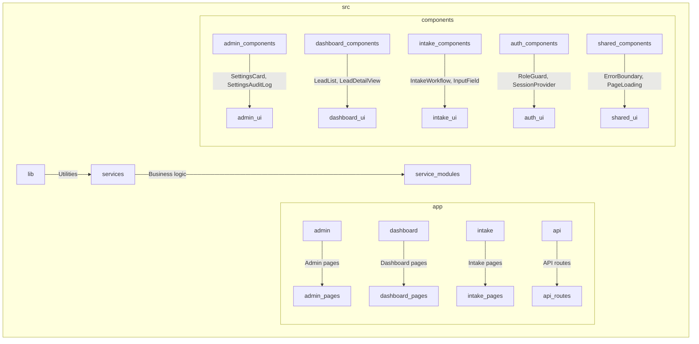
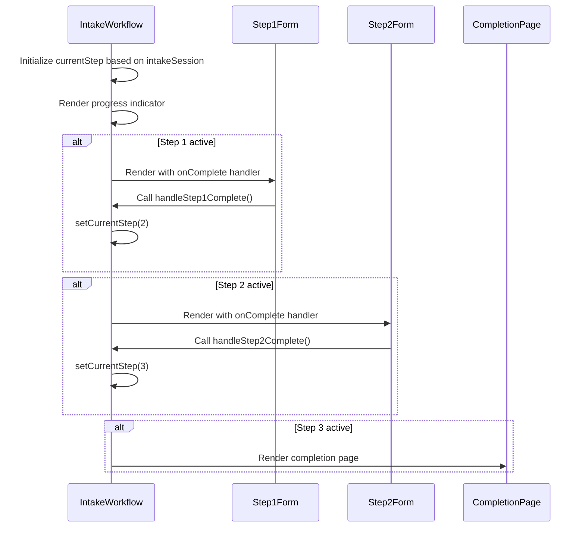
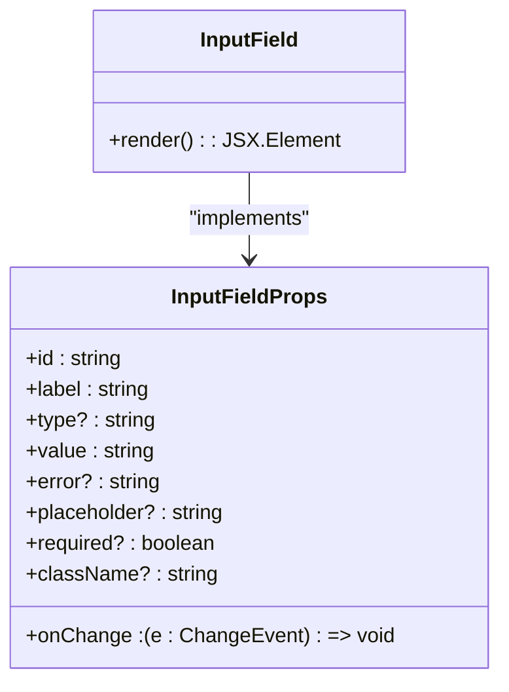
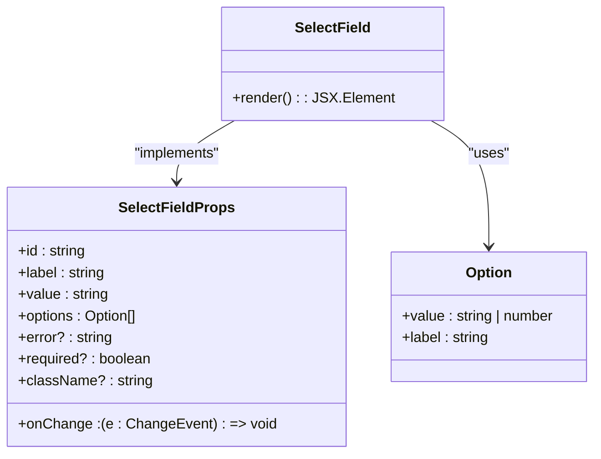
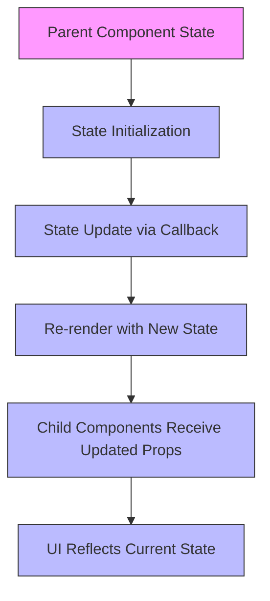
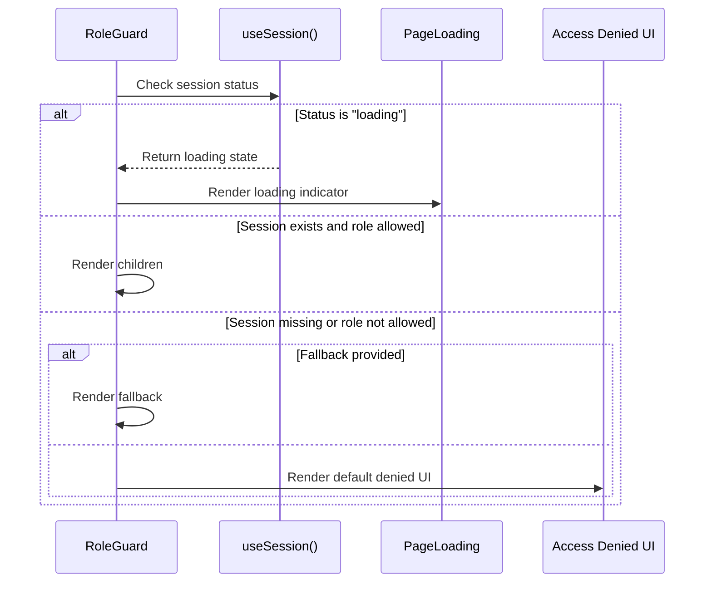

# Component Hierarchy

<cite>
**Referenced Files in This Document**   
- [IntakeWorkflow.tsx](file://src/components/intake/IntakeWorkflow.tsx)
- [InputField.tsx](file://src/components/intake/InputField.tsx)
- [SelectField.tsx](file://src/components/intake/SelectField.tsx)
- [RoleGuard.tsx](file://src/components/auth/RoleGuard.tsx)
- [ErrorBoundary.tsx](file://src/components/ErrorBoundary.tsx)
- [SettingsCard.tsx](file://src/components/admin/SettingsCard.tsx)
- [Step1Form.tsx](file://src/components/intake/Step1Form.tsx)
- [Step2Form.tsx](file://src/components/intake/Step2Form.tsx)
- [CompletionPage.tsx](file://src/components/intake/CompletionPage.tsx)
- [page.tsx](file://src/app/admin/settings/page.tsx)
</cite>

## Table of Contents
1. [Introduction](#introduction)
2. [Project Structure](#project-structure)
3. [Component Organization by Feature Domain](#component-organization-by-feature-domain)
4. [Key Composite Components](#key-composite-components)
5. [Atomic Component Abstraction](#atomic-component-abstraction)
6. [Data Flow and State Management](#data-flow-and-state-management)
7. [Higher-Order Components for Cross-Cutting Concerns](#higher-order-components-for-cross-cutting-concerns)
8. [Component Composition and Type Safety](#component-composition-and-type-safety)
9. [Best Practices and Recommendations](#best-practices-and-recommendations)

## Introduction
This document provides a comprehensive analysis of the frontend component hierarchy in the fund-track application. It details how components are organized by feature domains, their reusability, and the architectural patterns used to maintain consistency and scalability. The documentation covers key composite components, atomic UI elements, data flow mechanisms, and higher-order components that handle cross-cutting concerns such as authentication and error handling.

## Project Structure
The fund-track application follows a feature-based organization structure, grouping components and pages by functional domains such as admin, dashboard, intake, and auth. This modular approach enhances maintainability and enables team members to work on isolated features with minimal conflicts.



**Diagram sources**
- [project_structure](file://README.md)

**Section sources**
- [project_structure](file://README.md)

## Component Organization by Feature Domain
The component hierarchy is organized around four primary feature domains: admin, dashboard, intake, and auth. Each domain contains specialized components that encapsulate domain-specific functionality while maintaining consistent UI/UX patterns across the application.

### Admin Domain
The admin domain includes components for system administration, user management, and configuration settings. Key components include:
- **SettingsCard**: Organizes system settings by category with update and reset functionality
- **SettingsAuditLog**: Tracks changes to system settings
- **ConnectivityCheck**: Monitors system connectivity status

### Dashboard Domain
The dashboard domain provides components for lead management and visualization:
- **LeadList**: Displays paginated lists of leads with filtering capabilities
- **LeadDetailView**: Shows comprehensive information about individual leads
- **StatusHistorySection**: Visualizes the status evolution of leads over time

### Intake Domain
The intake domain handles the multi-step application process:
- **IntakeWorkflow**: Orchestrates the step-by-step intake process
- **Step1Form**: Collects personal information
- **Step2Form**: Manages document uploads
- **CompletionPage**: Displays success confirmation after intake completion

### Auth Domain
The auth domain manages authentication and authorization:
- **RoleGuard**: Enforces role-based access control
- **SessionProvider**: Manages authentication state

**Section sources**
- [SettingsCard.tsx](file://src/components/admin/SettingsCard.tsx#L1-L80)
- [LeadList.tsx](file://src/components/dashboard/LeadList.tsx#L1-L50)
- [IntakeWorkflow.tsx](file://src/components/intake/IntakeWorkflow.tsx#L1-L15)
- [RoleGuard.tsx](file://src/components/auth/RoleGuard.tsx#L1-L10)

## Key Composite Components
Composite components in the fund-track application combine multiple atomic elements to create complex, reusable UI patterns with well-defined responsibilities.

### SettingsCard
The SettingsCard component organizes system settings by category, providing a consistent interface for viewing and modifying configuration values. It handles loading states, validation errors, and asynchronous updates while maintaining a clean separation of concerns.

```mermaid
classDiagram
class SettingsCard {
+category : SystemSettingCategory
+settings : SystemSetting[]
+onUpdate(key : string, value : string) : Promise~void~
+onReset(key : string) : Promise~void~
-updatingSettings : Set~string~
-errors : Record~string, string~
+handleUpdate(key : string, value : string) : void
+handleReset(key : string) : void
}
class SettingInput {
+setting : SystemSetting
+onUpdate(value : string) : void
+isUpdating : boolean
+error? : string
}
SettingsCard --> SettingInput : "contains"
SettingsCard --> "Set" : "tracks updating settings"
SettingsCard --> "Record" : "manages errors"
```

**Diagram sources**
- [SettingsCard.tsx](file://src/components/admin/SettingsCard.tsx#L1-L111)

**Section sources**
- [SettingsCard.tsx](file://src/components/admin/SettingsCard.tsx#L1-L111)

### LeadList
The LeadList component displays leads in both desktop (table) and mobile (card) layouts, supporting pagination, filtering, and responsive design. It manages loading states and empty states while providing a consistent interface for lead interaction.

### IntakeWorkflow
The IntakeWorkflow component orchestrates a multi-step form process, managing state transitions between steps and providing visual progress indicators. It coordinates with child components to collect and validate user input across multiple stages.



**Diagram sources**
- [IntakeWorkflow.tsx](file://src/components/intake/IntakeWorkflow.tsx#L1-L95)

**Section sources**
- [IntakeWorkflow.tsx](file://src/components/intake/IntakeWorkflow.tsx#L1-L95)

## Atomic Component Abstraction
Atomic components provide consistent UI/UX patterns across the application, ensuring visual harmony and reducing development effort through reuse.

### InputField
The InputField component abstracts text input elements with standardized styling, validation, and accessibility features. It accepts common HTML input attributes and provides error state visualization.



**Diagram sources**
- [InputField.tsx](file://src/components/intake/InputField.tsx#L1-L54)

**Section sources**
- [InputField.tsx](file://src/components/intake/InputField.tsx#L1-L54)

### SelectField
The SelectField component provides a consistent interface for dropdown selections with proper labeling, error handling, and accessibility. It accepts an array of options and manages selection state through controlled component patterns.



**Diagram sources**
- [SelectField.tsx](file://src/components/intake/SelectField.tsx#L1-L55)

**Section sources**
- [SelectField.tsx](file://src/components/intake/SelectField.tsx#L1-L55)

## Data Flow and State Management
The fund-track application employs React's state management patterns to handle data flow between components, using props for configuration and state hooks for dynamic behavior.

### Parent-Child Relationships
Components communicate through prop drilling, with parent components managing state and passing down handlers to child components. The IntakeWorkflow demonstrates this pattern by maintaining the current step state and passing completion handlers to form components.

### State Management Patterns
The application uses useState for local component state and leverages React's re-rendering mechanism to update the UI in response to state changes. Complex state transitions are handled through callback functions that encapsulate state update logic.



**Diagram sources**
- [IntakeWorkflow.tsx](file://src/components/intake/IntakeWorkflow.tsx#L1-L95)

**Section sources**
- [IntakeWorkflow.tsx](file://src/components/intake/IntakeWorkflow.tsx#L1-L95)

## Higher-Order Components for Cross-Cutting Concerns
The application implements higher-order components to handle cross-cutting concerns such as authentication and error handling, promoting code reuse and separation of concerns.

### RoleGuard
The RoleGuard component enforces role-based access control by checking the user's session and role against allowed roles. It provides fallback rendering options and handles loading states during authentication checks.



**Diagram sources**
- [RoleGuard.tsx](file://src/components/auth/RoleGuard.tsx#L1-L75)

**Section sources**
- [RoleGuard.tsx](file://src/components/auth/RoleGuard.tsx#L1-L75)

### ErrorBoundary
The ErrorBoundary component catches JavaScript errors in child components and renders a fallback UI instead of crashing the application. It logs errors with contextual information and provides recovery options to users.

```mermaid
classDiagram
class ErrorBoundary {
+state : { hasError, error?, errorId? }
+getDerivedStateFromError() : State
+componentDidCatch() : void
+render() : ReactNode
}
class Props {
+children : ReactNode
+fallback? : ReactNode
+onError? : (error, errorInfo) => void
}
class State {
+hasError : boolean
+error? : Error
+errorId? : string
}
ErrorBoundary --> Props : "accepts"
ErrorBoundary --> State : "maintains"
```

**Diagram sources**
- [ErrorBoundary.tsx](file://src/components/ErrorBoundary.tsx#L1-L280)

**Section sources**
- [ErrorBoundary.tsx](file://src/components/ErrorBoundary.tsx#L1-L280)

## Component Composition and Type Safety
The application leverages TypeScript to ensure type safety across the component hierarchy, providing compile-time validation of props and interfaces.

### Prop Interfaces
Components define explicit interfaces for their props, documenting required and optional properties with appropriate types. This enables better IDE support, reduces runtime errors, and serves as living documentation.

### Type Safety Benefits
- Compile-time validation of component usage
- Autocompletion and IntelliSense in development
- Clear documentation of component contracts
- Prevention of common prop-related bugs

**Section sources**
- [InputField.tsx](file://src/components/intake/InputField.tsx#L5-L15)
- [SelectField.tsx](file://src/components/intake/SelectField.tsx#L5-L15)
- [IntakeWorkflow.tsx](file://src/components/intake/IntakeWorkflow.tsx#L5-L10)

## Best Practices and Recommendations
The fund-track application demonstrates several best practices in component design and architecture that contribute to its maintainability and scalability.

### Component Design Principles
- **Single Responsibility**: Each component has a well-defined purpose
- **Reusability**: Atomic components can be used across multiple features
- **Consistency**: Standardized styling and behavior across the application
- **Accessibility**: Proper labeling and semantic HTML elements

### Testing Guidance
- Unit test atomic components with various prop combinations
- Test state transitions in composite components
- Verify error boundary behavior with simulated errors
- Test role guard with different authentication states

### Documentation Practices
- Use JSDoc comments for component interfaces
- Document prop types and their meanings
- Include usage examples in component files
- Maintain README files for component directories

**Section sources**
- [InputField.tsx](file://src/components/intake/InputField.tsx)
- [ErrorBoundary.tsx](file://src/components/ErrorBoundary.tsx)
- [RoleGuard.tsx](file://src/components/auth/RoleGuard.tsx)