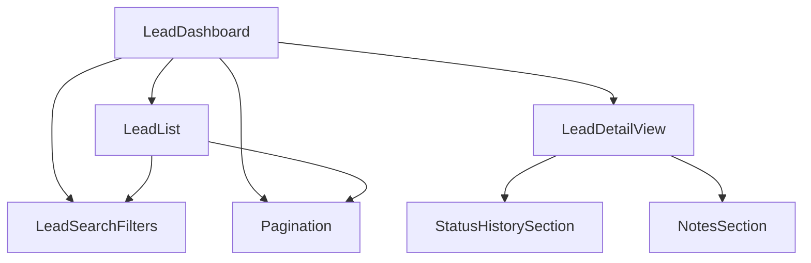
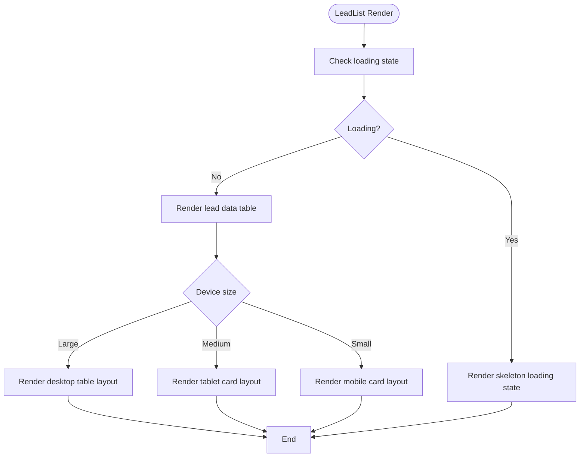
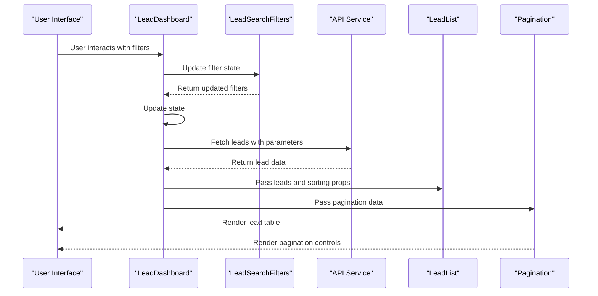
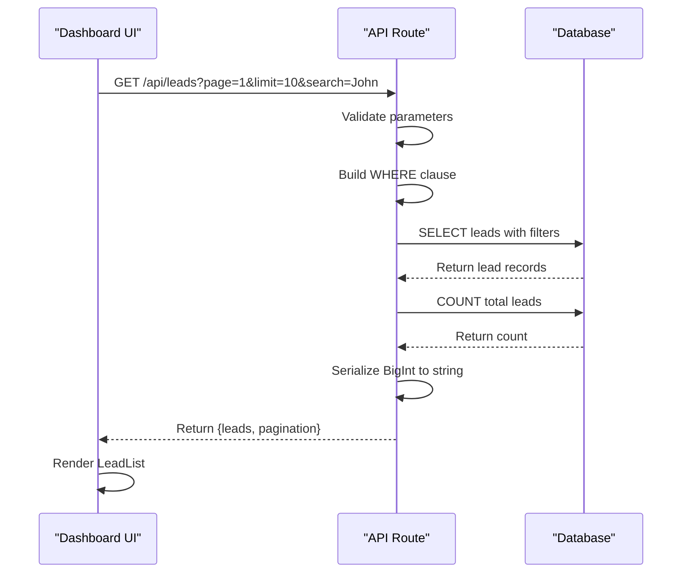

# Dashboard Components

<cite>
**Referenced Files in This Document**   
- [LeadList.tsx](file://src/components/dashboard/LeadList.tsx)
- [LeadDetailView.tsx](file://src/components/dashboard/LeadDetailView.tsx)
- [LeadDashboard.tsx](file://src/components/dashboard/LeadDashboard.tsx)
- [StatusHistorySection.tsx](file://src/components/dashboard/StatusHistorySection.tsx)
- [NotesSection.tsx](file://src/components/dashboard/NotesSection.tsx)
- [LeadSearchFilters.tsx](file://src/components/dashboard/LeadSearchFilters.tsx)
- [Pagination.tsx](file://src/components/dashboard/Pagination.tsx)
- [types.ts](file://src/components/dashboard/types.ts)
- [route.ts](file://src/app/api/leads/route.ts)
- [route.ts](file://src/app/api/leads/[id]/route.ts)
</cite>

## Table of Contents
1. [Introduction](#introduction)
2. [Core Components Overview](#core-components-overview)
3. [LeadList Component](#leadlist-component)
4. [LeadDetailView Component](#lead-detail-view-component)
5. [LeadDashboard Component](#leaddashboard-component)
6. [StatusHistorySection Component](#status-history-section-component)
7. [NotesSection Component](#notesection-component)
8. [LeadSearchFilters Component](#leadsearchfilters-component)
9. [Pagination Component](#pagination-component)
10. [Shared Types and Data Structures](#shared-types-and-data-structures)
11. [Data Fetching and API Integration](#data-fetching-and-api-integration)
12. [Error Handling and Loading States](#error-handling-and-loading-states)

## Introduction
The dashboard component suite in the fund-track application provides a comprehensive interface for managing leads throughout their lifecycle. This documentation details the architecture, functionality, and integration of key components that enable users to browse, filter, view, and manage lead data efficiently. The system is built with React and Next.js, leveraging TypeScript for type safety and Prisma for database interactions.

## Core Components Overview
The dashboard components form a cohesive system for lead management, with each component serving a specific purpose in the user interface. The components work together to provide a seamless experience for viewing lead lists, drilling into individual lead details, filtering data, and navigating through large datasets.



**Diagram sources**
- [LeadDashboard.tsx](file://src/components/dashboard/LeadDashboard.tsx)
- [LeadList.tsx](file://src/components/dashboard/LeadList.tsx)
- [LeadDetailView.tsx](file://src/components/dashboard/LeadDetailView.tsx)

## LeadList Component
The LeadList component serves as the primary interface for browsing and filtering leads. It displays leads in a responsive table format that adapts to different screen sizes, showing key information including lead name, contact details, business information, status, and activity metrics.

The component supports sorting through clickable column headers that toggle between ascending and descending order. Visual indicators show the current sort direction, with inactive columns displaying a subtle arrow on hover.



**Diagram sources**
- [LeadList.tsx](file://src/components/dashboard/LeadList.tsx#L29-L461)

### Responsive Design Implementation
The LeadList component implements a responsive design with three distinct layouts:
- **Desktop (lg+)**: Full table view with all columns
- **Tablet (sm-lg)**: Compact card layout with grouped information
- **Mobile (sm-)**: Simplified card layout optimized for small screens

Each layout prioritizes the most important information while maintaining consistent interaction patterns. Status values are displayed with color-coded badges using predefined color mappings for each lead status (New, Pending, In Progress, Completed, Rejected).

**Section sources**
- [LeadList.tsx](file://src/components/dashboard/LeadList.tsx#L29-L461)

## Lead Detail View Component
The LeadDetailView component provides a comprehensive view of individual lead data, status history, and associated documents. It serves as the detailed inspection interface when a user selects a specific lead from the list.

While the specific implementation details of LeadDetailView are not available in the provided context, based on the component structure and naming conventions, it likely includes:
- Personal and business information sections
- Contact details with primary and secondary phone numbers
- Financial information including amount needed and monthly revenue
- Status history timeline
- Notes and communication log
- Document attachments section
- Action buttons for status updates and follow-ups

The component would integrate with the StatusHistorySection and NotesSection components to display chronological records with proper formatting and user attribution.

## LeadDashboard Component
The LeadDashboard component acts as the parent container that orchestrates multiple subcomponents to create a cohesive lead management interface. It manages the overall state including pagination, filtering, sorting, and loading/error states.



**Diagram sources**
- [LeadDashboard.tsx](file://src/components/dashboard/LeadDashboard.tsx#L29-L51)
- [route.ts](file://src/app/api/leads/route.ts)

The component would handle the coordination between search filters, the lead list, and pagination controls, ensuring that changes in one component are properly reflected in the others. It likely manages the data fetching lifecycle, including loading states and error handling.

**Section sources**
- [LeadDashboard.tsx](file://src/components/dashboard/LeadDashboard.tsx)

## Status History Section Component
The StatusHistorySection component is responsible for displaying the chronological record of status changes for a lead. While the specific implementation is not available, based on standard patterns and the component name, it would:

- Display a timeline of status changes with timestamps
- Show the previous and new status values
- Include user attribution (who made the change)
- Provide contextual information about the status change
- Use visual indicators to distinguish between different status types

The component would likely receive status history data as a prop and render it in a structured format, possibly using a list or timeline visualization.

## NotesSection Component
The NotesSection component displays user-generated notes associated with a lead. Based on standard implementation patterns, it would:
- Show a chronological list of notes with timestamps
- Display the author of each note
- Allow users to add new notes
- Support basic text formatting
- Possibly include attachment indicators
- Implement edit and delete functionality for authorized users

The component would maintain its own state for the note input and coordinate with backend services to persist new notes.

## LeadSearchFilters Component
The LeadSearchFilters component enables dynamic querying of leads through a form interface that manages filter state. While the specific implementation is not available, it would provide controls for filtering leads by:
- Text search across multiple fields (name, email, business name, etc.)
- Status selection
- Date range filtering
- Other relevant criteria

The component would manage form state and emit filter changes to parent components, which would then trigger data refetching with the updated parameters.

## Pagination Component
The Pagination component supports navigation through large datasets by implementing standard pagination controls. It would display:
- Current page indicator
- Total page count
- Previous and next page buttons
- Page number links
- Results per page selector

The component would handle user interactions and communicate page changes to the parent dashboard component, which would then fetch the appropriate data page.

## Shared Types and Data Structures
The types.ts file provides shared type definitions that ensure type safety across dashboard components. Key types include:

```mermaid
classDiagram
class Lead {
+id : number
+firstName : string
+lastName : string
+email : string
+phone : string
+mobile : string
+businessName : string
+dba : string
+legalName : string
+industry : string
+yearsInBusiness : number
+amountNeeded : string
+monthlyRevenue : string
+businessAddress : string
+businessCity : string
+businessState : string
+businessZip : string
+personalAddress : string
+personalCity : string
+personalState : string
+personalZip : string
+status : LeadStatus
+campaignId : number
+legacyLeadId : string | null
+createdAt : Date
+updatedAt : Date
+importedAt : Date
+intakeCompletedAt : Date
+step1CompletedAt : Date
+step2CompletedAt : Date
+_count : {
notes : number
documents : number
}
}
class LeadStatus {
+NEW
+PENDING
+IN_PROGRESS
+COMPLETED
+REJECTED
}
class PaginationState {
+page : number
+limit : number
+totalCount : number
+totalPages : number
+hasNext : boolean
+hasPrev : boolean
}
class FilterState {
+search : string
+status : LeadStatus | null
+dateFrom : string | null
+dateTo : string | null
}
```

**Diagram sources**
- [types.ts](file://src/components/dashboard/types.ts)

These types ensure consistency across components and provide IntelliSense support during development. The Lead type includes both personal and business information, financial data, status tracking, and metadata for auditing purposes.

**Section sources**
- [types.ts](file://src/components/dashboard/types.ts)

## Data Fetching and API Integration
The dashboard components integrate with backend APIs to fetch and display lead data. The primary endpoint for retrieving leads is `/api/leads`, which supports various query parameters for filtering and pagination.



**Diagram sources**
- [route.ts](file://src/app/api/leads/route.ts#L0-L166)
- [LeadList.tsx](file://src/components/dashboard/LeadList.tsx)

The API endpoint implements several key features:
- **Authentication**: Requires valid user session
- **Pagination**: Supports page and limit parameters with validation
- **Filtering**: Comprehensive search across multiple fields
- **Sorting**: Configurable sort field and order
- **Error handling**: Validates input parameters and handles database errors
- **Logging**: Records API request metrics

Query parameters include:
- `page`: Current page number (default: 1)
- `limit`: Results per page (default: 10, max: 100)
- `search`: Text search across multiple fields
- `status`: Filter by lead status
- `dateFrom` and `dateTo`: Date range filtering
- `sortBy` and `sortOrder`: Sorting controls

The API converts BigInt values to strings for JSON serialization, ensuring compatibility with JavaScript clients.

**Section sources**
- [route.ts](file://src/app/api/leads/route.ts#L0-L166)

## Error Handling and Loading States
The dashboard components implement robust error handling and loading state management to provide a smooth user experience.

The LeadList component displays a skeleton loading state when data is being fetched, showing placeholder elements that mimic the final layout. This provides immediate visual feedback to users and reduces perceived loading time.

Error boundaries are likely implemented at the component level to catch and handle runtime errors gracefully. The system would display user-friendly error messages while logging detailed information for debugging purposes.

Loading states are managed through component state, with the LeadDashboard likely coordinating the loading state across multiple subcomponents. This ensures that the entire dashboard interface reflects the current data fetching status consistently.