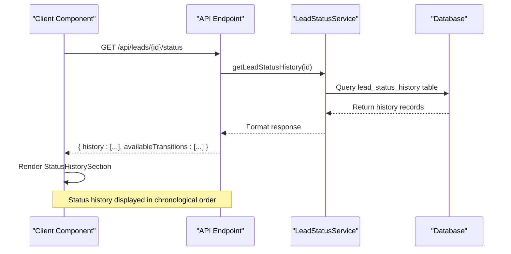
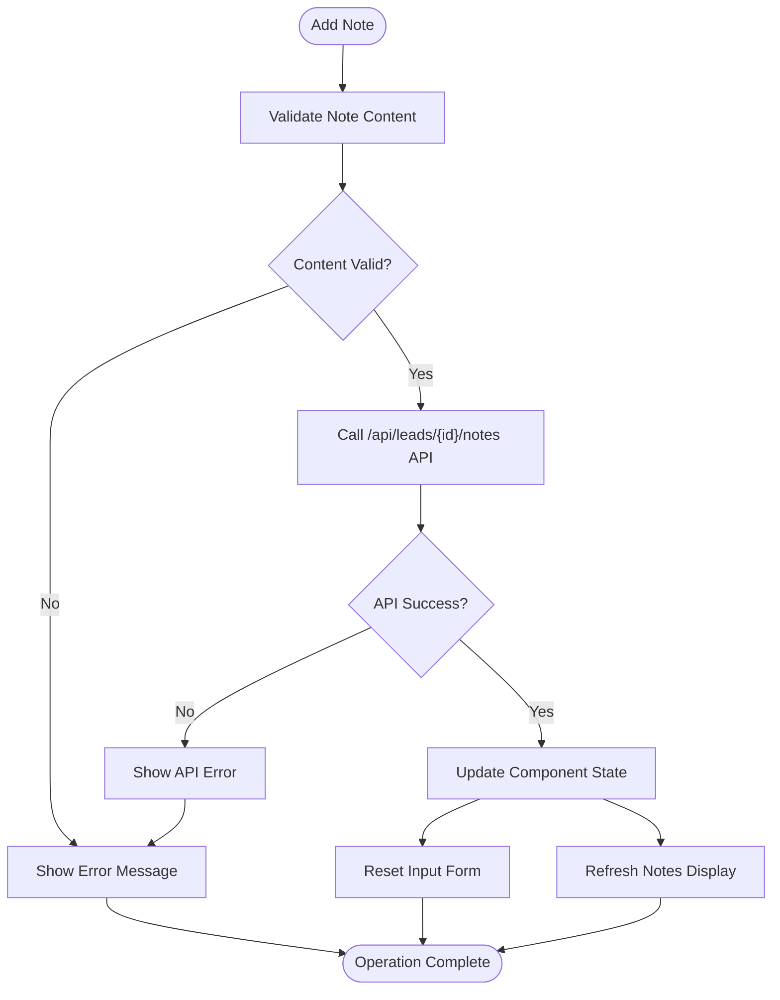

# Dashboard Type Definitions

<cite>
**Referenced Files in This Document**   
- [types.ts](file://src/components/dashboard/types.ts#L1-L66)
- [LeadList.tsx](file://src/components/dashboard/LeadList.tsx#L1-L461)
- [LeadDetailView.tsx](file://src/components/dashboard/LeadDetailView.tsx#L1-L1421)
- [StatusHistorySection.tsx](file://src/components/dashboard/StatusHistorySection.tsx#L1-L375)
- [NotesSection.tsx](file://src/components/dashboard/NotesSection.tsx#L1-L191)
</cite>

## Table of Contents
1. [Introduction](#introduction)
2. [Core Type Definitions](#core-type-definitions)
3. [Lead Interface](#lead-interface)
4. [LeadStatusHistory Interface](#leadstatushistory-interface)
5. [Note Interface](#note-interface)
6. [PaginationState and FilterCriteria](#paginationstate-and-filtercriteria)
7. [Component Usage Examples](#component-usage-examples)
8. [Design Decisions and Type Safety](#design-decisions-and-type-safety)
9. [API Compatibility and Data Flow](#api-compatibility-and-data-flow)
10. [Extensibility and Backward Compatibility](#extensibility-and-backward-compatibility)

## Introduction
This document provides comprehensive documentation for the shared TypeScript interfaces and types defined in the `types.ts` file within the dashboard components of the fund-track application. These type definitions serve as the foundation for type safety across the dashboard component suite, enabling robust type checking, preventing runtime errors, and enhancing developer experience through IntelliSense support. The documented types are used extensively across components such as LeadList, LeadDetailView, and SearchFilters, ensuring consistent data structures throughout the application.

**Section sources**
- [types.ts](file://src/components/dashboard/types.ts#L1-L66)

## Core Type Definitions
The `types.ts` file in the dashboard components directory defines several key interfaces that standardize data structures across the application. These types provide a contract for data shape, ensuring consistency between API responses, component props, and state management. The primary interfaces include `Lead`, `LeadFilters`, `PaginationInfo`, and supporting types used in related components. These definitions leverage TypeScript's union types, optional properties, and enum integration to create flexible yet type-safe structures.

```mermaid
classDiagram
class Lead {
+id : number
+legacyLeadId : string | null
+campaignId : number
+email : string | null
+phone : string | null
+firstName : string | null
+lastName : string | null
+businessName : string | null
+status : LeadStatus
+createdAt : Date
+updatedAt : Date
+_count : { notes : number, documents : number }
}
class LeadFilters {
+search : string
+status : string
+dateFrom : string
+dateTo : string
}
class PaginationInfo {
+page : number
+limit : number
+totalCount : number
+totalPages : number
+hasNext : boolean
+hasPrev : boolean
}
class StatusHistoryItem {
+id : number
+previousStatus : LeadStatus | null
+newStatus : LeadStatus
+changedBy : number
+reason : string | null
+createdAt : string
+user : { id : number, email : string }
}
class LeadNote {
+id : number
+content : string
+createdAt : string
+user : { id : number, email : string }
}
Lead --> LeadFilters : "filtered by"
Lead --> PaginationInfo : "paginated results"
Lead --> StatusHistoryItem : "has history"
Lead --> LeadNote : "has notes"
```

**Diagram sources**
- [types.ts](file://src/components/dashboard/types.ts#L1-L66)
- [StatusHistorySection.tsx](file://src/components/dashboard/StatusHistorySection.tsx#L1-L375)
- [NotesSection.tsx](file://src/components/dashboard/NotesSection.tsx#L1-L191)

**Section sources**
- [types.ts](file://src/components/dashboard/types.ts#L1-L66)

## Lead Interface
The `Lead` interface defines the complete structure of a lead entity as used across dashboard components. It includes comprehensive business and personal information fields, status tracking, and metadata. The interface is designed to match the API response schema from the backend, ensuring seamless data flow between server and client.

### Properties and Data Types
The `Lead` interface contains the following properties:

**Basic Information**
- `id: number` - Unique identifier for the lead
- `legacyLeadId: string | null` - Reference to legacy system ID
- `campaignId: number` - Associated marketing campaign
- `email: string | null` - Primary contact email
- `phone: string | null` - Primary contact phone
- `firstName: string | null` - Contact first name
- `lastName: string | null` - Contact last name

**Business Details**
- `businessName: string | null` - Legal business name
- `dba: string | null` - "Doing Business As" name
- `businessAddress: string | null` - Business physical address
- `businessPhone: string | null` - Business contact phone
- `businessEmail: string | null` - Business contact email
- `mobile: string | null` - Mobile contact number
- `businessCity: string | null` - Business city
- `businessState: string | null` - Business state
- `businessZip: string | null` - Business ZIP code
- `ownershipPercentage: string | null` - Owner's equity percentage
- `taxId: string | null` - Employer Identification Number
- `stateOfInc: string | null` - State of incorporation
- `dateBusinessStarted: string | null` - Business inception date
- `legalEntity: string | null` - Legal business structure
- `natureOfBusiness: string | null` - Business description
- `hasExistingLoans: string | null` - Existing debt status

**Personal Information**
- `personalAddress: string | null` - Personal residential address
- `personalCity: string | null` - Personal city
- `personalState: string | null` - Personal state
- `personalZip: string | null` - Personal ZIP code
- `dateOfBirth: string | null` - Contact date of birth
- `socialSecurity: string | null` - Last four digits of SSN
- `legalName: string | null` - Full legal name

**Application and Financial Data**
- `industry: string | null` - Business industry classification
- `yearsInBusiness: number | null` - Years of business operation
- `amountNeeded: number | null` - Funding amount requested
- `monthlyRevenue: number | null` - Monthly business revenue

**Status and Metadata**
- `status: LeadStatus` - Current lead status (enum)
- `intakeToken: string | null` - Secure token for intake process
- `intakeCompletedAt: Date | null` - Intake completion timestamp
- `step1CompletedAt: Date | null` - Step 1 completion timestamp
- `step2CompletedAt: Date | null` - Step 2 completion timestamp
- `createdAt: Date` - Record creation timestamp
- `updatedAt: Date` - Last update timestamp
- `importedAt: Date` - Data import timestamp
- `_count: { notes: number, documents: number }` - Related records count

**Section sources**
- [types.ts](file://src/components/dashboard/types.ts#L1-L66)
- [LeadList.tsx](file://src/components/dashboard/LeadList.tsx#L1-L461)
- [LeadDetailView.tsx](file://src/components/dashboard/LeadDetailView.tsx#L1-L1421)

## LeadStatusHistory Interface
The `LeadStatusHistory` interface (implemented as `StatusHistoryItem` in the codebase) represents the audit trail of status changes for a lead. This interface is used in the `StatusHistorySection` component to display the chronological history of status transitions.

### Implementation Details
The interface is defined in `StatusHistorySection.tsx` with the following properties:

- `id: number` - Unique identifier for the status change record
- `previousStatus: LeadStatus | null` - Previous status (null for initial creation)
- `newStatus: LeadStatus` - New status after transition
- `changedBy: number` - User ID of the person who made the change
- `reason: string | null` - Optional explanation for the status change
- `createdAt: string` - Timestamp of the status change
- `user: { id: number, email: string }` - User information associated with the change

The interface uses `string` for `createdAt` rather than `Date` because the data is received as a JSON string from the API and used directly in the component without conversion. This design choice simplifies rendering and avoids unnecessary type conversion.



**Diagram sources**
- [StatusHistorySection.tsx](file://src/components/dashboard/StatusHistorySection.tsx#L1-L375)
- [api/leads/[id]/status/route.ts](file://src/app/api/leads/[id]/status/route.ts#L1-L43)

**Section sources**
- [StatusHistorySection.tsx](file://src/components/dashboard/StatusHistorySection.tsx#L1-L375)

## Note Interface
The `Note` interface (implemented as `LeadNote` in the codebase) defines the structure for internal notes associated with a lead. This interface is used in the `NotesSection` component to manage and display communication history.

### Structure and Usage
The interface is defined in `NotesSection.tsx` with the following properties:

- `id: number` - Unique identifier for the note
- `content: string` - Text content of the note
- `createdAt: string` - Creation timestamp
- `user: { id: number, email: string }` - Author information

The interface supports rich text content with line breaks and basic formatting, as indicated by the `whitespace-pre-wrap` CSS class used in rendering. Notes are displayed in reverse chronological order, with the most recent note appearing first.



**Diagram sources**
- [NotesSection.tsx](file://src/components/dashboard/NotesSection.tsx#L1-L191)

**Section sources**
- [NotesSection.tsx](file://src/components/dashboard/NotesSection.tsx#L1-L191)

## PaginationState and FilterCriteria
The pagination and filtering types provide standardized structures for managing data retrieval and display across list components.

### PaginationInfo Interface
The `PaginationInfo` interface defines the metadata for paginated results:

- `page: number` - Current page number (1-based)
- `limit: number` - Number of items per page
- `totalCount: number` - Total number of items across all pages
- `totalPages: number` - Total number of pages available
- `hasNext: boolean` - Whether a next page exists
- `hasPrev: boolean` - Whether a previous page exists

This interface enables consistent pagination controls across components and supports both page-based and infinite scrolling implementations.

### LeadFilters Interface
The `LeadFilters` interface defines the structure for search and filtering criteria:

- `search: string` - Text search term for global search
- `status: string` - Filter by lead status
- `dateFrom: string` - Start date for date range filtering
- `dateTo: string` - End date for date range filtering

The interface uses `string` types for dates to accommodate various date input formats and simplify form handling, with conversion to Date objects handled at the API layer.

**Section sources**
- [types.ts](file://src/components/dashboard/types.ts#L1-L66)

## Component Usage Examples
The defined types are imported and used across various dashboard components to ensure type safety and consistency.

### LeadList Component Usage
The `LeadList` component imports and uses the `Lead` interface to define its props:

```typescript
import { Lead } from "./types";

interface LeadListProps {
  leads: Lead[];
  loading: boolean;
  sortBy: string;
  sortOrder: "asc" | "desc";
  onSort: (field: string) => void;
}
```

The component renders a responsive table that displays lead information, with different layouts for desktop, tablet, and mobile views. It uses the `Lead` interface to access properties like `firstName`, `lastName`, `businessName`, and `status`.

### LeadDetailView Component Usage
The `LeadDetailView` component uses a similar but more detailed structure based on the same data model. It imports the `Lead` type and extends it with additional properties for the detailed view, including comprehensive business and personal information.

### SearchFilters Component Usage
Although not explicitly shown in the provided code, the `LeadFilters` interface would be used in a search or filter component to standardize the filtering criteria across the application. This ensures that filter state is consistent and can be easily serialized for URL parameters or local storage.

**Section sources**
- [LeadList.tsx](file://src/components/dashboard/LeadList.tsx#L1-L461)
- [LeadDetailView.tsx](file://src/components/dashboard/LeadDetailView.tsx#L1-L1421)

## Design Decisions and Type Safety
The type definitions follow several key design principles to maximize type safety and developer experience.

### Optional vs Required Fields
The interfaces use TypeScript's union types with `null` to represent optional fields (e.g., `string | null` rather than making properties optional with `?`). This approach ensures that developers must explicitly handle null values, reducing the risk of runtime errors from undefined properties.

### Enum Integration
The `LeadStatus` enum from Prisma is imported and used directly in the `Lead` interface. This ensures that status values are type-safe and prevents invalid status assignments. The enum values are also used in UI components to provide consistent status labels and colors.

### Type Safety Benefits
These type definitions provide several benefits:

1. **Compile-time validation** - Errors are caught during development rather than at runtime
2. **IntelliSense support** - IDEs can provide accurate autocomplete and documentation
3. **Refactoring safety** - Renaming or modifying types updates all references automatically
4. **Documentation** - Types serve as living documentation of data structures
5. **API contract enforcement** - Ensures frontend and backend data structures remain synchronized

**Section sources**
- [types.ts](file://src/components/dashboard/types.ts#L1-L66)

## API Compatibility and Data Flow
The type definitions are designed to be compatible with the API response schemas, ensuring seamless data flow between the backend and frontend.

### Data Flow Architecture
The application follows a consistent data flow pattern:

1. API endpoints return data in the exact shape defined by the interfaces
2. Components receive this data and pass it directly to typed props
3. Type checking ensures data integrity throughout the component tree
4. User interactions trigger API calls that return updated data in the same format

### Migration Considerations
The project's migration history shows several schema changes that would affect these types:

- `20250728210021_initial_migration` - Initial schema creation
- `20250730060039_add_lead_status_history` - Added status history tracking
- `20250826082902_add_lead_business_fields` - Added business-related fields
- `20250826121117_add_comprehensive_lead_fields` - Expanded lead information
- `20250826125518_add_mobile_field` - Added mobile contact field
- `20250826203101_change_amount_and_revenue_to_string` - Changed financial fields to string

The type definitions have been updated to reflect these schema changes, maintaining compatibility with the database structure.

**Section sources**
- [types.ts](file://src/components/dashboard/types.ts#L1-L66)
- [prisma/migrations/20250730060039_add_lead_status_history/migration.sql#L1-L17)

## Extensibility and Backward Compatibility
The type definitions are designed to support future extensions while maintaining backward compatibility.

### Extension Guidelines
When adding new features, follow these guidelines:

1. **Add new optional fields** - Use `| null` for new properties to avoid breaking existing code
2. **Preserve existing interfaces** - Avoid modifying existing property types when possible
3. **Create new interfaces for major changes** - If significant changes are needed, create a new interface version
4. **Update documentation** - Document new fields and their usage

### Backward Compatibility
The current design supports backward compatibility through:

- **Nullable properties** - New fields can be added as nullable without affecting existing code
- **Consistent naming** - Following established naming conventions
- **Comprehensive coverage** - Including all possible fields, even if some are rarely used
- **Separation of concerns** - Keeping UI-specific types separate from data types

These practices ensure that new features can be added without breaking existing components, allowing for incremental improvements to the application.

**Section sources**
- [types.ts](file://src/components/dashboard/types.ts#L1-L66)