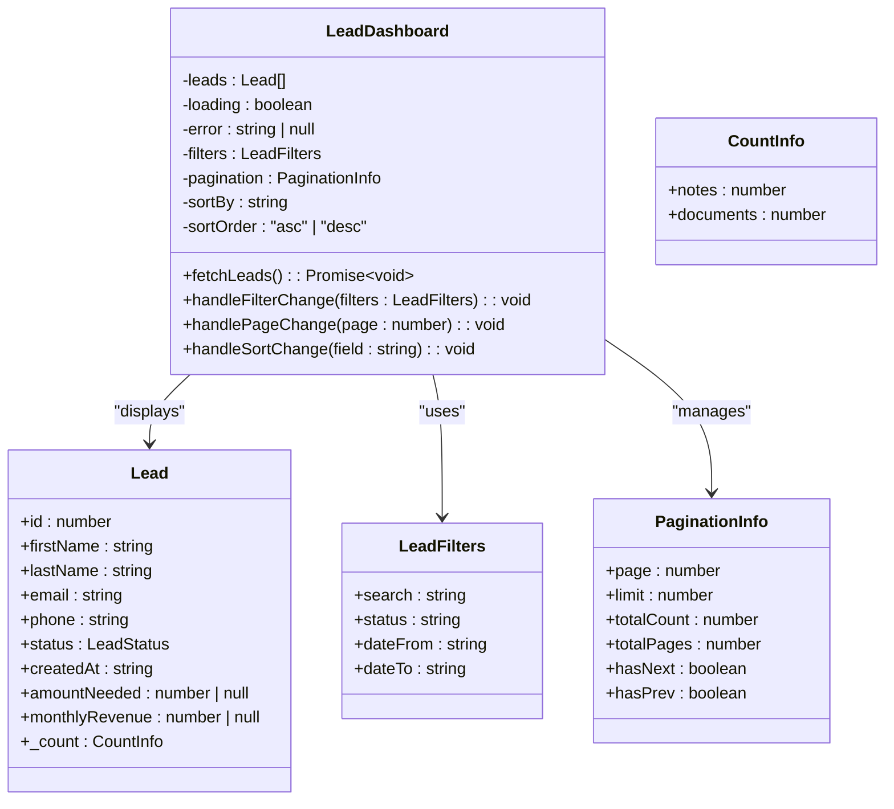
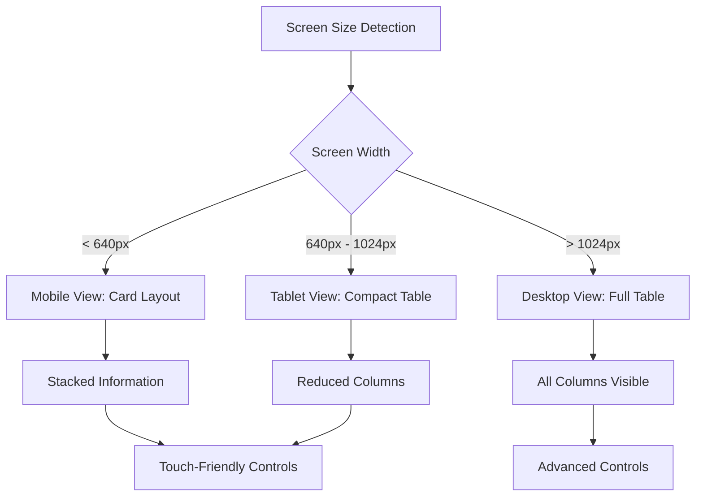
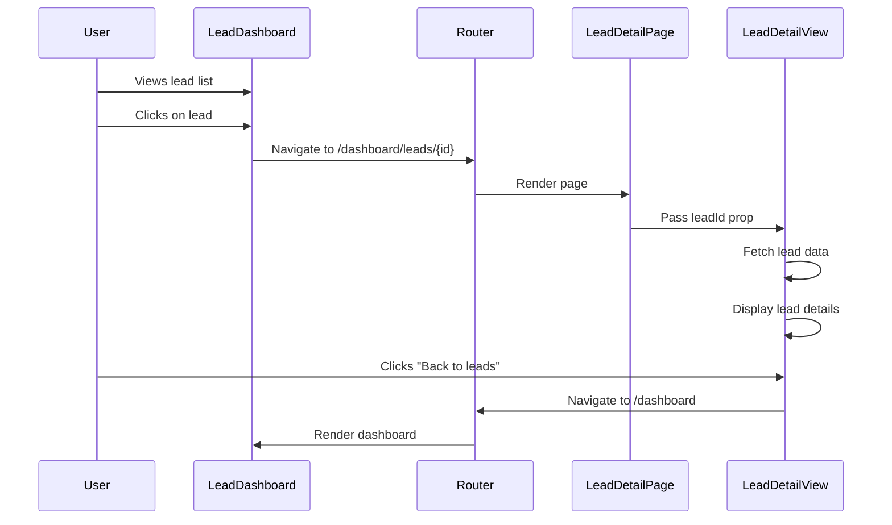
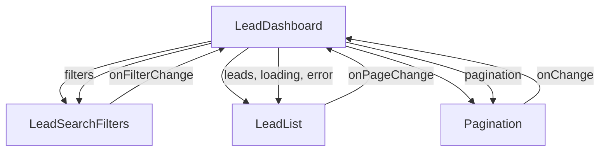
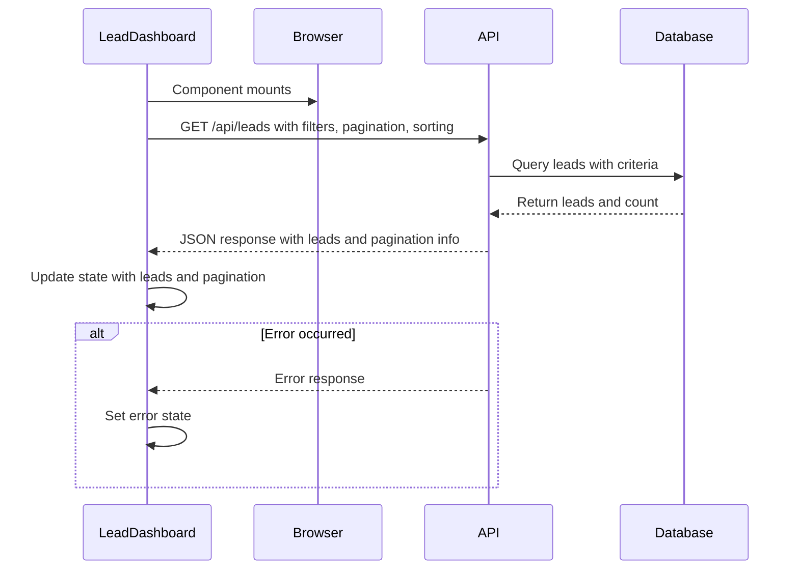
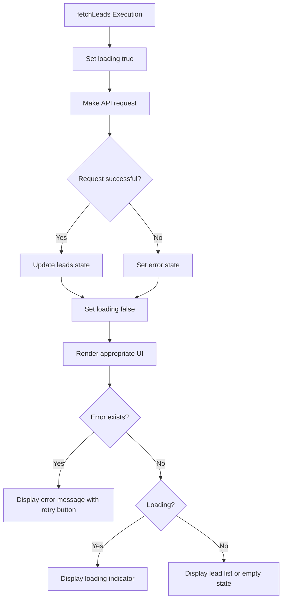

# Lead Dashboard Container

<cite>
**Referenced Files in This Document**   
- [LeadDashboard.tsx](file://src/components/dashboard/LeadDashboard.tsx)
- [page.tsx](file://src/app/dashboard/page.tsx)
- [LeadDetailView.tsx](file://src/components/dashboard/LeadDetailView.tsx)
- [LeadList.tsx](file://src/components/dashboard/LeadList.tsx)
- [types.ts](file://src/components/dashboard/types.ts)
- [route.ts](file://src/app/api/leads/route.ts)
- [page.tsx](file://src/app/dashboard/leads/[id]/page.tsx)
</cite>

## Table of Contents
1. [Introduction](#introduction)
2. [Component Overview](#component-overview)
3. [State Management](#state-management)
4. [Layout and Responsive Design](#layout-and-responsive-design)
5. [Navigation and Routing](#navigation-and-routing)
6. [Integration with Subcomponents](#integration-with-subcomponents)
7. [API Integration and Data Fetching](#api-integration-and-data-fetching)
8. [Error Handling and User Feedback](#error-handling-and-user-feedback)
9. [Performance Optimization](#performance-optimization)
10. [Code Architecture](#code-architecture)

## Introduction

The LeadDashboard component serves as the central container for the lead management interface in the application. It orchestrates the display of lead data, manages user interactions, and coordinates navigation between list and detail views. Built using React with Next.js App Router, this component implements client-side state management to provide a responsive and interactive user experience for managing leads.

**Section sources**
- [LeadDashboard.tsx](file://src/components/dashboard/LeadDashboard.tsx#L1-L20)

## Component Overview

The LeadDashboard is a client-side React component that functions as the primary interface for viewing and managing leads. It integrates multiple subcomponents including LeadList for displaying lead summaries, LeadSearchFilters for filtering functionality, and Pagination for navigating through large datasets. The component is rendered within the dashboard layout and serves as the entry point for lead management operations.

The dashboard supports both list and detail views, with navigation handled through the Next.js routing system. When users select a specific lead from the list, they are directed to the detail view via the `/dashboard/leads/[id]` route, which renders the LeadDetailView component.

```mermaid
graph TD
A[LeadDashboard] --> B[LeadSearchFilters]
A --> C[LeadList]
A --> D[Pagination]
C --> E[LeadDetailView]
A --> F[API Integration]
F --> G[/api/leads]
E --> H[/api/leads/{id}]
```

**Diagram sources**
- [LeadDashboard.tsx](file://src/components/dashboard/LeadDashboard.tsx#L1-L10)
- [page.tsx](file://src/app/dashboard/page.tsx#L128-L149)
- [LeadDetailView.tsx](file://src/components/dashboard/LeadDetailView.tsx#L374-L416)

**Section sources**
- [LeadDashboard.tsx](file://src/components/dashboard/LeadDashboard.tsx#L1-L31)
- [page.tsx](file://src/app/dashboard/page.tsx#L128-L149)

## State Management

The LeadDashboard component manages several state variables using React's useState and useCallback hooks to maintain a responsive interface:

- **leads**: Stores the current list of leads being displayed
- **loading**: Tracks loading state during data fetching operations
- **error**: Handles error states with user-friendly messages
- **filters**: Manages search and filtering criteria
- **pagination**: Controls pagination state including current page and limits
- **sorting**: Manages sort criteria for lead data

The component uses the useCallback hook to memoize the fetchLeads function, preventing unnecessary re-creations on each render and optimizing performance. This function encapsulates the logic for retrieving lead data from the API with current filters, pagination, and sorting parameters.



**Diagram sources**
- [LeadDashboard.tsx](file://src/components/dashboard/LeadDashboard.tsx#L4-L31)
- [types.ts](file://src/components/dashboard/types.ts#L1-L20)

**Section sources**
- [LeadDashboard.tsx](file://src/components/dashboard/LeadDashboard.tsx#L4-L31)

## Layout and Responsive Design

The LeadDashboard implements responsive design principles using Tailwind CSS to ensure optimal viewing across different device sizes. The layout adapts to screen width with different display strategies for mobile, tablet, and desktop views.

On mobile devices (small screens), the LeadList component renders leads as cards with essential information prioritized for touch interaction. Tablet devices (medium screens) display a simplified table view, while desktop screens (large screens) show a full-featured table with all available columns and actions.

The responsive behavior is implemented through Tailwind's breakpoint system (sm, md, lg) with conditional rendering in the LeadList component. This approach ensures that users have an optimal experience regardless of their device, with appropriate touch targets and information density.



**Diagram sources**
- [LeadList.tsx](file://src/components/dashboard/LeadList.tsx#L261-L460)
- [LeadDetailView.tsx](file://src/components/dashboard/LeadDetailView.tsx#L418-L448)

**Section sources**
- [LeadList.tsx](file://src/components/dashboard/LeadList.tsx#L372-L460)

## Navigation and Routing

The LeadDashboard integrates with the Next.js App Router for navigation between list and detail views. The component itself is rendered at the `/dashboard` route, while individual lead details are accessed through the dynamic `/dashboard/leads/[id]` route.

When a user clicks on a lead in the list, they are navigated to the detail view using standard anchor links that point to the specific lead's route. The detail view is implemented as a separate page component that renders the LeadDetailView with the specified lead ID.

From the detail view, users can navigate back to the dashboard using a "Back to leads" button that programmatically navigates to the `/dashboard` route using Next.js router.



**Diagram sources**
- [page.tsx](file://src/app/dashboard/leads/[id]/page.tsx#L1-L17)
- [LeadDetailView.tsx](file://src/components/dashboard/LeadDetailView.tsx#L374-L416)
- [page.tsx](file://src/app/dashboard/page.tsx#L128-L149)

**Section sources**
- [page.tsx](file://src/app/dashboard/leads/[id]/page.tsx#L1-L17)
- [LeadDetailView.tsx](file://src/components/dashboard/LeadDetailView.tsx#L374-L416)

## Integration with Subcomponents

The LeadDashboard orchestrates several subcomponents to create a cohesive user interface:

- **LeadSearchFilters**: Handles filtering functionality with inputs for search terms, status selection, and date ranges
- **LeadList**: Displays the list of leads in a table or card format depending on screen size
- **Pagination**: Manages pagination controls for navigating through multiple pages of leads

These components are composed within the LeadDashboard, which passes down necessary props and callback functions to enable interaction. The dashboard acts as the single source of truth for lead data, filtering criteria, and pagination state, ensuring consistency across all subcomponents.

The integration follows a unidirectional data flow pattern, where state changes in subcomponents (like filter changes) are communicated back to the dashboard through callback functions, which then updates the state and re-fetches data as needed.



**Diagram sources**
- [LeadDashboard.tsx](file://src/components/dashboard/LeadDashboard.tsx#L1-L31)
- [LeadSearchFilters.tsx](file://src/components/dashboard/LeadSearchFilters.tsx#L1-L10)
- [LeadList.tsx](file://src/components/dashboard/LeadList.tsx#L1-L10)
- [Pagination.tsx](file://src/components/dashboard/Pagination.tsx#L1-L10)

**Section sources**
- [LeadDashboard.tsx](file://src/components/dashboard/LeadDashboard.tsx#L1-L31)

## API Integration and Data Fetching

The LeadDashboard integrates with the backend API through the `/api/leads` endpoint to fetch lead data. The component implements client-side data fetching using the fetch API within the fetchLeads function.

The API request includes query parameters for filtering, pagination, and sorting, allowing the backend to return only the relevant data. The response includes both the lead data and pagination metadata, which the dashboard uses to update its state.

The implementation includes error handling to manage network failures or API errors, providing user feedback through the error state. Loading states are also managed to improve user experience during data retrieval.



**Diagram sources**
- [LeadDashboard.tsx](file://src/components/dashboard/LeadDashboard.tsx#L32-L142)
- [route.ts](file://src/app/api/leads/route.ts#L1-L20)

**Section sources**
- [LeadDashboard.tsx](file://src/components/dashboard/LeadDashboard.tsx#L32-L142)
- [route.ts](file://src/app/api/leads/route.ts#L115-L166)

## Error Handling and User Feedback

The LeadDashboard implements comprehensive error handling to ensure robustness and provide clear feedback to users. The component manages several error states:

- **Data loading errors**: When the API request fails to retrieve lead data
- **Network errors**: When there are connectivity issues
- **Empty state**: When no leads match the current filters

Error states are displayed with user-friendly messages and include a "Try again" button that allows users to retry the data fetch operation. The error UI follows the application's design system with appropriate icons and styling to clearly communicate the issue.

The component also handles loading states, displaying a loading indicator during data retrieval to provide feedback on ongoing operations.



**Diagram sources**
- [LeadDashboard.tsx](file://src/components/dashboard/LeadDashboard.tsx#L143-L164)
- [LeadDetailView.tsx](file://src/components/dashboard/LeadDetailView.tsx#L330-L372)

**Section sources**
- [LeadDashboard.tsx](file://src/components/dashboard/LeadDashboard.tsx#L143-L164)
- [LeadDetailView.tsx](file://src/components/dashboard/LeadDetailView.tsx#L330-L372)

## Performance Optimization

The LeadDashboard implements several performance optimization techniques:

- **Memoization**: The fetchLeads function is wrapped in useCallback to prevent unnecessary re-creations
- **Efficient re-renders**: State updates are batched and components are designed to minimize unnecessary re-renders
- **Pagination**: Data is paginated to limit the amount of data transferred and rendered
- **Conditional rendering**: UI elements are only rendered when needed based on state

The component also leverages Next.js features like code splitting and optimized asset loading to improve initial load performance. The use of virtualized rendering is not implemented but could be considered for very large datasets.

The API endpoint is optimized to only return necessary data, including count information for related entities (notes, documents) without loading the full entities, reducing payload size.

**Section sources**
- [LeadDashboard.tsx](file://src/components/dashboard/LeadDashboard.tsx#L32-L142)
- [route.ts](file://src/app/api/leads/route.ts#L115-L166)

## Code Architecture

The LeadDashboard follows a component-based architecture with clear separation of concerns. The component is structured with a top-down approach:

1. **State declaration**: All state variables are declared at the top of the component
2. **Callback functions**: Business logic functions are defined using useCallback
3. **Effect hooks**: Side effects like initial data loading are managed with useEffect
4. **Render logic**: The JSX structure is organized to clearly show the component hierarchy

The code follows React best practices with proper TypeScript typing for all props and state variables. The component is designed to be reusable and maintainable, with clear function separation and descriptive variable names.

The architecture supports easy extension, such as adding new filter types, sorting options, or integration with additional subcomponents for enhanced functionality.

```mermaid
classDiagram
class LeadDashboard {
+LeadDashboard()
-useState declarations
-useCallback functions
-useEffect hooks
-render method
}
LeadDashboard --> LeadSearchFilters : "composes"
LeadDashboard --> LeadList : "composes"
LeadDashboard --> Pagination : "composes"
LeadDashboard --> API : "integrates"
note right of LeadDashboard
Main container component that
orchestrates lead management UI
Follows React best practices with
proper state management and
component composition
end note
```

**Diagram sources**
- [LeadDashboard.tsx](file://src/components/dashboard/LeadDashboard.tsx#L1-L200)

**Section sources**
- [LeadDashboard.tsx](file://src/components/dashboard/LeadDashboard.tsx#L1-L200)