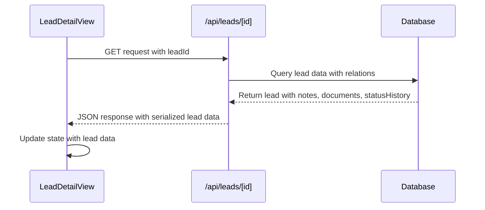
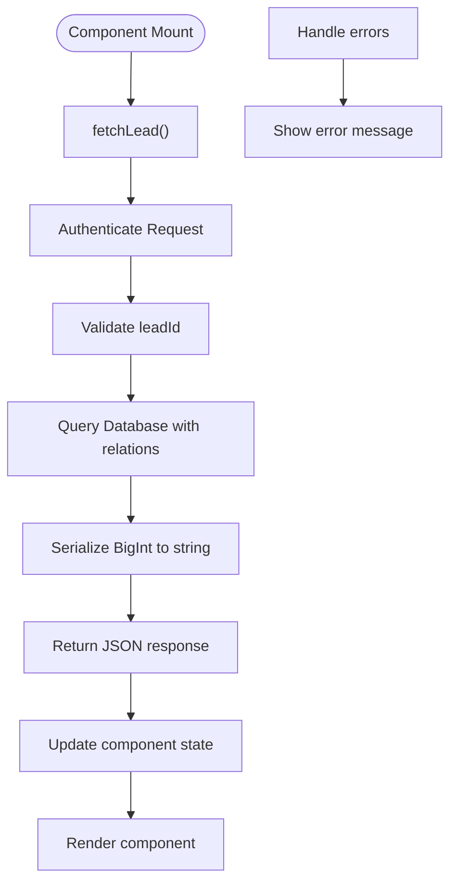
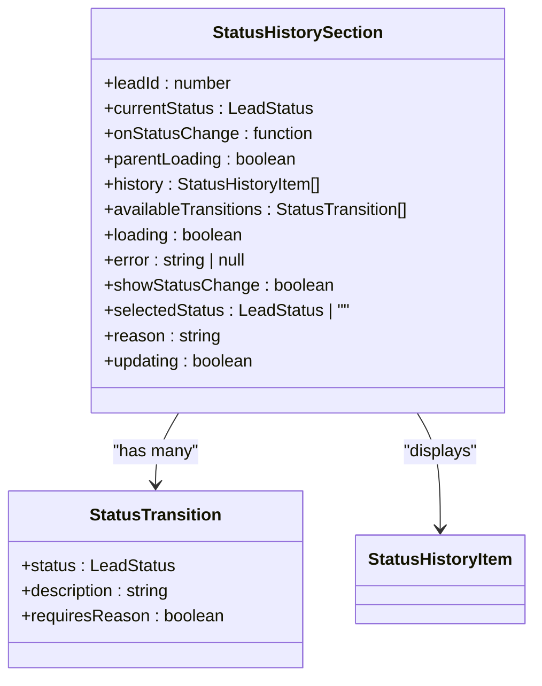
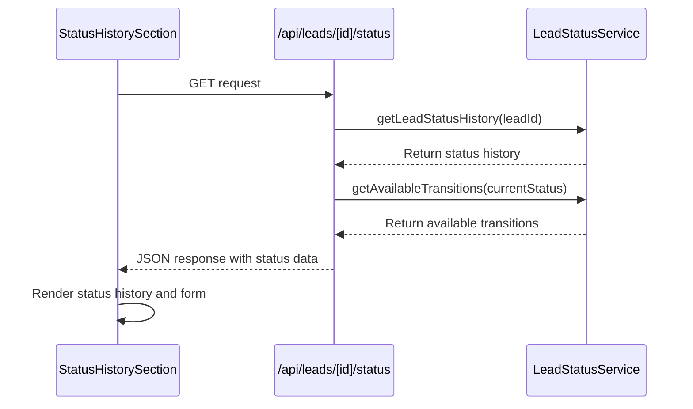
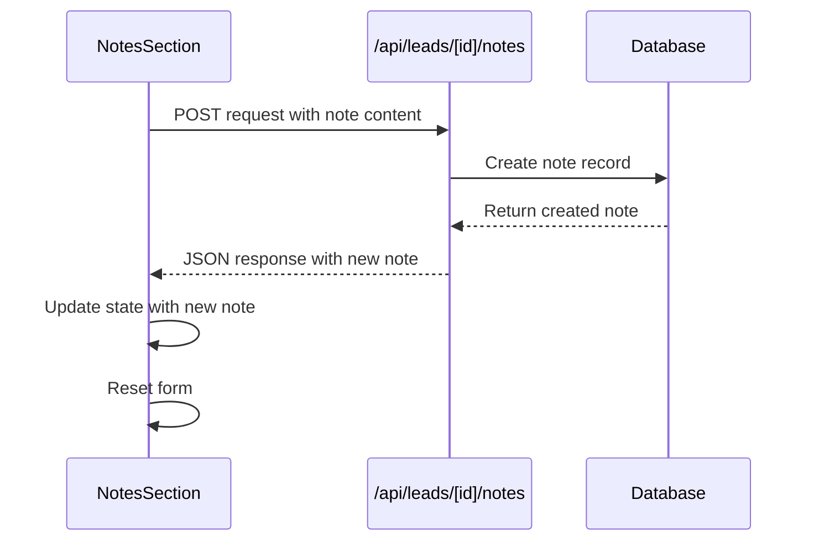
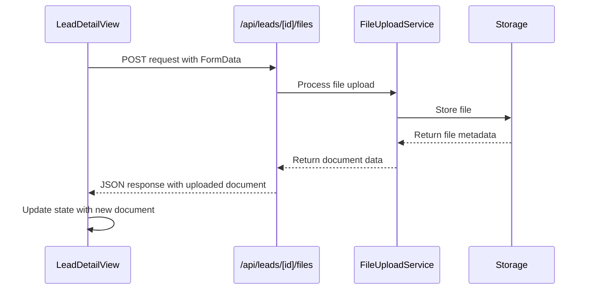
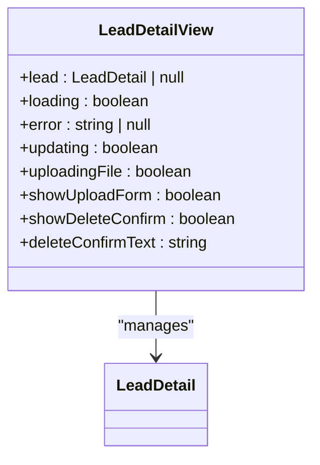
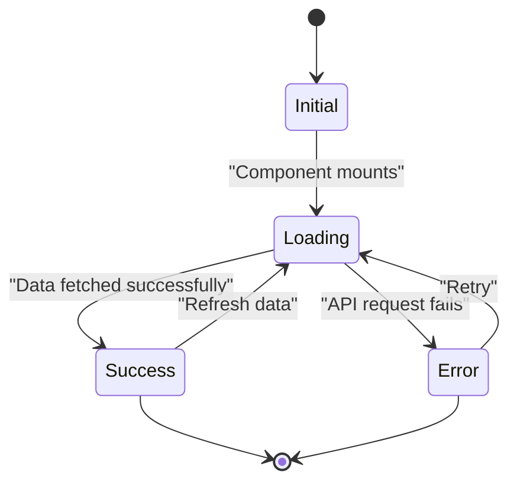

# Lead Detail View Component

<cite>
**Referenced Files in This Document**   
- [LeadDetailView.tsx](file://src/components/dashboard/LeadDetailView.tsx)
- [StatusHistorySection.tsx](file://src/components/dashboard/StatusHistorySection.tsx)
- [NotesSection.tsx](file://src/components/dashboard/NotesSection.tsx)
- [route.ts](file://src/app/api/leads/[id]/route.ts)
- [route.ts](file://src/app/api/leads/[id]/status/route.ts)
- [LeadStatusService.ts](file://src/services/LeadStatusService.ts)
</cite>

## Table of Contents
1. [Introduction](#introduction)
2. [Component Structure and Data Model](#component-structure-and-data-model)
3. [Data Fetching and API Integration](#data-fetching-and-api-integration)
4. [Status History Management](#status-history-management)
5. [Notes Section Functionality](#notes-section-functionality)
6. [Document Management](#document-management)
7. [State Management and User Interactions](#state-management-and-user-interactions)
8. [Error Handling and Loading States](#error-handling-and-loading-states)
9. [Accessibility and User Experience](#accessibility-and-user-experience)
10. [Troubleshooting Guide](#troubleshooting-guide)

## Introduction
The LeadDetailView component provides a comprehensive interface for viewing and managing individual lead information within the fund-tracking application. This component serves as the central hub for sales and operations teams to review lead details, track status changes, add internal notes, and manage associated documents. The component integrates multiple sub-components to present a unified view of lead data, including business details, personal information, financial data, and interaction history. Built using React with Next.js, the component follows modern web development practices with proper state management, error handling, and responsive design.

## Component Structure and Data Model

The LeadDetailView component is structured as a comprehensive dashboard that organizes lead information into logical sections. The component accepts a leadId prop and manages its state internally, fetching data from the API and rendering various sections based on the retrieved data.

```mermaid
classDiagram
class LeadDetail {
+id : number
+legacyLeadId : string
+campaignId : number
+email : string | null
+phone : string | null
+firstName : string | null
+lastName : string | null
+businessName : string | null
+dba : string | null
+businessAddress : string | null
+businessPhone : string | null
+businessEmail : string | null
+mobile : string | null
+businessCity : string | null
+businessState : string | null
+businessZip : string | null
+ownershipPercentage : string | null
+taxId : string | null
+stateOfInc : string | null
+dateBusinessStarted : string | null
+legalEntity : string | null
+natureOfBusiness : string | null
+hasExistingLoans : string | null
+personalAddress : string | null
+personalCity : string | null
+personalState : string | null
+personalZip : string | null
+dateOfBirth : string | null
+socialSecurity : string | null
+legalName : string | null
+industry : string | null
+yearsInBusiness : number | null
+amountNeeded : number | null
+monthlyRevenue : number | null
+status : LeadStatus
+intakeToken : string | null
+intakeCompletedAt : string | null
+step1CompletedAt : string | null
+step2CompletedAt : string | null
+createdAt : string
+updatedAt : string
+importedAt : string
+notes : LeadNote[]
+documents : Document[]
+_count : { notes : number, documents : number, followupQueue : number }
}
class LeadNote {
+id : number
+content : string
+createdAt : string
+user : { id : number, email : string }
}
class Document {
+id : number
+filename : string
+originalFilename : string
+fileSize : number
+mimeType : string
+uploadedAt : string
+user : { id : number, email : string }
}
class StatusHistoryItem {
+id : number
+previousStatus : LeadStatus | null
+newStatus : LeadStatus
+changedBy : number
+reason : string | null
+createdAt : string
+user : { id : number, email : string }
}
LeadDetail --> LeadNote : "has many"
LeadDetail --> Document : "has many"
LeadDetail --> StatusHistoryItem : "has many"
```

**Diagram sources**
- [LeadDetailView.tsx](file://src/components/dashboard/LeadDetailView.tsx#L10-L150)

**Section sources**
- [LeadDetailView.tsx](file://src/components/dashboard/LeadDetailView.tsx#L10-L150)

## Data Fetching and API Integration

The LeadDetailView component fetches lead data through the `/api/leads/[id]` endpoint, which returns a comprehensive data structure containing all relevant information about a lead. The component uses the fetch API to make HTTP requests and manages loading and error states appropriately.



The API endpoint includes related data such as notes, documents, and status history in the response, reducing the need for additional requests. The data fetching process is implemented using the `fetchLead` function, which is called when the component mounts and whenever the leadId prop changes.



**Diagram sources**
- [route.ts](file://src/app/api/leads/[id]/route.ts#L44-L120)
- [LeadDetailView.tsx](file://src/components/dashboard/LeadDetailView.tsx#L150-L200)

**Section sources**
- [route.ts](file://src/app/api/leads/[id]/route.ts#L44-L120)
- [LeadDetailView.tsx](file://src/components/dashboard/LeadDetailView.tsx#L150-L200)

## Status History Management

The StatusHistorySection component provides a comprehensive interface for viewing and updating a lead's status. It displays the current status, available transitions, and historical status changes with timestamps and responsible users.



The component fetches status information from the `/api/leads/[id]/status` endpoint, which returns the current status, status history, and available transitions based on business rules defined in the LeadStatusService. The status transition rules are enforced on both the client and server sides to ensure data integrity.



When a user changes a lead's status, the component sends a PUT request to the `/api/leads/[id]` endpoint with the new status and optional reason. The server validates the transition using the LeadStatusService before updating the database and creating a status history record.

**Diagram sources**
- [StatusHistorySection.tsx](file://src/components/dashboard/StatusHistorySection.tsx#L10-L50)
- [route.ts](file://src/app/api/leads/[id]/status/route.ts#L0-L63)
- [LeadStatusService.ts](file://src/services/LeadStatusService.ts#L60-L110)

**Section sources**
- [StatusHistorySection.tsx](file://src/components/dashboard/StatusHistorySection.tsx#L10-L50)
- [route.ts](file://src/app/api/leads/[id]/status/route.ts#L0-L63)
- [LeadStatusService.ts](file://src/services/LeadStatusService.ts#L60-L110)

## Notes Section Functionality

The NotesSection component enables users to add and view internal notes associated with a lead. It provides a rich text interface with character counting and supports basic formatting through line breaks.

```mermaid
classDiagram
class NotesSection {
+leadId : number
+notes : LeadNote[]
+notesCount : number
+onNotesUpdate : function
+newNote : string
+addingNote : boolean
+characterCount : number
}
class LeadNote {
+id : number
+content : string
+createdAt : string
+user : { id : number, email : string }
}
NotesSection --> LeadNote : "manages"
```

The component allows authenticated users with appropriate roles (ADMIN or USER) to add notes. When a user submits a new note, the component sends a POST request to the `/api/leads/[id]/notes` endpoint. The server creates the note in the database and returns the created note, which is then added to the component's state.



The component displays existing notes in reverse chronological order, showing the note content, author email (with first letter as avatar), and creation timestamp. The character limit is enforced client-side with visual feedback when approaching or exceeding the 5,000 character limit.

**Diagram sources**
- [NotesSection.tsx](file://src/components/dashboard/NotesSection.tsx#L10-L50)

**Section sources**
- [NotesSection.tsx](file://src/components/dashboard/NotesSection.tsx#L10-L50)

## Document Management

The LeadDetailView component includes functionality for managing documents associated with a lead. Users can upload new documents, download existing ones, and delete documents they no longer need.

The document management features are integrated directly into the LeadDetailView component, with state variables for tracking upload progress (`uploadingFile`) and form visibility (`showUploadForm`). When a user uploads a file, the component sends a POST request to the `/api/leads/[id]/files` endpoint with the file data in a FormData object.



For downloading documents, the component uses a direct URL approach by setting `window.location.href` to the download endpoint (`/api/leads/[id]/documents/[documentId]/download`). This triggers the browser's download functionality without requiring additional client-side processing.

Document deletion is handled through a DELETE request to the `/api/leads/[id]/files` endpoint with the documentId as a query parameter. The component shows a confirmation dialog before proceeding with deletion to prevent accidental data loss.

**Section sources**
- [LeadDetailView.tsx](file://src/components/dashboard/LeadDetailView.tsx#L300-L450)

## State Management and User Interactions

The LeadDetailView component manages several pieces of state to handle user interactions and data loading:



The component uses React's useState and useEffect hooks for state management. The primary state variables include:
- **lead**: Stores the fetched lead data
- **loading**: Indicates whether data is being fetched
- **error**: Stores any error messages from API requests
- **updating**: Tracks whether a status update is in progress
- **uploadingFile**: Indicates file upload progress
- **showUploadForm**: Controls visibility of the document upload form
- **showDeleteConfirm**: Controls visibility of the lead deletion confirmation

User interactions trigger specific state changes and API calls:
- Navigating back to the dashboard uses the Next.js router
- Deleting a lead requires confirmation with exact text input
- Uploading documents shows a form that can be toggled
- Status changes are handled through the StatusHistorySection integration

**Diagram sources**
- [LeadDetailView.tsx](file://src/components/dashboard/LeadDetailView.tsx#L50-L100)

**Section sources**
- [LeadDetailView.tsx](file://src/components/dashboard/LeadDetailView.tsx#L50-L100)

## Error Handling and Loading States

The LeadDetailView component implements comprehensive error handling and loading state management to provide a smooth user experience. The component displays different UI states based on the current loading and error conditions.



When data is being fetched, the component displays a loading spinner with the message "Loading lead details...". If an error occurs, the component shows an error card with the error message and options to retry or return to the dashboard.

The component handles several types of errors:
- **404 Not Found**: When the requested lead does not exist
- **401 Unauthorized**: When the user is not authenticated
- **400 Bad Request**: When the leadId is invalid
- **500 Internal Server Error**: For unexpected server errors

Each sub-component also implements its own error handling:
- StatusHistorySection displays errors in a dedicated error message area
- NotesSection shows alerts for failed note creation
- Document operations show alerts for upload, download, or deletion failures

**Section sources**
- [LeadDetailView.tsx](file://src/components/dashboard/LeadDetailView.tsx#L200-L300)
- [StatusHistorySection.tsx](file://src/components/dashboard/StatusHistorySection.tsx#L100-L150)
- [NotesSection.tsx](file://src/components/dashboard/NotesSection.tsx#L100-L150)

## Accessibility and User Experience

The LeadDetailView component incorporates several accessibility features to ensure usability for all users:

- **Keyboard Navigation**: All interactive elements are accessible via keyboard
- **ARIA Labels**: Appropriate ARIA attributes are used for screen readers
- **Color Contrast**: Sufficient contrast between text and background colors
- **Focus Management**: Proper focus handling for modal dialogs and forms
- **Semantic HTML**: Use of appropriate HTML elements for content structure

The user experience is enhanced through several features:
- **Loading States**: Clear visual feedback during data fetching
- **Confirmation Dialogs**: Protection against accidental data loss
- **Character Counting**: Real-time feedback for note length
- **Responsive Design**: Adapts to different screen sizes
- **Visual Hierarchy**: Clear organization of information with appropriate spacing

The component follows a consistent design pattern with:
- A header containing the lead name and navigation
- A main content area with information sections
- Status and notes in prominent positions
- Document management in a dedicated section
- Action buttons with clear labels and visual feedback

**Section sources**
- [LeadDetailView.tsx](file://src/components/dashboard/LeadDetailView.tsx#L0-L1000)
- [StatusHistorySection.tsx](file://src/components/dashboard/StatusHistorySection.tsx#L0-L300)
- [NotesSection.tsx](file://src/components/dashboard/NotesSection.tsx#L0-L150)

## Troubleshooting Guide

This section addresses common issues that may occur with the LeadDetailView component and provides solutions.

### Data Not Loading
**Symptoms**: The component shows a loading spinner indefinitely or displays an error message.
**Possible Causes**:
- Network connectivity issues
- Invalid leadId parameter
- Server-side errors
- Authentication problems

**Solutions**:
1. Check browser developer tools for network errors
2. Verify the leadId in the URL is a valid number
3. Ensure the user is authenticated
4. Check server logs for API errors
5. Try refreshing the page

### Status Changes Not Persisting
**Symptoms**: After changing a lead's status, the change does not appear to be saved.
**Possible Causes**:
- Invalid status transition
- Missing required reason
- Server validation errors
- Race conditions with other updates

**Solutions**:
1. Verify the transition is allowed in the status workflow
2. Check if a reason is required for the specific transition
3. Review browser console for error messages
4. Refresh the page to see if the change was actually saved
5. Check the status history to confirm the change was recorded

### Notes Not Saving
**Symptoms**: When adding a note, the operation fails or the note does not appear.
**Possible Causes**:
- Empty note content
- Character limit exceeded
- Authentication or permission issues
- Network problems

**Solutions**:
1. Ensure the note has content (not just whitespace)
2. Check that the note is under 5,000 characters
3. Verify the user has the appropriate role (ADMIN or USER)
4. Check for network connectivity issues
5. Look for error alerts that may have been dismissed

### Document Upload Issues
**Symptoms**: File uploads fail or do not appear in the document list.
**Possible Causes**:
- File size limits
- Unsupported file types
- Server storage issues
- Permission problems

**Solutions**:
1. Check the file size (ensure it's within acceptable limits)
2. Verify the file type is supported
3. Ensure the user has permission to upload files
4. Check server logs for upload errors
5. Try with a different file to isolate the issue

### Real-time Update Problems
**Symptoms**: The component does not reflect changes made by other users.
**Possible Causes**:
- Lack of real-time synchronization
- Caching issues
- Polling interval too long

**Solutions**:
1. Implement WebSocket or similar real-time technology
2. Add manual refresh button
3. Consider implementing periodic polling for critical updates
4. Ensure the component properly updates state after mutations

**Section sources**
- [LeadDetailView.tsx](file://src/components/dashboard/LeadDetailView.tsx#L0-L1421)
- [StatusHistorySection.tsx](file://src/components/dashboard/StatusHistorySection.tsx#L0-L375)
- [NotesSection.tsx](file://src/components/dashboard/NotesSection.tsx#L0-L191)
- [route.ts](file://src/app/api/leads/[id]/route.ts#L0-L304)
- [route.ts](file://src/app/api/leads/[id]/status/route.ts#L0-L63)
- [LeadStatusService.ts](file://src/services/LeadStatusService.ts#L0-L456)