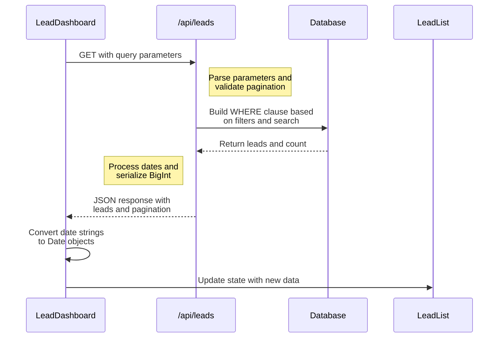
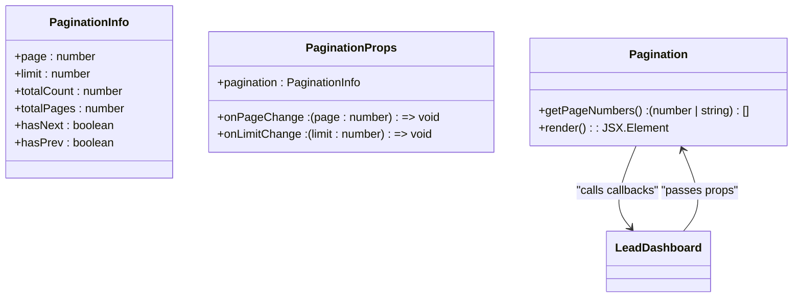
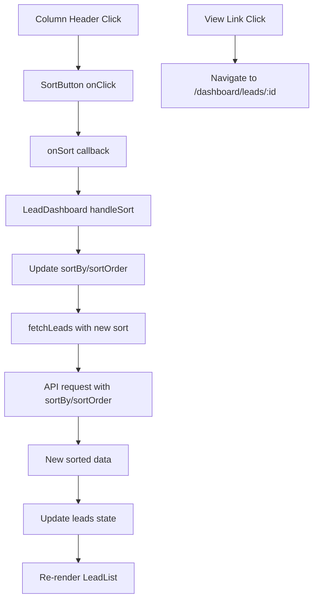
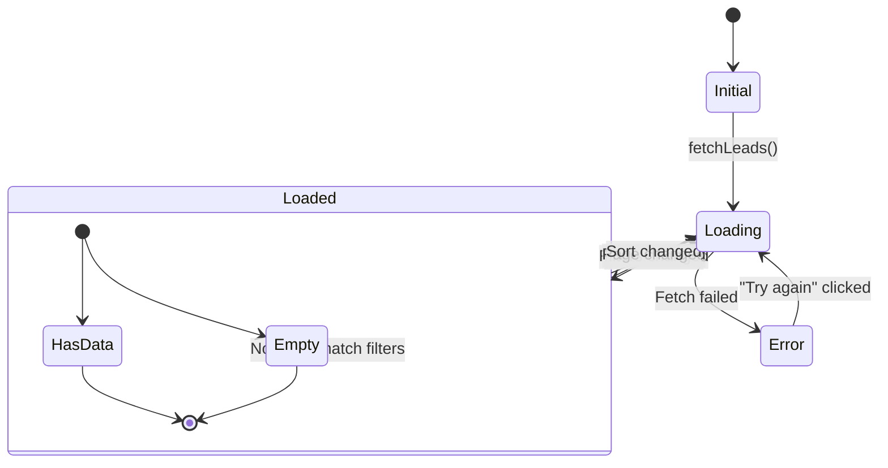
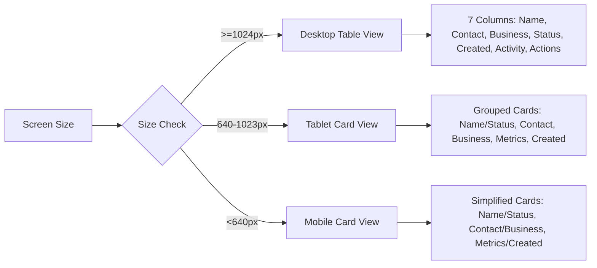

# Lead List Component

<cite>
**Referenced Files in This Document**   
- [LeadList.tsx](file://src/components/dashboard/LeadList.tsx)
- [types.ts](file://src/components/dashboard/types.ts)
- [LeadSearchFilters.tsx](file://src/components/dashboard/LeadSearchFilters.tsx)
- [Pagination.tsx](file://src/components/dashboard/Pagination.tsx)
- [route.ts](file://src/app/api/leads/route.ts)
- [LeadDashboard.tsx](file://src/components/dashboard/LeadDashboard.tsx)
- [page.tsx](file://src/app/dashboard/page.tsx)
</cite>

## Table of Contents
1. [Introduction](#introduction)
2. [Component Overview](#component-overview)
3. [Props Interface](#props-interface)
4. [State Management](#state-management)
5. [Data Fetching Mechanism](#data-fetching-mechanism)
6. [Integration with LeadSearchFilters](#integration-with-leadsearchfilters)
7. [Pagination Integration](#pagination-integration)
8. [User Interaction Handling](#user-interaction-handling)
9. [Loading and Error States](#loading-and-error-states)
10. [Responsive Design Implementation](#responsive-design-implementation)
11. [Performance Considerations](#performance-considerations)
12. [Common Issues and Mitigation Strategies](#common-issues-and-mitigation-strategies)

## Introduction
The LeadList component serves as the primary interface for displaying and managing leads within the FUND TRACK application dashboard. It provides a comprehensive view of lead data with support for sorting, filtering, and pagination. The component is designed to handle large datasets efficiently while maintaining a responsive user interface across different device sizes. This documentation details the implementation, integration points, and operational characteristics of the LeadList component.

## Component Overview
The LeadList component renders a responsive list of leads with key metadata including name, contact information, business details, status, and creation date. It supports three distinct layouts based on screen size: a detailed table view for desktop, a compact card layout for tablets, and a simplified card view for mobile devices. The component integrates with filtering and pagination systems to manage large datasets effectively.

The component displays lead status with color-coded badges using predefined status colors and labels. It also shows engagement metrics through note and document counts, providing quick insights into lead activity. Each lead entry includes a "View" link that navigates to the detailed lead view page.

**Section sources**
- [LeadList.tsx](file://src/components/dashboard/LeadList.tsx#L0-L462)

## Props Interface
The LeadList component accepts a well-defined interface that enables integration with parent components and external data sources:

```typescript
interface LeadListProps {
  leads: Lead[];
  loading: boolean;
  sortBy: string;
  sortOrder: "asc" | "desc";
  onSort: (field: string) => void;
}
```

The props include:
- **leads**: Array of Lead objects containing all lead data to display
- **loading**: Boolean flag indicating whether data is being loaded
- **sortBy**: String specifying the current sort field
- **sortOrder**: Enum indicating sort direction ("asc" or "desc")
- **onSort**: Callback function triggered when a column header is clicked for sorting

The Lead interface, defined in the types file, contains comprehensive lead information including personal details, business information, status, timestamps, and engagement metrics.

```mermaid
classDiagram
class Lead {
+id : number
+legacyLeadId : string | null
+campaignId : number
+email : string | null
+phone : string | null
+firstName : string | null
+lastName : string | null
+businessName : string | null
+industry : string | null
+status : LeadStatus
+createdAt : Date
+updatedAt : Date
+importedAt : Date
+_count : { notes : number, documents : number }
}
class LeadListProps {
+leads : Lead[]
+loading : boolean
+sortBy : string
+sortOrder : "asc" | "desc"
+onSort : (field : string) => void
}
LeadListProps --> Lead : "contains"
```

**Diagram sources**
- [types.ts](file://src/components/dashboard/types.ts#L0-L65)
- [LeadList.tsx](file://src/components/dashboard/LeadList.tsx#L0-L462)

**Section sources**
- [LeadList.tsx](file://src/components/dashboard/LeadList.tsx#L0-L462)
- [types.ts](file://src/components/dashboard/types.ts#L0-L65)

## State Management
The LeadList component itself is a presentational component that does not manage state internally. Instead, state management is delegated to the parent LeadDashboard component, which uses React hooks to manage the application state. The LeadDashboard component employs useState and useCallback hooks to manage leads, loading state, filters, pagination, and sorting parameters.

The component receives all necessary state through props, making it a pure function of its inputs. This separation of concerns allows for better testability and reusability. The parent component handles data fetching, error handling, and state updates, while the LeadList focuses solely on rendering the UI based on the provided props.

```mermaid
flowchart TD
A[LeadDashboard] --> |useState| B[leads: Lead[]]
A --> |useState| C[loading: boolean]
A --> |useState| D[filters: LeadFilters]
A --> |useState| E[pagination: PaginationInfo]
A --> |useState| F[sortBy: string]
A --> |useState| G[sortOrder: "asc"|"desc"]
A --> H[LeadList]
H --> |leads| B
H --> |loading| C
H --> |sortBy| F
H --> |sortOrder| G
H --> |onSort| A
```

**Diagram sources**
- [LeadDashboard.tsx](file://src/components/dashboard/LeadDashboard.tsx#L0-L216)
- [LeadList.tsx](file://src/components/dashboard/LeadList.tsx#L0-L462)

**Section sources**
- [LeadDashboard.tsx](file://src/components/dashboard/LeadDashboard.tsx#L0-L216)
- [LeadList.tsx](file://src/components/dashboard/LeadList.tsx#L0-L462)

## Data Fetching Mechanism
The data fetching mechanism is implemented in the LeadDashboard component, which orchestrates communication with the API endpoint at `/api/leads`. The fetchLeads function constructs URL parameters from the current state of filters, pagination, and sorting options, then makes a fetch request to retrieve the appropriate data.

The API endpoint supports various query parameters:
- **page**: Current page number for pagination
- **limit**: Number of leads per page
- **search**: Text search across multiple lead fields
- **status**: Filter by lead status
- **dateFrom/dateTo**: Date range filter for lead creation
- **sortBy/sortOrder**: Sorting parameters

The response from the API includes both the leads array and pagination metadata, which are processed and stored in the component state. Date strings are converted back to Date objects for proper formatting in the UI.



**Diagram sources**
- [LeadDashboard.tsx](file://src/components/dashboard/LeadDashboard.tsx#L0-L216)
- [route.ts](file://src/app/api/leads/route.ts#L0-L166)

**Section sources**
- [LeadDashboard.tsx](file://src/components/dashboard/LeadDashboard.tsx#L0-L216)
- [route.ts](file://src/app/api/leads/route.ts#L0-L166)

## Integration with LeadSearchFilters
The LeadList component integrates with the LeadSearchFilters component through the parent LeadDashboard component. The LeadSearchFilters component provides a user interface for applying various filters to the lead data, including text search, status filtering, and date range selection.

The LeadSearchFilters component implements debouncing for the search input field, with a 500ms delay to prevent excessive API calls during typing. Non-search filters (status, date range) are applied immediately. When filters change, the parent component resets to the first page and triggers a new data fetch.

The filters are implemented as controlled components, with the parent maintaining the filter state and passing it down to both the LeadSearchFilters and LeadList components. This ensures consistency between the displayed filters and the actual data shown.

```mermaid
flowchart LR
A[LeadDashboard] --> B[LeadSearchFilters]
A --> C[LeadList]
B --> |onFiltersChange| A
A --> |filters| B
A --> |filters| C
A --> |fetchLeads| D[/api/leads]
D --> |filtered data| A
A --> |leads| C
subgraph "Filter Types"
E[Text Search]
F[Status Filter]
G[Date Range]
end
B --> E
B --> F
B --> G
```

**Diagram sources**
- [LeadDashboard.tsx](file://src/components/dashboard/LeadDashboard.tsx#L0-L216)
- [LeadSearchFilters.tsx](file://src/components/dashboard/LeadSearchFilters.tsx#L0-L325)

**Section sources**
- [LeadDashboard.tsx](file://src/components/dashboard/LeadDashboard.tsx#L0-L216)
- [LeadSearchFilters.tsx](file://src/components/dashboard/LeadSearchFilters.tsx#L0-L325)

## Pagination Integration
The LeadList component integrates with the Pagination component to handle large datasets efficiently. The Pagination component displays page controls, results information, and per-page selection options. It allows users to navigate between pages and adjust the number of leads displayed per page.

When the user changes pages or adjusts the limit, the parent LeadDashboard component updates the pagination state and triggers a new data fetch. Changing the limit automatically resets to the first page to maintain a consistent user experience.

The pagination information includes:
- Current page number
- Items per page (limit)
- Total count of leads
- Total number of pages
- Navigation flags (hasNext, hasPrev)



**Diagram sources**
- [Pagination.tsx](file://src/components/dashboard/Pagination.tsx#L0-L134)
- [LeadDashboard.tsx](file://src/components/dashboard/LeadDashboard.tsx#L0-L216)

**Section sources**
- [Pagination.tsx](file://src/components/dashboard/Pagination.tsx#L0-L134)
- [LeadDashboard.tsx](file://src/components/dashboard/LeadDashboard.tsx#L0-L216)

## User Interaction Handling
The LeadList component handles several user interactions through callback functions passed as props. The primary interaction is column sorting, which is implemented through the SortButton component embedded in table headers.

When a user clicks on a sortable column header, the onSort callback is triggered with the corresponding field name. The parent component then updates the sortBy and sortOrder state, which triggers a new data fetch with the updated sorting parameters.

The component also handles navigation through the "View" links, which use standard anchor tags to navigate to the detailed lead view page. No client-side routing is implemented within the LeadList component itself.

For mobile and tablet views, the component provides a simplified interaction model with direct access to the most important lead information and the view action.



**Diagram sources**
- [LeadList.tsx](file://src/components/dashboard/LeadList.tsx#L0-L462)
- [LeadDashboard.tsx](file://src/components/dashboard/LeadDashboard.tsx#L0-L216)

**Section sources**
- [LeadList.tsx](file://src/components/dashboard/LeadList.tsx#L0-L462)
- [LeadDashboard.tsx](file://src/components/dashboard/LeadDashboard.tsx#L0-L216)

## Loading and Error States
The LeadList component implements a comprehensive loading state using a skeleton screen approach. When the loading prop is true, the component renders placeholder elements that mimic the structure of the actual content. This provides immediate visual feedback to users while data is being fetched.

The skeleton screen includes animated placeholders for each lead field, maintaining the same layout as the actual content. This creates a smooth transition from loading to loaded state, improving perceived performance.

Error handling is managed at the parent LeadDashboard level. When an error occurs during data fetching, the LeadDashboard displays an error message with a "Try again" button that triggers a new fetch attempt. The LeadList component itself does not handle errors directly.

The component also implements an empty state when no leads match the current filters. In this case, a message is displayed suggesting the user adjust their search criteria or clear filters.



**Diagram sources**
- [LeadList.tsx](file://src/components/dashboard/LeadList.tsx#L0-L462)
- [LeadDashboard.tsx](file://src/components/dashboard/LeadDashboard.tsx#L0-L216)

**Section sources**
- [LeadList.tsx](file://src/components/dashboard/LeadList.tsx#L0-L462)
- [LeadDashboard.tsx](file://src/components/dashboard/LeadDashboard.tsx#L0-L216)

## Responsive Design Implementation
The LeadList component implements a responsive design with three distinct layouts optimized for different screen sizes:

1. **Desktop (lg and above)**: Full table view with all columns visible
2. **Tablet (sm to lg)**: Compact card layout with grouped information
3. **Mobile (below sm)**: Simplified card layout with essential information

The responsive behavior is controlled using Tailwind CSS classes that show or hide elements based on screen size. The component uses the `hidden` and `block` classes with responsive prefixes (sm:, lg:) to control the visibility of different layout variants.

Each layout prioritizes information differently, with the mobile view focusing on the most critical data points to conserve screen space. The desktop view provides the most comprehensive information, while the tablet view strikes a balance between information density and readability.



**Diagram sources**
- [LeadList.tsx](file://src/components/dashboard/LeadList.tsx#L0-L462)

**Section sources**
- [LeadList.tsx](file://src/components/dashboard/LeadList.tsx#L0-L462)

## Performance Considerations
The LeadList component and its surrounding architecture incorporate several performance optimizations:

1. **Debounced filtering**: The search input is debounced with a 500ms delay to prevent excessive API calls during typing
2. **Efficient re-renders**: The component is designed as a pure presentational component that only re-renders when props change
3. **Pagination**: Large datasets are handled through server-side pagination, limiting the amount of data transferred and rendered
4. **Selective fetching**: Only the current page of data is fetched, reducing network payload
5. **Skeleton loading**: Provides immediate feedback during loading, improving perceived performance

The architecture follows a client-server model where filtering, sorting, and pagination are handled on the server side. This reduces the client-side processing burden and ensures consistent behavior across different devices.

Potential performance improvements could include:
- Implementing virtualization for the table view to handle very large page sizes
- Adding memoization to prevent unnecessary re-renders of list items
- Implementing caching strategies for frequently accessed data
- Optimizing the API response size by allowing field selection

**Section sources**
- [LeadList.tsx](file://src/components/dashboard/LeadList.tsx#L0-L462)
- [LeadDashboard.tsx](file://src/components/dashboard/LeadDashboard.tsx#L0-L216)
- [LeadSearchFilters.tsx](file://src/components/dashboard/LeadSearchFilters.tsx#L0-L325)

## Common Issues and Mitigation Strategies
Several common issues have been identified and addressed in the implementation:

**Stale Data**: When filters change rapidly, there's a risk of stale data being displayed if API responses arrive out of order. This is mitigated by the use of the useCallback hook with proper dependencies, ensuring that the fetch function always uses the current state.

**Slow Rendering**: For large page sizes, rendering many list items can cause performance issues. The current pagination limit of 100 items per page helps mitigate this, but implementing virtualization could further improve performance.

**Network Errors**: API failures are handled gracefully with error states and retry mechanisms. The error boundary in the parent component prevents the entire UI from crashing.

**Date Serialization**: The API returns dates as strings, which must be converted back to Date objects. This is handled consistently in the fetchLeads function.

**BigInt Serialization**: The legacyLeadId field uses BigInt, which cannot be serialized to JSON. This is addressed by converting BigInt values to strings in the API response.

**Filter State Synchronization**: Ensuring that the displayed filters match the actual data shown is critical. This is maintained by having a single source of truth in the parent component's state.

**Section sources**
- [LeadDashboard.tsx](file://src/components/dashboard/LeadDashboard.tsx#L0-L216)
- [route.ts](file://src/app/api/leads/route.ts#L0-L166)
- [LeadList.tsx](file://src/components/dashboard/LeadList.tsx#L0-L462)