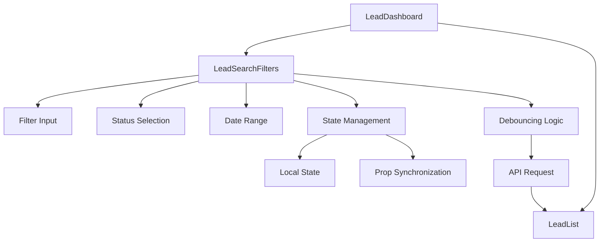
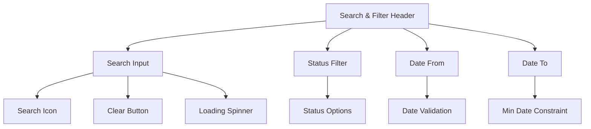
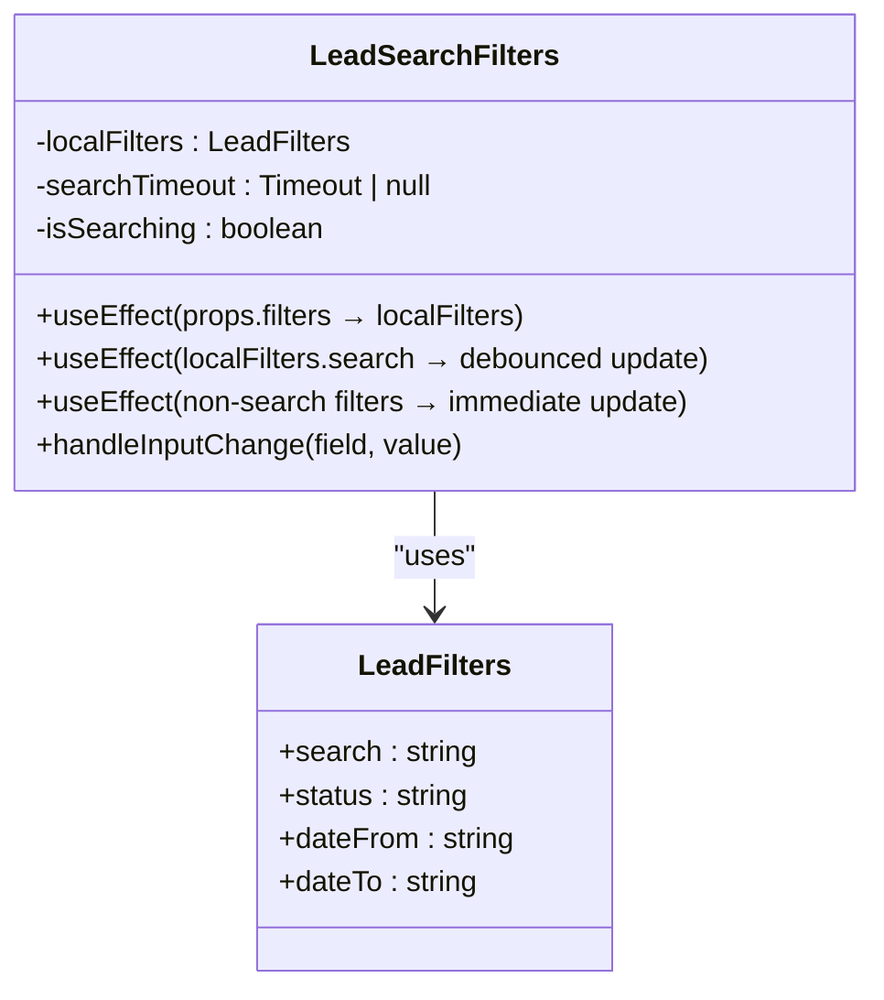
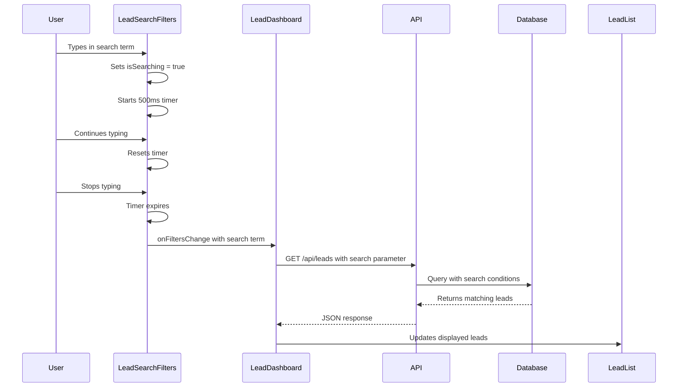
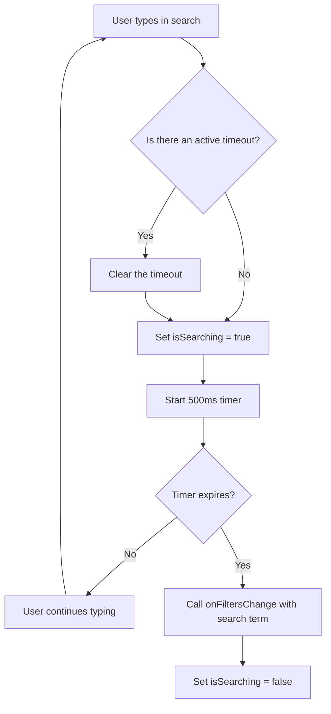
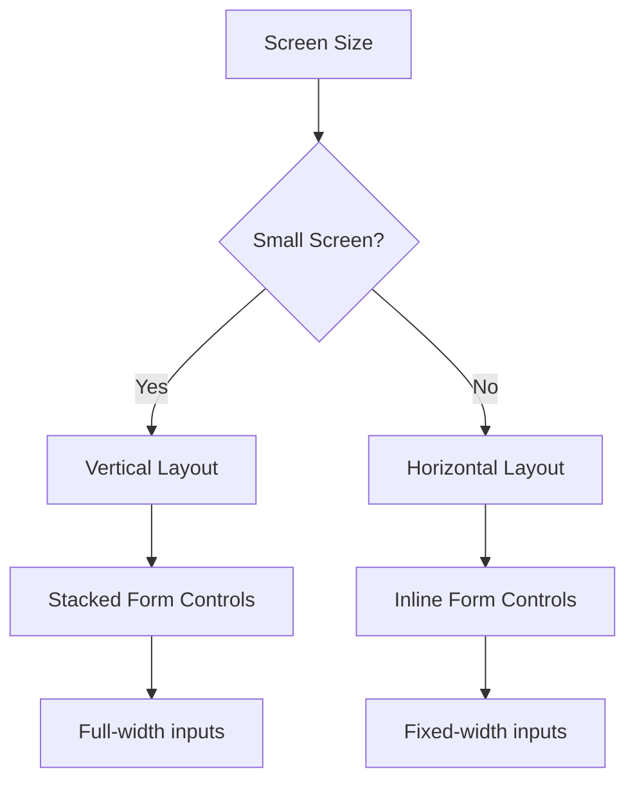
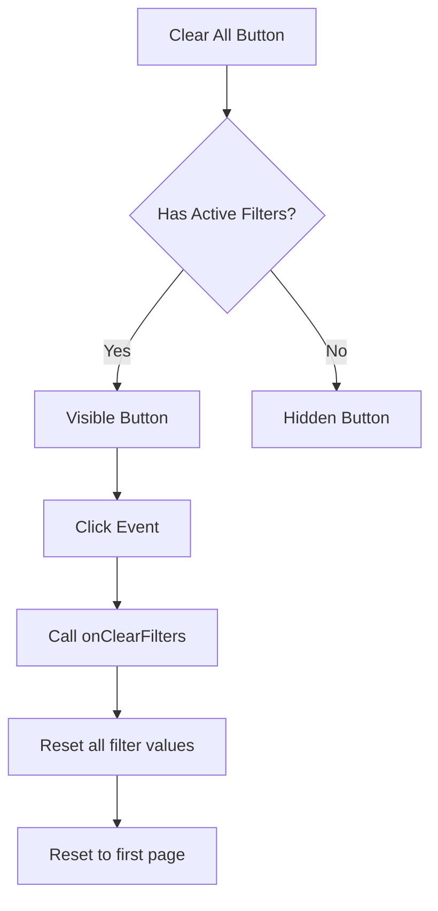
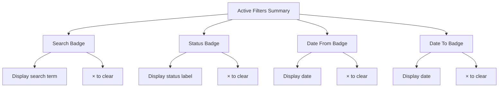

# Lead Search Filters

<cite>
**Referenced Files in This Document**   
- [LeadSearchFilters.tsx](file://src/components/dashboard/LeadSearchFilters.tsx)
- [types.ts](file://src/components/dashboard/types.ts)
- [LeadDashboard.tsx](file://src/components/dashboard/LeadDashboard.tsx)
- [route.ts](file://src/app/api/leads/route.ts)
- [schema.prisma](file://prisma/schema.prisma)
</cite>

## Table of Contents
1. [Introduction](#introduction)
2. [Component Overview](#component-overview)
3. [Form Controls and Layout](#form-controls-and-layout)
4. [State Management](#state-management)
5. [Filter Change Handling and API Integration](#filter-change-handling-and-api-integration)
6. [Debouncing Mechanism](#debouncing-mechanism)
7. [Responsive Design](#responsive-design)
8. [Reset Functionality](#reset-functionality)
9. [Validation and User Feedback](#validation-and-user-feedback)
10. [Integration with LeadList Component](#integration-with-leadlist-component)
11. [Complex Filter Combinations](#complex-filter-combinations)
12. [Performance Considerations](#performance-considerations)
13. [Common Issues and Best Practices](#common-issues-and-best-practices)

## Introduction
The Lead Search Filters component provides a comprehensive interface for dynamically querying and filtering leads within the dashboard. This document details the implementation, functionality, and integration patterns of the component, focusing on its role in enabling efficient lead management through sophisticated filtering capabilities. The component supports filtering by status, date ranges, business name, and various other fields through a user-friendly interface with responsive design and performance optimizations.

## Component Overview
The LeadSearchFilters component is a client-side React component that enables users to filter leads based on multiple criteria. It provides a clean, intuitive interface with search functionality, status selection, and date range filtering. The component is designed to work in conjunction with the LeadList component, passing filter parameters that are used to query the API and display filtered results.



**Diagram sources**
- [LeadSearchFilters.tsx](file://src/components/dashboard/LeadSearchFilters.tsx)
- [LeadDashboard.tsx](file://src/components/dashboard/LeadDashboard.tsx)

**Section sources**
- [LeadSearchFilters.tsx](file://src/components/dashboard/LeadSearchFilters.tsx#L1-L325)

## Form Controls and Layout
The component features a well-organized layout with multiple filter controls arranged in a responsive grid. The form includes:

- **Search Input**: A text field that supports searching across multiple lead fields including name, email, phone, business name, industry, location, token, and ID
- **Status Filter**: A dropdown selection for filtering by lead status
- **Date Range Filters**: Two date input fields for filtering by creation date range



**Diagram sources**
- [LeadSearchFilters.tsx](file://src/components/dashboard/LeadSearchFilters.tsx#L100-L250)

**Section sources**
- [LeadSearchFilters.tsx](file://src/components/dashboard/LeadSearchFilters.tsx#L100-L250)

### Search Input
The search input field provides a comprehensive search capability across multiple lead attributes. When a user types in the search field, a loading spinner appears to indicate that a search is in progress. The input supports clearing via a dedicated × button that appears when text is entered.

**Key Features:**
- Placeholder text: "Search by name, email, phone, business name, industry, location, token, or ID..."
- Loading state indication with spinner animation
- Clear functionality with × button
- Responsive design that adapts to screen size

### Status Filter
The status filter provides a dropdown selection with the following options:
- All Statuses (default)
- New
- Pending
- In Progress
- Completed
- Rejected

The component defines these options in the `STATUS_OPTIONS` constant, mapping internal status values to user-friendly labels.

### Date Range Filters
The component includes two date input fields:
- **Date From**: Filters leads created on or after the selected date
- **Date To**: Filters leads created on or before the selected date

The "Date To" field includes a validation constraint that sets its minimum value to the selected "Date From" value, preventing invalid date ranges.

## State Management
The LeadSearchFilters component employs React hooks for state management, using a combination of local state and prop synchronization to maintain filter values.



**Diagram sources**
- [LeadSearchFilters.tsx](file://src/components/dashboard/LeadSearchFilters.tsx#L20-L45)
- [types.ts](file://src/components/dashboard/types.ts#L15-L21)

**Section sources**
- [LeadSearchFilters.tsx](file://src/components/dashboard/LeadSearchFilters.tsx#L20-L45)
- [types.ts](file://src/components/dashboard/types.ts#L15-L21)

### Local State Variables
The component maintains three state variables:

- **localFilters**: Stores the current filter values in the component's local state
- **searchTimeout**: Manages the timeout for debounced search operations
- **isSearching**: Tracks whether a search operation is in progress

### State Synchronization
The component uses the `useEffect` hook to synchronize its local state with the props it receives:

```typescript
useEffect(() => {
  setLocalFilters(filters);
}, [filters]);
```

This ensures that when the parent component updates the filter values (for example, after an API response), the LeadSearchFilters component reflects these changes in its UI.

## Filter Change Handling and API Integration
The component integrates with the parent LeadDashboard component to trigger API requests when filters change. The filtering system is designed to minimize unnecessary API calls while providing responsive feedback to users.



**Diagram sources**
- [LeadSearchFilters.tsx](file://src/components/dashboard/LeadSearchFilters.tsx#L45-L94)
- [LeadDashboard.tsx](file://src/components/dashboard/LeadDashboard.tsx#L29-L51)
- [route.ts](file://src/app/api/leads/route.ts#L23-L47)

**Section sources**
- [LeadSearchFilters.tsx](file://src/components/dashboard/LeadSearchFilters.tsx#L45-L94)
- [LeadDashboard.tsx](file://src/components/dashboard/LeadDashboard.tsx#L29-L51)

### Filter Propagation
When filter values change, they are propagated to the parent component through callback functions:

- **onFiltersChange**: Called when filter values are updated
- **onClearFilters**: Called when the user clicks the "Clear All" button

The LeadDashboard component receives these callbacks and uses them to update its own state and trigger API requests.

## Debouncing Mechanism
The component implements a debouncing mechanism specifically for the search input to prevent excessive API calls during typing.



**Diagram sources**
- [LeadSearchFilters.tsx](file://src/components/dashboard/LeadSearchFilters.tsx#L45-L75)

**Section sources**
- [LeadSearchFilters.tsx](file://src/components/dashboard/LeadSearchFilters.tsx#L45-L75)

### Implementation Details
The debouncing is implemented using a `useEffect` hook that watches only the `localFilters.search` value:

```typescript
useEffect(() => {
  if (searchTimeout) {
    clearTimeout(searchTimeout);
  }

  if (localFilters.search) {
    setIsSearching(true);
  }

  const timeout = setTimeout(() => {
    onFiltersChange({
      ...localFilters,
      search: localFilters.search,
    });
    setIsSearching(false);
  }, 500);

  setSearchTimeout(timeout);

  return () => {
    if (timeout) {
      clearTimeout(timeout);
    }
  };
}, [localFilters.search]);
```

This implementation has several key features:
- **500ms delay**: Provides a balance between responsiveness and reducing API calls
- **Immediate visual feedback**: Shows a loading spinner as soon as typing begins
- **Cleanup function**: Ensures no memory leaks by clearing timeouts when the component unmounts or the effect re-runs

### Non-Search Filter Handling
Unlike the search input, non-search filters (status, date range) trigger immediate updates without debouncing:

```typescript
useEffect(() => {
  onFiltersChange(localFilters);
}, [localFilters.status, localFilters.dateFrom, localFilters.dateTo]);
```

This approach provides immediate feedback for these filters while reserving debouncing for the search field, which is more likely to generate rapid successive changes.

## Responsive Design
The component is designed with responsive behavior to ensure usability across different screen sizes.



**Diagram sources**
- [LeadSearchFilters.tsx](file://src/components/dashboard/LeadSearchFilters.tsx#L100-L250)

**Section sources**
- [LeadSearchFilters.tsx](file://src/components/dashboard/LeadSearchFilters.tsx#L100-L250)

### Layout Breakpoints
The component uses Tailwind CSS classes to implement responsive behavior:

- On small screens: Form controls are stacked vertically (`flex-col`)
- On larger screens: Form controls are arranged horizontally (`sm:flex-row`)

The responsive layout ensures that all filter controls remain accessible and usable regardless of device size.

### Input Sizing
The component uses responsive width classes:
- Search input: `flex-1` to take available space
- Status filter: `lg:w-40` for consistent width on larger screens
- Date inputs: `lg:w-36` for consistent width on larger screens

## Reset Functionality
The component provides comprehensive reset functionality that allows users to clear all active filters.



**Diagram sources**
- [LeadSearchFilters.tsx](file://src/components/dashboard/LeadSearchFilters.tsx#L80-L90)
- [LeadDashboard.tsx](file://src/components/dashboard/LeadDashboard.tsx#L180-L190)

**Section sources**
- [LeadSearchFilters.tsx](file://src/components/dashboard/LeadSearchFilters.tsx#L80-L90)

### Conditional Visibility
The "Clear All" button is only displayed when one or more filters are active:

```typescript
const hasActiveFilters = Object.values(localFilters).some(
  (value) => value !== ""
);
```

This improves the user interface by only showing the reset option when it's relevant.

### Individual Filter Clearing
In addition to the "Clear All" button, users can clear individual filters:
- Search: × button in the input field
- Status: Select "All Statuses" option
- Date From/To: × button in the active filter badge

## Validation and User Feedback
The component provides several forms of user feedback and validation to enhance the user experience.

### Active Filters Summary
When filters are active, the component displays a summary of the active filters:



**Diagram sources**
- [LeadSearchFilters.tsx](file://src/components/dashboard/LeadSearchFilters.tsx#L250-L300)

**Section sources**
- [LeadSearchFilters.tsx](file://src/components/dashboard/LeadSearchFilters.tsx#L250-L300)

### Loading States
The component provides visual feedback during search operations:
- **Search spinner**: Animated spinner icon in the search input
- **Disabled state**: All form controls are disabled when the parent component is loading

### Date Validation
The "Date To" field includes client-side validation to prevent invalid date ranges by setting the `min` attribute to the selected "Date From" value.

## Integration with LeadList Component
The LeadSearchFilters component works in conjunction with the LeadList component through the parent LeadDashboard component.

```mermaid
graph TD
A[LeadDashboard] --> B[LeadSearchFilters]
A --> C[LeadList]
B --> |onFiltersChange| A
A --> |filters| B
A --> |leads| C
A --> |fetchLeads| D[/api/leads]
D --> |query parameters| E[Database]
E --> |filtered results| D
D --> |JSON response| A
```

**Diagram sources**
- [LeadDashboard.tsx](file://src/components/dashboard/LeadDashboard.tsx)
- [LeadSearchFilters.tsx](file://src/components/dashboard/LeadSearchFilters.tsx)

**Section sources**
- [LeadDashboard.tsx](file://src/components/dashboard/LeadDashboard.tsx#L112-L141)

### Data Flow
1. User interacts with LeadSearchFilters
2. LeadSearchFilters calls onFiltersChange with updated filter values
3. LeadDashboard updates its filters state and resets to page 1
4. LeadDashboard triggers fetchLeads which calls the API with filter parameters
5. API returns filtered leads
6. LeadDashboard passes leads to LeadList for display

## Complex Filter Combinations
The filtering system supports complex combinations of criteria, allowing users to create sophisticated queries.

### Example Combinations
**Scenario 1: Recent High-Value Leads**
- Status: "In Progress"
- Date From: Last 7 days
- Search: "restaurant"

**Scenario 2: Unprocessed New Leads**
- Status: "New"
- Date To: Today
- No search term

**Scenario 3: Follow-up Required**
- Status: "Pending"
- Date From: More than 3 days ago
- No search term

### Server-Side Implementation
The API endpoint combines multiple filter conditions using Prisma's query builder:

```typescript
// Build where clause for filtering
const where: any = {};

// Search filter (multiple fields with OR)
if (search) {
  where.OR = [
    { firstName: { contains: search, mode: 'insensitive' } },
    { lastName: { contains: search, mode: 'insensitive' } },
    // ... other fields
  ];
}

// Status filter
if (status) {
  where.status = statusMap[status];
}

// Date range filter
if (dateFrom || dateTo) {
  where.createdAt = {};
  if (dateFrom) {
    where.createdAt.gte = new Date(dateFrom);
  }
  if (dateTo) {
    where.createdAt.lte = new Date(dateTo);
  }
}
```

**Section sources**
- [route.ts](file://src/app/api/leads/route.ts#L23-L60)

## Performance Considerations
The component implements several performance optimizations to ensure a smooth user experience.

### Debouncing Strategy
The 500ms debounce on search input significantly reduces the number of API calls during typing, preventing performance issues and reducing server load.

### Selective Effect Dependencies
The component uses carefully selected dependency arrays in useEffect hooks:
- Search effect only watches `localFilters.search`
- Non-search effect only watches status and date filters

This prevents unnecessary re-renders and effect executions.

### Efficient State Updates
The component uses functional state updates to ensure consistency:

```typescript
setLocalFilters((prev) => ({
  ...prev,
  [field]: value,
}));
```

### API Optimization
The server-side implementation uses database indexing and efficient query patterns to handle filter combinations effectively.

## Common Issues and Best Practices

### Common Issues
**Stale Filters**: When navigating between pages, filter state might not persist. Solution: Implement URL-based state management or localStorage persistence.

**Performance Bottlenecks**: Complex search queries across multiple text fields can be slow. Solution: Ensure proper database indexing on searched fields.

**Date Range Confusion**: Users might not understand that "Date From" and "Date To" refer to creation date. Solution: Improve label text or add tooltips.

### User Experience Best Practices
**Immediate Feedback**: Provide visual indication of search activity with the loading spinner.

**Clear All Option**: Make it easy to reset filters with the prominent "Clear All" button.

**Responsive Design**: Ensure the interface works well on all device sizes.

**Accessible Labels**: Use proper HTML labels for all form controls.

### Integration Patterns
**Controlled Component Pattern**: The component follows React's controlled component pattern, with the parent component managing the source of truth for filter values.

**Callback Pattern**: Uses callback functions (onFiltersChange, onClearFilters) to communicate state changes to the parent.

**Single Responsibility**: The component focuses solely on filter UI and user interaction, delegating data fetching to the parent component.