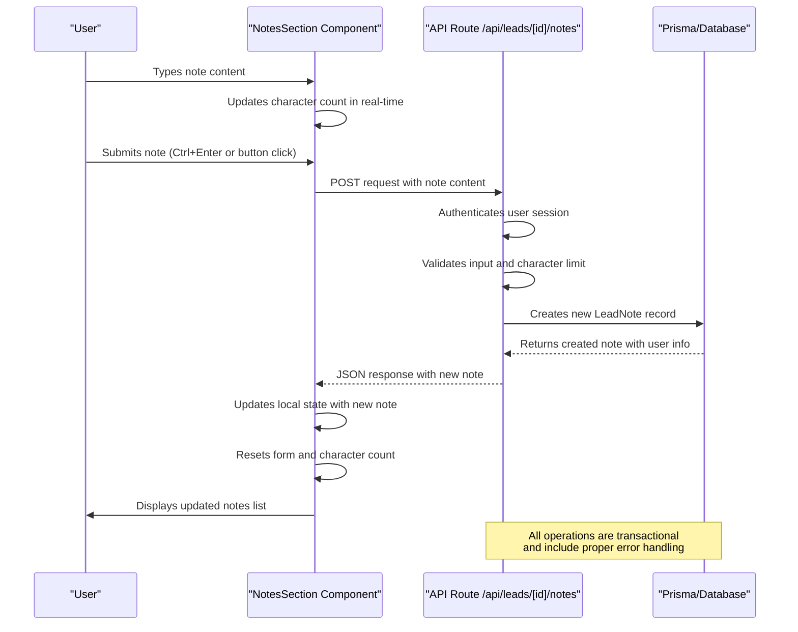
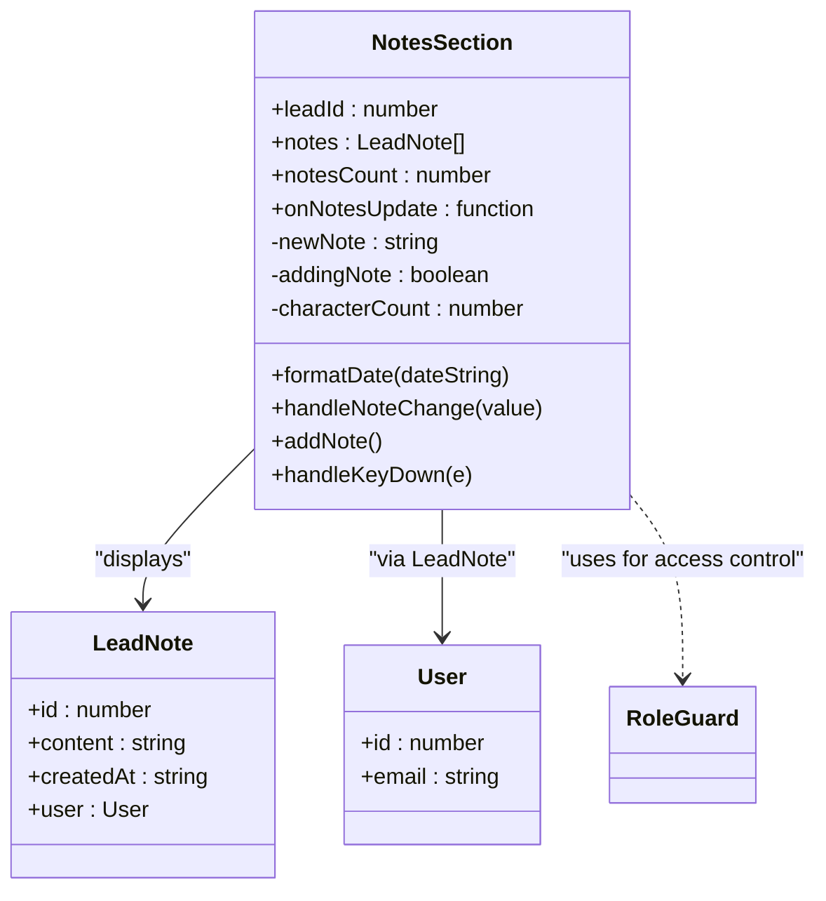
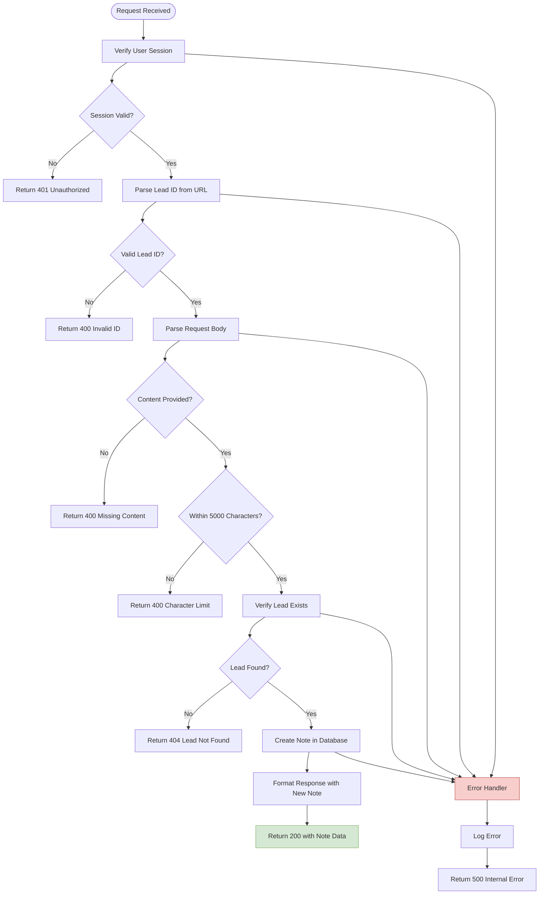
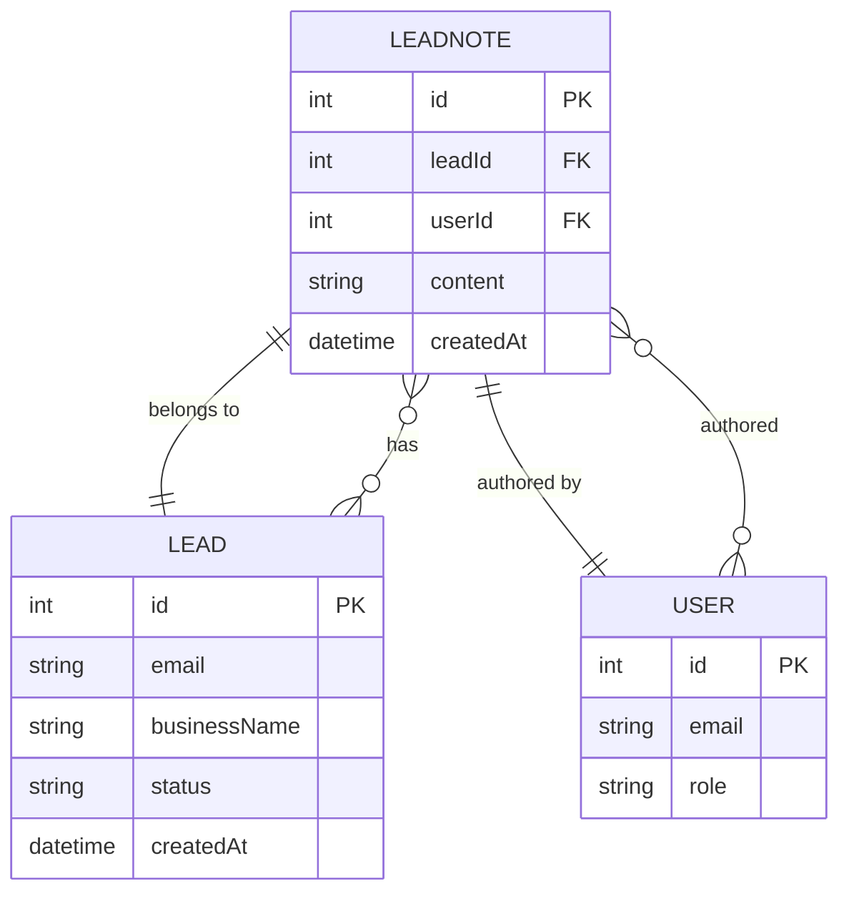
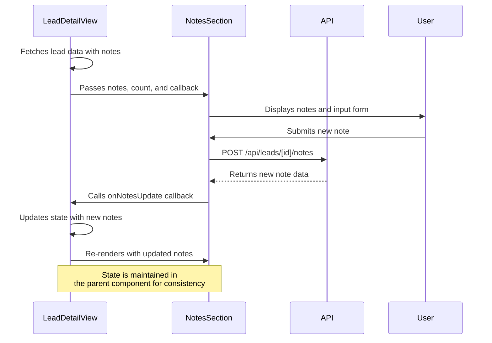

# Notes Section

<cite>
**Referenced Files in This Document**   
- [NotesSection.tsx](file://src/components/dashboard/NotesSection.tsx)
- [route.ts](file://src/app/api/leads/[id]/notes/route.ts)
- [schema.prisma](file://prisma/schema.prisma)
- [LeadDetailView.tsx](file://src/components/dashboard/LeadDetailView.tsx)
</cite>

## Table of Contents
1. [Introduction](#introduction)
2. [Component Overview](#component-overview)
3. [Architecture and Data Flow](#architecture-and-data-flow)
4. [Detailed Component Analysis](#detailed-component-analysis)
5. [Backend API Implementation](#backend-api-implementation)
6. [Database Schema](#database-schema)
7. [Integration with LeadDetailView](#integration-with-lead-detail-view)
8. [User Interface and Experience](#user-interface-and-experience)
9. [Error Handling and Validation](#error-handling-and-validation)
10. [Common Issues and Solutions](#common-issues-and-solutions)

## Introduction
The NotesSection component is a critical user interface element in the lead management system, enabling users to document and view internal communications related to a specific lead. This component facilitates collaboration by allowing team members to add contextual information, track interactions, and maintain a chronological record of activities. The implementation follows a client-server architecture with React for the frontend, Next.js API routes for backend processing, and Prisma for database interactions.

## Component Overview
The NotesSection component provides a complete solution for managing user-generated notes on leads, featuring both input and display capabilities. It renders a form for creating new notes and displays existing notes in chronological order (most recent first). The component is designed with accessibility, user experience, and data integrity in mind, incorporating real-time character counting, keyboard shortcuts, and visual feedback for various states.

**Section sources**
- [NotesSection.tsx](file://src/components/dashboard/NotesSection.tsx#L25-L190)

## Architecture and Data Flow
The NotesSection operates within a well-defined architectural pattern that separates concerns between frontend presentation, API communication, and database persistence. When a user interacts with the component, data flows through a series of well-defined steps that ensure consistency and reliability.



**Diagram sources**
- [NotesSection.tsx](file://src/components/dashboard/NotesSection.tsx#L25-L190)
- [route.ts](file://src/app/api/leads/[id]/notes/route.ts#L0-L82)

## Detailed Component Analysis
The NotesSection component is implemented as a React functional component with comprehensive state management and user interaction handling. It accepts several props that define its behavior and initial state, enabling flexible integration with parent components.

### State Management
The component maintains three key state variables:
- `newNote`: Stores the current content being typed in the textarea
- `addingNote`: Tracks whether a note submission is in progress (loading state)
- `characterCount`: Maintains the current character count for display and validation



**Diagram sources**
- [NotesSection.tsx](file://src/components/dashboard/NotesSection.tsx#L6-L190)

**Section sources**
- [NotesSection.tsx](file://src/components/dashboard/NotesSection.tsx#L25-L190)

## Backend API Implementation
The backend API route handles the creation of new notes with comprehensive validation, authentication, and error handling. The implementation follows security best practices and ensures data integrity through multiple validation layers.

### API Endpoint: POST /api/leads/[id]/notes
The API route performs the following operations in sequence:
1. Authentication verification using Next-Auth
2. Lead ID validation and parsing
3. Request body validation (content presence and type)
4. Character limit enforcement (5,000 characters maximum)
5. Lead existence verification in the database
6. Note creation with associated user and lead references
7. Response formatting with the newly created note



**Diagram sources**
- [route.ts](file://src/app/api/leads/[id]/notes/route.ts#L0-L82)

**Section sources**
- [route.ts](file://src/app/api/leads/[id]/notes/route.ts#L0-L82)

## Database Schema
The database schema defines the structure for storing notes with proper relationships to leads and users. The LeadNote model is designed to maintain referential integrity and support efficient querying.



The LeadNote table includes:
- **id**: Primary key with auto-increment
- **leadId**: Foreign key referencing the Lead table with cascade delete
- **userId**: Foreign key referencing the User table
- **content**: Text field storing the note content
- **createdAt**: Timestamp with default value of current time

The foreign key constraints ensure data integrity, automatically removing notes when a lead is deleted (cascade delete). The schema also includes proper indexing for efficient querying by leadId and createdAt for chronological sorting.

**Diagram sources**
- [schema.prisma](file://prisma/schema.prisma#L92-L107)

**Section sources**
- [schema.prisma](file://prisma/schema.prisma#L92-L107)

## Integration with LeadDetailView
The NotesSection component is integrated into the LeadDetailView as a key component for managing lead interactions. The parent component manages the state and provides data to NotesSection, while NotesSection communicates updates back through callback functions.

### Data Flow Between Components
The integration follows a unidirectional data flow pattern where:
- LeadDetailView fetches the initial lead data including notes
- LeadDetailView passes notes and count to NotesSection as props
- When a new note is added, NotesSection calls the onNotesUpdate callback
- LeadDetailView updates its internal state with the new notes array
- The updated state triggers a re-render of the entire lead view



**Section sources**
- [LeadDetailView.tsx](file://src/components/dashboard/LeadDetailView.tsx#L170-L185)
- [NotesSection.tsx](file://src/components/dashboard/NotesSection.tsx#L25-L190)

## User Interface and Experience
The NotesSection component provides a polished user interface with attention to detail in both visual design and interaction patterns. The UI is designed to be intuitive and accessible, following modern web application conventions.

### Key UI Features
- **Character Counter**: Real-time display of character count with visual feedback when approaching or exceeding the limit
- **Keyboard Shortcut**: Ctrl+Enter (or Cmd+Enter on Mac) to submit notes without using the mouse
- **Visual Feedback**: Loading states, success indicators, and error messages
- **Responsive Design**: Adapts to different screen sizes and maintains usability
- **Accessibility**: Proper labeling, focus management, and semantic HTML elements

### Form Controls and Validation
The component implements client-side validation with immediate feedback:
- **Empty Submission Prevention**: The submit button is disabled when the note is empty
- **Character Limit Enforcement**: Visual indicators change color when the limit is approached (yellow) or exceeded (red)
- **Real-time Feedback**: Character count updates as the user types
- **Help Text**: Clear instructions about supported formatting and keyboard shortcuts

The UI also includes role-based access control through the RoleGuard component, ensuring that only users with appropriate permissions (ADMIN or USER roles) can add notes.

**Section sources**
- [NotesSection.tsx](file://src/components/dashboard/NotesSection.tsx#L25-L190)

## Error Handling and Validation
The system implements comprehensive error handling at both the frontend and backend levels to ensure data integrity and provide meaningful feedback to users.

### Frontend Error Handling
The NotesSection component handles errors through:
- **Try-Catch Blocks**: Wrapping API calls in try-catch to handle network and server errors
- **User-Friendly Messages**: Converting technical error messages into understandable feedback
- **Visual Indicators**: Using alerts and console logging for different error types
- **State Management**: Properly resetting loading states even when errors occur

```javascript
try {
  setAddingNote(true);
  const response = await fetch(`/api/leads/${leadId}/notes`, {
    method: "POST",
    headers: { "Content-Type": "application/json" },
    body: JSON.stringify({ content: newNote.trim() }),
  });

  if (!response.ok) {
    const errorData = await response.json();
    throw new Error(errorData.error || 'Failed to add note');
  }

  // Success handling
} catch (err) {
  console.error("Error adding note:", err);
  alert(err instanceof Error ? err.message : "Failed to add note");
} finally {
  setAddingNote(false);
}
```

### Backend Validation
The API route implements multiple layers of validation:
- **Authentication**: Verifying user session before processing
- **Input Validation**: Checking for required fields and proper data types
- **Business Logic Validation**: Enforcing character limits and entity existence
- **Database Constraints**: Leveraging Prisma's type safety and relation integrity

The backend returns appropriate HTTP status codes and error messages that the frontend can interpret and display to users.

**Section sources**
- [NotesSection.tsx](file://src/components/dashboard/NotesSection.tsx#L75-L95)
- [route.ts](file://src/app/api/leads/[id]/notes/route.ts#L0-L82)

## Common Issues and Solutions
Based on the implementation analysis, several potential issues and their solutions can be identified:

### Issue 1: Duplicate Note Submissions
**Problem**: Users might click the submit button multiple times, causing duplicate notes.
**Solution**: The component uses the `addingNote` state to disable the submit button during API calls, preventing multiple submissions.

### Issue 2: Character Count Inaccuracy
**Problem**: The character count might not accurately reflect the trimmed content sent to the server.
**Solution**: The UI displays the raw character count, but the backend validates the trimmed content length, ensuring consistency.

### Issue 3: Network Failure Recovery
**Problem**: If the network request fails, users might lose their note content.
**Solution**: The component does not clear the form on error, allowing users to retry submission with their original content.

### Issue 4: Real-time Collaboration Conflicts
**Problem**: Multiple users editing simultaneously might experience stale data.
**Solution**: The system relies on manual refresh (via parent component re-fetching), with potential enhancement for real-time updates through polling or WebSockets.

### Issue 5: Formatting Loss
**Problem**: Users might expect rich text formatting, but only plain text with line breaks is supported.
**Solution**: The UI clearly indicates "Supports line breaks and basic formatting" to set proper expectations.

These issues are mitigated through the current implementation's thoughtful design, with opportunities for future enhancements to address collaboration scenarios and richer text editing capabilities.

**Section sources**
- [NotesSection.tsx](file://src/components/dashboard/NotesSection.tsx#L25-L190)
- [route.ts](file://src/app/api/leads/[id]/notes/route.ts#L0-L82)