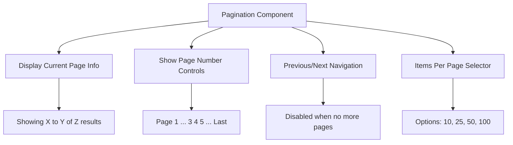
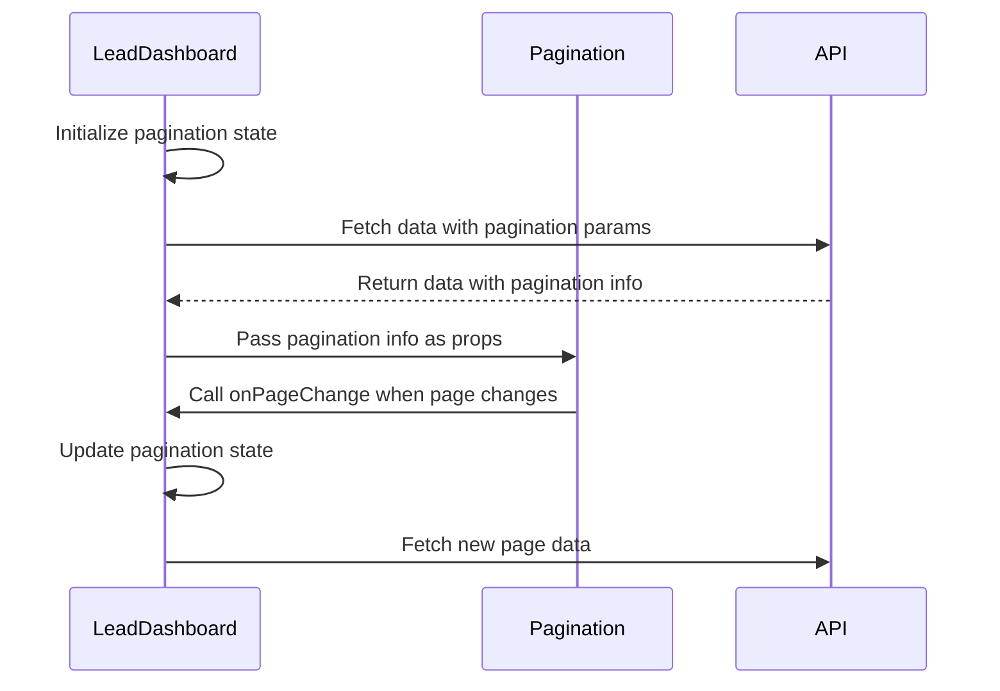
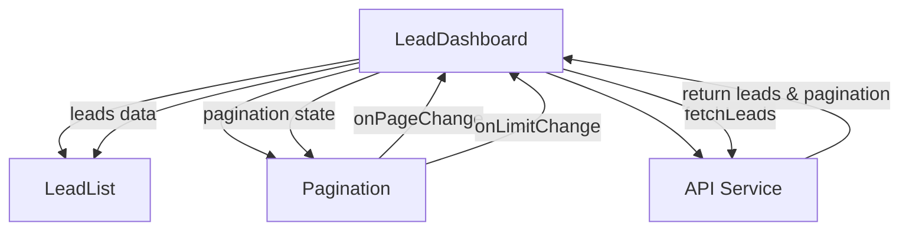

# Pagination Component

<cite>
**Referenced Files in This Document**   
- [Pagination.tsx](file://src/components/dashboard/Pagination.tsx)
- [LeadDashboard.tsx](file://src/components/dashboard/LeadDashboard.tsx)
- [LeadList.tsx](file://src/components/dashboard/LeadList.tsx)
- [types.ts](file://src/components/dashboard/types.ts)
- [route.ts](file://src/app/api/leads/route.ts)
</cite>

## Table of Contents
1. [Introduction](#introduction)
2. [Component Overview](#component-overview)
3. [Props and State Management](#props-and-state-management)
4. [Integration with LeadList and Backend APIs](#integration-with-leadlist-and-backend-apis)
5. [UI/UX Considerations](#uiux-considerations)
6. [Performance Implications and Common Issues](#performance-implications-and-common-issues)

## Introduction
The Pagination component is a critical UI element used throughout the dashboard for navigating large datasets. It provides users with intuitive controls to move between pages of data, adjust the number of items displayed per page, and view information about the current dataset. This documentation details the implementation, integration, and best practices for using the Pagination component within the application.

## Component Overview

The Pagination component is implemented as a React functional component that supports both page number navigation and previous/next controls. It displays information about the current page, total records, and allows users to change the number of items per page.



**Diagram sources**
- [Pagination.tsx](file://src/components/dashboard/Pagination.tsx#L1-L133)

**Section sources**
- [Pagination.tsx](file://src/components/dashboard/Pagination.tsx#L1-L133)

## Props and State Management

### Component Props
The Pagination component accepts the following props:

- **pagination**: An object of type `PaginationInfo` containing pagination metadata
- **onPageChange**: Callback function triggered when the user navigates to a different page
- **onLimitChange**: Callback function triggered when the user changes the number of items per page

The `PaginationInfo` interface is defined as:

```typescript
interface PaginationInfo {
  page: number
  limit: number
  totalCount: number
  totalPages: number
  hasNext: boolean
  hasPrev: boolean
}
```

### State Management
The component itself is stateless and relies on its parent component (typically `LeadDashboard`) to manage pagination state. The parent component maintains the pagination state and passes it down as props.



**Diagram sources**
- [LeadDashboard.tsx](file://src/components/dashboard/LeadDashboard.tsx#L18-L18)
- [Pagination.tsx](file://src/components/dashboard/Pagination.tsx#L6-L7)

**Section sources**
- [types.ts](file://src/components/dashboard/types.ts#L58-L65)
- [Pagination.tsx](file://src/components/dashboard/Pagination.tsx#L4-L7)

## Integration with LeadList and Backend APIs

### Integration with LeadList Component
The Pagination component is used in conjunction with the `LeadList` component within the `LeadDashboard`. When users navigate through pages, the pagination state is updated, triggering a re-fetch of lead data.



**Diagram sources**
- [LeadDashboard.tsx](file://src/components/dashboard/LeadDashboard.tsx#L166-L186)
- [LeadList.tsx](file://src/components/dashboard/LeadList.tsx#L1-L461)

**Section sources**
- [LeadDashboard.tsx](file://src/components/dashboard/LeadDashboard.tsx#L166-L186)

### Backend API Integration
The pagination system uses offset/limit-based pagination with the `/api/leads` endpoint. Query parameters are used to control pagination:

- **page**: Current page number (1-indexed)
- **limit**: Number of items per page
- **search**: Search term for filtering
- **status**: Filter by lead status
- **dateFrom/dateTo**: Date range filter
- **sortBy/sortOrder**: Sorting parameters

When the user changes pages or the number of items per page, these parameters are included in the API request:

```typescript
const params = new URLSearchParams({
    page: pagination.page.toString(),
    limit: pagination.limit.toString(),
    ...(filters.search && { search: filters.search }),
    ...(filters.status && { status: filters.status }),
    ...(filters.dateFrom && { dateFrom: filters.dateFrom }),
    ...(filters.dateTo && { dateTo: filters.dateTo }),
    sortBy,
    sortOrder
})
```

The backend processes these parameters and returns both the data and pagination metadata:

```json
{
    "leads": [...],
    "pagination": {
        "page": 1,
        "limit": 10,
        "totalCount": 150,
        "totalPages": 15,
        "hasNext": true,
        "hasPrev": false
    }
}
```

**Diagram sources**
- [route.ts](file://src/app/api/leads/route.ts#L23-L47)
- [LeadDashboard.tsx](file://src/components/dashboard/LeadDashboard.tsx#L29-L51)

**Section sources**
- [route.ts](file://src/app/api/leads/route.ts#L23-L166)
- [LeadDashboard.tsx](file://src/components/dashboard/LeadDashboard.tsx#L29-L67)

## UI/UX Considerations

### Responsive Design
The pagination component is designed to be responsive across different screen sizes:

- On mobile devices, the layout stacks vertically with the results info on top and pagination controls below
- On larger screens, the layout is horizontal with results info on the left and controls on the right
- Font sizes are reduced to `text-xs` to fit more information in limited space

The responsive behavior is implemented using Tailwind CSS classes:
```jsx
<div className="flex flex-col sm:flex-row sm:items-center sm:justify-between">
```

### Keyboard Navigation
The pagination component supports keyboard navigation through standard HTML button elements:

- Users can tab through the pagination controls
- Enter/Space keys activate buttons
- Disabled buttons are not focusable
- Screen readers announce button states appropriately

### Screen Reader Accessibility
The component includes several accessibility features:

- **SR-only text**: The previous and next buttons include `<span className="sr-only">Previous</span>` for screen readers
- **Semantic HTML**: Proper use of buttons and labels
- **ARIA attributes**: Implicit ARIA roles through proper element usage
- **Focus management**: Visual focus indicators through Tailwind's focus utilities

The "Per page" select element includes a proper label with `htmlFor` attribute:
```jsx
<label htmlFor="limit" className="text-xs text-gray-700">Per page:</label>
<select id="limit" ...>
```

**Section sources**
- [Pagination.tsx](file://src/components/dashboard/Pagination.tsx#L47-L133)

## Performance Implications and Common Issues

### Performance Considerations
The pagination implementation has several performance implications:

- **Offset-based pagination**: Uses `skip` and `take` parameters which can become slower as the offset increases
- **Client-side state management**: Pagination state is managed in React state, minimizing re-renders when possible
- **Debounced filtering**: When filters change, the page resets to 1, triggering a new API call

### Common Issues and Recommended Fixes

#### Issue: Incorrect Page State After Filtering
When users apply filters, the pagination state may become invalid if the total number of results changes significantly.

**Recommended Fix**: Reset to page 1 when filters change:
```typescript
const handleFiltersChange = (newFilters: LeadFilters) => {
    setFilters(newFilters)
    setPagination(prev => ({ ...prev, page: 1 }))
}
```

#### Issue: Large Offset Performance Degradation
With offset-based pagination, queries with large offsets can become slow as the database must scan through all previous records.

**Recommended Fix**: For very large datasets, consider implementing cursor-based pagination instead of offset-based pagination.

#### Issue: Inconsistent State Between Components
If the pagination state becomes out of sync between components, users may see incorrect data.

**Recommended Fix**: Centralize pagination state in the parent component (LeadDashboard) and pass it down as props to ensure consistency.

#### Issue: API Rate Limiting
Frequent page changes could potentially trigger API rate limits.

**Recommended Fix**: Implement debouncing on rapid page changes or consider caching strategies for recently viewed pages.

**Section sources**
- [LeadDashboard.tsx](file://src/components/dashboard/LeadDashboard.tsx#L82-L90)
- [route.ts](file://src/app/api/leads/route.ts#L38-L40)