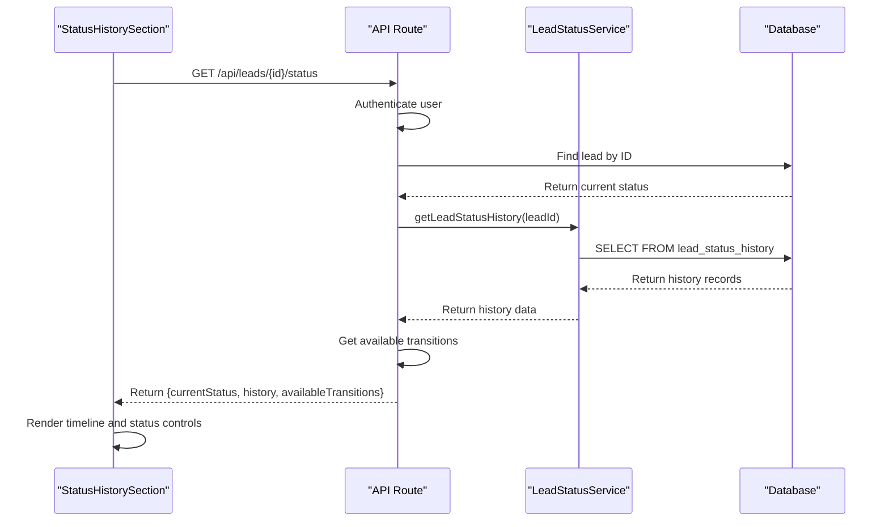
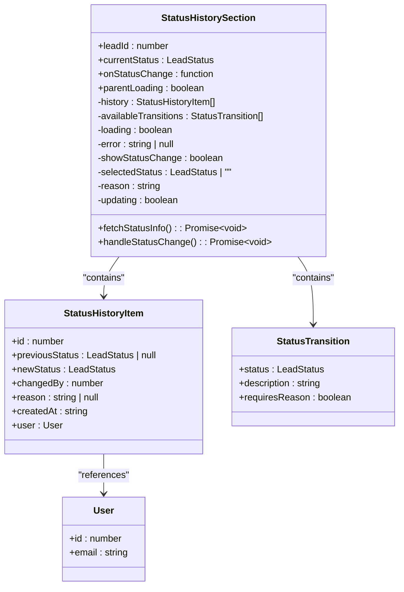
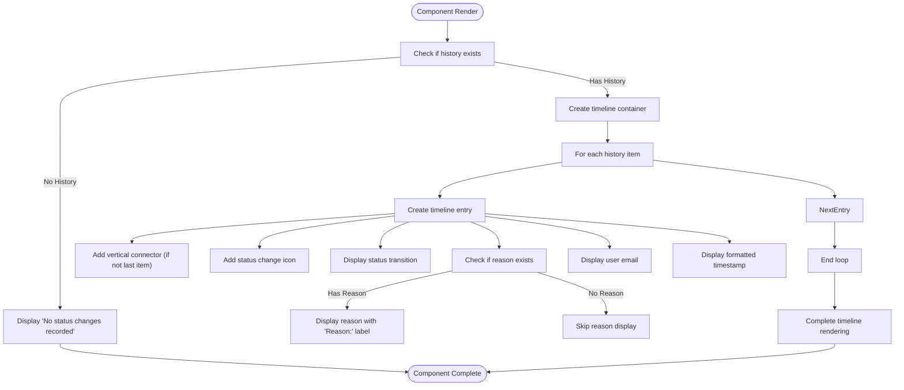
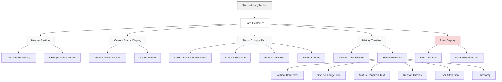

# Status History Section

<cite>
**Referenced Files in This Document**   
- [StatusHistorySection.tsx](file://src/components/dashboard/StatusHistorySection.tsx)
- [schema.prisma](file://prisma/schema.prisma)
- [route.ts](file://src/app/api/leads/[id]/status/route.ts)
- [LeadStatusService.ts](file://src/services/LeadStatusService.ts)
- [LeadDetailView.tsx](file://src/components/dashboard/LeadDetailView.tsx)
</cite>

## Table of Contents
1. [Introduction](#introduction)
2. [Data Source and Retrieval](#data-source-and-retrieval)
3. [Component Architecture](#component-architecture)
4. [Status History Timeline Rendering](#status-history-timeline-rendering)
5. [Styling and Visual Hierarchy](#styling-and-visual-hierarchy)
6. [Date Formatting and User Attribution](#date-formatting-and-user-attribution)
7. [Interactive Status Change Functionality](#interactive-status-change-functionality)
8. [Component Props and Interface](#component-props-and-interface)
9. [Error Handling and Loading States](#error-handling-and-loading-states)
10. [Performance Considerations](#performance-considerations)
11. [Integration with LeadDetailView](#integration-with-lead-detail-view)
12. [Troubleshooting Guide](#troubleshooting-guide)

## Introduction
The StatusHistorySection component provides a comprehensive chronological view of lead status changes within the lead management system. This component serves as a critical audit trail, displaying the complete history of status transitions for a specific lead, including timestamps, previous and next statuses, and user attribution. The component not only displays historical data but also enables authorized users to change the lead's status directly from the interface. Built using React with client-side rendering, the component fetches data from a dedicated API endpoint that queries the lead_status_history table through Prisma ORM. The visual design follows a timeline pattern with color-coded status indicators and interactive elements for status management.

**Section sources**
- [StatusHistorySection.tsx](file://src/components/dashboard/StatusHistorySection.tsx#L1-L375)

## Data Source and Retrieval
The StatusHistorySection component retrieves its data from the lead_status_history database table via a dedicated API endpoint. The data flow begins with the component making a client-side fetch request to `/api/leads/${leadId}/status`, which returns the current status, status history, and available transitions for the specified lead.

The lead_status_history table is defined in the Prisma schema with the following structure:
- id: Integer, primary key, auto-incremented
- leadId: Integer, foreign key referencing the leads table
- previousStatus: LeadStatus enum (nullable)
- newStatus: LeadStatus enum
- changedBy: Integer, foreign key referencing the users table
- reason: String (nullable)
- createdAt: DateTime with default value of current timestamp

The API route at `/src/app/api/leads/[id]/status/route.ts` handles the GET request by first authenticating the user, then retrieving the lead's current status from the leads table and the complete status history from the lead_status_history table through the LeadStatusService. The service uses Prisma's findMany method with an include clause to join the user information for each status change record.

**Diagram sources**
- [schema.prisma](file://prisma/schema.prisma#L180-L190)
- [route.ts](file://src/app/api/leads/[id]/status/route.ts#L1-L63)
- [LeadStatusService.ts](file://src/services/LeadStatusService.ts#L345-L393)

## Component Architecture
The StatusHistorySection component follows a client-side React architecture with state management for handling asynchronous data retrieval and user interactions. The component uses several React hooks to manage its state and side effects:

- useState: Manages component state including history data, available transitions, loading state, error messages, form visibility, selected status, reason text, and updating status
- useEffect: Triggers the initial data fetch when the component mounts
- useCallback: Memoizes the fetchStatusInfo function to prevent unnecessary re-creates

The component's architecture is designed around a single responsibility principle, focusing exclusively on displaying status history and enabling status changes. It receives essential props including the leadId, currentStatus, and optional callback functions. The component maintains its own state for the history data rather than relying solely on parent components, which allows it to refresh its data independently when a status change occurs.

The data retrieval process is encapsulated in the fetchStatusInfo function, which makes a fetch request to the API endpoint, processes the response, and updates the component state accordingly. Error handling is implemented with try-catch blocks and dedicated error state management. The component also implements a loading state with a skeleton loader UI to provide visual feedback during data retrieval.

**Diagram sources**
- [StatusHistorySection.tsx](file://src/components/dashboard/StatusHistorySection.tsx#L1-L375)

## Status History Timeline Rendering
The StatusHistorySection component renders the status history as a vertical timeline that visually represents the chronological sequence of status changes. Each timeline entry displays comprehensive information about a specific status transition, including the previous status, new status, reason for change (if provided), user attribution, and timestamp.

The timeline is implemented using an unordered list (`<ul>`) with custom styling to create the connecting lines between entries. Each list item represents a single status change and contains:
- A circular icon with a checkmark indicating the status change event
- A vertical line connecting consecutive entries (except for the last entry)
- Status change description showing transition from previous to new status
- Optional reason for the change, displayed when available
- User attribution showing the email of the user who made the change
- Timestamp of when the change occurred

When no status changes are recorded, the component displays a message "No status changes recorded." The timeline entries are rendered in reverse chronological order (most recent first) as determined by the orderBy clause in the Prisma query. The visual hierarchy emphasizes the status values through color-coded badges while secondary information is displayed in smaller, less prominent text.

**Diagram sources**
- [StatusHistorySection.tsx](file://src/components/dashboard/StatusHistorySection.tsx#L295-L374)

## Styling and Visual Hierarchy
The StatusHistorySection component employs Tailwind CSS for styling, creating a clear visual hierarchy that emphasizes important information while maintaining a clean, professional appearance. The component uses a card-based layout with a white background, shadow, and rounded corners to distinguish it from other content on the page.

Status values are displayed using color-coded badges that provide immediate visual feedback about the nature of each status:
- NEW: Gray background with dark gray text (bg-gray-100 text-gray-800)
- PENDING: Yellow background with dark yellow text (bg-yellow-100 text-yellow-800)
- IN_PROGRESS: Blue background with dark blue text (bg-blue-100 text-blue-800)
- COMPLETED: Green background with dark green text (bg-green-100 text-green-800)
- REJECTED: Red background with dark red text (bg-red-100 text-red-800)

The timeline itself uses subtle visual cues to enhance readability:
- A light gray vertical line (bg-gray-200) connects consecutive status changes
- Circular icons with checkmarks mark each status change event
- Proper spacing and padding create a balanced layout
- Text hierarchy is established through font sizes and weights

Interactive elements follow consistent styling patterns:
- The "Change Status" button uses indigo coloring with hover effects
- Form elements use standard border styling with focus rings
- Disabled states are indicated through opacity changes

The loading state features a skeleton loader with animated pulsing effects to indicate that content is being retrieved. Error messages are displayed in a dedicated red alert box with appropriate text coloring for visibility.

**Diagram sources**
- [StatusHistorySection.tsx](file://src/components/dashboard/StatusHistorySection.tsx#L1-L375)

## Date Formatting and User Attribution
The StatusHistorySection component handles date formatting and user attribution to provide clear context for each status change. Timestamps are displayed using the browser's default locale formatting through the toLocaleString() method, which automatically adapts to the user's regional settings.

The createdAt field from the database is stored as a DateTime value and passed to the frontend as an ISO string. The component converts this string to a JavaScript Date object and formats it for display: `{new Date(item.createdAt).toLocaleString()}`. This approach ensures consistent formatting across different browsers while respecting user preferences for date and time representation.

User attribution is implemented by including the user object in the status history query. Each history item contains a nested user object with id and email properties. The component displays the user's email address to identify who made each status change: `by {item.user.email}`. This provides accountability and allows team members to understand the workflow history.

When a status change occurs without a previous status (such as when a lead is first created), the component displays a dash (—) to indicate the absence of a previous status value. This maintains the visual consistency of the timeline while accurately representing the data.

The component also handles edge cases for user attribution:
- If the user record is somehow missing (though unlikely due to foreign key constraints), the email would be undefined
- The email display is straightforward text without additional formatting or interactivity
- No personal information beyond the email address is displayed for privacy reasons

## Interactive Status Change Functionality
The StatusHistorySection component includes interactive functionality that allows authorized users to change a lead's status directly from the interface. This feature is accessible via a "Change Status" button that toggles a form for selecting a new status and providing a reason when required.

The status change process involves several key components:
- A dropdown menu displaying only the available transitions based on the current status
- A reason textarea that becomes mandatory for certain status transitions
- Form validation that prevents submission when required fields are missing
- Loading states during API requests to prevent duplicate submissions

The available transitions are determined by business rules defined in the LeadStatusService, which implements a state machine pattern for lead status progression. For example:
- From NEW status: can transition to PENDING, IN_PROGRESS, or REJECTED
- From PENDING status: can transition to IN_PROGRESS, COMPLETED, or REJECTED
- From COMPLETED status: can only transition back to IN_PROGRESS (with reason required)
- From REJECTED status: can transition to PENDING or IN_PROGRESS (with reason required)

When a user selects a status that requires a reason, the form dynamically updates to make the reason field mandatory (indicated by a red asterisk). The submit button remains disabled until both a status is selected and, if required, a reason is provided.

Upon successful status change, the component automatically refreshes the status history by calling fetchStatusInfo(), ensuring the timeline reflects the most recent change. If a parent onStatusChange callback is provided, it is invoked with the new status and reason, allowing the parent component to respond to the change.

## Component Props and Interface
The StatusHistorySection component accepts several props that define its behavior and appearance:

**StatusHistorySectionProps**
- leadId: number (required) - The unique identifier of the lead whose status history should be displayed
- currentStatus: LeadStatus (required) - The current status of the lead, used to display the current status badge and determine available transitions
- onStatusChange: (newStatus: LeadStatus, reason?: string) => void (optional) - Callback function invoked when the status is successfully changed, receiving the new status and optional reason
- parentLoading: boolean (optional, default: false) - Flag indicating if the parent component is in a loading state, which suppresses rendering of this component to avoid duplicate loading indicators

The component also defines two internal interfaces for type safety:

**StatusHistoryItem**
- id: number - Unique identifier for the status history record
- previousStatus: LeadStatus | null - The status before the change (null for initial status)
- newStatus: LeadStatus - The status after the change
- changedBy: number - ID of the user who made the change
- reason: string | null - Optional reason for the status change
- createdAt: string - ISO timestamp of when the change occurred
- user: { id: number, email: string } - User object containing ID and email of the changing user

**StatusTransition**
- status: LeadStatus - The target status for a possible transition
- description: string - Human-readable description of the status
- requiresReason: boolean - Indicates whether a reason is required for this transition

These TypeScript interfaces ensure type safety throughout the component and provide clear documentation of the data structure expected by the component.

**Section sources**
- [StatusHistorySection.tsx](file://src/components/dashboard/StatusHistorySection.tsx#L30-L45)

## Error Handling and Loading States
The StatusHistorySection component implements comprehensive error handling and loading state management to provide a robust user experience. The component manages several states to reflect different conditions during its lifecycle.

Loading states are handled through two mechanisms:
- Component-level loading: Managed by the loading state variable, displayed as a skeleton loader with animated pulsing effects
- Parent-level loading: Controlled by the parentLoading prop, which causes the component to render null to avoid duplicate loading indicators

The skeleton loader uses Tailwind's animate-pulse class to create a subtle animation that indicates content is being loaded. This provides immediate visual feedback to users while data is being retrieved from the API.

Error handling is implemented through:
- try-catch blocks around asynchronous operations
- A dedicated error state variable that stores error messages
- Visual error display using a red alert box with descriptive text
- Comprehensive error messaging that distinguishes between different types of errors

When an error occurs during data retrieval, the component displays the error message in a prominently styled box with red coloring for high visibility. The error message may contain details from the API response or generic messages like "Failed to fetch status information" or "Unknown error occurred."

The component also handles form submission errors, such as when the API rejects a status change due to validation rules. These errors are captured in the same error state and displayed alongside the form, providing immediate feedback to the user about what went wrong.

All error states are non-blocking, allowing users to retry operations or navigate away from the component without being stuck in an error state.

**Section sources**
- [StatusHistorySection.tsx](file://src/components/dashboard/StatusHistorySection.tsx#L60-L92)

## Performance Considerations
The StatusHistorySection component incorporates several performance optimizations to ensure efficient rendering and data handling, particularly when dealing with leads that have extensive status histories.

Data retrieval is optimized through:
- Single API request that returns all necessary data (current status, history, and available transitions)
- Server-side sorting of history records by createdAt in descending order
- Prisma's efficient query generation and execution

The component minimizes re-renders through:
- useCallback hook to memoize the fetchStatusInfo function
- Dependency array in useEffect to prevent unnecessary data fetching
- Local state management that isolates the component from parent re-renders

For rendering performance with long histories:
- The component uses React's built-in list rendering with unique keys (item.id)
- No complex calculations or transformations are performed on each render
- The timeline structure is simple and efficient to render

Potential performance improvements could include:
- Implementing pagination for very long histories
- Adding virtualization for large numbers of history entries
- Caching responses to reduce API calls when navigating between leads

The component also considers network performance by:
- Making only one API call to retrieve all necessary data
- Using efficient JSON serialization
- Implementing proper error handling to prevent infinite retry loops

When rendering is suppressed due to parentLoading, the component returns null instead of a loading state, preventing unnecessary DOM elements from being created and improving overall application performance.

## Integration with LeadDetailView
The StatusHistorySection component is designed to be integrated within the LeadDetailView component as one of several sections displaying different aspects of a lead's information. Although the exact import and usage cannot be confirmed from the available code search results, the component's design and props indicate it is intended to be a child component of LeadDetailView.

The integration likely follows this pattern:
- LeadDetailView fetches comprehensive lead data including current status
- LeadDetailView passes the leadId and currentStatus as props to StatusHistorySection
- Optionally, LeadDetailView may provide an onStatusChange callback to respond to status changes
- The parentLoading prop allows LeadDetailView to coordinate loading states

This integration enables the StatusHistorySection to function as a modular, reusable component that can be easily incorporated into different views or potentially used in other contexts where lead status history needs to be displayed.

The component's self-contained nature, with its own data fetching and state management, makes it resilient to changes in the parent component and allows it to refresh its data independently when status changes occur.

**Section sources**
- [StatusHistorySection.tsx](file://src/components/dashboard/StatusHistorySection.tsx#L47-L92)
- [LeadDetailView.tsx](file://src/components/dashboard/LeadDetailView.tsx)

## Troubleshooting Guide
When encountering issues with the StatusHistorySection component, consider the following common problems and solutions:

**Display Inconsistencies**
- **Problem**: Status history not updating after a change
  - **Solution**: Verify that the onStatusChange callback is properly implemented in the parent component and that fetchStatusInfo is being called after successful status changes

- **Problem**: Incorrect available transitions in the dropdown
  - **Solution**: Check that the currentStatus prop is being passed correctly from the parent component and matches the actual current status in the database

- **Problem**: User emails not displaying
  - **Solution**: Verify that the API response includes the user object in the history records and that the Prisma query includes the user relation

**Functional Issues**
- **Problem**: "Change Status" button not appearing
  - **Solution**: Confirm that availableTransitions has data by checking the API response; this typically indicates no valid transitions are defined for the current status

- **Problem**: Form submission failing with no error message
  - **Solution**: Check browser developer tools for network errors; ensure the API endpoint is accessible and properly authenticated

- **Problem**: Required reason field not enforcing validation
  - **Solution**: Verify that the selectedTransition object correctly identifies when a reason is required based on the business rules in LeadStatusService

**Performance Issues**
- **Problem**: Slow loading with long status histories
  - **Solution**: Consider implementing pagination or virtualization for leads with extensive histories

- **Problem**: Multiple loading states displayed
  - **Solution**: Ensure parent components pass the parentLoading prop correctly to coordinate loading states

**Data Issues**
- **Problem**: Missing status changes in the timeline
  - **Solution**: Verify that status changes are being properly recorded in the lead_status_history table by checking the database directly

- **Problem**: Timestamps displaying incorrectly
  - **Solution**: Confirm that createdAt values are being passed as valid ISO strings and that the browser's toLocaleString() method is functioning correctly

When troubleshooting, always check the browser's developer console for JavaScript errors and the network tab for API response details, as these often provide the most direct insight into the root cause of issues.