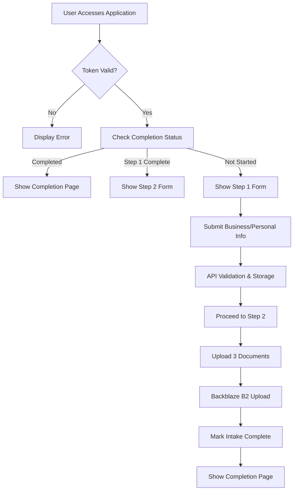
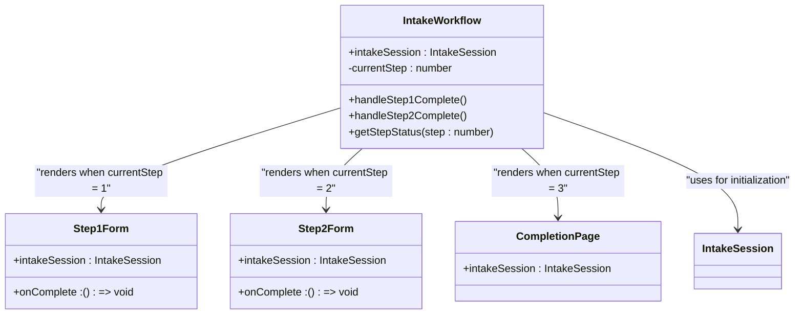
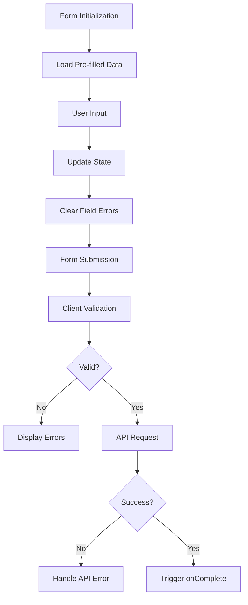
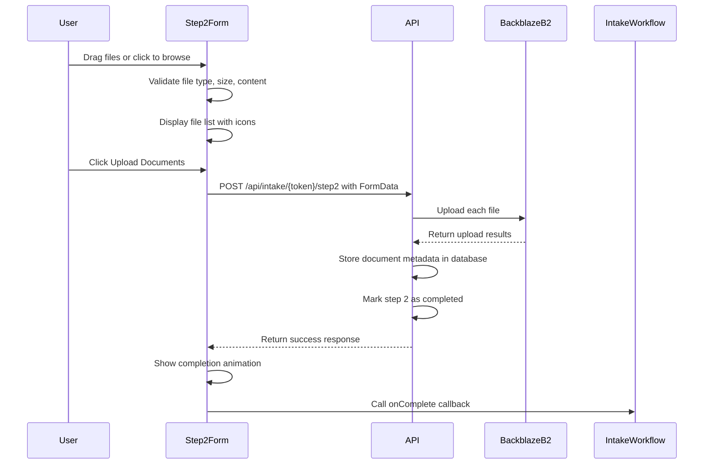
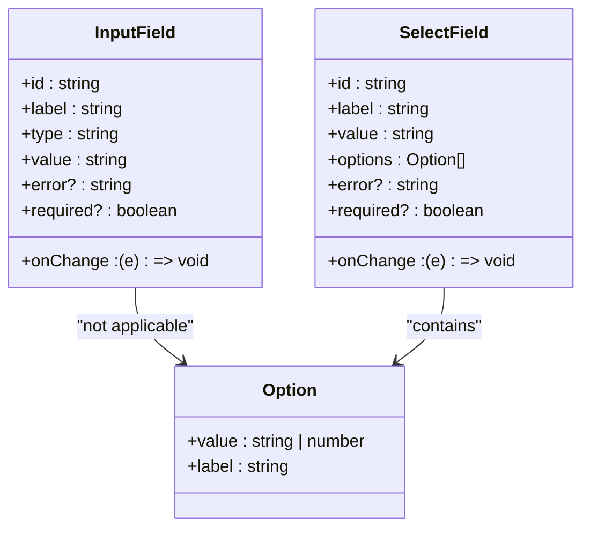
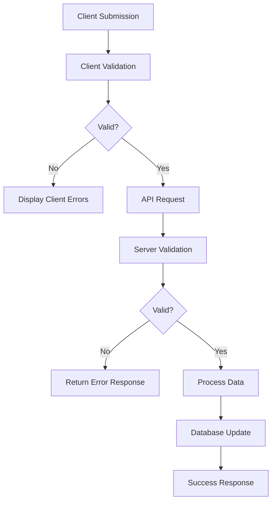
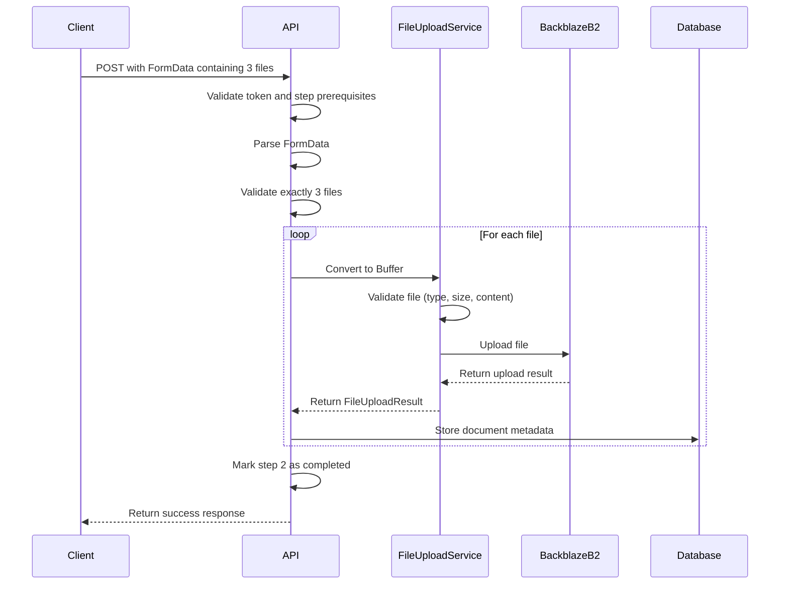

# Intake Components

<cite>
**Referenced Files in This Document**   
- [IntakeWorkflow.tsx](file://src/components/intake/IntakeWorkflow.tsx)
- [Step1Form.tsx](file://src/components/intake/Step1Form.tsx)
- [Step2Form.tsx](file://src/components/intake/Step2Form.tsx)
- [CompletionPage.tsx](file://src/components/intake/CompletionPage.tsx)
- [InputField.tsx](file://src/components/intake/InputField.tsx)
- [SelectField.tsx](file://src/components/intake/SelectField.tsx)
- [TokenService.ts](file://src/services/TokenService.ts)
- [step1/route.ts](file://src/app/api/intake/[token]/step1/route.ts)
- [step2/route.ts](file://src/app/api/intake/[token]/step2/route.ts)
- [FileUploadService.ts](file://src/services/FileUploadService.ts)
</cite>

## Table of Contents
1. [Intake Workflow Overview](#intake-workflow-overview)
2. [Core Components](#core-components)
3. [State Management and Navigation](#state-management-and-navigation)
4. [Form Validation Strategies](#form-validation-strategies)
5. [File Upload Integration](#file-upload-integration)
6. [Error Recovery Patterns](#error-recovery-patterns)
7. [Extending the Workflow](#extending-the-workflow)

## Intake Workflow Overview

The intake process in the fund-track application is a multi-step workflow designed to collect business funding application data from prospects. The system uses token-based authentication to securely identify users and maintain session state across steps. The workflow consists of three main stages: business/personal information collection (Step 1), document upload (Step 2), and completion confirmation.

The process begins when a prospect receives a unique token via email or another channel. This token is validated against the database to ensure authenticity and prevent unauthorized access. The workflow is designed to be resilient to interruptions, allowing users to resume where they left off if they navigate away or close their browser.



**Diagram sources**
- [IntakeWorkflow.tsx](file://src/components/intake/IntakeWorkflow.tsx#L1-L95)
- [TokenService.ts](file://src/services/TokenService.ts#L6-L54)

**Section sources**
- [IntakeWorkflow.tsx](file://src/components/intake/IntakeWorkflow.tsx#L1-L95)
- [TokenService.ts](file://src/services/TokenService.ts#L6-L54)

## Core Components

### IntakeWorkflow

The IntakeWorkflow component serves as the orchestrator of the multi-step application process. It manages navigation between steps based on the user's progress and token validation status. The component uses React's useState hook to maintain the current step state, initializing it based on the intake session data.



**Diagram sources**
- [IntakeWorkflow.tsx](file://src/components/intake/IntakeWorkflow.tsx#L1-L95)

**Section sources**
- [IntakeWorkflow.tsx](file://src/components/intake/IntakeWorkflow.tsx#L1-L95)

### Step1Form

The Step1Form component collects comprehensive business and personal information from applicants. It contains 28 fields organized into three sections: Business Details, Personal Details, and Legal Information. The form uses controlled components to manage state, with each input field bound to a corresponding property in the formData state object.

The component implements client-side validation for required fields, email formats, phone numbers, and numeric ranges. When the form is submitted, it sends the data to the backend API for server-side validation and storage. The form displays a progress indicator showing the user's position in the overall workflow.



**Diagram sources**
- [Step1Form.tsx](file://src/components/intake/Step1Form.tsx#L0-L399)

**Section sources**
- [Step1Form.tsx](file://src/components/intake/Step1Form.tsx#L0-L399)

### Step2Form

The Step2Form component handles document uploads, specifically requiring exactly three financial documents such as bank statements. It supports drag-and-drop functionality as well as traditional file selection. The component validates files against type (PDF, JPG, PNG, DOCX), size (maximum 10MB), and emptiness constraints.

The upload process provides visual feedback through progress indicators and status messages. Users can remove files before uploading and see details like file size and type. The component enforces the requirement of exactly three valid files before enabling the upload button.



**Diagram sources**
- [Step2Form.tsx](file://src/components/intake/Step2Form.tsx#L0-L312)
- [step2/route.ts](file://src/app/api/intake/[token]/step2/route.ts#L0-L152)

**Section sources**
- [Step2Form.tsx](file://src/components/intake/Step2Form.tsx#L0-L312)

### InputField and SelectField

These reusable form control components provide consistent styling, validation, and accessibility features across the application. InputField handles text inputs of various types (text, email, tel, date, number), while SelectField manages dropdown selections.

Both components support error states, required field indicators, and custom styling through className props. They implement proper labeling for screen readers and keyboard navigation. The error messages are displayed below the input with appropriate color coding for visibility.



**Diagram sources**
- [InputField.tsx](file://src/components/intake/InputField.tsx#L0-L55)
- [SelectField.tsx](file://src/components/intake/SelectField.tsx#L0-L56)

**Section sources**
- [InputField.tsx](file://src/components/intake/InputField.tsx#L0-L55)
- [SelectField.tsx](file://src/components/intake/SelectField.tsx#L0-L56)

### CompletionPage

The CompletionPage component displays a success message and next steps after the user completes the intake process. It features a prominent checkmark icon and confirmation text. The page provides clear information about what happens next, including timeline expectations and contact information for support.

The component is minimal in functionality, serving primarily as a confirmation screen with no interactive elements beyond the ability to navigate away. It reinforces the successful completion of the application process and sets appropriate expectations for follow-up.

**Section sources**
- [CompletionPage.tsx](file://src/components/intake/CompletionPage.tsx#L0-L57)

## State Management and Navigation

The intake workflow manages state through a combination of client-side React state and server-side token validation. The IntakeWorkflow component initializes the current step based on the intake session data, which contains flags indicating completion status for each step.

```typescript
const [currentStep, setCurrentStep] = useState(() => {
  if (intakeSession.isCompleted) return 3;
  if (intakeSession.step1Completed) return 2;
  return 1;
});
```

Navigation between steps is controlled through callback functions passed from IntakeWorkflow to the form components. When Step1Form completes successfully, it calls the handleStep1Complete function, which updates the currentStep state to 2. Similarly, Step2Form calls handleStep2Complete to advance to the completion page.

The progress indicator in IntakeWorkflow uses a helper function to determine the status of each step:

```typescript
const getStepStatus = (step: number) => {
  if (step < currentStep) return 'completed';
  if (step === currentStep) return 'current';
  return 'upcoming';
};
```

This approach ensures that users can resume their application at the correct step if they leave and return later. The token validation process retrieves the user's progress from the database, allowing the workflow to reconstruct the appropriate state.

**Section sources**
- [IntakeWorkflow.tsx](file://src/components/intake/IntakeWorkflow.tsx#L1-L95)

## Form Validation Strategies

The intake process implements a comprehensive validation strategy with both client-side and server-side validation layers.

### Client-Side Validation

Step1Form implements immediate feedback validation that clears error messages when users begin typing in a field:

```typescript
const handleInputChange = (e: React.ChangeEvent<HTMLInputElement | HTMLSelectElement>) => {
  const { name, value } = e.target;
  const fieldName = name as keyof Step1FormData;

  setFormData(prev => ({
    ...prev,
    [fieldName]: value
  }));
  
  // Clear error when user starts typing
  if (errors[fieldName]) {
    setErrors(prev => ({
      ...prev,
      [fieldName]: undefined
    }));
  }
};
```

The validation includes:
- Required field checks for all 28 fields
- Email format validation using regex
- Phone number format validation
- Numeric range validation for ownership percentage (0-100) and years in business (0-100)

### Server-Side Validation

The API routes perform the same validation checks as the client, ensuring data integrity even if the client-side validation is bypassed. The step1 API route validates required fields, email formats, phone formats, and numeric ranges before updating the database.



This dual validation approach provides a good user experience with immediate feedback while maintaining data security and integrity.

**Section sources**
- [Step1Form.tsx](file://src/components/intake/Step1Form.tsx#L199-L398)
- [step1/route.ts](file://src/app/api/intake/[token]/step1/route.ts#L0-L304)

## File Upload Integration

The document upload functionality integrates with Backblaze B2 for secure cloud storage. The process involves client-side validation, server-side processing, and integration with the FileUploadService.

### Client-Side Upload Process

Step2Form manages the upload process with the following workflow:
1. File selection through drag-and-drop or file browser
2. Client validation of file type, size, and content
3. Limiting to exactly three files
4. Visual feedback through progress indicators
5. Form submission with FormData

### Server-Side Processing

The step2 API route handles the file upload process:



### Backblaze B2 Integration

The FileUploadService class manages the Backblaze B2 integration with the following features:
- Connection initialization and authorization
- File validation based on type, size, and extension
- Unique filename generation to prevent conflicts
- Secure upload with metadata including lead ID
- Error handling and logging
- Download URL generation with expiration
- File deletion and listing capabilities

Files are stored with a structured path: `leads/{leadId}/{timestamp}-{hash}-{originalName}`. This organization allows for easy retrieval and management of documents associated with specific leads.

**Section sources**
- [Step2Form.tsx](file://src/components/intake/Step2Form.tsx#L0-L312)
- [step2/route.ts](file://src/app/api/intake/[token]/step2/route.ts#L0-L152)
- [FileUploadService.ts](file://src/services/FileUploadService.ts#L0-L307)

## Error Recovery Patterns

The intake process implements several error recovery patterns to ensure reliability and a good user experience.

### Token Validation and Session Management

The TokenService handles token validation and session state retrieval. If a token is invalid or expired, the user receives an appropriate error message. The service retrieves the user's progress from the database, allowing them to resume at the correct step.

### API Error Handling

Both client and server components implement comprehensive error handling:

```typescript
try {
  const response = await fetch(`/api/intake/${intakeSession.token}/step1`, {
    method: 'POST',
    headers: { 'Content-Type': 'application/json' },
    body: JSON.stringify(formData),
  });

  if (!response.ok) {
    const errorData = await response.json();
    console.error('API Error:', errorData);
    
    if (errorData.missingFields) {
      alert(`Please fill in the following required fields: ${errorData.missingFields.join(', ')}`);
    } else {
      alert(errorData.error || 'Failed to save step 1 data');
    }
    return;
  }

  onComplete();
} catch (error) {
  console.error('Error submitting step 1:', error);
  alert('There was an error saving your information. Please try again.');
} finally {
  setIsSubmitting(false);
}
```

The error handling includes:
- Network error detection with try/catch
- HTTP status code checking
- Specific error message parsing
- User-friendly alert messages
- Loading state cleanup in finally block

### File Upload Error Recovery

The file upload process includes specific error recovery mechanisms:
- Individual file validation with error messages
- Progress reset on upload failure
- Detailed error logging
- Transactional approach where all three files must succeed
- Prevention of partial uploads

### Database Transaction Safety

The step2 API route uses a pseudo-transactional approach by updating the database only after successful file uploads. If any file fails to upload, the entire process is aborted, preventing inconsistent states.

**Section sources**
- [step1/route.ts](file://src/app/api/intake/[token]/step1/route.ts#L0-L304)
- [step2/route.ts](file://src/app/api/intake/[token]/step2/route.ts#L0-L152)
- [FileUploadService.ts](file://src/services/FileUploadService.ts#L0-L307)

## Extending the Workflow

The intake workflow can be extended to support additional steps or functionality. The current architecture provides a solid foundation for expansion.

### Adding New Steps

To add a new step (e.g., Step 3 for additional verification), modify the IntakeWorkflow component:

```typescript
const [currentStep, setCurrentStep] = useState(() => {
  if (intakeSession.isCompleted) return 4;
  if (intakeSession.step2Completed) return 3;
  if (intakeSession.step1Completed) return 2;
  return 1;
});

// Add new callback
const handleStep3Complete = () => {
  setCurrentStep(4);
};

// Add new route in render
{currentStep === 3 && (
  <Step3Form 
    intakeSession={intakeSession} 
    onComplete={handleStep3Complete}
  />
)}
```

Update the IntakeSession interface and TokenService to include step3Completed and related fields. Create new API routes for the additional step and update the database schema accordingly.

### Custom Validation Rules

The validation system can be extended with custom rules by adding new validation functions to Step1Form or creating a validation service. For example, to add business name uniqueness validation:

```typescript
// Add to validateForm function
const checkBusinessNameUniqueness = async () => {
  const response = await fetch(`/api/check-business-name?name=${formData.businessName}`);
  const data = await response.json();
  if (!data.unique) {
    newErrors.businessName = 'A business with this name already exists';
  }
};
```

### Enhanced File Upload Features

The file upload functionality can be enhanced with features like:
- Preview for image files
- PDF thumbnail generation
- OCR processing for document content extraction
- Virus scanning
- Automated document classification

These features would require additional backend services and potentially third-party APIs, but the current FileUploadService architecture supports such extensions.

**Section sources**
- [IntakeWorkflow.tsx](file://src/components/intake/IntakeWorkflow.tsx#L1-L95)
- [TokenService.ts](file://src/services/TokenService.ts#L6-L54)